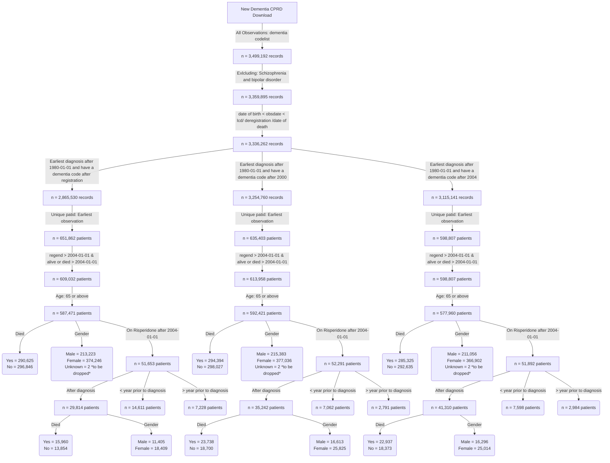

**This is the distribution of number of diagnosis per year for patients diagnosed after registration**


**This is the distribution of number of diagnosis per year for patients diagnosed after 2000**


**This is the distribution of number of prescriptions per year for patients diagnosed after 2004**


**BMJ codes vs ours**


```
BMJ codes	279
Our codes	631
Common codes	86
```
**Flow chart of the final cohorts**


**Dementia incident cohort**


```
                                             
                                             
                                              Overall       
  n                                           353255        
  diagnosedbeforeRegistration = 1 (%)          77403 (21.9) 
  died = 1 (%)                                174204 (49.3) 
  age_diagnosis (mean (SD))                    82.25 (7.10) 
  age_category (%)                                          
     65-74                                     53220 (15.1) 
     75-84                                    159585 (45.2) 
     85-94                                    128631 (36.4) 
     95+                                       11819 ( 3.3) 
  year_of_diagnosis (%)                                     
     2004                                      17502 ( 5.0) 
     2005                                      14865 ( 4.2) 
     2006                                      16620 ( 4.7) 
     2007                                      14520 ( 4.1) 
     2008                                      14931 ( 4.2) 
     2009                                      16317 ( 4.6) 
     2010                                      17437 ( 4.9) 
     2011                                      18395 ( 5.2) 
     2012                                      20029 ( 5.7) 
     2013                                      21675 ( 6.1) 
     2014                                      23469 ( 6.6) 
     2015                                      23301 ( 6.6) 
     2016                                      20765 ( 5.9) 
     2017                                      20374 ( 5.8) 
     2018                                      19268 ( 5.5) 
     2019                                      18785 ( 5.3) 
     2020                                      14879 ( 4.2) 
     2021                                      15410 ( 4.4) 
     2022                                      14326 ( 4.1) 
     2023                                      10387 ( 2.9) 
  gender_decode = M (%)                       122481 (34.7) 
  pre_diagnoses_af = 1 (%)                     46688 (13.2) 
  post_diagnoses_af = 1 (%)                    22901 ( 6.5) 
  af_ever = 1 (%)                              71047 (20.1) 
  pre_diagnoses_angina = 1 (%)                 38974 (11.0) 
  post_diagnoses_angina = 1 (%)                 4583 ( 1.3) 
  angina_ever = 1 (%)                          43776 (12.4) 
  pre_diagnoses_anxiety_disorders = 1 (%)      52839 (15.0) 
  post_diagnoses_anxiety_disorders = 1 (%)      8377 ( 2.4) 
  anxiety_disorders_ever = 1 (%)               61794 (17.5) 
  pre_diagnoses_falls = 1 (%)                  88512 (25.1) 
  post_diagnoses_falls = 1 (%)                 97633 (27.6) 
  falls_ever = 1 (%)                          188256 (53.3) 
  pre_diagnoses_fh_diabetes = 1 (%)            70720 (20.0) 
  post_diagnoses_fh_diabetes = 1 (%)            4579 ( 1.3) 
  fh_diabetes_ever = 1 (%)                     75477 (21.4) 
  heartfailure_ever = 1 (%)                    41583 (11.8) 
  pre_diagnoses_lowerlimbfracture = 1 (%)      43571 (12.3) 
  post_diagnoses_lowerlimbfracture = 1 (%)     26109 ( 7.4) 
  lowerlimbfracture_ever = 1 (%)               70334 (19.9) 
  pre_diagnoses_myocardialinfarction = 1 (%)   26861 ( 7.6) 
  post_diagnoses_myocardialinfarction = 1 (%)   5709 ( 1.6) 
  myocardialinfarction_ever = 1 (%)            32860 ( 9.3) 
  pre_diagnoses_qof_diabetes = 1 (%)           47756 (13.5) 
  post_diagnoses_qof_diabetes = 1 (%)          18426 ( 5.2) 
  qof_diabetes_ever = 1 (%)                    67059 (19.0) 
  pre_diagnoses_revasc = 1 (%)                 18445 ( 5.2) 
  post_diagnoses_revasc = 1 (%)                  832 ( 0.2) 
  revasc_ever = 1 (%)                          19332 ( 5.5) 
  pre_diagnoses_stroke = 1 (%)                 38087 (10.8) 
  post_diagnoses_stroke = 1 (%)                16028 ( 4.5) 
  stroke_ever = 1 (%)                          55527 (15.7) 
  pre_diagnoses_tia = 1 (%)                    29408 ( 8.3) 
  post_diagnoses_tia = 1 (%)                    9919 ( 2.8) 
  tia_ever = 1 (%)                             39813 (11.3) 
  alcohol_cat (%)                                           
     Excess                                    17897 ( 5.1) 
     Harmful                                    9010 ( 2.6) 
     None                                      33247 ( 9.4) 
     Unknown                                   98566 (27.9) 
     Within limits                            194535 (55.1) 
  smoking_cat (%)                                           
     Active smoker                             28397 ( 8.0) 
     Ex-smoker                                141985 (40.2) 
     Non-smoker                               114276 (32.3) 
     Unknown                                   68597 (19.4) 
  qrisk2_smoking_cat (%)                                    
     0                                        152478 (43.2) 
     1                                         88230 (25.0) 
     2                                         27182 ( 7.7) 
     3                                           942 ( 0.3) 
     4                                           693 ( 0.2) 
     Unknown                                   83730 (23.7) 
  qrisk2_smoking_cat_uncoded (%)                            
     Ex-smoker                                 88230 (25.0) 
     Heavy smoker                                693 ( 0.2) 
     Light smoker                              27182 ( 7.7) 
     Moderate smoker                             942 ( 0.3) 
     Non-smoker                               152478 (43.2) 
     Unknown                                   83730 (23.7) 
  gp_5cat_ethnicity (%)                                     
     Black                                      6004 ( 1.7) 
     Mixed                                      1063 ( 0.3) 
     Other                                      1687 ( 0.5) 
     South Asian                                6953 ( 2.0) 
     Unknown                                   91545 (25.9) 
     White                                    246003 (69.6) 
  gp_16cat_ethnicity (%)                                    
     African                                    1101 ( 0.3) 
     Bangladeshi                                 628 ( 0.2) 
     Caribbean                                  4368 ( 1.2) 
     Chinese                                     378 ( 0.1) 
     Indian                                     3507 ( 1.0) 
     Other                                      1324 ( 0.4) 
     Other Asian                                1372 ( 0.4) 
     Other Black                                 483 ( 0.1) 
     Other Mixed                                 287 ( 0.1) 
     Other White                                7423 ( 2.1) 
     Pakistani                                  1399 ( 0.4) 
     Unknown                                   91821 (26.0) 
     White and Asian                             133 ( 0.0) 
     White and Black African                     165 ( 0.0) 
     White and Black Caribbean                   487 ( 0.1) 
     White British                            234396 (66.4) 
     White Irish                                3983 ( 1.1) 
  gp_qrisk2_ethnicity (%)                                   
     Bangladeshi                                 628 ( 0.2) 
     Black African                              1091 ( 0.3) 
     Black Caribbean                            4345 ( 1.2) 
     Chinese                                     376 ( 0.1) 
     Indian                                     3504 ( 1.0) 
     Other                                      2945 ( 0.8) 
     Other Asian                                1364 ( 0.4) 
     Pakistani                                  1398 ( 0.4) 
     Unknown                                   91614 (25.9) 
     White                                    245990 (69.6) 
  pre_diagnoses_deep_vein_thrombosis = 1 (%)   14894 ( 4.2) 
  post_diagnoses_deep_vein_thrombosis = 1 (%)   6581 ( 1.9) 
  deep_vein_thrombosis_ever = 1 (%)            21662 ( 6.1) 
  pre_diagnoses_pulmonary_embolism = 1 (%)      7555 ( 2.1) 
  post_diagnoses_pulmonary_embolism = 1 (%)     3213 ( 0.9) 
  pulmonary_embolism_ever = 1 (%)              10883 ( 3.1) 
  VTE = 1 (%)                                  10883 ( 3.1)  

```


```
           strata   median    lower    upper
1 gender_decode=F 5.037645 5.010267 5.067762
2 gender_decode=M 4.350445 4.314853 4.386037
```


```
               strata   median    lower    upper
1 age_category=65-74 7.882272 7.800137 7.972621
2 age_category=75-84 5.505818 5.470226 5.538672
3 age_category=85-94 3.340178 3.318275 3.364819
4   age_category=95+ 1.711157 1.642710 1.757700

```

**Risperidone incident cohort**
```
                                                         Overall        
  n                                                        23959         
  diagnosedbeforeRegistration = 1 (%)                      10457 ( 43.6) 
  died = 1 (%)                                             13638 ( 56.9) 
  age_risperidone (mean (SD))                              82.89 (6.93)  
  age_category (%)                                                       
     65 - 74                                                5399 ( 22.5) 
     75 - 84                                               11459 ( 47.8) 
     85+                                                    7101 ( 29.6) 
  stroke_3_months_prior = 1 (%)                              123 (  0.5) 
  stroke_6_months_prior = 1 (%)                              181 (  0.8) 
  stroke_12_months_prior = 1 (%)                             289 (  1.2) 
  prescribed_BMJ_antipsyc_drug = 1 (%)                     20545 ( 85.8) 
  stroke_recency_cat (%)                                                 
      <= 1                                                   289 ( 10.1) 
      > 7                                                   2403 ( 84.3) 
     1 - 2                                                   113 (  4.0) 
     2 - 3                                                    41 (  1.4) 
     3 - 4                                                     3 (  0.1) 
  Stroke_prior_to_risperidone = 1 (%)                       2687 ( 11.2) 
  Stroke__within_year_after_1st_risperidone_presc = 1 (%)    325 (  1.4) 
  death_in_a_year_after_risperidone = 1 (%)                 5550 ( 23.2) 
  sex = 1 (%)                                               9065 ( 37.8) 
  dementia_duration_prior_risperidone (mean (SD))           2.10 (2.33)  
  Survival_time (mean (SD))                                 1.77 (1.90)  
  comorbidity_af = 1 (%)                                    4184 ( 17.5) 
  pre_index_date_af = 1 (%)                                 3743 ( 15.6) 
  post_index_date_af = 1 (%)                                1416 (  5.9) 
  comorbidity_angina = 1 (%)                                2821 ( 11.8) 
  pre_index_date_angina = 1 (%)                             2754 ( 11.5) 
  post_index_date_angina = 1 (%)                             265 (  1.1) 
  comorbidity_anxiety_disorders = 1 (%)                     4885 ( 20.4) 
  pre_index_date_anxiety_disorders = 1 (%)                  4679 ( 19.5) 
  post_index_date_anxiety_disorders = 1 (%)                  546 (  2.3) 
  comorbidity_falls = 1 (%)                                13329 ( 55.6) 
  pre_index_date_falls = 1 (%)                              9596 ( 40.1) 
  post_index_date_falls = 1 (%)                             7092 ( 29.6) 
  comorbidity_fh_diabetes = 1 (%)                           4745 ( 19.8) 
  pre_index_date_fh_diabetes = 1 (%)                        4673 ( 19.5) 
  post_index_date_fh_diabetes = 1 (%)                        103 (  0.4) 
  comorbidity_fh_premature_cvd = 1 (%)                      1814 (  7.6) 
  pre_index_date_fh_premature_cvd = 1 (%)                   1790 (  7.5) 
  post_index_date_fh_premature_cvd = 1 (%)                    35 (  0.1) 
  comorbidity_heartfailure = 1 (%)                          2116 (  8.8) 
  pre_index_date_heartfailure = 1 (%)                       1800 (  7.5) 
  post_index_date_heartfailure = 1 (%)                       698 (  2.9) 
  comorbidity_lowerlimbfracture = 1 (%)                     4962 ( 20.7) 
  pre_index_date_lowerlimbfracture = 1 (%)                  3726 ( 15.6) 
  post_index_date_lowerlimbfracture = 1 (%)                 1563 (  6.5) 
  comorbidity_myocardialinfarction = 1 (%)                  2023 (  8.4) 
  pre_index_date_myocardialinfarction = 1 (%)               1910 (  8.0) 
  post_index_date_myocardialinfarction = 1 (%)               208 (  0.9) 
  comorbidity_qof_diabetes = 1 (%)                          4307 ( 18.0) 
  pre_index_date_qof_diabetes = 1 (%)                       4055 ( 16.9) 
  post_index_date_qof_diabetes = 1 (%)                      1898 (  7.9) 
  comorbidity_revasc = 1 (%)                                1263 (  5.3) 
  pre_index_date_revasc = 1 (%)                             1257 (  5.2) 
  post_index_date_revasc = 1 (%)                              19 (  0.1) 
  comorbidity_stroke = 1 (%)                                3326 ( 13.9) 
  pre_index_date_stroke = 1 (%)                             2849 ( 11.9) 
  post_index_date_stroke = 1 (%)                             846 (  3.5) 
  stroke_cat = ischaemic (%)                                2838 ( 85.3) 
  comorbidity_tia = 1 (%)                                   2522 ( 10.5) 
  pre_index_date_tia = 1 (%)                                2159 (  9.0) 
  post_index_date_tia = 1 (%)                                553 (  2.3) 
  comorbidity_deep_vein_thrombosis = 1 (%)                  1552 (  6.5) 
  pre_index_date_deep_vein_thrombosis = 1 (%)               1174 (  4.9) 
  post_index_date_deep_vein_thrombosis = 1 (%)               448 (  1.9) 
  comorbidity_haem_cancer = 0 (%)                          23959 (100.0) 
  pre_index_date_haem_cancer = 0 (%)                       23959 (100.0) 
  post_index_date_haem_cancer = 0 (%)                      23959 (100.0) 
  comorbidity_pulmonary_embolism = 1 (%)                     712 (  3.0) 
  pre_index_date_pulmonary_embolism = 1 (%)                  541 (  2.3) 
  post_index_date_pulmonary_embolism = 1 (%)                 203 (  0.8) 
  comorbidity_solid_cancer = 0 (%)                         23959 (100.0) 
  pre_index_date_solid_cancer = 0 (%)                      23959 (100.0) 
  post_index_date_solid_cancer = 0 (%)                     23959 (100.0) 
  VTE = 1 (%)                                               2107 (  8.8) 
  BMI (%)                                                                
     Normal                                                 8721 ( 36.4) 
     Obesity                                                3074 ( 12.8) 
     Overweight                                             6731 ( 28.1) 
     Severely Obese                                          226 (  0.9) 
     Underweight                                            1093 (  4.6) 
     Unknown                                                4114 ( 17.2) 
  totalcholesterol (%)                                                   
     < 160 mg/dl                                            5288 ( 22.1) 
     > 280 mg/dl                                             843 (  3.5) 
     199 mg/dl                                              5957 ( 24.9) 
     200 - 239 mg/dl                                        5119 ( 21.4) 
     240 - 279 mg/dl                                        2287 (  9.5) 
     Unknown                                                4465 ( 18.6) 
  testvalue_dbp (mean (SD))                                76.37 (11.78) 
  testvalue_sbp (mean (SD))                               135.79 (20.34) 
  testvalue_totalcholesterol (mean (SD))                    4.99 (1.25)  
  gp_5cat_ethnicity (%)                                                  
     Black                                                   359 (  1.5) 
     Mixed                                                    78 (  0.3) 
     Other                                                   123 (  0.5) 
     South Asian                                             385 (  1.6) 
     Unknown                                                5730 ( 23.9) 
     White                                                 17284 ( 72.1) 
  gp_16cat_ethnicity (%)                                                 
     African                                                  62 (  0.3) 
     Bangladeshi                                              29 (  0.1) 
     Caribbean                                               254 (  1.1) 
     Chinese                                                  18 (  0.1) 
     Indian                                                  195 (  0.8) 
     Other                                                   107 (  0.4) 
     Other Asian                                              72 (  0.3) 
     Other Black                                              41 (  0.2) 
     Other Mixed                                              17 (  0.1) 
     Other White                                             545 (  2.3) 
     Pakistani                                                84 (  0.4) 
     Unknown                                                5750 ( 24.0) 
     White and Asian                                          14 (  0.1) 
     White and Black African                                   8 (  0.0) 
     White and Black Caribbean                                38 (  0.2) 
     White British                                         16473 ( 68.8) 
     White Irish                                             252 (  1.1) 
  gp_qrisk2_ethnicity (%)                                                
     Bangladeshi                                              29 (  0.1) 
     Black African                                            62 (  0.3) 
     Black Caribbean                                         254 (  1.1) 
     Chinese                                                  18 (  0.1) 
     Indian                                                  195 (  0.8) 
     Other                                                   225 (  0.9) 
     Other Asian                                              71 (  0.3) 
     Pakistani                                                84 (  0.4) 
     Unknown                                                5737 ( 23.9) 
     White                                                 17284 ( 72.1) 
  alcohol_cat (%)                                                        
     Excess                                                 1153 (  4.8) 
     Harmful                                                 655 (  2.7) 
     None                                                   1790 (  7.5) 
     Unknown                                                8600 ( 35.9) 
     Within limits                                         11761 ( 49.1) 
  smoking_cat (%)                                                        
     Active smoker                                          1657 (  6.9) 
     Ex-smoker                                              8759 ( 36.6) 
     Non-smoker                                             6662 ( 27.8) 
     Unknown                                                6881 ( 28.7) 
  qrisk2_smoking_cat (%)                                                 
     0                                                      8781 ( 36.7) 
     1                                                      5697 ( 23.8) 
     2                                                      1627 (  6.8) 
     3                                                        58 (  0.2) 
     4                                                        30 (  0.1) 
     Unknown                                                7766 ( 32.4) 
  qrisk2_smoking_cat_uncoded (%)                                         
     Ex-smoker                                              5697 ( 23.8) 
     Heavy smoker                                             30 (  0.1) 
     Light smoker                                           1627 (  6.8) 
     Moderate smoker                                          58 (  0.2) 
     Non-smoker                                             8781 ( 36.7) 
     Unknown                                                7766 ( 32.4) 
  drug_name (%)                                                          
     amisulpride                                             245 (  2.0) 
     aripiprazole                                            212 (  1.8) 
     benperidol                                                9 (  0.1) 
     chlorpromazine                                          124 (  1.0) 
     clozapine                                                 1 (  0.0) 
     flupentixol                                             171 (  1.4) 
     fluphenazine                                              7 (  0.1) 
     haloperidol                                            1726 ( 14.3) 
     levomepromazine                                        1448 ( 12.0) 
     olanzapine                                              859 (  7.1) 
     pericyazine                                              18 (  0.1) 
     perphenazine                                              3 (  0.0) 
     pimozide                                                133 (  1.1) 
     prochlorperazine                                       4949 ( 41.1) 
     promazine                                               337 (  2.8) 
     quetiapine                                             1555 ( 12.9) 
     sulpiride                                                45 (  0.4) 
     thioridazine                                             71 (  0.6) 
     trifluoperazine                                         109 (  0.9) 
     zuclopenthixol                                            9 (  0.1) 
  frailty (%)                                                            
     Mild                                                   1118 (  4.7) 
     Moderate                                               2745 ( 11.5) 
     Severe                                                 4196 ( 17.5) 
     Unknown                                               15900 ( 66.4) 
  year_diagnosis_cat (%)                                                 
     > 2020                                                  934 (  3.9) 
     2004 - 2008                                            4214 ( 17.6) 
     2009 - 2012                                            6330 ( 26.4) 
     2013 - 2016                                            7606 ( 31.7) 
     2017 - 2020                                            4875 ( 20.3) 
  prescribed_other_antipsyc_drug = 1 (%)                   12031 ( 50.2) 
  pre_indexdate_antipysch_prescr = 1 (%)                    7990 ( 66.4) 
  post_indexdate_antipysch_prescr = 1 (%)                   3973 ( 33.0) 
  same_indexdate_antipysch_prescr = 1 (%)                     68 (  0.6) 
  pre_indexdate_drug_name (%)                                            
     amisulpride                                             151 (  1.9) 
     aripiprazole                                             62 (  0.8) 
     benperidol                                                6 (  0.1) 
     chlorpromazine                                           97 (  1.2) 
     clozapine                                                 1 (  0.0) 
     flupentixol                                             159 (  2.0) 
     fluphenazine                                              7 (  0.1) 
     haloperidol                                             727 (  9.1) 
     levomepromazine                                          66 (  0.8) 
     olanzapine                                              477 (  6.0) 
     pericyazine                                              17 (  0.2) 
     perphenazine                                              3 (  0.0) 
     pimozide                                                 92 (  1.2) 
     prochlorperazine                                       4679 ( 58.6) 
     promazine                                               253 (  3.2) 
     quetiapine                                              991 ( 12.4) 
     sulpiride                                                34 (  0.4) 
     thioridazine                                             71 (  0.9) 
     trifluoperazine                                          92 (  1.2) 
     zuclopenthixol                                            5 (  0.1) 
  same_indexdate_drug_name (%)                                           
     amisulpride                                               2 (  2.9) 
     aripiprazole                                              6 (  8.8) 
     chlorpromazine                                            4 (  5.9) 
     flupentixol                                               2 (  2.9) 
     haloperidol                                              14 ( 20.6) 
     levomepromazine                                           1 (  1.5) 
     pimozide                                                  7 ( 10.3) 
     prochlorperazine                                          4 (  5.9) 
     promazine                                                10 ( 14.7) 
     quetiapine                                               16 ( 23.5) 
     trifluoperazine                                           2 (  2.9) 
  post_indexdate_drug_name (%)                                           
     amisulpride                                              89 (  2.2) 
     aripiprazole                                            139 (  3.5) 
     benperidol                                                2 (  0.1) 
     chlorpromazine                                           23 (  0.6) 
     flupentixol                                              10 (  0.3) 
     haloperidol                                            1110 ( 27.9) 
     levomepromazine                                        1245 ( 31.3) 
     olanzapine                                              372 (  9.4) 
     pericyazine                                               3 (  0.1) 
     pimozide                                                 33 (  0.8) 
     prochlorperazine                                        257 (  6.5) 
     promazine                                                87 (  2.2) 
     quetiapine                                              579 ( 14.6) 
     sulpiride                                                 8 (  0.2) 
     trifluoperazine                                          12 (  0.3) 
     zuclopenthixol                                            4 (  0.1) 
  care_home = 1 (%)                                         9947 ( 41.5) 
  care_home_before_indexdate = 1 (%)                        3206 ( 32.2) 
  care_home_at_indexdate = 1 (%)                             110 (  1.1) 
  care_home_90_days_after_indexdate = 1 (%)                 2186 ( 22.0) 
  TimeSinceFirstPrescription (mean (SD))                    0.47 (0.89)  
  Prescription_ever_cat (%)                                              
     >100                                                    435 (  1.8) 
     1                                                      4038 ( 16.9) 
     10                                                      619 (  2.6) 
     11 - 20                                                4126 ( 17.2) 
     2                                                      2095 (  8.7) 
     21 - 30                                                2212 (  9.2) 
     3                                                      1525 (  6.4) 
     31 - 40                                                1302 (  5.4) 
     4                                                      1262 (  5.3) 
     41 - 50                                                 788 (  3.3) 
     5                                                      1035 (  4.3) 
     51 - 100                                               1346 (  5.6) 
     6                                                       900 (  3.8) 
     7                                                       831 (  3.5) 
     8                                                       749 (  3.1) 
     9                                                       696 (  2.9) 
  Prescriptions_after_a_year_cat (%)                                     
     >100                                                    238 (  3.0) 
     1                                                       550 (  6.9) 
     10                                                      237 (  3.0) 
     11 - 20                                                1705 ( 21.3) 
     2                                                       493 (  6.2) 
     21 - 30                                                 957 ( 12.0) 
     3                                                       435 (  5.4) 
     31 - 40                                                 609 (  7.6) 
     4                                                       379 (  4.7) 
     41 - 50                                                 391 (  4.9) 
     5                                                       335 (  4.2) 
     51 - 100                                                579 (  7.2) 
     6                                                       306 (  3.8) 
     7                                                       300 (  3.8) 
     8                                                       242 (  3.0) 
     9                                                       242 (  3.0) 
  Prescriptions_within_a_year_cat (%)                                    
     >100                                                     10 (  0.0) 
     1                                                      4202 ( 17.5) 
     10                                                      767 (  3.2) 
     11 - 20                                                7623 ( 31.8) 
     2                                                      2168 (  9.0) 
     21 - 30                                                 673 (  2.8) 
     3                                                      1582 (  6.6) 
     31 - 40                                                 247 (  1.0) 
     4                                                      1320 (  5.5) 
     41 - 50                                                 219 (  0.9) 
     5                                                      1105 (  4.6) 
     51 - 100                                                422 (  1.8) 
     6                                                       999 (  4.2) 
     7                                                       970 (  4.0) 
     8                                                       860 (  3.6) 
     9                                                       792 (  3.3) 
  consultation_counts_Cat (%)                                            
     0 - 50                                                 8858 ( 37.5) 
     101 - 150                                              3996 ( 16.9) 
     151 - 200                                              1410 (  6.0) 
     201 - 250                                               525 (  2.2) 
     251 - 300                                               223 (  0.9) 
     301 - 350                                                86 (  0.4) 
     351 - 400                                                37 (  0.2) 
     401 - 450                                                23 (  0.1) 
     451 - 500                                                16 (  0.1) 
     501 - 800                                                20 (  0.1) 
     51 - 100                                               8440 ( 35.7) 
     801 - 1000                                                3 (  0.0) 
  pre_BMJ_indexdate_drug_name (%)                                        
     amisulpride                                             137 (  8.9) 
     aripiprazole                                             14 (  0.9) 
     benperidol                                                6 (  0.4) 
     chlorpromazine                                           97 (  6.3) 
     clozapine                                                 1 (  0.1) 
     flupentixol                                             100 (  6.5) 
     fluphenazine                                              6 (  0.4) 
     haloperidol                                             679 ( 44.0) 
     levomepromazine                                           5 (  0.3) 
     olanzapine                                               39 (  2.5) 
     pericyazine                                              17 (  1.1) 
     pimozide                                                  5 (  0.3) 
     prochlorperazine                                        272 ( 17.6) 
     promazine                                                40 (  2.6) 
     quetiapine                                               57 (  3.7) 
     sulpiride                                                14 (  0.9) 
     thioridazine                                             26 (  1.7) 
     trifluoperazine                                          26 (  1.7) 
     zuclopenthixol                                            1 (  0.1) 
  same_BMJ_indexdate_drug_name (%)                                       
     amisulpride                                              72 (  0.9) 
     aripiprazole                                            153 (  1.9) 
     benperidol                                                2 (  0.0) 
     chlorpromazine                                           24 (  0.3) 
     flupentixol                                              52 (  0.6) 
     fluphenazine                                              1 (  0.0) 
     haloperidol                                             923 ( 11.2) 
     levomepromazine                                        1025 ( 12.4) 
     olanzapine                                              620 (  7.5) 
     pericyazine                                               3 (  0.0) 
     perphenazine                                              3 (  0.0) 
     pimozide                                                104 (  1.3) 
     prochlorperazine                                       3761 ( 45.6) 
     promazine                                               234 (  2.8) 
     quetiapine                                             1150 ( 14.0) 
     sulpiride                                                20 (  0.2) 
     thioridazine                                             37 (  0.4) 
     trifluoperazine                                          54 (  0.7) 
     zuclopenthixol                                            3 (  0.0) 
  post_BMJ_indexdate_drug_name (%)                                       
     amisulpride                                              26 (  3.8) 
     aripiprazole                                             17 (  2.5) 
     chlorpromazine                                            3 (  0.4) 
     flupentixol                                               7 (  1.0) 
     haloperidol                                             117 ( 16.9) 
     levomepromazine                                          73 ( 10.5) 
     olanzapine                                               57 (  8.2) 
     pimozide                                                  7 (  1.0) 
     prochlorperazine                                        248 ( 35.8) 
     promazine                                                18 (  2.6) 
     quetiapine                                              106 ( 15.3) 
     sulpiride                                                 3 (  0.4) 
     trifluoperazine                                           8 (  1.2) 
     zuclopenthixol                                            3 (  0.4) 
  comorbidity_hypertension (%)                                           
     Elevated                                               2656 ( 11.1) 
     Normal                                                 3378 ( 14.1) 
     Stage 1                                               10539 ( 44.0) 
     Stage 2                                                6865 ( 28.7) 
     Stage 3 (severe)                                        155 (  0.6) 
     Unknown                                                 366 (  1.5) 
  pre_index_date_hypertension = 1 (%)                      19705 ( 83.5) 
  comorbidity_hearing_loss = 1 (%)                          6561 ( 27.4) 
  pre_index_date_hearing_loss = 1 (%)                       6163 ( 25.7) 
  post_index_date_hearing_loss = 1 (%)                       868 (  3.6) 
  pre_indexdate_BMJ_antipysch_prescr = 1 (%)                1553 (  7.6) 
  post_indexdate_BMJ_antipysch_prescr = 1 (%)               1392 (  6.8) 
  same_indexdate_BMJ_antipysch_prescr = 1 (%)              17600 ( 85.7) 
                               
```


```
           strata   median    lower    upper
1 gender_decode=F 2.483231 2.417522 2.562628
2 gender_decode=M 1.957563 1.905544 2.031485
```


```
                strata   median    lower    upper
1 age_category=65 - 74 3.586585 3.416838 3.712526
2 age_category=75 - 84 2.447639 2.373717 2.513347
3     age_category=85+ 1.464750 1.401780 1.527721

```


**COX model**
```
Call:
coxph(formula = Surv(Survival_time, post_index_date_stroke) ~ 
    age_diagnosis + pre_index_date_stroke + sex, data = CompleteData)

  n= 23959, number of events= 846 

                           coef exp(coef) se(coef)      z Pr(>|z|)    
age_diagnosis          0.013706  1.013801 0.005042  2.719  0.00656 ** 
pre_index_date_stroke1 1.903718  6.710798 0.069880 27.243  < 2e-16 ***
sex1                   0.174512  1.190665 0.072553  2.405  0.01616 *  
---
Signif. codes:  0 ‘***’ 0.001 ‘**’ 0.01 ‘*’ 0.05 ‘.’ 0.1 ‘ ’ 1

                       exp(coef) exp(-coef) lower .95 upper .95
age_diagnosis              1.014     0.9864     1.004     1.024
pre_index_date_stroke1     6.711     0.1490     5.852     7.696
sex1                       1.191     0.8399     1.033     1.373

Concordance= 0.726  (se = 0.011 )
Likelihood ratio test= 640.9  on 3 df,   p=<2e-16
Wald test            = 776.8  on 3 df,   p=<2e-16
Score (logrank) test = 1043  on 3 df,   p=<2e-16

```


**One year censoring**

```
Call:
coxph(formula = Surv(Survival_time, post_index_date_stroke) ~ 
    age_diagnosis + pre_index_date_stroke + sex, data = CensoringData_1year)

  n= 23940, number of events= 501 
   (19 observations deleted due to missingness)

                           coef exp(coef) se(coef)      z Pr(>|z|)    
age_diagnosis          0.010646  1.010703 0.006488  1.641   0.1008    
pre_index_date_stroke1 2.196622  8.994583 0.090048 24.394   <2e-16 ***
sex1                   0.199762  1.221113 0.092650  2.156   0.0311 *  
---
Signif. codes:  0 ‘***’ 0.001 ‘**’ 0.01 ‘*’ 0.05 ‘.’ 0.1 ‘ ’ 1

                       exp(coef) exp(-coef) lower .95 upper .95
age_diagnosis              1.011     0.9894    0.9979     1.024
pre_index_date_stroke1     8.995     0.1112    7.5393    10.731
sex1                       1.221     0.8189    1.0183     1.464

Concordance= 0.742  (se = 0.013 )
Likelihood ratio test= 546.2  on 3 df,   p=<2e-16
Wald test            = 619.1  on 3 df,   p=<2e-16
Score (logrank) test = 915.7  on 3 df,   p=<2e-16
```

**Excluding stroke 3 months prior**


```
Call:
coxph(formula = Surv(Survival_time, post_index_date_stroke) ~ 
    age_diagnosis + pre_index_date_stroke + sex, data = Excluding_3_monthsPriorStroke)

  n= 23836, number of events= 789 

                           coef exp(coef) se(coef)      z Pr(>|z|)    
age_diagnosis          0.017014  1.017160 0.005212  3.264   0.0011 ** 
pre_index_date_stroke1 1.769601  5.868512 0.073380 24.116   <2e-16 ***
sex1                   0.176362  1.192870 0.075323  2.341   0.0192 *  
---
Signif. codes:  0 ‘***’ 0.001 ‘**’ 0.01 ‘*’ 0.05 ‘.’ 0.1 ‘ ’ 1

                       exp(coef) exp(-coef) lower .95 upper .95
age_diagnosis              1.017     0.9831     1.007     1.028
pre_index_date_stroke1     5.869     0.1704     5.082     6.776
sex1                       1.193     0.8383     1.029     1.383

Concordance= 0.706  (se = 0.011 )
Likelihood ratio test= 499.9  on 3 df,   p=<2e-16
Wald test            = 615.9  on 3 df,   p=<2e-16
Score (logrank) test = 794.9  on 3 df,   p=<2e-16


```


**Excluding stroke 12 months prior**


```
Call:
coxph(formula = Surv(Survival_time, post_index_date_stroke) ~ 
    age_diagnosis + pre_index_date_stroke + sex, data = Excluding_12_monthsPriorStroke)

  n= 23670, number of events= 744 

                           coef exp(coef) se(coef)      z Pr(>|z|)    
age_diagnosis          0.019554  1.019747 0.005376  3.637 0.000276 ***
pre_index_date_stroke1 1.663083  5.275553 0.076970 21.607  < 2e-16 ***
sex1                   0.184390  1.202484 0.077672  2.374 0.017598 *  
---
Signif. codes:  0 ‘***’ 0.001 ‘**’ 0.01 ‘*’ 0.05 ‘.’ 0.1 ‘ ’ 1

                       exp(coef) exp(-coef) lower .95 upper .95
age_diagnosis              1.020     0.9806     1.009     1.031
pre_index_date_stroke1     5.276     0.1896     4.537     6.135
sex1                       1.202     0.8316     1.033     1.400

Concordance= 0.689  (se = 0.012 )
Likelihood ratio test= 401.8  on 3 df,   p=<2e-16
Wald test            = 501  on 3 df,   p=<2e-16
Score (logrank) test = 627.7  on 3 df,   p=<2e-16

```


**Matching**

***Treatment baseline characteristic***

```
                                                        
                                                          Overall       
  n                                                       23755         
  sex = 1 (%)                                              8961 ( 37.7) 
  risperidone = 1 (%)                                     23755 (100.0) 
  age_diagnosis (mean (SD))                               80.35 (7.18)  
  Stroke__within_year_after_1st_risperidone_presc = 1 (%)   220 (  0.9) 
  pre_index_date_angina = 1 (%)                            2743 ( 11.5) 
  pre_index_date_heartfailure = 1 (%)                      1794 (  7.6) 
  BMI (%)                                                               
     Missing                                               5118 ( 21.5) 
     Normal                                                8982 ( 37.8) 
     Obesity                                               2404 ( 10.1) 
     Overweight                                            5745 ( 24.2) 
     Severely Obese                                         156 (  0.7) 
     Underweight                                           1350 (  5.7) 
  Prescribed_other_antipsychotic_Prior = 1 (%)             7017 ( 29.5) 
  period_before_prescription (mean (SD))                   2.56 (2.37)  
  comorbidity_myocardialinfarction = 1 (%)                 1938 (  8.2) 
  pre_index_date_stroke = 1 (%)                            2842 ( 12.0) 
  pre_index_date_tia = 1 (%)                               2144 (  9.0) 
  pre_index_date_falls = 1 (%)                             9576 ( 40.3) 
  pre_index_date_lowerlimbfracture = 1 (%)                 3707 ( 15.6) 
  pre_index_date_ihd = 1 (%)                               3890 ( 16.4) 
  pre_index_date_pad = 1 (%)                               1829 (  7.7) 
  pre_index_date_af = 1 (%)                                3723 ( 15.7) 
  pre_index_date_revasc = 1 (%)                            1251 (  5.3) 
  pre_index_date_qof_diabetes = 1 (%)                      4035 ( 17.0) 
  pre_index_date_anxiety_disorders = 1 (%)                 4652 ( 19.6) 
  pre_index_date_fh_diabetes = 1 (%)                       4662 ( 19.6) 
  pre_index_date_fh_premature_cvd = 1 (%)                  1785 (  7.5) 
  pre_index_date_pulmonary_embolism = 1 (%)                 538 (  2.3) 
  pre_index_date_deep_vein_thrombosis = 1 (%)              1169 (  4.9) 
  pre_index_date_hearing_loss = 1 (%)                      6149 ( 25.9) 
  VTE = 1 (%)                                              1739 (  7.3) 
  gp_5cat_ethnicity (%)                                                 
     Black                                                  359 (  1.5) 
     Mixed                                                   78 (  0.3) 
     Other                                                  123 (  0.5) 
     South Asian                                            381 (  1.6) 
     Unknown                                               5644 ( 23.8) 
     White                                                17170 ( 72.3) 
  comorbidity_hypertension (%)                                          
     Elevated                                              4056 ( 17.1) 
     Normal                                                5978 ( 25.2) 
     Stage 1                                               9110 ( 38.3) 
     Stage 2                                               3701 ( 15.6) 
     Stage 3 (severe)                                        33 (  0.1) 
     Unknown                                                877 (  3.7) 
  Survival_time (mean (SD))                                1.81 (1.94)  

```

***Controls baselines characteristics***

```
                                                         Overall       
  n                                                       117264        
  sex = 1 (%)                                              44566 (38.0) 
  risperidone = 1 (%)                                          0 ( 0.0) 
  age_diagnosis (mean (SD))                                80.27 (7.05) 
  Stroke__within_year_after_1st_risperidone_presc = 1 (%)   1989 ( 1.7) 
  pre_index_date_angina = 1 (%)                            13396 (11.4) 
  pre_index_date_heartfailure = 1 (%)                       8594 ( 7.3) 
  BMI (%)                                                               
     Missing                                               25134 (21.4) 
     Normal                                                44128 (37.6) 
     Obesity                                               11973 (10.2) 
     Overweight                                            28566 (24.4) 
     Severely Obese                                          789 ( 0.7) 
     Underweight                                            6674 ( 5.7) 
  Prescribed_other_antipsychotic_Prior = 1 (%)             35107 (29.9) 
  period_before_prescription (mean (SD))                    2.58 (2.80) 
  comorbidity_myocardialinfarction = 1 (%)                  9880 ( 8.4) 
  pre_index_date_stroke = 1 (%)                            14181 (12.1) 
  pre_index_date_tia = 1 (%)                               10648 ( 9.1) 
  pre_index_date_falls = 1 (%)                             47593 (40.6) 
  pre_index_date_lowerlimbfracture = 1 (%)                 18318 (15.6) 
  pre_index_date_ihd = 1 (%)                               19071 (16.3) 
  pre_index_date_pad = 1 (%)                                9070 ( 7.7) 
  pre_index_date_af = 1 (%)                                18452 (15.7) 
  pre_index_date_revasc = 1 (%)                             6143 ( 5.2) 
  pre_index_date_qof_diabetes = 1 (%)                      19807 (16.9) 
  pre_index_date_anxiety_disorders = 1 (%)                 23364 (19.9) 
  pre_index_date_fh_diabetes = 1 (%)                       23112 (19.7) 
  pre_index_date_fh_premature_cvd = 1 (%)                   8849 ( 7.5) 
  pre_index_date_pulmonary_embolism = 1 (%)                 2674 ( 2.3) 
  pre_index_date_deep_vein_thrombosis = 1 (%)               5681 ( 4.8) 
  pre_index_date_hearing_loss = 1 (%)                      30345 (25.9) 
  VTE = 1 (%)                                               8564 ( 7.3) 
  gp_5cat_ethnicity (%)                                                 
     Black                                                  1822 ( 1.6) 
     Mixed                                                   398 ( 0.3) 
     Other                                                   559 ( 0.5) 
     South Asian                                            1965 ( 1.7) 
     Unknown                                               27481 (23.4) 
     White                                                 85039 (72.5) 
  comorbidity_hypertension (%)                                          
     Elevated                                              20188 (17.2) 
     Normal                                                29936 (25.5) 
     Stage 1                                               45515 (38.8) 
     Stage 2                                               18381 (15.7) 
     Stage 3 (severe)                                        168 ( 0.1) 
     Unknown                                                3076 ( 2.6) 
  Survival_time (mean (SD))                                 1.85 (1.84) 

```

***Controls vs Treatment cases***

```

                                             Stratified by risperidone
                                               0              1              p      test SMD   
  n                                            160934         32366                            
  sex = 1 (%)                                   65663 (40.8)  13190 ( 40.8)   0.876       0.001
  risperidone = 1 (%)                               0 ( 0.0)  32366 (100.0)  <0.001         NaN
  age_diagnosis (mean (SD))                     80.45 (7.00)  80.55 (7.14)    0.020       0.014
  pre_index_date_angina = 1 (%)                 18921 (11.8)   3809 ( 11.8)   0.961      <0.001
  pre_index_date_heartfailure = 1 (%)           12120 ( 7.5)   2466 (  7.6)   0.592       0.003
  BMI (%)                                                                     0.939       0.007
     Missing                                    79893 (49.6)  15983 ( 49.4)                    
     Normal                                     40249 (25.0)   8154 ( 25.2)                    
     Obesity                                     9181 ( 5.7)   1869 (  5.8)                    
     Overweight                                 23341 (14.5)   4716 ( 14.6)                    
     Severely Obese                               564 ( 0.4)    114 (  0.4)                    
     Underweight                                 7706 ( 4.8)   1530 (  4.7)                    
  Prescribed_other_antipsychotic_Prior = 1 (%)  38054 (23.6)   7328 ( 22.6)  <0.001       0.024
  period_before_prescription (mean (SD))         2.47 (2.02)   2.39 (2.35)   <0.001       0.035
  comorbidity_myocardialinfarction = 1 (%)      13539 ( 8.4)   2749 (  8.5)   0.641       0.003
  pre_index_date_stroke = 1 (%)                 18965 (11.8)   3870 ( 12.0)   0.385       0.005
  pre_index_date_tia = 1 (%)                    14928 ( 9.3)   2982 (  9.2)   0.731       0.002
  pre_index_date_falls = 1 (%)                  65985 (41.0)  13261 ( 41.0)   0.927       0.001
  pre_index_date_lowerlimbfracture = 1 (%)      24916 (15.5)   5019 ( 15.5)   0.917       0.001
  pre_index_date_ihd = 1 (%)                    26772 (16.6)   5407 ( 16.7)   0.763       0.002
  pre_index_date_pad = 1 (%)                    12065 ( 7.5)   2447 (  7.6)   0.701       0.002
  pre_index_date_af = 1 (%)                     26035 (16.2)   5327 ( 16.5)   0.214       0.008
  pre_index_date_revasc = 1 (%)                  8995 ( 5.6)   1825 (  5.6)   0.734       0.002
  pre_index_date_qof_diabetes = 1 (%)           27982 (17.4)   5660 ( 17.5)   0.670       0.003
  pre_index_date_anxiety_disorders = 1 (%)      32234 (20.0)   6367 ( 19.7)   0.144       0.009
  pre_index_date_fh_diabetes = 1 (%)            32634 (20.3)   6496 ( 20.1)   0.401       0.005
  pre_index_date_fh_premature_cvd = 1 (%)       12223 ( 7.6)   2444 (  7.6)   0.794       0.002
  pre_index_date_pulmonary_embolism = 1 (%)      4167 ( 2.6)    837 (  2.6)   0.989      <0.001
  pre_index_date_deep_vein_thrombosis = 1 (%)    8172 ( 5.1)   1639 (  5.1)   0.928       0.001
  pre_index_date_haem_cancer = 1 (%)             3109 ( 1.9)    609 (  1.9)   0.563       0.004
  pre_index_date_solid_cancer = 1 (%)           26152 (16.3)   5282 ( 16.3)   0.764       0.002
  pre_index_date_hearing_loss = 1 (%)           42296 (26.3)   8566 ( 26.5)   0.496       0.004
  VTE = 1 (%)                                   12358 ( 7.7)   2465 (  7.6)   0.706       0.002
  gp_5cat_ethnicity (%)                                                       0.753       0.010
     Black                                       2141 ( 1.3)    417 (  1.3)                    
     Mixed                                        460 ( 0.3)     84 (  0.3)                    
     Other                                        800 ( 0.5)    151 (  0.5)                    
     South Asian                                 2435 ( 1.5)    468 (  1.4)                    
     Unknown                                    36294 (22.6)   7352 ( 22.7)                    
     White                                     118804 (73.8)  23894 ( 73.8)                    
  comorbidity_hypertension (%)                                               <0.001       0.043
     Elevated                                   30989 (19.3)   6314 ( 19.5)                    
     Normal                                     60139 (37.4)  12259 ( 37.9)                    
     Stage 1                                    33302 (20.7)   6864 ( 21.2)                    
     Stage 2                                    11117 ( 6.9)   2311 (  7.1)                    
     Stage 3 (severe)                              46 ( 0.0)      7 (  0.0)                    
     Unknown                                    25341 (15.7)   4611 ( 14.2)                    
  Survival_time (mean (SD))                      1.65 (1.96)   1.66 (1.91)    0.154       0.009
```

```
Call:
coxph(formula = Surv(Survival_time, post_index_date_stroke) ~ 
    age_diagnosis + sex, data = table)

  n= 141019, number of events= 4919 

                  coef exp(coef) se(coef)      z Pr(>|z|)    
age_diagnosis 0.011520  1.011587 0.002072  5.559 2.71e-08 ***
sex           0.413211  1.511664 0.029131 14.184  < 2e-16 ***
---
Signif. codes:  0 ‘***’ 0.001 ‘**’ 0.01 ‘*’ 0.05 ‘.’ 0.1 ‘ ’ 1

              exp(coef) exp(-coef) lower .95 upper .95
age_diagnosis     1.012     0.9885     1.007     1.016
sex               1.512     0.6615     1.428     1.600

Concordance= 0.549  (se = 0.004 )
Likelihood ratio test= 207.6  on 2 df,   p=<2e-16
Wald test            = 210.4  on 2 df,   p=<2e-16
Score (logrank) test = 212.6  on 2 df,   p=<2e-16


```


```
         strata   median    lower    upper
1 risperidone=0 5.993155 5.952088 6.023272
2 risperidone=1 5.593429 5.508556 5.672827

```


```
1 risperidone=0 6.554415 6.431211 6.696783
2 risperidone=1 6.858316 6.543463 7.143053

```


```
         strata    median     lower     upper
1 risperidone=0 0.8898015 0.8761123 0.9034908
2 risperidone=1 0.7912389 0.7748118 0.8076660
```


**Yearly matching results**

```
 [1] "Processing data for year 2004"
[1] "working out pre- and post-obsdate date code occurrences for angina  for year:  2004"
[1] "working out pre- and post-obsdate date code occurrences for heartfailure  for year:  2004"
[1] "working out pre- and post-obsdate date code occurrences for myocardialinfarction  for year:  2004"
[1] "working out pre- and post-obsdate date code occurrences for stroke  for year:  2004"
[1] "working out pre- and post-obsdate date code occurrences for tia  for year:  2004"
[1] "working out pre- and post-obsdate date code occurrences for falls  for year:  2004"
[1] "working out pre- and post-obsdate date code occurrences for lowerlimbfracture  for year:  2004"
[1] "working out pre- and post-obsdate date code occurrences for ihd  for year:  2004"
[1] "working out pre- and post-obsdate date code occurrences for pad  for year:  2004"
[1] "working out pre- and post-obsdate date code occurrences for af  for year:  2004"
[1] "working out pre- and post-obsdate date code occurrences for revasc  for year:  2004"
[1] "working out pre- and post-obsdate date code occurrences for qof_diabetes  for year:  2004"
[1] "working out pre- and post-obsdate date code occurrences for anxiety_disorders  for year:  2004"
[1] "working out pre- and post-obsdate date code occurrences for fh_diabetes  for year:  2004"
[1] "working out pre- and post-obsdate date code occurrences for fh_premature_cvd  for year:  2004"
[1] "working out pre- and post-obsdate date code occurrences for pulmonary_embolism  for year:  2004"
[1] "working out pre- and post-obsdate date code occurrences for deep_vein_thrombosis  for year:  2004"
[1] "working out pre- and post-obsdate date code occurrences for hearing_loss  for year:  2004"

Call:
matchit(formula = risperidone ~ +sex + age_risperidone + pre_index_date_angina + 
    pre_index_date_heartfailure + BMI + Prescribed_other_antipsychotic_Prior + 
    period_before_prescription + pre_index_date_myocardialinfarction + 
    pre_index_date_stroke + pre_index_date_tia + pre_index_date_falls + 
    pre_index_date_lowerlimbfracture + pre_index_date_ihd + pre_index_date_pad + 
    pre_index_date_af + pre_index_date_revasc + pre_index_date_qof_diabetes + 
    pre_index_date_anxiety_disorders + pre_index_date_fh_diabetes + 
    pre_index_date_fh_premature_cvd + pre_index_date_pulmonary_embolism + 
    pre_index_date_deep_vein_thrombosis + pre_index_date_hearing_loss + 
    VTE + gp_5cat_ethnicity + comorbidity_hypertension + Survival_time + 
    totalcholesterol, data = FullData, method = "nearest", distance = "glm", 
    link = "logit", replace = TRUE, caliper = 0.05, ratio = 5)

Summary of Balance for Matched Data:
                                         Means Treated Means Control Std. Mean Diff. Var. Ratio eCDF Mean eCDF Max Std. Pair Dist.
distance                                        0.1048        0.1048          0.0001     1.0023    0.0002   0.0127          0.0024
sex                                             0.2924        0.2359          0.1256          .    0.0565   0.0565          0.8573
age_risperidone                                82.9110       83.9156         -0.1463     1.0318    0.0244   0.0823          1.1250
pre_index_date_angina                           0.1017        0.1092         -0.0249          .    0.0075   0.0075          0.6085
pre_index_date_heartfailure                     0.0720        0.0677          0.0172          .    0.0044   0.0044          0.4831
BMIMissing                                      0.5085        0.5932         -0.1699          .    0.0847   0.0847          0.9970
BMINormal                                       0.2924        0.2589          0.0747          .    0.0335   0.0335          0.9502
BMIObesity                                      0.0381        0.0169          0.1157          .    0.0212   0.0212          0.3172
BMIOverweight                                   0.1356        0.1055          0.0902          .    0.0301   0.0301          0.6170
BMISeverely Obese                               0.0042        0.0025          0.0273          .    0.0017   0.0017          0.1229
BMIUnderweight                                  0.0212        0.0229         -0.0123          .    0.0017   0.0017          0.3461
Prescribed_other_antipsychotic_Prior            0.1483        0.1551         -0.0198          .    0.0068   0.0068          0.7048
period_before_prescription                      1.1382        1.3277         -0.0980     1.5476    0.0530   0.3984          0.4242
pre_index_date_myocardialinfarction             0.0466        0.0305          0.0798          .    0.0161   0.0161          0.3967
pre_index_date_stroke                           0.0975        0.1174         -0.0677          .    0.0200   0.0200          0.5870
pre_index_date_tia                              0.1017        0.1088         -0.0231          .    0.0071   0.0071          0.6077
pre_index_date_falls                            0.1949        0.1795          0.0403          .    0.0154   0.0154          0.8398
pre_index_date_lowerlimbfracture                0.1144        0.1410         -0.0820          .    0.0266   0.0266          0.6249
pre_index_date_ihd                              0.1568        0.1667         -0.0268          .    0.0099   0.0099          0.6640
pre_index_date_pad                              0.0593        0.0829         -0.0928          .    0.0236   0.0236          0.4681
pre_index_date_af                               0.0975        0.0992         -0.0058          .    0.0017   0.0017          0.6306
pre_index_date_revasc                           0.0169        0.0085          0.0687          .    0.0085   0.0085          0.2008
pre_index_date_qof_diabetes                     0.1017        0.0977          0.0125          .    0.0040   0.0040          0.5316
pre_index_date_anxiety_disorders                0.0805        0.0698          0.0412          .    0.0107   0.0107          0.5625
pre_index_date_fh_diabetes                      0.1102        0.0871          0.0753          .    0.0230   0.0230          0.6046
pre_index_date_fh_premature_cvd                 0.0042        0.0068         -0.0410          .    0.0025   0.0025          0.1996
pre_index_date_pulmonary_embolism               0.0000        0.0000          0.0000          .    0.0000   0.0000          0.0000
pre_index_date_deep_vein_thrombosis             0.0254        0.0203          0.0338          .    0.0051   0.0051          0.3355
pre_index_date_hearing_loss                     0.1356        0.1339          0.0052          .    0.0017   0.0017          0.7351
VTE                                             0.0297        0.0237          0.0343          .    0.0059   0.0059          0.3303
gp_5cat_ethnicityBlack                          0.0000        0.0000          0.0000          .    0.0000   0.0000          0.0000
gp_5cat_ethnicityMixed                          0.0000        0.0000          0.0000          .    0.0000   0.0000          0.0000
gp_5cat_ethnicityOther                          0.0000        0.0000          0.0000          .    0.0000   0.0000          0.0000
gp_5cat_ethnicitySouth Asian                    0.0042        0.0090         -0.0449          .    0.0048   0.0048          0.0801
gp_5cat_ethnicityUnknown                        0.7924        0.7971         -0.0119          .    0.0047   0.0047          0.7855
gp_5cat_ethnicityWhite                          0.2034        0.1939          0.0245          .    0.0095   0.0095          0.7966
comorbidity_hypertensionElevated                0.0847        0.0695          0.0559          .    0.0153   0.0153          0.5373
comorbidity_hypertensionNormal                  0.1695        0.2222         -0.1347          .    0.0528   0.0528          0.7562
comorbidity_hypertensionStage 1                 0.4364        0.3852          0.1040          .    0.0512   0.0512          0.9497
comorbidity_hypertensionStage 2                 0.2161        0.1745          0.1024          .    0.0416   0.0416          0.7877
comorbidity_hypertensionStage 3 (severe)        0.0042        0.0034          0.0137          .    0.0008   0.0008          0.1075
comorbidity_hypertensionUnknown                 0.0890        0.1451         -0.1837          .    0.0561   0.0561          0.6077
Survival_time                                   2.3621        2.2342          0.0512     1.2202    0.0184   0.0618          0.9180
totalcholesterol(< 160 mg/dl)                   0.0593        0.0504          0.0341          .    0.0089   0.0089          0.3689
totalcholesterol(> 280 mg/dl)                   0.0085        0.0144         -0.0678          .    0.0059   0.0059          0.2720
totalcholesterol(199 mg/dl)                     0.1314        0.1133          0.0535          .    0.0181   0.0181          0.6881
totalcholesterol(200 - 239 mg/dl)               0.1017        0.0685          0.1145          .    0.0332   0.0332          0.5354
totalcholesterol(240 - 279 mg/dl)               0.0339        0.0322          0.0098          .    0.0017   0.0017          0.4073
totalcholesterolUnknown                         0.6653        0.7212         -0.1184          .    0.0559   0.0559          0.9255

Sample Sizes:
              Control Treated
All           8921.       259
Matched (ESS)  438.42     236
Matched        859.       236
Unmatched     8062.        23
Discarded        0.         0

[1] "Processing data for year 2005"
[1] "working out pre- and post-obsdate date code occurrences for angina  for year:  2005"
[1] "working out pre- and post-obsdate date code occurrences for heartfailure  for year:  2005"
[1] "working out pre- and post-obsdate date code occurrences for myocardialinfarction  for year:  2005"
[1] "working out pre- and post-obsdate date code occurrences for stroke  for year:  2005"
[1] "working out pre- and post-obsdate date code occurrences for tia  for year:  2005"
[1] "working out pre- and post-obsdate date code occurrences for falls  for year:  2005"
[1] "working out pre- and post-obsdate date code occurrences for lowerlimbfracture  for year:  2005"
[1] "working out pre- and post-obsdate date code occurrences for ihd  for year:  2005"
[1] "working out pre- and post-obsdate date code occurrences for pad  for year:  2005"
[1] "working out pre- and post-obsdate date code occurrences for af  for year:  2005"
[1] "working out pre- and post-obsdate date code occurrences for revasc  for year:  2005"
[1] "working out pre- and post-obsdate date code occurrences for qof_diabetes  for year:  2005"
[1] "working out pre- and post-obsdate date code occurrences for anxiety_disorders  for year:  2005"
[1] "working out pre- and post-obsdate date code occurrences for fh_diabetes  for year:  2005"
[1] "working out pre- and post-obsdate date code occurrences for fh_premature_cvd  for year:  2005"
[1] "working out pre- and post-obsdate date code occurrences for pulmonary_embolism  for year:  2005"
[1] "working out pre- and post-obsdate date code occurrences for deep_vein_thrombosis  for year:  2005"
[1] "working out pre- and post-obsdate date code occurrences for hearing_loss  for year:  2005"

Call:
matchit(formula = risperidone ~ +sex + age_risperidone + pre_index_date_angina + 
    pre_index_date_heartfailure + BMI + Prescribed_other_antipsychotic_Prior + 
    period_before_prescription + pre_index_date_myocardialinfarction + 
    pre_index_date_stroke + pre_index_date_tia + pre_index_date_falls + 
    pre_index_date_lowerlimbfracture + pre_index_date_ihd + pre_index_date_pad + 
    pre_index_date_af + pre_index_date_revasc + pre_index_date_qof_diabetes + 
    pre_index_date_anxiety_disorders + pre_index_date_fh_diabetes + 
    pre_index_date_fh_premature_cvd + pre_index_date_pulmonary_embolism + 
    pre_index_date_deep_vein_thrombosis + pre_index_date_hearing_loss + 
    VTE + gp_5cat_ethnicity + comorbidity_hypertension + Survival_time + 
    totalcholesterol, data = FullData, method = "nearest", distance = "glm", 
    link = "logit", replace = TRUE, caliper = 0.05, ratio = 5)

Summary of Balance for Matched Data:
                                         Means Treated Means Control Std. Mean Diff. Var. Ratio eCDF Mean eCDF Max Std. Pair Dist.
distance                                        0.0284        0.0284         -0.0002     1.0011    0.0001   0.0073          0.0011
sex                                             0.2904        0.2768          0.0300          .    0.0136   0.0136          0.9489
age_risperidone                                83.6865       83.7315         -0.0069     0.9884    0.0074   0.0254          1.1141
pre_index_date_angina                           0.1221        0.1127          0.0289          .    0.0095   0.0095          0.6100
pre_index_date_heartfailure                     0.0825        0.0785          0.0144          .    0.0040   0.0040          0.5372
BMIMissing                                      0.4719        0.4868         -0.0297          .    0.0149   0.0149          0.9656
BMINormal                                       0.2739        0.2823         -0.0187          .    0.0084   0.0084          0.9256
BMIObesity                                      0.0561        0.0595         -0.0148          .    0.0034   0.0034          0.4658
BMIOverweight                                   0.1584        0.1347          0.0651          .    0.0238   0.0238          0.6856
BMISeverely Obese                               0.0066        0.0044          0.0272          .    0.0022   0.0022          0.0987
BMIUnderweight                                  0.0330        0.0323          0.0037          .    0.0007   0.0007          0.3466
Prescribed_other_antipsychotic_Prior            0.2607        0.2673         -0.0150          .    0.0066   0.0066          0.9160
period_before_prescription                      1.4843        1.5218         -0.0209     1.1363    0.0268   0.1386          0.6638
pre_index_date_myocardialinfarction             0.0693        0.0697         -0.0017          .    0.0004   0.0004          0.5190
pre_index_date_stroke                           0.0990        0.0957          0.0110          .    0.0033   0.0033          0.5974
pre_index_date_tia                              0.1188        0.1034          0.0476          .    0.0154   0.0154          0.6091
pre_index_date_falls                            0.2541        0.2725         -0.0422          .    0.0184   0.0184          0.8870
pre_index_date_lowerlimbfracture                0.1452        0.1438          0.0041          .    0.0014   0.0014          0.7124
pre_index_date_ihd                              0.1782        0.1734          0.0126          .    0.0048   0.0048          0.7533
pre_index_date_pad                              0.0627        0.0541          0.0354          .    0.0086   0.0086          0.4586
pre_index_date_af                               0.0792        0.0706          0.0318          .    0.0086   0.0086          0.5152
pre_index_date_revasc                           0.0231        0.0233         -0.0015          .    0.0002   0.0002          0.3058
pre_index_date_qof_diabetes                     0.0957        0.0964         -0.0022          .    0.0007   0.0007          0.5952
pre_index_date_anxiety_disorders                0.1023        0.0948          0.0247          .    0.0075   0.0075          0.5668
pre_index_date_fh_diabetes                      0.0990        0.0983          0.0022          .    0.0007   0.0007          0.5907
pre_index_date_fh_premature_cvd                 0.0231        0.0158          0.0483          .    0.0073   0.0073          0.2437
pre_index_date_pulmonary_embolism               0.0132        0.0112          0.0173          .    0.0020   0.0020          0.2158
pre_index_date_deep_vein_thrombosis             0.0231        0.0211          0.0132          .    0.0020   0.0020          0.2969
pre_index_date_hearing_loss                     0.1815        0.1828         -0.0034          .    0.0013   0.0013          0.7531
VTE                                             0.0429        0.0437         -0.0038          .    0.0008   0.0008          0.4041
gp_5cat_ethnicityBlack                          0.0033        0.0020          0.0230          .    0.0013   0.0013          0.0929
gp_5cat_ethnicityMixed                          0.0000        0.0000          0.0000          .    0.0000   0.0000          0.0000
gp_5cat_ethnicityOther                          0.0000        0.0000          0.0000          .    0.0000   0.0000          0.0000
gp_5cat_ethnicitySouth Asian                    0.0033        0.0046         -0.0230          .    0.0013   0.0013          0.1393
gp_5cat_ethnicityUnknown                        0.7624        0.7677         -0.0124          .    0.0053   0.0053          0.7790
gp_5cat_ethnicityWhite                          0.2310        0.2257          0.0125          .    0.0053   0.0053          0.7866
comorbidity_hypertensionElevated                0.1254        0.1146          0.0326          .    0.0108   0.0108          0.6815
comorbidity_hypertensionNormal                  0.1551        0.1683         -0.0365          .    0.0132   0.0132          0.7504
comorbidity_hypertensionStage 1                 0.4455        0.4256          0.0401          .    0.0199   0.0199          1.0247
comorbidity_hypertensionStage 2                 0.1980        0.2070         -0.0226          .    0.0090   0.0090          0.8370
comorbidity_hypertensionStage 3 (severe)        0.0033        0.0020          0.0230          .    0.0013   0.0013          0.0929
comorbidity_hypertensionUnknown                 0.0726        0.0824         -0.0377          .    0.0098   0.0098          0.4541
Survival_time                                   2.0418        2.0159          0.0112     1.2942    0.0131   0.0890          0.7589
totalcholesterol(< 160 mg/dl)                   0.0924        0.0909          0.0053          .    0.0015   0.0015          0.5724
totalcholesterol(> 280 mg/dl)                   0.0198        0.0218         -0.0142          .    0.0020   0.0020          0.2915
totalcholesterol(199 mg/dl)                     0.1617        0.1547          0.0191          .    0.0070   0.0070          0.7703
totalcholesterol(200 - 239 mg/dl)               0.1023        0.0950          0.0240          .    0.0073   0.0073          0.5558
totalcholesterol(240 - 279 mg/dl)               0.0363        0.0363          0.0000          .    0.0000   0.0000          0.0679
totalcholesterolUnknown                         0.5875        0.6013         -0.0282          .    0.0139   0.0139          0.9426

Sample Sizes:
               Control Treated
All           15689.       303
Matched (ESS)  1242.57     303
Matched        1374.       303
Unmatched     14315.         0
Discarded         0.         0

[1] "Processing data for year 2006"
[1] "working out pre- and post-obsdate date code occurrences for angina  for year:  2006"
[1] "working out pre- and post-obsdate date code occurrences for heartfailure  for year:  2006"
[1] "working out pre- and post-obsdate date code occurrences for myocardialinfarction  for year:  2006"
[1] "working out pre- and post-obsdate date code occurrences for stroke  for year:  2006"
[1] "working out pre- and post-obsdate date code occurrences for tia  for year:  2006"
[1] "working out pre- and post-obsdate date code occurrences for falls  for year:  2006"
[1] "working out pre- and post-obsdate date code occurrences for lowerlimbfracture  for year:  2006"
[1] "working out pre- and post-obsdate date code occurrences for ihd  for year:  2006"
[1] "working out pre- and post-obsdate date code occurrences for pad  for year:  2006"
[1] "working out pre- and post-obsdate date code occurrences for af  for year:  2006"
[1] "working out pre- and post-obsdate date code occurrences for revasc  for year:  2006"
[1] "working out pre- and post-obsdate date code occurrences for qof_diabetes  for year:  2006"
[1] "working out pre- and post-obsdate date code occurrences for anxiety_disorders  for year:  2006"
[1] "working out pre- and post-obsdate date code occurrences for fh_diabetes  for year:  2006"
[1] "working out pre- and post-obsdate date code occurrences for fh_premature_cvd  for year:  2006"
[1] "working out pre- and post-obsdate date code occurrences for pulmonary_embolism  for year:  2006"
[1] "working out pre- and post-obsdate date code occurrences for deep_vein_thrombosis  for year:  2006"
[1] "working out pre- and post-obsdate date code occurrences for hearing_loss  for year:  2006"

Call:
matchit(formula = risperidone ~ +sex + age_risperidone + pre_index_date_angina + 
    pre_index_date_heartfailure + BMI + Prescribed_other_antipsychotic_Prior + 
    period_before_prescription + pre_index_date_myocardialinfarction + 
    pre_index_date_stroke + pre_index_date_tia + pre_index_date_falls + 
    pre_index_date_lowerlimbfracture + pre_index_date_ihd + pre_index_date_pad + 
    pre_index_date_af + pre_index_date_revasc + pre_index_date_qof_diabetes + 
    pre_index_date_anxiety_disorders + pre_index_date_fh_diabetes + 
    pre_index_date_fh_premature_cvd + pre_index_date_pulmonary_embolism + 
    pre_index_date_deep_vein_thrombosis + pre_index_date_hearing_loss + 
    VTE + gp_5cat_ethnicity + comorbidity_hypertension + Survival_time + 
    totalcholesterol, data = FullData, method = "nearest", distance = "glm", 
    link = "logit", replace = TRUE, caliper = 0.05, ratio = 5)

Summary of Balance for Matched Data:
                                         Means Treated Means Control Std. Mean Diff. Var. Ratio eCDF Mean eCDF Max Std. Pair Dist.
distance                                        0.0295        0.0295         -0.0001     1.0009    0.0001   0.0051          0.0008
sex                                             0.2834        0.2774          0.0133          .    0.0060   0.0060          0.9063
age_risperidone                                83.4263       83.4040          0.0032     1.0571    0.0060   0.0211          1.1081
pre_index_date_angina                           0.1198        0.1161          0.0113          .    0.0037   0.0037          0.6021
pre_index_date_heartfailure                     0.0645        0.0677         -0.0132          .    0.0032   0.0032          0.5154
BMIMissing                                      0.4608        0.4834         -0.0453          .    0.0226   0.0226          0.8779
BMINormal                                       0.2834        0.2719          0.0256          .    0.0115   0.0115          0.8495
BMIObesity                                      0.0530        0.0465          0.0289          .    0.0065   0.0065          0.4275
BMIOverweight                                   0.1567        0.1461          0.0292          .    0.0106   0.0106          0.6977
BMISeverely Obese                               0.0023        0.0041         -0.0385          .    0.0018   0.0018          0.1364
BMIUnderweight                                  0.0438        0.0479         -0.0203          .    0.0041   0.0041          0.4407
Prescribed_other_antipsychotic_Prior            0.2995        0.3000         -0.0010          .    0.0005   0.0005          0.9142
period_before_prescription                      1.6930        1.6650          0.0147     1.2579    0.0244   0.1157          0.7964
pre_index_date_myocardialinfarction             0.0599        0.0567          0.0136          .    0.0032   0.0032          0.4587
pre_index_date_stroke                           0.1014        0.1018         -0.0015          .    0.0005   0.0005          0.6083
pre_index_date_tia                              0.0876        0.0839          0.0131          .    0.0037   0.0037          0.5553
pre_index_date_falls                            0.2972        0.2986         -0.0030          .    0.0014   0.0014          0.9295
pre_index_date_lowerlimbfracture                0.1728        0.1717          0.0031          .    0.0012   0.0012          0.7128
pre_index_date_ihd                              0.1705        0.1588          0.0310          .    0.0118   0.0118          0.7103
pre_index_date_pad                              0.0599        0.0531          0.0287          .    0.0068   0.0068          0.4607
pre_index_date_af                               0.1037        0.1124         -0.0285          .    0.0088   0.0088          0.6419
pre_index_date_revasc                           0.0253        0.0240          0.0085          .    0.0014   0.0014          0.2935
pre_index_date_qof_diabetes                     0.1152        0.1060          0.0287          .    0.0092   0.0092          0.5918
pre_index_date_anxiety_disorders                0.1014        0.0982          0.0107          .    0.0032   0.0032          0.5990
pre_index_date_fh_diabetes                      0.1060        0.1108         -0.0158          .    0.0048   0.0048          0.6116
pre_index_date_fh_premature_cvd                 0.0415        0.0364          0.0255          .    0.0051   0.0051          0.3749
pre_index_date_pulmonary_embolism               0.0184        0.0157          0.0206          .    0.0028   0.0028          0.2571
pre_index_date_deep_vein_thrombosis             0.0253        0.0203          0.0323          .    0.0051   0.0051          0.2943
pre_index_date_hearing_loss                     0.1728        0.1772         -0.0116          .    0.0044   0.0044          0.7560
VTE                                             0.0415        0.0359          0.0278          .    0.0055   0.0055          0.3843
gp_5cat_ethnicityBlack                          0.0069        0.0051          0.0223          .    0.0018   0.0018          0.1466
gp_5cat_ethnicityMixed                          0.0023        0.0014          0.0193          .    0.0009   0.0009          0.0780
gp_5cat_ethnicityOther                          0.0046        0.0018          0.0409          .    0.0028   0.0028          0.0828
gp_5cat_ethnicitySouth Asian                    0.0046        0.0032          0.0205          .    0.0014   0.0014          0.1173
gp_5cat_ethnicityUnknown                        0.6037        0.5924          0.0231          .    0.0113   0.0113          0.9672
gp_5cat_ethnicityWhite                          0.3779        0.3961         -0.0375          .    0.0182   0.0182          0.9592
comorbidity_hypertensionElevated                0.1290        0.1353         -0.0186          .    0.0062   0.0062          0.6842
comorbidity_hypertensionNormal                  0.1774        0.1666          0.0284          .    0.0108   0.0108          0.7445
comorbidity_hypertensionStage 1                 0.4793        0.4836         -0.0088          .    0.0044   0.0044          1.0105
comorbidity_hypertensionStage 2                 0.1498        0.1521         -0.0065          .    0.0023   0.0023          0.6715
comorbidity_hypertensionStage 3 (severe)        0.0046        0.0066         -0.0290          .    0.0020   0.0020          0.1656
comorbidity_hypertensionUnknown                 0.0599        0.0559          0.0170          .    0.0040   0.0040          0.3819
Survival_time                                   2.1800        2.2324         -0.0213     1.4158    0.0376   0.1688          0.8237
totalcholesterol(< 160 mg/dl)                   0.1359        0.1279          0.0236          .    0.0081   0.0081          0.6692
totalcholesterol(> 280 mg/dl)                   0.0346        0.0272          0.0405          .    0.0074   0.0074          0.3223
totalcholesterol(199 mg/dl)                     0.1659        0.1579          0.0214          .    0.0079   0.0079          0.7119
totalcholesterol(200 - 239 mg/dl)               0.1060        0.1065         -0.0015          .    0.0005   0.0005          0.5843
totalcholesterol(240 - 279 mg/dl)               0.0507        0.0553         -0.0211          .    0.0046   0.0046          0.4643
totalcholesterolUnknown                         0.5069        0.5252         -0.0366          .    0.0183   0.0183          0.9372

Sample Sizes:
               Control Treated
All           20642.       436
Matched (ESS)  1738.08     434
Matched        1955.       434
Unmatched     18687.         2
Discarded         0.         0

[1] "Processing data for year 2007"
[1] "working out pre- and post-obsdate date code occurrences for angina  for year:  2007"
[1] "working out pre- and post-obsdate date code occurrences for heartfailure  for year:  2007"
[1] "working out pre- and post-obsdate date code occurrences for myocardialinfarction  for year:  2007"
[1] "working out pre- and post-obsdate date code occurrences for stroke  for year:  2007"
[1] "working out pre- and post-obsdate date code occurrences for tia  for year:  2007"
[1] "working out pre- and post-obsdate date code occurrences for falls  for year:  2007"
[1] "working out pre- and post-obsdate date code occurrences for lowerlimbfracture  for year:  2007"
[1] "working out pre- and post-obsdate date code occurrences for ihd  for year:  2007"
[1] "working out pre- and post-obsdate date code occurrences for pad  for year:  2007"
[1] "working out pre- and post-obsdate date code occurrences for af  for year:  2007"
[1] "working out pre- and post-obsdate date code occurrences for revasc  for year:  2007"
[1] "working out pre- and post-obsdate date code occurrences for qof_diabetes  for year:  2007"
[1] "working out pre- and post-obsdate date code occurrences for anxiety_disorders  for year:  2007"
[1] "working out pre- and post-obsdate date code occurrences for fh_diabetes  for year:  2007"
[1] "working out pre- and post-obsdate date code occurrences for fh_premature_cvd  for year:  2007"
[1] "working out pre- and post-obsdate date code occurrences for pulmonary_embolism  for year:  2007"
[1] "working out pre- and post-obsdate date code occurrences for deep_vein_thrombosis  for year:  2007"
[1] "working out pre- and post-obsdate date code occurrences for hearing_loss  for year:  2007"

Call:
matchit(formula = risperidone ~ +sex + age_risperidone + pre_index_date_angina + 
    pre_index_date_heartfailure + BMI + Prescribed_other_antipsychotic_Prior + 
    period_before_prescription + pre_index_date_myocardialinfarction + 
    pre_index_date_stroke + pre_index_date_tia + pre_index_date_falls + 
    pre_index_date_lowerlimbfracture + pre_index_date_ihd + pre_index_date_pad + 
    pre_index_date_af + pre_index_date_revasc + pre_index_date_qof_diabetes + 
    pre_index_date_anxiety_disorders + pre_index_date_fh_diabetes + 
    pre_index_date_fh_premature_cvd + pre_index_date_pulmonary_embolism + 
    pre_index_date_deep_vein_thrombosis + pre_index_date_hearing_loss + 
    VTE + gp_5cat_ethnicity + comorbidity_hypertension + Survival_time + 
    totalcholesterol, data = FullData, method = "nearest", distance = "glm", 
    link = "logit", replace = TRUE, caliper = 0.05, ratio = 5)

Summary of Balance for Matched Data:
                                         Means Treated Means Control Std. Mean Diff. Var. Ratio eCDF Mean eCDF Max Std. Pair Dist.
distance                                        0.0274        0.0274          0.0001     1.0031    0.0001   0.0042          0.0009
sex                                             0.2667        0.2655          0.0028          .    0.0012   0.0012          0.8850
age_risperidone                                83.8042       83.7444          0.0088     0.9698    0.0055   0.0201          1.1075
pre_index_date_angina                           0.1104        0.1059          0.0144          .    0.0045   0.0045          0.6211
pre_index_date_heartfailure                     0.0896        0.0862          0.0116          .    0.0033   0.0033          0.5514
BMIMissing                                      0.4708        0.4708          0.0000          .    0.0000   0.0000          0.3521
BMINormal                                       0.2667        0.2654          0.0028          .    0.0013   0.0013          0.8095
BMIObesity                                      0.0583        0.0612         -0.0125          .    0.0029   0.0029          0.4858
BMIOverweight                                   0.1542        0.1583         -0.0116          .    0.0042   0.0042          0.7029
BMISeverely Obese                               0.0063        0.0062          0.0000          .    0.0000   0.0000          0.0126
BMIUnderweight                                  0.0437        0.0379          0.0287          .    0.0058   0.0058          0.3767
Prescribed_other_antipsychotic_Prior            0.2542        0.2477          0.0148          .    0.0064   0.0064          0.8397
period_before_prescription                      2.0517        2.1020         -0.0243     0.8987    0.0186   0.0977          0.9739
pre_index_date_myocardialinfarction             0.0667        0.0650          0.0067          .    0.0017   0.0017          0.4989
pre_index_date_stroke                           0.1229        0.1252         -0.0070          .    0.0023   0.0023          0.6765
pre_index_date_tia                              0.0750        0.0843         -0.0354          .    0.0093   0.0093          0.5399
pre_index_date_falls                            0.2479        0.2532         -0.0122          .    0.0053   0.0053          0.8746
pre_index_date_lowerlimbfracture                0.1542        0.1482          0.0166          .    0.0060   0.0060          0.7228
pre_index_date_ihd                              0.1500        0.1422          0.0220          .    0.0078   0.0078          0.7108
pre_index_date_pad                              0.0667        0.0678         -0.0045          .    0.0011   0.0011          0.4921
pre_index_date_af                               0.1375        0.1475         -0.0290          .    0.0100   0.0100          0.6934
pre_index_date_revasc                           0.0125        0.0154         -0.0264          .    0.0029   0.0029          0.2248
pre_index_date_qof_diabetes                     0.1104        0.1072          0.0102          .    0.0032   0.0032          0.6197
pre_index_date_anxiety_disorders                0.1250        0.1284         -0.0103          .    0.0034   0.0034          0.6812
pre_index_date_fh_diabetes                      0.1042        0.1121         -0.0260          .    0.0079   0.0079          0.6220
pre_index_date_fh_premature_cvd                 0.0229        0.0283         -0.0364          .    0.0054   0.0054          0.3423
pre_index_date_pulmonary_embolism               0.0167        0.0187         -0.0154          .    0.0021   0.0021          0.2591
pre_index_date_deep_vein_thrombosis             0.0396        0.0367          0.0150          .    0.0029   0.0029          0.3886
pre_index_date_hearing_loss                     0.1750        0.1761         -0.0029          .    0.0011   0.0011          0.7736
VTE                                             0.0521        0.0500          0.0092          .    0.0021   0.0021          0.4320
gp_5cat_ethnicityBlack                          0.0146        0.0179         -0.0279          .    0.0033   0.0033          0.2755
gp_5cat_ethnicityMixed                          0.0000        0.0000          0.0000          .    0.0000   0.0000          0.0000
gp_5cat_ethnicityOther                          0.0042        0.0054         -0.0195          .    0.0012   0.0012          0.1512
gp_5cat_ethnicitySouth Asian                    0.0042        0.0042          0.0000          .    0.0000   0.0000          0.0084
gp_5cat_ethnicityUnknown                        0.4042        0.4052         -0.0021          .    0.0010   0.0010          0.9140
gp_5cat_ethnicityWhite                          0.5729        0.5673          0.0114          .    0.0056   0.0056          0.9363
comorbidity_hypertensionElevated                0.1333        0.1321          0.0037          .    0.0013   0.0013          0.6808
comorbidity_hypertensionNormal                  0.2167        0.2071          0.0233          .    0.0096   0.0096          0.8016
comorbidity_hypertensionStage 1                 0.4188        0.4175          0.0025          .    0.0013   0.0013          0.9466
comorbidity_hypertensionStage 2                 0.1542        0.1508          0.0093          .    0.0033   0.0033          0.7310
comorbidity_hypertensionStage 3 (severe)        0.0021        0.0012          0.0184          .    0.0008   0.0008          0.0743
comorbidity_hypertensionUnknown                 0.0750        0.0912         -0.0584          .    0.0162   0.0162          0.2196
Survival_time                                   2.3221        2.3803         -0.0234     1.4391    0.0323   0.1497          0.8780
totalcholesterol(< 160 mg/dl)                   0.1500        0.1471          0.0082          .    0.0029   0.0029          0.7239
totalcholesterol(> 280 mg/dl)                   0.0292        0.0242          0.0299          .    0.0050   0.0050          0.3120
totalcholesterol(199 mg/dl)                     0.1896        0.1886          0.0025          .    0.0010   0.0010          0.7844
totalcholesterol(200 - 239 mg/dl)               0.1333        0.1354         -0.0062          .    0.0021   0.0021          0.6908
totalcholesterol(240 - 279 mg/dl)               0.0396        0.0433         -0.0193          .    0.0037   0.0037          0.3713
totalcholesterolUnknown                         0.4583        0.4614         -0.0061          .    0.0031   0.0031          0.8784

Sample Sizes:
               Control Treated
All           25887.       485
Matched (ESS)  1985.75     480
Matched        2232.       480
Unmatched     23655.         5
Discarded         0.         0

[1] "Processing data for year 2008"
[1] "working out pre- and post-obsdate date code occurrences for angina  for year:  2008"
[1] "working out pre- and post-obsdate date code occurrences for heartfailure  for year:  2008"
[1] "working out pre- and post-obsdate date code occurrences for myocardialinfarction  for year:  2008"
[1] "working out pre- and post-obsdate date code occurrences for stroke  for year:  2008"
[1] "working out pre- and post-obsdate date code occurrences for tia  for year:  2008"
[1] "working out pre- and post-obsdate date code occurrences for falls  for year:  2008"
[1] "working out pre- and post-obsdate date code occurrences for lowerlimbfracture  for year:  2008"
[1] "working out pre- and post-obsdate date code occurrences for ihd  for year:  2008"
[1] "working out pre- and post-obsdate date code occurrences for pad  for year:  2008"
[1] "working out pre- and post-obsdate date code occurrences for af  for year:  2008"
[1] "working out pre- and post-obsdate date code occurrences for revasc  for year:  2008"
[1] "working out pre- and post-obsdate date code occurrences for qof_diabetes  for year:  2008"
[1] "working out pre- and post-obsdate date code occurrences for anxiety_disorders  for year:  2008"
[1] "working out pre- and post-obsdate date code occurrences for fh_diabetes  for year:  2008"
[1] "working out pre- and post-obsdate date code occurrences for fh_premature_cvd  for year:  2008"
[1] "working out pre- and post-obsdate date code occurrences for pulmonary_embolism  for year:  2008"
[1] "working out pre- and post-obsdate date code occurrences for deep_vein_thrombosis  for year:  2008"
[1] "working out pre- and post-obsdate date code occurrences for hearing_loss  for year:  2008"

Call:
matchit(formula = risperidone ~ +sex + age_risperidone + pre_index_date_angina + 
    pre_index_date_heartfailure + BMI + Prescribed_other_antipsychotic_Prior + 
    period_before_prescription + pre_index_date_myocardialinfarction + 
    pre_index_date_stroke + pre_index_date_tia + pre_index_date_falls + 
    pre_index_date_lowerlimbfracture + pre_index_date_ihd + pre_index_date_pad + 
    pre_index_date_af + pre_index_date_revasc + pre_index_date_qof_diabetes + 
    pre_index_date_anxiety_disorders + pre_index_date_fh_diabetes + 
    pre_index_date_fh_premature_cvd + pre_index_date_pulmonary_embolism + 
    pre_index_date_deep_vein_thrombosis + pre_index_date_hearing_loss + 
    VTE + gp_5cat_ethnicity + comorbidity_hypertension + Survival_time + 
    totalcholesterol, data = FullData, method = "nearest", distance = "glm", 
    link = "logit", replace = TRUE, caliper = 0.05, ratio = 5)

Summary of Balance for Matched Data:
                                         Means Treated Means Control Std. Mean Diff. Var. Ratio eCDF Mean eCDF Max Std. Pair Dist.
distance                                        0.0209        0.0209          0.0001     1.0026    0.0001   0.0049          0.0006
sex                                             0.3090        0.3139         -0.0106          .    0.0049   0.0049          0.9469
age_risperidone                                83.1046       82.8921          0.0317     0.9319    0.0085   0.0460          1.1338
pre_index_date_angina                           0.1217        0.1360         -0.0437          .    0.0144   0.0144          0.6598
pre_index_date_heartfailure                     0.0730        0.0718          0.0047          .    0.0012   0.0012          0.5118
BMIMissing                                      0.3917        0.3846          0.0146          .    0.0071   0.0071          0.8600
BMINormal                                       0.3625        0.3765         -0.0291          .    0.0139   0.0139          0.9660
BMIObesity                                      0.0462        0.0467         -0.0023          .    0.0005   0.0005          0.4330
BMIOverweight                                   0.1411        0.1440         -0.0084          .    0.0029   0.0029          0.6732
BMISeverely Obese                               0.0049        0.0039          0.0141          .    0.0010   0.0010          0.1285
BMIUnderweight                                  0.0535        0.0443          0.0413          .    0.0092   0.0092          0.4172
Prescribed_other_antipsychotic_Prior            0.3236        0.3343         -0.0230          .    0.0107   0.0107          0.9739
period_before_prescription                      2.0545        2.0049          0.0248     0.9043    0.0214   0.0848          1.0068
pre_index_date_myocardialinfarction             0.1022        0.1105         -0.0271          .    0.0083   0.0083          0.5615
pre_index_date_stroke                           0.0998        0.1042         -0.0148          .    0.0045   0.0045          0.6248
pre_index_date_tia                              0.0998        0.1025         -0.0092          .    0.0028   0.0028          0.6116
pre_index_date_falls                            0.2652        0.2573          0.0180          .    0.0079   0.0079          0.8934
pre_index_date_lowerlimbfracture                0.1460        0.1609         -0.0425          .    0.0150   0.0150          0.7313
pre_index_date_ihd                              0.1679        0.1928         -0.0666          .    0.0249   0.0249          0.7687
pre_index_date_pad                              0.0730        0.0762         -0.0122          .    0.0032   0.0032          0.5405
pre_index_date_af                               0.1144        0.1136          0.0023          .    0.0007   0.0007          0.6495
pre_index_date_revasc                           0.0292        0.0331         -0.0232          .    0.0039   0.0039          0.3542
pre_index_date_qof_diabetes                     0.0706        0.0796         -0.0353          .    0.0090   0.0090          0.5218
pre_index_date_anxiety_disorders                0.1533        0.1487          0.0129          .    0.0046   0.0046          0.7070
pre_index_date_fh_diabetes                      0.1192        0.1148          0.0135          .    0.0044   0.0044          0.6518
pre_index_date_fh_premature_cvd                 0.0316        0.0321         -0.0028          .    0.0005   0.0005          0.3435
pre_index_date_pulmonary_embolism               0.0073        0.0107         -0.0402          .    0.0034   0.0034          0.2160
pre_index_date_deep_vein_thrombosis             0.0316        0.0340         -0.0137          .    0.0024   0.0024          0.3520
pre_index_date_hearing_loss                     0.1752        0.1810         -0.0154          .    0.0058   0.0058          0.7758
VTE                                             0.0414        0.0481         -0.0342          .    0.0068   0.0068          0.4267
gp_5cat_ethnicityBlack                          0.0243        0.0200          0.0286          .    0.0044   0.0044          0.2806
gp_5cat_ethnicityMixed                          0.0024        0.0029         -0.0099          .    0.0005   0.0005          0.1110
gp_5cat_ethnicityOther                          0.0049        0.0040          0.0123          .    0.0009   0.0009          0.1285
gp_5cat_ethnicitySouth Asian                    0.0049        0.0068         -0.0281          .    0.0019   0.0019          0.1714
gp_5cat_ethnicityUnknown                        0.3114        0.2975          0.0302          .    0.0139   0.0139          0.8684
gp_5cat_ethnicityWhite                          0.6521        0.6688         -0.0352          .    0.0167   0.0167          0.9106
comorbidity_hypertensionElevated                0.1314        0.1324         -0.0029          .    0.0010   0.0010          0.6997
comorbidity_hypertensionNormal                  0.2044        0.1917          0.0315          .    0.0127   0.0127          0.7681
comorbidity_hypertensionStage 1                 0.4234        0.4214          0.0039          .    0.0019   0.0019          0.9963
comorbidity_hypertensionStage 2                 0.1776        0.1850         -0.0195          .    0.0074   0.0074          0.7703
comorbidity_hypertensionStage 3 (severe)        0.0024        0.0019          0.0099          .    0.0005   0.0005          0.0908
comorbidity_hypertensionUnknown                 0.0608        0.0675         -0.0262          .    0.0067   0.0067          0.1707
Survival_time                                   2.4491        2.5425         -0.0350     1.5037    0.0335   0.1266          0.8660
totalcholesterol(< 160 mg/dl)                   0.1727        0.1856         -0.0341          .    0.0129   0.0129          0.7928
totalcholesterol(> 280 mg/dl)                   0.0122        0.0112          0.0089          .    0.0010   0.0010          0.2176
totalcholesterol(199 mg/dl)                     0.1849        0.1835          0.0038          .    0.0015   0.0015          0.7953
totalcholesterol(200 - 239 mg/dl)               0.1460        0.1431          0.0083          .    0.0029   0.0029          0.6947
totalcholesterol(240 - 279 mg/dl)               0.0657        0.0657          0.0000          .    0.0000   0.0000          0.1276
totalcholesterolUnknown                         0.4185        0.4109          0.0153          .    0.0075   0.0075          0.8903

Sample Sizes:
               Control Treated
All           28735.       415
Matched (ESS)  1723.25     411
Matched        1913.       411
Unmatched     26822.         4
Discarded         0.         0

[1] "Processing data for year 2009"
[1] "working out pre- and post-obsdate date code occurrences for angina  for year:  2009"
[1] "working out pre- and post-obsdate date code occurrences for heartfailure  for year:  2009"
[1] "working out pre- and post-obsdate date code occurrences for myocardialinfarction  for year:  2009"
[1] "working out pre- and post-obsdate date code occurrences for stroke  for year:  2009"
[1] "working out pre- and post-obsdate date code occurrences for tia  for year:  2009"
[1] "working out pre- and post-obsdate date code occurrences for falls  for year:  2009"
[1] "working out pre- and post-obsdate date code occurrences for lowerlimbfracture  for year:  2009"
[1] "working out pre- and post-obsdate date code occurrences for ihd  for year:  2009"
[1] "working out pre- and post-obsdate date code occurrences for pad  for year:  2009"
[1] "working out pre- and post-obsdate date code occurrences for af  for year:  2009"
[1] "working out pre- and post-obsdate date code occurrences for revasc  for year:  2009"
[1] "working out pre- and post-obsdate date code occurrences for qof_diabetes  for year:  2009"
[1] "working out pre- and post-obsdate date code occurrences for anxiety_disorders  for year:  2009"
[1] "working out pre- and post-obsdate date code occurrences for fh_diabetes  for year:  2009"
[1] "working out pre- and post-obsdate date code occurrences for fh_premature_cvd  for year:  2009"
[1] "working out pre- and post-obsdate date code occurrences for pulmonary_embolism  for year:  2009"
[1] "working out pre- and post-obsdate date code occurrences for deep_vein_thrombosis  for year:  2009"
[1] "working out pre- and post-obsdate date code occurrences for hearing_loss  for year:  2009"

Call:
matchit(formula = risperidone ~ +sex + age_risperidone + pre_index_date_angina + 
    pre_index_date_heartfailure + BMI + Prescribed_other_antipsychotic_Prior + 
    period_before_prescription + pre_index_date_myocardialinfarction + 
    pre_index_date_stroke + pre_index_date_tia + pre_index_date_falls + 
    pre_index_date_lowerlimbfracture + pre_index_date_ihd + pre_index_date_pad + 
    pre_index_date_af + pre_index_date_revasc + pre_index_date_qof_diabetes + 
    pre_index_date_anxiety_disorders + pre_index_date_fh_diabetes + 
    pre_index_date_fh_premature_cvd + pre_index_date_pulmonary_embolism + 
    pre_index_date_deep_vein_thrombosis + pre_index_date_hearing_loss + 
    VTE + gp_5cat_ethnicity + comorbidity_hypertension + Survival_time + 
    totalcholesterol, data = FullData, method = "nearest", distance = "glm", 
    link = "logit", replace = TRUE, caliper = 0.05, ratio = 5)

Summary of Balance for Matched Data:
                                         Means Treated Means Control Std. Mean Diff. Var. Ratio eCDF Mean eCDF Max Std. Pair Dist.
distance                                        0.0247        0.0247          0.0001     1.0022    0.0001   0.0041          0.0006
sex                                             0.3394        0.3296          0.0208          .    0.0099   0.0099          0.8895
age_risperidone                                82.4898       82.6556         -0.0251     0.9037    0.0121   0.0410          1.1215
pre_index_date_angina                           0.1220        0.1354         -0.0411          .    0.0134   0.0134          0.7039
pre_index_date_heartfailure                     0.0528        0.0592         -0.0287          .    0.0064   0.0064          0.4824
BMIMissing                                      0.3476        0.3568         -0.0193          .    0.0092   0.0092          0.8444
BMINormal                                       0.3415        0.3343          0.0152          .    0.0072   0.0072          0.9537
BMIObesity                                      0.0610        0.0642         -0.0136          .    0.0033   0.0033          0.4961
BMIOverweight                                   0.1972        0.1967          0.0010          .    0.0004   0.0004          0.8081
BMISeverely Obese                               0.0020        0.0012          0.0181          .    0.0008   0.0008          0.0737
BMIUnderweight                                  0.0508        0.0467          0.0186          .    0.0041   0.0041          0.4272
Prescribed_other_antipsychotic_Prior            0.3902        0.3957         -0.0113          .    0.0055   0.0055          0.9700
period_before_prescription                      2.4008        2.3968          0.0019     0.6812    0.0182   0.0765          1.1771
pre_index_date_myocardialinfarction             0.0793        0.0930         -0.0508          .    0.0137   0.0137          0.5946
pre_index_date_stroke                           0.1098        0.1136         -0.0122          .    0.0038   0.0038          0.6174
pre_index_date_tia                              0.0833        0.0897         -0.0232          .    0.0064   0.0064          0.5692
pre_index_date_falls                            0.3069        0.2945          0.0269          .    0.0124   0.0124          0.8981
pre_index_date_lowerlimbfracture                0.1545        0.1517          0.0075          .    0.0027   0.0027          0.7225
pre_index_date_ihd                              0.1606        0.1731         -0.0341          .    0.0125   0.0125          0.7821
pre_index_date_pad                              0.0955        0.1030         -0.0257          .    0.0075   0.0075          0.6128
pre_index_date_af                               0.1199        0.1266         -0.0207          .    0.0067   0.0067          0.6400
pre_index_date_revasc                           0.0285        0.0271          0.0082          .    0.0014   0.0014          0.3296
pre_index_date_qof_diabetes                     0.1524        0.1529         -0.0012          .    0.0004   0.0004          0.6761
pre_index_date_anxiety_disorders                0.1423        0.1375          0.0137          .    0.0048   0.0048          0.6949
pre_index_date_fh_diabetes                      0.1199        0.1116          0.0256          .    0.0083   0.0083          0.6157
pre_index_date_fh_premature_cvd                 0.0346        0.0317          0.0156          .    0.0028   0.0028          0.3568
pre_index_date_pulmonary_embolism               0.0081        0.0085         -0.0045          .    0.0004   0.0004          0.1803
pre_index_date_deep_vein_thrombosis             0.0407        0.0401          0.0026          .    0.0005   0.0005          0.3910
pre_index_date_hearing_loss                     0.2114        0.2040          0.0180          .    0.0074   0.0074          0.8189
VTE                                             0.0569        0.0560          0.0040          .    0.0009   0.0009          0.4641
gp_5cat_ethnicityBlack                          0.0163        0.0130          0.0258          .    0.0033   0.0033          0.2199
gp_5cat_ethnicityMixed                          0.0000        0.0000          0.0000          .    0.0000   0.0000          0.0000
gp_5cat_ethnicityOther                          0.0041        0.0037          0.0064          .    0.0004   0.0004          0.0718
gp_5cat_ethnicitySouth Asian                    0.0081        0.0081          0.0000          .    0.0000   0.0000          0.0166
gp_5cat_ethnicityUnknown                        0.3252        0.3264         -0.0025          .    0.0012   0.0012          0.9259
gp_5cat_ethnicityWhite                          0.6463        0.6488         -0.0052          .    0.0025   0.0025          0.9524
comorbidity_hypertensionElevated                0.1646        0.1618          0.0077          .    0.0028   0.0028          0.7440
comorbidity_hypertensionNormal                  0.2378        0.2265          0.0266          .    0.0113   0.0113          0.8310
comorbidity_hypertensionStage 1                 0.3923        0.3992         -0.0142          .    0.0069   0.0069          0.9632
comorbidity_hypertensionStage 2                 0.1362        0.1346          0.0048          .    0.0016   0.0016          0.6921
comorbidity_hypertensionStage 3 (severe)        0.0000        0.0000          0.0000          .    0.0000   0.0000          0.0000
comorbidity_hypertensionUnknown                 0.0691        0.0779         -0.0336          .    0.0088   0.0088          0.1716
Survival_time                                   2.3213        2.3888         -0.0269     1.3617    0.0384   0.1657          0.7986
totalcholesterol(< 160 mg/dl)                   0.1809        0.1773          0.0093          .    0.0036   0.0036          0.7469
totalcholesterol(> 280 mg/dl)                   0.0305        0.0335         -0.0174          .    0.0030   0.0030          0.3622
totalcholesterol(199 mg/dl)                     0.1870        0.1947         -0.0199          .    0.0077   0.0077          0.7778
totalcholesterol(200 - 239 mg/dl)               0.1260        0.1256          0.0012          .    0.0004   0.0004          0.6340
totalcholesterol(240 - 279 mg/dl)               0.0610        0.0585          0.0102          .    0.0024   0.0024          0.4753
totalcholesterolUnknown                         0.4146        0.4103          0.0087          .    0.0043   0.0043          0.7577

Sample Sizes:
               Control Treated
All           31190.       495
Matched (ESS)  1990.82     492
Matched        2243.       492
Unmatched     28947.         3
Discarded         0.         0

[1] "Processing data for year 2010"
[1] "working out pre- and post-obsdate date code occurrences for angina  for year:  2010"
[1] "working out pre- and post-obsdate date code occurrences for heartfailure  for year:  2010"
[1] "working out pre- and post-obsdate date code occurrences for myocardialinfarction  for year:  2010"
[1] "working out pre- and post-obsdate date code occurrences for stroke  for year:  2010"
[1] "working out pre- and post-obsdate date code occurrences for tia  for year:  2010"
[1] "working out pre- and post-obsdate date code occurrences for falls  for year:  2010"
[1] "working out pre- and post-obsdate date code occurrences for lowerlimbfracture  for year:  2010"
[1] "working out pre- and post-obsdate date code occurrences for ihd  for year:  2010"
[1] "working out pre- and post-obsdate date code occurrences for pad  for year:  2010"
[1] "working out pre- and post-obsdate date code occurrences for af  for year:  2010"
[1] "working out pre- and post-obsdate date code occurrences for revasc  for year:  2010"
[1] "working out pre- and post-obsdate date code occurrences for qof_diabetes  for year:  2010"
[1] "working out pre- and post-obsdate date code occurrences for anxiety_disorders  for year:  2010"
[1] "working out pre- and post-obsdate date code occurrences for fh_diabetes  for year:  2010"
[1] "working out pre- and post-obsdate date code occurrences for fh_premature_cvd  for year:  2010"
[1] "working out pre- and post-obsdate date code occurrences for pulmonary_embolism  for year:  2010"
[1] "working out pre- and post-obsdate date code occurrences for deep_vein_thrombosis  for year:  2010"
[1] "working out pre- and post-obsdate date code occurrences for hearing_loss  for year:  2010"

Call:
matchit(formula = risperidone ~ +sex + age_risperidone + pre_index_date_angina + 
    pre_index_date_heartfailure + BMI + Prescribed_other_antipsychotic_Prior + 
    period_before_prescription + pre_index_date_myocardialinfarction + 
    pre_index_date_stroke + pre_index_date_tia + pre_index_date_falls + 
    pre_index_date_lowerlimbfracture + pre_index_date_ihd + pre_index_date_pad + 
    pre_index_date_af + pre_index_date_revasc + pre_index_date_qof_diabetes + 
    pre_index_date_anxiety_disorders + pre_index_date_fh_diabetes + 
    pre_index_date_fh_premature_cvd + pre_index_date_pulmonary_embolism + 
    pre_index_date_deep_vein_thrombosis + pre_index_date_hearing_loss + 
    VTE + gp_5cat_ethnicity + comorbidity_hypertension + Survival_time + 
    totalcholesterol, data = FullData, method = "nearest", distance = "glm", 
    link = "logit", replace = TRUE, caliper = 0.05, ratio = 5)

Summary of Balance for Matched Data:
                                         Means Treated Means Control Std. Mean Diff. Var. Ratio eCDF Mean eCDF Max Std. Pair Dist.
distance                                        0.0427        0.0427         -0.0000     1.0004    0.0001   0.0031          0.0007
sex                                             0.3480        0.3498         -0.0038          .    0.0018   0.0018          0.9151
age_risperidone                                82.8470       82.8090          0.0056     0.9924    0.0033   0.0185          1.1176
pre_index_date_angina                           0.1017        0.0914          0.0342          .    0.0103   0.0103          0.5699
pre_index_date_heartfailure                     0.0692        0.0665          0.0107          .    0.0027   0.0027          0.5064
BMIMissing                                      0.3386        0.3397         -0.0024          .    0.0012   0.0012          0.8146
BMINormal                                       0.3616        0.3549          0.0141          .    0.0068   0.0068          0.9299
BMIObesity                                      0.0597        0.0600         -0.0009          .    0.0002   0.0002          0.4488
BMIOverweight                                   0.1908        0.1878          0.0076          .    0.0030   0.0030          0.7542
BMISeverely Obese                               0.0021        0.0021          0.0000          .    0.0000   0.0000          0.0042
BMIUnderweight                                  0.0472        0.0556         -0.0397          .    0.0084   0.0084          0.4586
Prescribed_other_antipsychotic_Prior            0.3270        0.3277         -0.0013          .    0.0006   0.0006          0.9331
period_before_prescription                      2.2120        2.1628          0.0232     0.6785    0.0216   0.0915          1.1125
pre_index_date_myocardialinfarction             0.0597        0.0600         -0.0009          .    0.0002   0.0002          0.4677
pre_index_date_stroke                           0.1111        0.1123         -0.0037          .    0.0012   0.0012          0.6389
pre_index_date_tia                              0.1006        0.0972          0.0115          .    0.0035   0.0035          0.5817
pre_index_date_falls                            0.3061        0.3086         -0.0054          .    0.0025   0.0025          0.9362
pre_index_date_lowerlimbfracture                0.1593        0.1618         -0.0067          .    0.0024   0.0024          0.7278
pre_index_date_ihd                              0.1373        0.1239          0.0392          .    0.0134   0.0134          0.6638
pre_index_date_pad                              0.0818        0.0817          0.0003          .    0.0001   0.0001          0.5602
pre_index_date_af                               0.1447        0.1478         -0.0090          .    0.0032   0.0032          0.7019
pre_index_date_revasc                           0.0335        0.0289          0.0257          .    0.0046   0.0046          0.3422
pre_index_date_qof_diabetes                     0.1289        0.1270          0.0057          .    0.0019   0.0019          0.6808
pre_index_date_anxiety_disorders                0.1572        0.1535          0.0103          .    0.0037   0.0037          0.7188
pre_index_date_fh_diabetes                      0.1331        0.1305          0.0077          .    0.0026   0.0026          0.6863
pre_index_date_fh_premature_cvd                 0.0430        0.0456         -0.0131          .    0.0027   0.0027          0.4163
pre_index_date_pulmonary_embolism               0.0241        0.0291         -0.0318          .    0.0050   0.0050          0.3281
pre_index_date_deep_vein_thrombosis             0.0325        0.0316          0.0051          .    0.0009   0.0009          0.3523
pre_index_date_hearing_loss                     0.2201        0.2155          0.0112          .    0.0046   0.0046          0.8247
VTE                                             0.0639        0.0705         -0.0266          .    0.0066   0.0066          0.5047
gp_5cat_ethnicityBlack                          0.0189        0.0219         -0.0227          .    0.0031   0.0031          0.2931
gp_5cat_ethnicityMixed                          0.0084        0.0063          0.0227          .    0.0021   0.0021          0.1403
gp_5cat_ethnicityOther                          0.0031        0.0023          0.0150          .    0.0008   0.0008          0.0990
gp_5cat_ethnicitySouth Asian                    0.0115        0.0112          0.0030          .    0.0003   0.0003          0.2057
gp_5cat_ethnicityUnknown                        0.2348        0.2339          0.0021          .    0.0009   0.0009          0.8305
gp_5cat_ethnicityWhite                          0.7233        0.7243         -0.0023          .    0.0010   0.0010          0.8784
comorbidity_hypertensionElevated                0.1667        0.1605          0.0166          .    0.0061   0.0061          0.7181
comorbidity_hypertensionNormal                  0.2306        0.2303          0.0007          .    0.0003   0.0003          0.8500
comorbidity_hypertensionStage 1                 0.3910        0.3917         -0.0014          .    0.0007   0.0007          0.9432
comorbidity_hypertensionStage 2                 0.1562        0.1532          0.0081          .    0.0029   0.0029          0.7220
comorbidity_hypertensionStage 3 (severe)        0.0000        0.0000          0.0000          .    0.0000   0.0000          0.0000
comorbidity_hypertensionUnknown                 0.0556        0.0643         -0.0357          .    0.0087   0.0087          0.2083
Survival_time                                   2.1654        2.2681         -0.0431     1.3607    0.0273   0.1280          0.7106
totalcholesterol(< 160 mg/dl)                   0.2013        0.1967          0.0115          .    0.0046   0.0046          0.7858
totalcholesterol(> 280 mg/dl)                   0.0241        0.0216          0.0165          .    0.0025   0.0025          0.2975
totalcholesterol(199 mg/dl)                     0.1929        0.1883          0.0117          .    0.0046   0.0046          0.7624
totalcholesterol(200 - 239 mg/dl)               0.1520        0.1465          0.0152          .    0.0055   0.0055          0.7051
totalcholesterol(240 - 279 mg/dl)               0.0786        0.0784          0.0008          .    0.0002   0.0002          0.5370
totalcholesterolUnknown                         0.3512        0.3685         -0.0363          .    0.0174   0.0174          0.8127

Sample Sizes:
              Control Treated
All           34576.      962
Matched (ESS)  3704.8     954
Matched        4228.      954
Unmatched     30348.        8
Discarded         0.        0

[1] "Processing data for year 2011"
[1] "working out pre- and post-obsdate date code occurrences for angina  for year:  2011"
[1] "working out pre- and post-obsdate date code occurrences for heartfailure  for year:  2011"
[1] "working out pre- and post-obsdate date code occurrences for myocardialinfarction  for year:  2011"
[1] "working out pre- and post-obsdate date code occurrences for stroke  for year:  2011"
[1] "working out pre- and post-obsdate date code occurrences for tia  for year:  2011"
[1] "working out pre- and post-obsdate date code occurrences for falls  for year:  2011"
[1] "working out pre- and post-obsdate date code occurrences for lowerlimbfracture  for year:  2011"
[1] "working out pre- and post-obsdate date code occurrences for ihd  for year:  2011"
[1] "working out pre- and post-obsdate date code occurrences for pad  for year:  2011"
[1] "working out pre- and post-obsdate date code occurrences for af  for year:  2011"
[1] "working out pre- and post-obsdate date code occurrences for revasc  for year:  2011"
[1] "working out pre- and post-obsdate date code occurrences for qof_diabetes  for year:  2011"
[1] "working out pre- and post-obsdate date code occurrences for anxiety_disorders  for year:  2011"
[1] "working out pre- and post-obsdate date code occurrences for fh_diabetes  for year:  2011"
[1] "working out pre- and post-obsdate date code occurrences for fh_premature_cvd  for year:  2011"
[1] "working out pre- and post-obsdate date code occurrences for pulmonary_embolism  for year:  2011"
[1] "working out pre- and post-obsdate date code occurrences for deep_vein_thrombosis  for year:  2011"
[1] "working out pre- and post-obsdate date code occurrences for hearing_loss  for year:  2011"

Call:
matchit(formula = risperidone ~ +sex + age_risperidone + pre_index_date_angina + 
    pre_index_date_heartfailure + BMI + Prescribed_other_antipsychotic_Prior + 
    period_before_prescription + pre_index_date_myocardialinfarction + 
    pre_index_date_stroke + pre_index_date_tia + pre_index_date_falls + 
    pre_index_date_lowerlimbfracture + pre_index_date_ihd + pre_index_date_pad + 
    pre_index_date_af + pre_index_date_revasc + pre_index_date_qof_diabetes + 
    pre_index_date_anxiety_disorders + pre_index_date_fh_diabetes + 
    pre_index_date_fh_premature_cvd + pre_index_date_pulmonary_embolism + 
    pre_index_date_deep_vein_thrombosis + pre_index_date_hearing_loss + 
    VTE + gp_5cat_ethnicity + comorbidity_hypertension + Survival_time + 
    totalcholesterol, data = FullData, method = "nearest", distance = "glm", 
    link = "logit", replace = TRUE, caliper = 0.05, ratio = 5)

Summary of Balance for Matched Data:
                                         Means Treated Means Control Std. Mean Diff. Var. Ratio eCDF Mean eCDF Max Std. Pair Dist.
distance                                        0.0502        0.0502         -0.0001     0.9997    0.0000   0.0026          0.0006
sex                                             0.3671        0.3800         -0.0268          .    0.0129   0.0129          0.8506
age_risperidone                                82.5939       82.3298          0.0387     0.9633    0.0058   0.0274          1.0896
pre_index_date_angina                           0.1143        0.1170         -0.0087          .    0.0028   0.0028          0.6527
pre_index_date_heartfailure                     0.0649        0.0619          0.0125          .    0.0031   0.0031          0.5014
BMIMissing                                      0.3325        0.3469         -0.0304          .    0.0144   0.0144          0.7438
BMINormal                                       0.3325        0.3184          0.0299          .    0.0141   0.0141          0.8969
BMIObesity                                      0.0831        0.0873         -0.0153          .    0.0042   0.0042          0.5772
BMIOverweight                                   0.1922        0.1953         -0.0078          .    0.0031   0.0031          0.7680
BMISeverely Obese                               0.0052        0.0043          0.0121          .    0.0009   0.0009          0.1361
BMIUnderweight                                  0.0545        0.0478          0.0297          .    0.0067   0.0067          0.4237
Prescribed_other_antipsychotic_Prior            0.2987        0.3010         -0.0051          .    0.0023   0.0023          0.9323
period_before_prescription                      2.4196        2.3949          0.0109     0.7120    0.0211   0.0800          1.1274
pre_index_date_myocardialinfarction             0.0918        0.0989         -0.0249          .    0.0071   0.0071          0.6005
pre_index_date_stroke                           0.1221        0.1199          0.0066          .    0.0021   0.0021          0.6495
pre_index_date_tia                              0.0918        0.0884          0.0118          .    0.0034   0.0034          0.5796
pre_index_date_falls                            0.2996        0.2976          0.0042          .    0.0019   0.0019          0.9052
pre_index_date_lowerlimbfracture                0.1420        0.1491         -0.0203          .    0.0071   0.0071          0.7112
pre_index_date_ihd                              0.1610        0.1661         -0.0139          .    0.0051   0.0051          0.7572
pre_index_date_pad                              0.0831        0.0876         -0.0162          .    0.0045   0.0045          0.5720
pre_index_date_af                               0.1368        0.1344          0.0069          .    0.0024   0.0024          0.6885
pre_index_date_revasc                           0.0390        0.0392         -0.0011          .    0.0002   0.0002          0.3815
pre_index_date_qof_diabetes                     0.1368        0.1413         -0.0131          .    0.0045   0.0045          0.6927
pre_index_date_anxiety_disorders                0.1515        0.1522         -0.0018          .    0.0006   0.0006          0.7263
pre_index_date_fh_diabetes                      0.1636        0.1696         -0.0161          .    0.0059   0.0059          0.7619
pre_index_date_fh_premature_cvd                 0.0398        0.0417         -0.0095          .    0.0018   0.0018          0.3948
pre_index_date_pulmonary_embolism               0.0277        0.0317         -0.0244          .    0.0040   0.0040          0.3501
pre_index_date_deep_vein_thrombosis             0.0442        0.0458         -0.0078          .    0.0016   0.0016          0.4229
pre_index_date_hearing_loss                     0.2069        0.2052          0.0044          .    0.0018   0.0018          0.8040
VTE                                             0.0771        0.0825         -0.0205          .    0.0055   0.0055          0.5527
gp_5cat_ethnicityBlack                          0.0139        0.0138          0.0005          .    0.0001   0.0001          0.2390
gp_5cat_ethnicityMixed                          0.0017        0.0012          0.0126          .    0.0005   0.0005          0.0727
gp_5cat_ethnicityOther                          0.0043        0.0058         -0.0219          .    0.0014   0.0014          0.1572
gp_5cat_ethnicitySouth Asian                    0.0104        0.0111         -0.0069          .    0.0007   0.0007          0.2141
gp_5cat_ethnicityUnknown                        0.2251        0.2238          0.0032          .    0.0013   0.0013          0.8304
gp_5cat_ethnicityWhite                          0.7446        0.7444          0.0005          .    0.0002   0.0002          0.8717
comorbidity_hypertensionElevated                0.1671        0.1729         -0.0156          .    0.0058   0.0058          0.7646
comorbidity_hypertensionNormal                  0.2173        0.2203         -0.0073          .    0.0030   0.0030          0.8201
comorbidity_hypertensionStage 1                 0.4043        0.4120         -0.0156          .    0.0077   0.0077          0.9532
comorbidity_hypertensionStage 2                 0.1351        0.1210          0.0412          .    0.0140   0.0140          0.6382
comorbidity_hypertensionStage 3 (severe)        0.0017        0.0017          0.0000          .    0.0000   0.0000          0.0035
comorbidity_hypertensionUnknown                 0.0745        0.0720          0.0087          .    0.0024   0.0024          0.0921
Survival_time                                   2.2665        2.3959         -0.0547     1.1923    0.0229   0.0970          0.7379
totalcholesterol(< 160 mg/dl)                   0.2199        0.2160          0.0095          .    0.0039   0.0039          0.8196
totalcholesterol(> 280 mg/dl)                   0.0199        0.0184          0.0109          .    0.0015   0.0015          0.2789
totalcholesterol(199 mg/dl)                     0.2165        0.2199         -0.0084          .    0.0035   0.0035          0.8348
totalcholesterol(200 - 239 mg/dl)               0.1645        0.1556          0.0242          .    0.0089   0.0089          0.7287
totalcholesterol(240 - 279 mg/dl)               0.0649        0.0690         -0.0167          .    0.0041   0.0041          0.5168
totalcholesterolUnknown                         0.3143        0.3211         -0.0146          .    0.0068   0.0068          0.7837

Sample Sizes:
               Control Treated
All           37860.      1168
Matched (ESS)  4094.79    1155
Matched        4946.      1155
Unmatched     32914.        13
Discarded         0.         0

[1] "Processing data for year 2012"
[1] "working out pre- and post-obsdate date code occurrences for angina  for year:  2012"
[1] "working out pre- and post-obsdate date code occurrences for heartfailure  for year:  2012"
[1] "working out pre- and post-obsdate date code occurrences for myocardialinfarction  for year:  2012"
[1] "working out pre- and post-obsdate date code occurrences for stroke  for year:  2012"
[1] "working out pre- and post-obsdate date code occurrences for tia  for year:  2012"
[1] "working out pre- and post-obsdate date code occurrences for falls  for year:  2012"
[1] "working out pre- and post-obsdate date code occurrences for lowerlimbfracture  for year:  2012"
[1] "working out pre- and post-obsdate date code occurrences for ihd  for year:  2012"
[1] "working out pre- and post-obsdate date code occurrences for pad  for year:  2012"
[1] "working out pre- and post-obsdate date code occurrences for af  for year:  2012"
[1] "working out pre- and post-obsdate date code occurrences for revasc  for year:  2012"
[1] "working out pre- and post-obsdate date code occurrences for qof_diabetes  for year:  2012"
[1] "working out pre- and post-obsdate date code occurrences for anxiety_disorders  for year:  2012"
[1] "working out pre- and post-obsdate date code occurrences for fh_diabetes  for year:  2012"
[1] "working out pre- and post-obsdate date code occurrences for fh_premature_cvd  for year:  2012"
[1] "working out pre- and post-obsdate date code occurrences for pulmonary_embolism  for year:  2012"
[1] "working out pre- and post-obsdate date code occurrences for deep_vein_thrombosis  for year:  2012"
[1] "working out pre- and post-obsdate date code occurrences for hearing_loss  for year:  2012"

Call:
matchit(formula = risperidone ~ +sex + age_risperidone + pre_index_date_angina + 
    pre_index_date_heartfailure + BMI + Prescribed_other_antipsychotic_Prior + 
    period_before_prescription + pre_index_date_myocardialinfarction + 
    pre_index_date_stroke + pre_index_date_tia + pre_index_date_falls + 
    pre_index_date_lowerlimbfracture + pre_index_date_ihd + pre_index_date_pad + 
    pre_index_date_af + pre_index_date_revasc + pre_index_date_qof_diabetes + 
    pre_index_date_anxiety_disorders + pre_index_date_fh_diabetes + 
    pre_index_date_fh_premature_cvd + pre_index_date_pulmonary_embolism + 
    pre_index_date_deep_vein_thrombosis + pre_index_date_hearing_loss + 
    VTE + gp_5cat_ethnicity + comorbidity_hypertension + Survival_time + 
    totalcholesterol, data = FullData, method = "nearest", distance = "glm", 
    link = "logit", replace = TRUE, caliper = 0.05, ratio = 5)

Summary of Balance for Matched Data:
                                         Means Treated Means Control Std. Mean Diff. Var. Ratio eCDF Mean eCDF Max Std. Pair Dist.
distance                                        0.0537        0.0537          0.0000     1.0006    0.0000   0.0018          0.0006
sex                                             0.3642        0.3762         -0.0248          .    0.0119   0.0119          0.9079
age_risperidone                                82.5136       82.3624          0.0226     0.9130    0.0058   0.0312          1.1257
pre_index_date_angina                           0.1280        0.1264          0.0050          .    0.0017   0.0017          0.6761
pre_index_date_heartfailure                     0.0692        0.0704         -0.0048          .    0.0012   0.0012          0.5189
BMIMissing                                      0.3149        0.3344         -0.0418          .    0.0195   0.0195          0.7534
BMINormal                                       0.3370        0.3168          0.0429          .    0.0202   0.0202          0.9152
BMIObesity                                      0.0846        0.0840          0.0021          .    0.0006   0.0006          0.5431
BMIOverweight                                   0.1972        0.1987         -0.0037          .    0.0015   0.0015          0.7814
BMISeverely Obese                               0.0029        0.0025          0.0082          .    0.0004   0.0004          0.1024
BMIUnderweight                                  0.0633        0.0636         -0.0014          .    0.0003   0.0003          0.4934
Prescribed_other_antipsychotic_Prior            0.2796        0.2851         -0.0122          .    0.0055   0.0055          0.9031
period_before_prescription                      2.5414        2.6102         -0.0288     0.6339    0.0285   0.0818          1.1596
pre_index_date_myocardialinfarction             0.0743        0.0798         -0.0208          .    0.0054   0.0054          0.5557
pre_index_date_stroke                           0.1111        0.1082          0.0092          .    0.0029   0.0029          0.6365
pre_index_date_tia                              0.0854        0.0867         -0.0049          .    0.0014   0.0014          0.5700
pre_index_date_falls                            0.2759        0.2743          0.0037          .    0.0016   0.0016          0.8736
pre_index_date_lowerlimbfracture                0.1398        0.1362          0.0105          .    0.0036   0.0036          0.6939
pre_index_date_ihd                              0.1766        0.1789         -0.0060          .    0.0023   0.0023          0.7860
pre_index_date_pad                              0.0721        0.0733         -0.0044          .    0.0011   0.0011          0.5247
pre_index_date_af                               0.1310        0.1299          0.0031          .    0.0010   0.0010          0.6782
pre_index_date_revasc                           0.0471        0.0442          0.0138          .    0.0029   0.0029          0.4269
pre_index_date_qof_diabetes                     0.1361        0.1392         -0.0090          .    0.0031   0.0031          0.6974
pre_index_date_anxiety_disorders                0.1759        0.1760         -0.0002          .    0.0001   0.0001          0.7466
pre_index_date_fh_diabetes                      0.1619        0.1602          0.0046          .    0.0017   0.0017          0.7334
pre_index_date_fh_premature_cvd                 0.0500        0.0489          0.0054          .    0.0012   0.0012          0.4382
pre_index_date_pulmonary_embolism               0.0177        0.0165          0.0090          .    0.0012   0.0012          0.2562
pre_index_date_deep_vein_thrombosis             0.0493        0.0524         -0.0145          .    0.0031   0.0031          0.4468
pre_index_date_hearing_loss                     0.2119        0.2059          0.0147          .    0.0060   0.0060          0.8073
VTE                                             0.0721        0.0739         -0.0070          .    0.0018   0.0018          0.5235
gp_5cat_ethnicityBlack                          0.0125        0.0149         -0.0212          .    0.0024   0.0024          0.2456
gp_5cat_ethnicityMixed                          0.0029        0.0038         -0.0163          .    0.0009   0.0009          0.1274
gp_5cat_ethnicityOther                          0.0103        0.0133         -0.0300          .    0.0030   0.0030          0.2095
gp_5cat_ethnicitySouth Asian                    0.0052        0.0066         -0.0206          .    0.0015   0.0015          0.1634
gp_5cat_ethnicityUnknown                        0.2811        0.2810          0.0001          .    0.0001   0.0001          0.8809
gp_5cat_ethnicityWhite                          0.6880        0.6803          0.0165          .    0.0077   0.0077          0.9129
comorbidity_hypertensionElevated                0.1589        0.1525          0.0176          .    0.0064   0.0064          0.7233
comorbidity_hypertensionNormal                  0.2274        0.2304         -0.0073          .    0.0031   0.0031          0.8536
comorbidity_hypertensionStage 1                 0.3893        0.3948         -0.0113          .    0.0055   0.0055          0.9751
comorbidity_hypertensionStage 2                 0.1604        0.1609         -0.0012          .    0.0004   0.0004          0.7382
comorbidity_hypertensionStage 3 (severe)        0.0000        0.0000          0.0000          .    0.0000   0.0000          0.0000
comorbidity_hypertensionUnknown                 0.0640        0.0614          0.0102          .    0.0026   0.0026          0.1543
Survival_time                                   2.1876        2.2559         -0.0288     1.2657    0.0234   0.1258          0.7123
totalcholesterol(< 160 mg/dl)                   0.2193        0.2168          0.0061          .    0.0025   0.0025          0.8140
totalcholesterol(> 280 mg/dl)                   0.0228        0.0225          0.0020          .    0.0003   0.0003          0.2943
totalcholesterol(199 mg/dl)                     0.2274        0.2271          0.0007          .    0.0003   0.0003          0.8236
totalcholesterol(200 - 239 mg/dl)               0.1611        0.1577          0.0095          .    0.0035   0.0035          0.7124
totalcholesterol(240 - 279 mg/dl)               0.0706        0.0688          0.0072          .    0.0019   0.0019          0.5162
totalcholesterolUnknown                         0.2987        0.3072         -0.0183          .    0.0084   0.0084          0.7238

Sample Sizes:
               Control Treated
All           41582.      1366
Matched (ESS)  4796.87    1359
Matched        5823.      1359
Unmatched     35759.         7
Discarded         0.         0

[1] "Processing data for year 2013"
[1] "working out pre- and post-obsdate date code occurrences for angina  for year:  2013"
[1] "working out pre- and post-obsdate date code occurrences for heartfailure  for year:  2013"
[1] "working out pre- and post-obsdate date code occurrences for myocardialinfarction  for year:  2013"
[1] "working out pre- and post-obsdate date code occurrences for stroke  for year:  2013"
[1] "working out pre- and post-obsdate date code occurrences for tia  for year:  2013"
[1] "working out pre- and post-obsdate date code occurrences for falls  for year:  2013"
[1] "working out pre- and post-obsdate date code occurrences for lowerlimbfracture  for year:  2013"
[1] "working out pre- and post-obsdate date code occurrences for ihd  for year:  2013"
[1] "working out pre- and post-obsdate date code occurrences for pad  for year:  2013"
[1] "working out pre- and post-obsdate date code occurrences for af  for year:  2013"
[1] "working out pre- and post-obsdate date code occurrences for revasc  for year:  2013"
[1] "working out pre- and post-obsdate date code occurrences for qof_diabetes  for year:  2013"
[1] "working out pre- and post-obsdate date code occurrences for anxiety_disorders  for year:  2013"
[1] "working out pre- and post-obsdate date code occurrences for fh_diabetes  for year:  2013"
[1] "working out pre- and post-obsdate date code occurrences for fh_premature_cvd  for year:  2013"
[1] "working out pre- and post-obsdate date code occurrences for pulmonary_embolism  for year:  2013"
[1] "working out pre- and post-obsdate date code occurrences for deep_vein_thrombosis  for year:  2013"
[1] "working out pre- and post-obsdate date code occurrences for hearing_loss  for year:  2013"

Call:
matchit(formula = risperidone ~ +sex + age_risperidone + pre_index_date_angina + 
    pre_index_date_heartfailure + BMI + Prescribed_other_antipsychotic_Prior + 
    period_before_prescription + pre_index_date_myocardialinfarction + 
    pre_index_date_stroke + pre_index_date_tia + pre_index_date_falls + 
    pre_index_date_lowerlimbfracture + pre_index_date_ihd + pre_index_date_pad + 
    pre_index_date_af + pre_index_date_revasc + pre_index_date_qof_diabetes + 
    pre_index_date_anxiety_disorders + pre_index_date_fh_diabetes + 
    pre_index_date_fh_premature_cvd + pre_index_date_pulmonary_embolism + 
    pre_index_date_deep_vein_thrombosis + pre_index_date_hearing_loss + 
    VTE + gp_5cat_ethnicity + comorbidity_hypertension + Survival_time + 
    totalcholesterol, data = FullData, method = "nearest", distance = "glm", 
    link = "logit", replace = TRUE, caliper = 0.05, ratio = 5)

Summary of Balance for Matched Data:
                                         Means Treated Means Control Std. Mean Diff. Var. Ratio eCDF Mean eCDF Max Std. Pair Dist.
distance                                        0.0591        0.0591         -0.0001     0.9995    0.0000   0.0019          0.0006
sex                                             0.3656        0.3665         -0.0018          .    0.0009   0.0009          0.9122
age_risperidone                                82.9226       82.8321          0.0133     0.9841    0.0038   0.0151          1.1247
pre_index_date_angina                           0.1038        0.0953          0.0278          .    0.0085   0.0085          0.5981
pre_index_date_heartfailure                     0.0658        0.0627          0.0125          .    0.0031   0.0031          0.4823
BMIMissing                                      0.2946        0.3044         -0.0211          .    0.0097   0.0097          0.6791
BMINormal                                       0.3514        0.3449          0.0137          .    0.0065   0.0065          0.9041
BMIObesity                                      0.0825        0.0810          0.0055          .    0.0015   0.0015          0.5463
BMIOverweight                                   0.2108        0.2046          0.0153          .    0.0062   0.0062          0.7802
BMISeverely Obese                               0.0071        0.0083         -0.0139          .    0.0012   0.0012          0.1882
BMIUnderweight                                  0.0535        0.0569         -0.0150          .    0.0034   0.0034          0.4616
Prescribed_other_antipsychotic_Prior            0.2656        0.2673         -0.0039          .    0.0017   0.0017          0.8786
period_before_prescription                      2.4381        2.4485         -0.0047     0.5642    0.0279   0.0851          1.2170
pre_index_date_myocardialinfarction             0.0787        0.0722          0.0240          .    0.0064   0.0064          0.5298
pre_index_date_stroke                           0.1109        0.1085          0.0076          .    0.0024   0.0024          0.6232
pre_index_date_tia                              0.0903        0.0924         -0.0074          .    0.0021   0.0021          0.5911
pre_index_date_falls                            0.3346        0.3291          0.0117          .    0.0055   0.0055          0.9355
pre_index_date_lowerlimbfracture                0.1567        0.1606         -0.0107          .    0.0039   0.0039          0.7495
pre_index_date_ihd                              0.1593        0.1507          0.0235          .    0.0086   0.0086          0.7319
pre_index_date_pad                              0.0793        0.0829         -0.0134          .    0.0036   0.0036          0.5715
pre_index_date_af                               0.1406        0.1411         -0.0017          .    0.0006   0.0006          0.7040
pre_index_date_revasc                           0.0419        0.0373          0.0229          .    0.0046   0.0046          0.3920
pre_index_date_qof_diabetes                     0.1638        0.1591          0.0126          .    0.0047   0.0047          0.7328
pre_index_date_anxiety_disorders                0.1689        0.1683          0.0017          .    0.0006   0.0006          0.7501
pre_index_date_fh_diabetes                      0.1612        0.1536          0.0208          .    0.0076   0.0076          0.7090
pre_index_date_fh_premature_cvd                 0.0503        0.0468          0.0159          .    0.0034   0.0034          0.4329
pre_index_date_pulmonary_embolism               0.0174        0.0170          0.0033          .    0.0004   0.0004          0.2517
pre_index_date_deep_vein_thrombosis             0.0554        0.0572         -0.0076          .    0.0017   0.0017          0.4667
pre_index_date_hearing_loss                     0.2211        0.2103          0.0262          .    0.0109   0.0109          0.8195
VTE                                             0.0722        0.0735         -0.0049          .    0.0013   0.0013          0.5239
gp_5cat_ethnicityBlack                          0.0116        0.0127         -0.0100          .    0.0011   0.0011          0.2206
gp_5cat_ethnicityMixed                          0.0032        0.0030          0.0046          .    0.0003   0.0003          0.1124
gp_5cat_ethnicityOther                          0.0045        0.0039          0.0097          .    0.0006   0.0006          0.1287
gp_5cat_ethnicitySouth Asian                    0.0142        0.0156         -0.0121          .    0.0014   0.0014          0.2503
gp_5cat_ethnicityUnknown                        0.2927        0.3023         -0.0210          .    0.0096   0.0096          0.8761
gp_5cat_ethnicityWhite                          0.6738        0.6626          0.0237          .    0.0112   0.0112          0.9147
comorbidity_hypertensionElevated                0.1786        0.1800         -0.0038          .    0.0015   0.0015          0.7871
comorbidity_hypertensionNormal                  0.2373        0.2344          0.0068          .    0.0029   0.0029          0.8464
comorbidity_hypertensionStage 1                 0.3714        0.3730         -0.0034          .    0.0016   0.0016          0.9577
comorbidity_hypertensionStage 2                 0.1509        0.1493          0.0043          .    0.0015   0.0015          0.7306
comorbidity_hypertensionStage 3 (severe)        0.0000        0.0000          0.0000          .    0.0000   0.0000          0.0000
comorbidity_hypertensionUnknown                 0.0619        0.0633         -0.0053          .    0.0014   0.0014          0.0933
Survival_time                                   2.2114        2.3164         -0.0476     1.0546    0.0124   0.0823          0.7381
totalcholesterol(< 160 mg/dl)                   0.2437        0.2307          0.0303          .    0.0130   0.0130          0.8404
totalcholesterol(> 280 mg/dl)                   0.0174        0.0148          0.0198          .    0.0026   0.0026          0.2496
totalcholesterol(199 mg/dl)                     0.2095        0.2010          0.0210          .    0.0085   0.0085          0.7888
totalcholesterol(200 - 239 mg/dl)               0.1541        0.1566         -0.0070          .    0.0025   0.0025          0.7155
totalcholesterol(240 - 279 mg/dl)               0.0709        0.0710         -0.0003          .    0.0001   0.0001          0.5231
totalcholesterolUnknown                         0.3043        0.3258         -0.0463          .    0.0215   0.0215          0.6014

Sample Sizes:
               Control Treated
All           45310.      1567
Matched (ESS)  5223.03    1551
Matched        6600.      1551
Unmatched     38710.        16
Discarded         0.         0

[1] "Processing data for year 2014"
[1] "working out pre- and post-obsdate date code occurrences for angina  for year:  2014"
[1] "working out pre- and post-obsdate date code occurrences for heartfailure  for year:  2014"
[1] "working out pre- and post-obsdate date code occurrences for myocardialinfarction  for year:  2014"
[1] "working out pre- and post-obsdate date code occurrences for stroke  for year:  2014"
[1] "working out pre- and post-obsdate date code occurrences for tia  for year:  2014"
[1] "working out pre- and post-obsdate date code occurrences for falls  for year:  2014"
[1] "working out pre- and post-obsdate date code occurrences for lowerlimbfracture  for year:  2014"
[1] "working out pre- and post-obsdate date code occurrences for ihd  for year:  2014"
[1] "working out pre- and post-obsdate date code occurrences for pad  for year:  2014"
[1] "working out pre- and post-obsdate date code occurrences for af  for year:  2014"
[1] "working out pre- and post-obsdate date code occurrences for revasc  for year:  2014"
[1] "working out pre- and post-obsdate date code occurrences for qof_diabetes  for year:  2014"
[1] "working out pre- and post-obsdate date code occurrences for anxiety_disorders  for year:  2014"
[1] "working out pre- and post-obsdate date code occurrences for fh_diabetes  for year:  2014"
[1] "working out pre- and post-obsdate date code occurrences for fh_premature_cvd  for year:  2014"
[1] "working out pre- and post-obsdate date code occurrences for pulmonary_embolism  for year:  2014"
[1] "working out pre- and post-obsdate date code occurrences for deep_vein_thrombosis  for year:  2014"
[1] "working out pre- and post-obsdate date code occurrences for hearing_loss  for year:  2014"

Call:
matchit(formula = risperidone ~ +sex + age_risperidone + pre_index_date_angina + 
    pre_index_date_heartfailure + BMI + Prescribed_other_antipsychotic_Prior + 
    period_before_prescription + pre_index_date_myocardialinfarction + 
    pre_index_date_stroke + pre_index_date_tia + pre_index_date_falls + 
    pre_index_date_lowerlimbfracture + pre_index_date_ihd + pre_index_date_pad + 
    pre_index_date_af + pre_index_date_revasc + pre_index_date_qof_diabetes + 
    pre_index_date_anxiety_disorders + pre_index_date_fh_diabetes + 
    pre_index_date_fh_premature_cvd + pre_index_date_pulmonary_embolism + 
    pre_index_date_deep_vein_thrombosis + pre_index_date_hearing_loss + 
    VTE + gp_5cat_ethnicity + comorbidity_hypertension + Survival_time + 
    totalcholesterol, data = FullData, method = "nearest", distance = "glm", 
    link = "logit", replace = TRUE, caliper = 0.05, ratio = 5)

Summary of Balance for Matched Data:
                                         Means Treated Means Control Std. Mean Diff. Var. Ratio eCDF Mean eCDF Max Std. Pair Dist.
distance                                        0.0644        0.0644         -0.0000     1.0001    0.0000   0.0020          0.0005
sex                                             0.3817        0.3918         -0.0207          .    0.0101   0.0101          0.9211
age_risperidone                                82.8136       82.6495          0.0229     1.0223    0.0044   0.0191          1.0911
pre_index_date_angina                           0.1228        0.1214          0.0043          .    0.0014   0.0014          0.6653
pre_index_date_heartfailure                     0.0681        0.0645          0.0142          .    0.0036   0.0036          0.4936
BMIMissing                                      0.2985        0.3087         -0.0220          .    0.0102   0.0102          0.6402
BMINormal                                       0.3398        0.3315          0.0177          .    0.0084   0.0084          0.9104
BMIObesity                                      0.0859        0.0887         -0.0100          .    0.0028   0.0028          0.5748
BMIOverweight                                   0.2132        0.2134         -0.0005          .    0.0002   0.0002          0.7954
BMISeverely Obese                               0.0061        0.0059          0.0029          .    0.0002   0.0002          0.1575
BMIUnderweight                                  0.0564        0.0518          0.0200          .    0.0046   0.0046          0.4504
Prescribed_other_antipsychotic_Prior            0.2316        0.2308          0.0019          .    0.0008   0.0008          0.8389
period_before_prescription                      2.4998        2.5148         -0.0066     0.6101    0.0235   0.0911          1.1920
pre_index_date_myocardialinfarction             0.0865        0.0853          0.0042          .    0.0012   0.0012          0.5622
pre_index_date_stroke                           0.1177        0.1123          0.0169          .    0.0054   0.0054          0.6415
pre_index_date_tia                              0.0804        0.0781          0.0083          .    0.0023   0.0023          0.5361
pre_index_date_falls                            0.3209        0.3278         -0.0150          .    0.0070   0.0070          0.9008
pre_index_date_lowerlimbfracture                0.1585        0.1582          0.0008          .    0.0003   0.0003          0.7354
pre_index_date_ihd                              0.1713        0.1679          0.0090          .    0.0034   0.0034          0.7555
pre_index_date_pad                              0.0692        0.0658          0.0136          .    0.0034   0.0034          0.4846
pre_index_date_af                               0.1401        0.1401         -0.0001          .    0.0000   0.0000          0.6952
pre_index_date_revasc                           0.0530        0.0571         -0.0182          .    0.0041   0.0041          0.4641
pre_index_date_qof_diabetes                     0.1596        0.1509          0.0239          .    0.0087   0.0087          0.7139
pre_index_date_anxiety_disorders                0.1680        0.1676          0.0010          .    0.0004   0.0004          0.7527
pre_index_date_fh_diabetes                      0.1373        0.1338          0.0101          .    0.0035   0.0035          0.6416
pre_index_date_fh_premature_cvd                 0.0547        0.0512          0.0155          .    0.0035   0.0035          0.4478
pre_index_date_pulmonary_embolism               0.0156        0.0152          0.0036          .    0.0004   0.0004          0.2480
pre_index_date_deep_vein_thrombosis             0.0396        0.0422         -0.0132          .    0.0026   0.0026          0.3947
pre_index_date_hearing_loss                     0.2154        0.2213         -0.0145          .    0.0059   0.0059          0.8350
VTE                                             0.0580        0.0603         -0.0096          .    0.0023   0.0023          0.4692
gp_5cat_ethnicityBlack                          0.0134        0.0138         -0.0039          .    0.0004   0.0004          0.2378
gp_5cat_ethnicityMixed                          0.0050        0.0050          0.0000          .    0.0000   0.0000          0.0102
gp_5cat_ethnicityOther                          0.0039        0.0031          0.0126          .    0.0008   0.0008          0.1151
gp_5cat_ethnicitySouth Asian                    0.0145        0.0128          0.0141          .    0.0017   0.0017          0.2296
gp_5cat_ethnicityUnknown                        0.2985        0.3116         -0.0284          .    0.0131   0.0131          0.8516
gp_5cat_ethnicityWhite                          0.6646        0.6536          0.0234          .    0.0110   0.0110          0.8904
comorbidity_hypertensionElevated                0.1875        0.1939         -0.0165          .    0.0064   0.0064          0.7997
comorbidity_hypertensionNormal                  0.2411        0.2423         -0.0029          .    0.0012   0.0012          0.8580
comorbidity_hypertensionStage 1                 0.3895        0.3856          0.0080          .    0.0039   0.0039          0.9739
comorbidity_hypertensionStage 2                 0.1384        0.1398         -0.0040          .    0.0014   0.0014          0.7102
comorbidity_hypertensionStage 3 (severe)        0.0011        0.0002          0.0269          .    0.0009   0.0009          0.0409
comorbidity_hypertensionUnknown                 0.0424        0.0382          0.0184          .    0.0042   0.0042          0.1374
Survival_time                                   2.0581        2.1284         -0.0335     1.0630    0.0154   0.0901          0.7378
totalcholesterol(< 160 mg/dl)                   0.2316        0.2237          0.0188          .    0.0079   0.0079          0.7889
totalcholesterol(> 280 mg/dl)                   0.0251        0.0248          0.0022          .    0.0003   0.0003          0.3167
totalcholesterol(199 mg/dl)                     0.2254        0.2188          0.0161          .    0.0067   0.0067          0.8120
totalcholesterol(200 - 239 mg/dl)               0.1780        0.1766          0.0038          .    0.0015   0.0015          0.7533
totalcholesterol(240 - 279 mg/dl)               0.0536        0.0549         -0.0058          .    0.0013   0.0013          0.4557
totalcholesterolUnknown                         0.2863        0.3013         -0.0331          .    0.0151   0.0151          0.5906

Sample Sizes:
               Control Treated
All           49190.      1816
Matched (ESS)  5985.54    1792
Matched        7390.      1792
Unmatched     41800.        24
Discarded         0.         0

[1] "Processing data for year 2015"
[1] "working out pre- and post-obsdate date code occurrences for angina  for year:  2015"
[1] "working out pre- and post-obsdate date code occurrences for heartfailure  for year:  2015"
[1] "working out pre- and post-obsdate date code occurrences for myocardialinfarction  for year:  2015"
[1] "working out pre- and post-obsdate date code occurrences for stroke  for year:  2015"
[1] "working out pre- and post-obsdate date code occurrences for tia  for year:  2015"
[1] "working out pre- and post-obsdate date code occurrences for falls  for year:  2015"
[1] "working out pre- and post-obsdate date code occurrences for lowerlimbfracture  for year:  2015"
[1] "working out pre- and post-obsdate date code occurrences for ihd  for year:  2015"
[1] "working out pre- and post-obsdate date code occurrences for pad  for year:  2015"
[1] "working out pre- and post-obsdate date code occurrences for af  for year:  2015"
[1] "working out pre- and post-obsdate date code occurrences for revasc  for year:  2015"
[1] "working out pre- and post-obsdate date code occurrences for qof_diabetes  for year:  2015"
[1] "working out pre- and post-obsdate date code occurrences for anxiety_disorders  for year:  2015"
[1] "working out pre- and post-obsdate date code occurrences for fh_diabetes  for year:  2015"
[1] "working out pre- and post-obsdate date code occurrences for fh_premature_cvd  for year:  2015"
[1] "working out pre- and post-obsdate date code occurrences for pulmonary_embolism  for year:  2015"
[1] "working out pre- and post-obsdate date code occurrences for deep_vein_thrombosis  for year:  2015"
[1] "working out pre- and post-obsdate date code occurrences for hearing_loss  for year:  2015"

Call:
matchit(formula = risperidone ~ +sex + age_risperidone + pre_index_date_angina + 
    pre_index_date_heartfailure + BMI + Prescribed_other_antipsychotic_Prior + 
    period_before_prescription + pre_index_date_myocardialinfarction + 
    pre_index_date_stroke + pre_index_date_tia + pre_index_date_falls + 
    pre_index_date_lowerlimbfracture + pre_index_date_ihd + pre_index_date_pad + 
    pre_index_date_af + pre_index_date_revasc + pre_index_date_qof_diabetes + 
    pre_index_date_anxiety_disorders + pre_index_date_fh_diabetes + 
    pre_index_date_fh_premature_cvd + pre_index_date_pulmonary_embolism + 
    pre_index_date_deep_vein_thrombosis + pre_index_date_hearing_loss + 
    VTE + gp_5cat_ethnicity + comorbidity_hypertension + Survival_time + 
    totalcholesterol, data = FullData, method = "nearest", distance = "glm", 
    link = "logit", replace = TRUE, caliper = 0.05, ratio = 5)

Summary of Balance for Matched Data:
                                         Means Treated Means Control Std. Mean Diff. Var. Ratio eCDF Mean eCDF Max Std. Pair Dist.
distance                                        0.0661        0.0661         -0.0000     1.0001    0.0000   0.0015          0.0005
sex                                             0.3913        0.3944         -0.0064          .    0.0031   0.0031          0.9246
age_risperidone                                82.7770       82.7499          0.0040     0.9173    0.0053   0.0181          1.1287
pre_index_date_angina                           0.1231        0.1248         -0.0054          .    0.0018   0.0018          0.6647
pre_index_date_heartfailure                     0.0658        0.0657          0.0004          .    0.0001   0.0001          0.4990
BMIMissing                                      0.2893        0.2998         -0.0231          .    0.0105   0.0105          0.6160
BMINormal                                       0.3365        0.3273          0.0195          .    0.0092   0.0092          0.9116
BMIObesity                                      0.0894        0.0915         -0.0074          .    0.0021   0.0021          0.5727
BMIOverweight                                   0.2265        0.2232          0.0079          .    0.0033   0.0033          0.8118
BMISeverely Obese                               0.0055        0.0048          0.0095          .    0.0007   0.0007          0.1426
BMIUnderweight                                  0.0527        0.0533         -0.0027          .    0.0006   0.0006          0.4608
Prescribed_other_antipsychotic_Prior            0.2381        0.2403         -0.0053          .    0.0022   0.0022          0.8426
period_before_prescription                      2.5297        2.5251          0.0020     0.5622    0.0245   0.0733          1.2177
pre_index_date_myocardialinfarction             0.0844        0.0915         -0.0257          .    0.0071   0.0071          0.5767
pre_index_date_stroke                           0.1231        0.1258         -0.0084          .    0.0027   0.0027          0.6765
pre_index_date_tia                              0.0849        0.0908         -0.0212          .    0.0059   0.0059          0.5891
pre_index_date_falls                            0.3531        0.3627         -0.0200          .    0.0096   0.0096          0.9529
pre_index_date_lowerlimbfracture                0.1512        0.1564         -0.0147          .    0.0053   0.0053          0.7321
pre_index_date_ihd                              0.1853        0.1895         -0.0108          .    0.0042   0.0042          0.7862
pre_index_date_pad                              0.0789        0.0788          0.0000          .    0.0000   0.0000          0.5347
pre_index_date_af                               0.1597        0.1594          0.0008          .    0.0003   0.0003          0.7451
pre_index_date_revasc                           0.0532        0.0534         -0.0009          .    0.0002   0.0002          0.4592
pre_index_date_qof_diabetes                     0.1738        0.1788         -0.0133          .    0.0050   0.0050          0.7800
pre_index_date_anxiety_disorders                0.1848        0.1761          0.0224          .    0.0087   0.0087          0.7581
pre_index_date_fh_diabetes                      0.1552        0.1544          0.0022          .    0.0008   0.0008          0.6969
pre_index_date_fh_premature_cvd                 0.0588        0.0624         -0.0154          .    0.0036   0.0036          0.4942
pre_index_date_pulmonary_embolism               0.0236        0.0244         -0.0051          .    0.0008   0.0008          0.3068
pre_index_date_deep_vein_thrombosis             0.0542        0.0513          0.0128          .    0.0029   0.0029          0.4379
pre_index_date_hearing_loss                     0.2401        0.2392          0.0020          .    0.0009   0.0009          0.8606
VTE                                             0.0784        0.0743          0.0152          .    0.0041   0.0041          0.5180
gp_5cat_ethnicityBlack                          0.0146        0.0161         -0.0126          .    0.0015   0.0015          0.2526
gp_5cat_ethnicityMixed                          0.0025        0.0023          0.0040          .    0.0002   0.0002          0.0984
gp_5cat_ethnicityOther                          0.0045        0.0041          0.0060          .    0.0004   0.0004          0.1315
gp_5cat_ethnicitySouth Asian                    0.0156        0.0175         -0.0155          .    0.0019   0.0019          0.2677
gp_5cat_ethnicityUnknown                        0.2968        0.2902          0.0145          .    0.0066   0.0066          0.8502
gp_5cat_ethnicityWhite                          0.6660        0.6698         -0.0081          .    0.0038   0.0038          0.9024
comorbidity_hypertensionElevated                0.1733        0.1688          0.0118          .    0.0045   0.0045          0.7528
comorbidity_hypertensionNormal                  0.2501        0.2559         -0.0133          .    0.0058   0.0058          0.8811
comorbidity_hypertensionStage 1                 0.3722        0.3738         -0.0033          .    0.0016   0.0016          0.9438
comorbidity_hypertensionStage 2                 0.1557        0.1538          0.0053          .    0.0019   0.0019          0.7237
comorbidity_hypertensionStage 3 (severe)        0.0010        0.0013         -0.0095          .    0.0003   0.0003          0.0745
comorbidity_hypertensionUnknown                 0.0477        0.0464          0.0057          .    0.0013   0.0013          0.1463
Survival_time                                   2.0534        2.0736         -0.0098     1.0624    0.0163   0.0782          0.7324
totalcholesterol(< 160 mg/dl)                   0.2476        0.2515         -0.0090          .    0.0039   0.0039          0.8160
totalcholesterol(> 280 mg/dl)                   0.0161        0.0149          0.0093          .    0.0012   0.0012          0.2423
totalcholesterol(199 mg/dl)                     0.2260        0.2248          0.0028          .    0.0012   0.0012          0.8289
totalcholesterol(200 - 239 mg/dl)               0.1542        0.1480          0.0173          .    0.0062   0.0062          0.6988
totalcholesterol(240 - 279 mg/dl)               0.0643        0.0628          0.0062          .    0.0015   0.0015          0.4923
totalcholesterolUnknown                         0.2918        0.2980         -0.0136          .    0.0062   0.0062          0.5367

Sample Sizes:
               Control Treated
All           54348.      2004
Matched (ESS)  6746.52    1991
Matched        8347.      1991
Unmatched     46001.        13
Discarded         0.         0

[1] "Processing data for year 2016"
[1] "working out pre- and post-obsdate date code occurrences for angina  for year:  2016"
[1] "working out pre- and post-obsdate date code occurrences for heartfailure  for year:  2016"
[1] "working out pre- and post-obsdate date code occurrences for myocardialinfarction  for year:  2016"
[1] "working out pre- and post-obsdate date code occurrences for stroke  for year:  2016"
[1] "working out pre- and post-obsdate date code occurrences for tia  for year:  2016"
[1] "working out pre- and post-obsdate date code occurrences for falls  for year:  2016"
[1] "working out pre- and post-obsdate date code occurrences for lowerlimbfracture  for year:  2016"
[1] "working out pre- and post-obsdate date code occurrences for ihd  for year:  2016"
[1] "working out pre- and post-obsdate date code occurrences for pad  for year:  2016"
[1] "working out pre- and post-obsdate date code occurrences for af  for year:  2016"
[1] "working out pre- and post-obsdate date code occurrences for revasc  for year:  2016"
[1] "working out pre- and post-obsdate date code occurrences for qof_diabetes  for year:  2016"
[1] "working out pre- and post-obsdate date code occurrences for anxiety_disorders  for year:  2016"
[1] "working out pre- and post-obsdate date code occurrences for fh_diabetes  for year:  2016"
[1] "working out pre- and post-obsdate date code occurrences for fh_premature_cvd  for year:  2016"
[1] "working out pre- and post-obsdate date code occurrences for pulmonary_embolism  for year:  2016"
[1] "working out pre- and post-obsdate date code occurrences for deep_vein_thrombosis  for year:  2016"
[1] "working out pre- and post-obsdate date code occurrences for hearing_loss  for year:  2016"

Call:
matchit(formula = risperidone ~ +sex + age_risperidone + pre_index_date_angina + 
    pre_index_date_heartfailure + BMI + Prescribed_other_antipsychotic_Prior + 
    period_before_prescription + pre_index_date_myocardialinfarction + 
    pre_index_date_stroke + pre_index_date_tia + pre_index_date_falls + 
    pre_index_date_lowerlimbfracture + pre_index_date_ihd + pre_index_date_pad + 
    pre_index_date_af + pre_index_date_revasc + pre_index_date_qof_diabetes + 
    pre_index_date_anxiety_disorders + pre_index_date_fh_diabetes + 
    pre_index_date_fh_premature_cvd + pre_index_date_pulmonary_embolism + 
    pre_index_date_deep_vein_thrombosis + pre_index_date_hearing_loss + 
    VTE + gp_5cat_ethnicity + comorbidity_hypertension + Survival_time + 
    totalcholesterol, data = FullData, method = "nearest", distance = "glm", 
    link = "logit", replace = TRUE, caliper = 0.05, ratio = 5)

Summary of Balance for Matched Data:
                                         Means Treated Means Control Std. Mean Diff. Var. Ratio eCDF Mean eCDF Max Std. Pair Dist.
distance                                        0.0553        0.0553          0.0000     1.0011    0.0000   0.0018          0.0004
sex                                             0.3956        0.3947          0.0017          .    0.0008   0.0008          0.9098
age_risperidone                                82.6577       82.5166          0.0203     0.9252    0.0048   0.0153          1.0871
pre_index_date_angina                           0.1248        0.1236          0.0037          .    0.0012   0.0012          0.6637
pre_index_date_heartfailure                     0.0778        0.0763          0.0055          .    0.0015   0.0015          0.5311
BMIMissing                                      0.2045        0.2121         -0.0187          .    0.0076   0.0076          0.7160
BMINormal                                       0.3783        0.3783         -0.0000          .    0.0000   0.0000          0.9558
BMIObesity                                      0.1075        0.1051          0.0079          .    0.0024   0.0024          0.6150
BMIOverweight                                   0.2564        0.2476          0.0200          .    0.0087   0.0087          0.8652
BMISeverely Obese                               0.0086        0.0093         -0.0073          .    0.0007   0.0007          0.1922
BMIUnderweight                                  0.0446        0.0475         -0.0138          .    0.0028   0.0028          0.4070
Prescribed_other_antipsychotic_Prior            0.2736        0.2695          0.0094          .    0.0042   0.0042          0.8967
period_before_prescription                      2.6214        2.5410          0.0348     0.6163    0.0182   0.0831          1.1766
pre_index_date_myocardialinfarction             0.0874        0.0849          0.0088          .    0.0025   0.0025          0.5701
pre_index_date_stroke                           0.1239        0.1220          0.0056          .    0.0018   0.0018          0.6694
pre_index_date_tia                              0.1066        0.1048          0.0058          .    0.0018   0.0018          0.6155
pre_index_date_falls                            0.3961        0.3873          0.0179          .    0.0087   0.0087          0.9668
pre_index_date_lowerlimbfracture                0.1469        0.1465          0.0012          .    0.0004   0.0004          0.7036
pre_index_date_ihd                              0.1743        0.1711          0.0083          .    0.0031   0.0031          0.7542
pre_index_date_pad                              0.0768        0.0741          0.0103          .    0.0027   0.0027          0.5254
pre_index_date_af                               0.1632        0.1617          0.0041          .    0.0015   0.0015          0.7295
pre_index_date_revasc                           0.0600        0.0553          0.0199          .    0.0047   0.0047          0.4529
pre_index_date_qof_diabetes                     0.1771        0.1687          0.0222          .    0.0084   0.0084          0.7527
pre_index_date_anxiety_disorders                0.2036        0.2034          0.0004          .    0.0002   0.0002          0.7785
pre_index_date_fh_diabetes                      0.1824        0.1757          0.0176          .    0.0068   0.0068          0.7667
pre_index_date_fh_premature_cvd                 0.0744        0.0730          0.0053          .    0.0014   0.0014          0.5187
pre_index_date_pulmonary_embolism               0.0221        0.0206          0.0098          .    0.0014   0.0014          0.2877
pre_index_date_deep_vein_thrombosis             0.0475        0.0471          0.0022          .    0.0005   0.0005          0.4284
pre_index_date_hearing_loss                     0.2640        0.2638          0.0006          .    0.0003   0.0003          0.8921
VTE                                             0.0706        0.0691          0.0056          .    0.0014   0.0014          0.5092
gp_5cat_ethnicityBlack                          0.0154        0.0157         -0.0031          .    0.0004   0.0004          0.2513
gp_5cat_ethnicityMixed                          0.0019        0.0029         -0.0220          .    0.0010   0.0010          0.1110
gp_5cat_ethnicityOther                          0.0058        0.0046          0.0150          .    0.0011   0.0011          0.1361
gp_5cat_ethnicitySouth Asian                    0.0173        0.0183         -0.0081          .    0.0011   0.0011          0.2737
gp_5cat_ethnicityUnknown                        0.2381        0.2415         -0.0080          .    0.0034   0.0034          0.8415
gp_5cat_ethnicityWhite                          0.7216        0.7169          0.0104          .    0.0047   0.0047          0.8871
comorbidity_hypertensionElevated                0.1714        0.1688          0.0070          .    0.0026   0.0026          0.7603
comorbidity_hypertensionNormal                  0.2722        0.2744         -0.0050          .    0.0022   0.0022          0.8901
comorbidity_hypertensionStage 1                 0.3721        0.3751         -0.0063          .    0.0030   0.0030          0.9556
comorbidity_hypertensionStage 2                 0.1565        0.1534          0.0084          .    0.0031   0.0031          0.7234
comorbidity_hypertensionStage 3 (severe)        0.0019        0.0021         -0.0044          .    0.0002   0.0002          0.0932
comorbidity_hypertensionUnknown                 0.0259        0.0262         -0.0013          .    0.0002   0.0002          0.1019
Survival_time                                   1.9767        2.0322         -0.0287     0.9641    0.0139   0.0619          0.6676
totalcholesterol(< 160 mg/dl)                   0.2885        0.2762          0.0273          .    0.0124   0.0124          0.8893
totalcholesterol(> 280 mg/dl)                   0.0182        0.0183         -0.0007          .    0.0001   0.0001          0.2738
totalcholesterol(199 mg/dl)                     0.2415        0.2387          0.0066          .    0.0028   0.0028          0.8427
totalcholesterol(200 - 239 mg/dl)               0.1781        0.1771          0.0027          .    0.0010   0.0010          0.7724
totalcholesterol(240 - 279 mg/dl)               0.0730        0.0795         -0.0251          .    0.0065   0.0065          0.5525
totalcholesterolUnknown                         0.2007        0.2103         -0.0237          .    0.0096   0.0096          0.7101

Sample Sizes:
               Control Treated
All           56550.      2099
Matched (ESS)  7612.29    2083
Matched        8880.      2083
Unmatched     47670.        16
Discarded         0.         0

[1] "Processing data for year 2017"
[1] "working out pre- and post-obsdate date code occurrences for angina  for year:  2017"
[1] "working out pre- and post-obsdate date code occurrences for heartfailure  for year:  2017"
[1] "working out pre- and post-obsdate date code occurrences for myocardialinfarction  for year:  2017"
[1] "working out pre- and post-obsdate date code occurrences for stroke  for year:  2017"
[1] "working out pre- and post-obsdate date code occurrences for tia  for year:  2017"
[1] "working out pre- and post-obsdate date code occurrences for falls  for year:  2017"
[1] "working out pre- and post-obsdate date code occurrences for lowerlimbfracture  for year:  2017"
[1] "working out pre- and post-obsdate date code occurrences for ihd  for year:  2017"
[1] "working out pre- and post-obsdate date code occurrences for pad  for year:  2017"
[1] "working out pre- and post-obsdate date code occurrences for af  for year:  2017"
[1] "working out pre- and post-obsdate date code occurrences for revasc  for year:  2017"
[1] "working out pre- and post-obsdate date code occurrences for qof_diabetes  for year:  2017"
[1] "working out pre- and post-obsdate date code occurrences for anxiety_disorders  for year:  2017"
[1] "working out pre- and post-obsdate date code occurrences for fh_diabetes  for year:  2017"
[1] "working out pre- and post-obsdate date code occurrences for fh_premature_cvd  for year:  2017"
[1] "working out pre- and post-obsdate date code occurrences for pulmonary_embolism  for year:  2017"
[1] "working out pre- and post-obsdate date code occurrences for deep_vein_thrombosis  for year:  2017"
[1] "working out pre- and post-obsdate date code occurrences for hearing_loss  for year:  2017"

Call:
matchit(formula = risperidone ~ +sex + age_risperidone + pre_index_date_angina + 
    pre_index_date_heartfailure + BMI + Prescribed_other_antipsychotic_Prior + 
    period_before_prescription + pre_index_date_myocardialinfarction + 
    pre_index_date_stroke + pre_index_date_tia + pre_index_date_falls + 
    pre_index_date_lowerlimbfracture + pre_index_date_ihd + pre_index_date_pad + 
    pre_index_date_af + pre_index_date_revasc + pre_index_date_qof_diabetes + 
    pre_index_date_anxiety_disorders + pre_index_date_fh_diabetes + 
    pre_index_date_fh_premature_cvd + pre_index_date_pulmonary_embolism + 
    pre_index_date_deep_vein_thrombosis + pre_index_date_hearing_loss + 
    VTE + gp_5cat_ethnicity + comorbidity_hypertension + Survival_time + 
    totalcholesterol, data = FullData, method = "nearest", distance = "glm", 
    link = "logit", replace = TRUE, caliper = 0.05, ratio = 5)

Summary of Balance for Matched Data:
                                         Means Treated Means Control Std. Mean Diff. Var. Ratio eCDF Mean eCDF Max Std. Pair Dist.
distance                                        0.0578        0.0578         -0.0000     0.9998    0.0000   0.0012          0.0003
sex                                             0.4069        0.4141         -0.0146          .    0.0072   0.0072          0.9046
age_risperidone                                83.1387       82.9345          0.0293     0.9418    0.0055   0.0247          1.0990
pre_index_date_angina                           0.1180        0.1144          0.0112          .    0.0036   0.0036          0.6453
pre_index_date_heartfailure                     0.0715        0.0691          0.0093          .    0.0024   0.0024          0.4935
BMIMissing                                      0.1416        0.1383          0.0093          .    0.0033   0.0033          0.6454
BMINormal                                       0.4107        0.4152         -0.0090          .    0.0044   0.0044          0.9788
BMIObesity                                      0.1142        0.1099          0.0137          .    0.0043   0.0043          0.6291
BMIOverweight                                   0.2735        0.2808         -0.0164          .    0.0073   0.0073          0.9122
BMISeverely Obese                               0.0091        0.0083          0.0081          .    0.0008   0.0008          0.1790
BMIUnderweight                                  0.0509        0.0475          0.0152          .    0.0033   0.0033          0.4231
Prescribed_other_antipsychotic_Prior            0.2956        0.3022         -0.0146          .    0.0067   0.0067          0.9371
period_before_prescription                      2.8151        2.7753          0.0163     0.7646    0.0124   0.0794          1.1062
pre_index_date_myocardialinfarction             0.0926        0.0893          0.0113          .    0.0033   0.0033          0.5734
pre_index_date_stroke                           0.1281        0.1318         -0.0110          .    0.0036   0.0036          0.6877
pre_index_date_tia                              0.0897        0.0855          0.0149          .    0.0043   0.0043          0.5614
pre_index_date_falls                            0.4395        0.4449         -0.0108          .    0.0054   0.0054          0.9810
pre_index_date_lowerlimbfracture                0.1564        0.1498          0.0182          .    0.0066   0.0066          0.7076
pre_index_date_ihd                              0.1670        0.1597          0.0195          .    0.0072   0.0072          0.7379
pre_index_date_pad                              0.0768        0.0756          0.0043          .    0.0012   0.0012          0.5380
pre_index_date_af                               0.1617        0.1580          0.0102          .    0.0037   0.0037          0.7246
pre_index_date_revasc                           0.0629        0.0656         -0.0114          .    0.0028   0.0028          0.5008
pre_index_date_qof_diabetes                     0.1876        0.1833          0.0112          .    0.0044   0.0044          0.7612
pre_index_date_anxiety_disorders                0.2054        0.2114         -0.0148          .    0.0060   0.0060          0.7942
pre_index_date_fh_diabetes                      0.2169        0.2192         -0.0057          .    0.0023   0.0023          0.8423
pre_index_date_fh_premature_cvd                 0.0845        0.0862         -0.0063          .    0.0017   0.0017          0.5668
pre_index_date_pulmonary_embolism               0.0245        0.0231          0.0091          .    0.0014   0.0014          0.3043
pre_index_date_deep_vein_thrombosis             0.0533        0.0473          0.0268          .    0.0060   0.0060          0.4348
pre_index_date_hearing_loss                     0.2769        0.2731          0.0084          .    0.0037   0.0037          0.8830
VTE                                             0.0753        0.0693          0.0230          .    0.0060   0.0060          0.5102
gp_5cat_ethnicityBlack                          0.0149        0.0144          0.0040          .    0.0005   0.0005          0.2463
gp_5cat_ethnicityMixed                          0.0062        0.0075         -0.0155          .    0.0012   0.0012          0.1639
gp_5cat_ethnicityOther                          0.0058        0.0046          0.0153          .    0.0012   0.0012          0.1396
gp_5cat_ethnicitySouth Asian                    0.0149        0.0140          0.0072          .    0.0009   0.0009          0.2302
gp_5cat_ethnicityUnknown                        0.1967        0.1955          0.0030          .    0.0012   0.0012          0.7991
gp_5cat_ethnicityWhite                          0.7615        0.7640         -0.0058          .    0.0025   0.0025          0.8518
comorbidity_hypertensionElevated                0.1799        0.1774          0.0067          .    0.0025   0.0025          0.7881
comorbidity_hypertensionNormal                  0.2586        0.2574          0.0029          .    0.0012   0.0012          0.8775
comorbidity_hypertensionStage 1                 0.3796        0.3824         -0.0059          .    0.0029   0.0029          0.9760
comorbidity_hypertensionStage 2                 0.1560        0.1608         -0.0134          .    0.0048   0.0048          0.7421
comorbidity_hypertensionStage 3 (severe)        0.0024        0.0027         -0.0059          .    0.0003   0.0003          0.1059
comorbidity_hypertensionUnknown                 0.0235        0.0193          0.0224          .    0.0042   0.0042          0.0494
Survival_time                                   1.7524        1.7690         -0.0099     1.0231    0.0081   0.0553          0.5734
totalcholesterol(< 160 mg/dl)                   0.2793        0.2739          0.0120          .    0.0054   0.0054          0.8807
totalcholesterol(> 280 mg/dl)                   0.0278        0.0279         -0.0006          .    0.0001   0.0001          0.3271
totalcholesterol(199 mg/dl)                     0.2750        0.2766         -0.0038          .    0.0017   0.0017          0.9121
totalcholesterol(200 - 239 mg/dl)               0.1943        0.1992         -0.0123          .    0.0049   0.0049          0.8074
totalcholesterol(240 - 279 mg/dl)               0.0705        0.0703          0.0008          .    0.0002   0.0002          0.5129
totalcholesterolUnknown                         0.1531        0.1520          0.0030          .    0.0011   0.0011          0.6498

Sample Sizes:
               Control Treated
All           56654.      2113
Matched (ESS)  7270.78    2084
Matched        8702.      2084
Unmatched     47952.        29
Discarded         0.         0

[1] "Processing data for year 2018"
[1] "working out pre- and post-obsdate date code occurrences for angina  for year:  2018"
[1] "working out pre- and post-obsdate date code occurrences for heartfailure  for year:  2018"
[1] "working out pre- and post-obsdate date code occurrences for myocardialinfarction  for year:  2018"
[1] "working out pre- and post-obsdate date code occurrences for stroke  for year:  2018"
[1] "working out pre- and post-obsdate date code occurrences for tia  for year:  2018"
[1] "working out pre- and post-obsdate date code occurrences for falls  for year:  2018"
[1] "working out pre- and post-obsdate date code occurrences for lowerlimbfracture  for year:  2018"
[1] "working out pre- and post-obsdate date code occurrences for ihd  for year:  2018"
[1] "working out pre- and post-obsdate date code occurrences for pad  for year:  2018"
[1] "working out pre- and post-obsdate date code occurrences for af  for year:  2018"
[1] "working out pre- and post-obsdate date code occurrences for revasc  for year:  2018"
[1] "working out pre- and post-obsdate date code occurrences for qof_diabetes  for year:  2018"
[1] "working out pre- and post-obsdate date code occurrences for anxiety_disorders  for year:  2018"
[1] "working out pre- and post-obsdate date code occurrences for fh_diabetes  for year:  2018"
[1] "working out pre- and post-obsdate date code occurrences for fh_premature_cvd  for year:  2018"
[1] "working out pre- and post-obsdate date code occurrences for pulmonary_embolism  for year:  2018"
[1] "working out pre- and post-obsdate date code occurrences for deep_vein_thrombosis  for year:  2018"
[1] "working out pre- and post-obsdate date code occurrences for hearing_loss  for year:  2018"

Call:
matchit(formula = risperidone ~ +sex + age_risperidone + pre_index_date_angina + 
    pre_index_date_heartfailure + BMI + Prescribed_other_antipsychotic_Prior + 
    period_before_prescription + pre_index_date_myocardialinfarction + 
    pre_index_date_stroke + pre_index_date_tia + pre_index_date_falls + 
    pre_index_date_lowerlimbfracture + pre_index_date_ihd + pre_index_date_pad + 
    pre_index_date_af + pre_index_date_revasc + pre_index_date_qof_diabetes + 
    pre_index_date_anxiety_disorders + pre_index_date_fh_diabetes + 
    pre_index_date_fh_premature_cvd + pre_index_date_pulmonary_embolism + 
    pre_index_date_deep_vein_thrombosis + pre_index_date_hearing_loss + 
    VTE + gp_5cat_ethnicity + comorbidity_hypertension + Survival_time + 
    totalcholesterol, data = FullData, method = "nearest", distance = "glm", 
    link = "logit", replace = TRUE, caliper = 0.05, ratio = 5)

Summary of Balance for Matched Data:
                                         Means Treated Means Control Std. Mean Diff. Var. Ratio eCDF Mean eCDF Max Std. Pair Dist.
distance                                        0.0539        0.0539         -0.0000     1.0000    0.0000   0.0014          0.0003
sex                                             0.3929        0.3909          0.0039          .    0.0019   0.0019          0.9294
age_risperidone                                82.9984       82.8673          0.0185     0.9794    0.0041   0.0127          1.0957
pre_index_date_angina                           0.1292        0.1317         -0.0074          .    0.0025   0.0025          0.6698
pre_index_date_heartfailure                     0.0714        0.0696          0.0070          .    0.0018   0.0018          0.5049
BMIMissing                                      0.1366        0.1388         -0.0065          .    0.0023   0.0023          0.6104
BMINormal                                       0.3976        0.3920          0.0114          .    0.0056   0.0056          0.9646
BMIObesity                                      0.1308        0.1291          0.0049          .    0.0017   0.0017          0.6761
BMIOverweight                                   0.2694        0.2691          0.0008          .    0.0004   0.0004          0.8831
BMISeverely Obese                               0.0026        0.0033         -0.0124          .    0.0006   0.0006          0.1168
BMIUnderweight                                  0.0630        0.0677         -0.0195          .    0.0047   0.0047          0.5097
Prescribed_other_antipsychotic_Prior            0.2983        0.3093         -0.0241          .    0.0110   0.0110          0.9084
period_before_prescription                      2.8247        2.8671         -0.0174     0.7013    0.0159   0.0800          1.1263
pre_index_date_myocardialinfarction             0.0762        0.0771         -0.0035          .    0.0009   0.0009          0.5356
pre_index_date_stroke                           0.1308        0.1273          0.0104          .    0.0035   0.0035          0.6715
pre_index_date_tia                              0.0777        0.0776          0.0007          .    0.0002   0.0002          0.5322
pre_index_date_falls                            0.4779        0.4775          0.0009          .    0.0005   0.0005          0.9881
pre_index_date_lowerlimbfracture                0.1450        0.1424          0.0072          .    0.0025   0.0025          0.6966
pre_index_date_ihd                              0.1749        0.1799         -0.0131          .    0.0050   0.0050          0.7639
pre_index_date_pad                              0.0835        0.0839         -0.0015          .    0.0004   0.0004          0.5590
pre_index_date_af                               0.1744        0.1722          0.0057          .    0.0022   0.0022          0.7661
pre_index_date_revasc                           0.0709        0.0736         -0.0105          .    0.0027   0.0027          0.5205
pre_index_date_qof_diabetes                     0.1922        0.1969         -0.0118          .    0.0046   0.0046          0.7972
pre_index_date_anxiety_disorders                0.2206        0.2268         -0.0149          .    0.0062   0.0062          0.8037
pre_index_date_fh_diabetes                      0.2253        0.2212          0.0098          .    0.0041   0.0041          0.8319
pre_index_date_fh_premature_cvd                 0.0909        0.0934         -0.0087          .    0.0025   0.0025          0.5959
pre_index_date_pulmonary_embolism               0.0247        0.0220          0.0177          .    0.0027   0.0027          0.2888
pre_index_date_deep_vein_thrombosis             0.0509        0.0487          0.0100          .    0.0022   0.0022          0.4302
pre_index_date_hearing_loss                     0.2904        0.2916         -0.0026          .    0.0012   0.0012          0.9275
VTE                                             0.0746        0.0710          0.0136          .    0.0036   0.0036          0.5039
gp_5cat_ethnicityBlack                          0.0147        0.0165         -0.0149          .    0.0018   0.0018          0.2580
gp_5cat_ethnicityMixed                          0.0037        0.0037         -0.0000          .    0.0000   0.0000          0.0074
gp_5cat_ethnicityOther                          0.0042        0.0030          0.0179          .    0.0012   0.0012          0.1138
gp_5cat_ethnicitySouth Asian                    0.0210        0.0208          0.0015          .    0.0002   0.0002          0.2812
gp_5cat_ethnicityUnknown                        0.1886        0.1859          0.0067          .    0.0026   0.0026          0.7688
gp_5cat_ethnicityWhite                          0.7679        0.7701         -0.0052          .    0.0022   0.0022          0.8382
comorbidity_hypertensionElevated                0.1738        0.1772         -0.0089          .    0.0034   0.0034          0.7674
comorbidity_hypertensionNormal                  0.2836        0.2795          0.0092          .    0.0042   0.0042          0.8864
comorbidity_hypertensionStage 1                 0.3571        0.3575         -0.0007          .    0.0003   0.0003          0.9542
comorbidity_hypertensionStage 2                 0.1633        0.1695         -0.0168          .    0.0062   0.0062          0.7744
comorbidity_hypertensionStage 3 (severe)        0.0016        0.0017         -0.0027          .    0.0001   0.0001          0.0834
comorbidity_hypertensionUnknown                 0.0205        0.0147          0.0344          .    0.0058   0.0058          0.0543
Survival_time                                   1.6862        1.6707          0.0100     1.0431    0.0089   0.0469          0.5915
totalcholesterol(< 160 mg/dl)                   0.3046        0.3023          0.0050          .    0.0023   0.0023          0.9062
totalcholesterol(> 280 mg/dl)                   0.0210        0.0204          0.0044          .    0.0006   0.0006          0.2764
totalcholesterol(199 mg/dl)                     0.2757        0.2760         -0.0007          .    0.0003   0.0003          0.8769
totalcholesterol(200 - 239 mg/dl)               0.1912        0.1941         -0.0075          .    0.0029   0.0029          0.7802
totalcholesterol(240 - 279 mg/dl)               0.0704        0.0673          0.0120          .    0.0031   0.0031          0.4971
totalcholesterolUnknown                         0.1371        0.1398         -0.0078          .    0.0027   0.0027          0.6208

Sample Sizes:
              Control Treated
All           56923.     1921
Matched (ESS)  7078.5    1904
Matched        8197.     1904
Unmatched     48726.       17
Discarded         0.        0

[1] "Processing data for year 2019"
[1] "working out pre- and post-obsdate date code occurrences for angina  for year:  2019"
[1] "working out pre- and post-obsdate date code occurrences for heartfailure  for year:  2019"
[1] "working out pre- and post-obsdate date code occurrences for myocardialinfarction  for year:  2019"
[1] "working out pre- and post-obsdate date code occurrences for stroke  for year:  2019"
[1] "working out pre- and post-obsdate date code occurrences for tia  for year:  2019"
[1] "working out pre- and post-obsdate date code occurrences for falls  for year:  2019"
[1] "working out pre- and post-obsdate date code occurrences for lowerlimbfracture  for year:  2019"
[1] "working out pre- and post-obsdate date code occurrences for ihd  for year:  2019"
[1] "working out pre- and post-obsdate date code occurrences for pad  for year:  2019"
[1] "working out pre- and post-obsdate date code occurrences for af  for year:  2019"
[1] "working out pre- and post-obsdate date code occurrences for revasc  for year:  2019"
[1] "working out pre- and post-obsdate date code occurrences for qof_diabetes  for year:  2019"
[1] "working out pre- and post-obsdate date code occurrences for anxiety_disorders  for year:  2019"
[1] "working out pre- and post-obsdate date code occurrences for fh_diabetes  for year:  2019"
[1] "working out pre- and post-obsdate date code occurrences for fh_premature_cvd  for year:  2019"
[1] "working out pre- and post-obsdate date code occurrences for pulmonary_embolism  for year:  2019"
[1] "working out pre- and post-obsdate date code occurrences for deep_vein_thrombosis  for year:  2019"
[1] "working out pre- and post-obsdate date code occurrences for hearing_loss  for year:  2019"

Call:
matchit(formula = risperidone ~ +sex + age_risperidone + pre_index_date_angina + 
    pre_index_date_heartfailure + BMI + Prescribed_other_antipsychotic_Prior + 
    period_before_prescription + pre_index_date_myocardialinfarction + 
    pre_index_date_stroke + pre_index_date_tia + pre_index_date_falls + 
    pre_index_date_lowerlimbfracture + pre_index_date_ihd + pre_index_date_pad + 
    pre_index_date_af + pre_index_date_revasc + pre_index_date_qof_diabetes + 
    pre_index_date_anxiety_disorders + pre_index_date_fh_diabetes + 
    pre_index_date_fh_premature_cvd + pre_index_date_pulmonary_embolism + 
    pre_index_date_deep_vein_thrombosis + pre_index_date_hearing_loss + 
    VTE + gp_5cat_ethnicity + comorbidity_hypertension + Survival_time + 
    totalcholesterol, data = FullData, method = "nearest", distance = "glm", 
    link = "logit", replace = TRUE, caliper = 0.05, ratio = 5)

Summary of Balance for Matched Data:
                                         Means Treated Means Control Std. Mean Diff. Var. Ratio eCDF Mean eCDF Max Std. Pair Dist.
distance                                        0.0538        0.0538          0.0000     1.0007    0.0000   0.0014          0.0004
sex                                             0.4101        0.4271         -0.0346          .    0.0170   0.0170          0.9293
age_risperidone                                82.8257       82.4668          0.0503     0.9813    0.0065   0.0232          1.0593
pre_index_date_angina                           0.1039        0.0985          0.0179          .    0.0054   0.0054          0.5895
pre_index_date_heartfailure                     0.0902        0.0848          0.0187          .    0.0053   0.0053          0.5548
BMIMissing                                      0.0907        0.0873          0.0115          .    0.0034   0.0034          0.5290
BMINormal                                       0.4211        0.4217         -0.0012          .    0.0006   0.0006          1.0036
BMIObesity                                      0.1281        0.1279          0.0007          .    0.0002   0.0002          0.6678
BMIOverweight                                   0.2881        0.2924         -0.0095          .    0.0043   0.0043          0.9142
BMISeverely Obese                               0.0060        0.0082         -0.0285          .    0.0022   0.0022          0.1864
BMIUnderweight                                  0.0660        0.0625          0.0140          .    0.0035   0.0035          0.4803
Prescribed_other_antipsychotic_Prior            0.3139        0.3188         -0.0106          .    0.0049   0.0049          0.9354
period_before_prescription                      2.7510        2.7362          0.0061     0.6758    0.0146   0.0834          1.1140
pre_index_date_myocardialinfarction             0.0797        0.0743          0.0201          .    0.0054   0.0054          0.5243
pre_index_date_stroke                           0.1176        0.1268         -0.0284          .    0.0091   0.0091          0.6497
pre_index_date_tia                              0.0902        0.0893          0.0030          .    0.0009   0.0009          0.5649
pre_index_date_falls                            0.5179        0.5138          0.0081          .    0.0041   0.0041          0.9930
pre_index_date_lowerlimbfracture                0.1545        0.1546         -0.0005          .    0.0002   0.0002          0.7229
pre_index_date_ihd                              0.1479        0.1470          0.0024          .    0.0009   0.0009          0.7073
pre_index_date_pad                              0.0863        0.0900         -0.0133          .    0.0037   0.0037          0.5846
pre_index_date_af                               0.1732        0.1677          0.0144          .    0.0054   0.0054          0.7494
pre_index_date_revasc                           0.0599        0.0556          0.0182          .    0.0043   0.0043          0.4664
pre_index_date_qof_diabetes                     0.1968        0.1950          0.0046          .    0.0018   0.0018          0.7928
pre_index_date_anxiety_disorders                0.2375        0.2503         -0.0301          .    0.0128   0.0128          0.8146
pre_index_date_fh_diabetes                      0.2567        0.2607         -0.0090          .    0.0039   0.0039          0.8914
pre_index_date_fh_premature_cvd                 0.1083        0.1055          0.0090          .    0.0028   0.0028          0.6076
pre_index_date_pulmonary_embolism               0.0225        0.0213          0.0082          .    0.0012   0.0012          0.2958
pre_index_date_deep_vein_thrombosis             0.0610        0.0634         -0.0098          .    0.0023   0.0023          0.4884
pre_index_date_hearing_loss                     0.3145        0.3186         -0.0090          .    0.0042   0.0042          0.9391
VTE                                             0.0852        0.0880         -0.0100          .    0.0028   0.0028          0.5643
gp_5cat_ethnicityBlack                          0.0170        0.0158          0.0094          .    0.0012   0.0012          0.2499
gp_5cat_ethnicityMixed                          0.0033        0.0033          0.0000          .    0.0000   0.0000          0.0066
gp_5cat_ethnicityOther                          0.0011        0.0010          0.0033          .    0.0001   0.0001          0.0637
gp_5cat_ethnicitySouth Asian                    0.0176        0.0179         -0.0025          .    0.0003   0.0003          0.2673
gp_5cat_ethnicityUnknown                        0.1677        0.1563          0.0302          .    0.0113   0.0113          0.7176
gp_5cat_ethnicityWhite                          0.7933        0.8056         -0.0303          .    0.0123   0.0123          0.7974
comorbidity_hypertensionElevated                0.1820        0.1822         -0.0007          .    0.0003   0.0003          0.7854
comorbidity_hypertensionNormal                  0.2793        0.2875         -0.0183          .    0.0082   0.0082          0.8930
comorbidity_hypertensionStage 1                 0.3584        0.3581          0.0006          .    0.0003   0.0003          0.9453
comorbidity_hypertensionStage 2                 0.1655        0.1605          0.0135          .    0.0050   0.0050          0.7331
comorbidity_hypertensionStage 3 (severe)        0.0000        0.0000          0.0000          .    0.0000   0.0000          0.0000
comorbidity_hypertensionUnknown                 0.0148        0.0117          0.0204          .    0.0032   0.0032          0.0716
Survival_time                                   1.5442        1.5706         -0.0187     1.0060    0.0103   0.0673          0.6060
totalcholesterol(< 160 mg/dl)                   0.3035        0.3077         -0.0092          .    0.0042   0.0042          0.9054
totalcholesterol(> 280 mg/dl)                   0.0291        0.0270          0.0130          .    0.0022   0.0022          0.3179
totalcholesterol(199 mg/dl)                     0.2848        0.2947         -0.0220          .    0.0099   0.0099          0.8992
totalcholesterol(200 - 239 mg/dl)               0.2342        0.2363         -0.0050          .    0.0021   0.0021          0.8321
totalcholesterol(240 - 279 mg/dl)               0.0632        0.0585          0.0194          .    0.0047   0.0047          0.4598
totalcholesterolUnknown                         0.0852        0.0759          0.0330          .    0.0093   0.0093          0.4997

Sample Sizes:
               Control Treated
All           56460.      1837
Matched (ESS)  6671.16    1819
Matched        7778.      1819
Unmatched     48682.        18
Discarded         0.         0

[1] "Processing data for year 2020"
[1] "working out pre- and post-obsdate date code occurrences for angina  for year:  2020"
[1] "working out pre- and post-obsdate date code occurrences for heartfailure  for year:  2020"
[1] "working out pre- and post-obsdate date code occurrences for myocardialinfarction  for year:  2020"
[1] "working out pre- and post-obsdate date code occurrences for stroke  for year:  2020"
[1] "working out pre- and post-obsdate date code occurrences for tia  for year:  2020"
[1] "working out pre- and post-obsdate date code occurrences for falls  for year:  2020"
[1] "working out pre- and post-obsdate date code occurrences for lowerlimbfracture  for year:  2020"
[1] "working out pre- and post-obsdate date code occurrences for ihd  for year:  2020"
[1] "working out pre- and post-obsdate date code occurrences for pad  for year:  2020"
[1] "working out pre- and post-obsdate date code occurrences for af  for year:  2020"
[1] "working out pre- and post-obsdate date code occurrences for revasc  for year:  2020"
[1] "working out pre- and post-obsdate date code occurrences for qof_diabetes  for year:  2020"
[1] "working out pre- and post-obsdate date code occurrences for anxiety_disorders  for year:  2020"
[1] "working out pre- and post-obsdate date code occurrences for fh_diabetes  for year:  2020"
[1] "working out pre- and post-obsdate date code occurrences for fh_premature_cvd  for year:  2020"
[1] "working out pre- and post-obsdate date code occurrences for pulmonary_embolism  for year:  2020"
[1] "working out pre- and post-obsdate date code occurrences for deep_vein_thrombosis  for year:  2020"
[1] "working out pre- and post-obsdate date code occurrences for hearing_loss  for year:  2020"

Call:
matchit(formula = risperidone ~ +sex + age_risperidone + pre_index_date_angina + 
    pre_index_date_heartfailure + BMI + Prescribed_other_antipsychotic_Prior + 
    period_before_prescription + pre_index_date_myocardialinfarction + 
    pre_index_date_stroke + pre_index_date_tia + pre_index_date_falls + 
    pre_index_date_lowerlimbfracture + pre_index_date_ihd + pre_index_date_pad + 
    pre_index_date_af + pre_index_date_revasc + pre_index_date_qof_diabetes + 
    pre_index_date_anxiety_disorders + pre_index_date_fh_diabetes + 
    pre_index_date_fh_premature_cvd + pre_index_date_pulmonary_embolism + 
    pre_index_date_deep_vein_thrombosis + pre_index_date_hearing_loss + 
    VTE + gp_5cat_ethnicity + comorbidity_hypertension + Survival_time + 
    totalcholesterol, data = FullData, method = "nearest", distance = "glm", 
    link = "logit", replace = TRUE, caliper = 0.05, ratio = 5)

Summary of Balance for Matched Data:
                                         Means Treated Means Control Std. Mean Diff. Var. Ratio eCDF Mean eCDF Max Std. Pair Dist.
distance                                        0.0619        0.0619         -0.0000     0.9997    0.0000   0.0017          0.0004
sex                                             0.3845        0.3827          0.0037          .    0.0018   0.0018          0.9465
age_risperidone                                82.7373       82.6193          0.0169     0.9361    0.0034   0.0127          1.1077
pre_index_date_angina                           0.1077        0.1071          0.0019          .    0.0006   0.0006          0.6236
pre_index_date_heartfailure                     0.0832        0.0773          0.0217          .    0.0060   0.0060          0.5350
BMIMissing                                      0.0697        0.0691          0.0025          .    0.0007   0.0007          0.4917
BMINormal                                       0.4370        0.4337          0.0068          .    0.0034   0.0034          1.0050
BMIObesity                                      0.1223        0.1270         -0.0145          .    0.0048   0.0048          0.6660
BMIOverweight                                   0.2976        0.2952          0.0053          .    0.0024   0.0024          0.9137
BMISeverely Obese                               0.0088        0.0089         -0.0011          .    0.0001   0.0001          0.1871
BMIUnderweight                                  0.0645        0.0661         -0.0065          .    0.0016   0.0016          0.4979
Prescribed_other_antipsychotic_Prior            0.3325        0.3368         -0.0092          .    0.0043   0.0043          0.9402
period_before_prescription                      2.6698        2.6863         -0.0067     0.7857    0.0135   0.1056          1.0483
pre_index_date_myocardialinfarction             0.0791        0.0749          0.0157          .    0.0042   0.0042          0.5352
pre_index_date_stroke                           0.1165        0.1209         -0.0135          .    0.0043   0.0043          0.6512
pre_index_date_tia                              0.0895        0.0912         -0.0059          .    0.0017   0.0017          0.5868
pre_index_date_falls                            0.5094        0.5044          0.0100          .    0.0050   0.0050          0.9894
pre_index_date_lowerlimbfracture                0.1655        0.1675         -0.0056          .    0.0021   0.0021          0.7633
pre_index_date_ihd                              0.1540        0.1519          0.0058          .    0.0021   0.0021          0.7240
pre_index_date_pad                              0.0708        0.0678          0.0114          .    0.0029   0.0029          0.4958
pre_index_date_af                               0.1717        0.1709          0.0022          .    0.0008   0.0008          0.7552
pre_index_date_revasc                           0.0661        0.0662         -0.0005          .    0.0001   0.0001          0.4843
pre_index_date_qof_diabetes                     0.1915        0.1834          0.0206          .    0.0081   0.0081          0.7846
pre_index_date_anxiety_disorders                0.2492        0.2632         -0.0323          .    0.0140   0.0140          0.8452
pre_index_date_fh_diabetes                      0.2732        0.2700          0.0070          .    0.0031   0.0031          0.8811
pre_index_date_fh_premature_cvd                 0.1124        0.1124          0.0001          .    0.0000   0.0000          0.6323
pre_index_date_pulmonary_embolism               0.0276        0.0303         -0.0164          .    0.0027   0.0027          0.3403
pre_index_date_deep_vein_thrombosis             0.0463        0.0448          0.0071          .    0.0015   0.0015          0.4158
pre_index_date_hearing_loss                     0.3169        0.3145          0.0050          .    0.0023   0.0023          0.9260
VTE                                             0.0760        0.0787         -0.0103          .    0.0027   0.0027          0.5395
gp_5cat_ethnicityBlack                          0.0156        0.0149          0.0059          .    0.0007   0.0007          0.2378
gp_5cat_ethnicityMixed                          0.0031        0.0029          0.0037          .    0.0002   0.0002          0.1053
gp_5cat_ethnicityOther                          0.0052        0.0051          0.0015          .    0.0001   0.0001          0.1444
gp_5cat_ethnicitySouth Asian                    0.0245        0.0262         -0.0114          .    0.0018   0.0018          0.3234
gp_5cat_ethnicityUnknown                        0.1405        0.1395          0.0027          .    0.0009   0.0009          0.6767
gp_5cat_ethnicityWhite                          0.8111        0.8113         -0.0005          .    0.0002   0.0002          0.7750
comorbidity_hypertensionElevated                0.1764        0.1752          0.0030          .    0.0011   0.0011          0.7767
comorbidity_hypertensionNormal                  0.2680        0.2736         -0.0127          .    0.0056   0.0056          0.8965
comorbidity_hypertensionStage 1                 0.3954        0.3963         -0.0019          .    0.0009   0.0009          0.9886
comorbidity_hypertensionStage 2                 0.1400        0.1392          0.0021          .    0.0007   0.0007          0.6792
comorbidity_hypertensionStage 3 (severe)        0.0026        0.0027         -0.0020          .    0.0001   0.0001          0.1050
comorbidity_hypertensionUnknown                 0.0177        0.0129          0.0322          .    0.0047   0.0047          0.1170
Survival_time                                   1.3689        1.3733         -0.0038     0.9874    0.0070   0.0497          0.6215
totalcholesterol(< 160 mg/dl)                   0.3413        0.3345          0.0143          .    0.0068   0.0068          0.9535
totalcholesterol(> 280 mg/dl)                   0.0281        0.0307         -0.0159          .    0.0026   0.0026          0.3384
totalcholesterol(199 mg/dl)                     0.2830        0.2901         -0.0158          .    0.0071   0.0071          0.9160
totalcholesterol(200 - 239 mg/dl)               0.1878        0.1837          0.0107          .    0.0042   0.0042          0.7659
totalcholesterol(240 - 279 mg/dl)               0.0749        0.0743          0.0024          .    0.0006   0.0006          0.5166
totalcholesterolUnknown                         0.0848        0.0866         -0.0065          .    0.0018   0.0018          0.5370

Sample Sizes:
               Control Treated
All           54766.      1932
Matched (ESS)  6797.68    1922
Matched        8009.      1922
Unmatched     46757.        10
Discarded         0.         0

[1] "Processing data for year 2021"
[1] "working out pre- and post-obsdate date code occurrences for angina  for year:  2021"
[1] "working out pre- and post-obsdate date code occurrences for heartfailure  for year:  2021"
[1] "working out pre- and post-obsdate date code occurrences for myocardialinfarction  for year:  2021"
[1] "working out pre- and post-obsdate date code occurrences for stroke  for year:  2021"
[1] "working out pre- and post-obsdate date code occurrences for tia  for year:  2021"
[1] "working out pre- and post-obsdate date code occurrences for falls  for year:  2021"
[1] "working out pre- and post-obsdate date code occurrences for lowerlimbfracture  for year:  2021"
[1] "working out pre- and post-obsdate date code occurrences for ihd  for year:  2021"
[1] "working out pre- and post-obsdate date code occurrences for pad  for year:  2021"
[1] "working out pre- and post-obsdate date code occurrences for af  for year:  2021"
[1] "working out pre- and post-obsdate date code occurrences for revasc  for year:  2021"
[1] "working out pre- and post-obsdate date code occurrences for qof_diabetes  for year:  2021"
[1] "working out pre- and post-obsdate date code occurrences for anxiety_disorders  for year:  2021"
[1] "working out pre- and post-obsdate date code occurrences for fh_diabetes  for year:  2021"
[1] "working out pre- and post-obsdate date code occurrences for fh_premature_cvd  for year:  2021"
[1] "working out pre- and post-obsdate date code occurrences for pulmonary_embolism  for year:  2021"
[1] "working out pre- and post-obsdate date code occurrences for deep_vein_thrombosis  for year:  2021"
[1] "working out pre- and post-obsdate date code occurrences for hearing_loss  for year:  2021"

Call:
matchit(formula = risperidone ~ +sex + age_risperidone + pre_index_date_angina + 
    pre_index_date_heartfailure + BMI + Prescribed_other_antipsychotic_Prior + 
    period_before_prescription + pre_index_date_myocardialinfarction + 
    pre_index_date_stroke + pre_index_date_tia + pre_index_date_falls + 
    pre_index_date_lowerlimbfracture + pre_index_date_ihd + pre_index_date_pad + 
    pre_index_date_af + pre_index_date_revasc + pre_index_date_qof_diabetes + 
    pre_index_date_anxiety_disorders + pre_index_date_fh_diabetes + 
    pre_index_date_fh_premature_cvd + pre_index_date_pulmonary_embolism + 
    pre_index_date_deep_vein_thrombosis + pre_index_date_hearing_loss + 
    VTE + gp_5cat_ethnicity + comorbidity_hypertension + Survival_time + 
    totalcholesterol, data = FullData, method = "nearest", distance = "glm", 
    link = "logit", replace = TRUE, caliper = 0.05, ratio = 5)

Summary of Balance for Matched Data:
                                         Means Treated Means Control Std. Mean Diff. Var. Ratio eCDF Mean eCDF Max Std. Pair Dist.
distance                                        0.0471        0.0471         -0.0000     1.0006    0.0000   0.0024          0.0005
sex                                             0.3814        0.3784          0.0063          .    0.0030   0.0030          0.9481
age_risperidone                                83.3349       83.3882         -0.0077     0.9768    0.0035   0.0170          1.1112
pre_index_date_angina                           0.1048        0.1024          0.0077          .    0.0024   0.0024          0.6257
pre_index_date_heartfailure                     0.0977        0.0916          0.0207          .    0.0061   0.0061          0.5800
BMIMissing                                      0.0536        0.0569         -0.0146          .    0.0033   0.0033          0.4582
BMINormal                                       0.4271        0.4198          0.0149          .    0.0074   0.0074          0.9766
BMIObesity                                      0.1332        0.1322          0.0028          .    0.0009   0.0009          0.6725
BMIOverweight                                   0.3026        0.3067         -0.0090          .    0.0041   0.0041          0.9121
BMISeverely Obese                               0.0102        0.0102          0.0000          .    0.0000   0.0000          0.0205
BMIUnderweight                                  0.0733        0.0742         -0.0034          .    0.0009   0.0009          0.5208
Prescribed_other_antipsychotic_Prior            0.3586        0.3525          0.0126          .    0.0061   0.0061          0.9446
period_before_prescription                      2.8024        2.9222         -0.0465     0.9231    0.0131   0.1316          0.9712
pre_index_date_myocardialinfarction             0.0788        0.0717          0.0263          .    0.0071   0.0071          0.5190
pre_index_date_stroke                           0.1174        0.1203         -0.0088          .    0.0028   0.0028          0.6322
pre_index_date_tia                              0.0843        0.0858         -0.0055          .    0.0015   0.0015          0.5635
pre_index_date_falls                            0.5469        0.5621         -0.0305          .    0.0152   0.0152          1.0001
pre_index_date_lowerlimbfracture                0.1852        0.1880         -0.0073          .    0.0028   0.0028          0.7951
pre_index_date_ihd                              0.1537        0.1507          0.0083          .    0.0030   0.0030          0.7128
pre_index_date_pad                              0.0717        0.0678          0.0153          .    0.0039   0.0039          0.5065
pre_index_date_af                               0.1931        0.1960         -0.0075          .    0.0030   0.0030          0.7922
pre_index_date_revasc                           0.0599        0.0586          0.0053          .    0.0013   0.0013          0.4741
pre_index_date_qof_diabetes                     0.1939        0.1976         -0.0096          .    0.0038   0.0038          0.7898
pre_index_date_anxiety_disorders                0.2309        0.2378         -0.0163          .    0.0069   0.0069          0.8403
pre_index_date_fh_diabetes                      0.2671        0.2620          0.0115          .    0.0051   0.0051          0.8594
pre_index_date_fh_premature_cvd                 0.1158        0.1076          0.0258          .    0.0083   0.0083          0.6084
pre_index_date_pulmonary_embolism               0.0307        0.0296          0.0064          .    0.0011   0.0011          0.3378
pre_index_date_deep_vein_thrombosis             0.0678        0.0665          0.0051          .    0.0013   0.0013          0.4973
pre_index_date_hearing_loss                     0.3341        0.3298          0.0092          .    0.0044   0.0044          0.9191
VTE                                             0.1017        0.1007          0.0032          .    0.0010   0.0010          0.6039
gp_5cat_ethnicityBlack                          0.0213        0.0202          0.0076          .    0.0011   0.0011          0.2836
gp_5cat_ethnicityMixed                          0.0039        0.0047         -0.0126          .    0.0008   0.0008          0.1337
gp_5cat_ethnicityOther                          0.0071        0.0076         -0.0056          .    0.0005   0.0005          0.1751
gp_5cat_ethnicitySouth Asian                    0.0252        0.0263         -0.0070          .    0.0011   0.0011          0.3155
gp_5cat_ethnicityUnknown                        0.0914        0.0924         -0.0033          .    0.0009   0.0009          0.5702
gp_5cat_ethnicityWhite                          0.8511        0.8489          0.0062          .    0.0022   0.0022          0.7145
comorbidity_hypertensionElevated                0.1647        0.1673         -0.0072          .    0.0027   0.0027          0.7557
comorbidity_hypertensionNormal                  0.2703        0.2745         -0.0094          .    0.0042   0.0042          0.8741
comorbidity_hypertensionStage 1                 0.3987        0.3895          0.0188          .    0.0092   0.0092          0.9979
comorbidity_hypertensionStage 2                 0.1537        0.1574         -0.0105          .    0.0038   0.0038          0.7317
comorbidity_hypertensionStage 3 (severe)        0.0024        0.0025         -0.0032          .    0.0002   0.0002          0.1009
comorbidity_hypertensionUnknown                 0.0102        0.0087          0.0157          .    0.0016   0.0016          0.1726
Survival_time                                   1.1129        1.0970          0.0185     0.9702    0.0041   0.0336          0.5106
totalcholesterol(< 160 mg/dl)                   0.3184        0.3220         -0.0078          .    0.0036   0.0036          0.9045
totalcholesterol(> 280 mg/dl)                   0.0331        0.0336         -0.0029          .    0.0005   0.0005          0.3519
totalcholesterol(199 mg/dl)                     0.3002        0.2989          0.0029          .    0.0013   0.0013          0.9003
totalcholesterol(200 - 239 mg/dl)               0.2096        0.2136         -0.0097          .    0.0040   0.0040          0.8194
totalcholesterol(240 - 279 mg/dl)               0.0686        0.0630          0.0218          .    0.0055   0.0055          0.4921
totalcholesterolUnknown                         0.0701        0.0689          0.0049          .    0.0013   0.0013          0.4851

Sample Sizes:
               Control Treated
All           50416.      1270
Matched (ESS)  4981.32    1269
Matched        5588.      1269
Unmatched     44828.         1
Discarded         0.         0

[1] "Processing data for year 2022"
[1] "working out pre- and post-obsdate date code occurrences for angina  for year:  2022"
[1] "working out pre- and post-obsdate date code occurrences for heartfailure  for year:  2022"
[1] "working out pre- and post-obsdate date code occurrences for myocardialinfarction  for year:  2022"
[1] "working out pre- and post-obsdate date code occurrences for stroke  for year:  2022"
[1] "working out pre- and post-obsdate date code occurrences for tia  for year:  2022"
[1] "working out pre- and post-obsdate date code occurrences for falls  for year:  2022"
[1] "working out pre- and post-obsdate date code occurrences for lowerlimbfracture  for year:  2022"
[1] "working out pre- and post-obsdate date code occurrences for ihd  for year:  2022"
[1] "working out pre- and post-obsdate date code occurrences for pad  for year:  2022"
[1] "working out pre- and post-obsdate date code occurrences for af  for year:  2022"
[1] "working out pre- and post-obsdate date code occurrences for revasc  for year:  2022"
[1] "working out pre- and post-obsdate date code occurrences for qof_diabetes  for year:  2022"
[1] "working out pre- and post-obsdate date code occurrences for anxiety_disorders  for year:  2022"
[1] "working out pre- and post-obsdate date code occurrences for fh_diabetes  for year:  2022"
[1] "working out pre- and post-obsdate date code occurrences for fh_premature_cvd  for year:  2022"
[1] "working out pre- and post-obsdate date code occurrences for pulmonary_embolism  for year:  2022"
[1] "working out pre- and post-obsdate date code occurrences for deep_vein_thrombosis  for year:  2022"
[1] "working out pre- and post-obsdate date code occurrences for hearing_loss  for year:  2022"

Call:
matchit(formula = risperidone ~ +sex + age_risperidone + pre_index_date_angina + 
    pre_index_date_heartfailure + BMI + Prescribed_other_antipsychotic_Prior + 
    period_before_prescription + pre_index_date_myocardialinfarction + 
    pre_index_date_stroke + pre_index_date_tia + pre_index_date_falls + 
    pre_index_date_lowerlimbfracture + pre_index_date_ihd + pre_index_date_pad + 
    pre_index_date_af + pre_index_date_revasc + pre_index_date_qof_diabetes + 
    pre_index_date_anxiety_disorders + pre_index_date_fh_diabetes + 
    pre_index_date_fh_premature_cvd + pre_index_date_pulmonary_embolism + 
    pre_index_date_deep_vein_thrombosis + pre_index_date_hearing_loss + 
    VTE + gp_5cat_ethnicity + comorbidity_hypertension + Survival_time + 
    totalcholesterol, data = FullData, method = "nearest", distance = "glm", 
    link = "logit", replace = TRUE, caliper = 0.05, ratio = 5)

Summary of Balance for Matched Data:
                                         Means Treated Means Control Std. Mean Diff. Var. Ratio eCDF Mean eCDF Max Std. Pair Dist.
distance                                        0.0471        0.0471         -0.0000     1.0006    0.0000   0.0033          0.0007
sex                                             0.3923        0.3898          0.0053          .    0.0026   0.0026          0.9934
age_risperidone                                83.1596       83.1523          0.0010     1.0098    0.0037   0.0199          1.1276
pre_index_date_angina                           0.1137        0.1096          0.0129          .    0.0041   0.0041          0.6228
pre_index_date_heartfailure                     0.0973        0.0944          0.0096          .    0.0028   0.0028          0.5931
BMIMissing                                      0.0350        0.0394         -0.0241          .    0.0044   0.0044          0.3858
BMINormal                                       0.4481        0.4494         -0.0026          .    0.0013   0.0013          1.0028
BMIObesity                                      0.1235        0.1220          0.0045          .    0.0015   0.0015          0.6555
BMIOverweight                                   0.3027        0.3060         -0.0071          .    0.0033   0.0033          0.9381
BMISeverely Obese                               0.0131        0.0136         -0.0038          .    0.0004   0.0004          0.2353
BMIUnderweight                                  0.0776        0.0696          0.0299          .    0.0080   0.0080          0.5134
Prescribed_other_antipsychotic_Prior            0.3770        0.3800         -0.0061          .    0.0030   0.0030          0.9641
period_before_prescription                      2.8003        2.8825         -0.0308     1.1079    0.0149   0.1434          0.9662
pre_index_date_myocardialinfarction             0.0634        0.0627          0.0027          .    0.0007   0.0007          0.4737
pre_index_date_stroke                           0.1344        0.1370         -0.0075          .    0.0026   0.0026          0.6857
pre_index_date_tia                              0.1126        0.1107          0.0059          .    0.0019   0.0019          0.6345
pre_index_date_falls                            0.5617        0.5691         -0.0148          .    0.0073   0.0073          0.9955
pre_index_date_lowerlimbfracture                0.1825        0.1819          0.0016          .    0.0006   0.0006          0.7656
pre_index_date_ihd                              0.1486        0.1437          0.0140          .    0.0050   0.0050          0.7050
pre_index_date_pad                              0.0842        0.0866         -0.0086          .    0.0024   0.0024          0.5477
pre_index_date_af                               0.1967        0.1950          0.0044          .    0.0017   0.0017          0.7953
pre_index_date_revasc                           0.0579        0.0589         -0.0042          .    0.0010   0.0010          0.4650
pre_index_date_qof_diabetes                     0.2164        0.2173         -0.0021          .    0.0009   0.0009          0.8253
pre_index_date_anxiety_disorders                0.2568        0.2674         -0.0241          .    0.0105   0.0105          0.8549
pre_index_date_fh_diabetes                      0.3060        0.3137         -0.0166          .    0.0077   0.0077          0.9257
pre_index_date_fh_premature_cvd                 0.1322        0.1390         -0.0200          .    0.0068   0.0068          0.6768
pre_index_date_pulmonary_embolism               0.0372        0.0409         -0.0200          .    0.0038   0.0038          0.3968
pre_index_date_deep_vein_thrombosis             0.0579        0.0551          0.0122          .    0.0028   0.0028          0.4499
pre_index_date_hearing_loss                     0.3246        0.3250         -0.0009          .    0.0004   0.0004          0.9261
VTE                                             0.0940        0.0951         -0.0039          .    0.0011   0.0011          0.5933
gp_5cat_ethnicityBlack                          0.0208        0.0203          0.0031          .    0.0004   0.0004          0.2801
gp_5cat_ethnicityMixed                          0.0022        0.0031         -0.0187          .    0.0009   0.0009          0.1034
gp_5cat_ethnicityOther                          0.0153        0.0119          0.0276          .    0.0034   0.0034          0.2181
gp_5cat_ethnicitySouth Asian                    0.0251        0.0256         -0.0028          .    0.0004   0.0004          0.3196
gp_5cat_ethnicityUnknown                        0.0557        0.0525          0.0143          .    0.0033   0.0033          0.4409
gp_5cat_ethnicityWhite                          0.8809        0.8867         -0.0179          .    0.0058   0.0058          0.6360
comorbidity_hypertensionElevated                0.1749        0.1756         -0.0020          .    0.0008   0.0008          0.7409
comorbidity_hypertensionNormal                  0.2798        0.2775          0.0051          .    0.0023   0.0023          0.8928
comorbidity_hypertensionStage 1                 0.3607        0.3666         -0.0124          .    0.0060   0.0060          0.9509
comorbidity_hypertensionStage 2                 0.1814        0.1772          0.0109          .    0.0042   0.0042          0.7623
comorbidity_hypertensionStage 3 (severe)        0.0000        0.0000          0.0000          .    0.0000   0.0000          0.0000
comorbidity_hypertensionUnknown                 0.0033        0.0031          0.0038          .    0.0002   0.0002          0.1113
Survival_time                                   0.7037        0.6980          0.0119     0.9403    0.0014   0.0281          0.4964
totalcholesterol(< 160 mg/dl)                   0.3508        0.3449          0.0125          .    0.0060   0.0060          0.9540
totalcholesterol(> 280 mg/dl)                   0.0230        0.0234         -0.0029          .    0.0004   0.0004          0.3019
totalcholesterol(199 mg/dl)                     0.2852        0.3011         -0.0351          .    0.0158   0.0158          0.9088
totalcholesterol(200 - 239 mg/dl)               0.2208        0.2174          0.0080          .    0.0033   0.0033          0.8337
totalcholesterol(240 - 279 mg/dl)               0.0798        0.0748          0.0186          .    0.0050   0.0050          0.5264
totalcholesterolUnknown                         0.0404        0.0385          0.0100          .    0.0020   0.0020          0.3877

Sample Sizes:
               Control Treated
All           47398.       917
Matched (ESS)  3396.31     915
Matched        3921.       915
Unmatched     43477.         2
Discarded         0.         0

[1] "Processing data for year 2023"
[1] "working out pre- and post-obsdate date code occurrences for angina  for year:  2023"
[1] "working out pre- and post-obsdate date code occurrences for heartfailure  for year:  2023"
[1] "working out pre- and post-obsdate date code occurrences for myocardialinfarction  for year:  2023"
[1] "working out pre- and post-obsdate date code occurrences for stroke  for year:  2023"
[1] "working out pre- and post-obsdate date code occurrences for tia  for year:  2023"
[1] "working out pre- and post-obsdate date code occurrences for falls  for year:  2023"
[1] "working out pre- and post-obsdate date code occurrences for lowerlimbfracture  for year:  2023"
[1] "working out pre- and post-obsdate date code occurrences for ihd  for year:  2023"
[1] "working out pre- and post-obsdate date code occurrences for pad  for year:  2023"
[1] "working out pre- and post-obsdate date code occurrences for af  for year:  2023"
[1] "working out pre- and post-obsdate date code occurrences for revasc  for year:  2023"
[1] "working out pre- and post-obsdate date code occurrences for qof_diabetes  for year:  2023"
[1] "working out pre- and post-obsdate date code occurrences for anxiety_disorders  for year:  2023"
[1] "working out pre- and post-obsdate date code occurrences for fh_diabetes  for year:  2023"
[1] "working out pre- and post-obsdate date code occurrences for fh_premature_cvd  for year:  2023"
[1] "working out pre- and post-obsdate date code occurrences for pulmonary_embolism  for year:  2023"
[1] "working out pre- and post-obsdate date code occurrences for deep_vein_thrombosis  for year:  2023"
[1] "working out pre- and post-obsdate date code occurrences for hearing_loss  for year:  2023"

Call:
matchit(formula = risperidone ~ +sex + age_risperidone + pre_index_date_angina + 
    pre_index_date_heartfailure + BMI + Prescribed_other_antipsychotic_Prior + 
    period_before_prescription + pre_index_date_myocardialinfarction + 
    pre_index_date_stroke + pre_index_date_tia + pre_index_date_falls + 
    pre_index_date_lowerlimbfracture + pre_index_date_ihd + pre_index_date_pad + 
    pre_index_date_af + pre_index_date_revasc + pre_index_date_qof_diabetes + 
    pre_index_date_anxiety_disorders + pre_index_date_fh_diabetes + 
    pre_index_date_fh_premature_cvd + pre_index_date_pulmonary_embolism + 
    pre_index_date_deep_vein_thrombosis + pre_index_date_hearing_loss + 
    VTE + gp_5cat_ethnicity + comorbidity_hypertension + Survival_time + 
    totalcholesterol, data = FullData, method = "nearest", distance = "glm", 
    link = "logit", replace = TRUE, caliper = 0.05, ratio = 5)

Summary of Balance for Matched Data:
                                         Means Treated Means Control Std. Mean Diff. Var. Ratio eCDF Mean eCDF Max Std. Pair Dist.
distance                                        0.0306        0.0306          0.0000     1.0013    0.0001   0.0033          0.0007
sex                                             0.3827        0.3825          0.0003          .    0.0002   0.0002          0.9727
age_risperidone                                83.0749       83.1367         -0.0089     0.9958    0.0045   0.0216          1.1382
pre_index_date_angina                           0.0882        0.0865          0.0059          .    0.0017   0.0017          0.5546
pre_index_date_heartfailure                     0.0849        0.0829          0.0072          .    0.0020   0.0020          0.5476
BMIMissing                                      0.0233        0.0223          0.0066          .    0.0010   0.0010          0.2944
BMINormal                                       0.4859        0.4746          0.0225          .    0.0113   0.0113          0.9613
BMIObesity                                      0.1481        0.1504         -0.0066          .    0.0023   0.0023          0.7003
BMIOverweight                                   0.2696        0.2776         -0.0182          .    0.0081   0.0081          0.8646
BMISeverely Obese                               0.0100        0.0110         -0.0100          .    0.0010   0.0010          0.2116
BMIUnderweight                                  0.0632        0.0641         -0.0034          .    0.0008   0.0008          0.4843
Prescribed_other_antipsychotic_Prior            0.3727        0.3792         -0.0134          .    0.0065   0.0065          0.8549
period_before_prescription                      2.8550        2.8492          0.0021     1.1722    0.0102   0.1204          0.9721
pre_index_date_myocardialinfarction             0.0815        0.0842         -0.0097          .    0.0027   0.0027          0.5466
pre_index_date_stroke                           0.1348        0.1382         -0.0099          .    0.0034   0.0034          0.6981
pre_index_date_tia                              0.0899        0.0956         -0.0201          .    0.0057   0.0057          0.5873
pre_index_date_falls                            0.5907        0.5875          0.0064          .    0.0032   0.0032          0.9928
pre_index_date_lowerlimbfracture                0.1797        0.1714          0.0215          .    0.0083   0.0083          0.7418
pre_index_date_ihd                              0.1414        0.1396          0.0053          .    0.0018   0.0018          0.6870
pre_index_date_pad                              0.0749        0.0759         -0.0038          .    0.0010   0.0010          0.5290
pre_index_date_af                               0.1980        0.2141         -0.0404          .    0.0161   0.0161          0.8261
pre_index_date_revasc                           0.0566        0.0582         -0.0072          .    0.0017   0.0017          0.4726
pre_index_date_qof_diabetes                     0.2113        0.2054          0.0145          .    0.0059   0.0059          0.8162
pre_index_date_anxiety_disorders                0.2646        0.2634          0.0026          .    0.0012   0.0012          0.8402
pre_index_date_fh_diabetes                      0.3145        0.3285         -0.0303          .    0.0141   0.0141          0.9557
pre_index_date_fh_premature_cvd                 0.1414        0.1371          0.0125          .    0.0044   0.0044          0.6765
pre_index_date_pulmonary_embolism               0.0316        0.0316          0.0000          .    0.0000   0.0000          0.0621
pre_index_date_deep_vein_thrombosis             0.0549        0.0493          0.0245          .    0.0056   0.0056          0.4382
pre_index_date_hearing_loss                     0.3344        0.3311          0.0070          .    0.0033   0.0033          0.9207
VTE                                             0.0815        0.0726          0.0325          .    0.0089   0.0089          0.5332
gp_5cat_ethnicityBlack                          0.0166        0.0170         -0.0026          .    0.0003   0.0003          0.2480
gp_5cat_ethnicityMixed                          0.0000        0.0000          0.0000          .    0.0000   0.0000          0.0000
gp_5cat_ethnicityOther                          0.0050        0.0047          0.0047          .    0.0003   0.0003          0.1374
gp_5cat_ethnicitySouth Asian                    0.0316        0.0316          0.0000          .    0.0000   0.0000          0.0588
gp_5cat_ethnicityUnknown                        0.0483        0.0425          0.0269          .    0.0058   0.0058          0.3926
gp_5cat_ethnicityWhite                          0.8985        0.9043         -0.0191          .    0.0058   0.0058          0.5794
comorbidity_hypertensionElevated                0.1913        0.1917         -0.0010          .    0.0004   0.0004          0.7962
comorbidity_hypertensionNormal                  0.2712        0.2649          0.0141          .    0.0063   0.0063          0.8697
comorbidity_hypertensionStage 1                 0.3627        0.3636         -0.0018          .    0.0009   0.0009          0.9472
comorbidity_hypertensionStage 2                 0.1714        0.1757         -0.0115          .    0.0043   0.0043          0.7460
comorbidity_hypertensionStage 3 (severe)        0.0017        0.0023         -0.0163          .    0.0007   0.0007          0.0983
comorbidity_hypertensionUnknown                 0.0017        0.0017          0.0000          .    0.0000   0.0000          0.0033
Survival_time                                   0.3042        0.3045         -0.0013     0.8741    0.0006   0.0362          0.7599
totalcholesterol(< 160 mg/dl)                   0.3760        0.3701          0.0123          .    0.0059   0.0059          0.9374
totalcholesterol(> 280 mg/dl)                   0.0266        0.0243          0.0145          .    0.0023   0.0023          0.3090
totalcholesterol(199 mg/dl)                     0.2612        0.2582          0.0069          .    0.0030   0.0030          0.8588
totalcholesterol(200 - 239 mg/dl)               0.2180        0.2285         -0.0256          .    0.0106   0.0106          0.8241
totalcholesterol(240 - 279 mg/dl)               0.0948        0.0929          0.0066          .    0.0019   0.0019          0.5584
totalcholesterolUnknown                         0.0233        0.0260         -0.0176          .    0.0027   0.0027          0.3143

Sample Sizes:
               Control Treated
All           43112.       601
Matched (ESS)  2460.44     601
Matched        2714.       601
Unmatched     40398.         0
Discarded         0.         0


```
