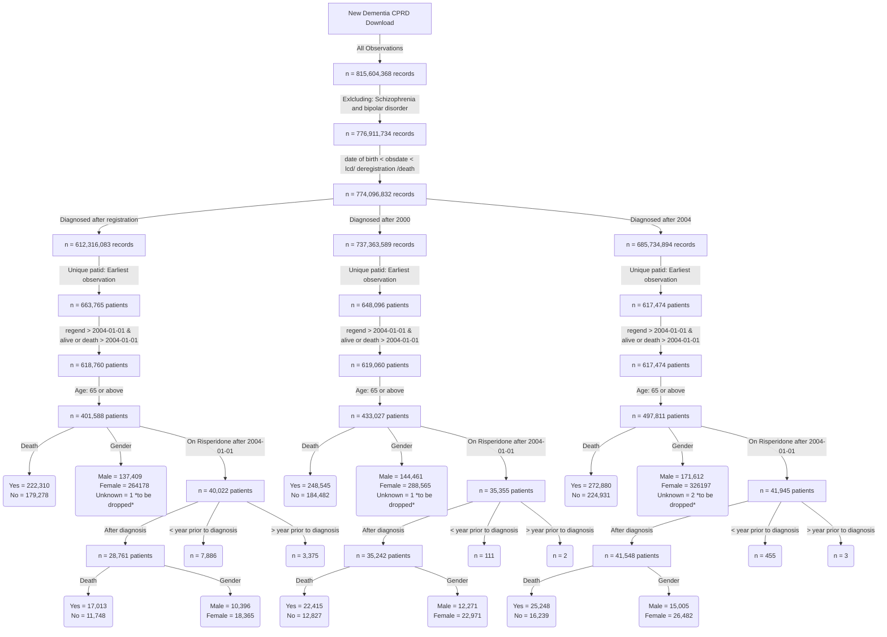

**The table below shows the number of prescriptions per year for each category**

**This is the distribution of number of diagnosis per year for patients diagnosed after registration**

**This is the distribution of number of prescriptions per year for patients diagnosed after registration**

**This is the distribution of number of diagnosis per year for patients diagnosed after 2000**

**This is the distribution of number of prescriptions per year for patients diagnosed after 2000**

**This is the distribution of number of diagnosis per year for patients diagnosed after 2004**

**This is the distribution of number of prescriptions per year for patients diagnosed after 2004**

