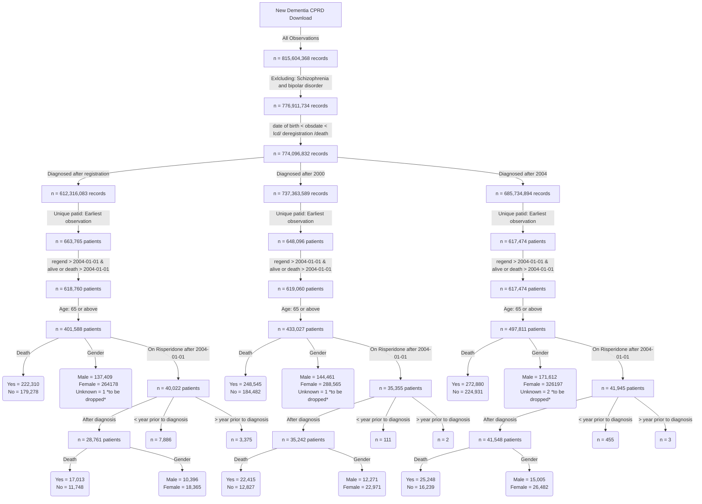

**The table below shows the number of prescriptions per year for each category**


**This is the distribution of number of diagnosis per year for patients diagnosed after registration**


**This is the distribution of number of prescriptions per year for patients diagnosed after registration**


**This is the distribution of number of diagnosis per year for patients diagnosed after 2000**


**This is the distribution of number of prescriptions per year for patients diagnosed after 2000**


**This is the distribution of number of diagnosis per year for patients diagnosed after 2004**


**This is the distribution of number of prescriptions per year for patients diagnosed after 2004**





```
                                                              Overall        
  n                                                            41487         
  diagnosedbeforeRegistration = 1 (%)                          16207 ( 39.1) 
  died = 1 (%)                                                 25248 ( 60.9) 
  age_diagnosis (mean (SD))                                    75.06 (6.72)  
  age_category (%)                                                           
     65-74                                                     21355 ( 51.5) 
     75-84                                                     16176 ( 39.0) 
     85-94                                                      3779 (  9.1) 
     95+                                                         177 (  0.4) 
  DifferenceBetween_PrescriptionAndDiagnosis (mean (SD))      116.70 (63.62) 
  comorbidity_af = 1 (%)                                        8047 ( 19.4) 
  pre_index_date_af = 1 (%)                                     6986 ( 16.8) 
  post_index_date_af = 1 (%)                                    3006 (  7.2) 
  comorbidity_angina = 1 (%)                                    5277 ( 12.7) 
  pre_index_date_angina = 1 (%)                                 5099 ( 12.3) 
  post_index_date_angina = 1 (%)                                 659 (  1.6) 
  comorbidity_anxiety_disorders = 1 (%)                         8027 ( 19.3) 
  pre_index_date_anxiety_disorders = 1 (%)                      7534 ( 18.2) 
  post_index_date_anxiety_disorders = 1 (%)                     1346 (  3.2) 
  comorbidity_falls = 1 (%)                                    23531 ( 56.7) 
  pre_index_date_falls = 1 (%)                                 16579 ( 40.0) 
  post_index_date_falls = 1 (%)                                12942 ( 31.2) 
  comorbidity_fh_diabetes = 1 (%)                               7343 ( 17.7) 
  pre_index_date_fh_diabetes = 1 (%)                            7187 ( 17.3) 
  post_index_date_fh_diabetes = 1 (%)                            247 (  0.6) 
  comorbidity_fh_premature_cvd = 1 (%)                          2507 (  6.0) 
  pre_index_date_fh_premature_cvd = 1 (%)                       2466 (  5.9) 
  post_index_date_fh_premature_cvd = 1 (%)                        62 (  0.1) 
  comorbidity_heartfailure = 1 (%)                              4236 ( 10.2) 
  pre_index_date_heartfailure = 1 (%)                           3378 (  8.1) 
  post_index_date_heartfailure = 1 (%)                          1635 (  3.9) 
  comorbidity_hypertension = 1 (%)                             23044 ( 55.5) 
  pre_index_date_hypertension = 1 (%)                          22573 ( 54.4) 
  post_index_date_hypertension = 1 (%)                          4414 ( 10.6) 
  comorbidity_lowerlimbfracture = 1 (%)                         9020 ( 21.7) 
  pre_index_date_lowerlimbfracture = 1 (%)                      6697 ( 16.1) 
  post_index_date_lowerlimbfracture = 1 (%)                     2947 (  7.1) 
  comorbidity_myocardialinfarction = 1 (%)                      3750 (  9.0) 
  pre_index_date_myocardialinfarction = 1 (%)                   3465 (  8.4) 
  post_index_date_myocardialinfarction = 1 (%)                   511 (  1.2) 
  comorbidity_qof_diabetes = 1 (%)                              7442 ( 17.9) 
  pre_index_date_qof_diabetes = 1 (%)                           6859 ( 16.5) 
  post_index_date_qof_diabetes = 1 (%)                          3395 (  8.2) 
  comorbidity_revasc = 1 (%)                                    2138 (  5.2) 
  pre_index_date_revasc = 1 (%)                                 2110 (  5.1) 
  post_index_date_revasc = 1 (%)                                  65 (  0.2) 
  comorbidity_stroke = 1 (%)                                    6147 ( 14.8) 
  pre_index_date_stroke = 1 (%)                                 5115 ( 12.3) 
  post_index_date_stroke = 1 (%)                                1845 (  4.4) 
  stroke_cat = ischaemic (%)                                    5358 ( 87.2) 
  comorbidity_tia = 1 (%)                                       4760 ( 11.5) 
  pre_index_date_tia = 1 (%)                                    4007 (  9.7) 
  post_index_date_tia = 1 (%)                                   1141 (  2.8) 
  BMI (%)                                                                    
     Missing                                                   11859 ( 28.6) 
     Normal                                                    14218 ( 34.3) 
     Obesity                                                    3809 (  9.2) 
     Overweight                                                 9449 ( 22.8) 
     Severely Obese                                              213 (  0.5) 
     Underweight                                                1939 (  4.7) 
  testvalue_dbp (mean (SD))                                    73.03 (10.52) 
  testvalue_height (mean (SD))                                162.64 (10.23) 
  testvalue_sbp (mean (SD))                                   130.82 (17.94) 
  testvalue_totalcholesterol (mean (SD))                        4.78 (1.20)  
  testvalue_weight (mean (SD))                                 65.62 (14.54) 
  gp_5cat_ethnicity (%)                                                      
     White                                                     28487 ( 94.9) 
     South Asian                                                 650 (  2.2) 
     Black                                                       584 (  1.9) 
     Other                                                       198 (  0.7) 
     Mixed                                                       106 (  0.4) 
  gp_16cat_ethnicity (%)                                                     
     White British                                             27177 ( 90.6) 
     White Irish                                                 446 (  1.5) 
     Other White                                                 845 (  2.8) 
     White and Black Caribbean                                    48 (  0.2) 
     White and Black African                                       9 (  0.0) 
     White and Asian                                              20 (  0.1) 
     Other Mixed                                                  28 (  0.1) 
     Indian                                                      295 (  1.0) 
     Pakistani                                                   179 (  0.6) 
     Bangladeshi                                                  50 (  0.2) 
     Other Asian                                                 120 (  0.4) 
     Caribbean                                                   444 (  1.5) 
     African                                                      81 (  0.3) 
     Other Black                                                  55 (  0.2) 
     Chinese                                                      32 (  0.1) 
     Other                                                       168 (  0.6) 
  gp_qrisk2_ethnicity (%)                                                    
     missing                                                       0 (  0.0) 
     White                                                     28487 ( 94.9) 
     Indian                                                      295 (  1.0) 
     Pakistani                                                   179 (  0.6) 
     Bangladeshi                                                  50 (  0.2) 
     Other Asian                                                 120 (  0.4) 
     Black Caribbean                                             439 (  1.5) 
     Black African                                                81 (  0.3) 
     Chinese                                                      32 (  0.1) 
     Other                                                       333 (  1.1) 
  alcohol_cat (%)                                                            
     Excess                                                     1507 (  8.8) 
     Harmful                                                     434 (  2.5) 
     None                                                       2434 ( 14.3) 
     Within limits                                             12698 ( 74.4) 
  smoking_cat (%)                                                            
     Active smoker                                              3124 ( 14.8) 
     Ex-smoker                                                  7829 ( 37.1) 
     Non-smoker                                                10150 ( 48.1) 
  qrisk2_smoking_cat (%)                                                     
     0                                                          8582 ( 54.5) 
     1                                                          4243 ( 26.9) 
     2                                                          2654 ( 16.9) 
     3                                                           165 (  1.0) 
     4                                                           105 (  0.7) 
  qrisk2_smoking_cat_uncoded (%)                                             
     Ex-smoker                                                  4243 ( 26.9) 
     Heavy smoker                                                105 (  0.7) 
     Light smoker                                               2654 ( 16.9) 
     Moderate smoker                                             165 (  1.0) 
     Non-smoker                                                 8582 ( 54.5) 
  drug_name (%)                                                              
     amisulpride                                                 512 (  2.3) 
     aripiprazole                                                348 (  1.6) 
     benperidol                                                   14 (  0.1) 
     chlorpromazine                                              290 (  1.3) 
     clozapine                                                     1 (  0.0) 
     flupentixol                                                 302 (  1.4) 
     fluphenazine                                                 21 (  0.1) 
     haloperidol                                                3554 ( 16.2) 
     levomepromazine                                            2308 ( 10.5) 
     olanzapine                                                 1495 (  6.8) 
     pericyazine                                                  43 (  0.2) 
     perphenazine                                                 18 (  0.1) 
     pimozide                                                    176 (  0.8) 
     prochlorperazine                                           8400 ( 38.4) 
     promazine                                                   893 (  4.1) 
     quetiapine                                                 2955 ( 13.5) 
     sulpiride                                                    94 (  0.4) 
     thioridazine                                                180 (  0.8) 
     trifluoperazine                                             270 (  1.2) 
     zuclopenthixol                                               17 (  0.1) 
  frailty (%)                                                                
     Mild                                                       1438 ( 10.9) 
     Moderate                                                   4345 ( 33.0) 
     Severe                                                     7387 ( 56.1) 
  sex = 1 (%)                                                  15005 ( 36.2) 
  dementia_duration_prior_risperidone (mean (SD))               9.25 (5.28)  
  Survival_time (mean (SD))                                     1.94 (2.21)  
  year_diagnosis_cat (%)                                                     
     > 2020                                                      198 (  0.5) 
     2004 - 2008                                               38069 ( 91.8) 
     2009 - 2012                                                1640 (  4.0) 
     2013 - 2016                                                1048 (  2.5) 
     2017 - 2020                                                 532 (  1.3) 
  Stroke_prior_to_risperidone = 1 (%)                           4756 ( 11.5) 
  Stroke__within_year_after_1st_risperidone_presc = 1 (%)        694 (  1.7) 
  death_in_a_year_after_risperidone = 1 (%)                     1675 (  4.0) 
  age_risperidone (mean (SD))                                  84.83 (5.97)  
  prescribed_other_antipsyc_drug = 1 (%)                       21891 ( 52.8) 
  pre_indexdate_antipysch_prescr = 1 (%)                       14242 ( 65.1) 
  post_indexdate_antipysch_prescr = 1 (%)                       7431 ( 33.9) 
  same_indexdate_antipysch_prescr = 1 (%)                        218 (  1.0) 
  time_between_pre_antipyscho_drug_n_risperidone (mean (SD))    7.94 (8.18)  
  time_between_post_antipyscho_drug_n_risperidone (mean (SD))   1.51 (1.88)  
  pre_indexdate_drug_name (%)                                                
     amisulpride                                                 271 (  1.9) 
     aripiprazole                                                 90 (  0.6) 
     benperidol                                                   10 (  0.1) 
     chlorpromazine                                              224 (  1.6) 
     clozapine                                                     1 (  0.0) 
     flupentixol                                                 278 (  2.0) 
     fluphenazine                                                 21 (  0.1) 
     haloperidol                                                1458 ( 10.2) 
     levomepromazine                                             169 (  1.2) 
     olanzapine                                                  862 (  6.1) 
     pericyazine                                                  33 (  0.2) 
     perphenazine                                                 17 (  0.1) 
     pimozide                                                    122 (  0.9) 
     prochlorperazine                                           7880 ( 55.3) 
     promazine                                                   589 (  4.1) 
     quetiapine                                                 1746 ( 12.3) 
     sulpiride                                                    54 (  0.4) 
     thioridazine                                                180 (  1.3) 
     trifluoperazine                                             229 (  1.6) 
     zuclopenthixol                                                8 (  0.1) 
  same_indexdate_drug_name (%)                                               
     amisulpride                                                   5 (  2.3) 
     aripiprazole                                                  6 (  2.8) 
     chlorpromazine                                                8 (  3.7) 
     flupentixol                                                   1 (  0.5) 
     haloperidol                                                  56 ( 25.7) 
     levomepromazine                                              12 (  5.5) 
     olanzapine                                                   13 (  6.0) 
     pericyazine                                                   1 (  0.5) 
     pimozide                                                      9 (  4.1) 
     prochlorperazine                                             13 (  6.0) 
     promazine                                                    48 ( 22.0) 
     quetiapine                                                   35 ( 16.1) 
     sulpiride                                                     2 (  0.9) 
     trifluoperazine                                               8 (  3.7) 
     zuclopenthixol                                                1 (  0.5) 
  post_indexdate_drug_name (%)                                               
     amisulpride                                                 236 (  3.2) 
     aripiprazole                                                252 (  3.4) 
     benperidol                                                    4 (  0.1) 
     chlorpromazine                                               58 (  0.8) 
     flupentixol                                                  23 (  0.3) 
     haloperidol                                                2040 ( 27.5) 
     levomepromazine                                            2127 ( 28.6) 
     olanzapine                                                  620 (  8.3) 
     pericyazine                                                   9 (  0.1) 
     perphenazine                                                  1 (  0.0) 
     pimozide                                                     45 (  0.6) 
     prochlorperazine                                            507 (  6.8) 
     promazine                                                   256 (  3.4) 
     quetiapine                                                 1174 ( 15.8) 
     sulpiride                                                    38 (  0.5) 
     trifluoperazine                                              33 (  0.4) 
     zuclopenthixol                                                8 (  0.1) 
  stroke_recency (mean (SD))                                    5.59 (7.47)  
  stroke_recency_cat (%)                                                     
      <= 1                                                      1412 ( 27.6) 
      > 7                                                       1417 ( 27.7) 
     1 - 2                                                       652 ( 12.7) 
     2 - 3                                                       456 (  8.9) 
     3 - 4                                                       366 (  7.2) 
     4 - 5                                                       328 (  6.4) 
     5 - 6                                                       273 (  5.3) 
     6 - 7                                                       211 (  4.1) 
  care_home = 1 (%)                                            17728 (100.0) 
  care_home_before_indexdate = 1 (%)                            5658 ( 31.9) 
  care_home_at_indexdate = 1 (%)                                 208 (  1.2) 
  care_home_90_days_after_indexdate = 1 (%)                     9799 ( 55.3) 
  Prescriptions_ever (mean (SD))                               17.90 (32.53) 
  TimeSinceFirstPrescription (mean (SD))                        0.49 (1.01)  
  Prescription_ever_cat (%)                                                  
     >100                                                        876 (  2.1) 
     1                                                          7060 ( 17.0) 
     10                                                         1037 (  2.5) 
     11 - 20                                                    7066 ( 17.0) 
     2                                                          3661 (  8.8) 
     21 - 30                                                    3759 (  9.1) 
     3                                                          2708 (  6.5) 
     31 - 40                                                    2205 (  5.3) 
     4                                                          2193 (  5.3) 
     41 - 50                                                    1361 (  3.3) 
     5                                                          1774 (  4.3) 
     51 - 100                                                   2294 (  5.5) 
     6                                                          1539 (  3.7) 
     7                                                          1437 (  3.5) 
     8                                                          1321 (  3.2) 
     9                                                          1196 (  2.9) 
  Prescriptions_after_a_year_cat (%)                                         
     >100                                                        528 (  3.8) 
     1                                                          1034 (  7.4) 
     10                                                          386 (  2.8) 
     11 - 20                                                    2860 ( 20.5) 
     2                                                           824 (  5.9) 
     21 - 30                                                    1678 ( 12.0) 
     3                                                           710 (  5.1) 
     31 - 40                                                    1053 (  7.5) 
     4                                                           624 (  4.5) 
     41 - 50                                                     668 (  4.8) 
     5                                                           574 (  4.1) 
     51 - 100                                                   1068 (  7.7) 
     6                                                           532 (  3.8) 
     7                                                           497 (  3.6) 
     8                                                           492 (  3.5) 
     9                                                           428 (  3.1) 
  Prescriptions_within_a_year_cat (%)                                        
     >100                                                         23 (  0.1) 
     1                                                          7434 ( 17.9) 
     10                                                         1316 (  3.2) 
     11 - 20                                                   13051 ( 31.5) 
     2                                                          3800 (  9.2) 
     21 - 30                                                    1182 (  2.8) 
     3                                                          2810 (  6.8) 
     31 - 40                                                     385 (  0.9) 
     4                                                          2300 (  5.5) 
     41 - 50                                                     374 (  0.9) 
     5                                                          1877 (  4.5) 
     51 - 100                                                    655 (  1.6) 
     6                                                          1702 (  4.1) 
     7                                                          1662 (  4.0) 
     8                                                          1518 (  3.7) 
     9                                                          1398 (  3.4) 
  missing_ethnicity = 1 (%)                                    11462 ( 27.6) 
  consultation_counts_Cat (%)                                                
     > 2000                                                        1 (  0.0) 
     0 - 50                                                    16342 ( 40.2) 
     1001 - 1500                                                   1 (  0.0) 
     101 - 150                                                  6653 ( 16.4) 
     1501 - 2000                                                   1 (  0.0) 
     151 - 200                                                  2648 (  6.5) 
     201 - 250                                                  1008 (  2.5) 
     251 - 300                                                   429 (  1.1) 
     301 - 350                                                   189 (  0.5) 
     351 - 400                                                    76 (  0.2) 
     401 - 450                                                    41 (  0.1) 
     451 - 500                                                    42 (  0.1) 
     501 - 800                                                    43 (  0.1) 
     51 - 100                                                  13208 ( 32.5) 
     801 - 1000                                                    6 (  0.0)
```

