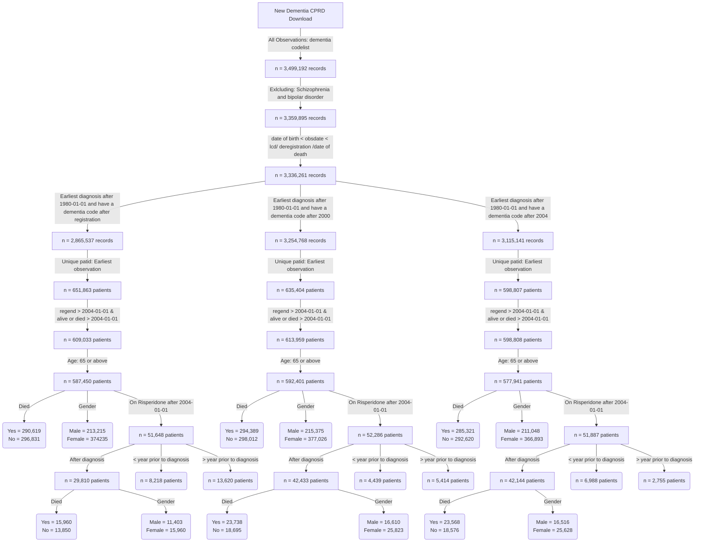

**Flow chart of the final cohorts**


**Dementia incident cohort**


```
                                             Overall       
  n                                           445332        
  diagnosedbeforeRegistration = 1 (%)         351487 (78.9) 
  gender = 2 (%)                              282903 (63.5) 
  died = 1 (%)                                223185 (50.1) 
  death_composite = 1 (%)                     325118 (73.0) 
  ONS_died = 1 (%)                            291514 (65.5) 
  age_diagnosis (mean (SD))                    82.35 (7.02) 
  age_category (%)                                          
     65 - 74                                   64311 (14.4) 
     75 - 84                                  202073 (45.4) 
     85 - 94                                  164303 (36.9) 
     95+                                       14645 ( 3.3) 
  year_of_diagnosis (%)                                     
     2004                                      20451 ( 4.6) 
     2005                                      17420 ( 3.9) 
     2006                                      19704 ( 4.4) 
     2007                                      17414 ( 3.9) 
     2008                                      17994 ( 4.0) 
     2009                                      19944 ( 4.5) 
     2010                                      21457 ( 4.8) 
     2011                                      22687 ( 5.1) 
     2012                                      25236 ( 5.7) 
     2013                                      27306 ( 6.1) 
     2014                                      29971 ( 6.7) 
     2015                                      29769 ( 6.7) 
     2016                                      26703 ( 6.0) 
     2017                                      26488 ( 5.9) 
     2018                                      25311 ( 5.7) 
     2019                                      24734 ( 5.6) 
     2020                                      19551 ( 4.4) 
     2021                                      20462 ( 4.6) 
     2022                                      19017 ( 4.3) 
     2023                                      13713 ( 3.1) 
  gender_decode = M (%)                       162429 (36.5) 
  GP_stroke = 1 (%)                            70378 (15.8) 
  HES_stroke = 1 (%)                           56416 (12.7) 
  HES_stroke = 1 (%)                           56416 (12.7) 
  stroke_composite = 1 (%)                     86268 (19.4) 
  primary_death_stroke = 1 (%)                 14705 ( 3.3) 
  HES_stroke = 1 (%)                           56416 (12.7) 
  HES_stroke = 1 (%)                           56416 (12.7) 
  ethnicity (%)                                             
     Black                                      8388 ( 1.9) 
     Mixed                                      1491 ( 0.3) 
     Other                                      2606 ( 0.6) 
     South Asian                                8668 ( 1.9) 
     Unknown                                    9353 ( 2.1) 
     White                                    414826 (93.1) 
  pre_diagnoses_af = 1 (%)                     62304 (14.0) 
  post_diagnoses_af = 1 (%)                    28577 ( 6.4) 
  af_ever = 1 (%)                              92662 (20.8) 
  pre_diagnoses_angina = 1 (%)                 50115 (11.3) 
  post_diagnoses_angina = 1 (%)                 6096 ( 1.4) 
  angina_ever = 1 (%)                          56484 (12.7) 
  pre_diagnoses_anxiety_disorders = 1 (%)      67688 (15.2) 
  post_diagnoses_anxiety_disorders = 1 (%)     10556 ( 2.4) 
  anxiety_disorders_ever = 1 (%)               78961 (17.7) 
  pre_diagnoses_falls = 1 (%)                 112934 (25.4) 
  post_diagnoses_falls = 1 (%)                125063 (28.1) 
  falls_ever = 1 (%)                          240530 (54.0) 
  pre_diagnoses_fh_diabetes = 1 (%)            91133 (20.5) 
  post_diagnoses_fh_diabetes = 1 (%)            5686 ( 1.3) 
  fh_diabetes_ever = 1 (%)                     97025 (21.8) 
  heartfailure_ever = 1 (%)                    53881 (12.1) 
  pre_diagnoses_lowerlimbfracture = 1 (%)      54605 (12.3) 
  post_diagnoses_lowerlimbfracture = 1 (%)     32899 ( 7.4) 
  lowerlimbfracture_ever = 1 (%)               88292 (19.8) 
  pre_diagnoses_myocardialinfarction = 1 (%)   34853 ( 7.8) 
  post_diagnoses_myocardialinfarction = 1 (%)   6998 ( 1.6) 
  myocardialinfarction_ever = 1 (%)            42171 ( 9.5) 
  pre_diagnoses_qof_diabetes = 1 (%)           60791 (13.7) 
  post_diagnoses_qof_diabetes = 1 (%)          24661 ( 5.5) 
  qof_diabetes_ever = 1 (%)                    86481 (19.4) 
  pre_diagnoses_revasc = 1 (%)                 24090 ( 5.4) 
  post_diagnoses_revasc = 1 (%)                 1104 ( 0.2) 
  revasc_ever = 1 (%)                          25259 ( 5.7) 
  pre_diagnoses_stroke = 1 (%)                 48354 (10.9) 
  post_diagnoses_stroke = 1 (%)                20314 ( 4.6) 
  stroke_ever = 1 (%)                          70378 (15.8) 
  pre_diagnoses_tia = 1 (%)                    38225 ( 8.6) 
  post_diagnoses_tia = 1 (%)                   12286 ( 2.8) 
  tia_ever = 1 (%)                             51115 (11.5) 
  alcohol_cat (%)                                           
     Excess                                    23239 ( 5.2) 
     Harmful                                   11657 ( 2.6) 
     None                                      41673 ( 9.4) 
     Unknown                                  118172 (26.5) 
     Within limits                            250591 (56.3) 
  smoking_cat (%)                                           
     Active smoker                             35954 ( 8.1) 
     Ex-smoker                                185210 (41.6) 
     Non-smoker                               142187 (31.9) 
     Unknown                                   81981 (18.4) 
  qrisk2_smoking_cat (%)                                    
     0                                        191562 (43.0) 
     1                                        116583 (26.2) 
     2                                         34441 ( 7.7) 
     3                                          1163 ( 0.3) 
     4                                           876 ( 0.2) 
     Unknown                                  100707 (22.6) 
  qrisk2_smoking_cat_uncoded (%)                            
     Ex-smoker                                116583 (26.2) 
     Heavy smoker                                876 ( 0.2) 
     Light smoker                              34441 ( 7.7) 
     Moderate smoker                            1163 ( 0.3) 
     Non-smoker                               191562 (43.0) 
     Unknown                                  100707 (22.6) 
  gp_qrisk2_ethnicity (%)                                   
     Bangladeshi                                 716 ( 0.2) 
     Black African                              1358 ( 0.3) 
     Black Caribbean                            5553 ( 1.2) 
     Chinese                                     449 ( 0.1) 
     Indian                                     4048 ( 0.9) 
     Other                                      3587 ( 0.8) 
     Other Asian                                1575 ( 0.4) 
     Pakistani                                  1651 ( 0.4) 
     Unknown                                  112463 (25.3) 
     White                                    313932 (70.5) 
  hes_qrisk2_ethnicity (%)                                  
     Bangladeshi                                 616 ( 0.1) 
     Black African                              1304 ( 0.3) 
     Black Caribbean                            5520 ( 1.2) 
     Chinese                                     514 ( 0.1) 
     Indian                                     3784 ( 0.8) 
     Other                                      4954 ( 1.1) 
     Other Asian                                1600 ( 0.4) 
     Pakistani                                  1516 ( 0.3) 
     Unknown                                   32537 ( 7.3) 
     White                                    392987 (88.2) 
  gp_5cat_ethnicity (%)                                     
     Black                                      7622 ( 1.7) 
     Mixed                                      1302 ( 0.3) 
     Other                                      2023 ( 0.5) 
     South Asian                                8064 ( 1.8) 
     Unknown                                  112373 (25.2) 
     White                                    313948 (70.5) 
  hes_5cat_ethnicity (%)                                    
     Black                                      7829 ( 1.8) 
     Mixed                                      1031 ( 0.2) 
     Other                                      3432 ( 0.8) 
     South Asian                                7516 ( 1.7) 
     Unknown                                   32537 ( 7.3) 
     White                                    392987 (88.2) 
  gp_16cat_ethnicity (%)                                    
     African                                    1371 ( 0.3) 
     Bangladeshi                                 716 ( 0.2) 
     Caribbean                                  5581 ( 1.3) 
     Chinese                                     451 ( 0.1) 
     Indian                                     4052 ( 0.9) 
     Other                                      1590 ( 0.4) 
     Other Asian                                1585 ( 0.4) 
     Other Black                                 598 ( 0.1) 
     Other Mixed                                 341 ( 0.1) 
     Other White                                9380 ( 2.1) 
     Pakistani                                  1652 ( 0.4) 
     Unknown                                  112728 (25.3) 
     White and Asian                             165 ( 0.0) 
     White and Black African                     200 ( 0.0) 
     White and Black Caribbean                   612 ( 0.1) 
     White British                            299235 (67.2) 
     White Irish                                5075 ( 1.1) 
  hes_16cat_ethnicity (%)                                   
     African                                    1304 ( 0.3) 
     Bangladeshi                                 616 ( 0.1) 
     Caribbean                                  5520 ( 1.2) 
     Chinese                                     514 ( 0.1) 
     Indian                                     3784 ( 0.8) 
     Other                                      2918 ( 0.7) 
     Other Asian                                1600 ( 0.4) 
     Other Black                                1005 ( 0.2) 
     Other Mixed                                1031 ( 0.2) 
     Pakistani                                  1516 ( 0.3) 
     Unknown                                   32537 ( 7.3) 
     White British                            392987 (88.2) 
  pre_diagnoses_deep_vein_thrombosis = 1 (%)   20090 ( 4.5) 
  post_diagnoses_deep_vein_thrombosis = 1 (%)   8514 ( 1.9) 
  deep_vein_thrombosis_ever = 1 (%)            28825 ( 6.5) 
  pre_diagnoses_pulmonary_embolism = 1 (%)     10503 ( 2.4) 
  post_diagnoses_pulmonary_embolism = 1 (%)     4461 ( 1.0) 
  pulmonary_embolism_ever = 1 (%)              15125 ( 3.4) 
  VTE = 1 (%)                                  40338 ( 9.1) 
  Prescribed_3_months_before_obsdate = 1 (%)   88570 (19.9) 
  drug_name_3_months_before (%)                             
     amisulpride                                3714 ( 4.2) 
     aripiprazole                               1447 ( 1.6) 
     benperidol                                  120 ( 0.1) 
     chlorpromazine                              893 ( 1.0) 
     clozapine                                    16 ( 0.0) 
     flupentixol                                 300 ( 0.3) 
     fluphenazine                                 14 ( 0.0) 
     haloperidol                               20194 (22.8) 
     levomepromazine                           16302 (18.4) 
     lurasidone                                    2 ( 0.0) 
     olanzapine                                 5305 ( 6.0) 
     paliperidone                                  1 ( 0.0) 
     pericyazine                                 127 ( 0.1) 
     perphenazine                                 34 ( 0.0) 
     pimozide                                    988 ( 1.1) 
     prochlorperazine                          16259 (18.4) 
     promazine                                  4246 ( 4.8) 
     quetiapine                                17203 (19.4) 
     sulpiride                                   661 ( 0.7) 
     thioridazine                                 11 ( 0.0) 
     trifluoperazine                             639 ( 0.7) 
     zuclopenthixol                               94 ( 0.1) 
  Prescribed_6_months_before_obsdate = 1 (%)   91977 (20.7) 
  drug_name_6_months_before (%)                             
     amisulpride                                4000 ( 3.9) 
     aripiprazole                               1549 ( 1.5) 
     benperidol                                  126 ( 0.1) 
     chlorpromazine                             1095 ( 1.1) 
     clozapine                                    20 ( 0.0) 
     flupentixol                                 470 ( 0.5) 
     fluphenazine                                 21 ( 0.0) 
     haloperidol                               21135 (20.4) 
     levomepromazine                           16407 (15.8) 
     lurasidone                                    2 ( 0.0) 
     olanzapine                                 6522 ( 6.3) 
     paliperidone                                  1 ( 0.0) 
     pericyazine                                 149 ( 0.1) 
     perphenazine                                 46 ( 0.0) 
     pimozide                                   1825 ( 1.8) 
     prochlorperazine                          25309 (24.4) 
     promazine                                  4677 ( 4.5) 
     quetiapine                                18618 (18.0) 
     sulpiride                                   763 ( 0.7) 
     thioridazine                                 23 ( 0.0) 
     trifluoperazine                             803 ( 0.8) 
     zuclopenthixol                              101 ( 0.1) 
  Prescribed_12_months_before_obsdate = 1 (%)  97193 (21.8) 
  drug_name_12_months_before (%)                            
     amisulpride                                3903 ( 4.0) 
     aripiprazole                               1525 ( 1.6) 
     benperidol                                  125 ( 0.1) 
     chlorpromazine                             1033 ( 1.1) 
     clozapine                                    18 ( 0.0) 
     flupentixol                                 379 ( 0.4) 
     fluphenazine                                 17 ( 0.0) 
     haloperidol                               21041 (21.6) 
     levomepromazine                           16428 (16.9) 
     lurasidone                                    2 ( 0.0) 
     olanzapine                                 5884 ( 6.1) 
     paliperidone                                  1 ( 0.0) 
     pericyazine                                 145 ( 0.1) 
     perphenazine                                 43 ( 0.0) 
     pimozide                                   1192 ( 1.2) 
     prochlorperazine                          21088 (21.7) 
     promazine                                  4576 ( 4.7) 
     quetiapine                                18208 (18.7) 
     sulpiride                                   723 ( 0.7) 
     thioridazine                                 16 ( 0.0) 
     trifluoperazine                             748 ( 0.8) 
     zuclopenthixol                               98 ( 0.1) 
  Prescribed_after_obsdate = 1 (%)             81852 (18.4) 
  drug_name_after_obsdate (%)                               
     amisulpride                                3371 ( 4.1) 
     aripiprazole                               1347 ( 1.6) 
     benperidol                                  110 ( 0.1) 
     chlorpromazine                              752 ( 0.9) 
     clozapine                                    13 ( 0.0) 
     flupentixol                                 249 ( 0.3) 
     fluphenazine                                 12 ( 0.0) 
     haloperidol                               18898 (23.1) 
     levomepromazine                           16020 (19.6) 
     lurasidone                                    2 ( 0.0) 
     olanzapine                                 4776 ( 5.8) 
     paliperidone                                  1 ( 0.0) 
     pericyazine                                 111 ( 0.1) 
     perphenazine                                 28 ( 0.0) 
     pimozide                                    907 ( 1.1) 
     prochlorperazine                          14486 (17.7) 
     promazine                                  3776 ( 4.6) 
     quetiapine                                15757 (19.3) 
     sulpiride                                   590 ( 0.7) 
     thioridazine                                  8 ( 0.0) 
     trifluoperazine                             557 ( 0.7) 
     zuclopenthixol                               81 ( 0.1)
```


```
        0      1
  0 120214 101933
  1  33604 189581
```


```
        0      1
  0 359064  15890
  1  29852  40526

```


```
              Black  Mixed  Other South Asian Unknown  White
  Black         6025    248    256         108     562    423
  Mixed          537     93    123         102     113    334
  Other           48     34    528         155     210   1048
  South Asian    113     99    491        6331     661    369
  Unknown        766    189    583         604    9353 100878
  White          340    368   1451         216   21638 289935
```


```
           strata   median    lower    upper
1 gender_decode=F 3.400411 3.383984 3.419576
2 gender_decode=M 2.956879 2.937714 2.978782
```


```
                strata   median    lower    upper
1 age_category=65 - 74 5.448323 5.388090 5.505818
2 age_category=75 - 84 3.780972 3.759069 3.802875
3 age_category=85 - 94 2.299795 2.283368 2.316222
4 age_category=95+ 1.237509 1.199179 1.275838
```

**Risperidone incident cohort**
```
                                                             Overall       
  n                                                        30060        
  diagnosedbeforeRegistration = 1 (%)                      17005 (56.6) 
  died = 1 (%)                                             17390 (57.9) 
  death_composite = 1 (%)                                  23726 (78.9) 
  ONS_died = 1 (%)                                         20695 (68.8) 
  age_diagnosis (mean (SD))                                80.44 (7.13) 
  age_risperidone (mean (SD))                              82.99 (6.87) 
  deprivation (%)                                                       
     1                                                      6726 (22.4) 
     2                                                      7388 (24.6) 
     3                                                      6070 (20.2) 
     4                                                      5181 (17.3) 
     5                                                      4657 (15.5) 
  gender_decode = M (%)                                    11635 (38.7) 
  GP_stroke = 1 (%)                                         4214 (14.0) 
  HES_stroke = 1 (%)                                        3204 (10.7) 
  stroke_composite = 1 (%)                                  5161 (17.2) 
  primary_death_stroke = 1 (%)                               785 ( 2.6) 
  Composite_pre_stroke = 1 (%)                              4237 (14.1) 
  Composite_post_stroke = 1 (%)                             1695 ( 5.6) 
  comorbidity_stroke = 1 (%)                                4214 (14.0) 
  pre_index_date_stroke = 1 (%)                             3609 (12.0) 
  post_index_date_stroke = 1 (%)                            1061 ( 3.5) 
  Stroke_prior_to_risperidone = 1 (%)                       4237 (14.1) 
  Stroke__within_year_after_1st_risperidone_presc = 1 (%)   1094 ( 3.6) 
  death_in_a_year_after_risperidone = 1 (%)                 8585 (28.6) 
  sex = 1 (%)                                              11635 (38.7) 
  ethnicity (%)                                                         
     Black                                                   504 ( 1.7) 
     Mixed                                                   107 ( 0.4) 
     Other                                                   171 ( 0.6) 
     South Asian                                             490 ( 1.6) 
     Unknown                                                 512 ( 1.7) 
     White                                                 28276 (94.1) 
  age_category (%)                                                      
     65 - 74                                                6544 (21.8) 
     75 - 84                                               14552 (48.4) 
     85+                                                    8964 (29.8) 
  year_of_diagnosis (%)                                                 
     2004                                                   1192 ( 4.0) 
     2005                                                   1008 ( 3.4) 
     2006                                                   1068 ( 3.6) 
     2007                                                   1063 ( 3.5) 
     2008                                                   1191 ( 4.0) 
     2009                                                   1532 ( 5.1) 
     2010                                                   1922 ( 6.4) 
     2011                                                   2071 ( 6.9) 
     2012                                                   2258 ( 7.5) 
     2013                                                   2462 ( 8.2) 
     2014                                                   2540 ( 8.4) 
     2015                                                   2284 ( 7.6) 
     2016                                                   2048 ( 6.8) 
     2017                                                   1986 ( 6.6) 
     2018                                                   1709 ( 5.7) 
     2019                                                   1412 ( 4.7) 
     2020                                                   1089 ( 3.6) 
     2021                                                    678 ( 2.3) 
     2022                                                    436 ( 1.5) 
     2023                                                    111 ( 0.4) 
  year_of_prescription (%)                                              
     2004                                                    661 ( 2.2) 
     2005                                                    444 ( 1.5) 
     2006                                                    567 ( 1.9) 
     2007                                                    628 ( 2.1) 
     2008                                                    510 ( 1.7) 
     2009                                                    613 ( 2.0) 
     2010                                                   1163 ( 3.9) 
     2011                                                   1417 ( 4.7) 
     2012                                                   1632 ( 5.4) 
     2013                                                   1910 ( 6.4) 
     2014                                                   2201 ( 7.3) 
     2015                                                   2452 ( 8.2) 
     2016                                                   2549 ( 8.5) 
     2017                                                   2583 ( 8.6) 
     2018                                                   2389 ( 7.9) 
     2019                                                   2326 ( 7.7) 
     2020                                                   2436 ( 8.1) 
     2021                                                   1598 ( 5.3) 
     2022                                                   1195 ( 4.0) 
     2023                                                    786 ( 2.6) 
  stroke_3_months_prior = 1 (%)                              155 ( 0.5) 
  stroke_6_months_prior = 1 (%)                              232 ( 0.8) 
  stroke_12_months_prior = 1 (%)                             368 ( 1.2) 
  prescribed_BMJ_antipsyc_drug = 1 (%)                     25732 (85.6) 
  stroke_recency_cat (%)                                                
      <= 1                                                   368 (10.2) 
      > 7                                                   3042 (84.3) 
     1 - 2                                                   146 ( 4.0) 
     2 - 3                                                    49 ( 1.4) 
     3 - 4                                                     4 ( 0.1) 
  dementia_duration_prior_risperidone (mean (SD))           2.11 (2.35) 
  Survival_time (mean (SD))                                 1.74 (1.90) 
  comorbidity_af = 1 (%)                                    5331 (17.7) 
  pre_index_date_af = 1 (%)                                 4765 (15.9) 
  post_index_date_af = 1 (%)                                1791 ( 6.0) 
  comorbidity_angina = 1 (%)                                3625 (12.1) 
  pre_index_date_angina = 1 (%)                             3536 (11.8) 
  post_index_date_angina = 1 (%)                             343 ( 1.1) 
  comorbidity_anxiety_disorders = 1 (%)                     6185 (20.6) 
  pre_index_date_anxiety_disorders = 1 (%)                  5937 (19.8) 
  post_index_date_anxiety_disorders = 1 (%)                  674 ( 2.2) 
  comorbidity_falls = 1 (%)                                16777 (55.8) 
  pre_index_date_falls = 1 (%)                             12080 (40.2) 
  post_index_date_falls = 1 (%)                             8833 (29.4) 
  comorbidity_fh_diabetes = 1 (%)                           6018 (20.0) 
  pre_index_date_fh_diabetes = 1 (%)                        5927 (19.7) 
  post_index_date_fh_diabetes = 1 (%)                        130 ( 0.4) 
  comorbidity_fh_premature_cvd = 1 (%)                      2311 ( 7.7) 
  pre_index_date_fh_premature_cvd = 1 (%)                   2279 ( 7.6) 
  post_index_date_fh_premature_cvd = 1 (%)                    46 ( 0.2) 
  comorbidity_heartfailure = 1 (%)                          2683 ( 8.9) 
  pre_index_date_heartfailure = 1 (%)                       2276 ( 7.6) 
  post_index_date_heartfailure = 1 (%)                       906 ( 3.0) 
  comorbidity_lowerlimbfracture = 1 (%)                     6301 (21.0) 
  pre_index_date_lowerlimbfracture = 1 (%)                  4757 (15.8) 
  post_index_date_lowerlimbfracture = 1 (%)                 1943 ( 6.5) 
  comorbidity_myocardialinfarction = 1 (%)                  2602 ( 8.7) 
  pre_index_date_myocardialinfarction = 1 (%)               2450 ( 8.2) 
  post_index_date_myocardialinfarction = 1 (%)               279 ( 0.9) 
  comorbidity_qof_diabetes = 1 (%)                          5484 (18.2) 
  pre_index_date_qof_diabetes = 1 (%)                       5167 (17.2) 
  post_index_date_qof_diabetes = 1 (%)                      2386 ( 7.9) 
  comorbidity_revasc = 1 (%)                                1608 ( 5.3) 
  pre_index_date_revasc = 1 (%)                             1599 ( 5.3) 
  post_index_date_revasc = 1 (%)                              24 ( 0.1) 
  comorbidity_tia = 1 (%)                                   3250 (10.8) 
  pre_index_date_tia = 1 (%)                                2791 ( 9.3) 
  post_index_date_tia = 1 (%)                                701 ( 2.3) 
  comorbidity_deep_vein_thrombosis = 1 (%)                  1989 ( 6.6) 
  pre_index_date_deep_vein_thrombosis = 1 (%)               1528 ( 5.1) 
  post_index_date_deep_vein_thrombosis = 1 (%)               549 ( 1.8) 
  comorbidity_haem_cancer = 1 (%)                            665 ( 2.2) 
  pre_index_date_haem_cancer = 1 (%)                         573 ( 1.9) 
  post_index_date_haem_cancer = 1 (%)                        186 ( 0.6) 
  comorbidity_pulmonary_embolism = 1 (%)                     978 ( 3.3) 
  pre_index_date_pulmonary_embolism = 1 (%)                  752 ( 2.5) 
  post_index_date_pulmonary_embolism = 1 (%)                 271 ( 0.9) 
  comorbidity_solid_cancer = 1 (%)                          5148 (17.1) 
  pre_index_date_solid_cancer = 1 (%)                       4708 (15.7) 
  post_index_date_solid_cancer = 1 (%)                      1065 ( 3.5) 
  VTE = 1 (%)                                               2743 ( 9.1) 
  BMI (%)                                                               
     Normal                                                10802 (35.9) 
     Obesity                                                3879 (12.9) 
     Overweight                                             8591 (28.6) 
     Severely Obese                                          278 ( 0.9) 
     Underweight                                            1303 ( 4.3) 
     Unknown                                                5207 (17.3) 
  totalcholesterol (%)                                                  
     < 160 mg/dl                                            6657 (22.1) 
     > 280 mg/dl                                            1042 ( 3.5) 
     199 mg/dl                                              7480 (24.9) 
     200 - 239 mg/dl                                        6438 (21.4) 
     240 - 279 mg/dl                                        2810 ( 9.3) 
     Unknown                                                5633 (18.7) 
  testvalue_dbp (mean (SD))                                76.41 (11.77)
  testvalue_sbp (mean (SD))                               135.80 (20.25)
  testvalue_totalcholesterol (mean (SD))                    4.98 (1.24) 
  gp_5cat_ethnicity (%)                                                 
     Black                                                   444 ( 1.5) 
     Mixed                                                    90 ( 0.3) 
     Other                                                   147 ( 0.5) 
     South Asian                                             449 ( 1.5) 
     Unknown                                                7311 (24.3) 
     White                                                 21619 (71.9) 
  gp_16cat_ethnicity (%)                                                
     African                                                  75 ( 0.2) 
     Bangladeshi                                              33 ( 0.1) 
     Caribbean                                               321 ( 1.1) 
     Chinese                                                  21 ( 0.1) 
     Indian                                                  227 ( 0.8) 
     Other                                                   128 ( 0.4) 
     Other Asian                                              83 ( 0.3) 
     Other Black                                              47 ( 0.2) 
     Other Mixed                                              21 ( 0.1) 
     Other White                                             665 ( 2.2) 
     Pakistani                                               101 ( 0.3) 
     Unknown                                                7332 (24.4) 
     White and Asian                                          16 ( 0.1) 
     White and Black African                                  11 ( 0.0) 
     White and Black Caribbean                                40 ( 0.1) 
     White British                                         20623 (68.6) 
     White Irish                                             316 ( 1.1) 
  gp_qrisk2_ethnicity (%)                                               
     Bangladeshi                                              33 ( 0.1) 
     Black African                                            75 ( 0.2) 
     Black Caribbean                                         319 ( 1.1) 
     Chinese                                                  21 ( 0.1) 
     Indian                                                  227 ( 0.8) 
     Other                                                   265 ( 0.9) 
     Other Asian                                              82 ( 0.3) 
     Pakistani                                               101 ( 0.3) 
     Unknown                                                7318 (24.3) 
     White                                                 21619 (71.9) 
  alcohol_cat (%)                                                       
     Excess                                                 1467 ( 4.9) 
     Harmful                                                 818 ( 2.7) 
     None                                                   2220 ( 7.4) 
     Unknown                                               10576 (35.2) 
     Within limits                                         14979 (49.8) 
  smoking_cat (%)                                                       
     Active smoker                                          2069 ( 6.9) 
     Ex-smoker                                             11224 (37.3) 
     Non-smoker                                             8404 (28.0) 
     Unknown                                                8363 (27.8) 
  qrisk2_smoking_cat (%)                                                
     0                                                     11101 (36.9) 
     1                                                      7373 (24.5) 
     2                                                      2037 ( 6.8) 
     3                                                        75 ( 0.2) 
     4                                                        40 ( 0.1) 
     Unknown                                                9434 (31.4) 
  qrisk2_smoking_cat_uncoded (%)                                        
     Ex-smoker                                              7373 (24.5) 
     Heavy smoker                                             40 ( 0.1) 
     Light smoker                                           2037 ( 6.8) 
     Moderate smoker                                          75 ( 0.2) 
     Non-smoker                                            11101 (36.9) 
     Unknown                                                9434 (31.4) 
  drug_name (%)                                                         
     amisulpride                                             488 ( 3.2) 
     aripiprazole                                            198 ( 1.3) 
     benperidol                                               20 ( 0.1) 
     chlorpromazine                                          230 ( 1.5) 
     clozapine                                                 1 ( 0.0) 
     flupentixol                                             165 ( 1.1) 
     fluphenazine                                             12 ( 0.1) 
     haloperidol                                            2714 (17.8) 
     levomepromazine                                        1697 (11.1) 
     olanzapine                                             1106 ( 7.2) 
     pericyazine                                              31 ( 0.2) 
     perphenazine                                             11 ( 0.1) 
     pimozide                                                128 ( 0.8) 
     prochlorperazine                                       6004 (39.3) 
     promazine                                               517 ( 3.4) 
     quetiapine                                             1798 (11.8) 
     sulpiride                                                38 ( 0.2) 
     thioridazine                                             34 ( 0.2) 
     trifluoperazine                                          78 ( 0.5) 
     zuclopenthixol                                           14 ( 0.1) 
  frailty (%)                                                           
     Mild                                                   1358 ( 4.5) 
     Moderate                                               3435 (11.4) 
     Severe                                                 5376 (17.9) 
     Unknown                                               19891 (66.2) 
  year_diagnosis_cat (%)                                                
     > 2020                                                 1225 ( 4.1) 
     2004 - 2008                                            5522 (18.4) 
     2009 - 2012                                            7783 (25.9) 
     2013 - 2016                                            9334 (31.1) 
     2017 - 2020                                            6196 (20.6) 
  prescribed_other_antipsyc_drug = 1 (%)                   15284 (50.8) 
  pre_indexdate_antipysch_prescr = 1 (%)                   10105 (66.1) 
  post_indexdate_antipysch_prescr = 1 (%)                   5088 (33.3) 
  same_indexdate_antipysch_prescr = 1 (%)                     91 ( 0.6) 
  pre_indexdate_drug_name (%)                                           
     amisulpride                                             184 ( 1.8) 
     aripiprazole                                             76 ( 0.8) 
     benperidol                                                7 ( 0.1) 
     chlorpromazine                                          123 ( 1.2) 
     clozapine                                                 1 ( 0.0) 
     flupentixol                                             196 ( 1.9) 
     fluphenazine                                             11 ( 0.1) 
     haloperidol                                             915 ( 9.1) 
     levomepromazine                                          91 ( 0.9) 
     olanzapine                                              584 ( 5.8) 
     pericyazine                                              19 ( 0.2) 
     perphenazine                                              7 ( 0.1) 
     pimozide                                                118 ( 1.2) 
     prochlorperazine                                       6005 (59.4) 
     promazine                                               316 ( 3.1) 
     quetiapine                                             1179 (11.7) 
     sulpiride                                                42 ( 0.4) 
     thioridazine                                            105 ( 1.0) 
     trifluoperazine                                         119 ( 1.2) 
     zuclopenthixol                                            7 ( 0.1) 
  same_indexdate_drug_name (%)                                          
     amisulpride                                               2 ( 2.2) 
     aripiprazole                                              8 ( 8.8) 
     chlorpromazine                                            5 ( 5.5) 
     flupentixol                                               2 ( 2.2) 
     haloperidol                                              21 (23.1) 
     levomepromazine                                           1 ( 1.1) 
     olanzapine                                                3 ( 3.3) 
     pimozide                                                  8 ( 8.8) 
     prochlorperazine                                          6 ( 6.6) 
     promazine                                                15 (16.5) 
     quetiapine                                               17 (18.7) 
     trifluoperazine                                           3 ( 3.3) 
  post_indexdate_drug_name (%)                                          
     amisulpride                                             118 ( 2.3) 
     aripiprazole                                            174 ( 3.4) 
     benperidol                                                3 ( 0.1) 
     chlorpromazine                                           30 ( 0.6) 
     flupentixol                                              12 ( 0.2) 
     haloperidol                                            1422 (27.9) 
     levomepromazine                                        1562 (30.7) 
     olanzapine                                              460 ( 9.0) 
     pericyazine                                               5 ( 0.1) 
     pimozide                                                 35 ( 0.7) 
     prochlorperazine                                        327 ( 6.4) 
     promazine                                               136 ( 2.7) 
     quetiapine                                              762 (15.0) 
     sulpiride                                                16 ( 0.3) 
     trifluoperazine                                          20 ( 0.4) 
     zuclopenthixol                                            6 ( 0.1) 
  care_home = 1 (%)                                        12371 (41.2) 
  care_home_before_indexdate = 1 (%)                        3977 (32.1) 
  care_home_at_indexdate = 1 (%)                             127 ( 1.0) 
  care_home_90_days_after_indexdate = 1 (%)                 2683 (21.7) 
  TimeSinceFirstPrescription (mean (SD))                    0.49 (0.93) 
  Prescription_ever_cat (%)                                             
     >100                                                    555 ( 1.8) 
     1                                                      5163 (17.2) 
     10                                                      781 ( 2.6) 
     11 - 20                                                5103 (17.0) 
     2                                                      2655 ( 8.8) 
     21 - 30                                                2757 ( 9.2) 
     3                                                      1930 ( 6.4) 
     31 - 40                                                1618 ( 5.4) 
     4                                                      1582 ( 5.3) 
     41 - 50                                                1002 ( 3.3) 
     5                                                      1303 ( 4.3) 
     51 - 100                                               1653 ( 5.5) 
     6                                                      1111 ( 3.7) 
     7                                                      1051 ( 3.5) 
     8                                                       926 ( 3.1) 
     9                                                       870 ( 2.9) 
  Prescriptions_after_a_year_cat (%)                                    
     >100                                                    301 ( 3.0) 
     1                                                       699 ( 7.0) 
     10                                                      288 ( 2.9) 
     11 - 20                                                2119 (21.3) 
     2                                                       610 ( 6.1) 
     21 - 30                                                1193 (12.0) 
     3                                                       520 ( 5.2) 
     31 - 40                                                 759 ( 7.6) 
     4                                                       455 ( 4.6) 
     41 - 50                                                 469 ( 4.7) 
     5                                                       413 ( 4.2) 
     51 - 100                                                723 ( 7.3) 
     6                                                       372 ( 3.7) 
     7                                                       373 ( 3.8) 
     8                                                       328 ( 3.3) 
     9                                                       311 ( 3.1) 
  Prescriptions_within_a_year_cat (%)                                   
     >100                                                     16 ( 0.1) 
     1                                                      5382 (17.9) 
     10                                                      953 ( 3.2) 
     11 - 20                                                9427 (31.4) 
     2                                                      2739 ( 9.1) 
     21 - 30                                                 850 ( 2.8) 
     3                                                      2004 ( 6.7) 
     31 - 40                                                 310 ( 1.0) 
     4                                                      1651 ( 5.5) 
     41 - 50                                                 298 ( 1.0) 
     5                                                      1392 ( 4.6) 
     51 - 100                                                517 ( 1.7) 
     6                                                      1232 ( 4.1) 
     7                                                      1224 ( 4.1) 
     8                                                      1064 ( 3.5) 
     9                                                      1001 ( 3.3) 
  consultation_counts_Cat (%)                                           
     0 - 50                                                10847 (36.7) 
     101 - 150                                              5102 (17.2) 
     151 - 200                                              1936 ( 6.5) 
     201 - 250                                               732 ( 2.5) 
     251 - 300                                               302 ( 1.0) 
     301 - 350                                               123 ( 0.4) 
     351 - 400                                                50 ( 0.2) 
     401 - 450                                                34 ( 0.1) 
     451 - 500                                                28 ( 0.1) 
     501 - 800                                                30 ( 0.1) 
     51 - 100                                              10391 (35.1) 
     801 - 1000                                                3 ( 0.0) 
  pre_BMJ_indexdate_drug_name (%)                                       
     amisulpride                                             169 ( 8.7) 
     aripiprazole                                             15 ( 0.8) 
     benperidol                                                7 ( 0.4) 
     chlorpromazine                                          122 ( 6.3) 
     clozapine                                                 1 ( 0.1) 
     flupentixol                                             122 ( 6.3) 
     fluphenazine                                             10 ( 0.5) 
     haloperidol                                             852 (43.7) 
     levomepromazine                                          10 ( 0.5) 
     olanzapine                                               49 ( 2.5) 
     pericyazine                                              19 ( 1.0) 
     perphenazine                                              2 ( 0.1) 
     pimozide                                                  5 ( 0.3) 
     prochlorperazine                                        368 (18.9) 
     promazine                                                46 ( 2.4) 
     quetiapine                                               67 ( 3.4) 
     sulpiride                                                16 ( 0.8) 
     thioridazine                                             33 ( 1.7) 
     trifluoperazine                                          34 ( 1.7) 
     zuclopenthixol                                            2 ( 0.1) 
  same_BMJ_indexdate_drug_name (%)                                      
     amisulpride                                              93 ( 0.9) 
     aripiprazole                                            186 ( 1.8) 
     benperidol                                                3 ( 0.0) 
     chlorpromazine                                           30 ( 0.3) 
     flupentixol                                              64 ( 0.6) 
     fluphenazine                                              1 ( 0.0) 
     haloperidol                                            1187 (11.4) 
     levomepromazine                                        1289 (12.3) 
     olanzapine                                              770 ( 7.4) 
     pericyazine                                               5 ( 0.0) 
     perphenazine                                              5 ( 0.0) 
     pimozide                                                128 ( 1.2) 
     prochlorperazine                                       4808 (46.0) 
     promazine                                               309 ( 3.0) 
     quetiapine                                             1400 (13.4) 
     sulpiride                                                29 ( 0.3) 
     thioridazine                                             59 ( 0.6) 
     trifluoperazine                                          75 ( 0.7) 
     zuclopenthixol                                            6 ( 0.1) 
  post_BMJ_indexdate_drug_name (%)                                      
     amisulpride                                              34 ( 3.8) 
     aripiprazole                                             28 ( 3.1) 
     chlorpromazine                                            5 ( 0.6) 
     flupentixol                                               9 ( 1.0) 
     haloperidol                                             150 (16.8) 
     levomepromazine                                          89 (10.0) 
     olanzapine                                               66 ( 7.4) 
     pimozide                                                  7 ( 0.8) 
     prochlorperazine                                        320 (35.9) 
     promazine                                                26 ( 2.9) 
     quetiapine                                              135 (15.2) 
     sulpiride                                                 5 ( 0.6) 
     thioridazine                                              2 ( 0.2) 
     trifluoperazine                                          12 ( 1.3) 
     zuclopenthixol                                            3 ( 0.3) 
  comorbidity_hypertension (%)                                          
     Elevated                                               3327 (11.1) 
     Normal                                                 4156 (13.8) 
     Stage 1                                               13285 (44.2) 
     Stage 2                                                8633 (28.7) 
     Stage 3 (severe)                                        191 ( 0.6) 
     Unknown                                                 468 ( 1.6) 
  pre_index_date_hypertension = 1 (%)                      24666 (83.3) 
  comorbidity_hearing_loss = 1 (%)                          8411 (28.0) 
  pre_index_date_hearing_loss = 1 (%)                       7900 (26.3) 
  post_index_date_hearing_loss = 1 (%)                      1127 ( 3.7) 
  pre_indexdate_BMJ_antipysch_prescr = 1 (%)                1961 ( 7.6) 
  post_indexdate_BMJ_antipysch_prescr = 1 (%)               1756 ( 6.8) 
  same_indexdate_BMJ_antipysch_prescr = 1 (%)              22015 (85.6) 
  HES_comorbidity_stroke = 1 (%)                            3204 (10.7) 
  HES_pre_index_date_stroke = 1 (%)                         2568 ( 8.5) 
  HES_post_index_date_stroke = 1 (%)                         964 ( 3.2) 
  hes_5cat_ethnicity (%)                                                
     Black                                                   474 ( 1.6) 
     Mixed                                                    70 ( 0.2) 
     Other                                                   189 ( 0.6) 
     South Asian                                             440 ( 1.5) 
     Unknown                                                2169 ( 7.2) 
     White                                                 26718 (88.9) 
  hes_16cat_ethnicity (%)                                               
     African                                                  78 ( 0.3) 
     Bangladeshi                                              30 ( 0.1) 
     Caribbean                                               341 ( 1.1) 
     Chinese                                                  20 ( 0.1) 
     Indian                                                  202 ( 0.7) 
     Other                                                   169 ( 0.6) 
     Other Asian                                             106 ( 0.4) 
     Other Black                                              55 ( 0.2) 
     Other Mixed                                              70 ( 0.2) 
     Pakistani                                               102 ( 0.3) 
     Unknown                                                2169 ( 7.2) 
     White British                                         26718 (88.9) 
  hes_qrisk2_ethnicity (%)                                              
     Bangladeshi                                              30 ( 0.1) 
     Black African                                            78 ( 0.3) 
     Black Caribbean                                         341 ( 1.1) 
     Chinese                                                  20 ( 0.1) 
     Indian                                                  202 ( 0.7) 
     Other                                                   294 ( 1.0) 
     Other Asian                                             106 ( 0.4) 
     Pakistani                                               102 ( 0.3) 
     Unknown                                                2169 ( 7.2) 
     White                                                 26718 (88.9)                                                     

```


```
           strata   median    lower    upper
1 gender_decode=F 4.654346 4.591376 4.717317
2 gender_decode=M 4.101300 4.035592 4.175222
```


```
                strata   median    lower    upper
1 age_category=65 - 74 6.308008 6.179329 6.461328
2 age_category=75 - 84 4.692676 4.624230 4.761123
3     age_category=85+ 3.063655 2.997947 3.126626

```


**COX model**
```
Call:
coxph(formula = Surv(Survival_time, Composite_post_stroke) ~ 
    age_diagnosis + Composite_pre_stroke + sex, data = CompleteData)

  n= 30060, number of events= 1695 

                          coef exp(coef) se(coef)      z Pr(>|z|)    
age_diagnosis         0.006682  1.006704 0.003562  1.876   0.0607 .  
Composite_pre_stroke1 1.825286  6.204567 0.049282 37.038   <2e-16 ***
sex1                  0.119763  1.127229 0.051070  2.345   0.0190 *  
---
Signif. codes:  0 ‘***’ 0.001 ‘**’ 0.01 ‘*’ 0.05 ‘.’ 0.1 ‘ ’ 1

                      exp(coef) exp(-coef) lower .95 upper .95
age_diagnosis             1.007     0.9933    0.9997     1.014
Composite_pre_stroke1     6.205     0.1612    5.6333     6.834
sex1                      1.127     0.8871    1.0199     1.246

Concordance= 0.713  (se = 0.008 )
Likelihood ratio test= 1204  on 3 df,   p=<2e-16
Wald test            = 1419  on 3 df,   p=<2e-16
Score (logrank) test = 1860  on 3 df,   p=<2e-16


```


**One year censoring**


```
Call:
coxph(formula = Surv(Survival_time, Composite_post_stroke) ~ 
    age_diagnosis + Composite_pre_stroke + sex, data = CensoringData_1year)

  n= 30040, number of events= 1037 
   (20 observations deleted due to missingness)

                          coef exp(coef) se(coef)      z Pr(>|z|)    
age_diagnosis         0.003332  1.003337 0.004501  0.740   0.4592    
Composite_pre_stroke1 2.076755  7.978539 0.062823 33.057   <2e-16 ***
sex1                  0.124871  1.133003 0.064246  1.944   0.0519 .  
---
Signif. codes:  0 ‘***’ 0.001 ‘**’ 0.01 ‘*’ 0.05 ‘.’ 0.1 ‘ ’ 1

                      exp(coef) exp(-coef) lower .95 upper .95
age_diagnosis             1.003     0.9967    0.9945     1.012
Composite_pre_stroke1     7.979     0.1253    7.0542     9.024
sex1                      1.133     0.8826    0.9990     1.285

Concordance= 0.726  (se = 0.009 )
Likelihood ratio test= 1019  on 3 df,   p=<2e-16
Wald test            = 1126  on 3 df,   p=<2e-16
Score (logrank) test = 1597  on 3 df,   p=<2e-16
```

**Excluding stroke 3 months prior**


```
Call:
coxph(formula = Surv(Survival_time, Composite_post_stroke) ~ 
    age_diagnosis + Composite_pre_stroke + sex, data = Excluding_3_monthsPriorStroke)

  n= 29905, number of events= 1615 

                          coef exp(coef) se(coef)      z Pr(>|z|)    
age_diagnosis         0.007775  1.007806 0.003646  2.133   0.0330 *  
Composite_pre_stroke1 1.743310  5.716231 0.050815 34.307   <2e-16 ***
sex1                  0.121428  1.129108 0.052390  2.318   0.0205 *  
---
Signif. codes:  0 ‘***’ 0.001 ‘**’ 0.01 ‘*’ 0.05 ‘.’ 0.1 ‘ ’ 1

                      exp(coef) exp(-coef) lower .95 upper .95
age_diagnosis             1.008     0.9923     1.001     1.015
Composite_pre_stroke1     5.716     0.1749     5.174     6.315
sex1                      1.129     0.8857     1.019     1.251

Concordance= 0.701  (se = 0.008 )
Likelihood ratio test= 1023  on 3 df,   p=<2e-16
Wald test            = 1223  on 3 df,   p=<2e-16
Score (logrank) test = 1566  on 3 df,   p=<2e-16

```


**Excluding stroke 12 months prior**


```
Call:
coxph(formula = Surv(Survival_time, Composite_post_stroke) ~ 
    age_diagnosis + Composite_pre_stroke + sex, data = Excluding_12_monthsPriorStroke)

  n= 29692, number of events= 1546 

                          coef exp(coef) se(coef)      z Pr(>|z|)    
age_diagnosis         0.008703  1.008741 0.003734  2.331   0.0198 *  
Composite_pre_stroke1 1.679211  5.361324 0.052382 32.057   <2e-16 ***
sex1                  0.136316  1.146044 0.053538  2.546   0.0109 *  
---
Signif. codes:  0 ‘***’ 0.001 ‘**’ 0.01 ‘*’ 0.05 ‘.’ 0.1 ‘ ’ 1

                      exp(coef) exp(-coef) lower .95 upper .95
age_diagnosis             1.009     0.9913     1.001     1.016
Composite_pre_stroke1     5.361     0.1865     4.838     5.941
sex1                      1.146     0.8726     1.032     1.273

Concordance= 0.689  (se = 0.008 )
Likelihood ratio test= 886  on 3 df,   p=<2e-16
Wald test            = 1073  on 3 df,   p=<2e-16
Score (logrank) test = 1352  on 3 df,   p=<2e-16

```


**Matching**

***Updated Algorithm - exact match on: Sex, stroke history, cvd and risperidone age category (65-74, 75-84, 85+)***

```
                                                        Stratified by risperidone
                                                          0              1              p      test SMD   
  n                                                       137031         28464                            
  sex = 1 (%)                                              51780 (37.8)  10847 ( 38.1)   0.313       0.007
  risperidone = 1 (%)                                          0 ( 0.0)  28464 (100.0)  <0.001         NaN
  age_risperidone (mean (SD))                              83.18 (6.82)  83.12 (6.83)    0.136       0.010
  age_diagnosis (mean (SD))                                80.49 (6.90)  80.51 (7.10)    0.670       0.003
  age_risperidone_cat (%)                                                                0.163       0.012
     65 - 74                                               15313 (11.2)   3290 ( 11.6)                    
     75 - 84                                               61837 (45.1)  12823 ( 45.0)                    
     85+                                                   59881 (43.7)  12351 ( 43.4)                    
  care_home_before_indexdate = 1 (%)                       17946 (13.1)   3734 ( 13.1)   0.928       0.001
  deprivation (%)                                                                        0.895       0.008
     1                                                     30555 (22.3)   6379 ( 22.4)                    
     2                                                     33591 (24.5)   6942 ( 24.4)                    
     3                                                     27469 (20.0)   5764 ( 20.3)                    
     4                                                     23854 (17.4)   4908 ( 17.2)                    
     5                                                     21450 (15.7)   4444 ( 15.6)                    
     Unknown                                                 112 ( 0.1)     27 (  0.1)                    
  Stroke__within_year_after_1st_risperidone_presc = 1 (%)   4671 ( 3.4)   1112 (  3.9)  <0.001       0.027
  stroke_composite_pre_index_date = 1 (%)                  17986 (13.1)   3880 ( 13.6)   0.022       0.015
  pre_index_date_angina = 1 (%)                            16201 (11.8)   3344 ( 11.7)   0.730       0.002
  pre_index_date_heartfailure = 1 (%)                      10524 ( 7.7)   2199 (  7.7)   0.802       0.002
  BMI (%)                                                                                0.065       0.021
     Missing                                               25440 (18.6)   5505 ( 19.3)                    
     Normal                                                53314 (38.9)  11024 ( 38.7)                    
     Obesity                                               14336 (10.5)   2973 ( 10.4)                    
     Overweight                                            35122 (25.6)   7175 ( 25.2)                    
     Severely Obese                                          916 ( 0.7)    189 (  0.7)                    
     Underweight                                            7903 ( 5.8)   1598 (  5.6)                    
  Prescribed_other_antipsychotic_Prior = 1 (%)             36951 (27.0)   7377 ( 25.9)  <0.001       0.024
  period_before_prescription (mean (SD))                    2.73 (2.19)   2.62 (2.40)   <0.001       0.051
  pre_index_date_myocardialinfarction = 1 (%)              11098 ( 8.1)   2316 (  8.1)   0.841       0.001
  pre_index_date_tia = 1 (%)                               12915 ( 9.4)   2641 (  9.3)   0.448       0.005
  pre_index_date_falls = 1 (%)                             57114 (41.7)  11748 ( 41.3)   0.208       0.008
  pre_index_date_lowerlimbfracture = 1 (%)                 21750 (15.9)   4536 ( 15.9)   0.796       0.002
  pre_index_date_ihd = 1 (%)                               22750 (16.6)   4717 ( 16.6)   0.908       0.001
  pre_index_date_pad = 1 (%)                               10688 ( 7.8)   2207 (  7.8)   0.801       0.002
  pre_index_date_af = 1 (%)                                21971 (16.0)   4560 ( 16.0)   0.962      <0.001
  pre_index_date_revasc = 1 (%)                             7317 ( 5.3)   1514 (  5.3)   0.899       0.001
  pre_index_date_qof_diabetes = 1 (%)                      24086 (17.6)   4979 ( 17.5)   0.739       0.002
  pre_index_date_anxiety_disorders = 1 (%)                 27219 (19.9)   5635 ( 19.8)   0.804       0.002
  pre_index_date_fh_diabetes = 1 (%)                       28736 (21.0)   5824 ( 20.5)   0.055       0.013
  pre_index_date_fh_premature_cvd = 1 (%)                  11011 ( 8.0)   2233 (  7.8)   0.287       0.007
  pre_index_date_pulmonary_embolism = 1 (%)                 3447 ( 2.5)    728 (  2.6)   0.695       0.003
  pre_index_date_deep_vein_thrombosis = 1 (%)               6993 ( 5.1)   1468 (  5.2)   0.717       0.002
  pre_index_date_hearing_loss = 1 (%)                      36712 (26.8)   7645 ( 26.9)   0.821       0.002
  pre_index_date_VTE = 1 (%)                                9634 ( 7.0)   2020 (  7.1)   0.701       0.003
  pre_index_date_haem_cancer = 1 (%)                        2610 ( 1.9)    540 (  1.9)   0.951       0.001
  pre_index_date_solid_cancer = 1 (%)                      21938 (16.0)   4517 ( 15.9)   0.563       0.004
  pre_index_date_cvd = 1 (%)                               54965 (40.1)  11454 ( 40.2)   0.691       0.003
  comorbidity_hypertension (%)                                                          <0.001       0.043
     Elevated                                              24085 (17.6)   4969 ( 17.5)                    
     Normal                                                34822 (25.4)   7217 ( 25.4)                    
     Stage 1                                               54077 (39.5)  11186 ( 39.3)                    
     Stage 2                                               22495 (16.4)   4638 ( 16.3)                    
     Stage 3 (severe)                                        205 ( 0.1)     39 (  0.1)                    
     Unknown                                                1347 ( 1.0)    415 (  1.5)           

```


```
Call:
coxph(formula = Surv(Survival_time, stroke_composite_post_index_date) ~ 
    age_diagnosis + sex + stroke_composite_pre_index_date, data = table)

  n= 149704, number of events= 9103 

                                    coef exp(coef) se(coef)      z Pr(>|z|)    
age_diagnosis                   0.013596  1.013689 0.001622  8.383  < 2e-16 ***
sex                             0.107951  1.113993 0.021935  4.921 8.59e-07 ***
stroke_composite_pre_index_date 1.823485  6.193406 0.021538 84.664  < 2e-16 ***
---
Signif. codes:  0 ‘***’ 0.001 ‘**’ 0.01 ‘*’ 0.05 ‘.’ 0.1 ‘ ’ 1

                                exp(coef) exp(-coef) lower .95 upper .95
age_diagnosis                       1.014     0.9865     1.010     1.017
sex                                 1.114     0.8977     1.067     1.163
stroke_composite_pre_index_date     6.193     0.1615     5.937     6.460

Concordance= 0.705  (se = 0.003 )
Likelihood ratio test= 6095  on 3 df,   p=<2e-16
Wald test            = 7502  on 3 df,   p=<2e-16
Score (logrank) test = 9837  on 3 df,   p=<2e-16

```


```
         strata   median    lower    upper
1 risperidone=0 5.661875 5.629021 5.697467
2 risperidone=1 4.558522 4.503765 4.613279
```

```
         strata   median    lower    upper
1 risperidone=0 7.093771 6.967830 7.233402
2 risperidone=1 5.314168 5.117043 5.489391
```


***Updated Algorithm - without exact match***

```
                                                        Stratified by risperidone
                                                          0               1              p      test SMD   
  n                                                       146209          29691                            
  sex = 1 (%)                                              56211 ( 38.4)  11457 ( 38.6)   0.652       0.003
  risperidone = 1 (%)                                          0 (  0.0)  29691 (100.0)  <0.001         NaN
  age_risperidone (mean (SD))                              83.10 (6.88)   83.02 (6.86)    0.072       0.011
  age_diagnosis (mean (SD))                                80.46 (6.92)   80.45 (7.12)    0.763       0.002
  age_risperidone_cat (%)                                                                 0.320       0.010
     65 - 74                                               17457 ( 11.9)   3578 ( 12.1)                    
     75 - 84                                               65315 ( 44.7)  13372 ( 45.0)                    
     85+                                                   63437 ( 43.4)  12741 ( 42.9)                    
  care_home_before_indexdate = 1 (%)                       20110 ( 13.8)   3926 ( 13.2)   0.015       0.016
  deprivation (%)                                                                         0.874       0.009
     1                                                     32589 ( 22.3)   6648 ( 22.4)                    
     2                                                     36053 ( 24.7)   7285 ( 24.5)                    
     3                                                     29473 ( 20.2)   5987 ( 20.2)                    
     4                                                     24901 ( 17.0)   5124 ( 17.3)                    
     5                                                     23033 ( 15.8)   4617 ( 15.6)                    
     Unknown                                                 160 (  0.1)     30 (  0.1)                    
  Stroke__within_year_after_1st_risperidone_presc = 0 (%) 146209 (100.0)  29691 (100.0)      NA      <0.001
  stroke_composite_pre_index_date = 1 (%)                  20802 ( 14.2)   4199 ( 14.1)   0.708       0.002
  pre_index_date_angina = 1 (%)                            17189 ( 11.8)   3513 ( 11.8)   0.721       0.002
  pre_index_date_heartfailure = 1 (%)                      11468 (  7.8)   2267 (  7.6)   0.227       0.008
  BMI (%)                                                                                 0.957       0.007
     Missing                                               31664 ( 21.7)   6381 ( 21.5)                    
     Normal                                                54821 ( 37.5)  11214 ( 37.8)                    
     Obesity                                               14961 ( 10.2)   3008 ( 10.1)                    
     Overweight                                            35797 ( 24.5)   7267 ( 24.5)                    
     Severely Obese                                          958 (  0.7)    193 (  0.7)                    
     Underweight                                            8008 (  5.5)   1628 (  5.5)                    
  Prescribed_other_antipsychotic_Prior = 1 (%)             37749 ( 25.8)   7442 ( 25.1)   0.007       0.017
  period_before_prescription (mean (SD))                    2.67 (2.15)    2.57 (2.39)   <0.001       0.043
  pre_index_date_myocardialinfarction = 1 (%)              12031 (  8.2)   2425 (  8.2)   0.735       0.002
  pre_index_date_tia = 1 (%)                               13602 (  9.3)   2778 (  9.4)   0.782       0.002
  pre_index_date_falls = 1 (%)                             60023 ( 41.1)  12018 ( 40.5)   0.067       0.012
  pre_index_date_lowerlimbfracture = 1 (%)                 23439 ( 16.0)   4718 ( 15.9)   0.552       0.004
  pre_index_date_ihd = 1 (%)                               24382 ( 16.7)   4941 ( 16.6)   0.890       0.001
  pre_index_date_pad = 1 (%)                               11169 (  7.6)   2287 (  7.7)   0.716       0.002
  pre_index_date_af = 1 (%)                                23246 ( 15.9)   4726 ( 15.9)   0.945      <0.001
  pre_index_date_revasc = 1 (%)                             7879 (  5.4)   1588 (  5.3)   0.789       0.002
  pre_index_date_qof_diabetes = 1 (%)                      25218 ( 17.2)   5127 ( 17.3)   0.941       0.001
  pre_index_date_anxiety_disorders = 1 (%)                 28992 ( 19.8)   5874 ( 19.8)   0.864       0.001
  pre_index_date_fh_diabetes = 1 (%)                       29469 ( 20.2)   5900 ( 19.9)   0.269       0.007
  pre_index_date_fh_premature_cvd = 1 (%)                  11364 (  7.8)   2269 (  7.6)   0.451       0.005
  pre_index_date_pulmonary_embolism = 1 (%)                 3762 (  2.6)    751 (  2.5)   0.679       0.003
  pre_index_date_deep_vein_thrombosis = 1 (%)               7527 (  5.1)   1515 (  5.1)   0.757       0.002
  pre_index_date_hearing_loss = 1 (%)                      38623 ( 26.4)   7856 ( 26.5)   0.884       0.001
  pre_index_date_VTE = 1 (%)                               10399 (  7.1)   2088 (  7.0)   0.633       0.003
  pre_index_date_haem_cancer = 1 (%)                        2787 (  1.9)    567 (  1.9)   0.987      <0.001
  pre_index_date_solid_cancer = 1 (%)                      22971 ( 15.7)   4665 ( 15.7)   1.000      <0.001
  pre_index_date_cvd = 1 (%)                               59298 ( 40.6)  12046 ( 40.6)   0.969      <0.001
  comorbidity_hypertension (%)                                                           <0.001       0.043
     Elevated                                              24970 ( 17.1)   5076 ( 17.1)                    
     Normal                                                37629 ( 25.7)   7494 ( 25.2)                    
     Stage 1                                               56282 ( 38.5)  11372 ( 38.3)                    
     Stage 2                                               23109 ( 15.8)   4678 ( 15.8)                    
     Stage 3 (severe)                                        204 (  0.1)     40 (  0.1)                    
     Unknown                                                4015 (  2.7)   1031 (  3.5) 

```


```
Call:
coxph(formula = Surv(Survival_time, stroke_composite_post_index_date) ~ 
    risperidone, data = table)

  n= 176012, number of events= 11632 

               coef exp(coef) se(coef)     z Pr(>|z|)  
risperidone 0.06783   1.07018  0.02643 2.567   0.0103 *
---
Signif. codes:  0 ‘***’ 0.001 ‘**’ 0.01 ‘*’ 0.05 ‘.’ 0.1 ‘ ’ 1

            exp(coef) exp(-coef) lower .95 upper .95
risperidone      1.07     0.9344     1.016     1.127

Concordance= 0.509  (se = 0.002 )
Likelihood ratio test= 6.48  on 1 df,   p=0.01
Wald test            = 6.59  on 1 df,   p=0.01
Score (logrank) test = 6.59  on 1 df,   p=0.01

```


```
         strata   median    lower    upper
1 risperidone=0 5.366188 5.341547 5.390828
2 risperidone=1 3.935661 3.879535 4.002738
```

```
         strata   median    lower    upper
1 risperidone=0 6.521561 6.420260 6.603696
2 risperidone=1 4.328542 4.123203 4.520192
```


***Analysis***


****Competing Risk****


```# Cause-specific Cox model for stroke (competing event: death)
> cox_stroke_cs <- coxph(Surv(Stroke_censtime_yrs, Stroke.cr == 1) ~ risperidone, data = dat)
> summary(cox_stroke_cs)
Call:
coxph(formula = Surv(Stroke_censtime_yrs, Stroke.cr == 1) ~ risperidone, 
    data = dat)

  n= 165495, number of events= 1943 

               coef exp(coef) se(coef)     z Pr(>|z|)    
risperidone 0.33040   1.39152  0.05493 6.015  1.8e-09 ***
---
Signif. codes:  0 ‘***’ 0.001 ‘**’ 0.01 ‘*’ 0.05 ‘.’ 0.1 ‘ ’ 1

            exp(coef) exp(-coef) lower .95 upper .95
risperidone     1.392     0.7186     1.249      1.55

Concordance= 0.526  (se = 0.005 )
Likelihood ratio test= 33.94  on 1 df,   p=6e-09
Wald test            = 36.18  on 1 df,   p=2e-09
Score (logrank) test = 36.51  on 1 df,   p=2e-09

> 
> # Cause-specific Cox model for death (competing event: stroke)
> cox_death_cs <- coxph(Surv(Stroke_censtime_yrs, Stroke.cr == 2) ~ risperidone, data = dat)
> summary(cox_death_cs)
Call:
coxph(formula = Surv(Stroke_censtime_yrs, Stroke.cr == 2) ~ risperidone, 
    data = dat)

  n= 165495, number of events= 7474 

               coef exp(coef) se(coef)    z Pr(>|z|)    
risperidone 0.59437   1.81188  0.02618 22.7   <2e-16 ***
---
Signif. codes:  0 ‘***’ 0.001 ‘**’ 0.01 ‘*’ 0.05 ‘.’ 0.1 ‘ ’ 1

            exp(coef) exp(-coef) lower .95 upper .95
risperidone     1.812     0.5519     1.721     1.907

Concordance= 0.549  (se = 0.003 )
Likelihood ratio test= 466.1  on 1 df,   p=<2e-16
Wald test            = 515.4  on 1 df,   p=<2e-16
Score (logrank) test = 530.8  on 1 df,   p=<2e-16
```


```
> # Cause-specific Cox model for stroke (competing event: death)
> cox_stroke_cs <- coxph(Surv(Stroke_censtime_yrs, Stroke.cr == 1) ~ risperidone, data = dat)
> summary(cox_stroke_cs)
Call:
coxph(formula = Surv(Stroke_censtime_yrs, Stroke.cr == 1) ~ risperidone, 
    data = dat)

  n= 165495, number of events= 5581 

               coef exp(coef) se(coef)   z Pr(>|z|)    
risperidone 0.28814   1.33395  0.03472 8.3   <2e-16 ***
---
Signif. codes:  0 ‘***’ 0.001 ‘**’ 0.01 ‘*’ 0.05 ‘.’ 0.1 ‘ ’ 1

            exp(coef) exp(-coef) lower .95 upper .95
risperidone     1.334     0.7497     1.246     1.428

Concordance= 0.52  (se = 0.003 )
Likelihood ratio test= 64.77  on 1 df,   p=8e-16
Wald test            = 68.89  on 1 df,   p=<2e-16
Score (logrank) test = 69.37  on 1 df,   p=<2e-16

> 
> # Cause-specific Cox model for death (competing event: stroke)
> cox_death_cs <- coxph(Surv(Stroke_censtime_yrs, Stroke.cr == 2) ~ risperidone, data = dat)
> summary(cox_death_cs)
Call:
coxph(formula = Surv(Stroke_censtime_yrs, Stroke.cr == 2) ~ risperidone, 
    data = dat)

  n= 165495, number of events= 25807 

               coef exp(coef) se(coef)     z Pr(>|z|)    
risperidone 0.63665   1.89014  0.01472 43.26   <2e-16 ***
---
Signif. codes:  0 ‘***’ 0.001 ‘**’ 0.01 ‘*’ 0.05 ‘.’ 0.1 ‘ ’ 1

            exp(coef) exp(-coef) lower .95 upper .95
risperidone      1.89     0.5291     1.836     1.945

Concordance= 0.548  (se = 0.001 )
Likelihood ratio test= 1661  on 1 df,   p=<2e-16
Wald test            = 1871  on 1 df,   p=<2e-16
Score (logrank) test = 1935  on 1 df,   p=<2e-16

```


***COX model - trained on controls***


***Causal Survival Forest***

 summary(treatment_effect_values)
 ```
    Min.  1st Qu.   Median     Mean  3rd Qu.     Max. 
-3.77192 -0.50565 -0.26139 -0.31458 -0.06619  1.90310 
```


****Heterogeneous Treatment Effect****

****Negative Treatment Effect < -0.1 and Positive Treatment Effect > 0.1****
```
                                     Stratified by effect_group
                                      level   Negative      Positive      p      test
  n                                           35147          4745                    
  age_diagnosis (mean (SD))                   80.41 (6.64)  81.13 (8.28)  <0.001     
  sex (%)                             0       21549 (61.3)   3016 (63.6)   0.003     
                                      1       13598 (38.7)   1729 (36.4)             
  stroke_composite_pre_index_date (%) 0       30305 (86.2)   4160 (87.7)   0.007     
                                      1        4842 (13.8)    585 (12.3)             
  pre_index_date_cvd (%)              0       19830 (56.4)   3216 (67.8)  <0.001     
                                      1       15317 (43.6)   1529 (32.2)             
  age_risperidone (mean (SD))                 83.05 (6.68)  83.79 (7.73)  <0.001     
  age_category (%)                    65 - 74  6925 (19.7)   1239 (26.1)  <0.001     
                                      75 - 84 18710 (53.2)   1444 (30.4)             
                                      85 - 94  9021 (25.7)   1907 (40.2)             
                                      95+       491 ( 1.4)    155 ( 3.3)    
```


****Negative Treatment Effect < 0 and Positive Treatment Effect > 0****
```
                                    Stratified by effect_group
                                      level   Negative      Positive      p      test
  n                                           40739          8910                    
  age_diagnosis (mean (SD))                   80.42 (6.70)  80.83 (7.86)  <0.001     
  sex (%)                             0       25105 (61.6)   5671 (63.6)  <0.001     
                                      1       15634 (38.4)   3239 (36.4)             
  stroke_composite_pre_index_date (%) 0       35245 (86.5)   7837 (88.0)  <0.001     
                                      1        5494 (13.5)   1073 (12.0)             
  pre_index_date_cvd (%)              0       23616 (58.0)   6068 (68.1)  <0.001     
                                      1       17123 (42.0)   2842 (31.9)             
  age_risperidone (mean (SD))                 83.10 (6.68)  83.61 (7.37)  <0.001     
  age_category (%)                    65 - 74  8024 (19.7)   2164 (24.3)  <0.001     
                                      75 - 84 21410 (52.6)   3263 (36.6)             
                                      85 - 94 10722 (26.3)   3246 (36.4)             
                                      95+       583 ( 1.4)    237 ( 2.7)  
```


***Causal Forest***

 summary(treatment_effects)
 ```
      Min.    1st Qu.     Median       Mean    3rd Qu.       Max. 
-0.0400638  0.0004461  0.0038949  0.0045751  0.0079468  0.0481077
```


****Heterogeneous Treatment Effect****


****Negative Treatment Effect < 0 and Positive Treatment Effect > 0****
```
                                     Stratified by effect_group
                                      level   Negative      Positive      p      test
  n                                           10967         38682                    
  age_diagnosis (mean (SD))                   81.40 (7.46)  80.24 (6.74)  <0.001     
  age_risperidone (mean (SD))                 84.00 (6.67)  82.96 (6.84)  <0.001     
  sex (%)                             0        6941 (63.3)  23835 (61.6)   0.002     
                                      1        4026 (36.7)  14847 (38.4)             
  stroke_composite_pre_index_date (%) 0        9519 (86.8)  33563 (86.8)   0.947     
                                      1        1448 (13.2)   5119 (13.2)             
  pre_index_date_cvd (%)              0        6941 (63.3)  22743 (58.8)  <0.001     
                                      1        4026 (36.7)  15939 (41.2)             
  age_category (%)                    65 - 74  2417 (22.0)   7771 (20.1)  <0.001     
                                      75 - 84  3874 (35.3)  20799 (53.8)             
                                      85 - 94  4441 (40.5)   9527 (24.6)             
                                      95+       235 ( 2.1)    585 ( 1.5)   
```


****Discontinuation 90 days window****


****Discontinuation 30 days window****


****Overall****
```
Call:
coxph(formula = Surv(stime.1, discontinued) ~ sex + age_risperidone + 
    ethnicity + pre_index_date_stroke + pre_index_date_qof_diabetes + 
    pre_index_date_haem_cancer + pre_index_date_ihd + pre_index_date_af + 
    pre_index_date_myocardialinfarction + pre_index_date_heartfailure + 
    pre_index_date_hypertension, data = dat, weights = weights, 
    robust = TRUE, cluster = subclass)

  n= 28053, number of events= 3194 
   (411 observations deleted due to missingness)

                                          coef exp(coef)  se(coef) robust se      z Pr(>|z|)    
sex1                                  0.019024  1.019206  0.037551  0.037526  0.507 0.612191    
age_risperidone                      -0.009074  0.990967  0.002661  0.002670 -3.399 0.000677 ***
ethnicityMixed                        0.028725  1.029142  0.293353  0.296991  0.097 0.922949    
ethnicityOther                        0.034699  1.035308  0.245066  0.243998  0.142 0.886915    
ethnicitySouth Asian                  0.288754  1.334763  0.163562  0.165862  1.741 0.081696 .  
ethnicityUnknown                     -0.328603  0.719929  0.196723  0.197650 -1.663 0.096402 .  
ethnicityWhite                       -0.194681  0.823097  0.122813  0.124406 -1.565 0.117610    
pre_index_date_stroke                -0.148224  0.862238  0.058933  0.058922 -2.516 0.011883 *  
pre_index_date_qof_diabetes1         -0.161481  0.850883  0.050241  0.050348 -3.207 0.001340 ** 
pre_index_date_haem_cancer1          -0.124679  0.882780  0.144042  0.144652 -0.862 0.388729    
pre_index_date_ihd1                  -0.012084  0.987988  0.054100  0.053501 -0.226 0.821300    
pre_index_date_af                    -0.091285  0.912758  0.053758  0.053967 -1.691 0.090744 .  
pre_index_date_myocardialinfarction1 -0.060367  0.941419  0.075249  0.074368 -0.812 0.416945    
pre_index_date_heartfailure1         -0.029706  0.970731  0.074815  0.074870 -0.397 0.691542    
pre_index_date_hypertension1          0.009536  1.009582  0.035801  0.035736  0.267 0.789589    
---
Signif. codes:  0 ‘***’ 0.001 ‘**’ 0.01 ‘*’ 0.05 ‘.’ 0.1 ‘ ’ 1

                                     exp(coef) exp(-coef) lower .95 upper .95
sex1                                    1.0192     0.9812    0.9469    1.0970
age_risperidone                         0.9910     1.0091    0.9858    0.9962
ethnicityMixed                          1.0291     0.9717    0.5750    1.8419
ethnicityOther                          1.0353     0.9659    0.6418    1.6702
ethnicitySouth Asian                    1.3348     0.7492    0.9643    1.8475
ethnicityUnknown                        0.7199     1.3890    0.4887    1.0605
ethnicityWhite                          0.8231     1.2149    0.6450    1.0504
pre_index_date_stroke                   0.8622     1.1598    0.7682    0.9678
pre_index_date_qof_diabetes1            0.8509     1.1753    0.7709    0.9391
pre_index_date_haem_cancer1             0.8828     1.1328    0.6649    1.1721
pre_index_date_ihd1                     0.9880     1.0122    0.8896    1.0972
pre_index_date_af                       0.9128     1.0956    0.8211    1.0146
pre_index_date_myocardialinfarction1    0.9414     1.0622    0.8137    1.0891
pre_index_date_heartfailure1            0.9707     1.0302    0.8382    1.1242
pre_index_date_hypertension1            1.0096     0.9905    0.9413    1.0828

Concordance= 0.538  (se = 0.005 )
Likelihood ratio test= 59.67  on 15 df,   p=3e-07
Wald test            = 58.89  on 15 df,   p=4e-07
Score (logrank) test = 61  on 15 df,   p=2e-07,   Robust = 56.18  p=1e-06

  (Note: the likelihood ratio and score tests assume independence of
     observations within a cluster, the Wald and robust score tests do not).
```

****No Stroke****

```
Call:
coxph(formula = Surv(stime.1, discontinued) ~ sex + age_risperidone + 
    ethnicity + pre_index_date_stroke + pre_index_date_qof_diabetes + 
    pre_index_date_haem_cancer + pre_index_date_ihd + pre_index_date_af + 
    pre_index_date_myocardialinfarction + pre_index_date_heartfailure + 
    pre_index_date_hypertension, data = no_stroke)

  n= 24195, number of events= 2812 
   (389 observations deleted due to missingness)

                                          coef exp(coef)  se(coef)      z Pr(>|z|)    
sex1                                  0.030991  1.031476  0.040074  0.773 0.439318    
age_risperidone                      -0.009160  0.990881  0.002833 -3.233 0.001224 ** 
ethnicityMixed                       -0.023587  0.976689  0.316072 -0.075 0.940511    
ethnicityOther                       -0.001310  0.998691  0.262927 -0.005 0.996026    
ethnicitySouth Asian                  0.276529  1.318545  0.177134  1.561 0.118494    
ethnicityUnknown                     -0.323348  0.723722  0.203027 -1.593 0.111242    
ethnicityWhite                       -0.227896  0.796207  0.130590 -1.745 0.080963 .  
pre_index_date_stroke                       NA        NA  0.000000     NA       NA    
pre_index_date_qof_diabetes1         -0.207068  0.812964  0.055168 -3.753 0.000174 ***
pre_index_date_haem_cancer1          -0.228094  0.796050  0.159324 -1.432 0.152248    
pre_index_date_ihd1                  -0.004100  0.995908  0.058415 -0.070 0.944043    
pre_index_date_af                    -0.074517  0.928192  0.059494 -1.253 0.210383    
pre_index_date_myocardialinfarction1 -0.053970  0.947460  0.083013 -0.650 0.515603    
pre_index_date_heartfailure1         -0.084594  0.918885  0.084378 -1.003 0.316073    
pre_index_date_hypertension1          0.004519  1.004529  0.038103  0.119 0.905602    
---
Signif. codes:  0 ‘***’ 0.001 ‘**’ 0.01 ‘*’ 0.05 ‘.’ 0.1 ‘ ’ 1

                                     exp(coef) exp(-coef) lower .95 upper .95
sex1                                    1.0315     0.9695    0.9536    1.1158
age_risperidone                         0.9909     1.0092    0.9854    0.9964
ethnicityMixed                          0.9767     1.0239    0.5257    1.8147
ethnicityOther                          0.9987     1.0013    0.5965    1.6720
ethnicitySouth Asian                    1.3185     0.7584    0.9318    1.8658
ethnicityUnknown                        0.7237     1.3817    0.4861    1.0774
ethnicityWhite                          0.7962     1.2560    0.6164    1.0285
pre_index_date_stroke                       NA         NA        NA        NA
pre_index_date_qof_diabetes1            0.8130     1.2301    0.7296    0.9058
pre_index_date_haem_cancer1             0.7960     1.2562    0.5825    1.0878
pre_index_date_ihd1                     0.9959     1.0041    0.8882    1.1167
pre_index_date_af                       0.9282     1.0774    0.8260    1.0430
pre_index_date_myocardialinfarction1    0.9475     1.0555    0.8052    1.1149
pre_index_date_heartfailure1            0.9189     1.0883    0.7788    1.0841
pre_index_date_hypertension1            1.0045     0.9955    0.9322    1.0824

Concordance= 0.536  (se = 0.006 )
Likelihood ratio test= 51.69  on 14 df,   p=3e-06
Wald test            = 52.65  on 14 df,   p=2e-06
Score (logrank) test = 52.9  on 14 df,   p=2e-06
```

****With Stroke****
```
Call:
coxph(formula = Surv(stime.1, discontinued) ~ sex + age_risperidone + 
    ethnicity + pre_index_date_stroke + pre_index_date_qof_diabetes + 
    pre_index_date_haem_cancer + pre_index_date_ihd + pre_index_date_af + 
    pre_index_date_myocardialinfarction + pre_index_date_heartfailure + 
    pre_index_date_hypertension, data = with_stroke)

  n= 3858, number of events= 382 
   (22 observations deleted due to missingness)

                                          coef exp(coef)  se(coef)      z Pr(>|z|)
sex1                                 -0.057648  0.943982  0.107858 -0.534    0.593
age_risperidone                      -0.008081  0.991951  0.007901 -1.023    0.306
ethnicityMixed                        0.298613  1.347988  0.792988  0.377    0.706
ethnicityOther                        0.324099  1.382784  0.679506  0.477    0.633
ethnicitySouth Asian                  0.436795  1.547739  0.439604  0.994    0.320
ethnicityUnknown                     -1.005812  0.365748  1.062741 -0.946    0.344
ethnicityWhite                        0.034425  1.035025  0.361892  0.095    0.924
pre_index_date_stroke                -0.188723  0.828016  0.146272 -1.290    0.197
pre_index_date_qof_diabetes1          0.074922  1.077800  0.124470  0.602    0.547
pre_index_date_haem_cancer1           0.503003  1.653679  0.339273  1.483    0.138
pre_index_date_ihd1                  -0.063149  0.938804  0.143776 -0.439    0.661
pre_index_date_af                    -0.175271  0.839230  0.125680 -1.395    0.163
pre_index_date_myocardialinfarction1 -0.081609  0.921632  0.179618 -0.454    0.650
pre_index_date_heartfailure1          0.179570  1.196702  0.163699  1.097    0.273
pre_index_date_hypertension1          0.036947  1.037638  0.104872  0.352    0.725

                                     exp(coef) exp(-coef) lower .95 upper .95
sex1                                    0.9440     1.0593   0.76411     1.166
age_risperidone                         0.9920     1.0081   0.97671     1.007
ethnicityMixed                          1.3480     0.7418   0.28490     6.378
ethnicityOther                          1.3828     0.7232   0.36505     5.238
ethnicitySouth Asian                    1.5477     0.6461   0.65389     3.663
ethnicityUnknown                        0.3657     2.7341   0.04556     2.936
ethnicityWhite                          1.0350     0.9662   0.50922     2.104
pre_index_date_stroke                   0.8280     1.2077   0.62163     1.103
pre_index_date_qof_diabetes1            1.0778     0.9278   0.84448     1.376
pre_index_date_haem_cancer1             1.6537     0.6047   0.85048     3.215
pre_index_date_ihd1                     0.9388     1.0652   0.70826     1.244
pre_index_date_af                       0.8392     1.1916   0.65600     1.074
pre_index_date_myocardialinfarction1    0.9216     1.0850   0.64814     1.311
pre_index_date_heartfailure1            1.1967     0.8356   0.86825     1.649
pre_index_date_hypertension1            1.0376     0.9637   0.84485     1.274

Concordance= 0.539  (se = 0.015 )
Likelihood ratio test= 12.93  on 15 df,   p=0.6
Wald test            = 13.02  on 15 df,   p=0.6
Score (logrank) test = 13.25  on 15 df,   p=0.6


```


***No CVD***
```
Call:
coxph(formula = Surv(stime.1, discontinued) ~ sex + age_risperidone + 
    ethnicity + pre_index_date_stroke + pre_index_date_qof_diabetes + 
    pre_index_date_haem_cancer + pre_index_date_ihd + pre_index_date_af + 
    pre_index_date_myocardialinfarction + pre_index_date_heartfailure + 
    pre_index_date_hypertension, data = No_CVD)

  n= 16669, number of events= 2021 
   (341 observations deleted due to missingness)

                                          coef exp(coef)  se(coef)      z Pr(>|z|)   
sex1                                  0.019490  1.019682  0.047579  0.410  0.68207   
age_risperidone                      -0.009715  0.990332  0.003292 -2.951  0.00317 **
ethnicityMixed                       -0.110132  0.895715  0.410142 -0.269  0.78830   
ethnicityOther                        0.151112  1.163127  0.310822  0.486  0.62685   
ethnicitySouth Asian                  0.509543  1.664530  0.213153  2.391  0.01683 * 
ethnicityUnknown                     -0.156704  0.854957  0.238641 -0.657  0.51140   
ethnicityWhite                       -0.042857  0.958048  0.161193 -0.266  0.79033   
pre_index_date_stroke                       NA        NA  0.000000     NA       NA   
pre_index_date_qof_diabetes1         -0.149835  0.860850  0.068721 -2.180  0.02923 * 
pre_index_date_haem_cancer1          -0.305251  0.736938  0.201341 -1.516  0.12950   
pre_index_date_ihd1                         NA        NA  0.000000     NA       NA   
pre_index_date_af                    -0.135940  0.872895  0.081665 -1.665  0.09599 . 
pre_index_date_myocardialinfarction1        NA        NA  0.000000     NA       NA   
pre_index_date_heartfailure1                NA        NA  0.000000     NA       NA   
pre_index_date_hypertension1          0.043759  1.044731  0.044760  0.978  0.32825   
---
Signif. codes:  0 ‘***’ 0.001 ‘**’ 0.01 ‘*’ 0.05 ‘.’ 0.1 ‘ ’ 1

                                     exp(coef) exp(-coef) lower .95 upper .95
sex1                                    1.0197     0.9807    0.9289    1.1193
age_risperidone                         0.9903     1.0098    0.9840    0.9967
ethnicityMixed                          0.8957     1.1164    0.4009    2.0012
ethnicityOther                          1.1631     0.8598    0.6325    2.1389
ethnicitySouth Asian                    1.6645     0.6008    1.0961    2.5277
ethnicityUnknown                        0.8550     1.1696    0.5356    1.3648
ethnicityWhite                          0.9580     1.0438    0.6985    1.3140
pre_index_date_stroke                       NA         NA        NA        NA
pre_index_date_qof_diabetes1            0.8608     1.1616    0.7524    0.9850
pre_index_date_haem_cancer1             0.7369     1.3570    0.4966    1.0935
pre_index_date_ihd1                         NA         NA        NA        NA
pre_index_date_af                       0.8729     1.1456    0.7438    1.0244
pre_index_date_myocardialinfarction1        NA         NA        NA        NA
pre_index_date_heartfailure1                NA         NA        NA        NA
pre_index_date_hypertension1            1.0447     0.9572    0.9570    1.1405

Concordance= 0.532  (se = 0.007 )
Likelihood ratio test= 34.77  on 11 df,   p=3e-04
Wald test            = 36.2  on 11 df,   p=2e-04
Score (logrank) test = 36.57  on 11 df,   p=1e-04

```

***With CVD***
```
Call:
coxph(formula = Surv(stime.1, discontinued) ~ sex + age_risperidone + 
    ethnicity + pre_index_date_stroke + pre_index_date_qof_diabetes + 
    pre_index_date_haem_cancer + pre_index_date_ihd + pre_index_date_af + 
    pre_index_date_myocardialinfarction + pre_index_date_heartfailure + 
    pre_index_date_hypertension, data = CVD)

  n= 11384, number of events= 1173 
   (70 observations deleted due to missingness)

                                          coef exp(coef)  se(coef)      z Pr(>|z|)  
sex1                                  0.023752  1.024037  0.061564  0.386   0.6996  
age_risperidone                      -0.006780  0.993243  0.004618 -1.468   0.1421  
ethnicityMixed                        0.182474  1.200183  0.421483  0.433   0.6651  
ethnicityOther                       -0.171906  0.842058  0.399844 -0.430   0.6672  
ethnicitySouth Asian                 -0.068042  0.934221  0.254991 -0.267   0.7896  
ethnicityUnknown                     -0.662257  0.515686  0.368095 -1.799   0.0720 .
ethnicityWhite                       -0.458243  0.632394  0.189885 -2.413   0.0158 *
pre_index_date_stroke                -0.118844  0.887946  0.068785 -1.728   0.0840 .
pre_index_date_qof_diabetes1         -0.170967  0.842849  0.073871 -2.314   0.0206 *
pre_index_date_haem_cancer1           0.106377  1.112242  0.206500  0.515   0.6065  
pre_index_date_ihd1                   0.017707  1.017864  0.063585  0.278   0.7807  
pre_index_date_af                    -0.052137  0.949198  0.072076 -0.723   0.4695  
pre_index_date_myocardialinfarction1 -0.046902  0.954181  0.076790 -0.611   0.5413  
pre_index_date_heartfailure1         -0.024305  0.975988  0.079780 -0.305   0.7606  
pre_index_date_hypertension1         -0.056020  0.945520  0.060037 -0.933   0.3508  
---
Signif. codes:  0 ‘***’ 0.001 ‘**’ 0.01 ‘*’ 0.05 ‘.’ 0.1 ‘ ’ 1

                                     exp(coef) exp(-coef) lower .95 upper .95
sex1                                    1.0240     0.9765    0.9076    1.1554
age_risperidone                         0.9932     1.0068    0.9843    1.0023
ethnicityMixed                          1.2002     0.8332    0.5254    2.7417
ethnicityOther                          0.8421     1.1876    0.3846    1.8437
ethnicitySouth Asian                    0.9342     1.0704    0.5668    1.5399
ethnicityUnknown                        0.5157     1.9392    0.2506    1.0610
ethnicityWhite                          0.6324     1.5813    0.4359    0.9175
pre_index_date_stroke                   0.8879     1.1262    0.7760    1.0161
pre_index_date_qof_diabetes1            0.8428     1.1865    0.7292    0.9742
pre_index_date_haem_cancer1             1.1122     0.8991    0.7420    1.6671
pre_index_date_ihd1                     1.0179     0.9824    0.8986    1.1530
pre_index_date_af                       0.9492     1.0535    0.8241    1.0932
pre_index_date_myocardialinfarction1    0.9542     1.0480    0.8209    1.1092
pre_index_date_heartfailure1            0.9760     1.0246    0.8347    1.1412
pre_index_date_hypertension1            0.9455     1.0576    0.8406    1.0636

Concordance= 0.545  (se = 0.009 )
Likelihood ratio test= 23.97  on 15 df,   p=0.07
Wald test            = 25.2  on 15 df,   p=0.05
Score (logrank) test = 25.4  on 15 df,   p=0.04
```
****Discontinuation baseline characteristics****
****Overall***
```
                                              Stratified by discontinued
                                               Overall        0              1             p      test
  n                                            28464          25217          3242                     
  sex = 1 (%)                                  10847 ( 38.1)   9645 ( 38.2)  1202 ( 37.1)   0.203     
  Prescribed_other_antipsychotic_Prior = 1 (%)  7377 ( 25.9)   6592 ( 26.1)   785 ( 24.2)   0.019     
  ethnicity (%)                                                                            <0.001     
     Black                                       487 (  1.7)    418 (  1.7)    69 (  2.1)             
     Mixed                                        98 (  0.3)     84 (  0.3)    14 (  0.4)             
     Other                                       151 (  0.5)    129 (  0.5)    22 (  0.7)             
     South Asian                                 475 (  1.7)    391 (  1.6)    84 (  2.6)             
     Unknown                                     454 (  1.6)    411 (  1.6)    43 (  1.3)             
     White                                     26799 ( 94.2)  23784 ( 94.3)  3010 ( 92.8)             
  death_composite = 1 (%)                      22331 ( 78.5)  19823 ( 78.6)  2505 ( 77.3)   0.084     
  pre_index_date_angina = 1 (%)                 3344 ( 11.7)   2983 ( 11.8)   361 ( 11.1)   0.260     
  pre_index_date_heartfailure = 1 (%)           2199 (  7.7)   1989 (  7.9)   210 (  6.5)   0.005     
  pre_index_date_myocardialinfarction = 1 (%)   2316 (  8.1)   2086 (  8.3)   230 (  7.1)   0.023     
  pre_index_date_tia = 1 (%)                    2641 (  9.3)   2354 (  9.3)   286 (  8.8)   0.360     
  pre_index_date_falls = 1 (%)                 11748 ( 41.3)  10555 ( 41.9)  1192 ( 36.8)  <0.001     
  pre_index_date_lowerlimbfracture = 1 (%)      4536 ( 15.9)   4050 ( 16.1)   486 ( 15.0)   0.123     
  pre_index_date_ihd = 1 (%)                    4717 ( 16.6)   4224 ( 16.8)   493 ( 15.2)   0.028     
  pre_index_date_pad = 1 (%)                    2207 (  7.8)   1983 (  7.9)   224 (  6.9)   0.060     
  pre_index_date_revasc = 1 (%)                 1514 (  5.3)   1362 (  5.4)   152 (  4.7)   0.097     
  pre_index_date_qof_diabetes = 1 (%)           4979 ( 17.5)   4483 ( 17.8)   496 ( 15.3)   0.001     
  pre_index_date_fh_diabetes = 1 (%)            5824 ( 20.5)   5116 ( 20.3)   708 ( 21.8)   0.042     
  pre_index_date_fh_premature_cvd = 1 (%)       2233 (  7.8)   1997 (  7.9)   236 (  7.3)   0.215     
  pre_index_date_pulmonary_embolism = 1 (%)      728 (  2.6)    656 (  2.6)    72 (  2.2)   0.218     
  pre_index_date_deep_vein_thrombosis = 1 (%)   1468 (  5.2)   1322 (  5.2)   146 (  4.5)   0.080     
  pre_index_date_haem_cancer = 1 (%)             540 (  1.9)    489 (  1.9)    51 (  1.6)   0.171     
  pre_index_date_solid_cancer = 1 (%)           4517 ( 15.9)   4037 ( 16.0)   480 ( 14.8)   0.082     
  pre_index_date_hearing_loss = 1 (%)           7645 ( 26.9)   6788 ( 26.9)   857 ( 26.4)   0.573     
  primary_death_stroke = 1 (%)                   730 (100.0)    666 (100.0)    64 (100.0)      NA     
  stroke_composite_pre_index_date = 1 (%)       3880 ( 13.6)   3494 ( 13.9)   386 ( 11.9)   0.003     
  pre_index_date_VTE = 1 (%)                    2020 (  7.1)   1817 (  7.2)   203 (  6.3)   0.053     
  pre_index_date_cvd = 1 (%)                   11454 ( 40.2)  10273 ( 40.7)  1180 ( 36.4)  <0.001     
  BMI (%)                                                                                   0.212     
     Missing                                    5505 ( 19.3)   4893 ( 19.4)   612 ( 18.9)             
     Normal                                    11024 ( 38.7)   9721 ( 38.5)  1299 ( 40.1)             
     Obesity                                    2973 ( 10.4)   2653 ( 10.5)   320 (  9.9)             
     Overweight                                 7175 ( 25.2)   6348 ( 25.2)   826 ( 25.5)             
     Severely Obese                              189 (  0.7)    175 (  0.7)    14 (  0.4)             
     Underweight                                1598 (  5.6)   1427 (  5.7)   171 (  5.3)             
  pre_index_date_hypertension = 1 (%)          13620 ( 48.5)  12206 ( 49.1)  1413 ( 44.2)  <0.001
```
****No stroke****

```
                                             Stratified by discontinued
                                               Overall        0              1             p      test
  n                                            24584          21723          2856                     
  sex = 1 (%)                                   9100 ( 37.0)   8064 ( 37.1)  1036 ( 36.3)   0.389     
  Prescribed_other_antipsychotic_Prior = 1 (%)  6253 ( 25.4)   5580 ( 25.7)   673 ( 23.6)   0.015     
  ethnicity (%)                                                                            <0.001     
     Black                                       416 (  1.7)    355 (  1.6)    61 (  2.1)             
     Mixed                                        86 (  0.3)     74 (  0.3)    12 (  0.4)             
     Other                                       129 (  0.5)    110 (  0.5)    19 (  0.7)             
     South Asian                                 372 (  1.5)    303 (  1.4)    69 (  2.4)             
     Unknown                                     425 (  1.7)    383 (  1.8)    42 (  1.5)             
     White                                     23156 ( 94.2)  20498 ( 94.4)  2653 ( 92.9)             
  death_composite = 1 (%)                      19174 ( 78.0)  16975 ( 78.1)  2196 ( 76.9)   0.135     
  pre_index_date_angina = 1 (%)                 2741 ( 11.1)   2433 ( 11.2)   308 ( 10.8)   0.527     
  pre_index_date_heartfailure = 1 (%)           1748 (  7.1)   1585 (  7.3)   163 (  5.7)   0.002     
  pre_index_date_myocardialinfarction = 1 (%)   1826 (  7.4)   1640 (  7.5)   186 (  6.5)   0.051     
  pre_index_date_tia = 1 (%)                    1749 (  7.1)   1548 (  7.1)   200 (  7.0)   0.840     
  pre_index_date_falls = 1 (%)                  9769 ( 39.7)   8745 ( 40.3)  1023 ( 35.8)  <0.001     
  pre_index_date_lowerlimbfracture = 1 (%)      3838 ( 15.6)   3418 ( 15.7)   420 ( 14.7)   0.163     
  pre_index_date_ihd = 1 (%)                    3847 ( 15.6)   3433 ( 15.8)   414 ( 14.5)   0.075     
  pre_index_date_pad = 1 (%)                    1770 (  7.2)   1582 (  7.3)   188 (  6.6)   0.186     
  pre_index_date_revasc = 1 (%)                 1200 (  4.9)   1075 (  4.9)   125 (  4.4)   0.198     
  pre_index_date_qof_diabetes = 1 (%)           4090 ( 16.6)   3686 ( 17.0)   404 ( 14.1)  <0.001     
  pre_index_date_fh_diabetes = 1 (%)            5021 ( 20.4)   4381 ( 20.2)   640 ( 22.4)   0.006     
  pre_index_date_fh_premature_cvd = 1 (%)       1936 (  7.9)   1726 (  7.9)   210 (  7.4)   0.285     
  pre_index_date_pulmonary_embolism = 1 (%)      601 (  2.4)    539 (  2.5)    62 (  2.2)   0.345     
  pre_index_date_deep_vein_thrombosis = 1 (%)   1205 (  4.9)   1085 (  5.0)   120 (  4.2)   0.072     
  pre_index_date_haem_cancer = 1 (%)             473 (  1.9)    431 (  2.0)    42 (  1.5)   0.071     
  pre_index_date_solid_cancer = 1 (%)           3872 ( 15.8)   3441 ( 15.8)   431 ( 15.1)   0.314     
  pre_index_date_hearing_loss = 1 (%)           6490 ( 26.4)   5748 ( 26.5)   742 ( 26.0)   0.600     
  primary_death_stroke = 1 (%)                   523 (100.0)    475 (100.0)    48 (100.0)      NA     
  stroke_composite_pre_index_date = 1 (%)          0 (  0.0)      0 (  0.0)     0 (  0.0)     NaN     
  pre_index_date_VTE = 1 (%)                    1663 (  6.8)   1494 (  6.9)   169 (  5.9)   0.060     
  pre_index_date_cvd = 1 (%)                    7774 ( 31.6)   6955 ( 32.0)   818 ( 28.6)  <0.001     
  BMI (%)                                                                                   0.204     
     Missing                                    4871 ( 19.8)   4329 ( 19.9)   542 ( 19.0)             
     Normal                                     9536 ( 38.8)   8385 ( 38.6)  1147 ( 40.2)             
     Obesity                                    2495 ( 10.1)   2218 ( 10.2)   277 (  9.7)             
     Overweight                                 6128 ( 24.9)   5401 ( 24.9)   726 ( 25.4)             
     Severely Obese                              152 (  0.6)    141 (  0.6)    11 (  0.4)             
     Underweight                                1402 (  5.7)   1249 (  5.7)   153 (  5.4)             
  pre_index_date_hypertension = 1 (%)          11896 ( 49.2)  10635 ( 49.7)  1260 ( 44.8)  <0.001   
```
****with stroke****
```
                                             Stratified by discontinued
                                               Overall       0             1             p      test
  n                                            3880          3494           386                     
  sex = 1 (%)                                  1747 ( 45.0)  1581 ( 45.2)   166 ( 43.0)   0.431     
  Prescribed_other_antipsychotic_Prior = 1 (%) 1124 ( 29.0)  1012 ( 29.0)   112 ( 29.0)   1.000     
  ethnicity (%)                                                                           0.418     
     Black                                       71 (  1.8)    63 (  1.8)     8 (  2.1)             
     Mixed                                       12 (  0.3)    10 (  0.3)     2 (  0.5)             
     Other                                       22 (  0.6)    19 (  0.5)     3 (  0.8)             
     South Asian                                103 (  2.7)    88 (  2.5)    15 (  3.9)             
     Unknown                                     29 (  0.7)    28 (  0.8)     1 (  0.3)             
     White                                     3643 ( 93.9)  3286 ( 94.0)   357 ( 92.5)             
  death_composite = 1 (%)                      3157 ( 81.4)  2848 ( 81.5)   309 ( 80.1)   0.529     
  pre_index_date_angina = 1 (%)                 603 ( 15.5)   550 ( 15.7)    53 ( 13.7)   0.337     
  pre_index_date_heartfailure = 1 (%)           451 ( 11.6)   404 ( 11.6)    47 ( 12.2)   0.785     
  pre_index_date_myocardialinfarction = 1 (%)   490 ( 12.6)   446 ( 12.8)    44 ( 11.4)   0.493     
  pre_index_date_tia = 1 (%)                    892 ( 23.0)   806 ( 23.1)    86 ( 22.3)   0.775     
  pre_index_date_falls = 1 (%)                 1979 ( 51.0)  1810 ( 51.8)   169 ( 43.8)   0.003     
  pre_index_date_lowerlimbfracture = 1 (%)      698 ( 18.0)   632 ( 18.1)    66 ( 17.1)   0.681     
  pre_index_date_ihd = 1 (%)                    870 ( 22.4)   791 ( 22.6)    79 ( 20.5)   0.364     
  pre_index_date_pad = 1 (%)                    437 ( 11.3)   401 ( 11.5)    36 (  9.3)   0.237     
  pre_index_date_revasc = 1 (%)                 314 (  8.1)   287 (  8.2)    27 (  7.0)   0.462     
  pre_index_date_qof_diabetes = 1 (%)           889 ( 22.9)   797 ( 22.8)    92 ( 23.8)   0.696     
  pre_index_date_fh_diabetes = 1 (%)            803 ( 20.7)   735 ( 21.0)    68 ( 17.6)   0.132     
  pre_index_date_fh_premature_cvd = 1 (%)       297 (  7.7)   271 (  7.8)    26 (  6.7)   0.539     
  pre_index_date_pulmonary_embolism = 1 (%)     127 (  3.3)   117 (  3.3)    10 (  2.6)   0.520     
  pre_index_date_deep_vein_thrombosis = 1 (%)   263 (  6.8)   237 (  6.8)    26 (  6.7)   1.000     
  pre_index_date_haem_cancer = 1 (%)             67 (  1.7)    58 (  1.7)     9 (  2.3)   0.450     
  pre_index_date_solid_cancer = 1 (%)           645 ( 16.6)   596 ( 17.1)    49 ( 12.7)   0.035     
  pre_index_date_hearing_loss = 1 (%)          1155 ( 29.8)  1040 ( 29.8)   115 ( 29.8)   1.000     
  primary_death_stroke = 1 (%)                  207 (100.0)   191 (100.0)    16 (100.0)      NA     
  stroke_composite_pre_index_date = 1 (%)      3880 (100.0)  3494 (100.0)   386 (100.0)     NaN     
  pre_index_date_VTE = 1 (%)                    357 (  9.2)   323 (  9.2)    34 (  8.8)   0.850     
  pre_index_date_cvd = 1 (%)                   3680 ( 94.8)  3318 ( 95.0)   362 ( 93.8)   0.382     
  BMI (%)                                                                                 0.863     
     Missing                                    634 ( 16.3)   564 ( 16.1)    70 ( 18.1)             
     Normal                                    1488 ( 38.4)  1336 ( 38.2)   152 ( 39.4)             
     Obesity                                    478 ( 12.3)   435 ( 12.4)    43 ( 11.1)             
     Overweight                                1047 ( 27.0)   947 ( 27.1)   100 ( 25.9)             
     Severely Obese                              37 (  1.0)    34 (  1.0)     3 (  0.8)             
     Underweight                                196 (  5.1)   178 (  5.1)    18 (  4.7)             
  pre_index_date_hypertension = 1 (%)          1724 ( 44.7)  1571 ( 45.2)   153 ( 40.1)   0.062  
```
****No CVD****
```
                                              Stratified by discontinued
                                               Overall        0              1             p      test
  n                                            17010          14944          2062                     
  sex = 1 (%)                                   5823 ( 34.2)   5130 ( 34.3)   693 ( 33.6)   0.535     
  Prescribed_other_antipsychotic_Prior = 1 (%)  4060 ( 23.9)   3604 ( 24.1)   456 ( 22.1)   0.049     
  ethnicity (%)                                                                             0.001     
     Black                                       314 (  1.8)    274 (  1.8)    40 (  1.9)             
     Mixed                                        60 (  0.4)     53 (  0.4)     7 (  0.3)             
     Other                                        94 (  0.6)     80 (  0.5)    14 (  0.7)             
     South Asian                                 238 (  1.4)    187 (  1.3)    51 (  2.5)             
     Unknown                                     327 (  1.9)    294 (  2.0)    33 (  1.6)             
     White                                     15977 ( 93.9)  14056 ( 94.1)  1917 ( 93.0)             
  death_composite = 1 (%)                      12988 ( 76.4)  11426 ( 76.5)  1560 ( 75.7)   0.437     
  pre_index_date_angina = 1 (%)                    0 (  0.0)      0 (  0.0)     0 (  0.0)     NaN     
  pre_index_date_heartfailure = 1 (%)              0 (  0.0)      0 (  0.0)     0 (  0.0)     NaN     
  pre_index_date_myocardialinfarction = 1 (%)      0 (  0.0)      0 (  0.0)     0 (  0.0)     NaN     
  pre_index_date_tia = 1 (%)                       0 (  0.0)      0 (  0.0)     0 (  0.0)     NaN     
  pre_index_date_falls = 1 (%)                  6200 ( 36.4)   5535 ( 37.0)   664 ( 32.2)  <0.001     
  pre_index_date_lowerlimbfracture = 1 (%)      2527 ( 14.9)   2233 ( 14.9)   294 ( 14.3)   0.432     
  pre_index_date_ihd = 1 (%)                       0 (  0.0)      0 (  0.0)     0 (  0.0)     NaN     
  pre_index_date_pad = 1 (%)                       0 (  0.0)      0 (  0.0)     0 (  0.0)     NaN     
  pre_index_date_revasc = 1 (%)                   40 (  0.2)     36 (  0.2)     4 (  0.2)   0.865     
  pre_index_date_qof_diabetes = 1 (%)           2361 ( 13.9)   2108 ( 14.1)   253 ( 12.3)   0.026     
  pre_index_date_fh_diabetes = 1 (%)            3393 ( 19.9)   2955 ( 19.8)   438 ( 21.2)   0.125     
  pre_index_date_fh_premature_cvd = 1 (%)       1124 (  6.6)   1002 (  6.7)   122 (  5.9)   0.192     
  pre_index_date_pulmonary_embolism = 1 (%)      335 (  2.0)    299 (  2.0)    36 (  1.7)   0.486     
  pre_index_date_deep_vein_thrombosis = 1 (%)    753 (  4.4)    675 (  4.5)    78 (  3.8)   0.144     
  pre_index_date_haem_cancer = 1 (%)             292 (  1.7)    266 (  1.8)    26 (  1.3)   0.107     
  pre_index_date_solid_cancer = 1 (%)           2599 ( 15.3)   2301 ( 15.4)   298 ( 14.5)   0.278     
  pre_index_date_hearing_loss = 1 (%)           4102 ( 24.1)   3582 ( 24.0)   520 ( 25.2)   0.224     
  primary_death_stroke = 1 (%)                   339 (100.0)    310 (100.0)    29 (100.0)      NA     
  stroke_composite_pre_index_date = 1 (%)        200 (  1.2)    176 (  1.2)    24 (  1.2)   1.000     
  pre_index_date_VTE = 1 (%)                    1010 (  5.9)    902 (  6.0)   108 (  5.2)   0.165     
  pre_index_date_cvd = 1 (%)                       0 (  0.0)      0 (  0.0)     0 (  0.0)     NaN     
  BMI (%)                                                                                   0.280     
     Missing                                    3702 ( 21.8)   3269 ( 21.9)   433 ( 21.0)             
     Normal                                     6625 ( 38.9)   5779 ( 38.7)   842 ( 40.8)             
     Obesity                                    1545 (  9.1)   1373 (  9.2)   172 (  8.3)             
     Overweight                                 4063 ( 23.9)   3565 ( 23.9)   498 ( 24.2)             
     Severely Obese                               91 (  0.5)     83 (  0.6)     8 (  0.4)             
     Underweight                                 984 (  5.8)    875 (  5.9)   109 (  5.3)             
  pre_index_date_hypertension = 1 (%)           8420 ( 50.5)   7466 ( 51.0)   953 ( 47.2)   0.001  
```

****CVD****
```
                                              Stratified by discontinued
                                               Overall        0              1             p      test
  n                                            11454          10273          1180                     
  sex = 1 (%)                                   5024 ( 43.9)   4515 ( 44.0)   509 ( 43.1)   0.615     
  Prescribed_other_antipsychotic_Prior = 1 (%)  3317 ( 29.0)   2988 ( 29.1)   329 ( 27.9)   0.406     
  ethnicity (%)                                                                             0.007     
     Black                                       173 (  1.5)    144 (  1.4)    29 (  2.5)             
     Mixed                                        38 (  0.3)     31 (  0.3)     7 (  0.6)             
     Other                                        57 (  0.5)     49 (  0.5)     8 (  0.7)             
     South Asian                                 237 (  2.1)    204 (  2.0)    33 (  2.8)             
     Unknown                                     127 (  1.1)    117 (  1.1)    10 (  0.8)             
     White                                     10822 ( 94.5)   9728 ( 94.7)  1093 ( 92.6)             
  death_composite = 1 (%)                       9343 ( 81.6)   8397 ( 81.7)   945 ( 80.1)   0.178     
  pre_index_date_angina = 1 (%)                 3344 ( 29.2)   2983 ( 29.0)   361 ( 30.6)   0.280     
  pre_index_date_heartfailure = 1 (%)           2199 ( 19.2)   1989 ( 19.4)   210 ( 17.8)   0.210     
  pre_index_date_myocardialinfarction = 1 (%)   2316 ( 20.2)   2086 ( 20.3)   230 ( 19.5)   0.534     
  pre_index_date_tia = 1 (%)                    2641 ( 23.1)   2354 ( 22.9)   286 ( 24.2)   0.324     
  pre_index_date_falls = 1 (%)                  5548 ( 48.4)   5020 ( 48.9)   528 ( 44.7)   0.008     
  pre_index_date_lowerlimbfracture = 1 (%)      2009 ( 17.5)   1817 ( 17.7)   192 ( 16.3)   0.242     
  pre_index_date_ihd = 1 (%)                    4717 ( 41.2)   4224 ( 41.1)   493 ( 41.8)   0.684     
  pre_index_date_pad = 1 (%)                    2207 ( 19.3)   1983 ( 19.3)   224 ( 19.0)   0.822     
  pre_index_date_revasc = 1 (%)                 1474 ( 12.9)   1326 ( 12.9)   148 ( 12.5)   0.757     
  pre_index_date_qof_diabetes = 1 (%)           2618 ( 22.9)   2375 ( 23.1)   243 ( 20.6)   0.055     
  pre_index_date_fh_diabetes = 1 (%)            2431 ( 21.2)   2161 ( 21.0)   270 ( 22.9)   0.152     
  pre_index_date_fh_premature_cvd = 1 (%)       1109 (  9.7)    995 (  9.7)   114 (  9.7)   1.000     
  pre_index_date_pulmonary_embolism = 1 (%)      393 (  3.4)    357 (  3.5)    36 (  3.1)   0.500     
  pre_index_date_deep_vein_thrombosis = 1 (%)    715 (  6.2)    647 (  6.3)    68 (  5.8)   0.512     
  pre_index_date_haem_cancer = 1 (%)             248 (  2.2)    223 (  2.2)    25 (  2.1)   0.991     
  pre_index_date_solid_cancer = 1 (%)           1918 ( 16.7)   1736 ( 16.9)   182 ( 15.4)   0.214     
  pre_index_date_hearing_loss = 1 (%)           3543 ( 30.9)   3206 ( 31.2)   337 ( 28.6)   0.067     
  primary_death_stroke = 1 (%)                   391 (100.0)    356 (100.0)    35 (100.0)      NA     
  stroke_composite_pre_index_date = 1 (%)       3680 ( 32.1)   3318 ( 32.3)   362 ( 30.7)   0.273     
  pre_index_date_VTE = 1 (%)                    1010 (  8.8)    915 (  8.9)    95 (  8.1)   0.353     
  pre_index_date_cvd = 1 (%)                   11454 (100.0)  10273 (100.0)  1180 (100.0)     NaN     
  BMI (%)                                                                                   0.793     
     Missing                                    1803 ( 15.7)   1624 ( 15.8)   179 ( 15.2)             
     Normal                                     4399 ( 38.4)   3942 ( 38.4)   457 ( 38.7)             
     Obesity                                    1428 ( 12.5)   1280 ( 12.5)   148 ( 12.5)             
     Overweight                                 3112 ( 27.2)   2783 ( 27.1)   328 ( 27.8)             
     Severely Obese                               98 (  0.9)     92 (  0.9)     6 (  0.5)             
     Underweight                                 614 (  5.4)    552 (  5.4)    62 (  5.3)             
  pre_index_date_hypertension = 1 (%)           5200 ( 45.7)   4740 ( 46.4)   460 ( 39.2)  <0.001   
```


***Random Forest - python***
```
Accuracy: 0.578
Precision: 0.585
Recall: 0.515
F1 Score: 0.548
ROC AUC Score: 0.578
```


   outcome    subgroup                     event_count person_time incidence_rate number_of_patients   NNH ci.l_NNH ci.u_NNH Adjusted_HR        Unadjusted_HR     
 102 stroke.hes with_stroke                         1379      16443.          83.9               21866  81.0    45.3     386.  1.18 (1.02, 1.36)  1.18 (1.03, 1.36) 


***One year follow-up results***
```
                                                                             subgroup    outcome             Group N_total N_events Person_years_at_risk Incidence_rate_per_1000_PY Adjusted_HR_with_CI    NNH NNH_CI_lower NNH_CI_upper    ARR
Stroke_adjusted_all.1                                                         Overall     Stroke  Matched Controls  137622     4479               112575            39.8 (38.6, 41)    1.31 (1.22, 1.4)  88.07        71.09       115.69 0.0114
Stroke_adjusted_all.2                                                         Overall     Stroke Risperidone Users   28542     1085                20309          53.4 (50.2, 56.6)    1.31 (1.22, 1.4)  88.07        71.09       115.69 0.0114
stroke.hes_adjusted_all.1                                                     Overall stroke.hes  Matched Controls  137622     2410               113374          21.3 (20.4, 22.1)   1.26 (1.14, 1.38) 209.95       148.33       359.17 0.0048
stroke.hes_adjusted_all.2                                                     Overall stroke.hes Risperidone Users   28542      550                20494          26.8 (24.6, 29.1)   1.26 (1.14, 1.38) 209.95       148.33       359.17 0.0048
Stroke_adjusted_no_stroke.1                                         No stroke history     Stroke  Matched Controls  119028     2025                98701          20.5 (19.6, 21.4)   1.42 (1.29, 1.57) 124.91        97.82       172.74 0.0080
Stroke_adjusted_no_stroke.2                                         No stroke history     Stroke Risperidone Users   24599      521                17774          29.3 (26.8, 31.8)   1.42 (1.29, 1.57) 124.91        97.82       172.74 0.0080
stroke.hes_adjusted_no_stroke.1                                     No stroke history stroke.hes  Matched Controls  119028     1279                98881          12.9 (12.2, 13.6)    1.26 (1.1, 1.43) 361.65       225.37       914.90 0.0028
stroke.hes_adjusted_no_stroke.2                                     No stroke history stroke.hes Risperidone Users   24599      286                17826            16 (14.2, 17.9)    1.26 (1.1, 1.43) 361.65       225.37       914.90 0.0028
Stroke_adjusted_with_stroke.1                                          Stroke history     Stroke  Matched Controls   18594     2454                13874       176.9 (169.9, 183.9)   1.22 (1.11, 1.34)  34.00        23.47        61.61 0.0294
Stroke_adjusted_with_stroke.2                                          Stroke history     Stroke Risperidone Users    3943      564                 2535       222.5 (204.1, 240.8)   1.22 (1.11, 1.34)  34.00        23.47        61.61 0.0294
stroke.hes_adjusted_with_stroke.1                                      Stroke history stroke.hes  Matched Controls   18594     1131                14493            78 (73.5, 82.6)    1.25 (1.1, 1.43)  61.96        38.74       154.62 0.0161
stroke.hes_adjusted_with_stroke.2                                      Stroke history stroke.hes Risperidone Users    3943      264                 2669           98.9 (87, 110.9)    1.25 (1.1, 1.43)  61.96        38.74       154.62 0.0161
Stroke_adjusted_CVD.1                                                     CVD history     Stroke  Matched Controls   56188     3278                44305            74 (71.5, 76.5)   1.23 (1.13, 1.33)  65.86        48.47       102.72 0.0152
Stroke_adjusted_CVD.2                                                     CVD history     Stroke Risperidone Users   11722      748                 7901         94.7 (87.9, 101.4)   1.23 (1.13, 1.33)  65.86        48.47       102.72 0.0152
stroke.hes_adjusted_CVD.1                                                 CVD history stroke.hes  Matched Controls   56188     1657                44995          36.8 (35.1, 38.6)   1.22 (1.09, 1.36) 133.34        87.11       284.19 0.0075
stroke.hes_adjusted_CVD.2                                                 CVD history stroke.hes Risperidone Users   11722      370                 8051            46 (41.3, 50.6)   1.22 (1.09, 1.36) 133.34        87.11       284.19 0.0075
Stroke_adjusted_No_CVD.1                                               No CVD history     Stroke  Matched Controls   81434     1201                68270          17.6 (16.6, 18.6)   1.54 (1.36, 1.74) 110.72        86.11       155.02 0.0090
Stroke_adjusted_No_CVD.2                                               No CVD history     Stroke Risperidone Users   16820      337                12407          27.2 (24.3, 30.1)   1.54 (1.36, 1.74) 110.72        86.11       155.02 0.0090
stroke.hes_adjusted_No_CVD.1                                           No CVD history stroke.hes  Matched Controls   81434      753                68380            11 (10.2, 11.8)   1.35 (1.14, 1.59) 321.36       198.98       834.74 0.0031
stroke.hes_adjusted_No_CVD.2                                           No CVD history stroke.hes Risperidone Users   16820      180                12443          14.5 (12.4, 16.6)   1.35 (1.14, 1.59) 321.36       198.98       834.74 0.0031
Stroke_adjusted_HES_stroke.1                                               HES Stroke     Stroke  Matched Controls  137622     4479               112575            39.8 (38.6, 41)    1.31 (1.22, 1.4)  88.07        71.09       115.69 0.0114
Stroke_adjusted_HES_stroke.2                                               HES Stroke     Stroke Risperidone Users   28542     1085                20309          53.4 (50.2, 56.6)    1.31 (1.22, 1.4)  88.07        71.09       115.69 0.0114
stroke.hes_adjusted_HES_stroke.1                                           HES Stroke stroke.hes  Matched Controls  137622     2410               113374          21.3 (20.4, 22.1)   1.26 (1.14, 1.38) 209.95       148.33       359.17 0.0048
stroke.hes_adjusted_HES_stroke.2                                           HES Stroke stroke.hes Risperidone Users   28542      550                20494          26.8 (24.6, 29.1)   1.26 (1.14, 1.38) 209.95       148.33       359.17 0.0048
Stroke_adjusted_PreCovidPeriod_all.1                                Pre-COVID overall     Stroke  Matched Controls  125088     4302               103810          41.4 (40.2, 42.7)   1.27 (1.19, 1.36)  94.46        74.42       129.28 0.0106
Stroke_adjusted_PreCovidPeriod_all.2                                Pre-COVID overall     Stroke Risperidone Users   26382     1038                19119            54.3 (51, 57.6)   1.27 (1.19, 1.36)  94.46        74.42       129.28 0.0106
stroke.hes_adjusted_PreCovidPeriod_all.1                            Pre-COVID overall stroke.hes  Matched Controls  125088     2380               104557          22.8 (21.8, 23.7)   1.23 (1.12, 1.35) 225.02       152.60       428.29 0.0044
stroke.hes_adjusted_PreCovidPeriod_all.2                            Pre-COVID overall stroke.hes Risperidone Users   26382      540                19293            28 (25.6, 30.3)   1.23 (1.12, 1.35) 225.02       152.60       428.29 0.0044
Stroke_adjusted_PreCovidPeriod_no_stroke.1                Pre-COVID No stroke history     Stroke  Matched Controls  108378     1942                91177          21.3 (20.4, 22.2)   1.39 (1.26, 1.54) 131.02       100.42       188.43 0.0076
Stroke_adjusted_PreCovidPeriod_no_stroke.2                Pre-COVID No stroke history     Stroke Risperidone Users   22785      498                16756          29.7 (27.1, 32.3)   1.39 (1.26, 1.54) 131.02       100.42       188.43 0.0076
stroke.hes_adjusted_PreCovidPeriod_no_stroke.1            Pre-COVID No stroke history stroke.hes  Matched Controls  108378     1269                91338          13.9 (13.1, 14.7)   1.22 (1.07, 1.39) 408.71       236.72      1494.62 0.0024
stroke.hes_adjusted_PreCovidPeriod_no_stroke.2            Pre-COVID No stroke history stroke.hes Risperidone Users   22785      280                16804          16.7 (14.7, 18.6)   1.22 (1.07, 1.39) 408.71       236.72      1494.62 0.0024
Stroke_adjusted_PreCovidPeriod_with_stroke.1                 Pre-COVID Stroke history     Stroke  Matched Controls   16710     2360                12633       186.8 (179.3, 194.3)    1.19 (1.08, 1.3)  38.59        25.07        83.85 0.0259
Stroke_adjusted_PreCovidPeriod_with_stroke.2                 Pre-COVID Stroke history     Stroke Risperidone Users    3597      540                 2363       228.5 (209.2, 247.8)    1.19 (1.08, 1.3)  38.59        25.07        83.85 0.0259
stroke.hes_adjusted_PreCovidPeriod_with_stroke.1             Pre-COVID Stroke history stroke.hes  Matched Controls   16710     1111                13219              84 (79.1, 89)   1.24 (1.08, 1.42)  63.78        38.34       189.61 0.0157
stroke.hes_adjusted_PreCovidPeriod_with_stroke.2             Pre-COVID Stroke history stroke.hes Risperidone Users    3597      260                 2489        104.4 (91.7, 117.1)   1.24 (1.08, 1.42)  63.78        38.34       189.61 0.0157
Stroke_adjusted_PreCovidPeriod_no_cvd.1                      Pre-COVID No CVD history     Stroke  Matched Controls   74267     1154                63137          18.3 (17.2, 19.3)   1.51 (1.33, 1.71) 112.21        86.03       161.30 0.0089
Stroke_adjusted_PreCovidPeriod_no_cvd.2                      Pre-COVID No CVD history     Stroke Risperidone Users   15611      324                11710          27.7 (24.7, 30.7)   1.51 (1.33, 1.71) 112.21        86.03       161.30 0.0089
stroke.hes_adjusted_PreCovidPeriod_no_cvd.1                  Pre-COVID No CVD history stroke.hes  Matched Controls   74267      748                63238            11.8 (11, 12.7)     1.3 (1.1, 1.54) 349.02       204.21      1199.89 0.0029
stroke.hes_adjusted_PreCovidPeriod_no_cvd.2                  Pre-COVID No CVD history stroke.hes Risperidone Users   15611      176                11744            15 (12.8, 17.2)     1.3 (1.1, 1.54) 349.02       204.21      1199.89 0.0029
Stroke_adjusted_PreCovidPeriod_with_cvd.1                       Pre-COVID CVD history     Stroke  Matched Controls   50821     3148                40673          77.4 (74.7, 80.1)    1.19 (1.1, 1.29)  74.49        52.16       130.26 0.0134
Stroke_adjusted_PreCovidPeriod_with_cvd.2                       Pre-COVID CVD history     Stroke Risperidone Users   10771      714                 7409         96.4 (89.3, 103.4)    1.19 (1.1, 1.29)  74.49        52.16       130.26 0.0134
stroke.hes_adjusted_PreCovidPeriod_with_cvd.1                   Pre-COVID CVD history stroke.hes  Matched Controls   50821     1632                41319          39.5 (37.6, 41.4)   1.19 (1.07, 1.34) 141.26        88.18       354.99 0.0071
stroke.hes_adjusted_PreCovidPeriod_with_cvd.2                   Pre-COVID CVD history stroke.hes Risperidone Users   10771      364                 7550          48.2 (43.3, 53.2)   1.19 (1.07, 1.34) 141.26        88.18       354.99 0.0071
Stroke_adjusted_risperidone_Age_65_74.1                        Prescription age 65-74     Stroke  Matched Controls   15390      439                13394          32.8 (29.7, 35.8)   1.41 (1.15, 1.72)  66.58        43.98       136.93 0.0150
Stroke_adjusted_risperidone_Age_65_74.2                        Prescription age 65-74     Stroke Risperidone Users    3304      125                 2538          49.3 (40.6, 57.9)   1.41 (1.15, 1.72)  66.58        43.98       136.93 0.0150
stroke.hes_adjusted_risperidone_Age_65_74.1                    Prescription age 65-74 stroke.hes  Matched Controls   15390      267                13488          19.8 (17.4, 22.2)       1.3 (1, 1.71) 136.63        75.41       726.22 0.0073
stroke.hes_adjusted_risperidone_Age_65_74.2                    Prescription age 65-74 stroke.hes Risperidone Users    3304       70                 2563          27.3 (20.9, 33.7)       1.3 (1, 1.71) 136.63        75.41       726.22 0.0073
Stroke_adjusted_risperidone_Age_75_84.1                        Prescription age 75-84     Stroke  Matched Controls   62093     1974                52194          37.8 (36.2, 39.5)    1.3 (1.17, 1.44)  94.03        68.61       149.40 0.0106
Stroke_adjusted_risperidone_Age_75_84.2                        Prescription age 75-84     Stroke Risperidone Users   12858      479                 9424          50.8 (46.3, 55.4)    1.3 (1.17, 1.44)  94.03        68.61       149.40 0.0106
stroke.hes_adjusted_risperidone_Age_75_84.1                    Prescription age 75-84 stroke.hes  Matched Controls   62093     1065                52585            20.3 (19, 21.5)   1.33 (1.16, 1.53) 173.08       114.74       352.06 0.0058
stroke.hes_adjusted_risperidone_Age_75_84.2                    Prescription age 75-84 stroke.hes Risperidone Users   12858      259                 9512          27.2 (23.9, 30.5)   1.33 (1.16, 1.53) 173.08       114.74       352.06 0.0058
Stroke_adjusted_risperidone_Age_85+.1             Prescription age 85 years and above     Stroke  Matched Controls   60139     2066                46987            44 (42.1, 45.9)   1.29 (1.17, 1.43)  89.01        64.52       143.44 0.0112
Stroke_adjusted_risperidone_Age_85+.2             Prescription age 85 years and above     Stroke Risperidone Users   12380      481                 8347          57.6 (52.5, 62.8)   1.29 (1.17, 1.43)  89.01        64.52       143.44 0.0112
stroke.hes_adjusted_risperidone_Age_85+.1         Prescription age 85 years and above stroke.hes  Matched Controls   60139     1078                47301          22.8 (21.4, 24.2)      1.16 (1, 1.34) 342.02       168.86          Inf 0.0029
stroke.hes_adjusted_risperidone_Age_85+.2         Prescription age 85 years and above stroke.hes Risperidone Users   12380      221                 8420          26.2 (22.8, 29.7)      1.16 (1, 1.34) 342.02       168.86          Inf 0.0029
Stroke_adjusted_stroke_recency_1_year.1               Stroke recency less than 1 year     Stroke  Matched Controls     561      172                  354       485.5 (412.9, 558.1)    1.03 (0.8, 1.32) 146.57        14.84          Inf 0.0068
Stroke_adjusted_stroke_recency_1_year.2               Stroke recency less than 1 year     Stroke Risperidone Users     420      123                  228       539.2 (443.9, 634.5)    1.03 (0.8, 1.32) 146.57        14.84          Inf 0.0068
stroke.hes_adjusted_stroke_recency_1_year.1           Stroke recency less than 1 year stroke.hes  Matched Controls     561       41                  425         96.4 (66.9, 125.9)   2.29 (1.52, 3.46)  12.08         7.92        25.42 0.0828
stroke.hes_adjusted_stroke_recency_1_year.2           Stroke recency less than 1 year stroke.hes Risperidone Users     420       56                  262       213.4 (157.5, 269.3)   2.29 (1.52, 3.46)  12.08         7.92        25.42 0.0828
Stroke_adjusted_stroke_recency_1_5_years.1                   Stroke recency 1-5 years     Stroke  Matched Controls    2964      384                 2227       172.4 (155.2, 189.7)   1.23 (1.03, 1.47)  30.73        17.54       124.07 0.0325
Stroke_adjusted_stroke_recency_1_5_years.2                   Stroke recency 1-5 years     Stroke Risperidone Users    1345      192                  885       216.9 (186.2, 247.6)   1.23 (1.03, 1.47)  30.73        17.54       124.07 0.0325
stroke.hes_adjusted_stroke_recency_1_5_years.1               Stroke recency 1-5 years stroke.hes  Matched Controls    2964      205                 2321         88.3 (76.2, 100.4)   1.07 (0.83, 1.38) 321.48        47.41          Inf 0.0031
stroke.hes_adjusted_stroke_recency_1_5_years.2               Stroke recency 1-5 years stroke.hes Risperidone Users    1345       88                  929         94.7 (74.9, 114.5)   1.07 (0.83, 1.38) 321.48        47.41          Inf 0.0031
Stroke_adjusted_stroke_recency_over_5_years.1             Stroke recency Over 5 years     Stroke  Matched Controls    3539      297                 2713          109.5 (97, 121.9)   1.16 (0.94, 1.44)  76.93        31.23          Inf 0.0130
Stroke_adjusted_stroke_recency_over_5_years.2             Stroke recency Over 5 years     Stroke Risperidone Users    1474      127                  993       127.9 (105.7, 150.1)   1.16 (0.94, 1.44)  76.93        31.23          Inf 0.0130
stroke.hes_adjusted_stroke_recency_over_5_years.1         Stroke recency Over 5 years stroke.hes  Matched Controls    3539      159                 2769          57.4 (48.5, 66.4)   1.17 (0.87, 1.56) 144.73        46.91          Inf 0.0069
stroke.hes_adjusted_stroke_recency_over_5_years.2         Stroke recency Over 5 years stroke.hes Risperidone Users    1474       67                 1016          65.9 (50.1, 81.7)   1.17 (0.87, 1.56) 144.73        46.91          Inf 0.0069
Stroke_adjusted_ischaemicstroke.1                               Stroke type Ischaemic     Stroke  Matched Controls   10839     1613                 8069       199.9 (190.1, 209.7)    1.22 (1.1, 1.35)  24.56        17.51        41.10 0.0407
Stroke_adjusted_ischaemicstroke.2                               Stroke type Ischaemic     Stroke Risperidone Users    2966      496                 1896       261.6 (238.6, 284.7)    1.22 (1.1, 1.35)  24.56        17.51        41.10 0.0407
stroke.hes_adjusted_ischaemicstroke.1                           Stroke type Ischaemic stroke.hes  Matched Controls   10839      674                 8519          79.1 (73.1, 85.1)   1.29 (1.11, 1.51)  45.19        29.55        95.92 0.0221
stroke.hes_adjusted_ischaemicstroke.2                           Stroke type Ischaemic stroke.hes Risperidone Users    2966      215                 2018        106.5 (92.3, 120.8)   1.29 (1.11, 1.51)  45.19        29.55        95.92 0.0221
Stroke_adjusted_haemorrhagicstroke.1                         Stroke type Haemorrhagic     Stroke  Matched Controls     237       19                  174              109 (60, 158)   2.45 (1.34, 4.48)   7.89         5.07        17.72 0.1268
Stroke_adjusted_haemorrhagicstroke.2                         Stroke type Haemorrhagic     Stroke Risperidone Users     194       33                  124       265.3 (174.8, 355.8)   2.45 (1.34, 4.48)   7.89         5.07        17.72 0.1268
stroke.hes_adjusted_haemorrhagicstroke.1                     Stroke type Haemorrhagic stroke.hes  Matched Controls     237       13                  178         73.1 (33.4, 112.9)   1.32 (0.52, 3.37)  73.36        15.43          Inf 0.0136
stroke.hes_adjusted_haemorrhagicstroke.2                     Stroke type Haemorrhagic stroke.hes Risperidone Users     194       12                  134           89.4 (38.8, 140)   1.32 (0.52, 3.37)  73.36        15.43          Inf 0.0136
```


***12 weeks follow-up results***
```
                                                                             subgroup             Group N_total N_events Person_years_at_risk Incidence_rate_per_1000_PY Adjusted_HR_with_CI      NNH NNH_CI_lower NNH_CI_upper    ARR
Stroke_adjusted_all.1                                                         Overall  Matched Controls  137622     1572                31713            49.6 (47.1, 52)    1.45 (1.3, 1.61)  6537.71      2534.28          Inf 0.0002
Stroke_adjusted_all.2                                                         Overall Risperidone Users   28542      465                 6577          70.7 (64.3, 77.1)    1.45 (1.3, 1.61)  6537.71      2534.28          Inf 0.0002
stroke.hes_adjusted_all.1                                                     Overall  Matched Controls  137622      751                31714            23.7 (22, 25.4)   1.46 (1.26, 1.71) 60166.55      6022.57          Inf 0.0000
stroke.hes_adjusted_all.2                                                     Overall Risperidone Users   28542      219                 6578          33.3 (28.9, 37.7)   1.46 (1.26, 1.71) 60166.55      6022.57          Inf 0.0000
Stroke_adjusted_no_stroke.1                                         No stroke history  Matched Controls  119028      571                27430          20.8 (19.1, 22.5)    1.78 (1.51, 2.1) 64718.03      9989.07          Inf 0.0000
Stroke_adjusted_no_stroke.2                                         No stroke history Risperidone Users   24599      194                 5670            34.2 (29.4, 39)    1.78 (1.51, 2.1) 64718.03      9989.07          Inf 0.0000
stroke.hes_adjusted_no_stroke.1                                     No stroke history  Matched Controls  119028      357                27430            13 (11.7, 14.4)   1.51 (1.21, 1.88) 39637.67     18600.10          Inf 0.0000
stroke.hes_adjusted_no_stroke.2                                     No stroke history Risperidone Users   24599      102                 5670            18 (14.5, 21.5)   1.51 (1.21, 1.88) 39637.67     18600.10          Inf 0.0000
Stroke_adjusted_with_stroke.1                                          Stroke history  Matched Controls   18594     1001                 4284       233.7 (219.2, 248.2)   1.28 (1.12, 1.47)  1021.33       377.44          Inf 0.0010
Stroke_adjusted_with_stroke.2                                          Stroke history Risperidone Users    3943      271                  907       298.8 (263.2, 334.4)   1.28 (1.12, 1.47)  1021.33       377.44          Inf 0.0010
stroke.hes_adjusted_with_stroke.1                                      Stroke history  Matched Controls   18594      394                 4285             92 (82.9, 101)   1.43 (1.16, 1.77)  3805.14       750.36          Inf 0.0003
stroke.hes_adjusted_with_stroke.2                                      Stroke history Risperidone Users    3943      117                  907       128.9 (105.6, 152.3)   1.43 (1.16, 1.77)  3805.14       750.36          Inf 0.0003
Stroke_adjusted_CVD.1                                                     CVD history  Matched Controls   56188     1230                12944           95 (89.7, 100.3)   1.36 (1.21, 1.54)  2708.40      1044.00          Inf 0.0004
Stroke_adjusted_CVD.2                                                     CVD history Risperidone Users   11722      348                 2700       128.9 (115.4, 142.4)   1.36 (1.21, 1.54)  2708.40      1044.00          Inf 0.0004
stroke.hes_adjusted_CVD.1                                                 CVD history  Matched Controls   56188      544                12946            42 (38.5, 45.6)   1.41 (1.18, 1.69) 25810.57      2481.92          Inf 0.0000
stroke.hes_adjusted_CVD.2                                                 CVD history Risperidone Users   11722      156                 2700          57.8 (48.7, 66.8)   1.41 (1.18, 1.69) 25810.57      2481.92          Inf 0.0000
Stroke_adjusted_No_CVD.1                                               No CVD history  Matched Controls   81434      342                18769          18.2 (16.3, 20.2)    1.8 (1.46, 2.22)      Inf          Inf          Inf 0.0000
Stroke_adjusted_No_CVD.2                                               No CVD history Risperidone Users   16820      117                 3877          30.2 (24.7, 35.6)    1.8 (1.46, 2.22)      Inf          Inf          Inf 0.0000
stroke.hes_adjusted_No_CVD.1                                           No CVD history  Matched Controls   81434      207                18769             11 (9.5, 12.5)   1.63 (1.23, 2.16)      Inf          Inf          Inf 0.0000
stroke.hes_adjusted_No_CVD.2                                           No CVD history Risperidone Users   16820       63                 3877          16.2 (12.2, 20.3)   1.63 (1.23, 2.16)      Inf          Inf          Inf 0.0000
Stroke_adjusted_HES_stroke.1                                               HES Stroke  Matched Controls  137622     4479                30206       148.3 (143.9, 152.6)    1.31 (1.22, 1.4)   182.55       140.90       259.15 0.0055
Stroke_adjusted_HES_stroke.2                                               HES Stroke Risperidone Users   28542     1085                 6029         180 (169.2, 190.7)    1.31 (1.22, 1.4)   182.55       140.90       259.15 0.0055
stroke.hes_adjusted_HES_stroke.1                                           HES Stroke  Matched Controls  137622     2410                30289          79.6 (76.4, 82.7)   1.26 (1.14, 1.38)   403.27       278.00       734.02 0.0025
stroke.hes_adjusted_HES_stroke.2                                           HES Stroke Risperidone Users   28542      550                 6053          90.9 (83.3, 98.5)   1.26 (1.14, 1.38)   403.27       278.00       734.02 0.0025
Stroke_adjusted_PreCovidPeriod_all.1                                Pre-COVID overall  Matched Controls  125088     4302                27552       156.1 (151.5, 160.8)   1.27 (1.19, 1.36)   182.79       139.23       266.03 0.0055
Stroke_adjusted_PreCovidPeriod_all.2                                Pre-COVID overall Risperidone Users   26382     1038                 5607       185.1 (173.9, 196.4)   1.27 (1.19, 1.36)   182.79       139.23       266.03 0.0055
stroke.hes_adjusted_PreCovidPeriod_all.1                            Pre-COVID overall  Matched Controls  125088     2380                27630          86.1 (82.7, 89.6)   1.23 (1.12, 1.35)   424.39       282.44       853.15 0.0024
stroke.hes_adjusted_PreCovidPeriod_all.2                            Pre-COVID overall Risperidone Users   26382      540                 5629           95.9 (87.8, 104)   1.23 (1.12, 1.35)   424.39       282.44       853.15 0.0024
Stroke_adjusted_PreCovidPeriod_no_stroke.1                Pre-COVID No stroke history  Matched Controls  108378     1942                23994          80.9 (77.3, 84.5)   1.39 (1.26, 1.54)   300.70       217.73       485.83 0.0033
Stroke_adjusted_PreCovidPeriod_no_stroke.2                Pre-COVID No stroke history Risperidone Users   22785      498                 4869        102.3 (93.3, 111.3)   1.39 (1.26, 1.54)   300.70       217.73       485.83 0.0033
stroke.hes_adjusted_PreCovidPeriod_no_stroke.1            Pre-COVID No stroke history  Matched Controls  108378     1269                24006            52.9 (50, 55.8)   1.22 (1.07, 1.39)   880.85       483.11      4985.44 0.0011
stroke.hes_adjusted_PreCovidPeriod_no_stroke.2            Pre-COVID No stroke history Risperidone Users   22785      280                 4875          57.4 (50.7, 64.2)   1.22 (1.07, 1.39)   880.85       483.11      4985.44 0.0011
Stroke_adjusted_PreCovidPeriod_with_stroke.1                 Pre-COVID Stroke history  Matched Controls   16710     2360                 3558       663.3 (636.5, 690.1)    1.19 (1.08, 1.3)    56.30        36.79       119.91 0.0178
Stroke_adjusted_PreCovidPeriod_with_stroke.2                 Pre-COVID Stroke history Risperidone Users    3597      540                  738         732 (670.3, 793.7)    1.19 (1.08, 1.3)    56.30        36.79       119.91 0.0178
stroke.hes_adjusted_PreCovidPeriod_with_stroke.1             Pre-COVID Stroke history  Matched Controls   16710     1111                 3624       306.5 (288.5, 324.6)   1.24 (1.08, 1.42)   103.92        62.76       301.97 0.0096
stroke.hes_adjusted_PreCovidPeriod_with_stroke.2             Pre-COVID Stroke history Risperidone Users    3597      260                  754       344.8 (302.9, 386.7)   1.24 (1.08, 1.42)   103.92        62.76       301.97 0.0096
Stroke_adjusted_PreCovidPeriod_no_cvd.1                      Pre-COVID No CVD history  Matched Controls   74267     1154                16485                70 (66, 74)   1.51 (1.33, 1.71)   355.85       235.95       723.48 0.0028
Stroke_adjusted_PreCovidPeriod_no_cvd.2                      Pre-COVID No CVD history Risperidone Users   15611      324                 3357             96.5 (86, 107)   1.51 (1.33, 1.71)   355.85       235.95       723.48 0.0028
stroke.hes_adjusted_PreCovidPeriod_no_cvd.1                  Pre-COVID No CVD history  Matched Controls   74267      748                16493          45.4 (42.1, 48.6)     1.3 (1.1, 1.54)   898.09       460.03     18796.49 0.0011
stroke.hes_adjusted_PreCovidPeriod_no_cvd.2                  Pre-COVID No CVD history Risperidone Users   15611      176                 3362          52.4 (44.6, 60.1)     1.3 (1.1, 1.54)   898.09       460.03     18796.49 0.0011
Stroke_adjusted_PreCovidPeriod_with_cvd.1                       Pre-COVID CVD history  Matched Controls   50821     3148                11067       284.4 (274.5, 294.4)    1.19 (1.1, 1.29)   107.20        77.14       175.63 0.0093
Stroke_adjusted_PreCovidPeriod_with_cvd.2                       Pre-COVID CVD history Risperidone Users   10771      714                 2249       317.5 (294.2, 340.7)    1.19 (1.1, 1.29)   107.20        77.14       175.63 0.0093
stroke.hes_adjusted_PreCovidPeriod_with_cvd.1                   Pre-COVID CVD history  Matched Controls   50821     1632                11137       146.5 (139.4, 153.6)   1.19 (1.07, 1.34)   240.03       150.87       586.76 0.0042
stroke.hes_adjusted_PreCovidPeriod_with_cvd.2                   Pre-COVID CVD history Risperidone Users   10771      364                 2268           160.5 (144, 177)   1.19 (1.07, 1.34)   240.03       150.87       586.76 0.0042
Stroke_adjusted_risperidone_Age_65_74.1                        Prescription age 65-74  Matched Controls   15390      439                 3431         127.9 (116, 139.9)   1.41 (1.15, 1.72)   199.43       104.93      2006.89 0.0050
Stroke_adjusted_risperidone_Age_65_74.2                        Prescription age 65-74 Risperidone Users    3304      125                  714         175 (144.3, 205.6)   1.41 (1.15, 1.72)   199.43       104.93      2006.89 0.0050
stroke.hes_adjusted_risperidone_Age_65_74.1                    Prescription age 65-74  Matched Controls   15390      267                 3441          77.6 (68.3, 86.9)       1.3 (1, 1.71)   988.60       248.79          Inf 0.0010
stroke.hes_adjusted_risperidone_Age_65_74.2                    Prescription age 65-74 Risperidone Users    3304       70                  718         97.6 (74.7, 120.4)       1.3 (1, 1.71)   988.60       248.79          Inf 0.0010
Stroke_adjusted_risperidone_Age_75_84.1                        Prescription age 75-84  Matched Controls   62093     1974                13721       143.9 (137.5, 150.2)    1.3 (1.17, 1.44)   163.90       117.15       272.75 0.0061
Stroke_adjusted_risperidone_Age_75_84.2                        Prescription age 75-84 Risperidone Users   12858      479                 2740       174.8 (159.1, 190.5)    1.3 (1.17, 1.44)   163.90       117.15       272.75 0.0061
stroke.hes_adjusted_risperidone_Age_75_84.1                    Prescription age 75-84  Matched Controls   62093     1065                13762            77.4 (72.7, 82)   1.33 (1.16, 1.53)   258.57       177.45       476.32 0.0039
stroke.hes_adjusted_risperidone_Age_75_84.2                    Prescription age 75-84 Risperidone Users   12858      259                 2752         94.1 (82.7, 105.6)   1.33 (1.16, 1.53)   258.57       177.45       476.32 0.0039
Stroke_adjusted_risperidone_Age_85+.1             Prescription age 85 years and above  Matched Controls   60139     2066                13054       158.3 (151.4, 165.1)   1.29 (1.17, 1.43)   200.53       134.12       397.20 0.0050
Stroke_adjusted_risperidone_Age_85+.2             Prescription age 85 years and above Risperidone Users   12380      481                 2575       186.8 (170.1, 203.5)   1.29 (1.17, 1.43)   200.53       134.12       397.20 0.0050
stroke.hes_adjusted_risperidone_Age_85+.1         Prescription age 85 years and above  Matched Controls   60139     1078                13087          82.4 (77.5, 87.3)      1.16 (1, 1.34)   696.84       327.47          Inf 0.0014
stroke.hes_adjusted_risperidone_Age_85+.2         Prescription age 85 years and above Risperidone Users   12380      221                 2584          85.5 (74.3, 96.8)      1.16 (1, 1.34)   696.84       327.47          Inf 0.0014
Stroke_adjusted_stroke_recency_1_year.1               Stroke recency less than 1 year  Matched Controls     561      172                  108    1599.4 (1360.4, 1838.5)    1.03 (0.8, 1.32)    31.85        12.44          Inf 0.0314
Stroke_adjusted_stroke_recency_1_year.2               Stroke recency less than 1 year Risperidone Users     420      123                   79    1554.1 (1279.5, 1828.8)    1.03 (0.8, 1.32)    31.85        12.44          Inf 0.0314
stroke.hes_adjusted_stroke_recency_1_year.1           Stroke recency less than 1 year  Matched Controls     561       41                  117       349.4 (242.5, 456.4)   2.29 (1.52, 3.46)    18.92        12.24        41.59 0.0529
stroke.hes_adjusted_stroke_recency_1_year.2           Stroke recency less than 1 year Risperidone Users     420       56                   84       664.4 (490.4, 838.4)   2.29 (1.52, 3.46)    18.92        12.24        41.59 0.0529
Stroke_adjusted_stroke_recency_1_5_years.1                   Stroke recency 1-5 years  Matched Controls    2964      384                  630       609.2 (548.2, 670.1)   1.23 (1.03, 1.47)   121.64        43.23          Inf 0.0082
Stroke_adjusted_stroke_recency_1_5_years.2                   Stroke recency 1-5 years Risperidone Users    1345      192                  279       689.4 (591.8, 786.9)   1.23 (1.03, 1.47)   121.64        43.23          Inf 0.0082
stroke.hes_adjusted_stroke_recency_1_5_years.1               Stroke recency 1-5 years  Matched Controls    2964      205                  640         320.2 (276.4, 364)   1.07 (0.83, 1.38)   198.16        63.91          Inf 0.0050
stroke.hes_adjusted_stroke_recency_1_5_years.2               Stroke recency 1-5 years Risperidone Users    1345       88                  282       311.9 (246.7, 377.1)   1.07 (0.83, 1.38)   198.16        63.91          Inf 0.0050
Stroke_adjusted_stroke_recency_over_5_years.1             Stroke recency Over 5 years  Matched Controls    3539      297                  764       388.9 (344.7, 433.1)   1.16 (0.94, 1.44)   107.29        48.47          Inf 0.0093
Stroke_adjusted_stroke_recency_over_5_years.2             Stroke recency Over 5 years Risperidone Users    1474      127                  308         413 (341.2, 484.8)   1.16 (0.94, 1.44)   107.29        48.47          Inf 0.0093
stroke.hes_adjusted_stroke_recency_over_5_years.1         Stroke recency Over 5 years  Matched Controls    3539      159                  770       206.4 (174.3, 238.5)   1.17 (0.87, 1.56)   267.73        85.93          Inf 0.0037
stroke.hes_adjusted_stroke_recency_over_5_years.2         Stroke recency Over 5 years Risperidone Users    1474       67                  310         216 (164.3, 267.7)   1.17 (0.87, 1.56)   267.73        85.93          Inf 0.0037
Stroke_adjusted_ischaemicstroke.1                               Stroke type Ischaemic  Matched Controls   10839     1613                 2295       702.8 (668.5, 737.1)    1.22 (1.1, 1.35)    46.65        30.76        96.52 0.0214
Stroke_adjusted_ischaemicstroke.2                               Stroke type Ischaemic Risperidone Users    2966      496                  603         822 (749.6, 894.3)    1.22 (1.1, 1.35)    46.65        30.76        96.52 0.0214
stroke.hes_adjusted_ischaemicstroke.1                           Stroke type Ischaemic  Matched Controls   10839      674                 2346       287.3 (265.6, 308.9)   1.29 (1.11, 1.51)    94.35        56.53       284.97 0.0106
stroke.hes_adjusted_ischaemicstroke.2                           Stroke type Ischaemic Risperidone Users    2966      215                  619       347.6 (301.1, 394.1)   1.29 (1.11, 1.51)    94.35        56.53       284.97 0.0106
Stroke_adjusted_haemorrhagicstroke.1                         Stroke type Haemorrhagic  Matched Controls     237       19                   51       374.2 (205.9, 542.4)   2.45 (1.34, 4.48)    19.79        10.88       108.73 0.0505
Stroke_adjusted_haemorrhagicstroke.2                         Stroke type Haemorrhagic Risperidone Users     194       33                   40        832.9 (548.7, 1117)   2.45 (1.34, 4.48)    19.79        10.88       108.73 0.0505
stroke.hes_adjusted_haemorrhagicstroke.1                     Stroke type Haemorrhagic  Matched Controls     237       13                   51       254.7 (116.3, 393.2)   1.32 (0.52, 3.37)    72.07        26.20          Inf 0.0139
stroke.hes_adjusted_haemorrhagicstroke.2                     Stroke type Haemorrhagic Risperidone Users     194       12                   41       295.4 (128.2, 462.5)   1.32 (0.52, 3.37)    72.07        26.20          Inf 0.0139
```


***Discontinuation results***

```
   outcome subgroup                             Group             N.events Person.years.at.risk Incidence_rate_per_1000_PY Adjusted_HR          NNH Lower_CI_NNH Upper_CI_NNH    ARR
 1 Stroke  CVD history                          Matched Controls      3278               44309.                       74.0 1.26 (1.16, 1.36)  57.8         43.9          84.9 0.0173
 2 Stroke  CVD history                          Risperidone Users      707                7150.                       98.9 1.26 (1.16, 1.36)  57.8         43.9          84.9 0.0173
 3 Stroke  HES stroke                           Matched Controls      4479              112584.                       39.8 1.35 (1.26, 1.45)  75.6         62.6          95.4 0.0132
 4 Stroke  HES stroke                           Risperidone Users     1026               18229.                       56.3 1.35 (1.26, 1.45)  75.6         62.6          95.4 0.0132
 5 Stroke  No CVD history                       Matched Controls      1201               68275.                       17.6 1.62 (1.43, 1.84)  94.9         75.9         127.  0.0105
 6 Stroke  No CVD history                       Risperidone Users      319               11079.                       28.8 1.62 (1.43, 1.84)  94.9         75.9         127.  0.0105
 7 Stroke  Pre-Covid period (Overall)           Matched Controls      4302              103818.                       41.4 1.32 (1.23, 1.41)  79.7         64.8         104.  0.0125
 8 Stroke  Pre-Covid period (Overall)           Risperidone Users      982               17134.                       57.3 1.32 (1.23, 1.41)  79.7         64.8         104.  0.0125
 9 Stroke  Pre-Covid period (No CVD history)    Matched Controls      1154               63142.                       18.3 1.59 (1.39, 1.80)  96.0         75.8         131.  0.0104
10 Stroke  Pre-Covid period (No CVD history)    Risperidone Users      306               10447.                       29.3 1.59 (1.39, 1.80)  96.0         75.8         131.  0.0104
11 Stroke  Pre-Covid period (No stroke history) Matched Controls      1942               91184.                       21.3 1.47 (1.32, 1.62) 107.          85.4         144.  0.0093
12 Stroke  Pre-Covid period (No stroke history) Risperidone Users      474               14985.                       31.6 1.47 (1.32, 1.62) 107.          85.4         144.  0.0093
13 Stroke  Pre-Covid period (CVD history)       Matched Controls      3148               40676.                       77.4 1.22 (1.12, 1.33)  63.3         46.3         100.  0.0158
14 Stroke  Pre-Covid period (CVD history)       Risperidone Users      676                6687.                      101.  1.22 (1.12, 1.33)  63.3         46.3         100.  0.0158
15 Stroke  Pre-Covid period (Stroke history)    Matched Controls      2360               12634.                      187.  1.20 (1.09, 1.32)  35.9         23.9          72.5 0.0278
16 Stroke  Pre-Covid period (Stroke history)    Risperidone Users      508                2149.                      236.  1.20 (1.09, 1.32)  35.9         23.9          72.5 0.0278
17 Stroke  all                                  Matched Controls      4479              112584.                       39.8 1.35 (1.26, 1.45)  75.6         62.6          95.4 0.0132
18 Stroke  all                                  Risperidone Users     1026               18229.                       56.3 1.35 (1.26, 1.45)  75.6         62.6          95.4 0.0132
19 Stroke  Stroke type - haemorrhagic           Matched Controls        28                 198.                      141.  2.69 (1.64, 4.42)   6.31         4.33         11.6 0.158 
20 Stroke  Stroke type - haemorrhagic           Risperidone Users       45                 125.                      359.  2.69 (1.64, 4.42)   6.31         4.33         11.6 0.158 
21 Stroke  Stroke type - ischaemic              Matched Controls      1848                8615.                      214.  1.24 (1.13, 1.37)  16.6         13.1          22.9 0.0601
22 Stroke  Stroke type - ischaemic              Risperidone Users      584                1886.                      310.  1.24 (1.13, 1.37)  16.6         13.1          22.9 0.0601
23 Stroke  No stroke history                    Matched Controls      2025               98709.                       20.5 1.50 (1.36, 1.66) 104.          84.3         136.  0.0096
24 Stroke  No stroke history                    Risperidone Users      495               15914.                       31.1 1.50 (1.36, 1.66) 104.          84.3         136.  0.0096
25 Stroke  Prescription age 65 - 74 years       Matched Controls       439               13395.                       32.8 1.47 (1.20, 1.82)  56.6         39.1         102.  0.0177
26 Stroke  Prescription age 65 - 74 years       Risperidone Users      118                2240.                       52.7 1.47 (1.20, 1.82)  56.6         39.1         102.  0.0177
27 Stroke  Prescription age 75 - 84 years       Matched Controls      1974               52198.                       37.8 1.33 (1.20, 1.48)  82.3         61.9         123.  0.0122
28 Stroke  Prescription age 75 - 84 years       Risperidone Users      452                8454.                       53.5 1.33 (1.20, 1.48)  82.3         61.9         123.  0.0122
29 Stroke  risperidone_Age_85+                  Matched Controls      2066               46991.                       44.0 1.34 (1.21, 1.48)  75.3         56.8         112.  0.0133
30 Stroke  risperidone_Age_85+                  Risperidone Users      456                7535.                       60.5 1.34 (1.21, 1.48)  75.3         56.8         112.  0.0133
31 Stroke  Stroke recency 1 - 5 years           Matched Controls       384                2227.                      172.  1.24 (1.03, 1.49)  29.2         17.0         103.  0.0342
32 Stroke  Stroke recency 1 - 5 years           Risperidone Users      179                 811.                      221.  1.24 (1.03, 1.49)  29.2         17.0         103.  0.0342
33 Stroke  Stroke recency less than 1 year      Matched Controls       172                 354.                      485.  1.07 (0.83, 1.38)  46.1         12.1         Inf   0.0217
34 Stroke  Stroke recency less than 1 year      Risperidone Users      121                 208.                      581.  1.07 (0.83, 1.38)  46.1         12.1         Inf   0.0217
35 Stroke  Stroke recency over 5 years          Matched Controls       297                2713.                      109.  1.17 (0.93, 1.46)  76.0         31.1         Inf   0.0132
36 Stroke  Stroke recency over 5 years          Risperidone Users      118                 902.                      131.  1.17 (0.93, 1.46)  76.0         31.1         Inf   0.0132
37 Stroke  Stroke history                       Matched Controls      2454               13875.                      177.  1.23 (1.12, 1.35)  32.2         22.6          56.1 0.0311
38 Stroke  Stroke history                       Risperidone Users      531                2315.                      229.  1.23 (1.12, 1.35)  32.2         22.6          56.1 0.0311
```
