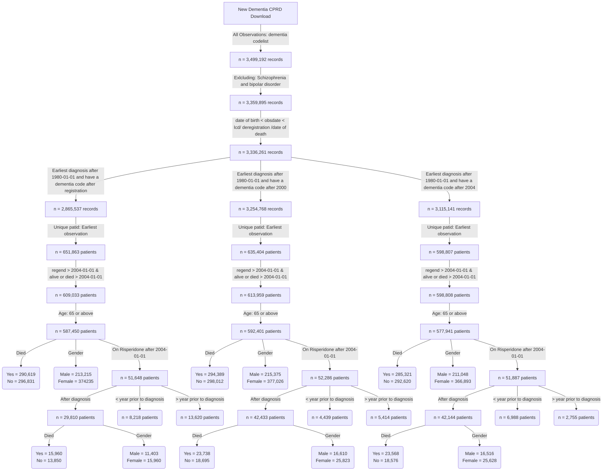

**This is the distribution of number of diagnosis per year for patients diagnosed after registration**


**This is the distribution of number of diagnosis per year for patients diagnosed after 2000**


**This is the distribution of number of prescriptions per year for patients diagnosed after 2004**


**BMJ codes vs ours**


```
BMJ codes	279
Our codes	631
Common codes	86
```
**Flow chart of the final cohorts**


**Dementia incident cohort**


```
                                            
                                              Overall       
  n                                           445386        
  diagnosedbeforeRegistration = 1 (%)         351540 (78.9) 
  died = 1 (%)                                223230 (50.1) 
  death_composite = 1 (%)                     325172 (73.0) 
  ONS_died = 1 (%)                            291568 (65.5) 
  age_diagnosis (mean (SD))                    82.35 (7.02) 
  age_category (%)                                          
     65 - 74                                   64316 (14.4) 
     75 - 84                                  202091 (45.4) 
     85 - 94                                  164328 (36.9) 
     95+                                       14651 ( 3.3) 
  year_of_diagnosis (%)                                     
     2004                                      20456 ( 4.6) 
     2005                                      17424 ( 3.9) 
     2006                                      19708 ( 4.4) 
     2007                                      17419 ( 3.9) 
     2008                                      18001 ( 4.0) 
     2009                                      19946 ( 4.5) 
     2010                                      21460 ( 4.8) 
     2011                                      22688 ( 5.1) 
     2012                                      25240 ( 5.7) 
     2013                                      27310 ( 6.1) 
     2014                                      29971 ( 6.7) 
     2015                                      29770 ( 6.7) 
     2016                                      26704 ( 6.0) 
     2017                                      26491 ( 5.9) 
     2018                                      25314 ( 5.7) 
     2019                                      24738 ( 5.6) 
     2020                                      19551 ( 4.4) 
     2021                                      20464 ( 4.6) 
     2022                                      19018 ( 4.3) 
     2023                                      13713 ( 3.1) 
  gender_decode = M (%)                       162443 (36.5) 
  GP_stroke = 1 (%)                            70388 (15.8) 
  stroke_composite = 1 (%)                     86280 (19.4) 
  primary_death_stroke = 1 (%)                 14707 ( 3.3) 
  HES_pre_stroke = 1 (%)                       37454 ( 8.4) 
  HES_post_stroke = 1 (%)                      18563 ( 4.2) 
  ethnicity (%)                                             
     Black                                      8389 ( 1.9) 
     Mixed                                      1491 ( 0.3) 
     Other                                      2607 ( 0.6) 
     South Asian                                8668 ( 1.9) 
     Unknown                                    9356 ( 2.1) 
     White                                    414875 (93.1) 
  pre_diagnoses_af = 1 (%)                     62308 (14.0) 
  post_diagnoses_af = 1 (%)                    28577 ( 6.4) 
  af_ever = 1 (%)                              92666 (20.8) 
  pre_diagnoses_angina = 1 (%)                 50119 (11.3) 
  post_diagnoses_angina = 1 (%)                 6096 ( 1.4) 
  angina_ever = 1 (%)                          56488 (12.7) 
  pre_diagnoses_anxiety_disorders = 1 (%)      67692 (15.2) 
  post_diagnoses_anxiety_disorders = 1 (%)     10556 ( 2.4) 
  anxiety_disorders_ever = 1 (%)               78965 (17.7) 
  pre_diagnoses_falls = 1 (%)                 112950 (25.4) 
  post_diagnoses_falls = 1 (%)                125064 (28.1) 
  falls_ever = 1 (%)                          240548 (54.0) 
  pre_diagnoses_fh_diabetes = 1 (%)            91139 (20.5) 
  post_diagnoses_fh_diabetes = 1 (%)            5686 ( 1.3) 
  fh_diabetes_ever = 1 (%)                     97031 (21.8) 
  heartfailure_ever = 1 (%)                    53889 (12.1) 
  pre_diagnoses_lowerlimbfracture = 1 (%)      54613 (12.3) 
  post_diagnoses_lowerlimbfracture = 1 (%)     32900 ( 7.4) 
  lowerlimbfracture_ever = 1 (%)               88301 (19.8) 
  pre_diagnoses_myocardialinfarction = 1 (%)   34853 ( 7.8) 
  post_diagnoses_myocardialinfarction = 1 (%)   6998 ( 1.6) 
  myocardialinfarction_ever = 1 (%)            42171 ( 9.5) 
  pre_diagnoses_qof_diabetes = 1 (%)           60796 (13.7) 
  post_diagnoses_qof_diabetes = 1 (%)          24662 ( 5.5) 
  qof_diabetes_ever = 1 (%)                    86487 (19.4) 
  pre_diagnoses_revasc = 1 (%)                 24091 ( 5.4) 
  post_diagnoses_revasc = 1 (%)                 1104 ( 0.2) 
  revasc_ever = 1 (%)                          25260 ( 5.7) 
  pre_diagnoses_stroke = 1 (%)                 48360 (10.9) 
  post_diagnoses_stroke = 1 (%)                20314 ( 4.6) 
  stroke_ever = 1 (%)                          70388 (15.8) 
  pre_diagnoses_tia = 1 (%)                    38226 ( 8.6) 
  post_diagnoses_tia = 1 (%)                   12286 ( 2.8) 
  tia_ever = 1 (%)                             51116 (11.5) 
  alcohol_cat (%)                                           
     Excess                                    23241 ( 5.2) 
     Harmful                                   11658 ( 2.6) 
     None                                      41684 ( 9.4) 
     Unknown                                  118201 (26.5) 
     Within limits                            250602 (56.3) 
  smoking_cat (%)                                           
     Active smoker                             35956 ( 8.1) 
     Ex-smoker                                185222 (41.6) 
     Non-smoker                               142206 (31.9) 
     Unknown                                   82002 (18.4) 
  qrisk2_smoking_cat (%)                                    
     0                                        191582 (43.0) 
     1                                        116591 (26.2) 
     2                                         34443 ( 7.7) 
     3                                          1163 ( 0.3) 
     4                                           877 ( 0.2) 
     Unknown                                  100730 (22.6) 
  qrisk2_smoking_cat_uncoded (%)                            
     Ex-smoker                                116591 (26.2) 
     Heavy smoker                                877 ( 0.2) 
     Light smoker                              34443 ( 7.7) 
     Moderate smoker                            1163 ( 0.3) 
     Non-smoker                               191582 (43.0) 
     Unknown                                  100730 (22.6) 
  gp_qrisk2_ethnicity (%)                                   
     Bangladeshi                                 716 ( 0.2) 
     Black African                              1358 ( 0.3) 
     Black Caribbean                            5554 ( 1.2) 
     Chinese                                     449 ( 0.1) 
     Indian                                     4048 ( 0.9) 
     Other                                      3587 ( 0.8) 
     Other Asian                                1575 ( 0.4) 
     Pakistani                                  1651 ( 0.4) 
     Unknown                                  112490 (25.3) 
     White                                    313958 (70.5) 
  hes_qrisk2_ethnicity (%)                                  
     Bangladeshi                                 616 ( 0.1) 
     Black African                              1304 ( 0.3) 
     Black Caribbean                            5521 ( 1.2) 
     Chinese                                     514 ( 0.1) 
     Indian                                     3784 ( 0.8) 
     Other                                      4955 ( 1.1) 
     Other Asian                                1600 ( 0.4) 
     Pakistani                                  1516 ( 0.3) 
     Unknown                                   32542 ( 7.3) 
     White                                    393034 (88.2) 
  gp_5cat_ethnicity (%)                                     
     Black                                      7623 ( 1.7) 
     Mixed                                      1302 ( 0.3) 
     Other                                      2023 ( 0.5) 
     South Asian                                8064 ( 1.8) 
     Unknown                                  112400 (25.2) 
     White                                    313974 (70.5) 
  hes_5cat_ethnicity (%)                                    
     Black                                      7830 ( 1.8) 
     Mixed                                      1031 ( 0.2) 
     Other                                      3433 ( 0.8) 
     South Asian                                7516 ( 1.7) 
     Unknown                                   32542 ( 7.3) 
     White                                    393034 (88.2) 
  gp_16cat_ethnicity (%)                                    
     African                                    1371 ( 0.3) 
     Bangladeshi                                 716 ( 0.2) 
     Caribbean                                  5582 ( 1.3) 
     Chinese                                     451 ( 0.1) 
     Indian                                     4052 ( 0.9) 
     Other                                      1590 ( 0.4) 
     Other Asian                                1585 ( 0.4) 
     Other Black                                 598 ( 0.1) 
     Other Mixed                                 341 ( 0.1) 
     Other White                                9380 ( 2.1) 
     Pakistani                                  1652 ( 0.4) 
     Unknown                                  112755 (25.3) 
     White and Asian                             165 ( 0.0) 
     White and Black African                     200 ( 0.0) 
     White and Black Caribbean                   612 ( 0.1) 
     White British                            299260 (67.2) 
     White Irish                                5076 ( 1.1) 
  hes_16cat_ethnicity (%)                                   
     African                                    1304 ( 0.3) 
     Bangladeshi                                 616 ( 0.1) 
     Caribbean                                  5521 ( 1.2) 
     Chinese                                     514 ( 0.1) 
     Indian                                     3784 ( 0.8) 
     Other                                      2919 ( 0.7) 
     Other Asian                                1600 ( 0.4) 
     Other Black                                1005 ( 0.2) 
     Other Mixed                                1031 ( 0.2) 
     Pakistani                                  1516 ( 0.3) 
     Unknown                                   32542 ( 7.3) 
     White British                            393034 (88.2) 
  pre_diagnoses_deep_vein_thrombosis = 1 (%)   20090 ( 4.5) 
  post_diagnoses_deep_vein_thrombosis = 1 (%)   8514 ( 1.9) 
  deep_vein_thrombosis_ever = 1 (%)            28825 ( 6.5) 
  pre_diagnoses_pulmonary_embolism = 1 (%)     10503 ( 2.4) 
  post_diagnoses_pulmonary_embolism = 1 (%)     4461 ( 1.0) 
  pulmonary_embolism_ever = 1 (%)              15125 ( 3.4) 
  VTE = 1 (%)                                  15125 ( 3.4) 
  Prescribed_3_months_before_obsdate = 1 (%)   88573 (19.9) 
  drug_name_3_months_before (%)                             
     amisulpride                                3714 ( 4.2) 
     aripiprazole                               1447 ( 1.6) 
     benperidol                                  120 ( 0.1) 
     chlorpromazine                              893 ( 1.0) 
     clozapine                                    16 ( 0.0) 
     flupentixol                                 300 ( 0.3) 
     fluphenazine                                 14 ( 0.0) 
     haloperidol                               20194 (22.8) 
     levomepromazine                           16302 (18.4) 
     lurasidone                                    2 ( 0.0) 
     olanzapine                                 5305 ( 6.0) 
     paliperidone                                  1 ( 0.0) 
     pericyazine                                 127 ( 0.1) 
     perphenazine                                 34 ( 0.0) 
     pimozide                                    988 ( 1.1) 
     prochlorperazine                          16259 (18.4) 
     promazine                                  4246 ( 4.8) 
     quetiapine                                17206 (19.4) 
     sulpiride                                   661 ( 0.7) 
     thioridazine                                 11 ( 0.0) 
     trifluoperazine                             639 ( 0.7) 
     zuclopenthixol                               94 ( 0.1) 
  Prescribed_6_months_before_obsdate = 1 (%)   91981 (20.7) 
  drug_name_6_months_before (%)                             
     amisulpride                                4000 ( 3.9) 
     aripiprazole                               1549 ( 1.5) 
     benperidol                                  126 ( 0.1) 
     chlorpromazine                             1095 ( 1.1) 
     clozapine                                    20 ( 0.0) 
     flupentixol                                 470 ( 0.5) 
     fluphenazine                                 21 ( 0.0) 
     haloperidol                               21136 (20.4) 
     levomepromazine                           16407 (15.8) 
     lurasidone                                    2 ( 0.0) 
     olanzapine                                 6522 ( 6.3) 
     paliperidone                                  1 ( 0.0) 
     pericyazine                                 149 ( 0.1) 
     perphenazine                                 46 ( 0.0) 
     pimozide                                   1825 ( 1.8) 
     prochlorperazine                          25309 (24.4) 
     promazine                                  4677 ( 4.5) 
     quetiapine                                18621 (18.0) 
     sulpiride                                   763 ( 0.7) 
     thioridazine                                 23 ( 0.0) 
     trifluoperazine                             803 ( 0.8) 
     zuclopenthixol                              101 ( 0.1) 
  Prescribed_12_months_before_obsdate = 1 (%)  97197 (21.8) 
  drug_name_12_months_before (%)                            
     amisulpride                                3903 ( 4.0) 
     aripiprazole                               1525 ( 1.6) 
     benperidol                                  125 ( 0.1) 
     chlorpromazine                             1033 ( 1.1) 
     clozapine                                    18 ( 0.0) 
     flupentixol                                 379 ( 0.4) 
     fluphenazine                                 17 ( 0.0) 
     haloperidol                               21042 (21.6) 
     levomepromazine                           16428 (16.9) 
     lurasidone                                    2 ( 0.0) 
     olanzapine                                 5884 ( 6.1) 
     paliperidone                                  1 ( 0.0) 
     pericyazine                                 145 ( 0.1) 
     perphenazine                                 43 ( 0.0) 
     pimozide                                   1192 ( 1.2) 
     prochlorperazine                          21088 (21.7) 
     promazine                                  4576 ( 4.7) 
     quetiapine                                18211 (18.7) 
     sulpiride                                   723 ( 0.7) 
     thioridazine                                 16 ( 0.0) 
     trifluoperazine                             748 ( 0.8) 
     zuclopenthixol                               98 ( 0.1) 
  Prescribed_after_obsdate = 1 (%)             81853 (18.4) 
  drug_name_after_obsdate (%)                               
     amisulpride                                3371 ( 4.1) 
     aripiprazole                               1347 ( 1.6) 
     benperidol                                  110 ( 0.1) 
     chlorpromazine                              752 ( 0.9) 
     clozapine                                    13 ( 0.0) 
     flupentixol                                 249 ( 0.3) 
     fluphenazine                                 12 ( 0.0) 
     haloperidol                               18898 (23.1) 
     levomepromazine                           16020 (19.6) 
     lurasidone                                    2 ( 0.0) 
     olanzapine                                 4776 ( 5.8) 
     paliperidone                                  1 ( 0.0) 
     pericyazine                                 111 ( 0.1) 
     perphenazine                                 28 ( 0.0) 
     pimozide                                    907 ( 1.1) 
     prochlorperazine                          14486 (17.7) 
     promazine                                  3776 ( 4.6) 
     quetiapine                                15758 (19.3) 
     sulpiride                                   590 ( 0.7) 
     thioridazine                                  8 ( 0.0) 
     trifluoperazine                             557 ( 0.7) 
     zuclopenthixol                               81 ( 0.1) 

```


```
           strata   median    lower    upper
1 gender_decode=F 4.914442 4.892539 4.941821
2 gender_decode=M 4.180698 4.153320 4.210815
```


```
                strata   median    lower    upper
1 age_category=65 - 74 7.701574 7.616701 7.789185
2 age_category=75 - 84 5.333333 5.305955 5.363450
3 age_category=85 - 94 3.263518 3.241615 3.288159
4     age_category=95+ 1.670089 1.620808 1.724846

```

**Risperidone incident cohort**
```
                                                           Overall       
  n                                                        29403        
  diagnosedbeforeRegistration = 1 (%)                      12621 (42.9) 
  died = 1 (%)                                             16900 (57.5) 
  age_risperidone (mean (SD))                              82.99 (6.88) 
  age_category (%)                                                      
     65 - 74                                                6389 (21.7) 
     75 - 84                                               14189 (48.3) 
     85+                                                    8825 (30.0) 
  stroke_3_months_prior = 1 (%)                              148 ( 0.5) 
  stroke_6_months_prior = 1 (%)                              222 ( 0.8) 
  stroke_12_months_prior = 1 (%)                             357 ( 1.2) 
  prescribed_BMJ_antipsyc_drug = 1 (%)                     25214 (85.8) 
  stroke_recency_cat (%)                                                
      <= 1                                                   357 (10.1) 
      > 7                                                   2987 (84.3) 
     1 - 2                                                   145 ( 4.1) 
     2 - 3                                                    49 ( 1.4) 
     3 - 4                                                     4 ( 0.1) 
  Stroke_prior_to_risperidone = 1 (%)                       3345 (11.4) 
  Stroke__within_year_after_1st_risperidone_presc = 1 (%)    395 ( 1.3) 
  death_in_a_year_after_risperidone = 1 (%)                 7060 (24.0) 
  sex = 1 (%)                                              11465 (39.0) 
  dementia_duration_prior_risperidone (mean (SD))           2.08 (2.32) 
  Survival_time (mean (SD))                                 1.74 (1.88) 
  comorbidity_af = 1 (%)                                    5263 (17.9) 
  pre_index_date_af = 1 (%)                                 4706 (16.0) 
  post_index_date_af = 1 (%)                                1768 ( 6.0) 
  comorbidity_angina = 1 (%)                                3556 (12.1) 
  pre_index_date_angina = 1 (%)                             3471 (11.8) 
  post_index_date_angina = 1 (%)                             331 ( 1.1) 
  comorbidity_anxiety_disorders = 1 (%)                     6100 (20.7) 
  pre_index_date_anxiety_disorders = 1 (%)                  5856 (19.9) 
  post_index_date_anxiety_disorders = 1 (%)                  662 ( 2.3) 
  comorbidity_falls = 1 (%)                                16545 (56.3) 
  pre_index_date_falls = 1 (%)                             11981 (40.7) 
  post_index_date_falls = 1 (%)                             8663 (29.5) 
  comorbidity_fh_diabetes = 1 (%)                           5979 (20.3) 
  pre_index_date_fh_diabetes = 1 (%)                        5893 (20.0) 
  post_index_date_fh_diabetes = 1 (%)                        125 ( 0.4) 
  comorbidity_fh_premature_cvd = 1 (%)                      2295 ( 7.8) 
  pre_index_date_fh_premature_cvd = 1 (%)                   2264 ( 7.7) 
  post_index_date_fh_premature_cvd = 1 (%)                    45 ( 0.2) 
  comorbidity_heartfailure = 1 (%)                          2624 ( 8.9) 
  pre_index_date_heartfailure = 1 (%)                       2228 ( 7.6) 
  post_index_date_heartfailure = 1 (%)                       875 ( 3.0) 
  comorbidity_lowerlimbfracture = 1 (%)                     6133 (20.9) 
  pre_index_date_lowerlimbfracture = 1 (%)                  4645 (15.8) 
  post_index_date_lowerlimbfracture = 1 (%)                 1869 ( 6.4) 
  comorbidity_myocardialinfarction = 1 (%)                  2549 ( 8.7) 
  pre_index_date_myocardialinfarction = 1 (%)               2402 ( 8.2) 
  post_index_date_myocardialinfarction = 1 (%)               270 ( 0.9) 
  comorbidity_qof_diabetes = 1 (%)                          5403 (18.4) 
  pre_index_date_qof_diabetes = 1 (%)                       5104 (17.4) 
  post_index_date_qof_diabetes = 1 (%)                      2337 ( 7.9) 
  comorbidity_revasc = 1 (%)                                1597 ( 5.4) 
  pre_index_date_revasc = 1 (%)                             1589 ( 5.4) 
  post_index_date_revasc = 1 (%)                              22 ( 0.1) 
  comorbidity_stroke = 1 (%)                                4125 (14.0) 
  pre_index_date_stroke = 1 (%)                             3542 (12.0) 
  post_index_date_stroke = 1 (%)                            1026 ( 3.5) 
  stroke_cat = ischaemic (%)                                3526 (85.5) 
  comorbidity_tia = 1 (%)                                   3167 (10.8) 
  pre_index_date_tia = 1 (%)                                2731 ( 9.3) 
  post_index_date_tia = 1 (%)                                667 ( 2.3) 
  comorbidity_deep_vein_thrombosis = 1 (%)                  1957 ( 6.7) 
  pre_index_date_deep_vein_thrombosis = 1 (%)               1505 ( 5.1) 
  post_index_date_deep_vein_thrombosis = 1 (%)               539 ( 1.8) 
  comorbidity_haem_cancer = 1 (%)                            659 ( 2.2) 
  pre_index_date_haem_cancer = 1 (%)                         571 ( 1.9) 
  post_index_date_haem_cancer = 1 (%)                        182 ( 0.6) 
  comorbidity_pulmonary_embolism = 1 (%)                     962 ( 3.3) 
  pre_index_date_pulmonary_embolism = 1 (%)                  740 ( 2.5) 
  post_index_date_pulmonary_embolism = 1 (%)                 265 ( 0.9) 
  comorbidity_solid_cancer = 1 (%)                          5083 (17.3) 
  pre_index_date_solid_cancer = 1 (%)                       4657 (15.8) 
  post_index_date_solid_cancer = 1 (%)                      1037 ( 3.5) 
  VTE = 1 (%)                                               2699 ( 9.2) 
  BMI (%)                                                               
     Normal                                                10641 (36.2) 
     Obesity                                                3845 (13.1) 
     Overweight                                             8497 (28.9) 
     Severely Obese                                          277 ( 0.9) 
     Underweight                                            1272 ( 4.3) 
     Unknown                                                4871 (16.6) 
  totalcholesterol (%)                                                  
     < 160 mg/dl                                            6592 (22.4) 
     > 280 mg/dl                                            1026 ( 3.5) 
     199 mg/dl                                              7377 (25.1) 
     200 - 239 mg/dl                                        6361 (21.6) 
     240 - 279 mg/dl                                        2772 ( 9.4) 
     Unknown                                                5275 (17.9) 
  testvalue_dbp (mean (SD))                                76.44 (11.78)
  testvalue_sbp (mean (SD))                               135.89 (20.25)
  testvalue_totalcholesterol (mean (SD))                    4.98 (1.24) 
  gp_5cat_ethnicity (%)                                                 
     Black                                                   439 ( 1.5) 
     Mixed                                                    88 ( 0.3) 
     Other                                                   145 ( 0.5) 
     South Asian                                             448 ( 1.5) 
     Unknown                                                6943 (23.6) 
     White                                                 21340 (72.6) 
  gp_16cat_ethnicity (%)                                                
     African                                                  74 ( 0.3) 
     Bangladeshi                                              32 ( 0.1) 
     Caribbean                                               317 ( 1.1) 
     Chinese                                                  21 ( 0.1) 
     Indian                                                  228 ( 0.8) 
     Other                                                   126 ( 0.4) 
     Other Asian                                              82 ( 0.3) 
     Other Black                                              47 ( 0.2) 
     Other Mixed                                              20 ( 0.1) 
     Other White                                             656 ( 2.2) 
     Pakistani                                               101 ( 0.3) 
     Unknown                                                6964 (23.7) 
     White and Asian                                          16 ( 0.1) 
     White and Black African                                  10 ( 0.0) 
     White and Black Caribbean                                40 ( 0.1) 
     White British                                         20356 (69.2) 
     White Irish                                             313 ( 1.1) 
  gp_qrisk2_ethnicity (%)                                               
     Bangladeshi                                              32 ( 0.1) 
     Black African                                            74 ( 0.3) 
     Black Caribbean                                         315 ( 1.1) 
     Chinese                                                  21 ( 0.1) 
     Indian                                                  228 ( 0.8) 
     Other                                                   261 ( 0.9) 
     Other Asian                                              81 ( 0.3) 
     Pakistani                                               101 ( 0.3) 
     Unknown                                                6950 (23.6) 
     White                                                 21340 (72.6) 
  alcohol_cat (%)                                                       
     Excess                                                 1453 ( 4.9) 
     Harmful                                                 803 ( 2.7) 
     None                                                   2176 ( 7.4) 
     Unknown                                               10220 (34.8) 
     Within limits                                         14751 (50.2) 
  smoking_cat (%)                                                       
     Active smoker                                          2016 ( 6.9) 
     Ex-smoker                                             11099 (37.7) 
     Non-smoker                                             8123 (27.6) 
     Unknown                                                8165 (27.8) 
  qrisk2_smoking_cat (%)                                                
     0                                                     10804 (36.7) 
     1                                                      7287 (24.8) 
     2                                                      1983 ( 6.7) 
     3                                                        69 ( 0.2) 
     4                                                        38 ( 0.1) 
     Unknown                                                9222 (31.4) 
  qrisk2_smoking_cat_uncoded (%)                                        
     Ex-smoker                                              7287 (24.8) 
     Heavy smoker                                             38 ( 0.1) 
     Light smoker                                           1983 ( 6.7) 
     Moderate smoker                                          69 ( 0.2) 
     Non-smoker                                            10804 (36.7) 
     Unknown                                                9222 (31.4) 
  drug_name (%)                                                         
     amisulpride                                             461 ( 3.1) 
     aripiprazole                                            199 ( 1.3) 
     benperidol                                               18 ( 0.1) 
     chlorpromazine                                          206 ( 1.4) 
     clozapine                                                 1 ( 0.0) 
     flupentixol                                             159 ( 1.1) 
     fluphenazine                                             12 ( 0.1) 
     haloperidol                                            2622 (17.6) 
     levomepromazine                                        1693 (11.3) 
     olanzapine                                             1092 ( 7.3) 
     pericyazine                                              30 ( 0.2) 
     perphenazine                                             11 ( 0.1) 
     pimozide                                                128 ( 0.9) 
     prochlorperazine                                       5947 (39.8) 
     promazine                                               474 ( 3.2) 
     quetiapine                                             1732 (11.6) 
     sulpiride                                                32 ( 0.2) 
     thioridazine                                             29 ( 0.2) 
     trifluoperazine                                          71 ( 0.5) 
     zuclopenthixol                                           13 ( 0.1) 
  frailty (%)                                                           
     Mild                                                   1358 ( 4.6) 
     Moderate                                               3433 (11.7) 
     Severe                                                 5374 (18.3) 
     Unknown                                               19238 (65.4) 
  year_diagnosis_cat (%)                                                
     > 2020                                                 1225 ( 4.2) 
     2004 - 2008                                            4967 (16.9) 
     2009 - 2012                                            7705 (26.2) 
     2013 - 2016                                            9311 (31.7) 
     2017 - 2020                                            6195 (21.1) 
  prescribed_other_antipsyc_drug = 1 (%)                   14930 (50.8) 
  pre_indexdate_antipysch_prescr = 1 (%)                    9958 (66.7) 
  post_indexdate_antipysch_prescr = 1 (%)                   4890 (32.8) 
  same_indexdate_antipysch_prescr = 1 (%)                     82 ( 0.5) 
  pre_indexdate_drug_name (%)                                           
     amisulpride                                             183 ( 1.8) 
     aripiprazole                                             76 ( 0.8) 
     benperidol                                                7 ( 0.1) 
     chlorpromazine                                          118 ( 1.2) 
     clozapine                                                 1 ( 0.0) 
     flupentixol                                             193 ( 1.9) 
     fluphenazine                                             11 ( 0.1) 
     haloperidol                                             892 ( 9.0) 
     levomepromazine                                          91 ( 0.9) 
     olanzapine                                              573 ( 5.8) 
     pericyazine                                              18 ( 0.2) 
     perphenazine                                              7 ( 0.1) 
     pimozide                                                118 ( 1.2) 
     prochlorperazine                                       5952 (59.8) 
     promazine                                               299 ( 3.0) 
     quetiapine                                             1165 (11.7) 
     sulpiride                                                40 ( 0.4) 
     thioridazine                                             94 ( 0.9) 
     trifluoperazine                                         115 ( 1.2) 
     zuclopenthixol                                            5 ( 0.1) 
  same_indexdate_drug_name (%)                                          
     amisulpride                                               2 ( 2.4) 
     aripiprazole                                              8 ( 9.8) 
     chlorpromazine                                            4 ( 4.9) 
     flupentixol                                               2 ( 2.4) 
     haloperidol                                              20 (24.4) 
     levomepromazine                                           1 ( 1.2) 
     olanzapine                                                2 ( 2.4) 
     pimozide                                                  8 ( 9.8) 
     prochlorperazine                                          5 ( 6.1) 
     promazine                                                12 (14.6) 
     quetiapine                                               16 (19.5) 
     trifluoperazine                                           2 ( 2.4) 
  post_indexdate_drug_name (%)                                          
     amisulpride                                             110 ( 2.2) 
     aripiprazole                                            175 ( 3.6) 
     benperidol                                                3 ( 0.1) 
     chlorpromazine                                           26 ( 0.5) 
     flupentixol                                              10 ( 0.2) 
     haloperidol                                            1371 (28.0) 
     levomepromazine                                        1560 (31.9) 
     olanzapine                                              454 ( 9.3) 
     pericyazine                                               4 ( 0.1) 
     pimozide                                                 35 ( 0.7) 
     prochlorperazine                                        310 ( 6.3) 
     promazine                                               107 ( 2.2) 
     quetiapine                                              696 (14.2) 
     sulpiride                                                10 ( 0.2) 
     trifluoperazine                                          13 ( 0.3) 
     zuclopenthixol                                            6 ( 0.1) 
  care_home = 1 (%)                                        12231 (41.6) 
  care_home_before_indexdate = 1 (%)                        3941 (32.2) 
  care_home_at_indexdate = 1 (%)                             125 ( 1.0) 
  care_home_90_days_after_indexdate = 1 (%)                 2661 (21.8) 
  TimeSinceFirstPrescription (mean (SD))                    0.49 (0.92) 
  Prescription_ever_cat (%)                                             
     >100                                                    543 ( 1.8) 
     1                                                      5060 (17.2) 
     10                                                      766 ( 2.6) 
     11 - 20                                                5018 (17.1) 
     2                                                      2576 ( 8.8) 
     21 - 30                                                2712 ( 9.2) 
     3                                                      1878 ( 6.4) 
     31 - 40                                                1574 ( 5.4) 
     4                                                      1539 ( 5.2) 
     41 - 50                                                 985 ( 3.3) 
     5                                                      1265 ( 4.3) 
     51 - 100                                               1616 ( 5.5) 
     6                                                      1082 ( 3.7) 
     7                                                      1022 ( 3.5) 
     8                                                       912 ( 3.1) 
     9                                                       855 ( 2.9) 
  Prescriptions_after_a_year_cat (%)                                    
     >100                                                    295 ( 3.0) 
     1                                                       683 ( 7.0) 
     10                                                      286 ( 2.9) 
     11 - 20                                                2066 (21.3) 
     2                                                       594 ( 6.1) 
     21 - 30                                                1169 (12.0) 
     3                                                       514 ( 5.3) 
     31 - 40                                                 741 ( 7.6) 
     4                                                       440 ( 4.5) 
     41 - 50                                                 464 ( 4.8) 
     5                                                       407 ( 4.2) 
     51 - 100                                                695 ( 7.2) 
     6                                                       364 ( 3.7) 
     7                                                       362 ( 3.7) 
     8                                                       323 ( 3.3) 
     9                                                       306 ( 3.2) 
  Prescriptions_within_a_year_cat (%)                                   
     >100                                                     16 ( 0.1) 
     1                                                      5272 (17.9) 
     10                                                      941 ( 3.2) 
     11 - 20                                                9240 (31.4) 
     2                                                      2659 ( 9.0) 
     21 - 30                                                 841 ( 2.9) 
     3                                                      1947 ( 6.6) 
     31 - 40                                                 304 ( 1.0) 
     4                                                      1603 ( 5.5) 
     41 - 50                                                 293 ( 1.0) 
     5                                                      1352 ( 4.6) 
     51 - 100                                                514 ( 1.7) 
     6                                                      1200 ( 4.1) 
     7                                                      1188 ( 4.0) 
     8                                                      1050 ( 3.6) 
     9                                                       983 ( 3.3) 
  consultation_counts_Cat (%)                                           
     0 - 50                                                10394 (35.8) 
     101 - 150                                              5087 (17.5) 
     151 - 200                                              1931 ( 6.7) 
     201 - 250                                               731 ( 2.5) 
     251 - 300                                               302 ( 1.0) 
     301 - 350                                               123 ( 0.4) 
     351 - 400                                                50 ( 0.2) 
     401 - 450                                                34 ( 0.1) 
     451 - 500                                                28 ( 0.1) 
     501 - 800                                                30 ( 0.1) 
     51 - 100                                              10320 (35.5) 
     801 - 1000                                                3 ( 0.0) 
  pre_BMJ_indexdate_drug_name (%)                                       
     amisulpride                                             168 ( 8.9) 
     aripiprazole                                             15 ( 0.8) 
     benperidol                                                7 ( 0.4) 
     chlorpromazine                                          117 ( 6.2) 
     clozapine                                                 1 ( 0.1) 
     flupentixol                                             121 ( 6.4) 
     fluphenazine                                             10 ( 0.5) 
     haloperidol                                             830 (43.8) 
     levomepromazine                                          10 ( 0.5) 
     olanzapine                                               48 ( 2.5) 
     pericyazine                                              18 ( 0.9) 
     perphenazine                                              2 ( 0.1) 
     pimozide                                                  5 ( 0.3) 
     prochlorperazine                                        359 (18.9) 
     promazine                                                41 ( 2.2) 
     quetiapine                                               66 ( 3.5) 
     sulpiride                                                15 ( 0.8) 
     thioridazine                                             29 ( 1.5) 
     trifluoperazine                                          33 ( 1.7) 
     zuclopenthixol                                            1 ( 0.1) 
  same_BMJ_indexdate_drug_name (%)                                      
     amisulpride                                              88 ( 0.9) 
     aripiprazole                                            187 ( 1.8) 
     benperidol                                                3 ( 0.0) 
     chlorpromazine                                           26 ( 0.3) 
     flupentixol                                              62 ( 0.6) 
     fluphenazine                                              1 ( 0.0) 
     haloperidol                                            1150 (11.2) 
     levomepromazine                                        1287 (12.6) 
     olanzapine                                              760 ( 7.4) 
     pericyazine                                               4 ( 0.0) 
     perphenazine                                              5 ( 0.0) 
     pimozide                                                128 ( 1.2) 
     prochlorperazine                                       4764 (46.5) 
     promazine                                               283 ( 2.8) 
     quetiapine                                             1346 (13.1) 
     sulpiride                                                25 ( 0.2) 
     thioridazine                                             55 ( 0.5) 
     trifluoperazine                                          67 ( 0.7) 
     zuclopenthixol                                            5 ( 0.0) 
  post_BMJ_indexdate_drug_name (%)                                      
     amisulpride                                              31 ( 3.7) 
     aripiprazole                                             28 ( 3.3) 
     chlorpromazine                                            4 ( 0.5) 
     flupentixol                                               8 ( 0.9) 
     haloperidol                                             138 (16.3) 
     levomepromazine                                          89 (10.5) 
     olanzapine                                               64 ( 7.6) 
     pimozide                                                  7 ( 0.8) 
     prochlorperazine                                        313 (37.0) 
     promazine                                                22 ( 2.6) 
     quetiapine                                              124 (14.7) 
     sulpiride                                                 4 ( 0.5) 
     trifluoperazine                                          10 ( 1.2) 
     zuclopenthixol                                            3 ( 0.4) 
  comorbidity_hypertension (%)                                          
     Elevated                                               3250 (11.1) 
     Normal                                                 4041 (13.7) 
     Stage 1                                               13011 (44.3) 
     Stage 2                                                8491 (28.9) 
     Stage 3 (severe)                                        189 ( 0.6) 
     Unknown                                                 421 ( 1.4) 
  pre_index_date_hypertension = 1 (%)                      24392 (84.1) 
  comorbidity_hearing_loss = 1 (%)                          8307 (28.3) 
  pre_index_date_hearing_loss = 1 (%)                       7810 (26.6) 
  post_index_date_hearing_loss = 1 (%)                      1098 ( 3.7) 
  pre_indexdate_BMJ_antipysch_prescr = 1 (%)                1908 ( 7.6) 
  post_indexdate_BMJ_antipysch_prescr = 1 (%)               1684 ( 6.7) 
  same_indexdate_BMJ_antipysch_prescr = 1 (%)              21622 (85.8) 
  HES_comorbidity_stroke = 1 (%)                            3135 (10.7) 
  HES_pre_index_date_stroke = 1 (%)                         2528 ( 8.6) 
  HES_post_index_date_stroke = 1 (%)                         927 ( 3.2) 
  hes_5cat_ethnicity (%)                                                
     Black                                                   469 ( 1.6) 
     Mixed                                                    66 ( 0.2) 
     Other                                                   186 ( 0.6) 
     South Asian                                             437 ( 1.5) 
     Unknown                                                2076 ( 7.1) 
     White                                                 26169 (89.0) 
  hes_16cat_ethnicity (%)                                               
     African                                                  77 ( 0.3) 
     Bangladeshi                                              29 ( 0.1) 
     Caribbean                                               338 ( 1.1) 
     Chinese                                                  20 ( 0.1) 
     Indian                                                  202 ( 0.7) 
     Other                                                   166 ( 0.6) 
     Other Asian                                             104 ( 0.4) 
     Other Black                                              54 ( 0.2) 
     Other Mixed                                              66 ( 0.2) 
     Pakistani                                               102 ( 0.3) 
     Unknown                                                2076 ( 7.1) 
     White British                                         26169 (89.0) 
  hes_qrisk2_ethnicity (%)                                              
     Bangladeshi                                              29 ( 0.1) 
     Black African                                            77 ( 0.3) 
     Black Caribbean                                         338 ( 1.1) 
     Chinese                                                  20 ( 0.1) 
     Indian                                                  202 ( 0.7) 
     Other                                                   286 ( 1.0) 
     Other Asian                                             104 ( 0.4) 
     Pakistani                                               102 ( 0.3) 
     Unknown                                                2076 ( 7.1) 
     White                                                 26169 (89.0) 
  primary_death_stroke = 1 (%)                               739 ( 2.5) 
                               
```


```
           strata   median    lower    upper
1 gender_decode=F 2.436687 2.376454 2.505133
2 gender_decode=M 1.889117 1.817933 1.943874
```


```
                strata   median    lower    upper
1 age_category=65 - 74 3.529090 3.405886 3.668720
2 age_category=75 - 84 2.390144 2.318960 2.453114
3     age_category=85+ 1.420945 1.374401 1.478439

```


**COX model**
```
Call:
coxph(formula = Surv(Survival_time, post_index_date_stroke) ~ 
    age_diagnosis + pre_index_date_stroke + sex, data = CompleteData)

  n= 23959, number of events= 846 

                           coef exp(coef) se(coef)      z Pr(>|z|)    
age_diagnosis          0.013706  1.013801 0.005042  2.719  0.00656 ** 
pre_index_date_stroke1 1.903718  6.710798 0.069880 27.243  < 2e-16 ***
sex1                   0.174512  1.190665 0.072553  2.405  0.01616 *  
---
Signif. codes:  0 ‘***’ 0.001 ‘**’ 0.01 ‘*’ 0.05 ‘.’ 0.1 ‘ ’ 1

                       exp(coef) exp(-coef) lower .95 upper .95
age_diagnosis              1.014     0.9864     1.004     1.024
pre_index_date_stroke1     6.711     0.1490     5.852     7.696
sex1                       1.191     0.8399     1.033     1.373

Concordance= 0.726  (se = 0.011 )
Likelihood ratio test= 640.9  on 3 df,   p=<2e-16
Wald test            = 776.8  on 3 df,   p=<2e-16
Score (logrank) test = 1043  on 3 df,   p=<2e-16

```


**One year censoring**

```
Call:
coxph(formula = Surv(Survival_time, post_index_date_stroke) ~ 
    age_diagnosis + pre_index_date_stroke + sex, data = CensoringData_1year)

  n= 23940, number of events= 501 
   (19 observations deleted due to missingness)

                           coef exp(coef) se(coef)      z Pr(>|z|)    
age_diagnosis          0.010646  1.010703 0.006488  1.641   0.1008    
pre_index_date_stroke1 2.196622  8.994583 0.090048 24.394   <2e-16 ***
sex1                   0.199762  1.221113 0.092650  2.156   0.0311 *  
---
Signif. codes:  0 ‘***’ 0.001 ‘**’ 0.01 ‘*’ 0.05 ‘.’ 0.1 ‘ ’ 1

                       exp(coef) exp(-coef) lower .95 upper .95
age_diagnosis              1.011     0.9894    0.9979     1.024
pre_index_date_stroke1     8.995     0.1112    7.5393    10.731
sex1                       1.221     0.8189    1.0183     1.464

Concordance= 0.742  (se = 0.013 )
Likelihood ratio test= 546.2  on 3 df,   p=<2e-16
Wald test            = 619.1  on 3 df,   p=<2e-16
Score (logrank) test = 915.7  on 3 df,   p=<2e-16
```

**Excluding stroke 3 months prior**


```
Call:
coxph(formula = Surv(Survival_time, post_index_date_stroke) ~ 
    age_diagnosis + pre_index_date_stroke + sex, data = Excluding_3_monthsPriorStroke)

  n= 23836, number of events= 789 

                           coef exp(coef) se(coef)      z Pr(>|z|)    
age_diagnosis          0.017014  1.017160 0.005212  3.264   0.0011 ** 
pre_index_date_stroke1 1.769601  5.868512 0.073380 24.116   <2e-16 ***
sex1                   0.176362  1.192870 0.075323  2.341   0.0192 *  
---
Signif. codes:  0 ‘***’ 0.001 ‘**’ 0.01 ‘*’ 0.05 ‘.’ 0.1 ‘ ’ 1

                       exp(coef) exp(-coef) lower .95 upper .95
age_diagnosis              1.017     0.9831     1.007     1.028
pre_index_date_stroke1     5.869     0.1704     5.082     6.776
sex1                       1.193     0.8383     1.029     1.383

Concordance= 0.706  (se = 0.011 )
Likelihood ratio test= 499.9  on 3 df,   p=<2e-16
Wald test            = 615.9  on 3 df,   p=<2e-16
Score (logrank) test = 794.9  on 3 df,   p=<2e-16


```


**Excluding stroke 12 months prior**


```
Call:
coxph(formula = Surv(Survival_time, post_index_date_stroke) ~ 
    age_diagnosis + pre_index_date_stroke + sex, data = Excluding_12_monthsPriorStroke)

  n= 23670, number of events= 744 

                           coef exp(coef) se(coef)      z Pr(>|z|)    
age_diagnosis          0.019554  1.019747 0.005376  3.637 0.000276 ***
pre_index_date_stroke1 1.663083  5.275553 0.076970 21.607  < 2e-16 ***
sex1                   0.184390  1.202484 0.077672  2.374 0.017598 *  
---
Signif. codes:  0 ‘***’ 0.001 ‘**’ 0.01 ‘*’ 0.05 ‘.’ 0.1 ‘ ’ 1

                       exp(coef) exp(-coef) lower .95 upper .95
age_diagnosis              1.020     0.9806     1.009     1.031
pre_index_date_stroke1     5.276     0.1896     4.537     6.135
sex1                       1.202     0.8316     1.033     1.400

Concordance= 0.689  (se = 0.012 )
Likelihood ratio test= 401.8  on 3 df,   p=<2e-16
Wald test            = 501  on 3 df,   p=<2e-16
Score (logrank) test = 627.7  on 3 df,   p=<2e-16

```


**Matching**
1. No history of other antipsychotic drugs
2. No history of other antipsychotic drugs in the last 12 months
3. No history of other antipsychotic drugs in the last 3 months
4. Exclude anyone who was prescribed risperidone at any point from the controls
5. Match with just age and sex


****No history of antipsychotic****

```

                                                        
                                                          Overall       
  n                                                       14215         
  sex = 1 (%)                                              6089 ( 42.8) 
  risperidone = 1 (%)                                     14215 (100.0) 
  age_diagnosis (mean (SD))                               80.32 (7.12)  
  Stroke__within_year_after_1st_risperidone_presc = 1 (%)   201 (  1.4) 
  pre_index_date_angina = 1 (%)                            1468 ( 10.3) 
  pre_index_date_heartfailure = 1 (%)                       996 (  7.0) 
  BMI (%)                                                               
     Missing                                               3374 ( 23.7) 
     Normal                                                5280 ( 37.1) 
     Obesity                                               1359 (  9.6) 
     Overweight                                            3366 ( 23.7) 
     Severely Obese                                          73 (  0.5) 
     Underweight                                            763 (  5.4) 
  period_before_prescription (mean (SD))                   2.48 (2.33)  
  comorbidity_myocardialinfarction = 1 (%)                 1159 (  8.2) 
  pre_index_date_stroke = 1 (%)                            1604 ( 11.3) 
  pre_index_date_tia = 1 (%)                               1185 (  8.3) 
  pre_index_date_falls = 1 (%)                             5301 ( 37.3) 
  pre_index_date_lowerlimbfracture = 1 (%)                 2102 ( 14.8) 
  pre_index_date_ihd = 1 (%)                               2196 ( 15.4) 
  pre_index_date_pad = 1 (%)                               1012 (  7.1) 
  pre_index_date_af = 1 (%)                                2215 ( 15.6) 
  pre_index_date_revasc = 1 (%)                             710 (  5.0) 
  pre_index_date_qof_diabetes = 1 (%)                      2348 ( 16.5) 
  pre_index_date_anxiety_disorders = 1 (%)                 2360 ( 16.6) 
  pre_index_date_fh_diabetes = 1 (%)                       2708 ( 19.1) 
  pre_index_date_fh_premature_cvd = 1 (%)                  1015 (  7.1) 
  pre_index_date_pulmonary_embolism = 1 (%)                 337 (  2.4) 
  pre_index_date_deep_vein_thrombosis = 1 (%)               650 (  4.6) 
  pre_index_date_hearing_loss = 1 (%)                      3559 ( 25.0) 
  VTE = 1 (%)                                              1207 (  8.5) 
  gp_5cat_ethnicity (%)                                                 
     Black                                                  227 (  1.6) 
     Mixed                                                   51 (  0.4) 
     Other                                                   80 (  0.6) 
     South Asian                                            176 (  1.2) 
     Unknown                                               3412 ( 24.0) 
     White                                                10269 ( 72.2) 
  comorbidity_hypertension (%)                                          
     Elevated                                              2424 ( 17.1) 
     Normal                                                3624 ( 25.5) 
     Stage 1                                               5398 ( 38.0) 
     Stage 2                                               2201 ( 15.5) 
     Stage 3 (severe)                                        19 (  0.1) 
     Unknown                                                549 (  3.9) 
  Survival_time (mean (SD))                                1.57 (1.73)


                                                         Overall      
  n                                                       69804        
  sex = 1 (%)                                             29877 (42.8) 
  risperidone = 1 (%)                                         0 ( 0.0) 
  age_diagnosis (mean (SD))                               80.35 (7.06) 
  Stroke__within_year_after_1st_risperidone_presc = 1 (%)   765 ( 1.1) 
  pre_index_date_angina = 1 (%)                            7235 (10.4) 
  pre_index_date_heartfailure = 1 (%)                      4972 ( 7.1) 
  BMI (%)                                                              
     Missing                                              16342 (23.4) 
     Normal                                               26057 (37.3) 
     Obesity                                               6769 ( 9.7) 
     Overweight                                           16535 (23.7) 
     Severely Obese                                         341 ( 0.5) 
     Underweight                                           3760 ( 5.4) 
  period_before_prescription (mean (SD))                   2.55 (2.05) 
  comorbidity_myocardialinfarction = 1 (%)                 5765 ( 8.3) 
  pre_index_date_stroke = 1 (%)                            7939 (11.4) 
  pre_index_date_tia = 1 (%)                               5764 ( 8.3) 
  pre_index_date_falls = 1 (%)                            26074 (37.4) 
  pre_index_date_lowerlimbfracture = 1 (%)                10529 (15.1) 
  pre_index_date_ihd = 1 (%)                              10727 (15.4) 
  pre_index_date_pad = 1 (%)                               5020 ( 7.2) 
  pre_index_date_af = 1 (%)                               10958 (15.7) 
  pre_index_date_revasc = 1 (%)                            3403 ( 4.9) 
  pre_index_date_qof_diabetes = 1 (%)                     11656 (16.7) 
  pre_index_date_anxiety_disorders = 1 (%)                11774 (16.9) 
  pre_index_date_fh_diabetes = 1 (%)                      13405 (19.2) 
  pre_index_date_fh_premature_cvd = 1 (%)                  5155 ( 7.4) 
  pre_index_date_pulmonary_embolism = 1 (%)                1684 ( 2.4) 
  pre_index_date_deep_vein_thrombosis = 1 (%)              3193 ( 4.6) 
  pre_index_date_hearing_loss = 1 (%)                     17681 (25.3) 
  VTE = 1 (%)                                              5975 ( 8.6) 
  gp_5cat_ethnicity (%)                                                
     Black                                                 1167 ( 1.7) 
     Mixed                                                  261 ( 0.4) 
     Other                                                  434 ( 0.6) 
     South Asian                                            868 ( 1.2) 
     Unknown                                              16539 (23.7) 
     White                                                50535 (72.4) 
  comorbidity_hypertension (%)                                         
     Elevated                                             12114 (17.4) 
     Normal                                               18070 (25.9) 
     Stage 1                                              26594 (38.1) 
     Stage 2                                              10891 (15.6) 
     Stage 3 (severe)                                        93 ( 0.1) 
     Unknown                                               2042 ( 2.9) 
  Survival_time (mean (SD))                                1.56 (1.92)


                                                        Stratified by risperidone
                                                          0             1              p      test SMD   
  n                                                       69804         14215                            
  sex = 1 (%)                                             29877 (42.8)   6089 ( 42.8)   0.948       0.001
  risperidone = 1 (%)                                         0 ( 0.0)  14215 (100.0)  <0.001         NaN
  age_diagnosis (mean (SD))                               80.35 (7.06)  80.32 (7.12)    0.589       0.005
  Stroke__within_year_after_1st_risperidone_presc = 1 (%)   765 ( 1.1)    201 (  1.4)   0.001       0.029
  pre_index_date_angina = 1 (%)                            7235 (10.4)   1468 ( 10.3)   0.905       0.001
  pre_index_date_heartfailure = 1 (%)                      4972 ( 7.1)    996 (  7.0)   0.636       0.005
  BMI (%)                                                                               0.961       0.009
     Missing                                              16342 (23.4)   3374 ( 23.7)                    
     Normal                                               26057 (37.3)   5280 ( 37.1)                    
     Obesity                                               6769 ( 9.7)   1359 (  9.6)                    
     Overweight                                           16535 (23.7)   3366 ( 23.7)                    
     Severely Obese                                         341 ( 0.5)     73 (  0.5)                    
     Underweight                                           3760 ( 5.4)    763 (  5.4)                    
  period_before_prescription (mean (SD))                   2.55 (2.05)   2.48 (2.33)   <0.001       0.032
  comorbidity_myocardialinfarction = 1 (%)                 5765 ( 8.3)   1159 (  8.2)   0.689       0.004
  pre_index_date_stroke = 1 (%)                            7939 (11.4)   1604 ( 11.3)   0.770       0.003
  pre_index_date_tia = 1 (%)                               5764 ( 8.3)   1185 (  8.3)   0.768       0.003
  pre_index_date_falls = 1 (%)                            26074 (37.4)   5301 ( 37.3)   0.898       0.001
  pre_index_date_lowerlimbfracture = 1 (%)                10529 (15.1)   2102 ( 14.8)   0.374       0.008
  pre_index_date_ihd = 1 (%)                              10727 (15.4)   2196 ( 15.4)   0.817       0.002
  pre_index_date_pad = 1 (%)                               5020 ( 7.2)   1012 (  7.1)   0.774       0.003
  pre_index_date_af = 1 (%)                               10958 (15.7)   2215 ( 15.6)   0.738       0.003
  pre_index_date_revasc = 1 (%)                            3403 ( 4.9)    710 (  5.0)   0.561       0.006
  pre_index_date_qof_diabetes = 1 (%)                     11656 (16.7)   2348 ( 16.5)   0.607       0.005
  pre_index_date_anxiety_disorders = 1 (%)                11774 (16.9)   2360 ( 16.6)   0.449       0.007
  pre_index_date_fh_diabetes = 1 (%)                      13405 (19.2)   2708 ( 19.1)   0.680       0.004
  pre_index_date_fh_premature_cvd = 1 (%)                  5155 ( 7.4)   1015 (  7.1)   0.317       0.009
  pre_index_date_pulmonary_embolism = 1 (%)                1684 ( 2.4)    337 (  2.4)   0.790       0.003
  pre_index_date_deep_vein_thrombosis = 1 (%)              3193 ( 4.6)    650 (  4.6)   1.000      <0.001
  pre_index_date_hearing_loss = 1 (%)                     17681 (25.3)   3559 ( 25.0)   0.471       0.007
  VTE = 1 (%)                                              5975 ( 8.6)   1207 (  8.5)   0.802       0.002
  gp_5cat_ethnicity (%)                                                                 0.894       0.012
     Black                                                 1167 ( 1.7)    227 (  1.6)                    
     Mixed                                                  261 ( 0.4)     51 (  0.4)                    
     Other                                                  434 ( 0.6)     80 (  0.6)                    
     South Asian                                            868 ( 1.2)    176 (  1.2)                    
     Unknown                                              16539 (23.7)   3412 ( 24.0)                    
     White                                                50535 (72.4)  10269 ( 72.2)                    
  comorbidity_hypertension (%)                                                         <0.001       0.052
     Elevated                                             12114 (17.4)   2424 ( 17.1)                    
     Normal                                               18070 (25.9)   3624 ( 25.5)                    
     Stage 1                                              26594 (38.1)   5398 ( 38.0)                    
     Stage 2                                              10891 (15.6)   2201 ( 15.5)                    
     Stage 3 (severe)                                        93 ( 0.1)     19 (  0.1)                    
     Unknown                                               2042 ( 2.9)    549 (  3.9)                    
  Survival_time (mean (SD))                                1.56 (1.92)   1.57 (1.73)    0.455       0.007
```


```
         strata   median    lower    upper
1 risperidone=0 5.927447 5.867214 5.984942
2 risperidone=1 5.637235 5.549624 5.763176

```


```
         strata   median    lower    upper
1 risperidone=0 8.106776 7.800137 8.303901
2 risperidone=1 7.003422 6.570842 7.394935

```


****No history of antipsychotic in the last 12 months****

```
                                                        
                                                          Overall       
  n                                                       20538         
  sex = 1 (%)                                              8033 ( 39.1) 
  risperidone = 1 (%)                                     20538 (100.0) 
  age_diagnosis (mean (SD))                               80.53 (7.11)  
  Stroke__within_year_after_1st_risperidone_presc = 1 (%)   277 (  1.3) 
  pre_index_date_angina = 1 (%)                            2423 ( 11.8) 
  pre_index_date_heartfailure = 1 (%)                      1594 (  7.8) 
  BMI (%)                                                               
     Missing                                               3834 ( 18.7) 
     Normal                                                7994 ( 38.9) 
     Obesity                                               2208 ( 10.8) 
     Overweight                                            5196 ( 25.3) 
     Severely Obese                                         135 (  0.7) 
     Underweight                                           1171 (  5.7) 
  Prescribed_other_antipsychotic_Prior = 1 (%)             6285 ( 30.6) 
  period_before_prescription (mean (SD))                   2.51 (2.34)  
  comorbidity_myocardialinfarction = 1 (%)                 1744 (  8.5) 
  pre_index_date_stroke = 1 (%)                            2404 ( 11.7) 
  pre_index_date_tia = 1 (%)                               1875 (  9.1) 
  pre_index_date_falls = 1 (%)                             8606 ( 41.9) 
  pre_index_date_lowerlimbfracture = 1 (%)                 3197 ( 15.6) 
  pre_index_date_ihd = 1 (%)                               3410 ( 16.6) 
  pre_index_date_pad = 1 (%)                               1568 (  7.6) 
  pre_index_date_af = 1 (%)                                3324 ( 16.2) 
  pre_index_date_revasc = 1 (%)                            1118 (  5.4) 
  pre_index_date_qof_diabetes = 1 (%)                      3611 ( 17.6) 
  pre_index_date_anxiety_disorders = 1 (%)                 4179 ( 20.3) 
  pre_index_date_fh_diabetes = 1 (%)                       4368 ( 21.3) 
  pre_index_date_fh_premature_cvd = 1 (%)                  1701 (  8.3) 
  pre_index_date_pulmonary_embolism = 1 (%)                 538 (  2.6) 
  pre_index_date_deep_vein_thrombosis = 1 (%)              1077 (  5.2) 
  pre_index_date_hearing_loss = 1 (%)                      5683 ( 27.7) 
  VTE = 1 (%)                                              1893 (  9.2) 
  gp_5cat_ethnicity (%)                                                 
     Black                                                  323 (  1.6) 
     Mixed                                                   67 (  0.3) 
     Other                                                  111 (  0.5) 
     South Asian                                            310 (  1.5) 
     Unknown                                               4710 ( 22.9) 
     White                                                15017 ( 73.1) 
  comorbidity_hypertension (%)                                          
     Elevated                                              3539 ( 17.2) 
     Normal                                                5174 ( 25.2) 
     Stage 1                                               7905 ( 38.5) 
     Stage 2                                               3253 ( 15.8) 
     Stage 3 (severe)                                        29 (  0.1) 
     Unknown                                                638 (  3.1) 
  Survival_time (mean (SD))                                1.57 (1.74)


                                                        
                                                          Overall       
  n                                                       101278        
  sex = 1 (%)                                              39496 (39.0) 
  risperidone = 1 (%)                                          0 ( 0.0) 
  age_diagnosis (mean (SD))                                80.54 (7.04) 
  Stroke__within_year_after_1st_risperidone_presc = 1 (%)   1284 ( 1.3) 
  pre_index_date_angina = 1 (%)                            11971 (11.8) 
  pre_index_date_heartfailure = 1 (%)                       7900 ( 7.8) 
  BMI (%)                                                               
     Missing                                               18490 (18.3) 
     Normal                                                39321 (38.8) 
     Obesity                                               11106 (11.0) 
     Overweight                                            25798 (25.5) 
     Severely Obese                                          684 ( 0.7) 
     Underweight                                            5879 ( 5.8) 
  Prescribed_other_antipsychotic_Prior = 1 (%)             31474 (31.1) 
  period_before_prescription (mean (SD))                    2.57 (2.12) 
  comorbidity_myocardialinfarction = 1 (%)                  8746 ( 8.6) 
  pre_index_date_stroke = 1 (%)                            11899 (11.7) 
  pre_index_date_tia = 1 (%)                                9149 ( 9.0) 
  pre_index_date_falls = 1 (%)                             42855 (42.3) 
  pre_index_date_lowerlimbfracture = 1 (%)                 15909 (15.7) 
  pre_index_date_ihd = 1 (%)                               16724 (16.5) 
  pre_index_date_pad = 1 (%)                                7766 ( 7.7) 
  pre_index_date_af = 1 (%)                                16459 (16.3) 
  pre_index_date_revasc = 1 (%)                             5352 ( 5.3) 
  pre_index_date_qof_diabetes = 1 (%)                      17737 (17.5) 
  pre_index_date_anxiety_disorders = 1 (%)                 20864 (20.6) 
  pre_index_date_fh_diabetes = 1 (%)                       21350 (21.1) 
  pre_index_date_fh_premature_cvd = 1 (%)                   8407 ( 8.3) 
  pre_index_date_pulmonary_embolism = 1 (%)                 2704 ( 2.7) 
  pre_index_date_deep_vein_thrombosis = 1 (%)               5333 ( 5.3) 
  pre_index_date_hearing_loss = 1 (%)                      27937 (27.6) 
  VTE = 1 (%)                                               9371 ( 9.3) 
  gp_5cat_ethnicity (%)                                                 
     Black                                                  1597 ( 1.6) 
     Mixed                                                   334 ( 0.3) 
     Other                                                   530 ( 0.5) 
     South Asian                                            1628 ( 1.6) 
     Unknown                                               23027 (22.7) 
     White                                                 74162 (73.2) 
  comorbidity_hypertension (%)                                          
     Elevated                                              17675 (17.5) 
     Normal                                                26026 (25.7) 
     Stage 1                                               39085 (38.6) 
     Stage 2                                               16152 (15.9) 
     Stage 3 (severe)                                        137 ( 0.1) 
     Unknown                                                2203 ( 2.2) 
  Survival_time (mean (SD))                                 1.58 (1.79)


                                                          Stratified by risperidone
                                                          0              1              p      test SMD   
  n                                                       101278         20538                            
  sex = 1 (%)                                              39496 (39.0)   8033 ( 39.1)   0.763       0.002
  risperidone = 1 (%)                                          0 ( 0.0)  20538 (100.0)  <0.001         NaN
  age_diagnosis (mean (SD))                                80.54 (7.04)  80.53 (7.11)    0.832       0.002
  Stroke__within_year_after_1st_risperidone_presc = 1 (%)   1284 ( 1.3)    277 (  1.3)   0.365       0.007
  pre_index_date_angina = 1 (%)                            11971 (11.8)   2423 ( 11.8)   0.938       0.001
  pre_index_date_heartfailure = 1 (%)                       7900 ( 7.8)   1594 (  7.8)   0.860       0.001
  BMI (%)                                                                                0.710       0.013
     Missing                                               18490 (18.3)   3834 ( 18.7)                    
     Normal                                                39321 (38.8)   7994 ( 38.9)                    
     Obesity                                               11106 (11.0)   2208 ( 10.8)                    
     Overweight                                            25798 (25.5)   5196 ( 25.3)                    
     Severely Obese                                          684 ( 0.7)    135 (  0.7)                    
     Underweight                                            5879 ( 5.8)   1171 (  5.7)                    
  Prescribed_other_antipsychotic_Prior = 1 (%)             31474 (31.1)   6285 ( 30.6)   0.182       0.010
  period_before_prescription (mean (SD))                    2.57 (2.12)   2.51 (2.34)   <0.001       0.026
  comorbidity_myocardialinfarction = 1 (%)                  8746 ( 8.6)   1744 (  8.5)   0.511       0.005
  pre_index_date_stroke = 1 (%)                            11899 (11.7)   2404 ( 11.7)   0.868       0.001
  pre_index_date_tia = 1 (%)                                9149 ( 9.0)   1875 (  9.1)   0.672       0.003
  pre_index_date_falls = 1 (%)                             42855 (42.3)   8606 ( 41.9)   0.280       0.008
  pre_index_date_lowerlimbfracture = 1 (%)                 15909 (15.7)   3197 ( 15.6)   0.617       0.004
  pre_index_date_ihd = 1 (%)                               16724 (16.5)   3410 ( 16.6)   0.758       0.002
  pre_index_date_pad = 1 (%)                                7766 ( 7.7)   1568 (  7.6)   0.881       0.001
  pre_index_date_af = 1 (%)                                16459 (16.3)   3324 ( 16.2)   0.821       0.002
  pre_index_date_revasc = 1 (%)                             5352 ( 5.3)   1118 (  5.4)   0.363       0.007
  pre_index_date_qof_diabetes = 1 (%)                      17737 (17.5)   3611 ( 17.6)   0.821       0.002
  pre_index_date_anxiety_disorders = 1 (%)                 20864 (20.6)   4179 ( 20.3)   0.419       0.006
  pre_index_date_fh_diabetes = 1 (%)                       21350 (21.1)   4368 ( 21.3)   0.555       0.005
  pre_index_date_fh_premature_cvd = 1 (%)                   8407 ( 8.3)   1701 (  8.3)   0.940       0.001
  pre_index_date_pulmonary_embolism = 1 (%)                 2704 ( 2.7)    538 (  2.6)   0.700       0.003
  pre_index_date_deep_vein_thrombosis = 1 (%)               5333 ( 5.3)   1077 (  5.2)   0.912       0.001
  pre_index_date_hearing_loss = 1 (%)                      27937 (27.6)   5683 ( 27.7)   0.808       0.002
  VTE = 1 (%)                                               9371 ( 9.3)   1893 (  9.2)   0.883       0.001
  gp_5cat_ethnicity (%)                                                                  0.918       0.009
     Black                                                  1597 ( 1.6)    323 (  1.6)                    
     Mixed                                                   334 ( 0.3)     67 (  0.3)                    
     Other                                                   530 ( 0.5)    111 (  0.5)                    
     South Asian                                            1628 ( 1.6)    310 (  1.5)                    
     Unknown                                               23027 (22.7)   4710 ( 22.9)                    
     White                                                 74162 (73.2)  15017 ( 73.1)                    
  comorbidity_hypertension (%)                                                          <0.001       0.059
     Elevated                                              17675 (17.5)   3539 ( 17.2)                    
     Normal                                                26026 (25.7)   5174 ( 25.2)                    
     Stage 1                                               39085 (38.6)   7905 ( 38.5)                    
     Stage 2                                               16152 (15.9)   3253 ( 15.8)                    
     Stage 3 (severe)                                        137 ( 0.1)     29 (  0.1)                    
     Unknown                                                2203 ( 2.2)    638 (  3.1)                    
  Survival_time (mean (SD))   
```


```
         strata   median    lower    upper
1 risperidone=0 5.943874 5.897331 5.987680
2 risperidone=1 5.623546 5.549624 5.716632

```


```
         strata   median    lower    upper
1 risperidone=0 7.498973 7.285421 7.685147
2 risperidone=1 7.074606 6.789870 7.394935
```


****No history of antipsychotic in the last 3 months****

```
                                                        
                                                          Overall       
  n                                                       21492         
  sex = 1 (%)                                              8401 ( 39.1) 
  risperidone = 1 (%)                                     21492 (100.0) 
  age_diagnosis (mean (SD))                               80.53 (7.11)  
  Stroke__within_year_after_1st_risperidone_presc = 1 (%)   289 (  1.3) 
  pre_index_date_angina = 1 (%)                            2542 ( 11.8) 
  pre_index_date_heartfailure = 1 (%)                      1685 (  7.8) 
  BMI (%)                                                               
     Missing                                               4034 ( 18.8) 
     Normal                                                8354 ( 38.9) 
     Obesity                                               2295 ( 10.7) 
     Overweight                                            5424 ( 25.2) 
     Severely Obese                                         143 (  0.7) 
     Underweight                                           1242 (  5.8) 
  Prescribed_other_antipsychotic_Prior = 1 (%)             7228 ( 33.6) 
  period_before_prescription (mean (SD))                   2.52 (2.35)  
  comorbidity_myocardialinfarction = 1 (%)                 1838 (  8.6) 
  pre_index_date_stroke = 1 (%)                            2524 ( 11.7) 
  pre_index_date_tia = 1 (%)                               1987 (  9.2) 
  pre_index_date_falls = 1 (%)                             9017 ( 42.0) 
  pre_index_date_lowerlimbfracture = 1 (%)                 3367 ( 15.7) 
  pre_index_date_ihd = 1 (%)                               3589 ( 16.7) 
  pre_index_date_pad = 1 (%)                               1647 (  7.7) 
  pre_index_date_af = 1 (%)                                3479 ( 16.2) 
  pre_index_date_revasc = 1 (%)                            1158 (  5.4) 
  pre_index_date_qof_diabetes = 1 (%)                      3798 ( 17.7) 
  pre_index_date_anxiety_disorders = 1 (%)                 4399 ( 20.5) 
  pre_index_date_fh_diabetes = 1 (%)                       4547 ( 21.2) 
  pre_index_date_fh_premature_cvd = 1 (%)                  1775 (  8.3) 
  pre_index_date_pulmonary_embolism = 1 (%)                 567 (  2.6) 
  pre_index_date_deep_vein_thrombosis = 1 (%)              1121 (  5.2) 
  pre_index_date_hearing_loss = 1 (%)                      5927 ( 27.6) 
  VTE = 1 (%)                                              1974 (  9.2) 
  gp_5cat_ethnicity (%)                                                 
     Black                                                  343 (  1.6) 
     Mixed                                                   72 (  0.3) 
     Other                                                  115 (  0.5) 
     South Asian                                            329 (  1.5) 
     Unknown                                               4925 ( 22.9) 
     White                                                15708 ( 73.1) 
  comorbidity_hypertension (%)                                          
     Elevated                                              3685 ( 17.1) 
     Normal                                                5429 ( 25.3) 
     Stage 1                                               8278 ( 38.5) 
     Stage 2                                               3415 ( 15.9) 
     Stage 3 (severe)                                        30 (  0.1) 
     Unknown                                                655 (  3.0) 
  Survival_time (mean (SD))                                1.58 (1.75)  


                                                        
                                                          Overall       
  n                                                       106027        
  sex = 1 (%)                                              41359 (39.0) 
  risperidone = 1 (%)                                          0 ( 0.0) 
  age_diagnosis (mean (SD))                                80.53 (7.03) 
  Stroke__within_year_after_1st_risperidone_presc = 1 (%)   1490 ( 1.4) 
  pre_index_date_angina = 1 (%)                            12582 (11.9) 
  pre_index_date_heartfailure = 1 (%)                       8412 ( 7.9) 
  BMI (%)                                                               
     Missing                                               19709 (18.6) 
     Normal                                                41262 (38.9) 
     Obesity                                               11325 (10.7) 
     Overweight                                            26814 (25.3) 
     Severely Obese                                          705 ( 0.7) 
     Underweight                                            6212 ( 5.9) 
  Prescribed_other_antipsychotic_Prior = 1 (%)             35774 (33.7) 
  period_before_prescription (mean (SD))                    2.58 (2.13) 
  comorbidity_myocardialinfarction = 1 (%)                  9363 ( 8.8) 
  pre_index_date_stroke = 1 (%)                            12416 (11.7) 
  pre_index_date_tia = 1 (%)                                9739 ( 9.2) 
  pre_index_date_falls = 1 (%)                             44724 (42.2) 
  pre_index_date_lowerlimbfracture = 1 (%)                 16790 (15.8) 
  pre_index_date_ihd = 1 (%)                               17896 (16.9) 
  pre_index_date_pad = 1 (%)                                8102 ( 7.6) 
  pre_index_date_af = 1 (%)                                17118 (16.1) 
  pre_index_date_revasc = 1 (%)                             5886 ( 5.6) 
  pre_index_date_qof_diabetes = 1 (%)                      18828 (17.8) 
  pre_index_date_anxiety_disorders = 1 (%)                 21961 (20.7) 
  pre_index_date_fh_diabetes = 1 (%)                       22428 (21.2) 
  pre_index_date_fh_premature_cvd = 1 (%)                   8649 ( 8.2) 
  pre_index_date_pulmonary_embolism = 1 (%)                 2940 ( 2.8) 
  pre_index_date_deep_vein_thrombosis = 1 (%)               5580 ( 5.3) 
  pre_index_date_hearing_loss = 1 (%)                      29322 (27.7) 
  VTE = 1 (%)                                               9983 ( 9.4) 
  gp_5cat_ethnicity (%)                                                 
     Black                                                  1803 ( 1.7) 
     Mixed                                                   366 ( 0.3) 
     Other                                                   552 ( 0.5) 
     South Asian                                            1705 ( 1.6) 
     Unknown                                               24299 (22.9) 
     White                                                 77302 (72.9) 
  comorbidity_hypertension (%)                                          
     Elevated                                              18345 (17.3) 
     Normal                                                27021 (25.5) 
     Stage 1                                               41273 (38.9) 
     Stage 2                                               16865 (15.9) 
     Stage 3 (severe)                                        170 ( 0.2) 
     Unknown                                                2353 ( 2.2) 
  Survival_time (mean (SD))                                 1.59 (1.80) 


                                                        Stratified by risperidone
                                                          0              1              p      test SMD   
  n                                                       106027         21492                            
  sex = 1 (%)                                              41359 (39.0)   8401 ( 39.1)   0.830       0.002
  risperidone = 1 (%)                                          0 ( 0.0)  21492 (100.0)  <0.001         NaN
  age_diagnosis (mean (SD))                                80.53 (7.03)  80.53 (7.11)    0.975      <0.001
  Stroke__within_year_after_1st_risperidone_presc = 1 (%)   1490 ( 1.4)    289 (  1.3)   0.510       0.005
  pre_index_date_angina = 1 (%)                            12582 (11.9)   2542 ( 11.8)   0.881       0.001
  pre_index_date_heartfailure = 1 (%)                       8412 ( 7.9)   1685 (  7.8)   0.653       0.003
  BMI (%)                                                                                0.991       0.005
     Missing                                               19709 (18.6)   4034 ( 18.8)                    
     Normal                                                41262 (38.9)   8354 ( 38.9)                    
     Obesity                                               11325 (10.7)   2295 ( 10.7)                    
     Overweight                                            26814 (25.3)   5424 ( 25.2)                    
     Severely Obese                                          705 ( 0.7)    143 (  0.7)                    
     Underweight                                            6212 ( 5.9)   1242 (  5.8)                    
  Prescribed_other_antipsychotic_Prior = 1 (%)             35774 (33.7)   7228 ( 33.6)   0.763       0.002
  period_before_prescription (mean (SD))                    2.58 (2.13)   2.52 (2.35)   <0.001       0.028
  comorbidity_myocardialinfarction = 1 (%)                  9363 ( 8.8)   1838 (  8.6)   0.193       0.010
  pre_index_date_stroke = 1 (%)                            12416 (11.7)   2524 ( 11.7)   0.898       0.001
  pre_index_date_tia = 1 (%)                                9739 ( 9.2)   1987 (  9.2)   0.792       0.002
  pre_index_date_falls = 1 (%)                             44724 (42.2)   9017 ( 42.0)   0.545       0.005
  pre_index_date_lowerlimbfracture = 1 (%)                 16790 (15.8)   3367 ( 15.7)   0.542       0.005
  pre_index_date_ihd = 1 (%)                               17896 (16.9)   3589 ( 16.7)   0.528       0.005
  pre_index_date_pad = 1 (%)                                8102 ( 7.6)   1647 (  7.7)   0.924       0.001
  pre_index_date_af = 1 (%)                                17118 (16.1)   3479 ( 16.2)   0.885       0.001
  pre_index_date_revasc = 1 (%)                             5886 ( 5.6)   1158 (  5.4)   0.347       0.007
  pre_index_date_qof_diabetes = 1 (%)                      18828 (17.8)   3798 ( 17.7)   0.771       0.002
  pre_index_date_anxiety_disorders = 1 (%)                 21961 (20.7)   4399 ( 20.5)   0.425       0.006
  pre_index_date_fh_diabetes = 1 (%)                       22428 (21.2)   4547 ( 21.2)   0.998      <0.001
  pre_index_date_fh_premature_cvd = 1 (%)                   8649 ( 8.2)   1775 (  8.3)   0.630       0.004
  pre_index_date_pulmonary_embolism = 1 (%)                 2940 ( 2.8)    567 (  2.6)   0.281       0.008
  pre_index_date_deep_vein_thrombosis = 1 (%)               5580 ( 5.3)   1121 (  5.2)   0.792       0.002
  pre_index_date_hearing_loss = 1 (%)                      29322 (27.7)   5927 ( 27.6)   0.823       0.002
  VTE = 1 (%)                                               9983 ( 9.4)   1974 (  9.2)   0.296       0.008
  gp_5cat_ethnicity (%)                                                                  0.844       0.011
     Black                                                  1803 ( 1.7)    343 (  1.6)                    
     Mixed                                                   366 ( 0.3)     72 (  0.3)                    
     Other                                                   552 ( 0.5)    115 (  0.5)                    
     South Asian                                            1705 ( 1.6)    329 (  1.5)                    
     Unknown                                               24299 (22.9)   4925 ( 22.9)                    
     White                                                 77302 (72.9)  15708 ( 73.1)                    
  comorbidity_hypertension (%)                                                          <0.001       0.052
     Elevated                                              18345 (17.3)   3685 ( 17.1)                    
     Normal                                                27021 (25.5)   5429 ( 25.3)                    
     Stage 1                                               41273 (38.9)   8278 ( 38.5)                    
     Stage 2                                               16865 (15.9)   3415 ( 15.9)                    
     Stage 3 (severe)                                        170 ( 0.2)     30 (  0.1)                    
     Unknown                                                2353 ( 2.2)    655 (  3.0)                    
  Survival_time (mean (SD))                                 1.59 (1.80)   1.58 (1.75)    0.597       0.004
```


```
         strata   median    lower    upper
1 risperidone=0 5.894593 5.850787 5.938398
2 risperidone=1 5.620808 5.546886 5.708419

```


```
         strata   median    lower    upper
1 risperidone=0 7.630390 7.397673 7.764545
2 risperidone=1 7.077344 6.852841 7.400411

```


****No Risperidone in the controls****

```
                                                          Overall       
  n                                                       21482         
  sex = 1 (%)                                              8390 ( 39.1) 
  risperidone = 1 (%)                                     21482 (100.0) 
  age_diagnosis (mean (SD))                               80.53 (7.11)  
  Stroke__within_year_after_1st_risperidone_presc = 1 (%)   292 (  1.4) 
  pre_index_date_angina = 1 (%)                            2541 ( 11.8) 
  pre_index_date_heartfailure = 1 (%)                      1687 (  7.9) 
  BMI (%)                                                               
     Missing                                               4026 ( 18.7) 
     Normal                                                8352 ( 38.9) 
     Obesity                                               2294 ( 10.7) 
     Overweight                                            5423 ( 25.2) 
     Severely Obese                                         143 (  0.7) 
     Underweight                                           1244 (  5.8) 
  period_before_prescription (mean (SD))                   2.52 (2.35)  
  comorbidity_myocardialinfarction = 1 (%)                 1838 (  8.6) 
  pre_index_date_stroke = 1 (%)                            2520 ( 11.7) 
  pre_index_date_tia = 1 (%)                               1985 (  9.2) 
  pre_index_date_falls = 1 (%)                             9015 ( 42.0) 
  pre_index_date_lowerlimbfracture = 1 (%)                 3367 ( 15.7) 
  pre_index_date_ihd = 1 (%)                               3594 ( 16.7) 
  pre_index_date_pad = 1 (%)                               1651 (  7.7) 
  pre_index_date_af = 1 (%)                                3470 ( 16.2) 
  pre_index_date_revasc = 1 (%)                            1159 (  5.4) 
  pre_index_date_qof_diabetes = 1 (%)                      3790 ( 17.6) 
  pre_index_date_anxiety_disorders = 1 (%)                 4403 ( 20.5) 
  pre_index_date_fh_diabetes = 1 (%)                       4544 ( 21.2) 
  pre_index_date_fh_premature_cvd = 1 (%)                  1774 (  8.3) 
  pre_index_date_pulmonary_embolism = 1 (%)                 565 (  2.6) 
  pre_index_date_deep_vein_thrombosis = 1 (%)              1120 (  5.2) 
  pre_index_date_hearing_loss = 1 (%)                      5924 ( 27.6) 
  VTE = 1 (%)                                              1967 (  9.2) 
  gp_5cat_ethnicity (%)                                                 
     Black                                                  343 (  1.6) 
     Mixed                                                   71 (  0.3) 
     Other                                                  115 (  0.5) 
     South Asian                                            328 (  1.5) 
     Unknown                                               4928 ( 22.9) 
     White                                                15697 ( 73.1) 
  comorbidity_hypertension (%)                                          
     Elevated                                              3684 ( 17.1) 
     Normal                                                5434 ( 25.3) 
     Stage 1                                               8276 ( 38.5) 
     Stage 2                                               3414 ( 15.9) 
     Stage 3 (severe)                                        30 (  0.1) 
     Unknown                                                644 (  3.0) 
  Survival_time (mean (SD))                                1.58 (1.75)   


                                                          Overall       
  n                                                       105949        
  sex = 1 (%)                                              41268 (39.0) 
  risperidone = 1 (%)                                          0 ( 0.0) 
  age_diagnosis (mean (SD))                                80.57 (7.01) 
  Stroke__within_year_after_1st_risperidone_presc = 1 (%)   1465 ( 1.4) 
  pre_index_date_angina = 1 (%)                            12488 (11.8) 
  pre_index_date_heartfailure = 1 (%)                       8226 ( 7.8) 
  BMI (%)                                                               
     Missing                                               19562 (18.5) 
     Normal                                                41221 (38.9) 
     Obesity                                               11452 (10.8) 
     Overweight                                            26947 (25.4) 
     Severely Obese                                          702 ( 0.7) 
     Underweight                                            6065 ( 5.7) 
  period_before_prescription (mean (SD))                    2.58 (2.14) 
  comorbidity_myocardialinfarction = 1 (%)                  9350 ( 8.8) 
  pre_index_date_stroke = 1 (%)                            12505 (11.8) 
  pre_index_date_tia = 1 (%)                                9961 ( 9.4) 
  pre_index_date_falls = 1 (%)                             45025 (42.5) 
  pre_index_date_lowerlimbfracture = 1 (%)                 16740 (15.8) 
  pre_index_date_ihd = 1 (%)                               17661 (16.7) 
  pre_index_date_pad = 1 (%)                                8211 ( 7.7) 
  pre_index_date_af = 1 (%)                                16930 (16.0) 
  pre_index_date_revasc = 1 (%)                             5822 ( 5.5) 
  pre_index_date_qof_diabetes = 1 (%)                      18658 (17.6) 
  pre_index_date_anxiety_disorders = 1 (%)                 21902 (20.7) 
  pre_index_date_fh_diabetes = 1 (%)                       22530 (21.3) 
  pre_index_date_fh_premature_cvd = 1 (%)                   8701 ( 8.2) 
  pre_index_date_pulmonary_embolism = 1 (%)                 2843 ( 2.7) 
  pre_index_date_deep_vein_thrombosis = 1 (%)               5671 ( 5.4) 
  pre_index_date_hearing_loss = 1 (%)                      29523 (27.9) 
  VTE = 1 (%)                                               9914 ( 9.4) 
  gp_5cat_ethnicity (%)                                                 
     Black                                                  1743 ( 1.6) 
     Mixed                                                   355 ( 0.3) 
     Other                                                   575 ( 0.5) 
     South Asian                                            1696 ( 1.6) 
     Unknown                                               23998 (22.7) 
     White                                                 77582 (73.2) 
  comorbidity_hypertension (%)                                          
     Elevated                                              18168 (17.1) 
     Normal                                                27089 (25.6) 
     Stage 1                                               41322 (39.0) 
     Stage 2                                               16887 (15.9) 
     Stage 3 (severe)                                        176 ( 0.2) 
     Unknown                                                2307 ( 2.2) 
  Survival_time (mean (SD))                                 1.59 (1.81) 


                                                        Stratified by risperidone
                                                          0              1              p      test SMD   
  n                                                       105949         21482                            
  sex = 1 (%)                                              41268 (39.0)   8390 ( 39.1)   0.779       0.002
  risperidone = 1 (%)                                          0 ( 0.0)  21482 (100.0)  <0.001         NaN
  age_diagnosis (mean (SD))                                80.57 (7.01)  80.53 (7.11)    0.522       0.005
  Stroke__within_year_after_1st_risperidone_presc = 1 (%)   1465 ( 1.4)    292 (  1.4)   0.813       0.002
  pre_index_date_angina = 1 (%)                            12488 (11.8)   2541 ( 11.8)   0.872       0.001
  pre_index_date_heartfailure = 1 (%)                       8226 ( 7.8)   1687 (  7.9)   0.667       0.003
  BMI (%)                                                                                0.922       0.009
     Missing                                               19562 (18.5)   4026 ( 18.7)                    
     Normal                                                41221 (38.9)   8352 ( 38.9)                    
     Obesity                                               11452 (10.8)   2294 ( 10.7)                    
     Overweight                                            26947 (25.4)   5423 ( 25.2)                    
     Severely Obese                                          702 ( 0.7)    143 (  0.7)                    
     Underweight                                            6065 ( 5.7)   1244 (  5.8)                    
  period_before_prescription (mean (SD))                    2.58 (2.14)   2.52 (2.35)   <0.001       0.027
  comorbidity_myocardialinfarction = 1 (%)                  9350 ( 8.8)   1838 (  8.6)   0.209       0.010
  pre_index_date_stroke = 1 (%)                            12505 (11.8)   2520 ( 11.7)   0.774       0.002
  pre_index_date_tia = 1 (%)                                9961 ( 9.4)   1985 (  9.2)   0.467       0.006
  pre_index_date_falls = 1 (%)                             45025 (42.5)   9015 ( 42.0)   0.153       0.011
  pre_index_date_lowerlimbfracture = 1 (%)                 16740 (15.8)   3367 ( 15.7)   0.650       0.003
  pre_index_date_ihd = 1 (%)                               17661 (16.7)   3594 ( 16.7)   0.835       0.002
  pre_index_date_pad = 1 (%)                                8211 ( 7.7)   1651 (  7.7)   0.758       0.002
  pre_index_date_af = 1 (%)                                16930 (16.0)   3470 ( 16.2)   0.533       0.005
  pre_index_date_revasc = 1 (%)                             5822 ( 5.5)   1159 (  5.4)   0.569       0.004
  pre_index_date_qof_diabetes = 1 (%)                      18658 (17.6)   3790 ( 17.6)   0.918       0.001
  pre_index_date_anxiety_disorders = 1 (%)                 21902 (20.7)   4403 ( 20.5)   0.567       0.004
  pre_index_date_fh_diabetes = 1 (%)                       22530 (21.3)   4544 ( 21.2)   0.720       0.003
  pre_index_date_fh_premature_cvd = 1 (%)                   8701 ( 8.2)   1774 (  8.3)   0.835       0.002
  pre_index_date_pulmonary_embolism = 1 (%)                 2843 ( 2.7)    565 (  2.6)   0.676       0.003
  pre_index_date_deep_vein_thrombosis = 1 (%)               5671 ( 5.4)   1120 (  5.2)   0.418       0.006
  pre_index_date_hearing_loss = 1 (%)                      29523 (27.9)   5924 ( 27.6)   0.394       0.006
  VTE = 1 (%)                                               9914 ( 9.4)   1967 (  9.2)   0.363       0.007
  gp_5cat_ethnicity (%)                                                                  0.899       0.010
     Black                                                  1743 ( 1.6)    343 (  1.6)                    
     Mixed                                                   355 ( 0.3)     71 (  0.3)                    
     Other                                                   575 ( 0.5)    115 (  0.5)                    
     South Asian                                            1696 ( 1.6)    328 (  1.5)                    
     Unknown                                               23998 (22.7)   4928 ( 22.9)                    
     White                                                 77582 (73.2)  15697 ( 73.1)                    
  comorbidity_hypertension (%)                                                          <0.001       0.052
     Elevated                                              18168 (17.1)   3684 ( 17.1)                    
     Normal                                                27089 (25.6)   5434 ( 25.3)                    
     Stage 1                                               41322 (39.0)   8276 ( 38.5)                    
     Stage 2                                               16887 (15.9)   3414 ( 15.9)                    
     Stage 3 (severe)                                        176 ( 0.2)     30 (  0.1)                    
     Unknown                                                2307 ( 2.2)    644 (  3.0)                    
  Survival_time (mean (SD))                                 1.59 (1.81)   1.58 (1.75)    0.494       0.005
```


```
         strata   median    lower    upper
1 risperidone=0 5.941136 5.897331 5.973990
2 risperidone=1 5.615332 5.541410 5.705681

```


```
         strata   median    lower    upper
1 risperidone=0 7.318275 7.159480 7.520876
2 risperidone=1 7.104723 6.795346 7.438741

```


****Matched by Age and Sex only****

```
                                                         Overall       
  n                                                       21718         
  sex = 1 (%)                                              8511 ( 39.2) 
  risperidone = 1 (%)                                     21718 (100.0) 
  age_diagnosis (mean (SD))                               80.52 (7.11)  
  Stroke__within_year_after_1st_risperidone_presc = 1 (%)   299 (  1.4) 
  pre_index_date_angina = 1 (%)                            2559 ( 11.8) 
  pre_index_date_heartfailure = 1 (%)                      1693 (  7.8) 
  BMI (%)                                                               
     Missing                                               4210 ( 19.4) 
     Normal                                                8379 ( 38.6) 
     Obesity                                               2299 ( 10.6) 
     Overweight                                            5441 ( 25.1) 
     Severely Obese                                         143 (  0.7) 
     Underweight                                           1246 (  5.7) 
  Prescribed_other_antipsychotic_Prior = 1 (%)             7246 ( 33.4) 
  period_before_prescription (mean (SD))                   2.51 (2.34)  
  comorbidity_myocardialinfarction = 1 (%)                 1853 (  8.5) 
  pre_index_date_stroke = 1 (%)                            2537 ( 11.7) 
  pre_index_date_tia = 1 (%)                               1997 (  9.2) 
  pre_index_date_falls = 1 (%)                             9047 ( 41.7) 
  pre_index_date_lowerlimbfracture = 1 (%)                 3388 ( 15.6) 
  pre_index_date_ihd = 1 (%)                               3626 ( 16.7) 
  pre_index_date_pad = 1 (%)                               1663 (  7.7) 
  pre_index_date_af = 1 (%)                                3492 ( 16.1) 
  pre_index_date_revasc = 1 (%)                            1164 (  5.4) 
  pre_index_date_qof_diabetes = 1 (%)                      3820 ( 17.6) 
  pre_index_date_anxiety_disorders = 1 (%)                 4434 ( 20.4) 
  pre_index_date_fh_diabetes = 1 (%)                       4559 ( 21.0) 
  pre_index_date_fh_premature_cvd = 1 (%)                  1779 (  8.2) 
  pre_index_date_pulmonary_embolism = 1 (%)                 570 (  2.6) 
  pre_index_date_deep_vein_thrombosis = 1 (%)              1127 (  5.2) 
  pre_index_date_hearing_loss = 1 (%)                      5948 ( 27.4) 
  VTE = 1 (%)                                              1988 (  9.2) 
  gp_5cat_ethnicity (%)                                                 
     Black                                                  343 (  1.6) 
     Mixed                                                   72 (  0.3) 
     Other                                                  117 (  0.5) 
     South Asian                                            331 (  1.5) 
     Unknown                                               5025 ( 23.1) 
     White                                                15830 ( 72.9) 
  comorbidity_hypertension (%)                                          
     Elevated                                              3688 ( 17.0) 
     Normal                                                5440 ( 25.0) 
     Stage 1                                               8283 ( 38.1) 
     Stage 2                                               3418 ( 15.7) 
     Stage 3 (severe)                                        31 (  0.1) 
     Unknown                                                858 (  4.0) 
  Survival_time (mean (SD))                                1.58 (1.74)  


                                                        
                                                          Overall       
  n                                                       108584        
  sex = 1 (%)                                              42541 (39.2) 
  risperidone = 1 (%)                                          0 ( 0.0) 
  age_diagnosis (mean (SD))                                79.76 (7.01) 
  Stroke__within_year_after_1st_risperidone_presc = 1 (%)   1300 ( 1.2) 
  pre_index_date_angina = 1 (%)                            13664 (12.6) 
  pre_index_date_heartfailure = 1 (%)                      11174 (10.3) 
  BMI (%)                                                               
     Missing                                               11991 (11.0) 
     Normal                                                44496 (41.0) 
     Obesity                                               12523 (11.5) 
     Overweight                                            31132 (28.7) 
     Severely Obese                                          400 ( 0.4) 
     Underweight                                            8042 ( 7.4) 
  Prescribed_other_antipsychotic_Prior = 1 (%)             43337 (39.9) 
  period_before_prescription (mean (SD))                    3.30 (2.66) 
  comorbidity_myocardialinfarction = 1 (%)                 11838 (10.9) 
  pre_index_date_stroke = 1 (%)                            16058 (14.8) 
  pre_index_date_tia = 1 (%)                               11737 (10.8) 
  pre_index_date_falls = 1 (%)                             55377 (51.0) 
  pre_index_date_lowerlimbfracture = 1 (%)                 17220 (15.9) 
  pre_index_date_ihd = 1 (%)                               19724 (18.2) 
  pre_index_date_pad = 1 (%)                               10637 ( 9.8) 
  pre_index_date_af = 1 (%)                                16976 (15.6) 
  pre_index_date_revasc = 1 (%)                             7293 ( 6.7) 
  pre_index_date_qof_diabetes = 1 (%)                      23091 (21.3) 
  pre_index_date_anxiety_disorders = 1 (%)                 18500 (17.0) 
  pre_index_date_fh_diabetes = 1 (%)                       21879 (20.1) 
  pre_index_date_fh_premature_cvd = 1 (%)                   8656 ( 8.0) 
  pre_index_date_pulmonary_embolism = 1 (%)                 3603 ( 3.3) 
  pre_index_date_deep_vein_thrombosis = 1 (%)               5714 ( 5.3) 
  pre_index_date_hearing_loss = 1 (%)                      28284 (26.0) 
  VTE = 1 (%)                                               9624 ( 8.9) 
  gp_5cat_ethnicity (%)                                                 
     Black                                                  2217 ( 2.0) 
     Mixed                                                   489 ( 0.5) 
     Other                                                   117 ( 0.1) 
     South Asian                                            4676 ( 4.3) 
     Unknown                                               24736 (22.8) 
     White                                                 76349 (70.3) 
  comorbidity_hypertension (%)                                          
     Elevated                                              18646 (17.2) 
     Normal                                                26065 (24.0) 
     Stage 1                                               43965 (40.5) 
     Stage 2                                               18905 (17.4) 
     Stage 3 (severe)                                        143 ( 0.1) 
     Unknown                                                 860 ( 0.8) 
  Survival_time (mean (SD))                                 2.09 (2.11) 


                                                         Stratified by risperidone
                                                          0              1              p      test SMD   
  n                                                       108584         21718                            
  sex = 1 (%)                                              42541 (39.2)   8511 ( 39.2)   0.982      <0.001
  risperidone = 1 (%)                                          0 ( 0.0)  21718 (100.0)  <0.001         NaN
  age_diagnosis (mean (SD))                                79.76 (7.01)  80.52 (7.11)   <0.001       0.107
  Stroke__within_year_after_1st_risperidone_presc = 1 (%)   1300 ( 1.2)    299 (  1.4)   0.031       0.016
  pre_index_date_angina = 1 (%)                            13664 (12.6)   2559 ( 11.8)   0.001       0.024
  pre_index_date_heartfailure = 1 (%)                      11174 (10.3)   1693 (  7.8)  <0.001       0.087
  BMI (%)                                                                               <0.001       0.244
     Missing                                               11991 (11.0)   4210 ( 19.4)                    
     Normal                                                44496 (41.0)   8379 ( 38.6)                    
     Obesity                                               12523 (11.5)   2299 ( 10.6)                    
     Overweight                                            31132 (28.7)   5441 ( 25.1)                    
     Severely Obese                                          400 ( 0.4)    143 (  0.7)                    
     Underweight                                            8042 ( 7.4)   1246 (  5.7)                    
  Prescribed_other_antipsychotic_Prior = 1 (%)             43337 (39.9)   7246 ( 33.4)  <0.001       0.136
  period_before_prescription (mean (SD))                    3.30 (2.66)   2.51 (2.34)   <0.001       0.316
  comorbidity_myocardialinfarction = 1 (%)                 11838 (10.9)   1853 (  8.5)  <0.001       0.080
  pre_index_date_stroke = 1 (%)                            16058 (14.8)   2537 ( 11.7)  <0.001       0.092
  pre_index_date_tia = 1 (%)                               11737 (10.8)   1997 (  9.2)  <0.001       0.054
  pre_index_date_falls = 1 (%)                             55377 (51.0)   9047 ( 41.7)  <0.001       0.188
  pre_index_date_lowerlimbfracture = 1 (%)                 17220 (15.9)   3388 ( 15.6)   0.345       0.007
  pre_index_date_ihd = 1 (%)                               19724 (18.2)   3626 ( 16.7)  <0.001       0.039
  pre_index_date_pad = 1 (%)                               10637 ( 9.8)   1663 (  7.7)  <0.001       0.076
  pre_index_date_af = 1 (%)                                16976 (15.6)   3492 ( 16.1)   0.102       0.012
  pre_index_date_revasc = 1 (%)                             7293 ( 6.7)   1164 (  5.4)  <0.001       0.057
  pre_index_date_qof_diabetes = 1 (%)                      23091 (21.3)   3820 ( 17.6)  <0.001       0.093
  pre_index_date_anxiety_disorders = 1 (%)                 18500 (17.0)   4434 ( 20.4)  <0.001       0.087
  pre_index_date_fh_diabetes = 1 (%)                       21879 (20.1)   4559 ( 21.0)   0.005       0.021
  pre_index_date_fh_premature_cvd = 1 (%)                   8656 ( 8.0)   1779 (  8.2)   0.282       0.008
  pre_index_date_pulmonary_embolism = 1 (%)                 3603 ( 3.3)    570 (  2.6)  <0.001       0.041
  pre_index_date_deep_vein_thrombosis = 1 (%)               5714 ( 5.3)   1127 (  5.2)   0.672       0.003
  pre_index_date_hearing_loss = 1 (%)                      28284 (26.0)   5948 ( 27.4)  <0.001       0.030
  VTE = 1 (%)                                               9624 ( 8.9)   1988 (  9.2)   0.174       0.010
  gp_5cat_ethnicity (%)                                                                 <0.001       0.187
     Black                                                  2217 ( 2.0)    343 (  1.6)                    
     Mixed                                                   489 ( 0.5)     72 (  0.3)                    
     Other                                                   117 ( 0.1)    117 (  0.5)                    
     South Asian                                            4676 ( 4.3)    331 (  1.5)                    
     Unknown                                               24736 (22.8)   5025 ( 23.1)                    
     White                                                 76349 (70.3)  15830 ( 72.9)                    
  comorbidity_hypertension (%)                                                          <0.001       0.215
     Elevated                                              18646 (17.2)   3688 ( 17.0)                    
     Normal                                                26065 (24.0)   5440 ( 25.0)                    
     Stage 1                                               43965 (40.5)   8283 ( 38.1)                    
     Stage 2                                               18905 (17.4)   3418 ( 15.7)                    
     Stage 3 (severe)                                        143 ( 0.1)     31 (  0.1)                    
     Unknown                                                 860 ( 0.8)    858 (  4.0)                    
  Survival_time (mean (SD))                                 2.09 (2.11)   1.58 (1.74)   <0.001       0.265
```


```
         strata   median    lower    upper
1 risperidone=0 6.767967 6.767967 6.778919
2 risperidone=1 5.601643 5.524983 5.686516

```


```
         strata   median    lower    upper
1 risperidone=0 8.950034 8.950034 8.971937
2 risperidone=1 7.041752 6.726899 7.340178

```
