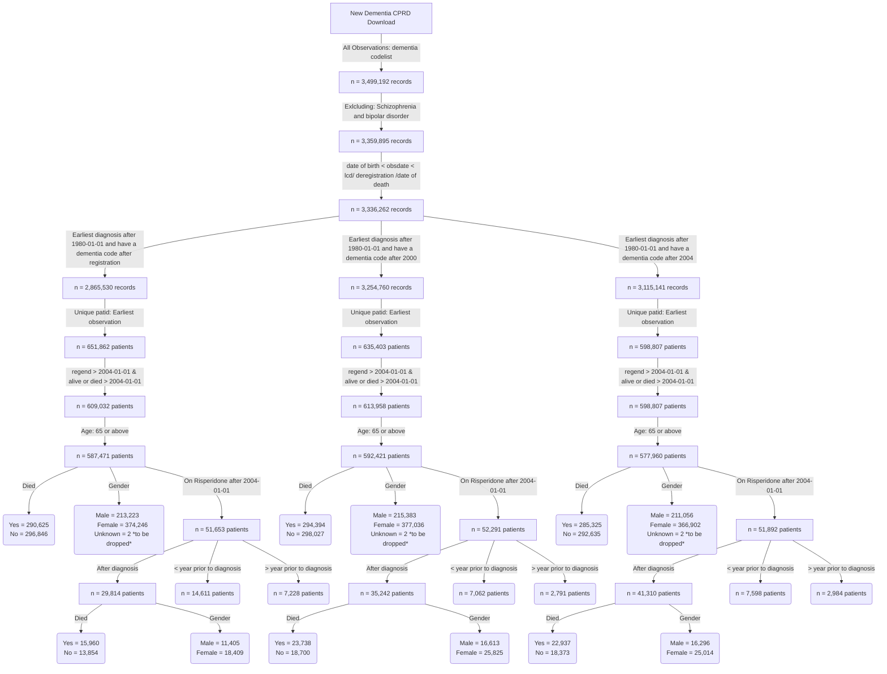

**This is the distribution of number of diagnosis per year for patients diagnosed after registration**


**This is the distribution of number of diagnosis per year for patients diagnosed after 2000**


**This is the distribution of number of prescriptions per year for patients diagnosed after 2004**


**BMJ codes vs ours**


```
BMJ codes	279
Our codes	631
Common codes	86
```
**Flow chart of the final cohorts**


**Dementia incident cohort**


```
                                             
                                             
                                              Overall       
  n                                           353255        
  diagnosedbeforeRegistration = 1 (%)          77403 (21.9) 
  died = 1 (%)                                174204 (49.3) 
  age_diagnosis (mean (SD))                    82.25 (7.10) 
  age_category (%)                                          
     65-74                                     53220 (15.1) 
     75-84                                    159585 (45.2) 
     85-94                                    128631 (36.4) 
     95+                                       11819 ( 3.3) 
  year_of_diagnosis (%)                                     
     2004                                      17502 ( 5.0) 
     2005                                      14865 ( 4.2) 
     2006                                      16620 ( 4.7) 
     2007                                      14520 ( 4.1) 
     2008                                      14931 ( 4.2) 
     2009                                      16317 ( 4.6) 
     2010                                      17437 ( 4.9) 
     2011                                      18395 ( 5.2) 
     2012                                      20029 ( 5.7) 
     2013                                      21675 ( 6.1) 
     2014                                      23469 ( 6.6) 
     2015                                      23301 ( 6.6) 
     2016                                      20765 ( 5.9) 
     2017                                      20374 ( 5.8) 
     2018                                      19268 ( 5.5) 
     2019                                      18785 ( 5.3) 
     2020                                      14879 ( 4.2) 
     2021                                      15410 ( 4.4) 
     2022                                      14326 ( 4.1) 
     2023                                      10387 ( 2.9) 
  gender_decode = M (%)                       122481 (34.7) 
  pre_diagnoses_af = 1 (%)                     46688 (13.2) 
  post_diagnoses_af = 1 (%)                    22901 ( 6.5) 
  af_ever = 1 (%)                              71047 (20.1) 
  pre_diagnoses_angina = 1 (%)                 38974 (11.0) 
  post_diagnoses_angina = 1 (%)                 4583 ( 1.3) 
  angina_ever = 1 (%)                          43776 (12.4) 
  pre_diagnoses_anxiety_disorders = 1 (%)      52839 (15.0) 
  post_diagnoses_anxiety_disorders = 1 (%)      8377 ( 2.4) 
  anxiety_disorders_ever = 1 (%)               61794 (17.5) 
  pre_diagnoses_falls = 1 (%)                  88512 (25.1) 
  post_diagnoses_falls = 1 (%)                 97633 (27.6) 
  falls_ever = 1 (%)                          188256 (53.3) 
  pre_diagnoses_fh_diabetes = 1 (%)            70720 (20.0) 
  post_diagnoses_fh_diabetes = 1 (%)            4579 ( 1.3) 
  fh_diabetes_ever = 1 (%)                     75477 (21.4) 
  heartfailure_ever = 1 (%)                    41583 (11.8) 
  pre_diagnoses_lowerlimbfracture = 1 (%)      43571 (12.3) 
  post_diagnoses_lowerlimbfracture = 1 (%)     26109 ( 7.4) 
  lowerlimbfracture_ever = 1 (%)               70334 (19.9) 
  pre_diagnoses_myocardialinfarction = 1 (%)   26861 ( 7.6) 
  post_diagnoses_myocardialinfarction = 1 (%)   5709 ( 1.6) 
  myocardialinfarction_ever = 1 (%)            32860 ( 9.3) 
  pre_diagnoses_qof_diabetes = 1 (%)           47756 (13.5) 
  post_diagnoses_qof_diabetes = 1 (%)          18426 ( 5.2) 
  qof_diabetes_ever = 1 (%)                    67059 (19.0) 
  pre_diagnoses_revasc = 1 (%)                 18445 ( 5.2) 
  post_diagnoses_revasc = 1 (%)                  832 ( 0.2) 
  revasc_ever = 1 (%)                          19332 ( 5.5) 
  pre_diagnoses_stroke = 1 (%)                 38087 (10.8) 
  post_diagnoses_stroke = 1 (%)                16028 ( 4.5) 
  stroke_ever = 1 (%)                          55527 (15.7) 
  pre_diagnoses_tia = 1 (%)                    29408 ( 8.3) 
  post_diagnoses_tia = 1 (%)                    9919 ( 2.8) 
  tia_ever = 1 (%)                             39813 (11.3) 
  alcohol_cat (%)                                           
     Excess                                    17897 ( 5.1) 
     Harmful                                    9010 ( 2.6) 
     None                                      33247 ( 9.4) 
     Unknown                                   98566 (27.9) 
     Within limits                            194535 (55.1) 
  smoking_cat (%)                                           
     Active smoker                             28397 ( 8.0) 
     Ex-smoker                                141985 (40.2) 
     Non-smoker                               114276 (32.3) 
     Unknown                                   68597 (19.4) 
  qrisk2_smoking_cat (%)                                    
     0                                        152478 (43.2) 
     1                                         88230 (25.0) 
     2                                         27182 ( 7.7) 
     3                                           942 ( 0.3) 
     4                                           693 ( 0.2) 
     Unknown                                   83730 (23.7) 
  qrisk2_smoking_cat_uncoded (%)                            
     Ex-smoker                                 88230 (25.0) 
     Heavy smoker                                693 ( 0.2) 
     Light smoker                              27182 ( 7.7) 
     Moderate smoker                             942 ( 0.3) 
     Non-smoker                               152478 (43.2) 
     Unknown                                   83730 (23.7) 
  gp_5cat_ethnicity (%)                                     
     Black                                      6004 ( 1.7) 
     Mixed                                      1063 ( 0.3) 
     Other                                      1687 ( 0.5) 
     South Asian                                6953 ( 2.0) 
     Unknown                                   91545 (25.9) 
     White                                    246003 (69.6) 
  gp_16cat_ethnicity (%)                                    
     African                                    1101 ( 0.3) 
     Bangladeshi                                 628 ( 0.2) 
     Caribbean                                  4368 ( 1.2) 
     Chinese                                     378 ( 0.1) 
     Indian                                     3507 ( 1.0) 
     Other                                      1324 ( 0.4) 
     Other Asian                                1372 ( 0.4) 
     Other Black                                 483 ( 0.1) 
     Other Mixed                                 287 ( 0.1) 
     Other White                                7423 ( 2.1) 
     Pakistani                                  1399 ( 0.4) 
     Unknown                                   91821 (26.0) 
     White and Asian                             133 ( 0.0) 
     White and Black African                     165 ( 0.0) 
     White and Black Caribbean                   487 ( 0.1) 
     White British                            234396 (66.4) 
     White Irish                                3983 ( 1.1) 
  gp_qrisk2_ethnicity (%)                                   
     Bangladeshi                                 628 ( 0.2) 
     Black African                              1091 ( 0.3) 
     Black Caribbean                            4345 ( 1.2) 
     Chinese                                     376 ( 0.1) 
     Indian                                     3504 ( 1.0) 
     Other                                      2945 ( 0.8) 
     Other Asian                                1364 ( 0.4) 
     Pakistani                                  1398 ( 0.4) 
     Unknown                                   91614 (25.9) 
     White                                    245990 (69.6) 
  pre_diagnoses_deep_vein_thrombosis = 1 (%)   14894 ( 4.2) 
  post_diagnoses_deep_vein_thrombosis = 1 (%)   6581 ( 1.9) 
  deep_vein_thrombosis_ever = 1 (%)            21662 ( 6.1) 
  pre_diagnoses_pulmonary_embolism = 1 (%)      7555 ( 2.1) 
  post_diagnoses_pulmonary_embolism = 1 (%)     3213 ( 0.9) 
  pulmonary_embolism_ever = 1 (%)              10883 ( 3.1) 
  VTE = 1 (%)                                  10883 ( 3.1)  

```


```
           strata   median    lower    upper
1 gender_decode=F 5.037645 5.010267 5.067762
2 gender_decode=M 4.350445 4.314853 4.386037
```


```
               strata   median    lower    upper
1 age_category=65-74 7.882272 7.800137 7.972621
2 age_category=75-84 5.505818 5.470226 5.538672
3 age_category=85-94 3.340178 3.318275 3.364819
4   age_category=95+ 1.711157 1.642710 1.757700

```

**Risperidone incident cohort**
```
                                                          
                                                          Overall        
  n                                                        21994         
  diagnosedbeforeRegistration = 1 (%)                       8870 ( 40.3) 
  died = 1 (%)                                             11483 ( 52.2) 
  age_risperidone (mean (SD))                              83.01 (6.87)  
  age_category (%)                                                       
     65 - 74                                                4713 ( 21.4) 
     75 - 84                                               10630 ( 48.3) 
     85+                                                    6651 ( 30.2) 
  stroke_3_months_prior = 1 (%)                              106 (  0.5) 
  stroke_6_months_prior = 1 (%)                              162 (  0.7) 
  stroke_12_months_prior = 1 (%)                             254 (  1.2) 
  prescribed_BMJ_antipsyc_drug = 1 (%)                     18782 ( 85.4) 
  stroke_recency_cat (%)                                                 
      <= 1                                                   254 (  9.9) 
      > 7                                                   2160 ( 84.2) 
     1 - 2                                                   108 (  4.2) 
     2 - 3                                                    39 (  1.5) 
     3 - 4                                                     4 (  0.2) 
  Stroke_prior_to_risperidone = 1 (%)                       2425 ( 11.0) 
  Stroke__within_year_after_1st_risperidone_presc = 1 (%)    299 (  1.4) 
  death_in_a_year_after_risperidone = 1 (%)                 5209 ( 23.7) 
  sex = 1 (%)                                               8601 ( 39.1) 
  dementia_duration_prior_risperidone (mean (SD))           2.05 (2.30)  
  Survival_time (mean (SD))                                 1.58 (1.75)  
  comorbidity_af = 1 (%)                                    3895 ( 17.7) 
  pre_index_date_af = 1 (%)                                 3519 ( 16.0) 
  post_index_date_af = 1 (%)                                1217 (  5.5) 
  comorbidity_angina = 1 (%)                                2645 ( 12.0) 
  pre_index_date_angina = 1 (%)                             2584 ( 11.7) 
  post_index_date_angina = 1 (%)                             234 (  1.1) 
  comorbidity_anxiety_disorders = 1 (%)                     4599 ( 20.9) 
  pre_index_date_anxiety_disorders = 1 (%)                  4435 ( 20.2) 
  post_index_date_anxiety_disorders = 1 (%)                  451 (  2.1) 
  comorbidity_falls = 1 (%)                                12243 ( 55.7) 
  pre_index_date_falls = 1 (%)                              9106 ( 41.4) 
  post_index_date_falls = 1 (%)                             6112 ( 27.8) 
  comorbidity_fh_diabetes = 1 (%)                           4659 ( 21.2) 
  pre_index_date_fh_diabetes = 1 (%)                        4596 ( 20.9) 
  post_index_date_fh_diabetes = 1 (%)                         92 (  0.4) 
  comorbidity_fh_premature_cvd = 1 (%)                      1803 (  8.2) 
  pre_index_date_fh_premature_cvd = 1 (%)                   1784 (  8.1) 
  post_index_date_fh_premature_cvd = 1 (%)                    29 (  0.1) 
  comorbidity_heartfailure = 1 (%)                          1974 (  9.0) 
  pre_index_date_heartfailure = 1 (%)                       1697 (  7.7) 
  post_index_date_heartfailure = 1 (%)                       628 (  2.9) 
  comorbidity_lowerlimbfracture = 1 (%)                     4509 ( 20.5) 
  pre_index_date_lowerlimbfracture = 1 (%)                  3451 ( 15.7) 
  post_index_date_lowerlimbfracture = 1 (%)                 1326 (  6.0) 
  comorbidity_myocardialinfarction = 1 (%)                  1858 (  8.4) 
  pre_index_date_myocardialinfarction = 1 (%)               1758 (  8.0) 
  post_index_date_myocardialinfarction = 1 (%)               183 (  0.8) 
  comorbidity_qof_diabetes = 1 (%)                          4020 ( 18.3) 
  pre_index_date_qof_diabetes = 1 (%)                       3831 ( 17.4) 
  post_index_date_qof_diabetes = 1 (%)                      1646 (  7.5) 
  comorbidity_revasc = 1 (%)                                1181 (  5.4) 
  pre_index_date_revasc = 1 (%)                             1175 (  5.3) 
  post_index_date_revasc = 1 (%)                              20 (  0.1) 
  comorbidity_stroke = 1 (%)                                2963 ( 13.5) 
  pre_index_date_stroke = 1 (%)                             2565 ( 11.7) 
  post_index_date_stroke = 1 (%)                             710 (  3.2) 
  stroke_cat = ischaemic (%)                                2514 ( 84.8) 
  comorbidity_tia = 1 (%)                                   2295 ( 10.4) 
  pre_index_date_tia = 1 (%)                                2022 (  9.2) 
  post_index_date_tia = 1 (%)                                434 (  2.0) 
  comorbidity_deep_vein_thrombosis = 1 (%)                  1436 (  6.5) 
  pre_index_date_deep_vein_thrombosis = 1 (%)               1122 (  5.1) 
  post_index_date_deep_vein_thrombosis = 1 (%)               380 (  1.7) 
  comorbidity_haem_cancer = 1 (%)                            502 (  2.3) 
  pre_index_date_haem_cancer = 1 (%)                         437 (  2.0) 
  post_index_date_haem_cancer = 1 (%)                        125 (  0.6) 
  comorbidity_pulmonary_embolism = 1 (%)                     733 (  3.3) 
  pre_index_date_pulmonary_embolism = 1 (%)                  578 (  2.6) 
  post_index_date_pulmonary_embolism = 1 (%)                 187 (  0.9) 
  comorbidity_solid_cancer = 1 (%)                          3805 ( 17.3) 
  pre_index_date_solid_cancer = 1 (%)                       3517 ( 16.0) 
  post_index_date_solid_cancer = 1 (%)                       716 (  3.3) 
  VTE = 1 (%)                                               1997 (  9.1) 
  BMI (%)                                                                
     Normal                                                 7888 ( 35.9) 
     Obesity                                                2955 ( 13.4) 
     Overweight                                             6513 ( 29.6) 
     Severely Obese                                          216 (  1.0) 
     Underweight                                             907 (  4.1) 
     Unknown                                                3515 ( 16.0) 
  totalcholesterol (%)                                                   
     < 160 mg/dl                                            4950 ( 22.5) 
     > 280 mg/dl                                             782 (  3.6) 
     199 mg/dl                                              5530 ( 25.1) 
     200 - 239 mg/dl                                        4819 ( 21.9) 
     240 - 279 mg/dl                                        2121 (  9.6) 
     Unknown                                                3792 ( 17.2) 
  testvalue_dbp (mean (SD))                                76.60 (11.73) 
  testvalue_sbp (mean (SD))                               136.29 (20.18) 
  testvalue_totalcholesterol (mean (SD))                    4.99 (1.24)  
  gp_5cat_ethnicity (%)                                                  
     Black                                                   342 (  1.6) 
     Mixed                                                    73 (  0.3) 
     Other                                                   113 (  0.5) 
     South Asian                                             335 (  1.5) 
     Unknown                                                5115 ( 23.3) 
     White                                                 16016 ( 72.8) 
  gp_16cat_ethnicity (%)                                                 
     African                                                  62 (  0.3) 
     Bangladeshi                                              27 (  0.1) 
     Caribbean                                               244 (  1.1) 
     Chinese                                                  17 (  0.1) 
     Indian                                                  171 (  0.8) 
     Other                                                    98 (  0.4) 
     Other Asian                                              59 (  0.3) 
     Other Black                                              35 (  0.2) 
     Other Mixed                                              18 (  0.1) 
     Other White                                             493 (  2.2) 
     Pakistani                                                73 (  0.3) 
     Unknown                                                5134 ( 23.3) 
     White and Asian                                          14 (  0.1) 
     White and Black African                                   8 (  0.0) 
     White and Black Caribbean                                31 (  0.1) 
     White British                                         15277 ( 69.5) 
     White Irish                                             233 (  1.1) 
  gp_qrisk2_ethnicity (%)                                                
     Bangladeshi                                              27 (  0.1) 
     Black African                                            62 (  0.3) 
     Black Caribbean                                         242 (  1.1) 
     Chinese                                                  17 (  0.1) 
     Indian                                                  171 (  0.8) 
     Other                                                   205 (  0.9) 
     Other Asian                                              59 (  0.3) 
     Pakistani                                                73 (  0.3) 
     Unknown                                                5122 ( 23.3) 
     White                                                 16016 ( 72.8) 
  alcohol_cat (%)                                                        
     Excess                                                 1151 (  5.2) 
     Harmful                                                 589 (  2.7) 
     None                                                   1682 (  7.6) 
     Unknown                                                7153 ( 32.5) 
     Within limits                                         11419 ( 51.9) 
  smoking_cat (%)                                                        
     Active smoker                                          1574 (  7.2) 
     Ex-smoker                                              8609 ( 39.1) 
     Non-smoker                                             6117 ( 27.8) 
     Unknown                                                5694 ( 25.9) 
  qrisk2_smoking_cat (%)                                                 
     0                                                      8230 ( 37.4) 
     1                                                      5659 ( 25.7) 
     2                                                      1543 (  7.0) 
     3                                                        55 (  0.3) 
     4                                                        32 (  0.1) 
     Unknown                                                6475 ( 29.4) 
  qrisk2_smoking_cat_uncoded (%)                                         
     Ex-smoker                                              5659 ( 25.7) 
     Heavy smoker                                             32 (  0.1) 
     Light smoker                                           1543 (  7.0) 
     Moderate smoker                                          55 (  0.3) 
     Non-smoker                                             8230 ( 37.4) 
     Unknown                                                6475 ( 29.4) 
  drug_name (%)                                                          
     amisulpride                                             111 (  1.5) 
     aripiprazole                                             69 (  0.9) 
     benperidol                                                7 (  0.1) 
     chlorpromazine                                           56 (  0.7) 
     clozapine                                                 1 (  0.0) 
     flupentixol                                              96 (  1.3) 
     fluphenazine                                              2 (  0.0) 
     haloperidol                                             546 (  7.3) 
     levomepromazine                                          98 (  1.3) 
     olanzapine                                              316 (  4.2) 
     pericyazine                                              13 (  0.2) 
     perphenazine                                              4 (  0.1) 
     pimozide                                                 59 (  0.8) 
     prochlorperazine                                       5223 ( 69.4) 
     promazine                                               139 (  1.8) 
     quetiapine                                              677 (  9.0) 
     sulpiride                                                20 (  0.3) 
     thioridazine                                             24 (  0.3) 
     trifluoperazine                                          55 (  0.7) 
     zuclopenthixol                                            5 (  0.1) 
  frailty (%)                                                            
     Mild                                                   1086 (  4.9) 
     Moderate                                               2599 ( 11.8) 
     Severe                                                 3845 ( 17.5) 
     Unknown                                               14464 ( 65.8) 
  year_diagnosis_cat (%)                                                 
     > 2020                                                 1070 (  4.9) 
     2004 - 2008                                            3291 ( 15.0) 
     2009 - 2012                                            5740 ( 26.1) 
     2013 - 2016                                            7037 ( 32.0) 
     2017 - 2020                                            4856 ( 22.1) 
  prescribed_other_antipsyc_drug = 1 (%)                    7521 ( 34.2) 
  pre_indexdate_antipysch_prescr = 1 (%)                    7521 (100.0) 
  post_indexdate_antipysch_prescr = 0 (%)                   7521 (100.0) 
  same_indexdate_antipysch_prescr = 0 (%)                   7521 (100.0) 
  pre_indexdate_drug_name (%)                                            
     amisulpride                                              97 (  1.3) 
     aripiprazole                                             36 (  0.5) 
     benperidol                                                6 (  0.1) 
     chlorpromazine                                           64 (  0.9) 
     clozapine                                                 1 (  0.0) 
     flupentixol                                             133 (  1.8) 
     fluphenazine                                              3 (  0.0) 
     haloperidol                                             460 (  6.1) 
     levomepromazine                                          56 (  0.7) 
     olanzapine                                              329 (  4.4) 
     pericyazine                                              10 (  0.1) 
     perphenazine                                              4 (  0.1) 
     pimozide                                                 61 (  0.8) 
     prochlorperazine                                       5444 ( 72.4) 
     promazine                                               124 (  1.6) 
     quetiapine                                              528 (  7.0) 
     sulpiride                                                24 (  0.3) 
     thioridazine                                             62 (  0.8) 
     trifluoperazine                                          75 (  1.0) 
     zuclopenthixol                                            4 (  0.1) 
  care_home = 1 (%)                                         8529 ( 38.8) 
  care_home_before_indexdate = 1 (%)                        2911 ( 34.1) 
  care_home_at_indexdate = 1 (%)                             105 (  1.2) 
  care_home_90_days_after_indexdate = 1 (%)                 1940 ( 22.7) 
  TimeSinceFirstPrescription (mean (SD))                    0.48 (0.90)  
  Prescription_ever_cat (%)                                              
     >100                                                    432 (  2.0) 
     1                                                      3805 ( 17.3) 
     10                                                      586 (  2.7) 
     11 - 20                                                3742 ( 17.0) 
     2                                                      1934 (  8.8) 
     21 - 30                                                1993 (  9.1) 
     3                                                      1430 (  6.5) 
     31 - 40                                                1150 (  5.2) 
     4                                                      1148 (  5.2) 
     41 - 50                                                 744 (  3.4) 
     5                                                       947 (  4.3) 
     51 - 100                                               1151 (  5.2) 
     6                                                       837 (  3.8) 
     7                                                       762 (  3.5) 
     8                                                       694 (  3.2) 
     9                                                       639 (  2.9) 
  Prescriptions_after_a_year_cat (%)                                     
     >100                                                    227 (  3.2) 
     1                                                       484 (  6.8) 
     10                                                      200 (  2.8) 
     11 - 20                                                1508 ( 21.2) 
     2                                                       438 (  6.2) 
     21 - 30                                                 858 ( 12.1) 
     3                                                       398 (  5.6) 
     31 - 40                                                 540 (  7.6) 
     4                                                       336 (  4.7) 
     41 - 50                                                 330 (  4.6) 
     5                                                       304 (  4.3) 
     51 - 100                                                507 (  7.1) 
     6                                                       258 (  3.6) 
     7                                                       272 (  3.8) 
     8                                                       247 (  3.5) 
     9                                                       207 (  2.9) 
  Prescriptions_within_a_year_cat (%)                                    
     >100                                                     14 (  0.1) 
     1                                                      3953 ( 18.0) 
     10                                                      715 (  3.3) 
     11 - 20                                                6787 ( 30.9) 
     2                                                      1987 (  9.0) 
     21 - 30                                                 636 (  2.9) 
     3                                                      1481 (  6.7) 
     31 - 40                                                 230 (  1.0) 
     4                                                      1194 (  5.4) 
     41 - 50                                                 234 (  1.1) 
     5                                                      1015 (  4.6) 
     51 - 100                                                408 (  1.9) 
     6                                                       917 (  4.2) 
     7                                                       893 (  4.1) 
     8                                                       804 (  3.7) 
     9                                                       726 (  3.3) 
  consultation_counts_Cat (%)                                            
     0 - 50                                                 7539 ( 34.7) 
     101 - 150                                              3874 ( 17.8) 
     151 - 200                                              1487 (  6.8) 
     201 - 250                                               548 (  2.5) 
     251 - 300                                               223 (  1.0) 
     301 - 350                                                93 (  0.4) 
     351 - 400                                                38 (  0.2) 
     401 - 450                                                21 (  0.1) 
     451 - 500                                                20 (  0.1) 
     501 - 800                                                23 (  0.1) 
     51 - 100                                               7866 ( 36.2) 
     801 - 1000                                                3 (  0.0) 
  pre_BMJ_indexdate_drug_name (%)                                        
     amisulpride                                              92 (  9.4) 
     aripiprazole                                              5 (  0.5) 
     benperidol                                                6 (  0.6) 
     chlorpromazine                                           64 (  6.5) 
     clozapine                                                 1 (  0.1) 
     flupentixol                                              83 (  8.5) 
     fluphenazine                                              2 (  0.2) 
     haloperidol                                             422 ( 43.1) 
     levomepromazine                                           1 (  0.1) 
     olanzapine                                               29 (  3.0) 
     pericyazine                                              10 (  1.0) 
     perphenazine                                              2 (  0.2) 
     pimozide                                                  2 (  0.2) 
     prochlorperazine                                        174 ( 17.8) 
     promazine                                                16 (  1.6) 
     quetiapine                                               24 (  2.5) 
     sulpiride                                                 8 (  0.8) 
     thioridazine                                             15 (  1.5) 
     trifluoperazine                                          22 (  2.2) 
     zuclopenthixol                                            1 (  0.1) 
  same_BMJ_indexdate_drug_name (%)                                       
     amisulpride                                               3 (  0.1) 
     aripiprazole                                             24 (  0.5) 
     flupentixol                                              35 (  0.7) 
     fluphenazine                                              1 (  0.0) 
     haloperidol                                              29 (  0.6) 
     levomepromazine                                          41 (  0.8) 
     olanzapine                                              230 (  4.4) 
     perphenazine                                              2 (  0.0) 
     pimozide                                                 51 (  1.0) 
     prochlorperazine                                       4271 ( 81.7) 
     promazine                                                79 (  1.5) 
     quetiapine                                              367 (  7.0) 
     sulpiride                                                 9 (  0.2) 
     thioridazine                                             42 (  0.8) 
     trifluoperazine                                          39 (  0.7) 
     zuclopenthixol                                            2 (  0.0) 
  post_BMJ_indexdate_drug_name (%)                                       
     aripiprazole                                              1 (  0.3) 
     flupentixol                                               5 (  1.4) 
     levomepromazine                                           1 (  0.3) 
     olanzapine                                               16 (  4.6) 
     pimozide                                                  1 (  0.3) 
     prochlorperazine                                        274 ( 78.1) 
     promazine                                                 6 (  1.7) 
     quetiapine                                               39 ( 11.1) 
     sulpiride                                                 3 (  0.9) 
     trifluoperazine                                           5 (  1.4) 
  comorbidity_hypertension (%)                                           
     Elevated                                               2347 ( 10.7) 
     Normal                                                 2874 ( 13.1) 
     Stage 1                                                9818 ( 44.6) 
     Stage 2                                                6481 ( 29.5) 
     Stage 3 (severe)                                        146 (  0.7) 
     Unknown                                                 328 (  1.5) 
  pre_index_date_hypertension = 1 (%)                      18567 ( 85.6) 
  comorbidity_hearing_loss = 1 (%)                          6319 ( 28.7) 
  pre_index_date_hearing_loss = 1 (%)                       5985 ( 27.2) 
  post_index_date_hearing_loss = 1 (%)                       790 (  3.6) 
  pre_indexdate_BMJ_antipysch_prescr = 1 (%)                 991 (  5.3) 
  post_indexdate_BMJ_antipysch_prescr = 1 (%)               1190 (  6.3) 
  same_indexdate_BMJ_antipysch_prescr = 1 (%)              16601 ( 88.4) 
  HES_comorbidity_stroke = 1 (%)                            2261 ( 10.3) 
  HES_pre_index_date_stroke = 1 (%)                         1814 (  8.2) 
  HES_post_index_date_stroke = 1 (%)                         671 (  3.1) 
  hes_5cat_ethnicity (%)                                                 
     Black                                                   363 (  1.7) 
     Mixed                                                    53 (  0.2) 
     Other                                                   154 (  0.7) 
     South Asian                                             333 (  1.5) 
     Unknown                                                1554 (  7.1) 
     White                                                 19537 ( 88.8) 
  hes_16cat_ethnicity (%)                                                
     African                                                  59 (  0.3) 
     Bangladeshi                                              24 (  0.1) 
     Caribbean                                               259 (  1.2) 
     Chinese                                                  14 (  0.1) 
     Indian                                                  150 (  0.7) 
     Other                                                   140 (  0.6) 
     Other Asian                                              82 (  0.4) 
     Other Black                                              45 (  0.2) 
     Other Mixed                                              53 (  0.2) 
     Pakistani                                                77 (  0.4) 
     Unknown                                                1554 (  7.1) 
     White British                                         19537 ( 88.8) 
  hes_qrisk2_ethnicity (%)                                               
     Bangladeshi                                              24 (  0.1) 
     Black African                                            59 (  0.3) 
     Black Caribbean                                         259 (  1.2) 
     Chinese                                                  14 (  0.1) 
     Indian                                                  150 (  0.7) 
     Other                                                   238 (  1.1) 
     Other Asian                                              82 (  0.4) 
     Pakistani                                                77 (  0.4) 
     Unknown                                                1554 (  7.1) 
     White                                                 19537 ( 88.8) 
  primary_death_stroke = 1 (%)                               562 (  2.6)
                               
```


```
           strata   median    lower    upper
1 gender_decode=F 2.483231 2.417522 2.562628
2 gender_decode=M 1.957563 1.905544 2.031485
```


```
                strata   median    lower    upper
1 age_category=65 - 74 3.586585 3.416838 3.712526
2 age_category=75 - 84 2.447639 2.373717 2.513347
3     age_category=85+ 1.464750 1.401780 1.527721

```


**COX model**
```
Call:
coxph(formula = Surv(Survival_time, post_index_date_stroke) ~ 
    age_diagnosis + pre_index_date_stroke + sex, data = CompleteData)

  n= 23959, number of events= 846 

                           coef exp(coef) se(coef)      z Pr(>|z|)    
age_diagnosis          0.013706  1.013801 0.005042  2.719  0.00656 ** 
pre_index_date_stroke1 1.903718  6.710798 0.069880 27.243  < 2e-16 ***
sex1                   0.174512  1.190665 0.072553  2.405  0.01616 *  
---
Signif. codes:  0 ‘***’ 0.001 ‘**’ 0.01 ‘*’ 0.05 ‘.’ 0.1 ‘ ’ 1

                       exp(coef) exp(-coef) lower .95 upper .95
age_diagnosis              1.014     0.9864     1.004     1.024
pre_index_date_stroke1     6.711     0.1490     5.852     7.696
sex1                       1.191     0.8399     1.033     1.373

Concordance= 0.726  (se = 0.011 )
Likelihood ratio test= 640.9  on 3 df,   p=<2e-16
Wald test            = 776.8  on 3 df,   p=<2e-16
Score (logrank) test = 1043  on 3 df,   p=<2e-16

```


**One year censoring**

```
Call:
coxph(formula = Surv(Survival_time, post_index_date_stroke) ~ 
    age_diagnosis + pre_index_date_stroke + sex, data = CensoringData_1year)

  n= 23940, number of events= 501 
   (19 observations deleted due to missingness)

                           coef exp(coef) se(coef)      z Pr(>|z|)    
age_diagnosis          0.010646  1.010703 0.006488  1.641   0.1008    
pre_index_date_stroke1 2.196622  8.994583 0.090048 24.394   <2e-16 ***
sex1                   0.199762  1.221113 0.092650  2.156   0.0311 *  
---
Signif. codes:  0 ‘***’ 0.001 ‘**’ 0.01 ‘*’ 0.05 ‘.’ 0.1 ‘ ’ 1

                       exp(coef) exp(-coef) lower .95 upper .95
age_diagnosis              1.011     0.9894    0.9979     1.024
pre_index_date_stroke1     8.995     0.1112    7.5393    10.731
sex1                       1.221     0.8189    1.0183     1.464

Concordance= 0.742  (se = 0.013 )
Likelihood ratio test= 546.2  on 3 df,   p=<2e-16
Wald test            = 619.1  on 3 df,   p=<2e-16
Score (logrank) test = 915.7  on 3 df,   p=<2e-16
```

**Excluding stroke 3 months prior**


```
Call:
coxph(formula = Surv(Survival_time, post_index_date_stroke) ~ 
    age_diagnosis + pre_index_date_stroke + sex, data = Excluding_3_monthsPriorStroke)

  n= 23836, number of events= 789 

                           coef exp(coef) se(coef)      z Pr(>|z|)    
age_diagnosis          0.017014  1.017160 0.005212  3.264   0.0011 ** 
pre_index_date_stroke1 1.769601  5.868512 0.073380 24.116   <2e-16 ***
sex1                   0.176362  1.192870 0.075323  2.341   0.0192 *  
---
Signif. codes:  0 ‘***’ 0.001 ‘**’ 0.01 ‘*’ 0.05 ‘.’ 0.1 ‘ ’ 1

                       exp(coef) exp(-coef) lower .95 upper .95
age_diagnosis              1.017     0.9831     1.007     1.028
pre_index_date_stroke1     5.869     0.1704     5.082     6.776
sex1                       1.193     0.8383     1.029     1.383

Concordance= 0.706  (se = 0.011 )
Likelihood ratio test= 499.9  on 3 df,   p=<2e-16
Wald test            = 615.9  on 3 df,   p=<2e-16
Score (logrank) test = 794.9  on 3 df,   p=<2e-16


```


**Excluding stroke 12 months prior**


```
Call:
coxph(formula = Surv(Survival_time, post_index_date_stroke) ~ 
    age_diagnosis + pre_index_date_stroke + sex, data = Excluding_12_monthsPriorStroke)

  n= 23670, number of events= 744 

                           coef exp(coef) se(coef)      z Pr(>|z|)    
age_diagnosis          0.019554  1.019747 0.005376  3.637 0.000276 ***
pre_index_date_stroke1 1.663083  5.275553 0.076970 21.607  < 2e-16 ***
sex1                   0.184390  1.202484 0.077672  2.374 0.017598 *  
---
Signif. codes:  0 ‘***’ 0.001 ‘**’ 0.01 ‘*’ 0.05 ‘.’ 0.1 ‘ ’ 1

                       exp(coef) exp(-coef) lower .95 upper .95
age_diagnosis              1.020     0.9806     1.009     1.031
pre_index_date_stroke1     5.276     0.1896     4.537     6.135
sex1                       1.202     0.8316     1.033     1.400

Concordance= 0.689  (se = 0.012 )
Likelihood ratio test= 401.8  on 3 df,   p=<2e-16
Wald test            = 501  on 3 df,   p=<2e-16
Score (logrank) test = 627.7  on 3 df,   p=<2e-16

```


**Matching**


****No history of antipsychotic****

```

                                                        
                                                          Overall       
  n                                                       14215         
  sex = 1 (%)                                              6089 ( 42.8) 
  risperidone = 1 (%)                                     14215 (100.0) 
  age_diagnosis (mean (SD))                               80.32 (7.12)  
  Stroke__within_year_after_1st_risperidone_presc = 1 (%)   201 (  1.4) 
  pre_index_date_angina = 1 (%)                            1468 ( 10.3) 
  pre_index_date_heartfailure = 1 (%)                       996 (  7.0) 
  BMI (%)                                                               
     Missing                                               3374 ( 23.7) 
     Normal                                                5280 ( 37.1) 
     Obesity                                               1359 (  9.6) 
     Overweight                                            3366 ( 23.7) 
     Severely Obese                                          73 (  0.5) 
     Underweight                                            763 (  5.4) 
  period_before_prescription (mean (SD))                   2.48 (2.33)  
  comorbidity_myocardialinfarction = 1 (%)                 1159 (  8.2) 
  pre_index_date_stroke = 1 (%)                            1604 ( 11.3) 
  pre_index_date_tia = 1 (%)                               1185 (  8.3) 
  pre_index_date_falls = 1 (%)                             5301 ( 37.3) 
  pre_index_date_lowerlimbfracture = 1 (%)                 2102 ( 14.8) 
  pre_index_date_ihd = 1 (%)                               2196 ( 15.4) 
  pre_index_date_pad = 1 (%)                               1012 (  7.1) 
  pre_index_date_af = 1 (%)                                2215 ( 15.6) 
  pre_index_date_revasc = 1 (%)                             710 (  5.0) 
  pre_index_date_qof_diabetes = 1 (%)                      2348 ( 16.5) 
  pre_index_date_anxiety_disorders = 1 (%)                 2360 ( 16.6) 
  pre_index_date_fh_diabetes = 1 (%)                       2708 ( 19.1) 
  pre_index_date_fh_premature_cvd = 1 (%)                  1015 (  7.1) 
  pre_index_date_pulmonary_embolism = 1 (%)                 337 (  2.4) 
  pre_index_date_deep_vein_thrombosis = 1 (%)               650 (  4.6) 
  pre_index_date_hearing_loss = 1 (%)                      3559 ( 25.0) 
  VTE = 1 (%)                                              1207 (  8.5) 
  gp_5cat_ethnicity (%)                                                 
     Black                                                  227 (  1.6) 
     Mixed                                                   51 (  0.4) 
     Other                                                   80 (  0.6) 
     South Asian                                            176 (  1.2) 
     Unknown                                               3412 ( 24.0) 
     White                                                10269 ( 72.2) 
  comorbidity_hypertension (%)                                          
     Elevated                                              2424 ( 17.1) 
     Normal                                                3624 ( 25.5) 
     Stage 1                                               5398 ( 38.0) 
     Stage 2                                               2201 ( 15.5) 
     Stage 3 (severe)                                        19 (  0.1) 
     Unknown                                                549 (  3.9) 
  Survival_time (mean (SD))                                1.57 (1.73)


                                                         Overall      
  n                                                       69804        
  sex = 1 (%)                                             29877 (42.8) 
  risperidone = 1 (%)                                         0 ( 0.0) 
  age_diagnosis (mean (SD))                               80.35 (7.06) 
  Stroke__within_year_after_1st_risperidone_presc = 1 (%)   765 ( 1.1) 
  pre_index_date_angina = 1 (%)                            7235 (10.4) 
  pre_index_date_heartfailure = 1 (%)                      4972 ( 7.1) 
  BMI (%)                                                              
     Missing                                              16342 (23.4) 
     Normal                                               26057 (37.3) 
     Obesity                                               6769 ( 9.7) 
     Overweight                                           16535 (23.7) 
     Severely Obese                                         341 ( 0.5) 
     Underweight                                           3760 ( 5.4) 
  period_before_prescription (mean (SD))                   2.55 (2.05) 
  comorbidity_myocardialinfarction = 1 (%)                 5765 ( 8.3) 
  pre_index_date_stroke = 1 (%)                            7939 (11.4) 
  pre_index_date_tia = 1 (%)                               5764 ( 8.3) 
  pre_index_date_falls = 1 (%)                            26074 (37.4) 
  pre_index_date_lowerlimbfracture = 1 (%)                10529 (15.1) 
  pre_index_date_ihd = 1 (%)                              10727 (15.4) 
  pre_index_date_pad = 1 (%)                               5020 ( 7.2) 
  pre_index_date_af = 1 (%)                               10958 (15.7) 
  pre_index_date_revasc = 1 (%)                            3403 ( 4.9) 
  pre_index_date_qof_diabetes = 1 (%)                     11656 (16.7) 
  pre_index_date_anxiety_disorders = 1 (%)                11774 (16.9) 
  pre_index_date_fh_diabetes = 1 (%)                      13405 (19.2) 
  pre_index_date_fh_premature_cvd = 1 (%)                  5155 ( 7.4) 
  pre_index_date_pulmonary_embolism = 1 (%)                1684 ( 2.4) 
  pre_index_date_deep_vein_thrombosis = 1 (%)              3193 ( 4.6) 
  pre_index_date_hearing_loss = 1 (%)                     17681 (25.3) 
  VTE = 1 (%)                                              5975 ( 8.6) 
  gp_5cat_ethnicity (%)                                                
     Black                                                 1167 ( 1.7) 
     Mixed                                                  261 ( 0.4) 
     Other                                                  434 ( 0.6) 
     South Asian                                            868 ( 1.2) 
     Unknown                                              16539 (23.7) 
     White                                                50535 (72.4) 
  comorbidity_hypertension (%)                                         
     Elevated                                             12114 (17.4) 
     Normal                                               18070 (25.9) 
     Stage 1                                              26594 (38.1) 
     Stage 2                                              10891 (15.6) 
     Stage 3 (severe)                                        93 ( 0.1) 
     Unknown                                               2042 ( 2.9) 
  Survival_time (mean (SD))                                1.56 (1.92)


                                                        Stratified by risperidone
                                                          0             1              p      test SMD   
  n                                                       69804         14215                            
  sex = 1 (%)                                             29877 (42.8)   6089 ( 42.8)   0.948       0.001
  risperidone = 1 (%)                                         0 ( 0.0)  14215 (100.0)  <0.001         NaN
  age_diagnosis (mean (SD))                               80.35 (7.06)  80.32 (7.12)    0.589       0.005
  Stroke__within_year_after_1st_risperidone_presc = 1 (%)   765 ( 1.1)    201 (  1.4)   0.001       0.029
  pre_index_date_angina = 1 (%)                            7235 (10.4)   1468 ( 10.3)   0.905       0.001
  pre_index_date_heartfailure = 1 (%)                      4972 ( 7.1)    996 (  7.0)   0.636       0.005
  BMI (%)                                                                               0.961       0.009
     Missing                                              16342 (23.4)   3374 ( 23.7)                    
     Normal                                               26057 (37.3)   5280 ( 37.1)                    
     Obesity                                               6769 ( 9.7)   1359 (  9.6)                    
     Overweight                                           16535 (23.7)   3366 ( 23.7)                    
     Severely Obese                                         341 ( 0.5)     73 (  0.5)                    
     Underweight                                           3760 ( 5.4)    763 (  5.4)                    
  period_before_prescription (mean (SD))                   2.55 (2.05)   2.48 (2.33)   <0.001       0.032
  comorbidity_myocardialinfarction = 1 (%)                 5765 ( 8.3)   1159 (  8.2)   0.689       0.004
  pre_index_date_stroke = 1 (%)                            7939 (11.4)   1604 ( 11.3)   0.770       0.003
  pre_index_date_tia = 1 (%)                               5764 ( 8.3)   1185 (  8.3)   0.768       0.003
  pre_index_date_falls = 1 (%)                            26074 (37.4)   5301 ( 37.3)   0.898       0.001
  pre_index_date_lowerlimbfracture = 1 (%)                10529 (15.1)   2102 ( 14.8)   0.374       0.008
  pre_index_date_ihd = 1 (%)                              10727 (15.4)   2196 ( 15.4)   0.817       0.002
  pre_index_date_pad = 1 (%)                               5020 ( 7.2)   1012 (  7.1)   0.774       0.003
  pre_index_date_af = 1 (%)                               10958 (15.7)   2215 ( 15.6)   0.738       0.003
  pre_index_date_revasc = 1 (%)                            3403 ( 4.9)    710 (  5.0)   0.561       0.006
  pre_index_date_qof_diabetes = 1 (%)                     11656 (16.7)   2348 ( 16.5)   0.607       0.005
  pre_index_date_anxiety_disorders = 1 (%)                11774 (16.9)   2360 ( 16.6)   0.449       0.007
  pre_index_date_fh_diabetes = 1 (%)                      13405 (19.2)   2708 ( 19.1)   0.680       0.004
  pre_index_date_fh_premature_cvd = 1 (%)                  5155 ( 7.4)   1015 (  7.1)   0.317       0.009
  pre_index_date_pulmonary_embolism = 1 (%)                1684 ( 2.4)    337 (  2.4)   0.790       0.003
  pre_index_date_deep_vein_thrombosis = 1 (%)              3193 ( 4.6)    650 (  4.6)   1.000      <0.001
  pre_index_date_hearing_loss = 1 (%)                     17681 (25.3)   3559 ( 25.0)   0.471       0.007
  VTE = 1 (%)                                              5975 ( 8.6)   1207 (  8.5)   0.802       0.002
  gp_5cat_ethnicity (%)                                                                 0.894       0.012
     Black                                                 1167 ( 1.7)    227 (  1.6)                    
     Mixed                                                  261 ( 0.4)     51 (  0.4)                    
     Other                                                  434 ( 0.6)     80 (  0.6)                    
     South Asian                                            868 ( 1.2)    176 (  1.2)                    
     Unknown                                              16539 (23.7)   3412 ( 24.0)                    
     White                                                50535 (72.4)  10269 ( 72.2)                    
  comorbidity_hypertension (%)                                                         <0.001       0.052
     Elevated                                             12114 (17.4)   2424 ( 17.1)                    
     Normal                                               18070 (25.9)   3624 ( 25.5)                    
     Stage 1                                              26594 (38.1)   5398 ( 38.0)                    
     Stage 2                                              10891 (15.6)   2201 ( 15.5)                    
     Stage 3 (severe)                                        93 ( 0.1)     19 (  0.1)                    
     Unknown                                               2042 ( 2.9)    549 (  3.9)                    
  Survival_time (mean (SD))                                1.56 (1.92)   1.57 (1.73)    0.455       0.007
```


```
         strata   median    lower    upper
1 risperidone=0 5.927447 5.867214 5.984942
2 risperidone=1 5.637235 5.549624 5.763176

```


```
         strata   median    lower    upper
1 risperidone=0 8.106776 7.800137 8.303901
2 risperidone=1 7.003422 6.570842 7.394935

```


****No history of antipsychotic in the last 12 months****

```
                                                        
                                                          Overall       
  n                                                       20538         
  sex = 1 (%)                                              8033 ( 39.1) 
  risperidone = 1 (%)                                     20538 (100.0) 
  age_diagnosis (mean (SD))                               80.53 (7.11)  
  Stroke__within_year_after_1st_risperidone_presc = 1 (%)   277 (  1.3) 
  pre_index_date_angina = 1 (%)                            2423 ( 11.8) 
  pre_index_date_heartfailure = 1 (%)                      1594 (  7.8) 
  BMI (%)                                                               
     Missing                                               3834 ( 18.7) 
     Normal                                                7994 ( 38.9) 
     Obesity                                               2208 ( 10.8) 
     Overweight                                            5196 ( 25.3) 
     Severely Obese                                         135 (  0.7) 
     Underweight                                           1171 (  5.7) 
  Prescribed_other_antipsychotic_Prior = 1 (%)             6285 ( 30.6) 
  period_before_prescription (mean (SD))                   2.51 (2.34)  
  comorbidity_myocardialinfarction = 1 (%)                 1744 (  8.5) 
  pre_index_date_stroke = 1 (%)                            2404 ( 11.7) 
  pre_index_date_tia = 1 (%)                               1875 (  9.1) 
  pre_index_date_falls = 1 (%)                             8606 ( 41.9) 
  pre_index_date_lowerlimbfracture = 1 (%)                 3197 ( 15.6) 
  pre_index_date_ihd = 1 (%)                               3410 ( 16.6) 
  pre_index_date_pad = 1 (%)                               1568 (  7.6) 
  pre_index_date_af = 1 (%)                                3324 ( 16.2) 
  pre_index_date_revasc = 1 (%)                            1118 (  5.4) 
  pre_index_date_qof_diabetes = 1 (%)                      3611 ( 17.6) 
  pre_index_date_anxiety_disorders = 1 (%)                 4179 ( 20.3) 
  pre_index_date_fh_diabetes = 1 (%)                       4368 ( 21.3) 
  pre_index_date_fh_premature_cvd = 1 (%)                  1701 (  8.3) 
  pre_index_date_pulmonary_embolism = 1 (%)                 538 (  2.6) 
  pre_index_date_deep_vein_thrombosis = 1 (%)              1077 (  5.2) 
  pre_index_date_hearing_loss = 1 (%)                      5683 ( 27.7) 
  VTE = 1 (%)                                              1893 (  9.2) 
  gp_5cat_ethnicity (%)                                                 
     Black                                                  323 (  1.6) 
     Mixed                                                   67 (  0.3) 
     Other                                                  111 (  0.5) 
     South Asian                                            310 (  1.5) 
     Unknown                                               4710 ( 22.9) 
     White                                                15017 ( 73.1) 
  comorbidity_hypertension (%)                                          
     Elevated                                              3539 ( 17.2) 
     Normal                                                5174 ( 25.2) 
     Stage 1                                               7905 ( 38.5) 
     Stage 2                                               3253 ( 15.8) 
     Stage 3 (severe)                                        29 (  0.1) 
     Unknown                                                638 (  3.1) 
  Survival_time (mean (SD))                                1.57 (1.74)


                                                        
                                                          Overall       
  n                                                       101278        
  sex = 1 (%)                                              39496 (39.0) 
  risperidone = 1 (%)                                          0 ( 0.0) 
  age_diagnosis (mean (SD))                                80.54 (7.04) 
  Stroke__within_year_after_1st_risperidone_presc = 1 (%)   1284 ( 1.3) 
  pre_index_date_angina = 1 (%)                            11971 (11.8) 
  pre_index_date_heartfailure = 1 (%)                       7900 ( 7.8) 
  BMI (%)                                                               
     Missing                                               18490 (18.3) 
     Normal                                                39321 (38.8) 
     Obesity                                               11106 (11.0) 
     Overweight                                            25798 (25.5) 
     Severely Obese                                          684 ( 0.7) 
     Underweight                                            5879 ( 5.8) 
  Prescribed_other_antipsychotic_Prior = 1 (%)             31474 (31.1) 
  period_before_prescription (mean (SD))                    2.57 (2.12) 
  comorbidity_myocardialinfarction = 1 (%)                  8746 ( 8.6) 
  pre_index_date_stroke = 1 (%)                            11899 (11.7) 
  pre_index_date_tia = 1 (%)                                9149 ( 9.0) 
  pre_index_date_falls = 1 (%)                             42855 (42.3) 
  pre_index_date_lowerlimbfracture = 1 (%)                 15909 (15.7) 
  pre_index_date_ihd = 1 (%)                               16724 (16.5) 
  pre_index_date_pad = 1 (%)                                7766 ( 7.7) 
  pre_index_date_af = 1 (%)                                16459 (16.3) 
  pre_index_date_revasc = 1 (%)                             5352 ( 5.3) 
  pre_index_date_qof_diabetes = 1 (%)                      17737 (17.5) 
  pre_index_date_anxiety_disorders = 1 (%)                 20864 (20.6) 
  pre_index_date_fh_diabetes = 1 (%)                       21350 (21.1) 
  pre_index_date_fh_premature_cvd = 1 (%)                   8407 ( 8.3) 
  pre_index_date_pulmonary_embolism = 1 (%)                 2704 ( 2.7) 
  pre_index_date_deep_vein_thrombosis = 1 (%)               5333 ( 5.3) 
  pre_index_date_hearing_loss = 1 (%)                      27937 (27.6) 
  VTE = 1 (%)                                               9371 ( 9.3) 
  gp_5cat_ethnicity (%)                                                 
     Black                                                  1597 ( 1.6) 
     Mixed                                                   334 ( 0.3) 
     Other                                                   530 ( 0.5) 
     South Asian                                            1628 ( 1.6) 
     Unknown                                               23027 (22.7) 
     White                                                 74162 (73.2) 
  comorbidity_hypertension (%)                                          
     Elevated                                              17675 (17.5) 
     Normal                                                26026 (25.7) 
     Stage 1                                               39085 (38.6) 
     Stage 2                                               16152 (15.9) 
     Stage 3 (severe)                                        137 ( 0.1) 
     Unknown                                                2203 ( 2.2) 
  Survival_time (mean (SD))                                 1.58 (1.79)


                                                          Stratified by risperidone
                                                          0              1              p      test SMD   
  n                                                       101278         20538                            
  sex = 1 (%)                                              39496 (39.0)   8033 ( 39.1)   0.763       0.002
  risperidone = 1 (%)                                          0 ( 0.0)  20538 (100.0)  <0.001         NaN
  age_diagnosis (mean (SD))                                80.54 (7.04)  80.53 (7.11)    0.832       0.002
  Stroke__within_year_after_1st_risperidone_presc = 1 (%)   1284 ( 1.3)    277 (  1.3)   0.365       0.007
  pre_index_date_angina = 1 (%)                            11971 (11.8)   2423 ( 11.8)   0.938       0.001
  pre_index_date_heartfailure = 1 (%)                       7900 ( 7.8)   1594 (  7.8)   0.860       0.001
  BMI (%)                                                                                0.710       0.013
     Missing                                               18490 (18.3)   3834 ( 18.7)                    
     Normal                                                39321 (38.8)   7994 ( 38.9)                    
     Obesity                                               11106 (11.0)   2208 ( 10.8)                    
     Overweight                                            25798 (25.5)   5196 ( 25.3)                    
     Severely Obese                                          684 ( 0.7)    135 (  0.7)                    
     Underweight                                            5879 ( 5.8)   1171 (  5.7)                    
  Prescribed_other_antipsychotic_Prior = 1 (%)             31474 (31.1)   6285 ( 30.6)   0.182       0.010
  period_before_prescription (mean (SD))                    2.57 (2.12)   2.51 (2.34)   <0.001       0.026
  comorbidity_myocardialinfarction = 1 (%)                  8746 ( 8.6)   1744 (  8.5)   0.511       0.005
  pre_index_date_stroke = 1 (%)                            11899 (11.7)   2404 ( 11.7)   0.868       0.001
  pre_index_date_tia = 1 (%)                                9149 ( 9.0)   1875 (  9.1)   0.672       0.003
  pre_index_date_falls = 1 (%)                             42855 (42.3)   8606 ( 41.9)   0.280       0.008
  pre_index_date_lowerlimbfracture = 1 (%)                 15909 (15.7)   3197 ( 15.6)   0.617       0.004
  pre_index_date_ihd = 1 (%)                               16724 (16.5)   3410 ( 16.6)   0.758       0.002
  pre_index_date_pad = 1 (%)                                7766 ( 7.7)   1568 (  7.6)   0.881       0.001
  pre_index_date_af = 1 (%)                                16459 (16.3)   3324 ( 16.2)   0.821       0.002
  pre_index_date_revasc = 1 (%)                             5352 ( 5.3)   1118 (  5.4)   0.363       0.007
  pre_index_date_qof_diabetes = 1 (%)                      17737 (17.5)   3611 ( 17.6)   0.821       0.002
  pre_index_date_anxiety_disorders = 1 (%)                 20864 (20.6)   4179 ( 20.3)   0.419       0.006
  pre_index_date_fh_diabetes = 1 (%)                       21350 (21.1)   4368 ( 21.3)   0.555       0.005
  pre_index_date_fh_premature_cvd = 1 (%)                   8407 ( 8.3)   1701 (  8.3)   0.940       0.001
  pre_index_date_pulmonary_embolism = 1 (%)                 2704 ( 2.7)    538 (  2.6)   0.700       0.003
  pre_index_date_deep_vein_thrombosis = 1 (%)               5333 ( 5.3)   1077 (  5.2)   0.912       0.001
  pre_index_date_hearing_loss = 1 (%)                      27937 (27.6)   5683 ( 27.7)   0.808       0.002
  VTE = 1 (%)                                               9371 ( 9.3)   1893 (  9.2)   0.883       0.001
  gp_5cat_ethnicity (%)                                                                  0.918       0.009
     Black                                                  1597 ( 1.6)    323 (  1.6)                    
     Mixed                                                   334 ( 0.3)     67 (  0.3)                    
     Other                                                   530 ( 0.5)    111 (  0.5)                    
     South Asian                                            1628 ( 1.6)    310 (  1.5)                    
     Unknown                                               23027 (22.7)   4710 ( 22.9)                    
     White                                                 74162 (73.2)  15017 ( 73.1)                    
  comorbidity_hypertension (%)                                                          <0.001       0.059
     Elevated                                              17675 (17.5)   3539 ( 17.2)                    
     Normal                                                26026 (25.7)   5174 ( 25.2)                    
     Stage 1                                               39085 (38.6)   7905 ( 38.5)                    
     Stage 2                                               16152 (15.9)   3253 ( 15.8)                    
     Stage 3 (severe)                                        137 ( 0.1)     29 (  0.1)                    
     Unknown                                                2203 ( 2.2)    638 (  3.1)                    
  Survival_time (mean (SD))   
```


```
         strata   median    lower    upper
1 risperidone=0 5.943874 5.897331 5.987680
2 risperidone=1 5.623546 5.549624 5.716632

```


```
         strata   median    lower    upper
1 risperidone=0 7.498973 7.285421 7.685147
2 risperidone=1 7.074606 6.789870 7.394935
```


****No history of antipsychotic in the last 3 months****

```
                                                        
                                                          Overall       
  n                                                       21492         
  sex = 1 (%)                                              8401 ( 39.1) 
  risperidone = 1 (%)                                     21492 (100.0) 
  age_diagnosis (mean (SD))                               80.53 (7.11)  
  Stroke__within_year_after_1st_risperidone_presc = 1 (%)   289 (  1.3) 
  pre_index_date_angina = 1 (%)                            2542 ( 11.8) 
  pre_index_date_heartfailure = 1 (%)                      1685 (  7.8) 
  BMI (%)                                                               
     Missing                                               4034 ( 18.8) 
     Normal                                                8354 ( 38.9) 
     Obesity                                               2295 ( 10.7) 
     Overweight                                            5424 ( 25.2) 
     Severely Obese                                         143 (  0.7) 
     Underweight                                           1242 (  5.8) 
  Prescribed_other_antipsychotic_Prior = 1 (%)             7228 ( 33.6) 
  period_before_prescription (mean (SD))                   2.52 (2.35)  
  comorbidity_myocardialinfarction = 1 (%)                 1838 (  8.6) 
  pre_index_date_stroke = 1 (%)                            2524 ( 11.7) 
  pre_index_date_tia = 1 (%)                               1987 (  9.2) 
  pre_index_date_falls = 1 (%)                             9017 ( 42.0) 
  pre_index_date_lowerlimbfracture = 1 (%)                 3367 ( 15.7) 
  pre_index_date_ihd = 1 (%)                               3589 ( 16.7) 
  pre_index_date_pad = 1 (%)                               1647 (  7.7) 
  pre_index_date_af = 1 (%)                                3479 ( 16.2) 
  pre_index_date_revasc = 1 (%)                            1158 (  5.4) 
  pre_index_date_qof_diabetes = 1 (%)                      3798 ( 17.7) 
  pre_index_date_anxiety_disorders = 1 (%)                 4399 ( 20.5) 
  pre_index_date_fh_diabetes = 1 (%)                       4547 ( 21.2) 
  pre_index_date_fh_premature_cvd = 1 (%)                  1775 (  8.3) 
  pre_index_date_pulmonary_embolism = 1 (%)                 567 (  2.6) 
  pre_index_date_deep_vein_thrombosis = 1 (%)              1121 (  5.2) 
  pre_index_date_hearing_loss = 1 (%)                      5927 ( 27.6) 
  VTE = 1 (%)                                              1974 (  9.2) 
  gp_5cat_ethnicity (%)                                                 
     Black                                                  343 (  1.6) 
     Mixed                                                   72 (  0.3) 
     Other                                                  115 (  0.5) 
     South Asian                                            329 (  1.5) 
     Unknown                                               4925 ( 22.9) 
     White                                                15708 ( 73.1) 
  comorbidity_hypertension (%)                                          
     Elevated                                              3685 ( 17.1) 
     Normal                                                5429 ( 25.3) 
     Stage 1                                               8278 ( 38.5) 
     Stage 2                                               3415 ( 15.9) 
     Stage 3 (severe)                                        30 (  0.1) 
     Unknown                                                655 (  3.0) 
  Survival_time (mean (SD))                                1.58 (1.75)  


                                                        
                                                          Overall       
  n                                                       106027        
  sex = 1 (%)                                              41359 (39.0) 
  risperidone = 1 (%)                                          0 ( 0.0) 
  age_diagnosis (mean (SD))                                80.53 (7.03) 
  Stroke__within_year_after_1st_risperidone_presc = 1 (%)   1490 ( 1.4) 
  pre_index_date_angina = 1 (%)                            12582 (11.9) 
  pre_index_date_heartfailure = 1 (%)                       8412 ( 7.9) 
  BMI (%)                                                               
     Missing                                               19709 (18.6) 
     Normal                                                41262 (38.9) 
     Obesity                                               11325 (10.7) 
     Overweight                                            26814 (25.3) 
     Severely Obese                                          705 ( 0.7) 
     Underweight                                            6212 ( 5.9) 
  Prescribed_other_antipsychotic_Prior = 1 (%)             35774 (33.7) 
  period_before_prescription (mean (SD))                    2.58 (2.13) 
  comorbidity_myocardialinfarction = 1 (%)                  9363 ( 8.8) 
  pre_index_date_stroke = 1 (%)                            12416 (11.7) 
  pre_index_date_tia = 1 (%)                                9739 ( 9.2) 
  pre_index_date_falls = 1 (%)                             44724 (42.2) 
  pre_index_date_lowerlimbfracture = 1 (%)                 16790 (15.8) 
  pre_index_date_ihd = 1 (%)                               17896 (16.9) 
  pre_index_date_pad = 1 (%)                                8102 ( 7.6) 
  pre_index_date_af = 1 (%)                                17118 (16.1) 
  pre_index_date_revasc = 1 (%)                             5886 ( 5.6) 
  pre_index_date_qof_diabetes = 1 (%)                      18828 (17.8) 
  pre_index_date_anxiety_disorders = 1 (%)                 21961 (20.7) 
  pre_index_date_fh_diabetes = 1 (%)                       22428 (21.2) 
  pre_index_date_fh_premature_cvd = 1 (%)                   8649 ( 8.2) 
  pre_index_date_pulmonary_embolism = 1 (%)                 2940 ( 2.8) 
  pre_index_date_deep_vein_thrombosis = 1 (%)               5580 ( 5.3) 
  pre_index_date_hearing_loss = 1 (%)                      29322 (27.7) 
  VTE = 1 (%)                                               9983 ( 9.4) 
  gp_5cat_ethnicity (%)                                                 
     Black                                                  1803 ( 1.7) 
     Mixed                                                   366 ( 0.3) 
     Other                                                   552 ( 0.5) 
     South Asian                                            1705 ( 1.6) 
     Unknown                                               24299 (22.9) 
     White                                                 77302 (72.9) 
  comorbidity_hypertension (%)                                          
     Elevated                                              18345 (17.3) 
     Normal                                                27021 (25.5) 
     Stage 1                                               41273 (38.9) 
     Stage 2                                               16865 (15.9) 
     Stage 3 (severe)                                        170 ( 0.2) 
     Unknown                                                2353 ( 2.2) 
  Survival_time (mean (SD))                                 1.59 (1.80) 


                                                        Stratified by risperidone
                                                          0              1              p      test SMD   
  n                                                       106027         21492                            
  sex = 1 (%)                                              41359 (39.0)   8401 ( 39.1)   0.830       0.002
  risperidone = 1 (%)                                          0 ( 0.0)  21492 (100.0)  <0.001         NaN
  age_diagnosis (mean (SD))                                80.53 (7.03)  80.53 (7.11)    0.975      <0.001
  Stroke__within_year_after_1st_risperidone_presc = 1 (%)   1490 ( 1.4)    289 (  1.3)   0.510       0.005
  pre_index_date_angina = 1 (%)                            12582 (11.9)   2542 ( 11.8)   0.881       0.001
  pre_index_date_heartfailure = 1 (%)                       8412 ( 7.9)   1685 (  7.8)   0.653       0.003
  BMI (%)                                                                                0.991       0.005
     Missing                                               19709 (18.6)   4034 ( 18.8)                    
     Normal                                                41262 (38.9)   8354 ( 38.9)                    
     Obesity                                               11325 (10.7)   2295 ( 10.7)                    
     Overweight                                            26814 (25.3)   5424 ( 25.2)                    
     Severely Obese                                          705 ( 0.7)    143 (  0.7)                    
     Underweight                                            6212 ( 5.9)   1242 (  5.8)                    
  Prescribed_other_antipsychotic_Prior = 1 (%)             35774 (33.7)   7228 ( 33.6)   0.763       0.002
  period_before_prescription (mean (SD))                    2.58 (2.13)   2.52 (2.35)   <0.001       0.028
  comorbidity_myocardialinfarction = 1 (%)                  9363 ( 8.8)   1838 (  8.6)   0.193       0.010
  pre_index_date_stroke = 1 (%)                            12416 (11.7)   2524 ( 11.7)   0.898       0.001
  pre_index_date_tia = 1 (%)                                9739 ( 9.2)   1987 (  9.2)   0.792       0.002
  pre_index_date_falls = 1 (%)                             44724 (42.2)   9017 ( 42.0)   0.545       0.005
  pre_index_date_lowerlimbfracture = 1 (%)                 16790 (15.8)   3367 ( 15.7)   0.542       0.005
  pre_index_date_ihd = 1 (%)                               17896 (16.9)   3589 ( 16.7)   0.528       0.005
  pre_index_date_pad = 1 (%)                                8102 ( 7.6)   1647 (  7.7)   0.924       0.001
  pre_index_date_af = 1 (%)                                17118 (16.1)   3479 ( 16.2)   0.885       0.001
  pre_index_date_revasc = 1 (%)                             5886 ( 5.6)   1158 (  5.4)   0.347       0.007
  pre_index_date_qof_diabetes = 1 (%)                      18828 (17.8)   3798 ( 17.7)   0.771       0.002
  pre_index_date_anxiety_disorders = 1 (%)                 21961 (20.7)   4399 ( 20.5)   0.425       0.006
  pre_index_date_fh_diabetes = 1 (%)                       22428 (21.2)   4547 ( 21.2)   0.998      <0.001
  pre_index_date_fh_premature_cvd = 1 (%)                   8649 ( 8.2)   1775 (  8.3)   0.630       0.004
  pre_index_date_pulmonary_embolism = 1 (%)                 2940 ( 2.8)    567 (  2.6)   0.281       0.008
  pre_index_date_deep_vein_thrombosis = 1 (%)               5580 ( 5.3)   1121 (  5.2)   0.792       0.002
  pre_index_date_hearing_loss = 1 (%)                      29322 (27.7)   5927 ( 27.6)   0.823       0.002
  VTE = 1 (%)                                               9983 ( 9.4)   1974 (  9.2)   0.296       0.008
  gp_5cat_ethnicity (%)                                                                  0.844       0.011
     Black                                                  1803 ( 1.7)    343 (  1.6)                    
     Mixed                                                   366 ( 0.3)     72 (  0.3)                    
     Other                                                   552 ( 0.5)    115 (  0.5)                    
     South Asian                                            1705 ( 1.6)    329 (  1.5)                    
     Unknown                                               24299 (22.9)   4925 ( 22.9)                    
     White                                                 77302 (72.9)  15708 ( 73.1)                    
  comorbidity_hypertension (%)                                                          <0.001       0.052
     Elevated                                              18345 (17.3)   3685 ( 17.1)                    
     Normal                                                27021 (25.5)   5429 ( 25.3)                    
     Stage 1                                               41273 (38.9)   8278 ( 38.5)                    
     Stage 2                                               16865 (15.9)   3415 ( 15.9)                    
     Stage 3 (severe)                                        170 ( 0.2)     30 (  0.1)                    
     Unknown                                                2353 ( 2.2)    655 (  3.0)                    
  Survival_time (mean (SD))                                 1.59 (1.80)   1.58 (1.75)    0.597       0.004
```


```
         strata   median    lower    upper
1 risperidone=0 5.894593 5.850787 5.938398
2 risperidone=1 5.620808 5.546886 5.708419

```


```
         strata   median    lower    upper
1 risperidone=0 7.630390 7.397673 7.764545
2 risperidone=1 7.077344 6.852841 7.400411
