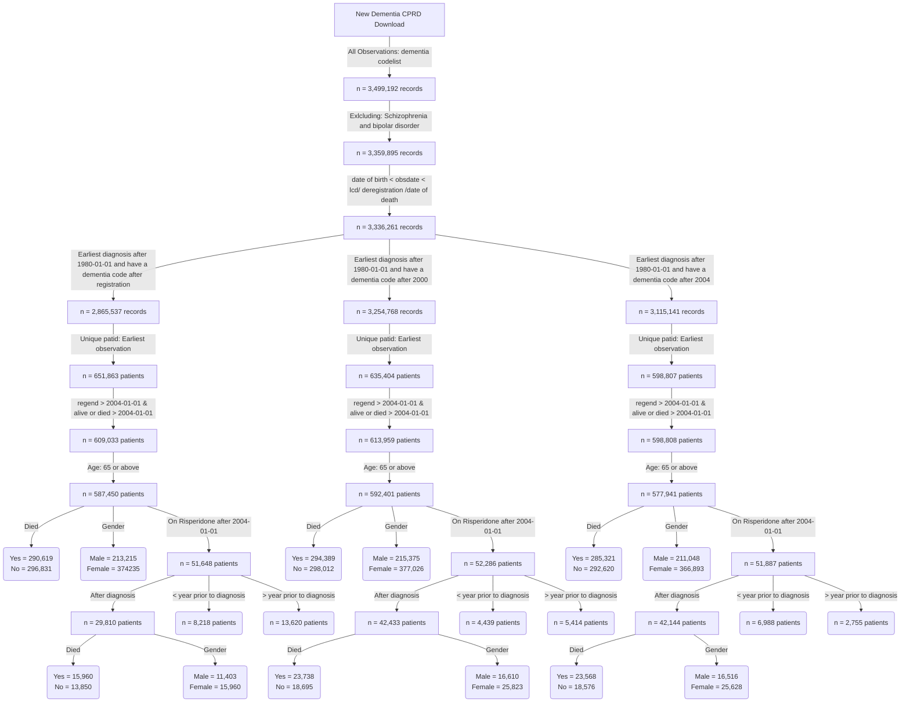

**This is the distribution of number of diagnosis per year for patients diagnosed after registration**


**This is the distribution of number of diagnosis per year for patients diagnosed after 2000**


**This is the distribution of number of prescriptions per year for patients diagnosed after 2004**


**BMJ codes vs ours**


```
BMJ codes	279
Our codes	631
Common codes	86
```
**Flow chart of the final cohorts**


**Dementia incident cohort**


```
                                     
                                      Overall       
  n                                   445386        
  diagnosedbeforeRegistration = 1 (%) 351540 (78.9) 
  died = 1 (%)                        223230 (50.1) 
  ONS_died = 1 (%)                    291568 (65.5) 
  death_composite = 1 (%)             325172 (73.0) 
  primary_death_stroke = 1 (%)         14707 ( 3.3) 
  ethnicity (%)                                     
     Black                              8389 ( 1.9) 
     Mixed                              1491 ( 0.3) 
     Other                              2607 ( 0.6) 
     South Asian                        8668 ( 1.9) 
     Unknown                            9356 ( 2.1) 
     White                            414875 (93.1) 
  age_diagnosis (mean (SD))            82.35 (7.02) 
  age_category (%)                                  
     65 - 74                           64316 (14.4) 
     75 - 84                          202091 (45.4) 
     85 - 94                          164328 (36.9) 
     95+                               14651 ( 3.3) 
  HES_stroke = 1 (%)                   56423 (12.7) 
  GP_stroke = 1 (%)                    70388 (15.8) 
  stroke_composite = 1 (%)             86280 (19.4) 
  year_of_diagnosis (%)                             
     2004                              20456 ( 4.6) 
     2005                              17424 ( 3.9) 
     2006                              19708 ( 4.4) 
     2007                              17419 ( 3.9) 
     2008                              18001 ( 4.0) 
     2009                              19946 ( 4.5) 
     2010                              21460 ( 4.8) 
     2011                              22688 ( 5.1) 
     2012                              25240 ( 5.7) 
     2013                              27310 ( 6.1) 
     2014                              29971 ( 6.7) 
     2015                              29770 ( 6.7) 
     2016                              26704 ( 6.0) 
     2017                              26491 ( 5.9) 
     2018                              25314 ( 5.7) 
     2019                              24738 ( 5.6) 
     2020                              19551 ( 4.4) 
     2021                              20464 ( 4.6) 
     2022                              19018 ( 4.3) 
     2023                              13713 ( 3.1) 
  gender_decode = M (%)               162443 (36.5) 
  alcohol_cat (%)                                   
     Excess                            23241 ( 5.2) 
     Harmful                           11658 ( 2.6) 
     None                              41684 ( 9.4) 
     Unknown                          118201 (26.5) 
     Within limits                    250602 (56.3) 
  smoking_cat (%)                                   
     Active smoker                     35956 ( 8.1) 
     Ex-smoker                        185222 (41.6) 
     Non-smoker                       142206 (31.9) 
     Unknown                           82002 (18.4) 
  qrisk2_smoking_cat (%)                            
     0                                191582 (43.0) 
     1                                116591 (26.2) 
     2                                 34443 ( 7.7) 
     3                                  1163 ( 0.3) 
     4                                   877 ( 0.2) 
     Unknown                          100730 (22.6) 
  qrisk2_smoking_cat_uncoded (%)                    
     Ex-smoker                        116591 (26.2) 
     Heavy smoker                        877 ( 0.2) 
     Light smoker                      34443 ( 7.7) 
     Moderate smoker                    1163 ( 0.3) 
     Non-smoker                       191582 (43.0) 
     Unknown                          100730 (22.6) 
  gp_qrisk2_ethnicity (%)                           
     Bangladeshi                         716 ( 0.2) 
     Black African                      1358 ( 0.3) 
     Black Caribbean                    5554 ( 1.2) 
     Chinese                             449 ( 0.1) 
     Indian                             4048 ( 0.9) 
     Other                              3587 ( 0.8) 
     Other Asian                        1575 ( 0.4) 
     Pakistani                          1651 ( 0.4) 
     Unknown                          112490 (25.3) 
     White                            313958 (70.5) 
  hes_qrisk2_ethnicity (%)                          
     Bangladeshi                         616 ( 0.1) 
     Black African                      1304 ( 0.3) 
     Black Caribbean                    5521 ( 1.2) 
     Chinese                             514 ( 0.1) 
     Indian                             3784 ( 0.8) 
     Other                              4955 ( 1.1) 
     Other Asian                        1600 ( 0.4) 
     Pakistani                          1516 ( 0.3) 
     Unknown                           32542 ( 7.3) 
     White                            393034 (88.2) 
  gp_5cat_ethnicity (%)                             
     Black                              7623 ( 1.7) 
     Mixed                              1302 ( 0.3) 
     Other                              2023 ( 0.5) 
     South Asian                        8064 ( 1.8) 
     Unknown                          112400 (25.2) 
     White                            313974 (70.5) 
  hes_5cat_ethnicity (%)                            
     Black                              7830 ( 1.8) 
     Mixed                              1031 ( 0.2) 
     Other                              3433 ( 0.8) 
     South Asian                        7516 ( 1.7) 
     Unknown                           32542 ( 7.3) 
     White                            393034 (88.2) 
  gp_16cat_ethnicity (%)                            
     African                            1371 ( 0.3) 
     Bangladeshi                         716 ( 0.2) 
     Caribbean                          5582 ( 1.3) 
     Chinese                             451 ( 0.1) 
     Indian                             4052 ( 0.9) 
     Other                              1590 ( 0.4) 
     Other Asian                        1585 ( 0.4) 
     Other Black                         598 ( 0.1) 
     Other Mixed                         341 ( 0.1) 
     Other White                        9380 ( 2.1) 
     Pakistani                          1652 ( 0.4) 
     Unknown                          112755 (25.3) 
     White and Asian                     165 ( 0.0) 
     White and Black African             200 ( 0.0) 
     White and Black Caribbean           612 ( 0.1) 
     White British                    299260 (67.2) 
     White Irish                        5076 ( 1.1) 
  hes_16cat_ethnicity (%)                           
     African                            1304 ( 0.3) 
     Bangladeshi                         616 ( 0.1) 
     Caribbean                          5521 ( 1.2) 
     Chinese                             514 ( 0.1) 
     Indian                             3784 ( 0.8) 
     Other                              2919 ( 0.7) 
     Other Asian                        1600 ( 0.4) 
     Other Black                        1005 ( 0.2) 
     Other Mixed                        1031 ( 0.2) 
     Pakistani                          1516 ( 0.3) 
     Unknown                           32542 ( 7.3) 
     White British                    393034 (88.2)

```


```
         0      1
  0 120214 101942
  1  33604 189626
```


```
         0      1
  0 359106  15892
  1  29857  40531

```


```
               Black  Mixed  Other South Asian Unknown  White
  Black         6026    248    256         108     562    423
  Mixed          537     93    123         102     113    334
  Other           48     34    528         155     210   1048
  South Asian    113     99    491        6331     661    369
  Unknown        766    189    584         604    9356 100901
  White          340    368   1451         216   21640 289959
```


```
           strata   median    lower    upper
1 gender_decode=F 4.914442 4.892539 4.941821
2 gender_decode=M 4.180698 4.153320 4.210815
```


```
           strata   median    lower    upper
1 gender_decode=F 4.914442 4.892539 4.941821
2 gender_decode=M 4.180698 4.153320 4.210815
```


```
                strata   median    lower    upper
1 age_category=65 - 74 7.701574 7.616701 7.789185
2 age_category=75 - 84 5.333333 5.305955 5.363450
3 age_category=85 - 94 3.263518 3.241615 3.288159
4     age_category=95+ 1.670089 1.620808 1.724846
```


```
                strata   median    lower    upper
1 age_category=65 - 74 5.451061 5.390828 5.508556
2 age_category=75 - 84 3.783710 3.764545 3.805613
3 age_category=85 - 94 2.302533 2.286105 2.318960
4     age_category=95+ 1.240246 1.204654 1.278576
```
**Risperidone incident cohort**
```
                                                        
                                                         Overall       
  n                                                        30060        
  diagnosedbeforeRegistration = 1 (%)                      17005 (56.6) 
  died = 1 (%)                                             17390 (57.9) 
  death_composite = 1 (%)                                  23726 (78.9) 
  ONS_died = 1 (%)                                         20695 (68.8) 
  age_diagnosis (mean (SD))                                80.44 (7.13) 
  age_risperidone (mean (SD))                              82.99 (6.87) 
  gender_decode = M (%)                                    11635 (38.7) 
  GP_stroke = 1 (%)                                         4214 (14.0) 
  HES_stroke = 1 (%)                                        3204 (10.7) 
  stroke_composite = 1 (%)                                  5161 (17.2) 
  primary_death_stroke = 1 (%)                               785 ( 2.6) 
  Composite_pre_stroke = 1 (%)                              4237 (14.1) 
  Composite_post_stroke = 1 (%)                             1695 ( 5.6) 
  comorbidity_stroke = 1 (%)                                4214 (14.0) 
  pre_index_date_stroke = 1 (%)                             3609 (12.0) 
  post_index_date_stroke = 1 (%)                            1061 ( 3.5) 
  ethnicity (%)                                                         
     Black                                                   504 ( 1.7) 
     Mixed                                                   107 ( 0.4) 
     Other                                                   171 ( 0.6) 
     South Asian                                             490 ( 1.6) 
     Unknown                                                 512 ( 1.7) 
     White                                                 28276 (94.1) 
  age_category (%)                                                      
     65 - 74                                                6544 (21.8) 
     75 - 84                                               14552 (48.4) 
     85+                                                    8964 (29.8) 
  year_of_diagnosis (%)                                                 
     2004                                                   1192 ( 4.0) 
     2005                                                   1008 ( 3.4) 
     2006                                                   1068 ( 3.6) 
     2007                                                   1063 ( 3.5) 
     2008                                                   1191 ( 4.0) 
     2009                                                   1532 ( 5.1) 
     2010                                                   1922 ( 6.4) 
     2011                                                   2071 ( 6.9) 
     2012                                                   2258 ( 7.5) 
     2013                                                   2462 ( 8.2) 
     2014                                                   2540 ( 8.4) 
     2015                                                   2284 ( 7.6) 
     2016                                                   2048 ( 6.8) 
     2017                                                   1986 ( 6.6) 
     2018                                                   1709 ( 5.7) 
     2019                                                   1412 ( 4.7) 
     2020                                                   1089 ( 3.6) 
     2021                                                    678 ( 2.3) 
     2022                                                    436 ( 1.5) 
     2023                                                    111 ( 0.4) 
  year_of_prescription (%)                                              
     2004                                                    661 ( 2.2) 
     2005                                                    444 ( 1.5) 
     2006                                                    567 ( 1.9) 
     2007                                                    628 ( 2.1) 
     2008                                                    510 ( 1.7) 
     2009                                                    613 ( 2.0) 
     2010                                                   1163 ( 3.9) 
     2011                                                   1417 ( 4.7) 
     2012                                                   1632 ( 5.4) 
     2013                                                   1910 ( 6.4) 
     2014                                                   2201 ( 7.3) 
     2015                                                   2452 ( 8.2) 
     2016                                                   2549 ( 8.5) 
     2017                                                   2583 ( 8.6) 
     2018                                                   2389 ( 7.9) 
     2019                                                   2326 ( 7.7) 
     2020                                                   2436 ( 8.1) 
     2021                                                   1598 ( 5.3) 
     2022                                                   1195 ( 4.0) 
     2023                                                    786 ( 2.6) 
  stroke_3_months_prior = 1 (%)                              155 ( 0.5) 
  stroke_6_months_prior = 1 (%)                              232 ( 0.8) 
  stroke_12_months_prior = 1 (%)                             368 ( 1.2) 
  prescribed_BMJ_antipsyc_drug = 1 (%)                     25732 (85.6) 
  stroke_recency_cat (%)                                                
      <= 1                                                   368 (10.2) 
      > 7                                                   3042 (84.3) 
     1 - 2                                                   146 ( 4.0) 
     2 - 3                                                    49 ( 1.4) 
     3 - 4                                                     4 ( 0.1) 
  Stroke_prior_to_risperidone = 1 (%)                       3404 (11.3) 
  Stroke__within_year_after_1st_risperidone_presc = 1 (%)    407 ( 1.4) 
  death_in_a_year_after_risperidone = 1 (%)                 7183 (23.9) 
  sex = 1 (%)                                              11635 (38.7) 
  dementia_duration_prior_risperidone (mean (SD))           2.11 (2.35) 
  Survival_time (mean (SD))                                 1.91 (1.94) 
  comorbidity_af = 1 (%)                                    5331 (17.7) 
  pre_index_date_af = 1 (%)                                 4765 (15.9) 
  post_index_date_af = 1 (%)                                1791 ( 6.0) 
  comorbidity_angina = 1 (%)                                3625 (12.1) 
  pre_index_date_angina = 1 (%)                             3536 (11.8) 
  post_index_date_angina = 1 (%)                             343 ( 1.1) 
  comorbidity_anxiety_disorders = 1 (%)                     6185 (20.6) 
  pre_index_date_anxiety_disorders = 1 (%)                  5937 (19.8) 
  post_index_date_anxiety_disorders = 1 (%)                  674 ( 2.2) 
  comorbidity_falls = 1 (%)                                16777 (55.8) 
  pre_index_date_falls = 1 (%)                             12080 (40.2) 
  post_index_date_falls = 1 (%)                             8833 (29.4) 
  comorbidity_fh_diabetes = 1 (%)                           6018 (20.0) 
  pre_index_date_fh_diabetes = 1 (%)                        5927 (19.7) 
  post_index_date_fh_diabetes = 1 (%)                        130 ( 0.4) 
  comorbidity_fh_premature_cvd = 1 (%)                      2311 ( 7.7) 
  pre_index_date_fh_premature_cvd = 1 (%)                   2279 ( 7.6) 
  post_index_date_fh_premature_cvd = 1 (%)                    46 ( 0.2) 
  comorbidity_heartfailure = 1 (%)                          2683 ( 8.9) 
  pre_index_date_heartfailure = 1 (%)                       2276 ( 7.6) 
  post_index_date_heartfailure = 1 (%)                       906 ( 3.0) 
  comorbidity_lowerlimbfracture = 1 (%)                     6301 (21.0) 
  pre_index_date_lowerlimbfracture = 1 (%)                  4757 (15.8) 
  post_index_date_lowerlimbfracture = 1 (%)                 1943 ( 6.5) 
  comorbidity_myocardialinfarction = 1 (%)                  2602 ( 8.7) 
  pre_index_date_myocardialinfarction = 1 (%)               2450 ( 8.2) 
  post_index_date_myocardialinfarction = 1 (%)               279 ( 0.9) 
  comorbidity_qof_diabetes = 1 (%)                          5484 (18.2) 
  pre_index_date_qof_diabetes = 1 (%)                       5167 (17.2) 
  post_index_date_qof_diabetes = 1 (%)                      2386 ( 7.9) 
  comorbidity_revasc = 1 (%)                                1608 ( 5.3) 
  pre_index_date_revasc = 1 (%)                             1599 ( 5.3) 
  post_index_date_revasc = 1 (%)                              24 ( 0.1) 
  stroke_cat = ischaemic (%)                                3612 (85.7) 
  comorbidity_tia = 1 (%)                                   3250 (10.8) 
  pre_index_date_tia = 1 (%)                                2791 ( 9.3) 
  post_index_date_tia = 1 (%)                                701 ( 2.3) 
  comorbidity_deep_vein_thrombosis = 1 (%)                  1989 ( 6.6) 
  pre_index_date_deep_vein_thrombosis = 1 (%)               1528 ( 5.1) 
  post_index_date_deep_vein_thrombosis = 1 (%)               549 ( 1.8) 
  comorbidity_haem_cancer = 1 (%)                            665 ( 2.2) 
  pre_index_date_haem_cancer = 1 (%)                         573 ( 1.9) 
  post_index_date_haem_cancer = 1 (%)                        186 ( 0.6) 
  comorbidity_pulmonary_embolism = 1 (%)                     978 ( 3.3) 
  pre_index_date_pulmonary_embolism = 1 (%)                  752 ( 2.5) 
  post_index_date_pulmonary_embolism = 1 (%)                 271 ( 0.9) 
  comorbidity_solid_cancer = 1 (%)                          5148 (17.1) 
  pre_index_date_solid_cancer = 1 (%)                       4708 (15.7) 
  post_index_date_solid_cancer = 1 (%)                      1065 ( 3.5) 
  VTE = 1 (%)                                               2743 ( 9.1) 
  BMI (%)                                                               
     Normal                                                10802 (35.9) 
     Obesity                                                3879 (12.9) 
     Overweight                                             8591 (28.6) 
     Severely Obese                                          278 ( 0.9) 
     Underweight                                            1303 ( 4.3) 
     Unknown                                                5207 (17.3) 
  totalcholesterol (%)                                                  
     < 160 mg/dl                                            6657 (22.1) 
     > 280 mg/dl                                            1042 ( 3.5) 
     199 mg/dl                                              7480 (24.9) 
     200 - 239 mg/dl                                        6438 (21.4) 
     240 - 279 mg/dl                                        2810 ( 9.3) 
     Unknown                                                5633 (18.7) 
  testvalue_dbp (mean (SD))                                76.41 (11.77)
  testvalue_sbp (mean (SD))                               135.80 (20.25)
  testvalue_totalcholesterol (mean (SD))                    4.98 (1.24) 
  gp_5cat_ethnicity (%)                                                 
     Black                                                   444 ( 1.5) 
     Mixed                                                    90 ( 0.3) 
     Other                                                   147 ( 0.5) 
     South Asian                                             449 ( 1.5) 
     Unknown                                                7311 (24.3) 
     White                                                 21619 (71.9) 
  gp_16cat_ethnicity (%)                                                
     African                                                  75 ( 0.2) 
     Bangladeshi                                              33 ( 0.1) 
     Caribbean                                               321 ( 1.1) 
     Chinese                                                  21 ( 0.1) 
     Indian                                                  227 ( 0.8) 
     Other                                                   128 ( 0.4) 
     Other Asian                                              83 ( 0.3) 
     Other Black                                              47 ( 0.2) 
     Other Mixed                                              21 ( 0.1) 
     Other White                                             665 ( 2.2) 
     Pakistani                                               101 ( 0.3) 
     Unknown                                                7332 (24.4) 
     White and Asian                                          16 ( 0.1) 
     White and Black African                                  11 ( 0.0) 
     White and Black Caribbean                                40 ( 0.1) 
     White British                                         20623 (68.6) 
     White Irish                                             316 ( 1.1) 
  gp_qrisk2_ethnicity (%)                                               
     Bangladeshi                                              33 ( 0.1) 
     Black African                                            75 ( 0.2) 
     Black Caribbean                                         319 ( 1.1) 
     Chinese                                                  21 ( 0.1) 
     Indian                                                  227 ( 0.8) 
     Other                                                   265 ( 0.9) 
     Other Asian                                              82 ( 0.3) 
     Pakistani                                               101 ( 0.3) 
     Unknown                                                7318 (24.3) 
     White                                                 21619 (71.9) 
  alcohol_cat (%)                                                       
     Excess                                                 1467 ( 4.9) 
     Harmful                                                 818 ( 2.7) 
     None                                                   2220 ( 7.4) 
     Unknown                                               10576 (35.2) 
     Within limits                                         14979 (49.8) 
  smoking_cat (%)                                                       
     Active smoker                                          2069 ( 6.9) 
     Ex-smoker                                             11224 (37.3) 
     Non-smoker                                             8404 (28.0) 
     Unknown                                                8363 (27.8) 
  qrisk2_smoking_cat (%)                                                
     0                                                     11101 (36.9) 
     1                                                      7373 (24.5) 
     2                                                      2037 ( 6.8) 
     3                                                        75 ( 0.2) 
     4                                                        40 ( 0.1) 
     Unknown                                                9434 (31.4) 
  qrisk2_smoking_cat_uncoded (%)                                        
     Ex-smoker                                              7373 (24.5) 
     Heavy smoker                                             40 ( 0.1) 
     Light smoker                                           2037 ( 6.8) 
     Moderate smoker                                          75 ( 0.2) 
     Non-smoker                                            11101 (36.9) 
     Unknown                                                9434 (31.4) 
  drug_name (%)                                                         
     amisulpride                                             488 ( 3.2) 
     aripiprazole                                            198 ( 1.3) 
     benperidol                                               20 ( 0.1) 
     chlorpromazine                                          230 ( 1.5) 
     clozapine                                                 1 ( 0.0) 
     flupentixol                                             165 ( 1.1) 
     fluphenazine                                             12 ( 0.1) 
     haloperidol                                            2714 (17.8) 
     levomepromazine                                        1697 (11.1) 
     olanzapine                                             1106 ( 7.2) 
     pericyazine                                              31 ( 0.2) 
     perphenazine                                             11 ( 0.1) 
     pimozide                                                128 ( 0.8) 
     prochlorperazine                                       6004 (39.3) 
     promazine                                               517 ( 3.4) 
     quetiapine                                             1798 (11.8) 
     sulpiride                                                38 ( 0.2) 
     thioridazine                                             34 ( 0.2) 
     trifluoperazine                                          78 ( 0.5) 
     zuclopenthixol                                           14 ( 0.1) 
  frailty (%)                                                           
     Mild                                                   1358 ( 4.5) 
     Moderate                                               3435 (11.4) 
     Severe                                                 5376 (17.9) 
     Unknown                                               19891 (66.2) 
  year_diagnosis_cat (%)                                                
     > 2020                                                 1225 ( 4.1) 
     2004 - 2008                                            5522 (18.4) 
     2009 - 2012                                            7783 (25.9) 
     2013 - 2016                                            9334 (31.1) 
     2017 - 2020                                            6196 (20.6) 
  prescribed_other_antipsyc_drug = 1 (%)                   15284 (50.8) 
  pre_indexdate_antipysch_prescr = 1 (%)                   10105 (66.1) 
  post_indexdate_antipysch_prescr = 1 (%)                   5088 (33.3) 
  same_indexdate_antipysch_prescr = 1 (%)                     91 ( 0.6) 
  pre_indexdate_drug_name (%)                                           
     amisulpride                                             184 ( 1.8) 
     aripiprazole                                             76 ( 0.8) 
     benperidol                                                7 ( 0.1) 
     chlorpromazine                                          123 ( 1.2) 
     clozapine                                                 1 ( 0.0) 
     flupentixol                                             196 ( 1.9) 
     fluphenazine                                             11 ( 0.1) 
     haloperidol                                             915 ( 9.1) 
     levomepromazine                                          91 ( 0.9) 
     olanzapine                                              584 ( 5.8) 
     pericyazine                                              19 ( 0.2) 
     perphenazine                                              7 ( 0.1) 
     pimozide                                                118 ( 1.2) 
     prochlorperazine                                       6005 (59.4) 
     promazine                                               316 ( 3.1) 
     quetiapine                                             1179 (11.7) 
     sulpiride                                                42 ( 0.4) 
     thioridazine                                            105 ( 1.0) 
     trifluoperazine                                         119 ( 1.2) 
     zuclopenthixol                                            7 ( 0.1) 
  same_indexdate_drug_name (%)                                          
     amisulpride                                               2 ( 2.2) 
     aripiprazole                                              8 ( 8.8) 
     chlorpromazine                                            5 ( 5.5) 
     flupentixol                                               2 ( 2.2) 
     haloperidol                                              21 (23.1) 
     levomepromazine                                           1 ( 1.1) 
     olanzapine                                                3 ( 3.3) 
     pimozide                                                  8 ( 8.8) 
     prochlorperazine                                          6 ( 6.6) 
     promazine                                                15 (16.5) 
     quetiapine                                               17 (18.7) 
     trifluoperazine                                           3 ( 3.3) 
  post_indexdate_drug_name (%)                                          
     amisulpride                                             118 ( 2.3) 
     aripiprazole                                            174 ( 3.4) 
     benperidol                                                3 ( 0.1) 
     chlorpromazine                                           30 ( 0.6) 
     flupentixol                                              12 ( 0.2) 
     haloperidol                                            1422 (27.9) 
     levomepromazine                                        1562 (30.7) 
     olanzapine                                              460 ( 9.0) 
     pericyazine                                               5 ( 0.1) 
     pimozide                                                 35 ( 0.7) 
     prochlorperazine                                        327 ( 6.4) 
     promazine                                               136 ( 2.7) 
     quetiapine                                              762 (15.0) 
     sulpiride                                                16 ( 0.3) 
     trifluoperazine                                          20 ( 0.4) 
     zuclopenthixol                                            6 ( 0.1) 
  care_home = 1 (%)                                        12371 (41.2) 
  care_home_before_indexdate = 1 (%)                        3977 (32.1) 
  care_home_at_indexdate = 1 (%)                             127 ( 1.0) 
  care_home_90_days_after_indexdate = 1 (%)                 2683 (21.7) 
  TimeSinceFirstPrescription (mean (SD))                    0.49 (0.93) 
  Prescription_ever_cat (%)                                             
     >100                                                    555 ( 1.8) 
     1                                                      5163 (17.2) 
     10                                                      781 ( 2.6) 
     11 - 20                                                5103 (17.0) 
     2                                                      2655 ( 8.8) 
     21 - 30                                                2757 ( 9.2) 
     3                                                      1930 ( 6.4) 
     31 - 40                                                1618 ( 5.4) 
     4                                                      1582 ( 5.3) 
     41 - 50                                                1002 ( 3.3) 
     5                                                      1303 ( 4.3) 
     51 - 100                                               1653 ( 5.5) 
     6                                                      1111 ( 3.7) 
     7                                                      1051 ( 3.5) 
     8                                                       926 ( 3.1) 
     9                                                       870 ( 2.9) 
  Prescriptions_after_a_year_cat (%)                                    
     >100                                                    301 ( 3.0) 
     1                                                       699 ( 7.0) 
     10                                                      288 ( 2.9) 
     11 - 20                                                2119 (21.3) 
     2                                                       610 ( 6.1) 
     21 - 30                                                1193 (12.0) 
     3                                                       520 ( 5.2) 
     31 - 40                                                 759 ( 7.6) 
     4                                                       455 ( 4.6) 
     41 - 50                                                 469 ( 4.7) 
     5                                                       413 ( 4.2) 
     51 - 100                                                723 ( 7.3) 
     6                                                       372 ( 3.7) 
     7                                                       373 ( 3.8) 
     8                                                       328 ( 3.3) 
     9                                                       311 ( 3.1) 
  Prescriptions_within_a_year_cat (%)                                   
     >100                                                     16 ( 0.1) 
     1                                                      5382 (17.9) 
     10                                                      953 ( 3.2) 
     11 - 20                                                9427 (31.4) 
     2                                                      2739 ( 9.1) 
     21 - 30                                                 850 ( 2.8) 
     3                                                      2004 ( 6.7) 
     31 - 40                                                 310 ( 1.0) 
     4                                                      1651 ( 5.5) 
     41 - 50                                                 298 ( 1.0) 
     5                                                      1392 ( 4.6) 
     51 - 100                                                517 ( 1.7) 
     6                                                      1232 ( 4.1) 
     7                                                      1224 ( 4.1) 
     8                                                      1064 ( 3.5) 
     9                                                      1001 ( 3.3) 
  consultation_counts_Cat (%)                                           
     0 - 50                                                10847 (36.7) 
     101 - 150                                              5102 (17.2) 
     151 - 200                                              1936 ( 6.5) 
     201 - 250                                               732 ( 2.5) 
     251 - 300                                               302 ( 1.0) 
     301 - 350                                               123 ( 0.4) 
     351 - 400                                                50 ( 0.2) 
     401 - 450                                                34 ( 0.1) 
     451 - 500                                                28 ( 0.1) 
     501 - 800                                                30 ( 0.1) 
     51 - 100                                              10391 (35.1) 
     801 - 1000                                                3 ( 0.0) 
  pre_BMJ_indexdate_drug_name (%)                                       
     amisulpride                                             169 ( 8.7) 
     aripiprazole                                             15 ( 0.8) 
     benperidol                                                7 ( 0.4) 
     chlorpromazine                                          122 ( 6.3) 
     clozapine                                                 1 ( 0.1) 
     flupentixol                                             122 ( 6.3) 
     fluphenazine                                             10 ( 0.5) 
     haloperidol                                             852 (43.7) 
     levomepromazine                                          10 ( 0.5) 
     olanzapine                                               49 ( 2.5) 
     pericyazine                                              19 ( 1.0) 
     perphenazine                                              2 ( 0.1) 
     pimozide                                                  5 ( 0.3) 
     prochlorperazine                                        368 (18.9) 
     promazine                                                46 ( 2.4) 
     quetiapine                                               67 ( 3.4) 
     sulpiride                                                16 ( 0.8) 
     thioridazine                                             33 ( 1.7) 
     trifluoperazine                                          34 ( 1.7) 
     zuclopenthixol                                            2 ( 0.1) 
  same_BMJ_indexdate_drug_name (%)                                      
     amisulpride                                              93 ( 0.9) 
     aripiprazole                                            186 ( 1.8) 
     benperidol                                                3 ( 0.0) 
     chlorpromazine                                           30 ( 0.3) 
     flupentixol                                              64 ( 0.6) 
     fluphenazine                                              1 ( 0.0) 
     haloperidol                                            1187 (11.4) 
     levomepromazine                                        1289 (12.3) 
     olanzapine                                              770 ( 7.4) 
     pericyazine                                               5 ( 0.0) 
     perphenazine                                              5 ( 0.0) 
     pimozide                                                128 ( 1.2) 
     prochlorperazine                                       4808 (46.0) 
     promazine                                               309 ( 3.0) 
     quetiapine                                             1400 (13.4) 
     sulpiride                                                29 ( 0.3) 
     thioridazine                                             59 ( 0.6) 
     trifluoperazine                                          75 ( 0.7) 
     zuclopenthixol                                            6 ( 0.1) 
  post_BMJ_indexdate_drug_name (%)                                      
     amisulpride                                              34 ( 3.8) 
     aripiprazole                                             28 ( 3.1) 
     chlorpromazine                                            5 ( 0.6) 
     flupentixol                                               9 ( 1.0) 
     haloperidol                                             150 (16.8) 
     levomepromazine                                          89 (10.0) 
     olanzapine                                               66 ( 7.4) 
     pimozide                                                  7 ( 0.8) 
     prochlorperazine                                        320 (35.9) 
     promazine                                                26 ( 2.9) 
     quetiapine                                              135 (15.2) 
     sulpiride                                                 5 ( 0.6) 
     thioridazine                                              2 ( 0.2) 
     trifluoperazine                                          12 ( 1.3) 
     zuclopenthixol                                            3 ( 0.3) 
  comorbidity_hypertension (%)                                          
     Elevated                                               3327 (11.1) 
     Normal                                                 4156 (13.8) 
     Stage 1                                               13285 (44.2) 
     Stage 2                                                8633 (28.7) 
     Stage 3 (severe)                                        191 ( 0.6) 
     Unknown                                                 468 ( 1.6) 
  pre_index_date_hypertension = 1 (%)                      24666 (83.3) 
  comorbidity_hearing_loss = 1 (%)                          8411 (28.0) 
  pre_index_date_hearing_loss = 1 (%)                       7900 (26.3) 
  post_index_date_hearing_loss = 1 (%)                      1127 ( 3.7) 
  pre_indexdate_BMJ_antipysch_prescr = 1 (%)                1961 ( 7.6) 
  post_indexdate_BMJ_antipysch_prescr = 1 (%)               1756 ( 6.8) 
  same_indexdate_BMJ_antipysch_prescr = 1 (%)              22015 (85.6) 
  HES_comorbidity_stroke = 1 (%)                            3204 (10.7) 
  HES_pre_index_date_stroke = 1 (%)                         2568 ( 8.5) 
  HES_post_index_date_stroke = 1 (%)                         964 ( 3.2) 
  hes_5cat_ethnicity (%)                                                
     Black                                                   474 ( 1.6) 
     Mixed                                                    70 ( 0.2) 
     Other                                                   189 ( 0.6) 
     South Asian                                             440 ( 1.5) 
     Unknown                                                2169 ( 7.2) 
     White                                                 26718 (88.9) 
  hes_16cat_ethnicity (%)                                               
     African                                                  78 ( 0.3) 
     Bangladeshi                                              30 ( 0.1) 
     Caribbean                                               341 ( 1.1) 
     Chinese                                                  20 ( 0.1) 
     Indian                                                  202 ( 0.7) 
     Other                                                   169 ( 0.6) 
     Other Asian                                             106 ( 0.4) 
     Other Black                                              55 ( 0.2) 
     Other Mixed                                              70 ( 0.2) 
     Pakistani                                               102 ( 0.3) 
     Unknown                                                2169 ( 7.2) 
     White British                                         26718 (88.9) 
  hes_qrisk2_ethnicity (%)                                              
     Bangladeshi                                              30 ( 0.1) 
     Black African                                            78 ( 0.3) 
     Black Caribbean                                         341 ( 1.1) 
     Chinese                                                  20 ( 0.1) 
     Indian                                                  202 ( 0.7) 
     Other                                                   294 ( 1.0) 
     Other Asian                                             106 ( 0.4) 
     Pakistani                                               102 ( 0.3) 
     Unknown                                                2169 ( 7.2) 
     White                                                 26718 (88.9) 
```


```
           strata   median    lower    upper
1 gender_decode=F 2.436687 2.376454 2.505133
2 gender_decode=M 1.889117 1.817933 1.943874
```


```
           strata   median    lower    upper
1 gender_decode=F 4.125941 4.043806 4.210815
2 gender_decode=M 3.676934 3.567420 3.753593
```


```
                strata   median    lower    upper
1 age_category=65 - 74 3.529090 3.405886 3.668720
2 age_category=75 - 84 2.390144 2.318960 2.453114
3     age_category=85+ 1.420945 1.374401 1.478439

```


```
                strata   median    lower    upper
1 age_category=65 - 74 5.483915 5.273101 5.612594
2 age_category=75 - 84 4.334018 4.251882 4.427105
3     age_category=85+ 2.863792 2.798084 2.956879

```


**COX model**
```
coxph(formula = Surv(Survival_time, Composite_post_stroke) ~ 
    age_diagnosis + Composite_pre_stroke + sex, data = CompleteData)

  n= 14464, number of events= 1207 
   (15596 observations deleted due to missingness)

                         coef exp(coef) se(coef)      z Pr(>|z|)    
age_diagnosis         0.01036   1.01042  0.00435  2.382  0.01723 *  
Composite_pre_stroke1 1.63788   5.14424  0.05853 27.982  < 2e-16 ***
sex1                  0.19645   1.21708  0.06117  3.211  0.00132 ** 
---
Signif. codes:  0 ‘***’ 0.001 ‘**’ 0.01 ‘*’ 0.05 ‘.’ 0.1 ‘ ’ 1

                      exp(coef) exp(-coef) lower .95 upper .95
age_diagnosis             1.010     0.9897     1.002     1.019
Composite_pre_stroke1     5.144     0.1944     4.587     5.770
sex1                      1.217     0.8216     1.080     1.372

Concordance= 0.686  (se = 0.01 )
Likelihood ratio test= 703  on 3 df,   p=<2e-16
Wald test            = 821.1  on 3 df,   p=<2e-16
Score (logrank) test = 1022  on 3 df,   p=<2e-16

```


**One year censoring**

<!--
```
Call:
coxph(formula = Surv(Survival_time, post_index_date_stroke) ~ 
    age_diagnosis + pre_index_date_stroke + sex, data = CensoringData_1year)

  n= 23940, number of events= 501 
   (19 observations deleted due to missingness)

                           coef exp(coef) se(coef)      z Pr(>|z|)    
age_diagnosis          0.010646  1.010703 0.006488  1.641   0.1008    
pre_index_date_stroke1 2.196622  8.994583 0.090048 24.394   <2e-16 ***
sex1                   0.199762  1.221113 0.092650  2.156   0.0311 *  
---
Signif. codes:  0 ‘***’ 0.001 ‘**’ 0.01 ‘*’ 0.05 ‘.’ 0.1 ‘ ’ 1

                       exp(coef) exp(-coef) lower .95 upper .95
age_diagnosis              1.011     0.9894    0.9979     1.024
pre_index_date_stroke1     8.995     0.1112    7.5393    10.731
sex1                       1.221     0.8189    1.0183     1.464

Concordance= 0.742  (se = 0.013 )
Likelihood ratio test= 546.2  on 3 df,   p=<2e-16
Wald test            = 619.1  on 3 df,   p=<2e-16
Score (logrank) test = 915.7  on 3 df,   p=<2e-16
```

**Excluding stroke 3 months prior**


```
Call:
coxph(formula = Surv(Survival_time, post_index_date_stroke) ~ 
    age_diagnosis + pre_index_date_stroke + sex, data = Excluding_3_monthsPriorStroke)

  n= 23836, number of events= 789 

                           coef exp(coef) se(coef)      z Pr(>|z|)    
age_diagnosis          0.017014  1.017160 0.005212  3.264   0.0011 ** 
pre_index_date_stroke1 1.769601  5.868512 0.073380 24.116   <2e-16 ***
sex1                   0.176362  1.192870 0.075323  2.341   0.0192 *  
---
Signif. codes:  0 ‘***’ 0.001 ‘**’ 0.01 ‘*’ 0.05 ‘.’ 0.1 ‘ ’ 1

                       exp(coef) exp(-coef) lower .95 upper .95
age_diagnosis              1.017     0.9831     1.007     1.028
pre_index_date_stroke1     5.869     0.1704     5.082     6.776
sex1                       1.193     0.8383     1.029     1.383

Concordance= 0.706  (se = 0.011 )
Likelihood ratio test= 499.9  on 3 df,   p=<2e-16
Wald test            = 615.9  on 3 df,   p=<2e-16
Score (logrank) test = 794.9  on 3 df,   p=<2e-16


```


**Excluding stroke 12 months prior**


```
Call:
coxph(formula = Surv(Survival_time, post_index_date_stroke) ~ 
    age_diagnosis + pre_index_date_stroke + sex, data = Excluding_12_monthsPriorStroke)

  n= 23670, number of events= 744 

                           coef exp(coef) se(coef)      z Pr(>|z|)    
age_diagnosis          0.019554  1.019747 0.005376  3.637 0.000276 ***
pre_index_date_stroke1 1.663083  5.275553 0.076970 21.607  < 2e-16 ***
sex1                   0.184390  1.202484 0.077672  2.374 0.017598 *  
---
Signif. codes:  0 ‘***’ 0.001 ‘**’ 0.01 ‘*’ 0.05 ‘.’ 0.1 ‘ ’ 1

                       exp(coef) exp(-coef) lower .95 upper .95
age_diagnosis              1.020     0.9806     1.009     1.031
pre_index_date_stroke1     5.276     0.1896     4.537     6.135
sex1                       1.202     0.8316     1.033     1.400

Concordance= 0.689  (se = 0.012 )
Likelihood ratio test= 401.8  on 3 df,   p=<2e-16
Wald test            = 501  on 3 df,   p=<2e-16
Score (logrank) test = 627.7  on 3 df,   p=<2e-16

```
-->


**Matching**

****2004 - 2010***
```
                                                        Stratified by risperidone
                                                          0             1              p      test SMD   
  n                                                       22537          4551                            
  sex = 1 (%)                                              7156 (31.8)   1444 ( 31.7)   0.990      <0.001
  risperidone = 1 (%)                                         0 ( 0.0)   4551 (100.0)  <0.001         NaN
  age_diagnosis (mean (SD))                               81.07 (6.85)  81.00 (6.96)    0.521       0.010
  Stroke__within_year_after_1st_risperidone_presc = 1 (%)  1002 ( 4.4)    231 (  5.1)   0.069       0.030
  stroke_composite_pre_index_date = 1 (%)                  2883 (12.8)    585 ( 12.9)   0.928       0.002
  pre_index_date_angina = 1 (%)                            2608 (11.6)    521 ( 11.4)   0.831       0.004
  pre_index_date_heartfailure = 1 (%)                      1653 ( 7.3)    314 (  6.9)   0.317       0.017
  BMI (%)                                                                               0.983       0.014
     Missing                                               9815 (43.6)   1972 ( 43.3)                    
     Normal                                                6828 (30.3)   1385 ( 30.4)                    
     Obesity                                               1220 ( 5.4)    244 (  5.4)                    
     Overweight                                            3645 (16.2)    749 ( 16.5)                    
     Severely Obese                                          93 ( 0.4)     16 (  0.4)                    
     Underweight                                            936 ( 4.2)    185 (  4.1)                    
  Prescribed_other_antipsychotic_Prior = 1 (%)             5912 (26.2)   1159 ( 25.5)   0.292       0.017
  period_before_prescription (mean (SD))                   2.24 (1.95)   2.17 (2.25)    0.052       0.030
  comorbidity_myocardialinfarction = 1 (%)                 1866 ( 8.3)    349 (  7.7)   0.179       0.023
  pre_index_date_stroke = 1 (%)                            2405 (10.7)    491 ( 10.8)   0.835       0.004
  pre_index_date_tia = 1 (%)                               2183 ( 9.7)    424 (  9.3)   0.457       0.013
  pre_index_date_falls = 1 (%)                             5912 (26.2)   1194 ( 26.2)   1.000      <0.001
  pre_index_date_lowerlimbfracture = 1 (%)                 3445 (15.3)    702 ( 15.4)   0.830       0.004
  pre_index_date_ihd = 1 (%)                               3534 (15.7)    705 ( 15.5)   0.765       0.005
  pre_index_date_pad = 1 (%)                               1560 ( 6.9)    314 (  6.9)   0.982       0.001
  pre_index_date_af = 1 (%)                                2680 (11.9)    535 ( 11.8)   0.815       0.004
  pre_index_date_revasc = 1 (%)                             585 ( 2.6)    120 (  2.6)   0.914       0.003
  pre_index_date_qof_diabetes = 1 (%)                      2525 (11.2)    509 ( 11.2)   0.990       0.001
  pre_index_date_anxiety_disorders = 1 (%)                 3000 (13.3)    598 ( 13.1)   0.774       0.005
  pre_index_date_fh_diabetes = 1 (%)                       2455 (10.9)    505 ( 11.1)   0.708       0.006
  pre_index_date_fh_premature_cvd = 1 (%)                   742 ( 3.3)    153 (  3.4)   0.846       0.004
  pre_index_date_pulmonary_embolism = 1 (%)                 372 ( 1.7)     74 (  1.6)   0.956       0.002
  pre_index_date_deep_vein_thrombosis = 1 (%)               776 ( 3.4)    158 (  3.5)   0.959       0.002
  pre_index_date_hearing_loss = 1 (%)                      4147 (18.4)    836 ( 18.4)   0.977       0.001
  VTE = 1 (%)                                              1453 ( 6.4)    296 (  6.5)   0.913       0.002
  gp_5cat_ethnicity (%)                                                                <0.001       0.108
     Black                                                  279 ( 1.2)     55 (  1.2)                    
     Mixed                                                   65 ( 0.3)     12 (  0.3)                    
     Other                                                   44 ( 0.2)     14 (  0.3)                    
     South Asian                                            126 ( 0.6)     28 (  0.6)                    
     Unknown                                              11065 (49.1)   1995 ( 43.8)                    
     White                                                10958 (48.6)   2447 ( 53.8)                    
  comorbidity_hypertension (%)                                                          0.967       0.015
     Elevated                                              3162 (14.0)    627 ( 13.8)                    
     Normal                                                4664 (20.7)    931 ( 20.5)                    
     Stage 1                                               9298 (41.3)   1899 ( 41.7)                    
     Stage 2                                               3647 (16.2)    733 ( 16.1)                    
     Stage 3 (severe)                                        22 ( 0.1)      6 (  0.1)                    
     Unknown                                               1744 ( 7.7)    355 (  7.8)                    
  Survival_time (mean (SD))                                2.22 (2.27)   2.23 (2.45)    0.723       0.006

```


```
Call:
coxph(formula = Surv(Survival_time, stroke_composite_post_index_date) ~ 
    age_diagnosis + sex + stroke_composite_pre_index_date, data = table)

  n= 27088, number of events= 2579 

                                    coef exp(coef) se(coef)      z Pr(>|z|)    
age_diagnosis                   0.009789  1.009837 0.003007  3.255  0.00113 ** 
sex                             0.137362  1.147243 0.042673  3.219  0.00129 ** 
stroke_composite_pre_index_date 1.774830  5.899277 0.040587 43.729  < 2e-16 ***
---
Signif. codes:  0 ‘***’ 0.001 ‘**’ 0.01 ‘*’ 0.05 ‘.’ 0.1 ‘ ’ 1

                                exp(coef) exp(-coef) lower .95 upper .95
age_diagnosis                       1.010     0.9903     1.004     1.016
sex                                 1.147     0.8717     1.055     1.247
stroke_composite_pre_index_date     5.899     0.1695     5.448     6.388

Concordance= 0.701  (se = 0.006 )
Likelihood ratio test= 1599  on 3 df,   p=<2e-16
Wald test            = 1971  on 3 df,   p=<2e-16
Score (logrank) test = 2543  on 3 df,   p=<2e-16

```


```
         strata   median    lower    upper
1 risperidone=0 3.939767 3.893224 3.989049
2 risperidone=1 3.797399 3.704312 3.942505
```


```
         strata   median    lower    upper
1 risperidone=0 4.421629 4.290212 4.594114
2 risperidone=1 4.262834 3.879535 4.599589
```


***2004 - 2014***

```
                                                        Stratified by risperidone
                                                          0             1              p      test SMD   
  n                                                       57335         11642                            
  sex = 1 (%)                                             20445 (35.7)   4134 ( 35.5)   0.767       0.003
  risperidone = 1 (%)                                         0 ( 0.0)  11642 (100.0)  <0.001         NaN
  age_diagnosis (mean (SD))                               80.65 (6.91)  80.59 (7.06)    0.368       0.009
  Stroke__within_year_after_1st_risperidone_presc = 1 (%)  2390 ( 4.2)    503 (  4.3)   0.471       0.008
  stroke_composite_pre_index_date = 1 (%)                  7846 (13.7)   1582 ( 13.6)   0.795       0.003
  pre_index_date_angina = 1 (%)                            6790 (11.8)   1364 ( 11.7)   0.712       0.004
  pre_index_date_heartfailure = 1 (%)                      4050 ( 7.1)    791 (  6.8)   0.309       0.011
  BMI (%)                                                                               0.986       0.008
     Missing                                              20444 (35.7)   4128 ( 35.5)                    
     Normal                                               18522 (32.3)   3792 ( 32.6)                    
     Obesity                                               4184 ( 7.3)    854 (  7.3)                    
     Overweight                                           11060 (19.3)   2248 ( 19.3)                    
     Severely Obese                                         262 ( 0.5)     53 (  0.5)                    
     Underweight                                           2863 ( 5.0)    567 (  4.9)                    
  Prescribed_other_antipsychotic_Prior = 1 (%)            14247 (24.8)   2833 ( 24.3)   0.246       0.012
  period_before_prescription (mean (SD))                   2.45 (2.10)   2.37 (2.30)   <0.001       0.037
  comorbidity_myocardialinfarction = 1 (%)                 5067 ( 8.8)    995 (  8.5)   0.321       0.010
  pre_index_date_stroke = 1 (%)                            6567 (11.5)   1327 ( 11.4)   0.877       0.002
  pre_index_date_tia = 1 (%)                               5381 ( 9.4)   1058 (  9.1)   0.323       0.010
  pre_index_date_falls = 1 (%)                            17077 (29.8)   3407 ( 29.3)   0.268       0.011
  pre_index_date_lowerlimbfracture = 1 (%)                 8700 (15.2)   1757 ( 15.1)   0.833       0.002
  pre_index_date_ihd = 1 (%)                               9511 (16.6)   1909 ( 16.4)   0.623       0.005
  pre_index_date_pad = 1 (%)                               4279 ( 7.5)    844 (  7.2)   0.434       0.008
  pre_index_date_af = 1 (%)                                7750 (13.5)   1540 ( 13.2)   0.413       0.008
  pre_index_date_revasc = 1 (%)                            2175 ( 3.8)    450 (  3.9)   0.732       0.004
  pre_index_date_qof_diabetes = 1 (%)                      7891 (13.8)   1608 ( 13.8)   0.900       0.001
  pre_index_date_anxiety_disorders = 1 (%)                 8843 (15.4)   1809 ( 15.5)   0.765       0.003
  pre_index_date_fh_diabetes = 1 (%)                       7914 (13.8)   1610 ( 13.8)   0.952       0.001
  pre_index_date_fh_premature_cvd = 1 (%)                  2486 ( 4.3)    503 (  4.3)   0.961       0.001
  pre_index_date_pulmonary_embolism = 1 (%)                1092 ( 1.9)    222 (  1.9)   1.000      <0.001
  pre_index_date_deep_vein_thrombosis = 1 (%)              2463 ( 4.3)    492 (  4.2)   0.754       0.003
  pre_index_date_hearing_loss = 1 (%)                     11976 (20.9)   2409 ( 20.7)   0.645       0.005
  VTE = 1 (%)                                              4463 ( 7.8)    901 (  7.7)   0.884       0.002
  gp_5cat_ethnicity (%)                                                                 0.129       0.030
     Black                                                  738 ( 1.3)    141 (  1.2)                    
     Mixed                                                  188 ( 0.3)     35 (  0.3)                    
     Other                                                  223 ( 0.4)     52 (  0.4)                    
     South Asian                                            534 ( 0.9)    104 (  0.9)                    
     Unknown                                              20294 (35.4)   3977 ( 34.2)                    
     White                                                35358 (61.7)   7333 ( 63.0)                    
  comorbidity_hypertension (%)                                                          0.005       0.041
     Elevated                                              9311 (16.2)   1875 ( 16.1)                    
     Normal                                               13119 (22.9)   2592 ( 22.3)                    
     Stage 1                                              22817 (39.8)   4623 ( 39.7)                    
     Stage 2                                               8808 (15.4)   1776 ( 15.3)                    
     Stage 3 (severe)                                        47 ( 0.1)     10 (  0.1)                    
     Unknown                                               3233 ( 5.6)    766 (  6.6)                    
  Survival_time (mean (SD))                                2.12 (2.13)   2.13 (2.29)    0.511       0.007

```


```
Call:
coxph(formula = Surv(Survival_time, stroke_composite_post_index_date) ~ 
    age_diagnosis + sex + stroke_composite_pre_index_date, data = table)

  n= 68977, number of events= 5869 

                                    coef exp(coef) se(coef)      z Pr(>|z|)    
age_diagnosis                   0.008525  1.008561 0.001974  4.318 1.58e-05 ***
sex                             0.125250  1.133432 0.027616  4.535 5.75e-06 ***
stroke_composite_pre_index_date 1.803084  6.068332 0.026597 67.793  < 2e-16 ***
---
Signif. codes:  0 ‘***’ 0.001 ‘**’ 0.01 ‘*’ 0.05 ‘.’ 0.1 ‘ ’ 1

                                exp(coef) exp(-coef) lower .95 upper .95
age_diagnosis                       1.009     0.9915     1.005     1.012
sex                                 1.133     0.8823     1.074     1.196
stroke_composite_pre_index_date     6.068     0.1648     5.760     6.393

Concordance= 0.705  (se = 0.004 )
Likelihood ratio test= 3893  on 3 df,   p=<2e-16
Wald test            = 4706  on 3 df,   p=<2e-16
Score (logrank) test = 6118  on 3 df,   p=<2e-16
```


```
         strata   median    lower    upper
1 risperidone=0 4.128679 4.101300 4.158795
2 risperidone=1 4.032854 3.956194 4.104038
```


```
         strata   median    lower    upper
1 risperidone=0 4.344969 4.257358 4.429843
2 risperidone=1 4.536619 4.344969 4.763860
```


***2004 - 2023***


