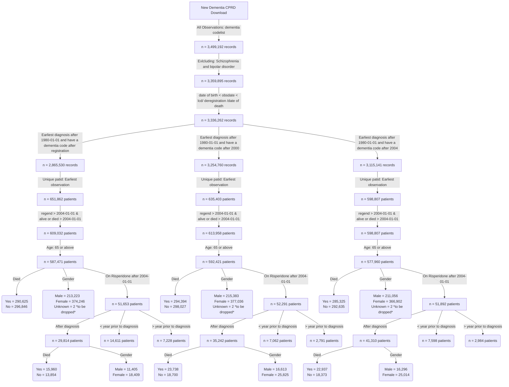

**This is the distribution of number of diagnosis per year for patients diagnosed after registration**


**This is the distribution of number of diagnosis per year for patients diagnosed after 2000**


**This is the distribution of number of prescriptions per year for patients diagnosed after 2004**


**Dementia incident cohort**


```
                                            Overall       
  n                                           445402        
  diagnosedbefore = 1 (%)                     360105 (80.8) 
  died = 1 (%)                                223233 (50.1) 
  age_diagnosis (mean (SD))                    82.35 (7.02) 
  age_category (%)                                          
     65-74                                     64286 (14.4) 
     75-84                                    202031 (45.4) 
     85-94                                    164413 (36.9) 
     95+                                       14672 ( 3.3) 
  year_of_diagnosis (%)                                     
     2004                                      20457 ( 4.6) 
     2005                                      17426 ( 3.9) 
     2006                                      19708 ( 4.4) 
     2007                                      17420 ( 3.9) 
     2008                                      18002 ( 4.0) 
     2009                                      19947 ( 4.5) 
     2010                                      21460 ( 4.8) 
     2011                                      22688 ( 5.1) 
     2012                                      25240 ( 5.7) 
     2013                                      27311 ( 6.1) 
     2014                                      29973 ( 6.7) 
     2015                                      29772 ( 6.7) 
     2016                                      26706 ( 6.0) 
     2017                                      26491 ( 5.9) 
     2018                                      25314 ( 5.7) 
     2019                                      24739 ( 5.6) 
     2020                                      19551 ( 4.4) 
     2021                                      20464 ( 4.6) 
     2022                                      19019 ( 4.3) 
     2023                                      13714 ( 3.1) 
  gender_decode = M (%)                       162452 (36.5) 
  pre_diagnoses_af = 1 (%)                     71757 (77.4) 
  post_diagnoses_af = 1 (%)                    19293 (20.8) 
  af_ever = 1 (%)                              92669 (20.8) 
  pre_diagnoses_angina = 1 (%)                 52848 (93.6) 
  post_diagnoses_angina = 1 (%)                 3420 ( 6.1) 
  angina_ever = 1 (%)                          56491 (12.7) 
  pre_diagnoses_anxiety_disorders = 1 (%)      70806 (89.7) 
  post_diagnoses_anxiety_disorders = 1 (%)      7522 ( 9.5) 
  anxiety_disorders_ever = 1 (%)               78971 (17.7) 
  pre_diagnoses_falls = 1 (%)                 144780 (60.2) 
  post_diagnoses_falls = 1 (%)                 93425 (38.8) 
  falls_ever = 1 (%)                          240554 (54.0) 
  pre_diagnoses_fh_diabetes = 1 (%)            92270 (95.1) 
  post_diagnoses_fh_diabetes = 1 (%)            4569 ( 4.7) 
  fh_diabetes_ever = 1 (%)                     97034 (21.8) 
  heartfailure_ever = 1 (%)                    53890 (12.1) 
  pre_diagnoses_hypertension = 1 (%)          246438 (95.5) 
  post_diagnoses_hypertension = 1 (%)           9528 ( 3.7) 
  hypertension_ever = 1 (%)                   258088 (57.9) 
  pre_diagnoses_lowerlimbfracture = 1 (%)      58379 (66.1) 
  post_diagnoses_lowerlimbfracture = 1 (%)     29242 (33.1) 
  lowerlimbfracture_ever = 1 (%)               88302 (19.8) 
  pre_diagnoses_myocardialinfarction = 1 (%)   36031 (85.4) 
  post_diagnoses_myocardialinfarction = 1 (%)   5855 (13.9) 
  myocardialinfarction_ever = 1 (%)            42174 ( 9.5) 
  pre_diagnoses_qof_diabetes = 1 (%)           76875 (88.9) 
  post_diagnoses_qof_diabetes = 1 (%)           8579 ( 9.9) 
  qof_diabetes_ever = 1 (%)                    86493 (19.4) 
  pre_diagnoses_revasc = 1 (%)                 24363 (96.4) 
  post_diagnoses_revasc = 1 (%)                  840 ( 3.3) 
  revasc_ever = 1 (%)                          25262 ( 5.7) 
  pre_diagnoses_stroke = 1 (%)                 53085 (75.4) 
  post_diagnoses_stroke = 1 (%)                15657 (22.2) 
  stroke_ever = 1 (%)                          70392 (15.8) 
  pre_diagnoses_tia = 1 (%)                    40459 (79.1) 
  post_diagnoses_tia = 1 (%)                   10133 (19.8) 
  tia_ever = 1 (%)                             51118 (11.5) 
  alcohol_cat (%)                                           
     Excess                                    23242 ( 5.2) 
     Harmful                                   11662 ( 2.6) 
     None                                      41685 ( 9.4) 
     Unknown                                  118203 (26.5) 
     Within limits                            250610 (56.3) 
  smoking_cat (%)                                           
     Active smoker                             35957 ( 8.1) 
     Ex-smoker                                185229 (41.6) 
     Non-smoker                               142210 (31.9) 
     Unknown                                   82006 (18.4) 
  qrisk2_smoking_cat (%)                                    
     0                                        191587 (43.0) 
     1                                        116595 (26.2) 
     2                                         34444 ( 7.7) 
     3                                          1163 ( 0.3) 
     4                                           877 ( 0.2) 
     Unknown                                  100736 (22.6) 
  qrisk2_smoking_cat_uncoded (%)                            
     Ex-smoker                                116595 (26.2) 
     Heavy smoker                                877 ( 0.2) 
     Light smoker                              34444 ( 7.7) 
     Moderate smoker                            1163 ( 0.3) 
     Non-smoker                               191587 (43.0) 
     Unknown                                  100736 (22.6) 
  gp_5cat_ethnicity (%)                                     
     Black                                      7623 ( 1.7) 
     Mixed                                      1302 ( 0.3) 
     Other                                      2023 ( 0.5) 
     South Asian                                8065 ( 1.8) 
     Unknown                                  112405 (25.2) 
     White                                    313984 (70.5) 
  gp_16cat_ethnicity (%)                                    
     African                                    1371 ( 0.3) 
     Bangladeshi                                 716 ( 0.2) 
     Caribbean                                  5582 ( 1.3) 
     Chinese                                     451 ( 0.1) 
     Indian                                     4053 ( 0.9) 
     Other                                      1590 ( 0.4) 
     Other Asian                                1585 ( 0.4) 
     Other Black                                 598 ( 0.1) 
     Other Mixed                                 341 ( 0.1) 
     Other White                                9380 ( 2.1) 
     Pakistani                                  1652 ( 0.4) 
     Unknown                                  112760 (25.3) 
     White and Asian                             165 ( 0.0) 
     White and Black African                     200 ( 0.0) 
     White and Black Caribbean                   612 ( 0.1) 
     White British                            299270 (67.2) 
     White Irish                                5076 ( 1.1) 
  gp_qrisk2_ethnicity (%)                                   
     Bangladeshi                                 716 ( 0.2) 
     Black African                              1358 ( 0.3) 
     Black Caribbean                            5554 ( 1.2) 
     Chinese                                     449 ( 0.1) 
     Indian                                     4049 ( 0.9) 
     Other                                      3587 ( 0.8) 
     Other Asian                                1575 ( 0.4) 
     Pakistani                                  1651 ( 0.4) 
     Unknown                                  112495 (25.3) 
     White                                    313968 (70.5) 
  missing_ethnicity = 1 (%)                   112393 (25.2) 
  pre_diagnoses_deep_vein_thrombosis = 1 (%)   20858 (72.4) 
  post_diagnoses_deep_vein_thrombosis = 1 (%)   7755 (26.9) 
  deep_vein_thrombosis_ever = 1 (%)            28828 ( 6.5) 
  pre_diagnoses_pulmonary_embolism = 1 (%)     10930 (72.3) 
  post_diagnoses_pulmonary_embolism = 1 (%)     4038 (26.7) 
  pulmonary_embolism_ever = 1 (%)              15125 ( 3.4) 
  pre_diagnoses_haem_cancer = 1 (%)             9021 (75.1) 
  post_diagnoses_haem_cancer = 1 (%)            2864 (23.8) 
  haem_cancer_ever = 1 (%)                     12014 ( 2.7) 
  pre_diagnoses_solid_cancer = 1 (%)           69661 (81.1) 
  post_diagnoses_solid_cancer = 1 (%)          15546 (18.1) 
  solid_cancer_ever = 1 (%)                    85902 (19.3) 


```


**Risperidone incident cohort**
```
                                                          
                                                          Overall       
  n                                                        29403        
  diagnosedbeforeRegistration = 1 (%)                      12621 (42.9) 
  died = 1 (%)                                             16900 (57.5) 
  age_diagnosis (mean (SD))                                80.46 (7.13) 
  age_category (%)                                                      
     65 - 74                                                6389 (21.7) 
     75 - 84                                               14189 (48.3) 
     85+                                                    8825 (30.0) 
  comorbidity_af = 1 (%)                                    5268 (17.9) 
  pre_index_date_af = 1 (%)                                 4706 (16.0) 
  post_index_date_af = 1 (%)                                1784 ( 6.1) 
  comorbidity_angina = 1 (%)                                3556 (12.1) 
  pre_index_date_angina = 1 (%)                             3471 (11.8) 
  post_index_date_angina = 1 (%)                             331 ( 1.1) 
  comorbidity_anxiety_disorders = 1 (%)                     6100 (20.7) 
  pre_index_date_anxiety_disorders = 1 (%)                  5856 (19.9) 
  post_index_date_anxiety_disorders = 1 (%)                  664 ( 2.3) 
  comorbidity_falls = 1 (%)                                16560 (56.3) 
  pre_index_date_falls = 1 (%)                             11981 (40.7) 
  post_index_date_falls = 1 (%)                             8685 (29.5) 
  comorbidity_fh_diabetes = 1 (%)                           5980 (20.3) 
  pre_index_date_fh_diabetes = 1 (%)                        5894 (20.0) 
  post_index_date_fh_diabetes = 1 (%)                        125 ( 0.4) 
  comorbidity_fh_premature_cvd = 1 (%)                      2295 ( 7.8) 
  pre_index_date_fh_premature_cvd = 1 (%)                   2264 ( 7.7) 
  post_index_date_fh_premature_cvd = 1 (%)                    45 ( 0.2) 
  comorbidity_heartfailure = 1 (%)                          2635 ( 9.0) 
  pre_index_date_heartfailure = 1 (%)                       2229 ( 7.6) 
  post_index_date_heartfailure = 1 (%)                       890 ( 3.0) 
  comorbidity_hypertension = 1 (%)                         16317 (55.5) 
  pre_index_date_hypertension = 1 (%)                      16091 (54.7) 
  post_index_date_hypertension = 1 (%)                      2713 ( 9.2) 
  comorbidity_lowerlimbfracture = 1 (%)                     6140 (20.9) 
  pre_index_date_lowerlimbfracture = 1 (%)                  4646 (15.8) 
  post_index_date_lowerlimbfracture = 1 (%)                 1877 ( 6.4) 
  comorbidity_myocardialinfarction = 1 (%)                  2559 ( 8.7) 
  pre_index_date_myocardialinfarction = 1 (%)               2403 ( 8.2) 
  post_index_date_myocardialinfarction = 1 (%)               281 ( 1.0) 
  comorbidity_qof_diabetes = 1 (%)                          5406 (18.4) 
  pre_index_date_qof_diabetes = 1 (%)                       5104 (17.4) 
  post_index_date_qof_diabetes = 1 (%)                      2350 ( 8.0) 
  comorbidity_revasc = 1 (%)                                1597 ( 5.4) 
  pre_index_date_revasc = 1 (%)                             1589 ( 5.4) 
  post_index_date_revasc = 1 (%)                              24 ( 0.1) 
  comorbidity_stroke = 1 (%)                                4136 (14.1) 
  pre_index_date_stroke = 1 (%)                             3544 (12.1) 
  post_index_date_stroke = 1 (%)                            1042 ( 3.5) 
  stroke_cat = ischaemic (%)                                3535 (85.5) 
  comorbidity_tia = 1 (%)                                   3168 (10.8) 
  pre_index_date_tia = 1 (%)                                2731 ( 9.3) 
  post_index_date_tia = 1 (%)                                668 ( 2.3) 
  comorbidity_deep_vein_thrombosis = 1 (%)                  1957 ( 6.7) 
  pre_index_date_deep_vein_thrombosis = 1 (%)               1505 ( 5.1) 
  post_index_date_deep_vein_thrombosis = 1 (%)               539 ( 1.8) 
  comorbidity_haem_cancer = 1 (%)                            659 ( 2.2) 
  pre_index_date_haem_cancer = 1 (%)                         571 ( 1.9) 
  post_index_date_haem_cancer = 1 (%)                        182 ( 0.6) 
  comorbidity_pulmonary_embolism = 1 (%)                     966 ( 3.3) 
  pre_index_date_pulmonary_embolism = 1 (%)                  740 ( 2.5) 
  post_index_date_pulmonary_embolism = 1 (%)                 269 ( 0.9) 
  comorbidity_solid_cancer = 1 (%)                          5086 (17.3) 
  pre_index_date_solid_cancer = 1 (%)                       4657 (15.8) 
  post_index_date_solid_cancer = 1 (%)                      1047 ( 3.6) 
  VTE = 1 (%)                                               2702 ( 9.2) 
  BMI (%)                                                               
     Normal                                                10620 (36.1) 
     Obesity                                                3036 (10.3) 
     Overweight                                             7223 (24.6) 
     Severely Obese                                          188 ( 0.6) 
     Underweight                                            1389 ( 4.7) 
     Unknown                                                6947 (23.6) 
  testvalue_dbp (mean (SD))                                73.03 (10.33)
  testvalue_height (mean (SD))                            163.50 (10.26)
  testvalue_sbp (mean (SD))                               130.07 (17.35)
  testvalue_totalcholesterol (mean (SD))                    4.77 (1.21) 
  testvalue_weight (mean (SD))                             66.73 (14.90)
  gp_5cat_ethnicity (%)                                                 
     Black                                                   439 ( 1.5) 
     Mixed                                                    88 ( 0.3) 
     Other                                                   145 ( 0.5) 
     South Asian                                             448 ( 1.5) 
     Unknown                                                6943 (23.6) 
     White                                                 21340 (72.6) 
  gp_16cat_ethnicity (%)                                                
     African                                                  74 ( 0.3) 
     Bangladeshi                                              32 ( 0.1) 
     Caribbean                                               317 ( 1.1) 
     Chinese                                                  21 ( 0.1) 
     Indian                                                  228 ( 0.8) 
     Other                                                   126 ( 0.4) 
     Other Asian                                              82 ( 0.3) 
     Other Black                                              47 ( 0.2) 
     Other Mixed                                              20 ( 0.1) 
     Other White                                             656 ( 2.2) 
     Pakistani                                               101 ( 0.3) 
     Unknown                                                6964 (23.7) 
     White and Asian                                          16 ( 0.1) 
     White and Black African                                  10 ( 0.0) 
     White and Black Caribbean                                40 ( 0.1) 
     White British                                         20356 (69.2) 
     White Irish                                             313 ( 1.1) 
  gp_qrisk2_ethnicity (%)                                               
     Bangladeshi                                              32 ( 0.1) 
     Black African                                            74 ( 0.3) 
     Black Caribbean                                         315 ( 1.1) 
     Chinese                                                  21 ( 0.1) 
     Indian                                                  228 ( 0.8) 
     Other                                                   261 ( 0.9) 
     Other Asian                                              81 ( 0.3) 
     Pakistani                                               101 ( 0.3) 
     Unknown                                                6950 (23.6) 
     White                                                 21340 (72.6) 
  alcohol_cat (%)                                                       
     Excess                                                 1453 ( 4.9) 
     Harmful                                                 803 ( 2.7) 
     None                                                   2176 ( 7.4) 
     Unknown                                               10220 (34.8) 
     Within limits                                         14751 (50.2) 
  smoking_cat (%)                                                       
     Active smoker                                          2016 ( 6.9) 
     Ex-smoker                                             11099 (37.7) 
     Non-smoker                                             8123 (27.6) 
     Unknown                                                8165 (27.8) 
  qrisk2_smoking_cat (%)                                                
     0                                                     10804 (36.7) 
     1                                                      7287 (24.8) 
     2                                                      1983 ( 6.7) 
     3                                                        69 ( 0.2) 
     4                                                        38 ( 0.1) 
     Unknown                                                9222 (31.4) 
  qrisk2_smoking_cat_uncoded (%)                                        
     Ex-smoker                                              7287 (24.8) 
     Heavy smoker                                             38 ( 0.1) 
     Light smoker                                           1983 ( 6.7) 
     Moderate smoker                                          69 ( 0.2) 
     Non-smoker                                            10804 (36.7) 
     Unknown                                                9222 (31.4) 
  drug_name (%)                                                         
     amisulpride                                             302 ( 2.0) 
     aripiprazole                                            266 ( 1.8) 
     benperidol                                               11 ( 0.1) 
     chlorpromazine                                          147 ( 1.0) 
     clozapine                                                 1 ( 0.0) 
     flupentixol                                             207 ( 1.4) 
     fluphenazine                                             10 ( 0.1) 
     haloperidol                                            2249 (15.1) 
     levomepromazine                                        1709 (11.4) 
     olanzapine                                             1033 ( 6.9) 
     pericyazine                                              20 ( 0.1) 
     perphenazine                                              7 ( 0.0) 
     pimozide                                                162 ( 1.1) 
     prochlorperazine                                       6281 (42.1) 
     promazine                                               401 ( 2.7) 
     quetiapine                                             1835 (12.3) 
     sulpiride                                                52 ( 0.3) 
     thioridazine                                             94 ( 0.6) 
     trifluoperazine                                         132 ( 0.9) 
     zuclopenthixol                                           11 ( 0.1) 
  frailty (%)                                                           
     Mild                                                   1358 ( 4.6) 
     Moderate                                               3433 (11.7) 
     Severe                                                 5374 (18.3) 
     Unknown                                               19238 (65.4) 
  sex = 1 (%)                                              11465 (39.0) 
  dementia_duration_prior_risperidone (mean (SD))           1.98 (2.18) 
  Survival_time (mean (SD))                                 1.74 (1.88) 
  year_diagnosis_cat (%)                                                
     > 2020                                                 1225 ( 4.2) 
     2004 - 2008                                            4967 (16.9) 
     2009 - 2012                                            7705 (26.2) 
     2013 - 2016                                            9311 (31.7) 
     2017 - 2020                                            6195 (21.1) 
  Stroke_prior_to_risperidone = 1 (%)                       3344 (11.4) 
  Stroke__within_year_after_1st_risperidone_presc = 1 (%)    400 ( 1.4) 
  death_in_a_year_after_risperidone = 1 (%)                 1173 ( 4.0) 
  age_risperidone (mean (SD))                              82.99 (6.88) 
  prescribed_other_antipsyc_drug = 1 (%)                   14930 (50.8) 
  pre_indexdate_antipysch_prescr = 1 (%)                    9958 (66.7) 
  post_indexdate_antipysch_prescr = 1 (%)                   4890 (32.8) 
  same_indexdate_antipysch_prescr = 1 (%)                     82 ( 0.5) 
  pre_indexdate_drug_name (%)                                           
     amisulpride                                             183 ( 1.8) 
     aripiprazole                                             76 ( 0.8) 
     benperidol                                                7 ( 0.1) 
     chlorpromazine                                          118 ( 1.2) 
     clozapine                                                 1 ( 0.0) 
     flupentixol                                             193 ( 1.9) 
     fluphenazine                                             11 ( 0.1) 
     haloperidol                                             892 ( 9.0) 
     levomepromazine                                          91 ( 0.9) 
     olanzapine                                              573 ( 5.8) 
     pericyazine                                              18 ( 0.2) 
     perphenazine                                              7 ( 0.1) 
     pimozide                                                118 ( 1.2) 
     prochlorperazine                                       5952 (59.8) 
     promazine                                               299 ( 3.0) 
     quetiapine                                             1165 (11.7) 
     sulpiride                                                40 ( 0.4) 
     thioridazine                                             94 ( 0.9) 
     trifluoperazine                                         115 ( 1.2) 
     zuclopenthixol                                            5 ( 0.1) 
  same_indexdate_drug_name (%)                                          
     amisulpride                                               2 ( 2.4) 
     aripiprazole                                              8 ( 9.8) 
     chlorpromazine                                            4 ( 4.9) 
     flupentixol                                               2 ( 2.4) 
     haloperidol                                              20 (24.4) 
     levomepromazine                                           1 ( 1.2) 
     olanzapine                                                2 ( 2.4) 
     pimozide                                                  8 ( 9.8) 
     prochlorperazine                                          5 ( 6.1) 
     promazine                                                12 (14.6) 
     quetiapine                                               16 (19.5) 
     trifluoperazine                                           2 ( 2.4) 
  post_indexdate_drug_name (%)                                          
     amisulpride                                             110 ( 2.2) 
     aripiprazole                                            175 ( 3.6) 
     benperidol                                                3 ( 0.1) 
     chlorpromazine                                           26 ( 0.5) 
     flupentixol                                              10 ( 0.2) 
     haloperidol                                            1371 (28.0) 
     levomepromazine                                        1560 (31.9) 
     olanzapine                                              454 ( 9.3) 
     pericyazine                                               4 ( 0.1) 
     pimozide                                                 35 ( 0.7) 
     prochlorperazine                                        310 ( 6.3) 
     promazine                                               107 ( 2.2) 
     quetiapine                                              696 (14.2) 
     sulpiride                                                10 ( 0.2) 
     trifluoperazine                                          13 ( 0.3) 
     zuclopenthixol                                            6 ( 0.1) 
  stroke_recency (mean (SD))                                5.91 (7.94) 
  stroke_recency_cat (%)                                                
      <= 1                                                   885 (25.0) 
      > 7                                                   1016 (28.7) 
     1 - 2                                                   458 (12.9) 
     2 - 3                                                   332 ( 9.4) 
     3 - 4                                                   267 ( 7.5) 
     4 - 5                                                   221 ( 6.2) 
     5 - 6                                                   205 ( 5.8) 
     6 - 7                                                   160 ( 4.5) 
  care_home = Unknown (%)                                  17172 (58.4) 
  care_home_before_indexdate = 1 (%)                        3941 (32.2) 
  care_home_at_indexdate = 1 (%)                             125 ( 1.0) 
  care_home_90_days_after_indexdate = 1 (%)                 6766 (55.3) 
  Prescriptions_ever (mean (SD))                           17.23 (28.71)
  TimeSinceFirstPrescription (mean (SD))                    0.45 (0.87) 
  Prescription_ever_cat (%)                                             
     >100                                                    543 ( 1.8) 
     1                                                      5060 (17.2) 
     10                                                      766 ( 2.6) 
     11 - 20                                                5018 (17.1) 
     2                                                      2576 ( 8.8) 
     21 - 30                                                2712 ( 9.2) 
     3                                                      1878 ( 6.4) 
     31 - 40                                                1574 ( 5.4) 
     4                                                      1539 ( 5.2) 
     41 - 50                                                 985 ( 3.3) 
     5                                                      1265 ( 4.3) 
     51 - 100                                               1616 ( 5.5) 
     6                                                      1082 ( 3.7) 
     7                                                      1022 ( 3.5) 
     8                                                       912 ( 3.1) 
     9                                                       855 ( 2.9) 
  Prescriptions_after_a_year_cat (%)                                    
     >100                                                    295 ( 3.0) 
     1                                                       683 ( 7.0) 
     10                                                      286 ( 2.9) 
     11 - 20                                                2066 (21.3) 
     2                                                       594 ( 6.1) 
     21 - 30                                                1169 (12.0) 
     3                                                       514 ( 5.3) 
     31 - 40                                                 741 ( 7.6) 
     4                                                       440 ( 4.5) 
     41 - 50                                                 464 ( 4.8) 
     5                                                       407 ( 4.2) 
     51 - 100                                                695 ( 7.2) 
     6                                                       364 ( 3.7) 
     7                                                       362 ( 3.7) 
     8                                                       323 ( 3.3) 
     9                                                       306 ( 3.2) 
  Prescriptions_within_a_year_cat (%)                                   
     >100                                                     16 ( 0.1) 
     1                                                      5272 (17.9) 
     10                                                      941 ( 3.2) 
     11 - 20                                                9240 (31.4) 
     2                                                      2659 ( 9.0) 
     21 - 30                                                 841 ( 2.9) 
     3                                                      1947 ( 6.6) 
     31 - 40                                                 304 ( 1.0) 
     4                                                      1603 ( 5.5) 
     41 - 50                                                 293 ( 1.0) 
     5                                                      1352 ( 4.6) 
     51 - 100                                                514 ( 1.7) 
     6                                                      1200 ( 4.1) 
     7                                                      1188 ( 4.0) 
     8                                                      1050 ( 3.6) 
     9                                                       983 ( 3.3) 
  missing_ethnicity = 1 (%)                                 6943 (23.6) 
  consultation_counts_Cat (%)                                           
     0 - 50                                                10394 (35.8) 
     101 - 150                                              5087 (17.5) 
     151 - 200                                              1931 ( 6.7) 
     201 - 250                                               731 ( 2.5) 
     251 - 300                                               302 ( 1.0) 
     301 - 350                                               123 ( 0.4) 
     351 - 400                                                50 ( 0.2) 
     401 - 450                                                34 ( 0.1) 
     451 - 500                                                28 ( 0.1) 
     501 - 800                                                30 ( 0.1) 
     51 - 100                                              10320 (35.5) 
     801 - 1000                                                3 ( 0.0) 
  stroke_3_months_prior = 1 (%)                              351 ( 1.2) 
  stroke_6_months_prior = 1 (%)                              565 ( 1.9) 
  stroke_12_months_prior = 1 (%)                             885 ( 3.0) 
  prescribed_BMJ_antipsyc_drug = 1 (%)                     25214 (85.8) 
  pre_indexdate_BMJ_antipysch_prescr = 1 (%)                1908 ( 7.6) 
  post_indexdate_BMJ_antipysch_prescr = 1 (%)               1684 ( 6.7) 
  same_indexdate_BMJ_antipysch_prescr = 1 (%)              21622 (85.8) 
  pre_BMJ_indexdate_drug_name (%)                                       
     amisulpride                                             168 ( 8.9) 
     aripiprazole                                             15 ( 0.8) 
     benperidol                                                7 ( 0.4) 
     chlorpromazine                                          117 ( 6.2) 
     clozapine                                                 1 ( 0.1) 
     flupentixol                                             121 ( 6.4) 
     fluphenazine                                             10 ( 0.5) 
     haloperidol                                             830 (43.8) 
     levomepromazine                                          10 ( 0.5) 
     olanzapine                                               48 ( 2.5) 
     pericyazine                                              18 ( 0.9) 
     perphenazine                                              2 ( 0.1) 
     pimozide                                                  5 ( 0.3) 
     prochlorperazine                                        359 (18.9) 
     promazine                                                41 ( 2.2) 
     quetiapine                                               66 ( 3.5) 
     sulpiride                                                15 ( 0.8) 
     thioridazine                                             29 ( 1.5) 
     trifluoperazine                                          33 ( 1.7) 
     zuclopenthixol                                            1 ( 0.1) 
  same_BMJ_indexdate_drug_name (%)                                      
     amisulpride                                              88 ( 0.9) 
     aripiprazole                                            187 ( 1.8) 
     benperidol                                                3 ( 0.0) 
     chlorpromazine                                           26 ( 0.3) 
     flupentixol                                              62 ( 0.6) 
     fluphenazine                                              1 ( 0.0) 
     haloperidol                                            1150 (11.2) 
     levomepromazine                                        1287 (12.6) 
     olanzapine                                              760 ( 7.4) 
     pericyazine                                               4 ( 0.0) 
     perphenazine                                              5 ( 0.0) 
     pimozide                                                128 ( 1.2) 
     prochlorperazine                                       4764 (46.5) 
     promazine                                               283 ( 2.8) 
     quetiapine                                             1346 (13.1) 
     sulpiride                                                25 ( 0.2) 
     thioridazine                                             55 ( 0.5) 
     trifluoperazine                                          67 ( 0.7) 
     zuclopenthixol                                            5 ( 0.0) 
  post_BMJ_indexdate_drug_name (%)                                      
     amisulpride                                              31 ( 3.7) 
     aripiprazole                                             28 ( 3.3) 
     chlorpromazine                                            4 ( 0.5) 
     flupentixol                                               8 ( 0.9) 
     haloperidol                                             138 (16.3) 
     levomepromazine                                          89 (10.5) 
     olanzapine                                               64 ( 7.6) 
     pimozide                                                  7 ( 0.8) 
     prochlorperazine                                        313 (37.0) 
     promazine                                                22 ( 2.6) 
     quetiapine                                              124 (14.7) 
     sulpiride                                                 4 ( 0.5) 
     trifluoperazine                                          10 ( 1.2) 
     zuclopenthixol                                            3 ( 0.4)                                      
```


**Matching**


```

A matchit object
 - method: 5:1 nearest neighbor matching with replacement
 - distance: Propensity score [caliper]
             - estimated with logistic regression
 - caliper: <distance> (0.002)
 - number of obs.: 10437 (original), 1637 (matched)
 - target estimand: ATT
 - covariates: sex, age_diagnosis, comorbidity_angina, comorbidity_heartfailure, BMI, Prescribed_other_antipsychotic_Prior, period_before_prescription, comorbidity_hypertension, comorbidity_myocardialinfarction, comorbidity_stroke, comorbidity_tia, comorbidity_falls, comorbidity_lowerlimbfracture, comorbidity_ihd, comorbidity_pad, comorbidity_af, comorbidity_revasc, comorbidity_qof_diabetes, comorbidity_anxiety_disorders, comorbidity_fh_diabetes, comorbidity_fh_premature_cvd, comorbidity_pulmonary_embolism, comorbidity_deep_vein_thrombosis, comorbidity_haem_cancer, comorbidity_solid_cancer, comorbidity_hearing_loss
> 
> summary(m.out2, un = FALSE)

Call:
matchit(formula = risperidone ~ +sex + age_diagnosis + comorbidity_angina + 
    comorbidity_heartfailure + BMI + Prescribed_other_antipsychotic_Prior + 
    period_before_prescription + comorbidity_hypertension + comorbidity_myocardialinfarction + 
    comorbidity_stroke + comorbidity_tia + comorbidity_falls + 
    comorbidity_lowerlimbfracture + comorbidity_ihd + comorbidity_pad + 
    comorbidity_af + comorbidity_revasc + comorbidity_qof_diabetes + 
    comorbidity_anxiety_disorders + comorbidity_fh_diabetes + 
    comorbidity_fh_premature_cvd + comorbidity_pulmonary_embolism + 
    comorbidity_deep_vein_thrombosis + comorbidity_haem_cancer + 
    comorbidity_solid_cancer + comorbidity_hearing_loss, data = FullData, 
    method = "nearest", distance = "glm", link = "logit", replace = TRUE, 
    caliper = 0.05, ratio = 5)

Summary of Balance for Matched Data:
                                     Means Treated Means Control Std. Mean Diff. Var. Ratio eCDF Mean eCDF Max Std. Pair Dist.
distance                                    0.0744        0.0744         -0.0001     1.0009    0.0002   0.0083          0.0020
sex                                         0.3018        0.3015          0.0006          .    0.0003   0.0003          0.9076
age_diagnosis                              82.0266       81.5950          0.0601     1.2474    0.0191   0.0555          1.0099
comorbidity_angina                          0.1006        0.0886          0.0398          .    0.0120   0.0120          0.5564
comorbidity_heartfailure                    0.0947        0.0935          0.0040          .    0.0012   0.0012          0.5919
BMIMissing                                  0.5828        0.5555          0.0555          .    0.0274   0.0274          0.8906
BMINormal                                   0.2515        0.2712         -0.0453          .    0.0197   0.0197          0.8577
BMIObesity                                  0.0355        0.0355          0.0000          .    0.0000   0.0000          0.0665
BMIOverweight                               0.1036        0.1130         -0.0311          .    0.0095   0.0095          0.6350
BMISeverely Obese                           0.0030        0.0018          0.0218          .    0.0012   0.0012          0.0874
BMIUnderweight                              0.0237        0.0231          0.0039          .    0.0006   0.0006          0.2928
Prescribed_other_antipsychotic_Prior        0.1450        0.1509         -0.0168          .    0.0059   0.0059          0.6406
period_before_prescription                  0.1425        0.1752         -0.1803     0.2219    0.0346   0.3314          1.7795
comorbidity_hypertension                    0.3402        0.3484         -0.0172          .    0.0081   0.0081          0.9683
comorbidity_myocardialinfarction            0.0473        0.0444          0.0139          .    0.0030   0.0030          0.4052
comorbidity_stroke                          0.1243        0.1115          0.0386          .    0.0127   0.0127          0.6333
comorbidity_tia                             0.1124        0.1112          0.0037          .    0.0012   0.0012          0.6313
comorbidity_falls                           0.2959        0.3052         -0.0204          .    0.0093   0.0093          0.8907
comorbidity_lowerlimbfracture               0.1509        0.1426          0.0231          .    0.0083   0.0083          0.7179
comorbidity_ihd                             0.1538        0.1478          0.0168          .    0.0061   0.0061          0.6843
comorbidity_pad                             0.0828        0.0817          0.0043          .    0.0012   0.0012          0.5555
comorbidity_af                              0.1036        0.1102         -0.0218          .    0.0067   0.0067          0.6175
comorbidity_revasc                          0.0148        0.0148          0.0000          .    0.0000   0.0000          0.0297
comorbidity_qof_diabetes                    0.0947        0.0988         -0.0141          .    0.0041   0.0041          0.5980
comorbidity_anxiety_disorders               0.0917        0.0929         -0.0041          .    0.0012   0.0012          0.5490
comorbidity_fh_diabetes                     0.0947        0.0948         -0.0005          .    0.0001   0.0001          0.5716
comorbidity_fh_premature_cvd                0.0148        0.0118          0.0245          .    0.0030   0.0030          0.1917
comorbidity_pulmonary_embolism              0.0059        0.0107         -0.0617          .    0.0047   0.0047          0.2012
comorbidity_deep_vein_thrombosis            0.0325        0.0314          0.0067          .    0.0012   0.0012          0.3412
comorbidity_haem_cancer                     0.0030        0.0036         -0.0109          .    0.0006   0.0006          0.1202
comorbidity_solid_cancer                    0.1213        0.1308         -0.0290          .    0.0095   0.0095          0.6690
comorbidity_hearing_loss                    0.1331        0.1380         -0.0144          .    0.0049   0.0049          0.6953

Sample Sizes:
               Control Treated
All           10099.       338
Matched (ESS)  1044.18     338
Matched        1299.       338
Unmatched      8800.         0
Discarded         0.         0
```


