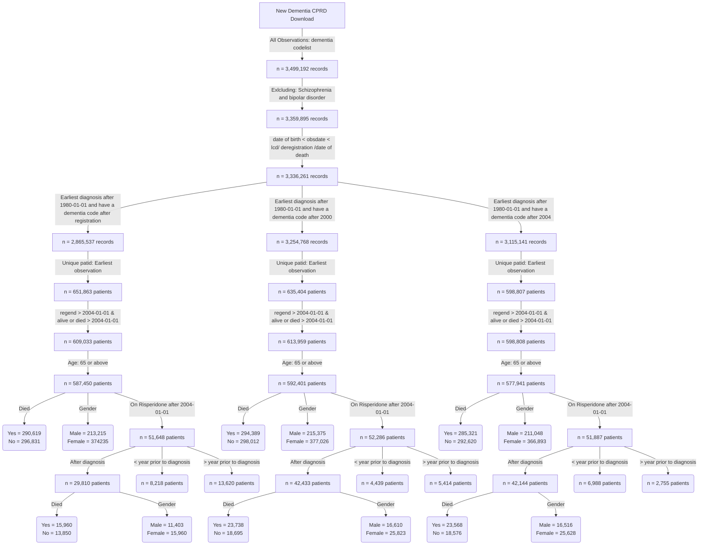

**Flow chart of the final cohorts**


**Dementia incident cohort**


```
                                             Overall       
  n                                           445332        
  diagnosedbeforeRegistration = 1 (%)         351487 (78.9) 
  gender = 2 (%)                              282903 (63.5) 
  died = 1 (%)                                223185 (50.1) 
  death_composite = 1 (%)                     325118 (73.0) 
  ONS_died = 1 (%)                            291514 (65.5) 
  age_diagnosis (mean (SD))                    82.35 (7.02) 
  age_category (%)                                          
     65 - 74                                   64311 (14.4) 
     75 - 84                                  202073 (45.4) 
     85 - 94                                  164303 (36.9) 
     95+                                       14645 ( 3.3) 
  year_of_diagnosis (%)                                     
     2004                                      20451 ( 4.6) 
     2005                                      17420 ( 3.9) 
     2006                                      19704 ( 4.4) 
     2007                                      17414 ( 3.9) 
     2008                                      17994 ( 4.0) 
     2009                                      19944 ( 4.5) 
     2010                                      21457 ( 4.8) 
     2011                                      22687 ( 5.1) 
     2012                                      25236 ( 5.7) 
     2013                                      27306 ( 6.1) 
     2014                                      29971 ( 6.7) 
     2015                                      29769 ( 6.7) 
     2016                                      26703 ( 6.0) 
     2017                                      26488 ( 5.9) 
     2018                                      25311 ( 5.7) 
     2019                                      24734 ( 5.6) 
     2020                                      19551 ( 4.4) 
     2021                                      20462 ( 4.6) 
     2022                                      19017 ( 4.3) 
     2023                                      13713 ( 3.1) 
  gender_decode = M (%)                       162429 (36.5) 
  GP_stroke = 1 (%)                            70378 (15.8) 
  HES_stroke = 1 (%)                           56416 (12.7) 
  HES_stroke = 1 (%)                           56416 (12.7) 
  stroke_composite = 1 (%)                     86268 (19.4) 
  primary_death_stroke = 1 (%)                 14705 ( 3.3) 
  HES_stroke = 1 (%)                           56416 (12.7) 
  HES_stroke = 1 (%)                           56416 (12.7) 
  ethnicity (%)                                             
     Black                                      8388 ( 1.9) 
     Mixed                                      1491 ( 0.3) 
     Other                                      2606 ( 0.6) 
     South Asian                                8668 ( 1.9) 
     Unknown                                    9353 ( 2.1) 
     White                                    414826 (93.1) 
  pre_diagnoses_af = 1 (%)                     62304 (14.0) 
  post_diagnoses_af = 1 (%)                    28577 ( 6.4) 
  af_ever = 1 (%)                              92662 (20.8) 
  pre_diagnoses_angina = 1 (%)                 50115 (11.3) 
  post_diagnoses_angina = 1 (%)                 6096 ( 1.4) 
  angina_ever = 1 (%)                          56484 (12.7) 
  pre_diagnoses_anxiety_disorders = 1 (%)      67688 (15.2) 
  post_diagnoses_anxiety_disorders = 1 (%)     10556 ( 2.4) 
  anxiety_disorders_ever = 1 (%)               78961 (17.7) 
  pre_diagnoses_falls = 1 (%)                 112934 (25.4) 
  post_diagnoses_falls = 1 (%)                125063 (28.1) 
  falls_ever = 1 (%)                          240530 (54.0) 
  pre_diagnoses_fh_diabetes = 1 (%)            91133 (20.5) 
  post_diagnoses_fh_diabetes = 1 (%)            5686 ( 1.3) 
  fh_diabetes_ever = 1 (%)                     97025 (21.8) 
  heartfailure_ever = 1 (%)                    53881 (12.1) 
  pre_diagnoses_lowerlimbfracture = 1 (%)      54605 (12.3) 
  post_diagnoses_lowerlimbfracture = 1 (%)     32899 ( 7.4) 
  lowerlimbfracture_ever = 1 (%)               88292 (19.8) 
  pre_diagnoses_myocardialinfarction = 1 (%)   34853 ( 7.8) 
  post_diagnoses_myocardialinfarction = 1 (%)   6998 ( 1.6) 
  myocardialinfarction_ever = 1 (%)            42171 ( 9.5) 
  pre_diagnoses_qof_diabetes = 1 (%)           60791 (13.7) 
  post_diagnoses_qof_diabetes = 1 (%)          24661 ( 5.5) 
  qof_diabetes_ever = 1 (%)                    86481 (19.4) 
  pre_diagnoses_revasc = 1 (%)                 24090 ( 5.4) 
  post_diagnoses_revasc = 1 (%)                 1104 ( 0.2) 
  revasc_ever = 1 (%)                          25259 ( 5.7) 
  pre_diagnoses_stroke = 1 (%)                 48354 (10.9) 
  post_diagnoses_stroke = 1 (%)                20314 ( 4.6) 
  stroke_ever = 1 (%)                          70378 (15.8) 
  pre_diagnoses_tia = 1 (%)                    38225 ( 8.6) 
  post_diagnoses_tia = 1 (%)                   12286 ( 2.8) 
  tia_ever = 1 (%)                             51115 (11.5) 
  alcohol_cat (%)                                           
     Excess                                    23239 ( 5.2) 
     Harmful                                   11657 ( 2.6) 
     None                                      41673 ( 9.4) 
     Unknown                                  118172 (26.5) 
     Within limits                            250591 (56.3) 
  smoking_cat (%)                                           
     Active smoker                             35954 ( 8.1) 
     Ex-smoker                                185210 (41.6) 
     Non-smoker                               142187 (31.9) 
     Unknown                                   81981 (18.4) 
  qrisk2_smoking_cat (%)                                    
     0                                        191562 (43.0) 
     1                                        116583 (26.2) 
     2                                         34441 ( 7.7) 
     3                                          1163 ( 0.3) 
     4                                           876 ( 0.2) 
     Unknown                                  100707 (22.6) 
  qrisk2_smoking_cat_uncoded (%)                            
     Ex-smoker                                116583 (26.2) 
     Heavy smoker                                876 ( 0.2) 
     Light smoker                              34441 ( 7.7) 
     Moderate smoker                            1163 ( 0.3) 
     Non-smoker                               191562 (43.0) 
     Unknown                                  100707 (22.6) 
  gp_qrisk2_ethnicity (%)                                   
     Bangladeshi                                 716 ( 0.2) 
     Black African                              1358 ( 0.3) 
     Black Caribbean                            5553 ( 1.2) 
     Chinese                                     449 ( 0.1) 
     Indian                                     4048 ( 0.9) 
     Other                                      3587 ( 0.8) 
     Other Asian                                1575 ( 0.4) 
     Pakistani                                  1651 ( 0.4) 
     Unknown                                  112463 (25.3) 
     White                                    313932 (70.5) 
  hes_qrisk2_ethnicity (%)                                  
     Bangladeshi                                 616 ( 0.1) 
     Black African                              1304 ( 0.3) 
     Black Caribbean                            5520 ( 1.2) 
     Chinese                                     514 ( 0.1) 
     Indian                                     3784 ( 0.8) 
     Other                                      4954 ( 1.1) 
     Other Asian                                1600 ( 0.4) 
     Pakistani                                  1516 ( 0.3) 
     Unknown                                   32537 ( 7.3) 
     White                                    392987 (88.2) 
  gp_5cat_ethnicity (%)                                     
     Black                                      7622 ( 1.7) 
     Mixed                                      1302 ( 0.3) 
     Other                                      2023 ( 0.5) 
     South Asian                                8064 ( 1.8) 
     Unknown                                  112373 (25.2) 
     White                                    313948 (70.5) 
  hes_5cat_ethnicity (%)                                    
     Black                                      7829 ( 1.8) 
     Mixed                                      1031 ( 0.2) 
     Other                                      3432 ( 0.8) 
     South Asian                                7516 ( 1.7) 
     Unknown                                   32537 ( 7.3) 
     White                                    392987 (88.2) 
  gp_16cat_ethnicity (%)                                    
     African                                    1371 ( 0.3) 
     Bangladeshi                                 716 ( 0.2) 
     Caribbean                                  5581 ( 1.3) 
     Chinese                                     451 ( 0.1) 
     Indian                                     4052 ( 0.9) 
     Other                                      1590 ( 0.4) 
     Other Asian                                1585 ( 0.4) 
     Other Black                                 598 ( 0.1) 
     Other Mixed                                 341 ( 0.1) 
     Other White                                9380 ( 2.1) 
     Pakistani                                  1652 ( 0.4) 
     Unknown                                  112728 (25.3) 
     White and Asian                             165 ( 0.0) 
     White and Black African                     200 ( 0.0) 
     White and Black Caribbean                   612 ( 0.1) 
     White British                            299235 (67.2) 
     White Irish                                5075 ( 1.1) 
  hes_16cat_ethnicity (%)                                   
     African                                    1304 ( 0.3) 
     Bangladeshi                                 616 ( 0.1) 
     Caribbean                                  5520 ( 1.2) 
     Chinese                                     514 ( 0.1) 
     Indian                                     3784 ( 0.8) 
     Other                                      2918 ( 0.7) 
     Other Asian                                1600 ( 0.4) 
     Other Black                                1005 ( 0.2) 
     Other Mixed                                1031 ( 0.2) 
     Pakistani                                  1516 ( 0.3) 
     Unknown                                   32537 ( 7.3) 
     White British                            392987 (88.2) 
  pre_diagnoses_deep_vein_thrombosis = 1 (%)   20090 ( 4.5) 
  post_diagnoses_deep_vein_thrombosis = 1 (%)   8514 ( 1.9) 
  deep_vein_thrombosis_ever = 1 (%)            28825 ( 6.5) 
  pre_diagnoses_pulmonary_embolism = 1 (%)     10503 ( 2.4) 
  post_diagnoses_pulmonary_embolism = 1 (%)     4461 ( 1.0) 
  pulmonary_embolism_ever = 1 (%)              15125 ( 3.4) 
  VTE = 1 (%)                                  40338 ( 9.1) 
  Prescribed_3_months_before_obsdate = 1 (%)   88570 (19.9) 
  drug_name_3_months_before (%)                             
     amisulpride                                3714 ( 4.2) 
     aripiprazole                               1447 ( 1.6) 
     benperidol                                  120 ( 0.1) 
     chlorpromazine                              893 ( 1.0) 
     clozapine                                    16 ( 0.0) 
     flupentixol                                 300 ( 0.3) 
     fluphenazine                                 14 ( 0.0) 
     haloperidol                               20194 (22.8) 
     levomepromazine                           16302 (18.4) 
     lurasidone                                    2 ( 0.0) 
     olanzapine                                 5305 ( 6.0) 
     paliperidone                                  1 ( 0.0) 
     pericyazine                                 127 ( 0.1) 
     perphenazine                                 34 ( 0.0) 
     pimozide                                    988 ( 1.1) 
     prochlorperazine                          16259 (18.4) 
     promazine                                  4246 ( 4.8) 
     quetiapine                                17203 (19.4) 
     sulpiride                                   661 ( 0.7) 
     thioridazine                                 11 ( 0.0) 
     trifluoperazine                             639 ( 0.7) 
     zuclopenthixol                               94 ( 0.1) 
  Prescribed_6_months_before_obsdate = 1 (%)   91977 (20.7) 
  drug_name_6_months_before (%)                             
     amisulpride                                4000 ( 3.9) 
     aripiprazole                               1549 ( 1.5) 
     benperidol                                  126 ( 0.1) 
     chlorpromazine                             1095 ( 1.1) 
     clozapine                                    20 ( 0.0) 
     flupentixol                                 470 ( 0.5) 
     fluphenazine                                 21 ( 0.0) 
     haloperidol                               21135 (20.4) 
     levomepromazine                           16407 (15.8) 
     lurasidone                                    2 ( 0.0) 
     olanzapine                                 6522 ( 6.3) 
     paliperidone                                  1 ( 0.0) 
     pericyazine                                 149 ( 0.1) 
     perphenazine                                 46 ( 0.0) 
     pimozide                                   1825 ( 1.8) 
     prochlorperazine                          25309 (24.4) 
     promazine                                  4677 ( 4.5) 
     quetiapine                                18618 (18.0) 
     sulpiride                                   763 ( 0.7) 
     thioridazine                                 23 ( 0.0) 
     trifluoperazine                             803 ( 0.8) 
     zuclopenthixol                              101 ( 0.1) 
  Prescribed_12_months_before_obsdate = 1 (%)  97193 (21.8) 
  drug_name_12_months_before (%)                            
     amisulpride                                3903 ( 4.0) 
     aripiprazole                               1525 ( 1.6) 
     benperidol                                  125 ( 0.1) 
     chlorpromazine                             1033 ( 1.1) 
     clozapine                                    18 ( 0.0) 
     flupentixol                                 379 ( 0.4) 
     fluphenazine                                 17 ( 0.0) 
     haloperidol                               21041 (21.6) 
     levomepromazine                           16428 (16.9) 
     lurasidone                                    2 ( 0.0) 
     olanzapine                                 5884 ( 6.1) 
     paliperidone                                  1 ( 0.0) 
     pericyazine                                 145 ( 0.1) 
     perphenazine                                 43 ( 0.0) 
     pimozide                                   1192 ( 1.2) 
     prochlorperazine                          21088 (21.7) 
     promazine                                  4576 ( 4.7) 
     quetiapine                                18208 (18.7) 
     sulpiride                                   723 ( 0.7) 
     thioridazine                                 16 ( 0.0) 
     trifluoperazine                             748 ( 0.8) 
     zuclopenthixol                               98 ( 0.1) 
  Prescribed_after_obsdate = 1 (%)             81852 (18.4) 
  drug_name_after_obsdate (%)                               
     amisulpride                                3371 ( 4.1) 
     aripiprazole                               1347 ( 1.6) 
     benperidol                                  110 ( 0.1) 
     chlorpromazine                              752 ( 0.9) 
     clozapine                                    13 ( 0.0) 
     flupentixol                                 249 ( 0.3) 
     fluphenazine                                 12 ( 0.0) 
     haloperidol                               18898 (23.1) 
     levomepromazine                           16020 (19.6) 
     lurasidone                                    2 ( 0.0) 
     olanzapine                                 4776 ( 5.8) 
     paliperidone                                  1 ( 0.0) 
     pericyazine                                 111 ( 0.1) 
     perphenazine                                 28 ( 0.0) 
     pimozide                                    907 ( 1.1) 
     prochlorperazine                          14486 (17.7) 
     promazine                                  3776 ( 4.6) 
     quetiapine                                15757 (19.3) 
     sulpiride                                   590 ( 0.7) 
     thioridazine                                  8 ( 0.0) 
     trifluoperazine                             557 ( 0.7) 
     zuclopenthixol                               81 ( 0.1)
```


```
        0      1
  0 120214 101933
  1  33604 189581
```


```
        0      1
  0 359064  15890
  1  29852  40526

```


```
              Black  Mixed  Other South Asian Unknown  White
  Black         6025    248    256         108     562    423
  Mixed          537     93    123         102     113    334
  Other           48     34    528         155     210   1048
  South Asian    113     99    491        6331     661    369
  Unknown        766    189    583         604    9353 100878
  White          340    368   1451         216   21638 289935
```


```
           strata   median    lower    upper
1 gender_decode=F 3.400411 3.383984 3.419576
2 gender_decode=M 2.956879 2.937714 2.978782
```


```
                strata   median    lower    upper
1 age_category=65 - 74 5.448323 5.388090 5.505818
2 age_category=75 - 84 3.780972 3.759069 3.802875
3 age_category=85 - 94 2.299795 2.283368 2.316222
4 age_category=95+ 1.237509 1.199179 1.275838
```

**Risperidone incident cohort**
```
                                                             Overall       
  n                                                        30060        
  diagnosedbeforeRegistration = 1 (%)                      17005 (56.6) 
  died = 1 (%)                                             17390 (57.9) 
  death_composite = 1 (%)                                  23726 (78.9) 
  ONS_died = 1 (%)                                         20695 (68.8) 
  age_diagnosis (mean (SD))                                80.44 (7.13) 
  age_risperidone (mean (SD))                              82.99 (6.87) 
  deprivation (%)                                                       
     1                                                      6726 (22.4) 
     2                                                      7388 (24.6) 
     3                                                      6070 (20.2) 
     4                                                      5181 (17.3) 
     5                                                      4657 (15.5) 
  gender_decode = M (%)                                    11635 (38.7) 
  GP_stroke = 1 (%)                                         4214 (14.0) 
  HES_stroke = 1 (%)                                        3204 (10.7) 
  stroke_composite = 1 (%)                                  5161 (17.2) 
  primary_death_stroke = 1 (%)                               785 ( 2.6) 
  Composite_pre_stroke = 1 (%)                              4237 (14.1) 
  Composite_post_stroke = 1 (%)                             1695 ( 5.6) 
  comorbidity_stroke = 1 (%)                                4214 (14.0) 
  pre_index_date_stroke = 1 (%)                             3609 (12.0) 
  post_index_date_stroke = 1 (%)                            1061 ( 3.5) 
  Stroke_prior_to_risperidone = 1 (%)                       4237 (14.1) 
  Stroke__within_year_after_1st_risperidone_presc = 1 (%)   1094 ( 3.6) 
  death_in_a_year_after_risperidone = 1 (%)                 8585 (28.6) 
  sex = 1 (%)                                              11635 (38.7) 
  ethnicity (%)                                                         
     Black                                                   504 ( 1.7) 
     Mixed                                                   107 ( 0.4) 
     Other                                                   171 ( 0.6) 
     South Asian                                             490 ( 1.6) 
     Unknown                                                 512 ( 1.7) 
     White                                                 28276 (94.1) 
  age_category (%)                                                      
     65 - 74                                                6544 (21.8) 
     75 - 84                                               14552 (48.4) 
     85+                                                    8964 (29.8) 
  year_of_diagnosis (%)                                                 
     2004                                                   1192 ( 4.0) 
     2005                                                   1008 ( 3.4) 
     2006                                                   1068 ( 3.6) 
     2007                                                   1063 ( 3.5) 
     2008                                                   1191 ( 4.0) 
     2009                                                   1532 ( 5.1) 
     2010                                                   1922 ( 6.4) 
     2011                                                   2071 ( 6.9) 
     2012                                                   2258 ( 7.5) 
     2013                                                   2462 ( 8.2) 
     2014                                                   2540 ( 8.4) 
     2015                                                   2284 ( 7.6) 
     2016                                                   2048 ( 6.8) 
     2017                                                   1986 ( 6.6) 
     2018                                                   1709 ( 5.7) 
     2019                                                   1412 ( 4.7) 
     2020                                                   1089 ( 3.6) 
     2021                                                    678 ( 2.3) 
     2022                                                    436 ( 1.5) 
     2023                                                    111 ( 0.4) 
  year_of_prescription (%)                                              
     2004                                                    661 ( 2.2) 
     2005                                                    444 ( 1.5) 
     2006                                                    567 ( 1.9) 
     2007                                                    628 ( 2.1) 
     2008                                                    510 ( 1.7) 
     2009                                                    613 ( 2.0) 
     2010                                                   1163 ( 3.9) 
     2011                                                   1417 ( 4.7) 
     2012                                                   1632 ( 5.4) 
     2013                                                   1910 ( 6.4) 
     2014                                                   2201 ( 7.3) 
     2015                                                   2452 ( 8.2) 
     2016                                                   2549 ( 8.5) 
     2017                                                   2583 ( 8.6) 
     2018                                                   2389 ( 7.9) 
     2019                                                   2326 ( 7.7) 
     2020                                                   2436 ( 8.1) 
     2021                                                   1598 ( 5.3) 
     2022                                                   1195 ( 4.0) 
     2023                                                    786 ( 2.6) 
  stroke_3_months_prior = 1 (%)                              155 ( 0.5) 
  stroke_6_months_prior = 1 (%)                              232 ( 0.8) 
  stroke_12_months_prior = 1 (%)                             368 ( 1.2) 
  prescribed_BMJ_antipsyc_drug = 1 (%)                     25732 (85.6) 
  stroke_recency_cat (%)                                                
      <= 1                                                   368 (10.2) 
      > 7                                                   3042 (84.3) 
     1 - 2                                                   146 ( 4.0) 
     2 - 3                                                    49 ( 1.4) 
     3 - 4                                                     4 ( 0.1) 
  dementia_duration_prior_risperidone (mean (SD))           2.11 (2.35) 
  Survival_time (mean (SD))                                 1.74 (1.90) 
  comorbidity_af = 1 (%)                                    5331 (17.7) 
  pre_index_date_af = 1 (%)                                 4765 (15.9) 
  post_index_date_af = 1 (%)                                1791 ( 6.0) 
  comorbidity_angina = 1 (%)                                3625 (12.1) 
  pre_index_date_angina = 1 (%)                             3536 (11.8) 
  post_index_date_angina = 1 (%)                             343 ( 1.1) 
  comorbidity_anxiety_disorders = 1 (%)                     6185 (20.6) 
  pre_index_date_anxiety_disorders = 1 (%)                  5937 (19.8) 
  post_index_date_anxiety_disorders = 1 (%)                  674 ( 2.2) 
  comorbidity_falls = 1 (%)                                16777 (55.8) 
  pre_index_date_falls = 1 (%)                             12080 (40.2) 
  post_index_date_falls = 1 (%)                             8833 (29.4) 
  comorbidity_fh_diabetes = 1 (%)                           6018 (20.0) 
  pre_index_date_fh_diabetes = 1 (%)                        5927 (19.7) 
  post_index_date_fh_diabetes = 1 (%)                        130 ( 0.4) 
  comorbidity_fh_premature_cvd = 1 (%)                      2311 ( 7.7) 
  pre_index_date_fh_premature_cvd = 1 (%)                   2279 ( 7.6) 
  post_index_date_fh_premature_cvd = 1 (%)                    46 ( 0.2) 
  comorbidity_heartfailure = 1 (%)                          2683 ( 8.9) 
  pre_index_date_heartfailure = 1 (%)                       2276 ( 7.6) 
  post_index_date_heartfailure = 1 (%)                       906 ( 3.0) 
  comorbidity_lowerlimbfracture = 1 (%)                     6301 (21.0) 
  pre_index_date_lowerlimbfracture = 1 (%)                  4757 (15.8) 
  post_index_date_lowerlimbfracture = 1 (%)                 1943 ( 6.5) 
  comorbidity_myocardialinfarction = 1 (%)                  2602 ( 8.7) 
  pre_index_date_myocardialinfarction = 1 (%)               2450 ( 8.2) 
  post_index_date_myocardialinfarction = 1 (%)               279 ( 0.9) 
  comorbidity_qof_diabetes = 1 (%)                          5484 (18.2) 
  pre_index_date_qof_diabetes = 1 (%)                       5167 (17.2) 
  post_index_date_qof_diabetes = 1 (%)                      2386 ( 7.9) 
  comorbidity_revasc = 1 (%)                                1608 ( 5.3) 
  pre_index_date_revasc = 1 (%)                             1599 ( 5.3) 
  post_index_date_revasc = 1 (%)                              24 ( 0.1) 
  comorbidity_tia = 1 (%)                                   3250 (10.8) 
  pre_index_date_tia = 1 (%)                                2791 ( 9.3) 
  post_index_date_tia = 1 (%)                                701 ( 2.3) 
  comorbidity_deep_vein_thrombosis = 1 (%)                  1989 ( 6.6) 
  pre_index_date_deep_vein_thrombosis = 1 (%)               1528 ( 5.1) 
  post_index_date_deep_vein_thrombosis = 1 (%)               549 ( 1.8) 
  comorbidity_haem_cancer = 1 (%)                            665 ( 2.2) 
  pre_index_date_haem_cancer = 1 (%)                         573 ( 1.9) 
  post_index_date_haem_cancer = 1 (%)                        186 ( 0.6) 
  comorbidity_pulmonary_embolism = 1 (%)                     978 ( 3.3) 
  pre_index_date_pulmonary_embolism = 1 (%)                  752 ( 2.5) 
  post_index_date_pulmonary_embolism = 1 (%)                 271 ( 0.9) 
  comorbidity_solid_cancer = 1 (%)                          5148 (17.1) 
  pre_index_date_solid_cancer = 1 (%)                       4708 (15.7) 
  post_index_date_solid_cancer = 1 (%)                      1065 ( 3.5) 
  VTE = 1 (%)                                               2743 ( 9.1) 
  BMI (%)                                                               
     Normal                                                10802 (35.9) 
     Obesity                                                3879 (12.9) 
     Overweight                                             8591 (28.6) 
     Severely Obese                                          278 ( 0.9) 
     Underweight                                            1303 ( 4.3) 
     Unknown                                                5207 (17.3) 
  totalcholesterol (%)                                                  
     < 160 mg/dl                                            6657 (22.1) 
     > 280 mg/dl                                            1042 ( 3.5) 
     199 mg/dl                                              7480 (24.9) 
     200 - 239 mg/dl                                        6438 (21.4) 
     240 - 279 mg/dl                                        2810 ( 9.3) 
     Unknown                                                5633 (18.7) 
  testvalue_dbp (mean (SD))                                76.41 (11.77)
  testvalue_sbp (mean (SD))                               135.80 (20.25)
  testvalue_totalcholesterol (mean (SD))                    4.98 (1.24) 
  gp_5cat_ethnicity (%)                                                 
     Black                                                   444 ( 1.5) 
     Mixed                                                    90 ( 0.3) 
     Other                                                   147 ( 0.5) 
     South Asian                                             449 ( 1.5) 
     Unknown                                                7311 (24.3) 
     White                                                 21619 (71.9) 
  gp_16cat_ethnicity (%)                                                
     African                                                  75 ( 0.2) 
     Bangladeshi                                              33 ( 0.1) 
     Caribbean                                               321 ( 1.1) 
     Chinese                                                  21 ( 0.1) 
     Indian                                                  227 ( 0.8) 
     Other                                                   128 ( 0.4) 
     Other Asian                                              83 ( 0.3) 
     Other Black                                              47 ( 0.2) 
     Other Mixed                                              21 ( 0.1) 
     Other White                                             665 ( 2.2) 
     Pakistani                                               101 ( 0.3) 
     Unknown                                                7332 (24.4) 
     White and Asian                                          16 ( 0.1) 
     White and Black African                                  11 ( 0.0) 
     White and Black Caribbean                                40 ( 0.1) 
     White British                                         20623 (68.6) 
     White Irish                                             316 ( 1.1) 
  gp_qrisk2_ethnicity (%)                                               
     Bangladeshi                                              33 ( 0.1) 
     Black African                                            75 ( 0.2) 
     Black Caribbean                                         319 ( 1.1) 
     Chinese                                                  21 ( 0.1) 
     Indian                                                  227 ( 0.8) 
     Other                                                   265 ( 0.9) 
     Other Asian                                              82 ( 0.3) 
     Pakistani                                               101 ( 0.3) 
     Unknown                                                7318 (24.3) 
     White                                                 21619 (71.9) 
  alcohol_cat (%)                                                       
     Excess                                                 1467 ( 4.9) 
     Harmful                                                 818 ( 2.7) 
     None                                                   2220 ( 7.4) 
     Unknown                                               10576 (35.2) 
     Within limits                                         14979 (49.8) 
  smoking_cat (%)                                                       
     Active smoker                                          2069 ( 6.9) 
     Ex-smoker                                             11224 (37.3) 
     Non-smoker                                             8404 (28.0) 
     Unknown                                                8363 (27.8) 
  qrisk2_smoking_cat (%)                                                
     0                                                     11101 (36.9) 
     1                                                      7373 (24.5) 
     2                                                      2037 ( 6.8) 
     3                                                        75 ( 0.2) 
     4                                                        40 ( 0.1) 
     Unknown                                                9434 (31.4) 
  qrisk2_smoking_cat_uncoded (%)                                        
     Ex-smoker                                              7373 (24.5) 
     Heavy smoker                                             40 ( 0.1) 
     Light smoker                                           2037 ( 6.8) 
     Moderate smoker                                          75 ( 0.2) 
     Non-smoker                                            11101 (36.9) 
     Unknown                                                9434 (31.4) 
  drug_name (%)                                                         
     amisulpride                                             488 ( 3.2) 
     aripiprazole                                            198 ( 1.3) 
     benperidol                                               20 ( 0.1) 
     chlorpromazine                                          230 ( 1.5) 
     clozapine                                                 1 ( 0.0) 
     flupentixol                                             165 ( 1.1) 
     fluphenazine                                             12 ( 0.1) 
     haloperidol                                            2714 (17.8) 
     levomepromazine                                        1697 (11.1) 
     olanzapine                                             1106 ( 7.2) 
     pericyazine                                              31 ( 0.2) 
     perphenazine                                             11 ( 0.1) 
     pimozide                                                128 ( 0.8) 
     prochlorperazine                                       6004 (39.3) 
     promazine                                               517 ( 3.4) 
     quetiapine                                             1798 (11.8) 
     sulpiride                                                38 ( 0.2) 
     thioridazine                                             34 ( 0.2) 
     trifluoperazine                                          78 ( 0.5) 
     zuclopenthixol                                           14 ( 0.1) 
  frailty (%)                                                           
     Mild                                                   1358 ( 4.5) 
     Moderate                                               3435 (11.4) 
     Severe                                                 5376 (17.9) 
     Unknown                                               19891 (66.2) 
  year_diagnosis_cat (%)                                                
     > 2020                                                 1225 ( 4.1) 
     2004 - 2008                                            5522 (18.4) 
     2009 - 2012                                            7783 (25.9) 
     2013 - 2016                                            9334 (31.1) 
     2017 - 2020                                            6196 (20.6) 
  prescribed_other_antipsyc_drug = 1 (%)                   15284 (50.8) 
  pre_indexdate_antipysch_prescr = 1 (%)                   10105 (66.1) 
  post_indexdate_antipysch_prescr = 1 (%)                   5088 (33.3) 
  same_indexdate_antipysch_prescr = 1 (%)                     91 ( 0.6) 
  pre_indexdate_drug_name (%)                                           
     amisulpride                                             184 ( 1.8) 
     aripiprazole                                             76 ( 0.8) 
     benperidol                                                7 ( 0.1) 
     chlorpromazine                                          123 ( 1.2) 
     clozapine                                                 1 ( 0.0) 
     flupentixol                                             196 ( 1.9) 
     fluphenazine                                             11 ( 0.1) 
     haloperidol                                             915 ( 9.1) 
     levomepromazine                                          91 ( 0.9) 
     olanzapine                                              584 ( 5.8) 
     pericyazine                                              19 ( 0.2) 
     perphenazine                                              7 ( 0.1) 
     pimozide                                                118 ( 1.2) 
     prochlorperazine                                       6005 (59.4) 
     promazine                                               316 ( 3.1) 
     quetiapine                                             1179 (11.7) 
     sulpiride                                                42 ( 0.4) 
     thioridazine                                            105 ( 1.0) 
     trifluoperazine                                         119 ( 1.2) 
     zuclopenthixol                                            7 ( 0.1) 
  same_indexdate_drug_name (%)                                          
     amisulpride                                               2 ( 2.2) 
     aripiprazole                                              8 ( 8.8) 
     chlorpromazine                                            5 ( 5.5) 
     flupentixol                                               2 ( 2.2) 
     haloperidol                                              21 (23.1) 
     levomepromazine                                           1 ( 1.1) 
     olanzapine                                                3 ( 3.3) 
     pimozide                                                  8 ( 8.8) 
     prochlorperazine                                          6 ( 6.6) 
     promazine                                                15 (16.5) 
     quetiapine                                               17 (18.7) 
     trifluoperazine                                           3 ( 3.3) 
  post_indexdate_drug_name (%)                                          
     amisulpride                                             118 ( 2.3) 
     aripiprazole                                            174 ( 3.4) 
     benperidol                                                3 ( 0.1) 
     chlorpromazine                                           30 ( 0.6) 
     flupentixol                                              12 ( 0.2) 
     haloperidol                                            1422 (27.9) 
     levomepromazine                                        1562 (30.7) 
     olanzapine                                              460 ( 9.0) 
     pericyazine                                               5 ( 0.1) 
     pimozide                                                 35 ( 0.7) 
     prochlorperazine                                        327 ( 6.4) 
     promazine                                               136 ( 2.7) 
     quetiapine                                              762 (15.0) 
     sulpiride                                                16 ( 0.3) 
     trifluoperazine                                          20 ( 0.4) 
     zuclopenthixol                                            6 ( 0.1) 
  care_home = 1 (%)                                        12371 (41.2) 
  care_home_before_indexdate = 1 (%)                        3977 (32.1) 
  care_home_at_indexdate = 1 (%)                             127 ( 1.0) 
  care_home_90_days_after_indexdate = 1 (%)                 2683 (21.7) 
  TimeSinceFirstPrescription (mean (SD))                    0.49 (0.93) 
  Prescription_ever_cat (%)                                             
     >100                                                    555 ( 1.8) 
     1                                                      5163 (17.2) 
     10                                                      781 ( 2.6) 
     11 - 20                                                5103 (17.0) 
     2                                                      2655 ( 8.8) 
     21 - 30                                                2757 ( 9.2) 
     3                                                      1930 ( 6.4) 
     31 - 40                                                1618 ( 5.4) 
     4                                                      1582 ( 5.3) 
     41 - 50                                                1002 ( 3.3) 
     5                                                      1303 ( 4.3) 
     51 - 100                                               1653 ( 5.5) 
     6                                                      1111 ( 3.7) 
     7                                                      1051 ( 3.5) 
     8                                                       926 ( 3.1) 
     9                                                       870 ( 2.9) 
  Prescriptions_after_a_year_cat (%)                                    
     >100                                                    301 ( 3.0) 
     1                                                       699 ( 7.0) 
     10                                                      288 ( 2.9) 
     11 - 20                                                2119 (21.3) 
     2                                                       610 ( 6.1) 
     21 - 30                                                1193 (12.0) 
     3                                                       520 ( 5.2) 
     31 - 40                                                 759 ( 7.6) 
     4                                                       455 ( 4.6) 
     41 - 50                                                 469 ( 4.7) 
     5                                                       413 ( 4.2) 
     51 - 100                                                723 ( 7.3) 
     6                                                       372 ( 3.7) 
     7                                                       373 ( 3.8) 
     8                                                       328 ( 3.3) 
     9                                                       311 ( 3.1) 
  Prescriptions_within_a_year_cat (%)                                   
     >100                                                     16 ( 0.1) 
     1                                                      5382 (17.9) 
     10                                                      953 ( 3.2) 
     11 - 20                                                9427 (31.4) 
     2                                                      2739 ( 9.1) 
     21 - 30                                                 850 ( 2.8) 
     3                                                      2004 ( 6.7) 
     31 - 40                                                 310 ( 1.0) 
     4                                                      1651 ( 5.5) 
     41 - 50                                                 298 ( 1.0) 
     5                                                      1392 ( 4.6) 
     51 - 100                                                517 ( 1.7) 
     6                                                      1232 ( 4.1) 
     7                                                      1224 ( 4.1) 
     8                                                      1064 ( 3.5) 
     9                                                      1001 ( 3.3) 
  consultation_counts_Cat (%)                                           
     0 - 50                                                10847 (36.7) 
     101 - 150                                              5102 (17.2) 
     151 - 200                                              1936 ( 6.5) 
     201 - 250                                               732 ( 2.5) 
     251 - 300                                               302 ( 1.0) 
     301 - 350                                               123 ( 0.4) 
     351 - 400                                                50 ( 0.2) 
     401 - 450                                                34 ( 0.1) 
     451 - 500                                                28 ( 0.1) 
     501 - 800                                                30 ( 0.1) 
     51 - 100                                              10391 (35.1) 
     801 - 1000                                                3 ( 0.0) 
  pre_BMJ_indexdate_drug_name (%)                                       
     amisulpride                                             169 ( 8.7) 
     aripiprazole                                             15 ( 0.8) 
     benperidol                                                7 ( 0.4) 
     chlorpromazine                                          122 ( 6.3) 
     clozapine                                                 1 ( 0.1) 
     flupentixol                                             122 ( 6.3) 
     fluphenazine                                             10 ( 0.5) 
     haloperidol                                             852 (43.7) 
     levomepromazine                                          10 ( 0.5) 
     olanzapine                                               49 ( 2.5) 
     pericyazine                                              19 ( 1.0) 
     perphenazine                                              2 ( 0.1) 
     pimozide                                                  5 ( 0.3) 
     prochlorperazine                                        368 (18.9) 
     promazine                                                46 ( 2.4) 
     quetiapine                                               67 ( 3.4) 
     sulpiride                                                16 ( 0.8) 
     thioridazine                                             33 ( 1.7) 
     trifluoperazine                                          34 ( 1.7) 
     zuclopenthixol                                            2 ( 0.1) 
  same_BMJ_indexdate_drug_name (%)                                      
     amisulpride                                              93 ( 0.9) 
     aripiprazole                                            186 ( 1.8) 
     benperidol                                                3 ( 0.0) 
     chlorpromazine                                           30 ( 0.3) 
     flupentixol                                              64 ( 0.6) 
     fluphenazine                                              1 ( 0.0) 
     haloperidol                                            1187 (11.4) 
     levomepromazine                                        1289 (12.3) 
     olanzapine                                              770 ( 7.4) 
     pericyazine                                               5 ( 0.0) 
     perphenazine                                              5 ( 0.0) 
     pimozide                                                128 ( 1.2) 
     prochlorperazine                                       4808 (46.0) 
     promazine                                               309 ( 3.0) 
     quetiapine                                             1400 (13.4) 
     sulpiride                                                29 ( 0.3) 
     thioridazine                                             59 ( 0.6) 
     trifluoperazine                                          75 ( 0.7) 
     zuclopenthixol                                            6 ( 0.1) 
  post_BMJ_indexdate_drug_name (%)                                      
     amisulpride                                              34 ( 3.8) 
     aripiprazole                                             28 ( 3.1) 
     chlorpromazine                                            5 ( 0.6) 
     flupentixol                                               9 ( 1.0) 
     haloperidol                                             150 (16.8) 
     levomepromazine                                          89 (10.0) 
     olanzapine                                               66 ( 7.4) 
     pimozide                                                  7 ( 0.8) 
     prochlorperazine                                        320 (35.9) 
     promazine                                                26 ( 2.9) 
     quetiapine                                              135 (15.2) 
     sulpiride                                                 5 ( 0.6) 
     thioridazine                                              2 ( 0.2) 
     trifluoperazine                                          12 ( 1.3) 
     zuclopenthixol                                            3 ( 0.3) 
  comorbidity_hypertension (%)                                          
     Elevated                                               3327 (11.1) 
     Normal                                                 4156 (13.8) 
     Stage 1                                               13285 (44.2) 
     Stage 2                                                8633 (28.7) 
     Stage 3 (severe)                                        191 ( 0.6) 
     Unknown                                                 468 ( 1.6) 
  pre_index_date_hypertension = 1 (%)                      24666 (83.3) 
  comorbidity_hearing_loss = 1 (%)                          8411 (28.0) 
  pre_index_date_hearing_loss = 1 (%)                       7900 (26.3) 
  post_index_date_hearing_loss = 1 (%)                      1127 ( 3.7) 
  pre_indexdate_BMJ_antipysch_prescr = 1 (%)                1961 ( 7.6) 
  post_indexdate_BMJ_antipysch_prescr = 1 (%)               1756 ( 6.8) 
  same_indexdate_BMJ_antipysch_prescr = 1 (%)              22015 (85.6) 
  HES_comorbidity_stroke = 1 (%)                            3204 (10.7) 
  HES_pre_index_date_stroke = 1 (%)                         2568 ( 8.5) 
  HES_post_index_date_stroke = 1 (%)                         964 ( 3.2) 
  hes_5cat_ethnicity (%)                                                
     Black                                                   474 ( 1.6) 
     Mixed                                                    70 ( 0.2) 
     Other                                                   189 ( 0.6) 
     South Asian                                             440 ( 1.5) 
     Unknown                                                2169 ( 7.2) 
     White                                                 26718 (88.9) 
  hes_16cat_ethnicity (%)                                               
     African                                                  78 ( 0.3) 
     Bangladeshi                                              30 ( 0.1) 
     Caribbean                                               341 ( 1.1) 
     Chinese                                                  20 ( 0.1) 
     Indian                                                  202 ( 0.7) 
     Other                                                   169 ( 0.6) 
     Other Asian                                             106 ( 0.4) 
     Other Black                                              55 ( 0.2) 
     Other Mixed                                              70 ( 0.2) 
     Pakistani                                               102 ( 0.3) 
     Unknown                                                2169 ( 7.2) 
     White British                                         26718 (88.9) 
  hes_qrisk2_ethnicity (%)                                              
     Bangladeshi                                              30 ( 0.1) 
     Black African                                            78 ( 0.3) 
     Black Caribbean                                         341 ( 1.1) 
     Chinese                                                  20 ( 0.1) 
     Indian                                                  202 ( 0.7) 
     Other                                                   294 ( 1.0) 
     Other Asian                                             106 ( 0.4) 
     Pakistani                                               102 ( 0.3) 
     Unknown                                                2169 ( 7.2) 
     White                                                 26718 (88.9)                                                     

```


```
           strata   median    lower    upper
1 gender_decode=F 4.654346 4.591376 4.717317
2 gender_decode=M 4.101300 4.035592 4.175222
```


```
                strata   median    lower    upper
1 age_category=65 - 74 6.308008 6.179329 6.461328
2 age_category=75 - 84 4.692676 4.624230 4.761123
3     age_category=85+ 3.063655 2.997947 3.126626

```


**COX model**
```
Call:
coxph(formula = Surv(Survival_time, Composite_post_stroke) ~ 
    age_diagnosis + Composite_pre_stroke + sex, data = CompleteData)

  n= 30060, number of events= 1695 

                          coef exp(coef) se(coef)      z Pr(>|z|)    
age_diagnosis         0.006682  1.006704 0.003562  1.876   0.0607 .  
Composite_pre_stroke1 1.825286  6.204567 0.049282 37.038   <2e-16 ***
sex1                  0.119763  1.127229 0.051070  2.345   0.0190 *  
---
Signif. codes:  0 ‘***’ 0.001 ‘**’ 0.01 ‘*’ 0.05 ‘.’ 0.1 ‘ ’ 1

                      exp(coef) exp(-coef) lower .95 upper .95
age_diagnosis             1.007     0.9933    0.9997     1.014
Composite_pre_stroke1     6.205     0.1612    5.6333     6.834
sex1                      1.127     0.8871    1.0199     1.246

Concordance= 0.713  (se = 0.008 )
Likelihood ratio test= 1204  on 3 df,   p=<2e-16
Wald test            = 1419  on 3 df,   p=<2e-16
Score (logrank) test = 1860  on 3 df,   p=<2e-16


```


**One year censoring**


```
Call:
coxph(formula = Surv(Survival_time, Composite_post_stroke) ~ 
    age_diagnosis + Composite_pre_stroke + sex, data = CensoringData_1year)

  n= 30040, number of events= 1037 
   (20 observations deleted due to missingness)

                          coef exp(coef) se(coef)      z Pr(>|z|)    
age_diagnosis         0.003332  1.003337 0.004501  0.740   0.4592    
Composite_pre_stroke1 2.076755  7.978539 0.062823 33.057   <2e-16 ***
sex1                  0.124871  1.133003 0.064246  1.944   0.0519 .  
---
Signif. codes:  0 ‘***’ 0.001 ‘**’ 0.01 ‘*’ 0.05 ‘.’ 0.1 ‘ ’ 1

                      exp(coef) exp(-coef) lower .95 upper .95
age_diagnosis             1.003     0.9967    0.9945     1.012
Composite_pre_stroke1     7.979     0.1253    7.0542     9.024
sex1                      1.133     0.8826    0.9990     1.285

Concordance= 0.726  (se = 0.009 )
Likelihood ratio test= 1019  on 3 df,   p=<2e-16
Wald test            = 1126  on 3 df,   p=<2e-16
Score (logrank) test = 1597  on 3 df,   p=<2e-16
```

**Excluding stroke 3 months prior**


```
Call:
coxph(formula = Surv(Survival_time, Composite_post_stroke) ~ 
    age_diagnosis + Composite_pre_stroke + sex, data = Excluding_3_monthsPriorStroke)

  n= 29905, number of events= 1615 

                          coef exp(coef) se(coef)      z Pr(>|z|)    
age_diagnosis         0.007775  1.007806 0.003646  2.133   0.0330 *  
Composite_pre_stroke1 1.743310  5.716231 0.050815 34.307   <2e-16 ***
sex1                  0.121428  1.129108 0.052390  2.318   0.0205 *  
---
Signif. codes:  0 ‘***’ 0.001 ‘**’ 0.01 ‘*’ 0.05 ‘.’ 0.1 ‘ ’ 1

                      exp(coef) exp(-coef) lower .95 upper .95
age_diagnosis             1.008     0.9923     1.001     1.015
Composite_pre_stroke1     5.716     0.1749     5.174     6.315
sex1                      1.129     0.8857     1.019     1.251

Concordance= 0.701  (se = 0.008 )
Likelihood ratio test= 1023  on 3 df,   p=<2e-16
Wald test            = 1223  on 3 df,   p=<2e-16
Score (logrank) test = 1566  on 3 df,   p=<2e-16

```


**Excluding stroke 12 months prior**


```
Call:
coxph(formula = Surv(Survival_time, Composite_post_stroke) ~ 
    age_diagnosis + Composite_pre_stroke + sex, data = Excluding_12_monthsPriorStroke)

  n= 29692, number of events= 1546 

                          coef exp(coef) se(coef)      z Pr(>|z|)    
age_diagnosis         0.008703  1.008741 0.003734  2.331   0.0198 *  
Composite_pre_stroke1 1.679211  5.361324 0.052382 32.057   <2e-16 ***
sex1                  0.136316  1.146044 0.053538  2.546   0.0109 *  
---
Signif. codes:  0 ‘***’ 0.001 ‘**’ 0.01 ‘*’ 0.05 ‘.’ 0.1 ‘ ’ 1

                      exp(coef) exp(-coef) lower .95 upper .95
age_diagnosis             1.009     0.9913     1.001     1.016
Composite_pre_stroke1     5.361     0.1865     4.838     5.941
sex1                      1.146     0.8726     1.032     1.273

Concordance= 0.689  (se = 0.008 )
Likelihood ratio test= 886  on 3 df,   p=<2e-16
Wald test            = 1073  on 3 df,   p=<2e-16
Score (logrank) test = 1352  on 3 df,   p=<2e-16

```


**Matching**

***Updated Algorithm - exact match on: Sex, stroke history, cvd and risperidone age category (65-74, 75-84, 85+)***

```
                                                        Stratified by risperidone
                                                          0              1              p      test SMD   
  n                                                       137031         28464                            
  sex = 1 (%)                                              51780 (37.8)  10847 ( 38.1)   0.313       0.007
  risperidone = 1 (%)                                          0 ( 0.0)  28464 (100.0)  <0.001         NaN
  age_risperidone (mean (SD))                              83.18 (6.82)  83.12 (6.83)    0.136       0.010
  age_diagnosis (mean (SD))                                80.49 (6.90)  80.51 (7.10)    0.670       0.003
  age_risperidone_cat (%)                                                                0.163       0.012
     65 - 74                                               15313 (11.2)   3290 ( 11.6)                    
     75 - 84                                               61837 (45.1)  12823 ( 45.0)                    
     85+                                                   59881 (43.7)  12351 ( 43.4)                    
  care_home_before_indexdate = 1 (%)                       17946 (13.1)   3734 ( 13.1)   0.928       0.001
  deprivation (%)                                                                        0.895       0.008
     1                                                     30555 (22.3)   6379 ( 22.4)                    
     2                                                     33591 (24.5)   6942 ( 24.4)                    
     3                                                     27469 (20.0)   5764 ( 20.3)                    
     4                                                     23854 (17.4)   4908 ( 17.2)                    
     5                                                     21450 (15.7)   4444 ( 15.6)                    
     Unknown                                                 112 ( 0.1)     27 (  0.1)                    
  Stroke__within_year_after_1st_risperidone_presc = 1 (%)   4671 ( 3.4)   1112 (  3.9)  <0.001       0.027
  stroke_composite_pre_index_date = 1 (%)                  17986 (13.1)   3880 ( 13.6)   0.022       0.015
  pre_index_date_angina = 1 (%)                            16201 (11.8)   3344 ( 11.7)   0.730       0.002
  pre_index_date_heartfailure = 1 (%)                      10524 ( 7.7)   2199 (  7.7)   0.802       0.002
  BMI (%)                                                                                0.065       0.021
     Missing                                               25440 (18.6)   5505 ( 19.3)                    
     Normal                                                53314 (38.9)  11024 ( 38.7)                    
     Obesity                                               14336 (10.5)   2973 ( 10.4)                    
     Overweight                                            35122 (25.6)   7175 ( 25.2)                    
     Severely Obese                                          916 ( 0.7)    189 (  0.7)                    
     Underweight                                            7903 ( 5.8)   1598 (  5.6)                    
  Prescribed_other_antipsychotic_Prior = 1 (%)             36951 (27.0)   7377 ( 25.9)  <0.001       0.024
  period_before_prescription (mean (SD))                    2.73 (2.19)   2.62 (2.40)   <0.001       0.051
  pre_index_date_myocardialinfarction = 1 (%)              11098 ( 8.1)   2316 (  8.1)   0.841       0.001
  pre_index_date_tia = 1 (%)                               12915 ( 9.4)   2641 (  9.3)   0.448       0.005
  pre_index_date_falls = 1 (%)                             57114 (41.7)  11748 ( 41.3)   0.208       0.008
  pre_index_date_lowerlimbfracture = 1 (%)                 21750 (15.9)   4536 ( 15.9)   0.796       0.002
  pre_index_date_ihd = 1 (%)                               22750 (16.6)   4717 ( 16.6)   0.908       0.001
  pre_index_date_pad = 1 (%)                               10688 ( 7.8)   2207 (  7.8)   0.801       0.002
  pre_index_date_af = 1 (%)                                21971 (16.0)   4560 ( 16.0)   0.962      <0.001
  pre_index_date_revasc = 1 (%)                             7317 ( 5.3)   1514 (  5.3)   0.899       0.001
  pre_index_date_qof_diabetes = 1 (%)                      24086 (17.6)   4979 ( 17.5)   0.739       0.002
  pre_index_date_anxiety_disorders = 1 (%)                 27219 (19.9)   5635 ( 19.8)   0.804       0.002
  pre_index_date_fh_diabetes = 1 (%)                       28736 (21.0)   5824 ( 20.5)   0.055       0.013
  pre_index_date_fh_premature_cvd = 1 (%)                  11011 ( 8.0)   2233 (  7.8)   0.287       0.007
  pre_index_date_pulmonary_embolism = 1 (%)                 3447 ( 2.5)    728 (  2.6)   0.695       0.003
  pre_index_date_deep_vein_thrombosis = 1 (%)               6993 ( 5.1)   1468 (  5.2)   0.717       0.002
  pre_index_date_hearing_loss = 1 (%)                      36712 (26.8)   7645 ( 26.9)   0.821       0.002
  pre_index_date_VTE = 1 (%)                                9634 ( 7.0)   2020 (  7.1)   0.701       0.003
  pre_index_date_haem_cancer = 1 (%)                        2610 ( 1.9)    540 (  1.9)   0.951       0.001
  pre_index_date_solid_cancer = 1 (%)                      21938 (16.0)   4517 ( 15.9)   0.563       0.004
  pre_index_date_cvd = 1 (%)                               54965 (40.1)  11454 ( 40.2)   0.691       0.003
  comorbidity_hypertension (%)                                                          <0.001       0.043
     Elevated                                              24085 (17.6)   4969 ( 17.5)                    
     Normal                                                34822 (25.4)   7217 ( 25.4)                    
     Stage 1                                               54077 (39.5)  11186 ( 39.3)                    
     Stage 2                                               22495 (16.4)   4638 ( 16.3)                    
     Stage 3 (severe)                                        205 ( 0.1)     39 (  0.1)                    
     Unknown                                                1347 ( 1.0)    415 (  1.5)           

```


```
Call:
coxph(formula = Surv(Survival_time, stroke_composite_post_index_date) ~ 
    age_diagnosis + sex + stroke_composite_pre_index_date, data = table)

  n= 149704, number of events= 9103 

                                    coef exp(coef) se(coef)      z Pr(>|z|)    
age_diagnosis                   0.013596  1.013689 0.001622  8.383  < 2e-16 ***
sex                             0.107951  1.113993 0.021935  4.921 8.59e-07 ***
stroke_composite_pre_index_date 1.823485  6.193406 0.021538 84.664  < 2e-16 ***
---
Signif. codes:  0 ‘***’ 0.001 ‘**’ 0.01 ‘*’ 0.05 ‘.’ 0.1 ‘ ’ 1

                                exp(coef) exp(-coef) lower .95 upper .95
age_diagnosis                       1.014     0.9865     1.010     1.017
sex                                 1.114     0.8977     1.067     1.163
stroke_composite_pre_index_date     6.193     0.1615     5.937     6.460

Concordance= 0.705  (se = 0.003 )
Likelihood ratio test= 6095  on 3 df,   p=<2e-16
Wald test            = 7502  on 3 df,   p=<2e-16
Score (logrank) test = 9837  on 3 df,   p=<2e-16

```


```
         strata   median    lower    upper
1 risperidone=0 5.661875 5.629021 5.697467
2 risperidone=1 4.558522 4.503765 4.613279
```

```
         strata   median    lower    upper
1 risperidone=0 7.093771 6.967830 7.233402
2 risperidone=1 5.314168 5.117043 5.489391
```


***Updated Algorithm - without exact match***

```
                                                        Stratified by risperidone
                                                          0               1              p      test SMD   
  n                                                       146209          29691                            
  sex = 1 (%)                                              56211 ( 38.4)  11457 ( 38.6)   0.652       0.003
  risperidone = 1 (%)                                          0 (  0.0)  29691 (100.0)  <0.001         NaN
  age_risperidone (mean (SD))                              83.10 (6.88)   83.02 (6.86)    0.072       0.011
  age_diagnosis (mean (SD))                                80.46 (6.92)   80.45 (7.12)    0.763       0.002
  age_risperidone_cat (%)                                                                 0.320       0.010
     65 - 74                                               17457 ( 11.9)   3578 ( 12.1)                    
     75 - 84                                               65315 ( 44.7)  13372 ( 45.0)                    
     85+                                                   63437 ( 43.4)  12741 ( 42.9)                    
  care_home_before_indexdate = 1 (%)                       20110 ( 13.8)   3926 ( 13.2)   0.015       0.016
  deprivation (%)                                                                         0.874       0.009
     1                                                     32589 ( 22.3)   6648 ( 22.4)                    
     2                                                     36053 ( 24.7)   7285 ( 24.5)                    
     3                                                     29473 ( 20.2)   5987 ( 20.2)                    
     4                                                     24901 ( 17.0)   5124 ( 17.3)                    
     5                                                     23033 ( 15.8)   4617 ( 15.6)                    
     Unknown                                                 160 (  0.1)     30 (  0.1)                    
  Stroke__within_year_after_1st_risperidone_presc = 0 (%) 146209 (100.0)  29691 (100.0)      NA      <0.001
  stroke_composite_pre_index_date = 1 (%)                  20802 ( 14.2)   4199 ( 14.1)   0.708       0.002
  pre_index_date_angina = 1 (%)                            17189 ( 11.8)   3513 ( 11.8)   0.721       0.002
  pre_index_date_heartfailure = 1 (%)                      11468 (  7.8)   2267 (  7.6)   0.227       0.008
  BMI (%)                                                                                 0.957       0.007
     Missing                                               31664 ( 21.7)   6381 ( 21.5)                    
     Normal                                                54821 ( 37.5)  11214 ( 37.8)                    
     Obesity                                               14961 ( 10.2)   3008 ( 10.1)                    
     Overweight                                            35797 ( 24.5)   7267 ( 24.5)                    
     Severely Obese                                          958 (  0.7)    193 (  0.7)                    
     Underweight                                            8008 (  5.5)   1628 (  5.5)                    
  Prescribed_other_antipsychotic_Prior = 1 (%)             37749 ( 25.8)   7442 ( 25.1)   0.007       0.017
  period_before_prescription (mean (SD))                    2.67 (2.15)    2.57 (2.39)   <0.001       0.043
  pre_index_date_myocardialinfarction = 1 (%)              12031 (  8.2)   2425 (  8.2)   0.735       0.002
  pre_index_date_tia = 1 (%)                               13602 (  9.3)   2778 (  9.4)   0.782       0.002
  pre_index_date_falls = 1 (%)                             60023 ( 41.1)  12018 ( 40.5)   0.067       0.012
  pre_index_date_lowerlimbfracture = 1 (%)                 23439 ( 16.0)   4718 ( 15.9)   0.552       0.004
  pre_index_date_ihd = 1 (%)                               24382 ( 16.7)   4941 ( 16.6)   0.890       0.001
  pre_index_date_pad = 1 (%)                               11169 (  7.6)   2287 (  7.7)   0.716       0.002
  pre_index_date_af = 1 (%)                                23246 ( 15.9)   4726 ( 15.9)   0.945      <0.001
  pre_index_date_revasc = 1 (%)                             7879 (  5.4)   1588 (  5.3)   0.789       0.002
  pre_index_date_qof_diabetes = 1 (%)                      25218 ( 17.2)   5127 ( 17.3)   0.941       0.001
  pre_index_date_anxiety_disorders = 1 (%)                 28992 ( 19.8)   5874 ( 19.8)   0.864       0.001
  pre_index_date_fh_diabetes = 1 (%)                       29469 ( 20.2)   5900 ( 19.9)   0.269       0.007
  pre_index_date_fh_premature_cvd = 1 (%)                  11364 (  7.8)   2269 (  7.6)   0.451       0.005
  pre_index_date_pulmonary_embolism = 1 (%)                 3762 (  2.6)    751 (  2.5)   0.679       0.003
  pre_index_date_deep_vein_thrombosis = 1 (%)               7527 (  5.1)   1515 (  5.1)   0.757       0.002
  pre_index_date_hearing_loss = 1 (%)                      38623 ( 26.4)   7856 ( 26.5)   0.884       0.001
  pre_index_date_VTE = 1 (%)                               10399 (  7.1)   2088 (  7.0)   0.633       0.003
  pre_index_date_haem_cancer = 1 (%)                        2787 (  1.9)    567 (  1.9)   0.987      <0.001
  pre_index_date_solid_cancer = 1 (%)                      22971 ( 15.7)   4665 ( 15.7)   1.000      <0.001
  pre_index_date_cvd = 1 (%)                               59298 ( 40.6)  12046 ( 40.6)   0.969      <0.001
  comorbidity_hypertension (%)                                                           <0.001       0.043
     Elevated                                              24970 ( 17.1)   5076 ( 17.1)                    
     Normal                                                37629 ( 25.7)   7494 ( 25.2)                    
     Stage 1                                               56282 ( 38.5)  11372 ( 38.3)                    
     Stage 2                                               23109 ( 15.8)   4678 ( 15.8)                    
     Stage 3 (severe)                                        204 (  0.1)     40 (  0.1)                    
     Unknown                                                4015 (  2.7)   1031 (  3.5) 

```


```
Call:
coxph(formula = Surv(Survival_time, stroke_composite_post_index_date) ~ 
    risperidone, data = table)

  n= 176012, number of events= 11632 

               coef exp(coef) se(coef)     z Pr(>|z|)  
risperidone 0.06783   1.07018  0.02643 2.567   0.0103 *
---
Signif. codes:  0 ‘***’ 0.001 ‘**’ 0.01 ‘*’ 0.05 ‘.’ 0.1 ‘ ’ 1

            exp(coef) exp(-coef) lower .95 upper .95
risperidone      1.07     0.9344     1.016     1.127

Concordance= 0.509  (se = 0.002 )
Likelihood ratio test= 6.48  on 1 df,   p=0.01
Wald test            = 6.59  on 1 df,   p=0.01
Score (logrank) test = 6.59  on 1 df,   p=0.01

```


```
         strata   median    lower    upper
1 risperidone=0 5.366188 5.341547 5.390828
2 risperidone=1 3.935661 3.879535 4.002738
```

```
         strata   median    lower    upper
1 risperidone=0 6.521561 6.420260 6.603696
2 risperidone=1 4.328542 4.123203 4.520192
```


***Analysis***


****Competing Risk****


```# Cause-specific Cox model for stroke (competing event: death)
> cox_stroke_cs <- coxph(Surv(Stroke_censtime_yrs, Stroke.cr == 1) ~ risperidone, data = dat)
> summary(cox_stroke_cs)
Call:
coxph(formula = Surv(Stroke_censtime_yrs, Stroke.cr == 1) ~ risperidone, 
    data = dat)

  n= 165495, number of events= 1943 

               coef exp(coef) se(coef)     z Pr(>|z|)    
risperidone 0.33040   1.39152  0.05493 6.015  1.8e-09 ***
---
Signif. codes:  0 ‘***’ 0.001 ‘**’ 0.01 ‘*’ 0.05 ‘.’ 0.1 ‘ ’ 1

            exp(coef) exp(-coef) lower .95 upper .95
risperidone     1.392     0.7186     1.249      1.55

Concordance= 0.526  (se = 0.005 )
Likelihood ratio test= 33.94  on 1 df,   p=6e-09
Wald test            = 36.18  on 1 df,   p=2e-09
Score (logrank) test = 36.51  on 1 df,   p=2e-09

> 
> # Cause-specific Cox model for death (competing event: stroke)
> cox_death_cs <- coxph(Surv(Stroke_censtime_yrs, Stroke.cr == 2) ~ risperidone, data = dat)
> summary(cox_death_cs)
Call:
coxph(formula = Surv(Stroke_censtime_yrs, Stroke.cr == 2) ~ risperidone, 
    data = dat)

  n= 165495, number of events= 7474 

               coef exp(coef) se(coef)    z Pr(>|z|)    
risperidone 0.59437   1.81188  0.02618 22.7   <2e-16 ***
---
Signif. codes:  0 ‘***’ 0.001 ‘**’ 0.01 ‘*’ 0.05 ‘.’ 0.1 ‘ ’ 1

            exp(coef) exp(-coef) lower .95 upper .95
risperidone     1.812     0.5519     1.721     1.907

Concordance= 0.549  (se = 0.003 )
Likelihood ratio test= 466.1  on 1 df,   p=<2e-16
Wald test            = 515.4  on 1 df,   p=<2e-16
Score (logrank) test = 530.8  on 1 df,   p=<2e-16
```


```
> # Cause-specific Cox model for stroke (competing event: death)
> cox_stroke_cs <- coxph(Surv(Stroke_censtime_yrs, Stroke.cr == 1) ~ risperidone, data = dat)
> summary(cox_stroke_cs)
Call:
coxph(formula = Surv(Stroke_censtime_yrs, Stroke.cr == 1) ~ risperidone, 
    data = dat)

  n= 165495, number of events= 5581 

               coef exp(coef) se(coef)   z Pr(>|z|)    
risperidone 0.28814   1.33395  0.03472 8.3   <2e-16 ***
---
Signif. codes:  0 ‘***’ 0.001 ‘**’ 0.01 ‘*’ 0.05 ‘.’ 0.1 ‘ ’ 1

            exp(coef) exp(-coef) lower .95 upper .95
risperidone     1.334     0.7497     1.246     1.428

Concordance= 0.52  (se = 0.003 )
Likelihood ratio test= 64.77  on 1 df,   p=8e-16
Wald test            = 68.89  on 1 df,   p=<2e-16
Score (logrank) test = 69.37  on 1 df,   p=<2e-16

> 
> # Cause-specific Cox model for death (competing event: stroke)
> cox_death_cs <- coxph(Surv(Stroke_censtime_yrs, Stroke.cr == 2) ~ risperidone, data = dat)
> summary(cox_death_cs)
Call:
coxph(formula = Surv(Stroke_censtime_yrs, Stroke.cr == 2) ~ risperidone, 
    data = dat)

  n= 165495, number of events= 25807 

               coef exp(coef) se(coef)     z Pr(>|z|)    
risperidone 0.63665   1.89014  0.01472 43.26   <2e-16 ***
---
Signif. codes:  0 ‘***’ 0.001 ‘**’ 0.01 ‘*’ 0.05 ‘.’ 0.1 ‘ ’ 1

            exp(coef) exp(-coef) lower .95 upper .95
risperidone      1.89     0.5291     1.836     1.945

Concordance= 0.548  (se = 0.001 )
Likelihood ratio test= 1661  on 1 df,   p=<2e-16
Wald test            = 1871  on 1 df,   p=<2e-16
Score (logrank) test = 1935  on 1 df,   p=<2e-16

```


***COX model - trained on controls***


***Causal Survival Forest***

 summary(treatment_effect_values)
 ```
    Min.  1st Qu.   Median     Mean  3rd Qu.     Max. 
-3.77192 -0.50565 -0.26139 -0.31458 -0.06619  1.90310 
```


****Heterogeneous Treatment Effect****

****Negative Treatment Effect < -0.1 and Positive Treatment Effect > 0.1****
```
                                     Stratified by effect_group
                                      level   Negative      Positive      p      test
  n                                           35147          4745                    
  age_diagnosis (mean (SD))                   80.41 (6.64)  81.13 (8.28)  <0.001     
  sex (%)                             0       21549 (61.3)   3016 (63.6)   0.003     
                                      1       13598 (38.7)   1729 (36.4)             
  stroke_composite_pre_index_date (%) 0       30305 (86.2)   4160 (87.7)   0.007     
                                      1        4842 (13.8)    585 (12.3)             
  pre_index_date_cvd (%)              0       19830 (56.4)   3216 (67.8)  <0.001     
                                      1       15317 (43.6)   1529 (32.2)             
  age_risperidone (mean (SD))                 83.05 (6.68)  83.79 (7.73)  <0.001     
  age_category (%)                    65 - 74  6925 (19.7)   1239 (26.1)  <0.001     
                                      75 - 84 18710 (53.2)   1444 (30.4)             
                                      85 - 94  9021 (25.7)   1907 (40.2)             
                                      95+       491 ( 1.4)    155 ( 3.3)    
```


****Negative Treatment Effect < 0 and Positive Treatment Effect > 0****
```
                                    Stratified by effect_group
                                      level   Negative      Positive      p      test
  n                                           40739          8910                    
  age_diagnosis (mean (SD))                   80.42 (6.70)  80.83 (7.86)  <0.001     
  sex (%)                             0       25105 (61.6)   5671 (63.6)  <0.001     
                                      1       15634 (38.4)   3239 (36.4)             
  stroke_composite_pre_index_date (%) 0       35245 (86.5)   7837 (88.0)  <0.001     
                                      1        5494 (13.5)   1073 (12.0)             
  pre_index_date_cvd (%)              0       23616 (58.0)   6068 (68.1)  <0.001     
                                      1       17123 (42.0)   2842 (31.9)             
  age_risperidone (mean (SD))                 83.10 (6.68)  83.61 (7.37)  <0.001     
  age_category (%)                    65 - 74  8024 (19.7)   2164 (24.3)  <0.001     
                                      75 - 84 21410 (52.6)   3263 (36.6)             
                                      85 - 94 10722 (26.3)   3246 (36.4)             
                                      95+       583 ( 1.4)    237 ( 2.7)  
```


***Causal Forest***

 summary(treatment_effects)
 ```
      Min.    1st Qu.     Median       Mean    3rd Qu.       Max. 
-0.0400638  0.0004461  0.0038949  0.0045751  0.0079468  0.0481077
```


****Heterogeneous Treatment Effect****


****Negative Treatment Effect < 0 and Positive Treatment Effect > 0****
```
                                     Stratified by effect_group
                                      level   Negative      Positive      p      test
  n                                           10967         38682                    
  age_diagnosis (mean (SD))                   81.40 (7.46)  80.24 (6.74)  <0.001     
  age_risperidone (mean (SD))                 84.00 (6.67)  82.96 (6.84)  <0.001     
  sex (%)                             0        6941 (63.3)  23835 (61.6)   0.002     
                                      1        4026 (36.7)  14847 (38.4)             
  stroke_composite_pre_index_date (%) 0        9519 (86.8)  33563 (86.8)   0.947     
                                      1        1448 (13.2)   5119 (13.2)             
  pre_index_date_cvd (%)              0        6941 (63.3)  22743 (58.8)  <0.001     
                                      1        4026 (36.7)  15939 (41.2)             
  age_category (%)                    65 - 74  2417 (22.0)   7771 (20.1)  <0.001     
                                      75 - 84  3874 (35.3)  20799 (53.8)             
                                      85 - 94  4441 (40.5)   9527 (24.6)             
                                      95+       235 ( 2.1)    585 ( 1.5)   
```


****Discontinuation 90 days window****


****Discontinuation 30 days window****


****Overall****
```
Call:
coxph(formula = Surv(stime.1, discontinued) ~ sex + age_risperidone + 
    ethnicity + pre_index_date_stroke + pre_index_date_qof_diabetes + 
    pre_index_date_haem_cancer + pre_index_date_ihd + pre_index_date_af + 
    pre_index_date_myocardialinfarction + pre_index_date_heartfailure + 
    pre_index_date_hypertension, data = dat, weights = weights, 
    robust = TRUE, cluster = subclass)

  n= 28053, number of events= 3194 
   (411 observations deleted due to missingness)

                                          coef exp(coef)  se(coef) robust se      z Pr(>|z|)    
sex1                                  0.019024  1.019206  0.037551  0.037526  0.507 0.612191    
age_risperidone                      -0.009074  0.990967  0.002661  0.002670 -3.399 0.000677 ***
ethnicityMixed                        0.028725  1.029142  0.293353  0.296991  0.097 0.922949    
ethnicityOther                        0.034699  1.035308  0.245066  0.243998  0.142 0.886915    
ethnicitySouth Asian                  0.288754  1.334763  0.163562  0.165862  1.741 0.081696 .  
ethnicityUnknown                     -0.328603  0.719929  0.196723  0.197650 -1.663 0.096402 .  
ethnicityWhite                       -0.194681  0.823097  0.122813  0.124406 -1.565 0.117610    
pre_index_date_stroke                -0.148224  0.862238  0.058933  0.058922 -2.516 0.011883 *  
pre_index_date_qof_diabetes1         -0.161481  0.850883  0.050241  0.050348 -3.207 0.001340 ** 
pre_index_date_haem_cancer1          -0.124679  0.882780  0.144042  0.144652 -0.862 0.388729    
pre_index_date_ihd1                  -0.012084  0.987988  0.054100  0.053501 -0.226 0.821300    
pre_index_date_af                    -0.091285  0.912758  0.053758  0.053967 -1.691 0.090744 .  
pre_index_date_myocardialinfarction1 -0.060367  0.941419  0.075249  0.074368 -0.812 0.416945    
pre_index_date_heartfailure1         -0.029706  0.970731  0.074815  0.074870 -0.397 0.691542    
pre_index_date_hypertension1          0.009536  1.009582  0.035801  0.035736  0.267 0.789589    
---
Signif. codes:  0 ‘***’ 0.001 ‘**’ 0.01 ‘*’ 0.05 ‘.’ 0.1 ‘ ’ 1

                                     exp(coef) exp(-coef) lower .95 upper .95
sex1                                    1.0192     0.9812    0.9469    1.0970
age_risperidone                         0.9910     1.0091    0.9858    0.9962
ethnicityMixed                          1.0291     0.9717    0.5750    1.8419
ethnicityOther                          1.0353     0.9659    0.6418    1.6702
ethnicitySouth Asian                    1.3348     0.7492    0.9643    1.8475
ethnicityUnknown                        0.7199     1.3890    0.4887    1.0605
ethnicityWhite                          0.8231     1.2149    0.6450    1.0504
pre_index_date_stroke                   0.8622     1.1598    0.7682    0.9678
pre_index_date_qof_diabetes1            0.8509     1.1753    0.7709    0.9391
pre_index_date_haem_cancer1             0.8828     1.1328    0.6649    1.1721
pre_index_date_ihd1                     0.9880     1.0122    0.8896    1.0972
pre_index_date_af                       0.9128     1.0956    0.8211    1.0146
pre_index_date_myocardialinfarction1    0.9414     1.0622    0.8137    1.0891
pre_index_date_heartfailure1            0.9707     1.0302    0.8382    1.1242
pre_index_date_hypertension1            1.0096     0.9905    0.9413    1.0828

Concordance= 0.538  (se = 0.005 )
Likelihood ratio test= 59.67  on 15 df,   p=3e-07
Wald test            = 58.89  on 15 df,   p=4e-07
Score (logrank) test = 61  on 15 df,   p=2e-07,   Robust = 56.18  p=1e-06

  (Note: the likelihood ratio and score tests assume independence of
     observations within a cluster, the Wald and robust score tests do not).
```

****No Stroke****

```
Call:
coxph(formula = Surv(stime.1, discontinued) ~ sex + age_risperidone + 
    ethnicity + pre_index_date_stroke + pre_index_date_qof_diabetes + 
    pre_index_date_haem_cancer + pre_index_date_ihd + pre_index_date_af + 
    pre_index_date_myocardialinfarction + pre_index_date_heartfailure + 
    pre_index_date_hypertension, data = no_stroke)

  n= 24195, number of events= 2812 
   (389 observations deleted due to missingness)

                                          coef exp(coef)  se(coef)      z Pr(>|z|)    
sex1                                  0.030991  1.031476  0.040074  0.773 0.439318    
age_risperidone                      -0.009160  0.990881  0.002833 -3.233 0.001224 ** 
ethnicityMixed                       -0.023587  0.976689  0.316072 -0.075 0.940511    
ethnicityOther                       -0.001310  0.998691  0.262927 -0.005 0.996026    
ethnicitySouth Asian                  0.276529  1.318545  0.177134  1.561 0.118494    
ethnicityUnknown                     -0.323348  0.723722  0.203027 -1.593 0.111242    
ethnicityWhite                       -0.227896  0.796207  0.130590 -1.745 0.080963 .  
pre_index_date_stroke                       NA        NA  0.000000     NA       NA    
pre_index_date_qof_diabetes1         -0.207068  0.812964  0.055168 -3.753 0.000174 ***
pre_index_date_haem_cancer1          -0.228094  0.796050  0.159324 -1.432 0.152248    
pre_index_date_ihd1                  -0.004100  0.995908  0.058415 -0.070 0.944043    
pre_index_date_af                    -0.074517  0.928192  0.059494 -1.253 0.210383    
pre_index_date_myocardialinfarction1 -0.053970  0.947460  0.083013 -0.650 0.515603    
pre_index_date_heartfailure1         -0.084594  0.918885  0.084378 -1.003 0.316073    
pre_index_date_hypertension1          0.004519  1.004529  0.038103  0.119 0.905602    
---
Signif. codes:  0 ‘***’ 0.001 ‘**’ 0.01 ‘*’ 0.05 ‘.’ 0.1 ‘ ’ 1

                                     exp(coef) exp(-coef) lower .95 upper .95
sex1                                    1.0315     0.9695    0.9536    1.1158
age_risperidone                         0.9909     1.0092    0.9854    0.9964
ethnicityMixed                          0.9767     1.0239    0.5257    1.8147
ethnicityOther                          0.9987     1.0013    0.5965    1.6720
ethnicitySouth Asian                    1.3185     0.7584    0.9318    1.8658
ethnicityUnknown                        0.7237     1.3817    0.4861    1.0774
ethnicityWhite                          0.7962     1.2560    0.6164    1.0285
pre_index_date_stroke                       NA         NA        NA        NA
pre_index_date_qof_diabetes1            0.8130     1.2301    0.7296    0.9058
pre_index_date_haem_cancer1             0.7960     1.2562    0.5825    1.0878
pre_index_date_ihd1                     0.9959     1.0041    0.8882    1.1167
pre_index_date_af                       0.9282     1.0774    0.8260    1.0430
pre_index_date_myocardialinfarction1    0.9475     1.0555    0.8052    1.1149
pre_index_date_heartfailure1            0.9189     1.0883    0.7788    1.0841
pre_index_date_hypertension1            1.0045     0.9955    0.9322    1.0824

Concordance= 0.536  (se = 0.006 )
Likelihood ratio test= 51.69  on 14 df,   p=3e-06
Wald test            = 52.65  on 14 df,   p=2e-06
Score (logrank) test = 52.9  on 14 df,   p=2e-06
```

****With Stroke****
```
Call:
coxph(formula = Surv(stime.1, discontinued) ~ sex + age_risperidone + 
    ethnicity + pre_index_date_stroke + pre_index_date_qof_diabetes + 
    pre_index_date_haem_cancer + pre_index_date_ihd + pre_index_date_af + 
    pre_index_date_myocardialinfarction + pre_index_date_heartfailure + 
    pre_index_date_hypertension, data = with_stroke)

  n= 3858, number of events= 382 
   (22 observations deleted due to missingness)

                                          coef exp(coef)  se(coef)      z Pr(>|z|)
sex1                                 -0.057648  0.943982  0.107858 -0.534    0.593
age_risperidone                      -0.008081  0.991951  0.007901 -1.023    0.306
ethnicityMixed                        0.298613  1.347988  0.792988  0.377    0.706
ethnicityOther                        0.324099  1.382784  0.679506  0.477    0.633
ethnicitySouth Asian                  0.436795  1.547739  0.439604  0.994    0.320
ethnicityUnknown                     -1.005812  0.365748  1.062741 -0.946    0.344
ethnicityWhite                        0.034425  1.035025  0.361892  0.095    0.924
pre_index_date_stroke                -0.188723  0.828016  0.146272 -1.290    0.197
pre_index_date_qof_diabetes1          0.074922  1.077800  0.124470  0.602    0.547
pre_index_date_haem_cancer1           0.503003  1.653679  0.339273  1.483    0.138
pre_index_date_ihd1                  -0.063149  0.938804  0.143776 -0.439    0.661
pre_index_date_af                    -0.175271  0.839230  0.125680 -1.395    0.163
pre_index_date_myocardialinfarction1 -0.081609  0.921632  0.179618 -0.454    0.650
pre_index_date_heartfailure1          0.179570  1.196702  0.163699  1.097    0.273
pre_index_date_hypertension1          0.036947  1.037638  0.104872  0.352    0.725

                                     exp(coef) exp(-coef) lower .95 upper .95
sex1                                    0.9440     1.0593   0.76411     1.166
age_risperidone                         0.9920     1.0081   0.97671     1.007
ethnicityMixed                          1.3480     0.7418   0.28490     6.378
ethnicityOther                          1.3828     0.7232   0.36505     5.238
ethnicitySouth Asian                    1.5477     0.6461   0.65389     3.663
ethnicityUnknown                        0.3657     2.7341   0.04556     2.936
ethnicityWhite                          1.0350     0.9662   0.50922     2.104
pre_index_date_stroke                   0.8280     1.2077   0.62163     1.103
pre_index_date_qof_diabetes1            1.0778     0.9278   0.84448     1.376
pre_index_date_haem_cancer1             1.6537     0.6047   0.85048     3.215
pre_index_date_ihd1                     0.9388     1.0652   0.70826     1.244
pre_index_date_af                       0.8392     1.1916   0.65600     1.074
pre_index_date_myocardialinfarction1    0.9216     1.0850   0.64814     1.311
pre_index_date_heartfailure1            1.1967     0.8356   0.86825     1.649
pre_index_date_hypertension1            1.0376     0.9637   0.84485     1.274

Concordance= 0.539  (se = 0.015 )
Likelihood ratio test= 12.93  on 15 df,   p=0.6
Wald test            = 13.02  on 15 df,   p=0.6
Score (logrank) test = 13.25  on 15 df,   p=0.6


```


***No CVD***
```
Call:
coxph(formula = Surv(stime.1, discontinued) ~ sex + age_risperidone + 
    ethnicity + pre_index_date_stroke + pre_index_date_qof_diabetes + 
    pre_index_date_haem_cancer + pre_index_date_ihd + pre_index_date_af + 
    pre_index_date_myocardialinfarction + pre_index_date_heartfailure + 
    pre_index_date_hypertension, data = No_CVD)

  n= 16669, number of events= 2021 
   (341 observations deleted due to missingness)

                                          coef exp(coef)  se(coef)      z Pr(>|z|)   
sex1                                  0.019490  1.019682  0.047579  0.410  0.68207   
age_risperidone                      -0.009715  0.990332  0.003292 -2.951  0.00317 **
ethnicityMixed                       -0.110132  0.895715  0.410142 -0.269  0.78830   
ethnicityOther                        0.151112  1.163127  0.310822  0.486  0.62685   
ethnicitySouth Asian                  0.509543  1.664530  0.213153  2.391  0.01683 * 
ethnicityUnknown                     -0.156704  0.854957  0.238641 -0.657  0.51140   
ethnicityWhite                       -0.042857  0.958048  0.161193 -0.266  0.79033   
pre_index_date_stroke                       NA        NA  0.000000     NA       NA   
pre_index_date_qof_diabetes1         -0.149835  0.860850  0.068721 -2.180  0.02923 * 
pre_index_date_haem_cancer1          -0.305251  0.736938  0.201341 -1.516  0.12950   
pre_index_date_ihd1                         NA        NA  0.000000     NA       NA   
pre_index_date_af                    -0.135940  0.872895  0.081665 -1.665  0.09599 . 
pre_index_date_myocardialinfarction1        NA        NA  0.000000     NA       NA   
pre_index_date_heartfailure1                NA        NA  0.000000     NA       NA   
pre_index_date_hypertension1          0.043759  1.044731  0.044760  0.978  0.32825   
---
Signif. codes:  0 ‘***’ 0.001 ‘**’ 0.01 ‘*’ 0.05 ‘.’ 0.1 ‘ ’ 1

                                     exp(coef) exp(-coef) lower .95 upper .95
sex1                                    1.0197     0.9807    0.9289    1.1193
age_risperidone                         0.9903     1.0098    0.9840    0.9967
ethnicityMixed                          0.8957     1.1164    0.4009    2.0012
ethnicityOther                          1.1631     0.8598    0.6325    2.1389
ethnicitySouth Asian                    1.6645     0.6008    1.0961    2.5277
ethnicityUnknown                        0.8550     1.1696    0.5356    1.3648
ethnicityWhite                          0.9580     1.0438    0.6985    1.3140
pre_index_date_stroke                       NA         NA        NA        NA
pre_index_date_qof_diabetes1            0.8608     1.1616    0.7524    0.9850
pre_index_date_haem_cancer1             0.7369     1.3570    0.4966    1.0935
pre_index_date_ihd1                         NA         NA        NA        NA
pre_index_date_af                       0.8729     1.1456    0.7438    1.0244
pre_index_date_myocardialinfarction1        NA         NA        NA        NA
pre_index_date_heartfailure1                NA         NA        NA        NA
pre_index_date_hypertension1            1.0447     0.9572    0.9570    1.1405

Concordance= 0.532  (se = 0.007 )
Likelihood ratio test= 34.77  on 11 df,   p=3e-04
Wald test            = 36.2  on 11 df,   p=2e-04
Score (logrank) test = 36.57  on 11 df,   p=1e-04

```

***With CVD***
```
Call:
coxph(formula = Surv(stime.1, discontinued) ~ sex + age_risperidone + 
    ethnicity + pre_index_date_stroke + pre_index_date_qof_diabetes + 
    pre_index_date_haem_cancer + pre_index_date_ihd + pre_index_date_af + 
    pre_index_date_myocardialinfarction + pre_index_date_heartfailure + 
    pre_index_date_hypertension, data = CVD)

  n= 11384, number of events= 1173 
   (70 observations deleted due to missingness)

                                          coef exp(coef)  se(coef)      z Pr(>|z|)  
sex1                                  0.023752  1.024037  0.061564  0.386   0.6996  
age_risperidone                      -0.006780  0.993243  0.004618 -1.468   0.1421  
ethnicityMixed                        0.182474  1.200183  0.421483  0.433   0.6651  
ethnicityOther                       -0.171906  0.842058  0.399844 -0.430   0.6672  
ethnicitySouth Asian                 -0.068042  0.934221  0.254991 -0.267   0.7896  
ethnicityUnknown                     -0.662257  0.515686  0.368095 -1.799   0.0720 .
ethnicityWhite                       -0.458243  0.632394  0.189885 -2.413   0.0158 *
pre_index_date_stroke                -0.118844  0.887946  0.068785 -1.728   0.0840 .
pre_index_date_qof_diabetes1         -0.170967  0.842849  0.073871 -2.314   0.0206 *
pre_index_date_haem_cancer1           0.106377  1.112242  0.206500  0.515   0.6065  
pre_index_date_ihd1                   0.017707  1.017864  0.063585  0.278   0.7807  
pre_index_date_af                    -0.052137  0.949198  0.072076 -0.723   0.4695  
pre_index_date_myocardialinfarction1 -0.046902  0.954181  0.076790 -0.611   0.5413  
pre_index_date_heartfailure1         -0.024305  0.975988  0.079780 -0.305   0.7606  
pre_index_date_hypertension1         -0.056020  0.945520  0.060037 -0.933   0.3508  
---
Signif. codes:  0 ‘***’ 0.001 ‘**’ 0.01 ‘*’ 0.05 ‘.’ 0.1 ‘ ’ 1

                                     exp(coef) exp(-coef) lower .95 upper .95
sex1                                    1.0240     0.9765    0.9076    1.1554
age_risperidone                         0.9932     1.0068    0.9843    1.0023
ethnicityMixed                          1.2002     0.8332    0.5254    2.7417
ethnicityOther                          0.8421     1.1876    0.3846    1.8437
ethnicitySouth Asian                    0.9342     1.0704    0.5668    1.5399
ethnicityUnknown                        0.5157     1.9392    0.2506    1.0610
ethnicityWhite                          0.6324     1.5813    0.4359    0.9175
pre_index_date_stroke                   0.8879     1.1262    0.7760    1.0161
pre_index_date_qof_diabetes1            0.8428     1.1865    0.7292    0.9742
pre_index_date_haem_cancer1             1.1122     0.8991    0.7420    1.6671
pre_index_date_ihd1                     1.0179     0.9824    0.8986    1.1530
pre_index_date_af                       0.9492     1.0535    0.8241    1.0932
pre_index_date_myocardialinfarction1    0.9542     1.0480    0.8209    1.1092
pre_index_date_heartfailure1            0.9760     1.0246    0.8347    1.1412
pre_index_date_hypertension1            0.9455     1.0576    0.8406    1.0636

Concordance= 0.545  (se = 0.009 )
Likelihood ratio test= 23.97  on 15 df,   p=0.07
Wald test            = 25.2  on 15 df,   p=0.05
Score (logrank) test = 25.4  on 15 df,   p=0.04
```
****Discontinuation baseline characteristics****
****Overall***
```
                                              Stratified by discontinued
                                               Overall        0              1             p      test
  n                                            28464          25217          3242                     
  sex = 1 (%)                                  10847 ( 38.1)   9645 ( 38.2)  1202 ( 37.1)   0.203     
  Prescribed_other_antipsychotic_Prior = 1 (%)  7377 ( 25.9)   6592 ( 26.1)   785 ( 24.2)   0.019     
  ethnicity (%)                                                                            <0.001     
     Black                                       487 (  1.7)    418 (  1.7)    69 (  2.1)             
     Mixed                                        98 (  0.3)     84 (  0.3)    14 (  0.4)             
     Other                                       151 (  0.5)    129 (  0.5)    22 (  0.7)             
     South Asian                                 475 (  1.7)    391 (  1.6)    84 (  2.6)             
     Unknown                                     454 (  1.6)    411 (  1.6)    43 (  1.3)             
     White                                     26799 ( 94.2)  23784 ( 94.3)  3010 ( 92.8)             
  death_composite = 1 (%)                      22331 ( 78.5)  19823 ( 78.6)  2505 ( 77.3)   0.084     
  pre_index_date_angina = 1 (%)                 3344 ( 11.7)   2983 ( 11.8)   361 ( 11.1)   0.260     
  pre_index_date_heartfailure = 1 (%)           2199 (  7.7)   1989 (  7.9)   210 (  6.5)   0.005     
  pre_index_date_myocardialinfarction = 1 (%)   2316 (  8.1)   2086 (  8.3)   230 (  7.1)   0.023     
  pre_index_date_tia = 1 (%)                    2641 (  9.3)   2354 (  9.3)   286 (  8.8)   0.360     
  pre_index_date_falls = 1 (%)                 11748 ( 41.3)  10555 ( 41.9)  1192 ( 36.8)  <0.001     
  pre_index_date_lowerlimbfracture = 1 (%)      4536 ( 15.9)   4050 ( 16.1)   486 ( 15.0)   0.123     
  pre_index_date_ihd = 1 (%)                    4717 ( 16.6)   4224 ( 16.8)   493 ( 15.2)   0.028     
  pre_index_date_pad = 1 (%)                    2207 (  7.8)   1983 (  7.9)   224 (  6.9)   0.060     
  pre_index_date_revasc = 1 (%)                 1514 (  5.3)   1362 (  5.4)   152 (  4.7)   0.097     
  pre_index_date_qof_diabetes = 1 (%)           4979 ( 17.5)   4483 ( 17.8)   496 ( 15.3)   0.001     
  pre_index_date_fh_diabetes = 1 (%)            5824 ( 20.5)   5116 ( 20.3)   708 ( 21.8)   0.042     
  pre_index_date_fh_premature_cvd = 1 (%)       2233 (  7.8)   1997 (  7.9)   236 (  7.3)   0.215     
  pre_index_date_pulmonary_embolism = 1 (%)      728 (  2.6)    656 (  2.6)    72 (  2.2)   0.218     
  pre_index_date_deep_vein_thrombosis = 1 (%)   1468 (  5.2)   1322 (  5.2)   146 (  4.5)   0.080     
  pre_index_date_haem_cancer = 1 (%)             540 (  1.9)    489 (  1.9)    51 (  1.6)   0.171     
  pre_index_date_solid_cancer = 1 (%)           4517 ( 15.9)   4037 ( 16.0)   480 ( 14.8)   0.082     
  pre_index_date_hearing_loss = 1 (%)           7645 ( 26.9)   6788 ( 26.9)   857 ( 26.4)   0.573     
  primary_death_stroke = 1 (%)                   730 (100.0)    666 (100.0)    64 (100.0)      NA     
  stroke_composite_pre_index_date = 1 (%)       3880 ( 13.6)   3494 ( 13.9)   386 ( 11.9)   0.003     
  pre_index_date_VTE = 1 (%)                    2020 (  7.1)   1817 (  7.2)   203 (  6.3)   0.053     
  pre_index_date_cvd = 1 (%)                   11454 ( 40.2)  10273 ( 40.7)  1180 ( 36.4)  <0.001     
  BMI (%)                                                                                   0.212     
     Missing                                    5505 ( 19.3)   4893 ( 19.4)   612 ( 18.9)             
     Normal                                    11024 ( 38.7)   9721 ( 38.5)  1299 ( 40.1)             
     Obesity                                    2973 ( 10.4)   2653 ( 10.5)   320 (  9.9)             
     Overweight                                 7175 ( 25.2)   6348 ( 25.2)   826 ( 25.5)             
     Severely Obese                              189 (  0.7)    175 (  0.7)    14 (  0.4)             
     Underweight                                1598 (  5.6)   1427 (  5.7)   171 (  5.3)             
  pre_index_date_hypertension = 1 (%)          13620 ( 48.5)  12206 ( 49.1)  1413 ( 44.2)  <0.001
```
****No stroke****

```
                                             Stratified by discontinued
                                               Overall        0              1             p      test
  n                                            24584          21723          2856                     
  sex = 1 (%)                                   9100 ( 37.0)   8064 ( 37.1)  1036 ( 36.3)   0.389     
  Prescribed_other_antipsychotic_Prior = 1 (%)  6253 ( 25.4)   5580 ( 25.7)   673 ( 23.6)   0.015     
  ethnicity (%)                                                                            <0.001     
     Black                                       416 (  1.7)    355 (  1.6)    61 (  2.1)             
     Mixed                                        86 (  0.3)     74 (  0.3)    12 (  0.4)             
     Other                                       129 (  0.5)    110 (  0.5)    19 (  0.7)             
     South Asian                                 372 (  1.5)    303 (  1.4)    69 (  2.4)             
     Unknown                                     425 (  1.7)    383 (  1.8)    42 (  1.5)             
     White                                     23156 ( 94.2)  20498 ( 94.4)  2653 ( 92.9)             
  death_composite = 1 (%)                      19174 ( 78.0)  16975 ( 78.1)  2196 ( 76.9)   0.135     
  pre_index_date_angina = 1 (%)                 2741 ( 11.1)   2433 ( 11.2)   308 ( 10.8)   0.527     
  pre_index_date_heartfailure = 1 (%)           1748 (  7.1)   1585 (  7.3)   163 (  5.7)   0.002     
  pre_index_date_myocardialinfarction = 1 (%)   1826 (  7.4)   1640 (  7.5)   186 (  6.5)   0.051     
  pre_index_date_tia = 1 (%)                    1749 (  7.1)   1548 (  7.1)   200 (  7.0)   0.840     
  pre_index_date_falls = 1 (%)                  9769 ( 39.7)   8745 ( 40.3)  1023 ( 35.8)  <0.001     
  pre_index_date_lowerlimbfracture = 1 (%)      3838 ( 15.6)   3418 ( 15.7)   420 ( 14.7)   0.163     
  pre_index_date_ihd = 1 (%)                    3847 ( 15.6)   3433 ( 15.8)   414 ( 14.5)   0.075     
  pre_index_date_pad = 1 (%)                    1770 (  7.2)   1582 (  7.3)   188 (  6.6)   0.186     
  pre_index_date_revasc = 1 (%)                 1200 (  4.9)   1075 (  4.9)   125 (  4.4)   0.198     
  pre_index_date_qof_diabetes = 1 (%)           4090 ( 16.6)   3686 ( 17.0)   404 ( 14.1)  <0.001     
  pre_index_date_fh_diabetes = 1 (%)            5021 ( 20.4)   4381 ( 20.2)   640 ( 22.4)   0.006     
  pre_index_date_fh_premature_cvd = 1 (%)       1936 (  7.9)   1726 (  7.9)   210 (  7.4)   0.285     
  pre_index_date_pulmonary_embolism = 1 (%)      601 (  2.4)    539 (  2.5)    62 (  2.2)   0.345     
  pre_index_date_deep_vein_thrombosis = 1 (%)   1205 (  4.9)   1085 (  5.0)   120 (  4.2)   0.072     
  pre_index_date_haem_cancer = 1 (%)             473 (  1.9)    431 (  2.0)    42 (  1.5)   0.071     
  pre_index_date_solid_cancer = 1 (%)           3872 ( 15.8)   3441 ( 15.8)   431 ( 15.1)   0.314     
  pre_index_date_hearing_loss = 1 (%)           6490 ( 26.4)   5748 ( 26.5)   742 ( 26.0)   0.600     
  primary_death_stroke = 1 (%)                   523 (100.0)    475 (100.0)    48 (100.0)      NA     
  stroke_composite_pre_index_date = 1 (%)          0 (  0.0)      0 (  0.0)     0 (  0.0)     NaN     
  pre_index_date_VTE = 1 (%)                    1663 (  6.8)   1494 (  6.9)   169 (  5.9)   0.060     
  pre_index_date_cvd = 1 (%)                    7774 ( 31.6)   6955 ( 32.0)   818 ( 28.6)  <0.001     
  BMI (%)                                                                                   0.204     
     Missing                                    4871 ( 19.8)   4329 ( 19.9)   542 ( 19.0)             
     Normal                                     9536 ( 38.8)   8385 ( 38.6)  1147 ( 40.2)             
     Obesity                                    2495 ( 10.1)   2218 ( 10.2)   277 (  9.7)             
     Overweight                                 6128 ( 24.9)   5401 ( 24.9)   726 ( 25.4)             
     Severely Obese                              152 (  0.6)    141 (  0.6)    11 (  0.4)             
     Underweight                                1402 (  5.7)   1249 (  5.7)   153 (  5.4)             
  pre_index_date_hypertension = 1 (%)          11896 ( 49.2)  10635 ( 49.7)  1260 ( 44.8)  <0.001   
```
****with stroke****
```
                                             Stratified by discontinued
                                               Overall       0             1             p      test
  n                                            3880          3494           386                     
  sex = 1 (%)                                  1747 ( 45.0)  1581 ( 45.2)   166 ( 43.0)   0.431     
  Prescribed_other_antipsychotic_Prior = 1 (%) 1124 ( 29.0)  1012 ( 29.0)   112 ( 29.0)   1.000     
  ethnicity (%)                                                                           0.418     
     Black                                       71 (  1.8)    63 (  1.8)     8 (  2.1)             
     Mixed                                       12 (  0.3)    10 (  0.3)     2 (  0.5)             
     Other                                       22 (  0.6)    19 (  0.5)     3 (  0.8)             
     South Asian                                103 (  2.7)    88 (  2.5)    15 (  3.9)             
     Unknown                                     29 (  0.7)    28 (  0.8)     1 (  0.3)             
     White                                     3643 ( 93.9)  3286 ( 94.0)   357 ( 92.5)             
  death_composite = 1 (%)                      3157 ( 81.4)  2848 ( 81.5)   309 ( 80.1)   0.529     
  pre_index_date_angina = 1 (%)                 603 ( 15.5)   550 ( 15.7)    53 ( 13.7)   0.337     
  pre_index_date_heartfailure = 1 (%)           451 ( 11.6)   404 ( 11.6)    47 ( 12.2)   0.785     
  pre_index_date_myocardialinfarction = 1 (%)   490 ( 12.6)   446 ( 12.8)    44 ( 11.4)   0.493     
  pre_index_date_tia = 1 (%)                    892 ( 23.0)   806 ( 23.1)    86 ( 22.3)   0.775     
  pre_index_date_falls = 1 (%)                 1979 ( 51.0)  1810 ( 51.8)   169 ( 43.8)   0.003     
  pre_index_date_lowerlimbfracture = 1 (%)      698 ( 18.0)   632 ( 18.1)    66 ( 17.1)   0.681     
  pre_index_date_ihd = 1 (%)                    870 ( 22.4)   791 ( 22.6)    79 ( 20.5)   0.364     
  pre_index_date_pad = 1 (%)                    437 ( 11.3)   401 ( 11.5)    36 (  9.3)   0.237     
  pre_index_date_revasc = 1 (%)                 314 (  8.1)   287 (  8.2)    27 (  7.0)   0.462     
  pre_index_date_qof_diabetes = 1 (%)           889 ( 22.9)   797 ( 22.8)    92 ( 23.8)   0.696     
  pre_index_date_fh_diabetes = 1 (%)            803 ( 20.7)   735 ( 21.0)    68 ( 17.6)   0.132     
  pre_index_date_fh_premature_cvd = 1 (%)       297 (  7.7)   271 (  7.8)    26 (  6.7)   0.539     
  pre_index_date_pulmonary_embolism = 1 (%)     127 (  3.3)   117 (  3.3)    10 (  2.6)   0.520     
  pre_index_date_deep_vein_thrombosis = 1 (%)   263 (  6.8)   237 (  6.8)    26 (  6.7)   1.000     
  pre_index_date_haem_cancer = 1 (%)             67 (  1.7)    58 (  1.7)     9 (  2.3)   0.450     
  pre_index_date_solid_cancer = 1 (%)           645 ( 16.6)   596 ( 17.1)    49 ( 12.7)   0.035     
  pre_index_date_hearing_loss = 1 (%)          1155 ( 29.8)  1040 ( 29.8)   115 ( 29.8)   1.000     
  primary_death_stroke = 1 (%)                  207 (100.0)   191 (100.0)    16 (100.0)      NA     
  stroke_composite_pre_index_date = 1 (%)      3880 (100.0)  3494 (100.0)   386 (100.0)     NaN     
  pre_index_date_VTE = 1 (%)                    357 (  9.2)   323 (  9.2)    34 (  8.8)   0.850     
  pre_index_date_cvd = 1 (%)                   3680 ( 94.8)  3318 ( 95.0)   362 ( 93.8)   0.382     
  BMI (%)                                                                                 0.863     
     Missing                                    634 ( 16.3)   564 ( 16.1)    70 ( 18.1)             
     Normal                                    1488 ( 38.4)  1336 ( 38.2)   152 ( 39.4)             
     Obesity                                    478 ( 12.3)   435 ( 12.4)    43 ( 11.1)             
     Overweight                                1047 ( 27.0)   947 ( 27.1)   100 ( 25.9)             
     Severely Obese                              37 (  1.0)    34 (  1.0)     3 (  0.8)             
     Underweight                                196 (  5.1)   178 (  5.1)    18 (  4.7)             
  pre_index_date_hypertension = 1 (%)          1724 ( 44.7)  1571 ( 45.2)   153 ( 40.1)   0.062  
```
****No CVD****
```
                                              Stratified by discontinued
                                               Overall        0              1             p      test
  n                                            17010          14944          2062                     
  sex = 1 (%)                                   5823 ( 34.2)   5130 ( 34.3)   693 ( 33.6)   0.535     
  Prescribed_other_antipsychotic_Prior = 1 (%)  4060 ( 23.9)   3604 ( 24.1)   456 ( 22.1)   0.049     
  ethnicity (%)                                                                             0.001     
     Black                                       314 (  1.8)    274 (  1.8)    40 (  1.9)             
     Mixed                                        60 (  0.4)     53 (  0.4)     7 (  0.3)             
     Other                                        94 (  0.6)     80 (  0.5)    14 (  0.7)             
     South Asian                                 238 (  1.4)    187 (  1.3)    51 (  2.5)             
     Unknown                                     327 (  1.9)    294 (  2.0)    33 (  1.6)             
     White                                     15977 ( 93.9)  14056 ( 94.1)  1917 ( 93.0)             
  death_composite = 1 (%)                      12988 ( 76.4)  11426 ( 76.5)  1560 ( 75.7)   0.437     
  pre_index_date_angina = 1 (%)                    0 (  0.0)      0 (  0.0)     0 (  0.0)     NaN     
  pre_index_date_heartfailure = 1 (%)              0 (  0.0)      0 (  0.0)     0 (  0.0)     NaN     
  pre_index_date_myocardialinfarction = 1 (%)      0 (  0.0)      0 (  0.0)     0 (  0.0)     NaN     
  pre_index_date_tia = 1 (%)                       0 (  0.0)      0 (  0.0)     0 (  0.0)     NaN     
  pre_index_date_falls = 1 (%)                  6200 ( 36.4)   5535 ( 37.0)   664 ( 32.2)  <0.001     
  pre_index_date_lowerlimbfracture = 1 (%)      2527 ( 14.9)   2233 ( 14.9)   294 ( 14.3)   0.432     
  pre_index_date_ihd = 1 (%)                       0 (  0.0)      0 (  0.0)     0 (  0.0)     NaN     
  pre_index_date_pad = 1 (%)                       0 (  0.0)      0 (  0.0)     0 (  0.0)     NaN     
  pre_index_date_revasc = 1 (%)                   40 (  0.2)     36 (  0.2)     4 (  0.2)   0.865     
  pre_index_date_qof_diabetes = 1 (%)           2361 ( 13.9)   2108 ( 14.1)   253 ( 12.3)   0.026     
  pre_index_date_fh_diabetes = 1 (%)            3393 ( 19.9)   2955 ( 19.8)   438 ( 21.2)   0.125     
  pre_index_date_fh_premature_cvd = 1 (%)       1124 (  6.6)   1002 (  6.7)   122 (  5.9)   0.192     
  pre_index_date_pulmonary_embolism = 1 (%)      335 (  2.0)    299 (  2.0)    36 (  1.7)   0.486     
  pre_index_date_deep_vein_thrombosis = 1 (%)    753 (  4.4)    675 (  4.5)    78 (  3.8)   0.144     
  pre_index_date_haem_cancer = 1 (%)             292 (  1.7)    266 (  1.8)    26 (  1.3)   0.107     
  pre_index_date_solid_cancer = 1 (%)           2599 ( 15.3)   2301 ( 15.4)   298 ( 14.5)   0.278     
  pre_index_date_hearing_loss = 1 (%)           4102 ( 24.1)   3582 ( 24.0)   520 ( 25.2)   0.224     
  primary_death_stroke = 1 (%)                   339 (100.0)    310 (100.0)    29 (100.0)      NA     
  stroke_composite_pre_index_date = 1 (%)        200 (  1.2)    176 (  1.2)    24 (  1.2)   1.000     
  pre_index_date_VTE = 1 (%)                    1010 (  5.9)    902 (  6.0)   108 (  5.2)   0.165     
  pre_index_date_cvd = 1 (%)                       0 (  0.0)      0 (  0.0)     0 (  0.0)     NaN     
  BMI (%)                                                                                   0.280     
     Missing                                    3702 ( 21.8)   3269 ( 21.9)   433 ( 21.0)             
     Normal                                     6625 ( 38.9)   5779 ( 38.7)   842 ( 40.8)             
     Obesity                                    1545 (  9.1)   1373 (  9.2)   172 (  8.3)             
     Overweight                                 4063 ( 23.9)   3565 ( 23.9)   498 ( 24.2)             
     Severely Obese                               91 (  0.5)     83 (  0.6)     8 (  0.4)             
     Underweight                                 984 (  5.8)    875 (  5.9)   109 (  5.3)             
  pre_index_date_hypertension = 1 (%)           8420 ( 50.5)   7466 ( 51.0)   953 ( 47.2)   0.001  
```

****CVD****
```
                                              Stratified by discontinued
                                               Overall        0              1             p      test
  n                                            11454          10273          1180                     
  sex = 1 (%)                                   5024 ( 43.9)   4515 ( 44.0)   509 ( 43.1)   0.615     
  Prescribed_other_antipsychotic_Prior = 1 (%)  3317 ( 29.0)   2988 ( 29.1)   329 ( 27.9)   0.406     
  ethnicity (%)                                                                             0.007     
     Black                                       173 (  1.5)    144 (  1.4)    29 (  2.5)             
     Mixed                                        38 (  0.3)     31 (  0.3)     7 (  0.6)             
     Other                                        57 (  0.5)     49 (  0.5)     8 (  0.7)             
     South Asian                                 237 (  2.1)    204 (  2.0)    33 (  2.8)             
     Unknown                                     127 (  1.1)    117 (  1.1)    10 (  0.8)             
     White                                     10822 ( 94.5)   9728 ( 94.7)  1093 ( 92.6)             
  death_composite = 1 (%)                       9343 ( 81.6)   8397 ( 81.7)   945 ( 80.1)   0.178     
  pre_index_date_angina = 1 (%)                 3344 ( 29.2)   2983 ( 29.0)   361 ( 30.6)   0.280     
  pre_index_date_heartfailure = 1 (%)           2199 ( 19.2)   1989 ( 19.4)   210 ( 17.8)   0.210     
  pre_index_date_myocardialinfarction = 1 (%)   2316 ( 20.2)   2086 ( 20.3)   230 ( 19.5)   0.534     
  pre_index_date_tia = 1 (%)                    2641 ( 23.1)   2354 ( 22.9)   286 ( 24.2)   0.324     
  pre_index_date_falls = 1 (%)                  5548 ( 48.4)   5020 ( 48.9)   528 ( 44.7)   0.008     
  pre_index_date_lowerlimbfracture = 1 (%)      2009 ( 17.5)   1817 ( 17.7)   192 ( 16.3)   0.242     
  pre_index_date_ihd = 1 (%)                    4717 ( 41.2)   4224 ( 41.1)   493 ( 41.8)   0.684     
  pre_index_date_pad = 1 (%)                    2207 ( 19.3)   1983 ( 19.3)   224 ( 19.0)   0.822     
  pre_index_date_revasc = 1 (%)                 1474 ( 12.9)   1326 ( 12.9)   148 ( 12.5)   0.757     
  pre_index_date_qof_diabetes = 1 (%)           2618 ( 22.9)   2375 ( 23.1)   243 ( 20.6)   0.055     
  pre_index_date_fh_diabetes = 1 (%)            2431 ( 21.2)   2161 ( 21.0)   270 ( 22.9)   0.152     
  pre_index_date_fh_premature_cvd = 1 (%)       1109 (  9.7)    995 (  9.7)   114 (  9.7)   1.000     
  pre_index_date_pulmonary_embolism = 1 (%)      393 (  3.4)    357 (  3.5)    36 (  3.1)   0.500     
  pre_index_date_deep_vein_thrombosis = 1 (%)    715 (  6.2)    647 (  6.3)    68 (  5.8)   0.512     
  pre_index_date_haem_cancer = 1 (%)             248 (  2.2)    223 (  2.2)    25 (  2.1)   0.991     
  pre_index_date_solid_cancer = 1 (%)           1918 ( 16.7)   1736 ( 16.9)   182 ( 15.4)   0.214     
  pre_index_date_hearing_loss = 1 (%)           3543 ( 30.9)   3206 ( 31.2)   337 ( 28.6)   0.067     
  primary_death_stroke = 1 (%)                   391 (100.0)    356 (100.0)    35 (100.0)      NA     
  stroke_composite_pre_index_date = 1 (%)       3680 ( 32.1)   3318 ( 32.3)   362 ( 30.7)   0.273     
  pre_index_date_VTE = 1 (%)                    1010 (  8.8)    915 (  8.9)    95 (  8.1)   0.353     
  pre_index_date_cvd = 1 (%)                   11454 (100.0)  10273 (100.0)  1180 (100.0)     NaN     
  BMI (%)                                                                                   0.793     
     Missing                                    1803 ( 15.7)   1624 ( 15.8)   179 ( 15.2)             
     Normal                                     4399 ( 38.4)   3942 ( 38.4)   457 ( 38.7)             
     Obesity                                    1428 ( 12.5)   1280 ( 12.5)   148 ( 12.5)             
     Overweight                                 3112 ( 27.2)   2783 ( 27.1)   328 ( 27.8)             
     Severely Obese                               98 (  0.9)     92 (  0.9)     6 (  0.5)             
     Underweight                                 614 (  5.4)    552 (  5.4)    62 (  5.3)             
  pre_index_date_hypertension = 1 (%)           5200 ( 45.7)   4740 ( 46.4)   460 ( 39.2)  <0.001   
```


***Random Forest - python***
```
Accuracy: 0.578
Precision: 0.585
Recall: 0.515
F1 Score: 0.548
ROC AUC Score: 0.578
```


   outcome    subgroup                     event_count person_time incidence_rate number_of_patients   NNH ci.l_NNH ci.u_NNH Adjusted_HR        Unadjusted_HR     
 102 stroke.hes with_stroke                         1379      16443.          83.9               21866  81.0    45.3     386.  1.18 (1.02, 1.36)  1.18 (1.03, 1.36) 

***Summary***
```
| outcome    | subgroup                   | NNH    | ci.l_NNH | ci.u_NNH | Adjusted_HR       |
| ---------- | -------------------------- | ------ | -------- | -------- | ----------------- |
| Stroke     | CVD                        | 66     | 48.3     | 104      | 1.23 (1.13, 1.33) |
| Stroke     | No_CVD                     | 97.2   | 77.0     | 132.     | 1.51 (1.34, 1.71) |
| Stroke     | PreCovidPeriod_all         | 87.1   | 69.5     | 116.     | 1.28 (1.19, 1.37) |
| Stroke     | PreCovidPeriod_no_cvd      | 98.2   | 76.9     | 136.     | 1.48 (1.31, 1.68) |
| Stroke     | PreCovidPeriod_no_stroke   | 117.   | 91.2     | 162.     | 1.42 (1.28, 1.57) |
| Stroke     | PreCovidPeriod_with_cvd    | 72.6   | 51.0     | 126.     | 1.20 (1.10, 1.31) |
| Stroke     | PreCovidPeriod_with_stroke | 42.6   | 26.5     | 108.     | 1.17 (1.06, 1.29) |
| Stroke     | all                        | 82.6   | 67.3     | 107.     | 1.31 (1.22, 1.40) |
| Stroke     | no_stroke                  | 113.2  | 90.0     | 153.     | 1.45 (1.31, 1.60) |
| Stroke     | with_stroke                | 38.5   | 25.4     | 79.2     | 1.19 (1.08, 1.31) |
| stroke.hes | CVD                        | 167.08 | 100.     |  499.    | 1.18 (1.05, 1.33) |
| stroke.hes | No_CVD                     | 257.   | 169.     | 536.     | 1.33 (1.13, 1.57) |
| stroke.hes | PreCovidPeriod_all         | 231.   | 155.     | 458.     | 1.21 (1.09, 1.33) |
| stroke.hes | PreCovidPeriod_no_cvd      | 275.   | 173.     | 667.     | 1.29 (1.09, 1.52) |
| stroke.hes | PreCovidPeriod_no_stroke   | 371.   | 222.     | 1145.    | 1.24 (1.08, 1.41) |
| stroke.hes | PreCovidPeriod_with_cvd    | 179.   | 102.     | 769.     | 1.16 (1.03, 1.31) |
| stroke.hes | PreCovidPeriod_with_stroke | 84.4   | 44.7     | 756      | 1.17 (1.01, 1.34) |
| stroke.hes | all                        | 216.   | 151.     | 379.     | 1.23 (1.12, 1.36) |
| stroke.hes | no_stroke                  | 337.   | 214.     | 793.     | 1.27 (1.12, 1.45) |
| stroke.hes | with_stroke                | 81.0   | 45.3     | 386.     | 1.18 (1.02, 1.36) |

```


***All***
```
   outcome    subgroup                     event_count person_time incidence_rate number_of_patients   NNH ci.l_NNH ci.u_NNH Adjusted_HR        Unadjusted_HR     
  1 Stroke     BMI_Normal_underweight              1279      30822.          41.5               41164  94.9    66.9     163.  1.28 (1.13, 1.44)  1.30 (1.16, 1.46) 
  2 Stroke     BMI_Obese_overweight                1086      24252.          44.8               31205 115.     72.3     277.  1.26 (1.11, 1.44)  1.24 (1.09, 1.41) 
  3 Stroke     CVD                                 3931      50403.          78.0               66419  66      48.3     104   1.23 (1.13, 1.33)  1.23 (1.14, 1.34) 
  4 Stroke     HES&ONS_stroke                      5581     130309.          42.8              165495  82.6    67.3     107.  1.31 (1.22, 1.40)  1.31 (1.22, 1.40) 
  5 Stroke     HES_stroke                          5581     130309.          42.8              165495  82.6    67.3     107.  1.31 (1.22, 1.40)  1.31 (1.22, 1.40) 
  6 Stroke     No_CVD                              1650      79906.          20.6               99076  97.2    77.0     132.  1.51 (1.34, 1.71)  1.52 (1.35, 1.72) 
  7 Stroke     No_VTE                              4807     114223.          42.1              144821  76.0    62.4      97.3 1.33 (1.24, 1.43)  1.34 (1.25, 1.44) 
  8 Stroke     No_atrialFibrillation               3479      96511.          36.0              121560  68.8    57.4      86.0 1.38 (1.27, 1.49)  1.46 (1.35, 1.58) 
  9 Stroke     No_diabetes                         3659      91901.          39.8              117130  80.8    65.1     107.  1.29 (1.19, 1.40)  1.34 (1.24, 1.45) 
 10 Stroke     PreCovidPeriod_all                  5341     120449.          44.3              150824  87.1    69.5     116.  1.28 (1.19, 1.37)  1.28 (1.20, 1.37) 
 11 Stroke     PreCovidPeriod_no_cvd               1586      74122.          21.4               90646  98.2    76.9     136.  1.48 (1.31, 1.68)  1.49 (1.32, 1.68) 
 12 Stroke     PreCovidPeriod_no_stroke            2494     106136.          23.5              131154 117.     91.2     162.  1.42 (1.28, 1.57)  1.42 (1.29, 1.57) 
 13 Stroke     PreCovidPeriod_with_cvd             3755      46327.          81.0               60178  72.6    51.0     126.  1.20 (1.10, 1.31)  1.21 (1.11, 1.31) 
 14 Stroke     PreCovidPeriod_with_stroke          2847      14313.         199.                19670  42.6    26.5     108.  1.17 (1.06, 1.29)  1.17 (1.06, 1.29) 
 15 Stroke     With_VTE                              63       1038.          60.7                1483  52.4    23.2     Inf   1.51 (0.90, 2.54)  1.40 (0.87, 2.26) 
 16 Stroke     all                                 5581     130309.          42.8              165495  82.6    67.3     107.  1.31 (1.22, 1.40)  1.31 (1.22, 1.40) 
 17 Stroke     atrialFibrillation                   445       5201.          85.6                7537 263.     61.6     Inf   1.02 (0.83, 1.26)  0.92 (0.75, 1.12) 
 18 Stroke     carehome_preIndexDate                209       3816.          54.8                5991  98.5    45.7     Inf   1.51 (1.13, 2.01)  1.39 (1.06, 1.83) 
 19 Stroke     diabetes                             340       5993.          56.7                8155 170.     62.5     Inf   1.26 (1.01, 1.57)  1.15 (0.93, 1.43) 
 20 Stroke     haemorrhagicstroke                    76        355.         214.                  528  21.2     8.64    Inf   1.71 (1.04, 2.82)  1.45 (0.91, 2.31) 
 21 Stroke     hypertension_stage1AndHigher         580      13774.          42.1               19259  75.1    51.6     138.  1.39 (1.17, 1.65)  1.39 (1.18, 1.65) 
 22 Stroke     hypertension_stage2AndHigher          64       1343.          47.6                1938  78.8    31.4     Inf   1.39 (0.80, 2.43)  1.25 (0.76, 2.04) 
 23 Stroke     ischaemicstroke                     2480      10842.         229.                15265  19.2    14.6      28.0 1.21 (1.10, 1.34)  1.33 (1.21, 1.46) 
 24 Stroke     no_other_drugs                      2107      50407.          41.8               64895  66.6    52.4      91.5 1.39 (1.26, 1.55)  1.39 (1.26, 1.54) 
 25 Stroke     no_stroke                           2606     114632.          22.7              143629 113.     90.0     153.  1.45 (1.31, 1.60)  1.45 (1.32, 1.60) 
 26 Stroke     over_75                             5055     114736.          44.1              146892  88.4    70.1     120.  1.29 (1.19, 1.38)  1.29 (1.20, 1.38) 
 27 Stroke     risperidone_Age_65_74                526      15572.          33.8               18603  56      39.0      99.2 1.51 (1.22, 1.87)  1.48 (1.21, 1.81) 
 28 Stroke     risperidone_Age_75_84               2463      60457.          40.7               74660  90.8    66.6     143.  1.31 (1.18, 1.45)  1.32 (1.19, 1.46) 
 29 Stroke     risperidone_Age_85+                 2592      54280.          47.8               72232  84.5    61.8     133.  1.27 (1.14, 1.41)  1.26 (1.14, 1.39) 
 30 Stroke     stroke_recency_1_5_years             556       2908.         191.                 4112  26.2    15.8      78.6 1.26 (1.05, 1.52)  1.27 (1.06, 1.51) 
 31 Stroke     stroke_recency_1_year                264        518.         510.                  901  65.7    12.8     Inf   0.97 (0.74, 1.27)  0.97 (0.75, 1.27) 
 32 Stroke     stroke_recency_over_5_years          430       3609.         119.                 5003 108.     35.2     Inf   1.08 (0.87, 1.35)  1.09 (0.88, 1.35) 
 33 Stroke     under_75                             526      15572.          33.8               18603  56      39.0      99.2 1.51 (1.22, 1.87)  1.48 (1.21, 1.81) 
 34 Stroke     with_stroke                         2975      15676.         190.                21866  38.5    25.4      79.2 1.19 (1.08, 1.31)  1.19 (1.08, 1.31) 
 35 VTE        BMI_Normal_underweight               383      31066.          12.3               41164  87.4    70.3     115.  2.23 (1.82, 2.75)  2.26 (1.84, 2.78) 
 36 VTE        BMI_Obese_overweight                 420      24445.          17.2               31205  91.9    69.2     137.  1.69 (1.39, 2.07)  1.75 (1.44, 2.14) 
 37 VTE        CVD                                  685      51527.          13.3               66419 127.     94.8     194.  1.70 (1.42, 2.03)  1.72 (1.44, 2.06) 
 38 VTE        HES&ONS_stroke                      1743     131397.          13.3              165495  99.6    84.6     121.  1.86 (1.66, 2.08)  1.92 (1.72, 2.14) 
 39 VTE        HES_stroke                          1743     131397.          13.3              165495  99.6    84.6     121.  1.86 (1.66, 2.08)  1.92 (1.72, 2.14) 
 40 VTE        No_CVD                              1058      79870.          13.2               99076  87.5    72.6     110.  1.97 (1.71, 2.27)  2.05 (1.78, 2.36) 
 41 VTE        No_VTE                              1109     115378.           9.61             144821  96.2    82.7     115.  2.30 (2.01, 2.62)  2.39 (2.10, 2.72) 
 42 VTE        No_atrialFibrillation               1389      97042.          14.3              121560  88.5    75.0     108.  1.93 (1.71, 2.17)  1.98 (1.76, 2.23) 
 43 VTE        No_diabetes                         1242      92543.          13.4              117130  89.8    76.0     110.  1.98 (1.74, 2.24)  2.04 (1.80, 2.31) 
 44 VTE        PreCovidPeriod_all                  1603     121512.          13.2              150824 102.     85.5     125.  1.85 (1.64, 2.07)  1.91 (1.70, 2.14) 
 45 VTE        PreCovidPeriod_no_cvd                968      74109.          13.1               90646  94.1    76.8     122.  1.90 (1.64, 2.20)  1.99 (1.71, 2.30) 
 46 VTE        PreCovidPeriod_no_stroke            1417     106106.          13.4              131154  98.5    82.3     123.  1.84 (1.63, 2.09)  1.91 (1.69, 2.16) 
 47 VTE        PreCovidPeriod_with_cvd              635      47404.          13.4               60178 116.     87.2     174.  1.76 (1.46, 2.12)  1.79 (1.49, 2.15) 
 48 VTE        PreCovidPeriod_with_stroke           186      15407.          12.1               19670 128.     79.7     322.  1.88 (1.35, 2.62)  1.86 (1.34, 2.59) 
 49 VTE        With_VTE                              65       1020.          63.7                1483  54.9    24.2     Inf   0.78 (0.46, 1.34)  0.72 (0.43, 1.21) 
 50 VTE        all                                 1743     131397.          13.3              165495  99.6    84.6     121.  1.86 (1.66, 2.08)  1.92 (1.72, 2.14) 
 51 VTE        atrialFibrillation                    46       5332.           8.63               7537 220.    111.    13353.  1.70 (0.97, 2.98)  1.84 (1.05, 3.25) 
 52 VTE        carehome_preIndexDate                 62       3845.          16.1                5991 132.     69.6    1278.  1.76 (1.05, 2.94)  1.75 (1.06, 2.90) 
 53 VTE        diabetes                              91       6074.          15.0                8155 320.    117.      Inf   1.33 (0.87, 2.03)  1.33 (0.88, 2.01) 
 54 VTE        haemorrhagicstroke                     5        378.          13.2                 528  96.5    32.0     Inf   4.50 (0.42, 48.51) 2.54 (0.43, 15.04)
 55 VTE        hypertension_stage1AndHigher         183      13842.          13.2               19259 141.     93.1     290.  1.64 (1.22, 2.20)  1.66 (1.24, 2.23) 
 56 VTE        hypertension_stage2AndHigher          22       1348.          16.3                1938 104.     49.1     Inf   0.61 (0.24, 1.58)  0.52 (0.20, 1.37) 
 57 VTE        ischaemicstroke                      142      11772.          12.1               15265 230.    111.      Inf   1.52 (1.02, 2.25)  1.49 (1.01, 2.19) 
 58 VTE        no_other_drugs                       652      50775.          12.8               64895  94.2    75.7     125.  2.03 (1.71, 2.40)  2.08 (1.75, 2.46) 
 59 VTE        no_stroke                           1543     114580.          13.5              143629  95.9    80.9     118.  1.87 (1.66, 2.10)  1.93 (1.72, 2.17) 
 60 VTE        over_75                             1541     115699.          13.3              146892 105.     87.5     130.  1.81 (1.61, 2.04)  1.88 (1.67, 2.11) 
 61 VTE        risperidone_Age_65_74                202      15698.          12.9               18603  74.4    52.8     126.  2.20 (1.61, 3.01)  2.25 (1.64, 3.08) 
 62 VTE        risperidone_Age_75_84                814      60995.          13.4               74660  95.6    76.1     128.  1.92 (1.63, 2.26)  1.97 (1.68, 2.31) 
 63 VTE        risperidone_Age_85+                  727      54704.          13.3               72232 117.     89.3     168.  1.70 (1.42, 2.03)  1.77 (1.48, 2.11) 
 64 VTE        stroke_recency_1_5_years              41       3120.          13.1                4112 113.     58.2    2109.  2.11 (1.14, 3.94)  2.03 (1.10, 3.75) 
 65 VTE        stroke_recency_1_year                 13        638.          20.4                 901  50.3    25.4    2468.  2.82 (0.82, 9.67)  2.65 (0.83, 8.49) 
 66 VTE        stroke_recency_over_5_years           44       3748.          11.7                5003 705.    122.      Inf   1.22 (0.64, 2.33)  1.15 (0.62, 2.12) 
 67 VTE        under_75                             202      15698.          12.9               18603  74.4    52.8     126.  2.20 (1.61, 3.01)  2.25 (1.64, 3.08) 
 68 VTE        with_stroke                          200      16817.          11.9               21866 133.     83.3     323.  1.84 (1.33, 2.55)  1.83 (1.32, 2.52) 
 69 stroke.hes BMI_Normal_underweight               641      31049.          20.6               41164 228.    133.      805.  1.24 (1.04, 1.47)  1.25 (1.05, 1.48) 
 70 stroke.hes BMI_Obese_overweight                 640      24439.          26.2               31205 306.    139.      Inf   1.19 (1.00, 1.41)  1.16 (0.98, 1.37) 
 71 stroke.hes CVD                                 1958      51245.          38.2               66419 167.    100.      499.  1.18 (1.05, 1.33)  1.19 (1.06, 1.34) 
 72 stroke.hes HES&ONS_stroke                      2975     131308.          22.7              165495 216.    151.      379.  1.23 (1.12, 1.36)  1.23 (1.12, 1.35) 
 73 stroke.hes HES_stroke                          2975     131308.          22.7              165495 216.    151.      379.  1.23 (1.12, 1.36)  1.23 (1.12, 1.35) 
 74 stroke.hes No_CVD                              1017      80063           12.7               99076 257.    169.      536.  1.33 (1.13, 1.57)  1.32 (1.12, 1.55) 
 75 stroke.hes No_VTE                              2545     115079.          22.1              144821 179.    130.      286.  1.28 (1.15, 1.41)  1.27 (1.15, 1.41) 
 76 stroke.hes No_atrialFibrillation               1864      97114.          19.2              121560 165.    122.      252.  1.31 (1.17, 1.47)  1.36 (1.22, 1.52) 
 77 stroke.hes No_diabetes                         1923      92554.          20.8              117130 212.    146.      391.  1.22 (1.09, 1.37)  1.25 (1.12, 1.40) 
 78 stroke.hes PreCovidPeriod_all                  2941     121375.          24.2              150824 231.    155.      458.  1.21 (1.09, 1.33)  1.20 (1.09, 1.32) 
 79 stroke.hes PreCovidPeriod_no_cvd               1008      74264.          13.6               90646 275.    173.      667.  1.29 (1.09, 1.52)  1.27 (1.08, 1.50) 
 80 stroke.hes PreCovidPeriod_no_stroke            1583     106342.          14.9              131154 371.    222.     1145.  1.24 (1.08, 1.41)  1.22 (1.07, 1.40) 
 81 stroke.hes PreCovidPeriod_with_cvd             1933      47111.          41.0               60178 179.    102.      769.  1.16 (1.03, 1.31)  1.17 (1.04, 1.32) 
 82 stroke.hes PreCovidPeriod_with_stroke          1358      15033.          90.3               19670  84.4    44.7     756.  1.17 (1.01, 1.34)  1.17 (1.01, 1.34) 
 83 stroke.hes With_VTE                              30       1049.          28.6                1483 153.     42.6     Inf   1.42 (0.67, 2.99)  1.25 (0.60, 2.61) 
 84 stroke.hes all                                 2975     131308.          22.7              165495 216.    151.      379.  1.23 (1.12, 1.36)  1.23 (1.12, 1.35) 
 85 stroke.hes atrialFibrillation                   227       5286.          42.9                7537 102.     53.3    1077.  0.78 (0.57, 1.07)  0.71 (0.52, 0.96) 
 86 stroke.hes carehome_preIndexDate                 82       3850.          21.3                5991 872.    118.      Inf   1.19 (0.73, 1.94)  1.11 (0.69, 1.78) 
 87 stroke.hes diabetes                             184       6054.          30.4                8155 567.    109.      Inf   1.05 (0.77, 1.44)  0.97 (0.71, 1.32) 
 88 stroke.hes haemorrhagicstroke                    48        368.         131.                  528  57.4    13.4     Inf   1.65 (0.87, 3.15)  1.30 (0.71, 2.39) 
 89 stroke.hes hypertension_stage1AndHigher         327      13857.          23.6               19259 104.     69.8     202.  1.48 (1.18, 1.85)  1.48 (1.19, 1.85) 
 90 stroke.hes hypertension_stage2AndHigher          40       1352.          29.6                1938 154.     46.1     Inf   1.25 (0.66, 2.37)  1.15 (0.63, 2.10) 
 91 stroke.hes ischaemicstroke                     1170      11449.         102.                15265  36.4    25.2      65.6 1.19 (1.03, 1.37)  1.37 (1.20, 1.57) 
 92 stroke.hes no_other_drugs                      1129      50749.          22.2               64895 187.    121.      415.  1.28 (1.10, 1.48)  1.29 (1.12, 1.49) 
 93 stroke.hes no_stroke                           1596     114865.          13.9              143629 337.    214.      793.  1.27 (1.12, 1.45)  1.26 (1.11, 1.44) 
 94 stroke.hes over_75                             2656     115632.          23.0              146892 248.    163.      523.  1.22 (1.10, 1.35)  1.21 (1.09, 1.34) 
 95 stroke.hes risperidone_Age_65_74                319      15676.          20.4               18603 113.     67.4     352.  1.38 (1.04, 1.83)  1.38 (1.04, 1.82) 
 96 stroke.hes risperidone_Age_75_84               1359      60929.          22.3               74660 206.    128.      533.  1.27 (1.11, 1.47)  1.27 (1.11, 1.46) 
 97 stroke.hes risperidone_Age_85+                 1297      54704.          23.7               72232 307.    159.     4459.  1.16 (0.99, 1.34)  1.14 (0.98, 1.33) 
 98 stroke.hes stroke_recency_1_5_years             270       3051.          88.5                4112 123.     37.7     Inf   1.19 (0.91, 1.55)  1.14 (0.88, 1.48) 
 99 stroke.hes stroke_recency_1_year                 84        614.         137.                  901  24.6    11.8     Inf   1.50 (0.97, 2.34)  1.46 (0.96, 2.23) 
100 stroke.hes stroke_recency_over_5_years          229       3692.          62.0                5003 248.     54.1     Inf   1.07 (0.80, 1.44)  1.07 (0.80, 1.44) 
101 stroke.hes under_75                             319      15676.          20.4               18603 113.     67.4     352.  1.38 (1.04, 1.83)  1.38 (1.04, 1.82) 
102 stroke.hes with_stroke                         1379      16443.          83.9               21866  81.0    45.3     386.  1.18 (1.02, 1.36)  1.18 (1.03, 1.36) 

 
 
 

```


****Treatment group****
```
 outcome    subgroup                     event_count person_time incidence_rate number_of_patients   NNH ci.l_NNH ci.u_NNH Adjusted_HR        Unadjusted_HR     
  1 Stroke     BMI_Normal_underweight               378       7291.           51.8              41164  94.9    66.9     163.  1.28 (1.13, 1.44)  1.30 (1.16, 1.46) 
  2 Stroke     BMI_Obese_overweight                 317       5849.           54.2              31205 115.     72.3     277.  1.26 (1.11, 1.44)  1.24 (1.09, 1.41) 
  3 Stroke     CVD                                  681       6979.           97.6              66419  66      48.3     104   1.23 (1.13, 1.33)  1.23 (1.14, 1.34) 
  4 Stroke     HES&ONS_stroke                      1018      18171.           56.0             165495  82.6    67.3     107.  1.31 (1.22, 1.40)  1.31 (1.22, 1.40) 
  5 Stroke     HES_stroke                          1018      18171.           56.0             165495  82.6    67.3     107.  1.31 (1.22, 1.40)  1.31 (1.22, 1.40) 
  6 Stroke     No_CVD                               337      11191.           30.1              99076  97.2    77.0     132.  1.51 (1.34, 1.71)  1.52 (1.35, 1.72) 
  7 Stroke     No_VTE                               945      16892.           55.9             144821  76.0    62.4      97.3 1.33 (1.24, 1.43)  1.34 (1.25, 1.44) 
  8 Stroke     No_atrialFibrillation                785      15416.           50.9             121560  68.8    57.4      86.0 1.38 (1.27, 1.49)  1.46 (1.35, 1.58) 
  9 Stroke     No_diabetes                          792      15015.           52.8             117130  80.8    65.1     107.  1.29 (1.19, 1.40)  1.34 (1.24, 1.45) 
 10 Stroke     PreCovidPeriod_all                   974      17083.           57.0             150824  87.1    69.5     116.  1.28 (1.19, 1.37)  1.28 (1.20, 1.37) 
 11 Stroke     PreCovidPeriod_no_cvd                324      10560.           30.7              90646  98.2    76.9     136.  1.48 (1.31, 1.68)  1.49 (1.32, 1.68) 
 12 Stroke     PreCovidPeriod_no_stroke             475      14977.           31.7             131154 117.     91.2     162.  1.42 (1.28, 1.57)  1.42 (1.29, 1.57) 
 13 Stroke     PreCovidPeriod_with_cvd              650       6524.           99.6              60178  72.6    51.0     126.  1.20 (1.10, 1.31)  1.21 (1.11, 1.31) 
 14 Stroke     PreCovidPeriod_with_stroke           499       2106.          237.               19670  42.6    26.5     108.  1.17 (1.06, 1.29)  1.17 (1.06, 1.29) 
 15 Stroke     With_VTE                              31        418.           74.2               1483  52.4    23.2     Inf   1.51 (0.90, 2.54)  1.40 (0.87, 2.26) 
 16 Stroke     all                                 1018      18171.           56.0             165495  82.6    67.3     107.  1.31 (1.22, 1.40)  1.31 (1.22, 1.40) 
 17 Stroke     atrialFibrillation                   142       1676.           84.7               7537 263.     61.6     Inf   1.02 (0.83, 1.26)  0.92 (0.75, 1.12) 
 18 Stroke     carehome_preIndexDate                 84       1238.           67.9               5991  98.5    45.7     Inf   1.51 (1.13, 2.01)  1.39 (1.06, 1.83) 
 19 Stroke     diabetes                             126       1945.           64.8               8155 170.     62.5     Inf   1.26 (1.01, 1.57)  1.15 (0.93, 1.43) 
 20 Stroke     haemorrhagicstroke                    36        140.          256.                 528  21.2     8.64    Inf   1.71 (1.04, 2.82)  1.45 (0.91, 2.31) 
 21 Stroke     hypertension_stage1AndHigher         213       3884.           54.8              19259  75.1    51.6     138.  1.39 (1.17, 1.65)  1.39 (1.18, 1.65) 
 22 Stroke     hypertension_stage2AndHigher          28        495            56.6               1938  78.8    31.4     Inf   1.39 (0.80, 2.43)  1.25 (0.76, 2.04) 
 23 Stroke     ischaemicstroke                      562       1872.          300.               15265  19.2    14.6      28.0 1.21 (1.10, 1.34)  1.33 (1.21, 1.46) 
 24 Stroke     no_other_drugs                       483       8369.           57.7              64895  66.6    52.4      91.5 1.39 (1.26, 1.55)  1.39 (1.26, 1.54) 
 25 Stroke     no_stroke                            496      15897.           31.2             143629 113.     90.0     153.  1.45 (1.31, 1.60)  1.45 (1.32, 1.60) 
 26 Stroke     over_75                              905      15939.           56.8             146892  88.4    70.1     120.  1.29 (1.19, 1.38)  1.29 (1.20, 1.38) 
 27 Stroke     risperidone_Age_65_74                113       2231.           50.6              18603  56      39.0      99.2 1.51 (1.22, 1.87)  1.48 (1.21, 1.81) 
 28 Stroke     risperidone_Age_75_84                450       8424.           53.4              74660  90.8    66.6     143.  1.31 (1.18, 1.45)  1.32 (1.19, 1.46) 
 29 Stroke     risperidone_Age_85+                  455       7516.           60.5              72232  84.5    61.8     133.  1.27 (1.14, 1.41)  1.26 (1.14, 1.39) 
 30 Stroke     stroke_recency_1_5_years             178        775.          230.                4112  26.2    15.8      78.6 1.26 (1.05, 1.52)  1.27 (1.06, 1.51) 
 31 Stroke     stroke_recency_1_year                101        201.          503.                 901  65.7    12.8     Inf   0.97 (0.74, 1.27)  0.97 (0.75, 1.27) 
 32 Stroke     stroke_recency_over_5_years          117        894.          131.                5003 108.     35.2     Inf   1.08 (0.87, 1.35)  1.09 (0.88, 1.35) 
 33 Stroke     under_75                             113       2231.           50.6              18603  56      39.0      99.2 1.51 (1.22, 1.87)  1.48 (1.21, 1.81) 
 34 Stroke     with_stroke                          522       2274.          230.               21866  38.5    25.4      79.2 1.19 (1.08, 1.31)  1.19 (1.08, 1.31) 
 35 VTE        BMI_Normal_underweight               161       7338.           21.9              41164  87.4    70.3     115.  2.23 (1.82, 2.75)  2.26 (1.84, 2.78) 
 36 VTE        BMI_Obese_overweight                 150       5883.           25.5              31205  91.9    69.2     137.  1.69 (1.39, 2.07)  1.75 (1.44, 2.14) 
 37 VTE        CVD                                  150       7133.           21.0              66419 127.     94.8     194.  1.70 (1.42, 2.03)  1.72 (1.44, 2.06) 
 38 VTE        HES&ONS_stroke                       417      18297.           22.8             165495  99.6    84.6     121.  1.86 (1.66, 2.08)  1.92 (1.72, 2.14) 
 39 VTE        HES_stroke                           417      18297.           22.8             165495  99.6    84.6     121.  1.86 (1.66, 2.08)  1.92 (1.72, 2.14) 
 40 VTE        No_CVD                               267      11164.           23.9              99076  87.5    72.6     110.  1.97 (1.71, 2.27)  2.05 (1.78, 2.36) 
 41 VTE        No_VTE                               322      17045.           18.9             144821  96.2    82.7     115.  2.30 (2.01, 2.62)  2.39 (2.10, 2.72) 
 42 VTE        No_atrialFibrillation                382      15489.           24.7             121560  88.5    75.0     108.  1.93 (1.71, 2.17)  1.98 (1.76, 2.23) 
 43 VTE        No_diabetes                          356      15102.           23.6             117130  89.8    76.0     110.  1.98 (1.74, 2.24)  2.04 (1.80, 2.31) 
 44 VTE        PreCovidPeriod_all                   388      17205.           22.6             150824 102.     85.5     125.  1.85 (1.64, 2.07)  1.91 (1.70, 2.14) 
 45 VTE        PreCovidPeriod_no_cvd                242      10536.           23.0              90646  94.1    76.8     122.  1.90 (1.64, 2.20)  1.99 (1.71, 2.30) 
 46 VTE        PreCovidPeriod_no_stroke             343      14941.           23.0             131154  98.5    82.3     123.  1.84 (1.63, 2.09)  1.91 (1.69, 2.16) 
 47 VTE        PreCovidPeriod_with_cvd              146       6669.           21.9              60178 116.     87.2     174.  1.76 (1.46, 2.12)  1.79 (1.49, 2.15) 
 48 VTE        PreCovidPeriod_with_stroke            45       2265.           19.9              19670 128.     79.7     322.  1.88 (1.35, 2.62)  1.86 (1.34, 2.59) 
 49 VTE        With_VTE                              22        413.           53.3               1483  54.9    24.2     Inf   0.78 (0.46, 1.34)  0.72 (0.43, 1.21) 
 50 VTE        all                                  417      18297.           22.8             165495  99.6    84.6     121.  1.86 (1.66, 2.08)  1.92 (1.72, 2.14) 
 51 VTE        atrialFibrillation                    22       1709.           12.9               7537 220.    111.    13353.  1.70 (0.97, 2.98)  1.84 (1.05, 3.25) 
 52 VTE        carehome_preIndexDate                 29       1247.           23.3               5991 132.     69.6    1278.  1.76 (1.05, 2.94)  1.75 (1.06, 2.90) 
 53 VTE        diabetes                              36       1971.           18.3               8155 320.    117.      Inf   1.33 (0.87, 2.03)  1.33 (0.88, 2.01) 
 54 VTE        haemorrhagicstroke                     3        150.           19.9                528  96.5    32.0     Inf   4.50 (0.42, 48.51) 2.54 (0.43, 15.04)
 55 VTE        hypertension_stage1AndHigher          74       3903.           19.0              19259 141.     93.1     290.  1.64 (1.22, 2.20)  1.66 (1.24, 2.23) 
 56 VTE        hypertension_stage2AndHigher           5        497.           10.0               1938 104.     49.1     Inf   0.61 (0.24, 1.58)  0.52 (0.20, 1.37) 
 57 VTE        ischaemicstroke                       34       2043.           16.6              15265 230.    111.      Inf   1.52 (1.02, 2.25)  1.49 (1.01, 2.19) 
 58 VTE        no_other_drugs                       193       8419.           22.9              64895  94.2    75.7     125.  2.03 (1.71, 2.40)  2.08 (1.75, 2.46) 
 59 VTE        no_stroke                            370      15857.           23.3             143629  95.9    80.9     118.  1.87 (1.66, 2.10)  1.93 (1.72, 2.17) 
 60 VTE        over_75                              361      16045.           22.5             146892 105.     87.5     130.  1.81 (1.61, 2.04)  1.88 (1.67, 2.11) 
 61 VTE        risperidone_Age_65_74                 56       2252.           24.9              18603  74.4    52.8     126.  2.20 (1.61, 3.01)  2.25 (1.64, 3.08) 
 62 VTE        risperidone_Age_75_84                199       8492.           23.4              74660  95.6    76.1     128.  1.92 (1.63, 2.26)  1.97 (1.68, 2.31) 
 63 VTE        risperidone_Age_85+                  162       7553.           21.4              72232 117.     89.3     168.  1.70 (1.42, 2.03)  1.77 (1.48, 2.11) 
 64 VTE        stroke_recency_1_5_years              17        827.           20.6               4112 113.     58.2    2109.  2.11 (1.14, 3.94)  2.03 (1.10, 3.75) 
 65 VTE        stroke_recency_1_year                  8        239.           33.5                901  50.3    25.4    2468.  2.82 (0.82, 9.67)  2.65 (0.83, 8.49) 
 66 VTE        stroke_recency_over_5_years           12        924.           13.0               5003 705.    122.      Inf   1.22 (0.64, 2.33)  1.15 (0.62, 2.12) 
 67 VTE        under_75                              56       2252.           24.9              18603  74.4    52.8     126.  2.20 (1.61, 3.01)  2.25 (1.64, 3.08) 
 68 VTE        with_stroke                           47       2440.           19.3              21866 133.     83.3     323.  1.84 (1.33, 2.55)  1.83 (1.32, 2.52) 
 69 stroke.hes BMI_Normal_underweight               184       7355.           25.0              41164 228.    133.      805.  1.24 (1.04, 1.47)  1.25 (1.05, 1.48) 
 70 stroke.hes BMI_Obese_overweight                 177       5899            30.0              31205 306.    139.      Inf   1.19 (1.00, 1.41)  1.16 (0.98, 1.37) 
 71 stroke.hes CVD                                  323       7111            45.4              66419 167.    100.      499.  1.18 (1.05, 1.33)  1.19 (1.06, 1.34) 
 72 stroke.hes HES&ONS_stroke                       508      18338.           27.7             165495 216.    151.      379.  1.23 (1.12, 1.36)  1.23 (1.12, 1.35) 
 73 stroke.hes HES_stroke                           508      18338.           27.7             165495 216.    151.      379.  1.23 (1.12, 1.36)  1.23 (1.12, 1.35) 
 74 stroke.hes No_CVD                               185      11227.           16.5              99076 257.    169.      536.  1.33 (1.13, 1.57)  1.32 (1.12, 1.55) 
 75 stroke.hes No_VTE                               475      17044.           27.9             144821 179.    130.      286.  1.28 (1.15, 1.41)  1.27 (1.15, 1.41) 
 76 stroke.hes No_atrialFibrillation                394      15545.           25.4             121560 165.    122.      252.  1.31 (1.17, 1.47)  1.36 (1.22, 1.52) 
 77 stroke.hes No_diabetes                          390      15148.           25.8             117130 212.    146.      391.  1.22 (1.09, 1.37)  1.25 (1.12, 1.40) 
 78 stroke.hes PreCovidPeriod_all                   499      17240.           28.9             150824 231.    155.      458.  1.21 (1.09, 1.33)  1.20 (1.09, 1.32) 
 79 stroke.hes PreCovidPeriod_no_cvd                181      10592.           17.1              90646 275.    173.      667.  1.29 (1.09, 1.52)  1.27 (1.08, 1.50) 
 80 stroke.hes PreCovidPeriod_no_stroke             264      15023.           17.6             131154 371.    222.     1145.  1.24 (1.08, 1.41)  1.22 (1.07, 1.40) 
 81 stroke.hes PreCovidPeriod_with_cvd              318       6648.           47.8              60178 179.    102.      769.  1.16 (1.03, 1.31)  1.17 (1.04, 1.32) 
 82 stroke.hes PreCovidPeriod_with_stroke           235       2218.          106.               19670  84.4    44.7     756.  1.17 (1.01, 1.34)  1.17 (1.01, 1.34) 
 83 stroke.hes With_VTE                              14        424.           33.0               1483 153.     42.6     Inf   1.42 (0.67, 2.99)  1.25 (0.60, 2.61) 
 84 stroke.hes all                                  508      18338.           27.7             165495 216.    151.      379.  1.23 (1.12, 1.36)  1.23 (1.12, 1.35) 
 85 stroke.hes atrialFibrillation                    61       1703.           35.8               7537 102.     53.3    1077.  0.78 (0.57, 1.07)  0.71 (0.52, 0.96) 
 86 stroke.hes carehome_preIndexDate                 29       1251.           23.2               5991 872.    118.      Inf   1.19 (0.73, 1.94)  1.11 (0.69, 1.78) 
 87 stroke.hes diabetes                              61       1968.           31.0               8155 567.    109.      Inf   1.05 (0.77, 1.44)  0.97 (0.71, 1.32) 
 88 stroke.hes haemorrhagicstroke                    22        147.          150.                 528  57.4    13.4     Inf   1.65 (0.87, 3.15)  1.30 (0.71, 2.39) 
 89 stroke.hes hypertension_stage1AndHigher         125       3910.           32.0              19259 104.     69.8     202.  1.48 (1.18, 1.85)  1.48 (1.19, 1.85) 
 90 stroke.hes hypertension_stage2AndHigher          17        497.           34.2               1938 154.     46.1     Inf   1.25 (0.66, 2.37)  1.15 (0.63, 2.10) 
 91 stroke.hes ischaemicstroke                      267       1983.          135.               15265  36.4    25.2      65.6 1.19 (1.03, 1.37)  1.37 (1.20, 1.57) 
 92 stroke.hes no_other_drugs                       238       8443.           28.2              64895 187.    121.      415.  1.28 (1.10, 1.48)  1.29 (1.12, 1.49) 
 93 stroke.hes no_stroke                            269      15946.           16.9             143629 337.    214.      793.  1.27 (1.12, 1.45)  1.26 (1.11, 1.44) 
 94 stroke.hes over_75                              445      16084.           27.7             146892 248.    163.      523.  1.22 (1.10, 1.35)  1.21 (1.09, 1.34) 
 95 stroke.hes risperidone_Age_65_74                 63       2253.           28.0              18603 113.     67.4     352.  1.38 (1.04, 1.83)  1.38 (1.04, 1.82) 
 96 stroke.hes risperidone_Age_75_84                239       8506.           28.1              74660 206.    128.      533.  1.27 (1.11, 1.47)  1.27 (1.11, 1.46) 
 97 stroke.hes risperidone_Age_85+                  206       7578.           27.2              72232 307.    159.     4459.  1.16 (0.99, 1.34)  1.14 (0.98, 1.33) 
 98 stroke.hes stroke_recency_1_5_years              80        814.           98.3               4112 123.     37.7     Inf   1.19 (0.91, 1.55)  1.14 (0.88, 1.48) 
 99 stroke.hes stroke_recency_1_year                 40        228.          176.                 901  24.6    11.8     Inf   1.50 (0.97, 2.34)  1.46 (0.96, 2.23) 
100 stroke.hes stroke_recency_over_5_years           60        915.           65.6               5003 248.     54.1     Inf   1.07 (0.80, 1.44)  1.07 (0.80, 1.44) 
101 stroke.hes under_75                              63       2253.           28.0              18603 113.     67.4     352.  1.38 (1.04, 1.83)  1.38 (1.04, 1.82) 
102 stroke.hes with_stroke                          239       2392.           99.9              21866  81.0    45.3     386.  1.18 (1.02, 1.36)  1.18 (1.03, 1.36) 

 


 
```


****Control group****

```
  outcome    subgroup                     event_count person_time incidence_rate number_of_patients   NNH ci.l_NNH ci.u_NNH Adjusted_HR        Unadjusted_HR     
  1 Stroke     BMI_Normal_underweight               901      23532.          38.3               41164  94.9    66.9     163.  1.28 (1.13, 1.44)  1.30 (1.16, 1.46) 
  2 Stroke     BMI_Obese_overweight                 769      18403.          41.8               31205 115.     72.3     277.  1.26 (1.11, 1.44)  1.24 (1.09, 1.41) 
  3 Stroke     CVD                                 3250      43423.          74.8               66419  66      48.3     104   1.23 (1.13, 1.33)  1.23 (1.14, 1.34) 
  4 Stroke     HES&ONS_stroke                      4563     112138.          40.7              165495  82.6    67.3     107.  1.31 (1.22, 1.40)  1.31 (1.22, 1.40) 
  5 Stroke     HES_stroke                          4563     112138.          40.7              165495  82.6    67.3     107.  1.31 (1.22, 1.40)  1.31 (1.22, 1.40) 
  6 Stroke     No_CVD                              1313      68715.          19.1               99076  97.2    77.0     132.  1.51 (1.34, 1.71)  1.52 (1.35, 1.72) 
  7 Stroke     No_VTE                              3862      97331.          39.7              144821  76.0    62.4      97.3 1.33 (1.24, 1.43)  1.34 (1.25, 1.44) 
  8 Stroke     No_atrialFibrillation               2694      81095.          33.2              121560  68.8    57.4      86.0 1.38 (1.27, 1.49)  1.46 (1.35, 1.58) 
  9 Stroke     No_diabetes                         2867      76886.          37.3              117130  80.8    65.1     107.  1.29 (1.19, 1.40)  1.34 (1.24, 1.45) 
 10 Stroke     PreCovidPeriod_all                  4367     103365.          42.2              150824  87.1    69.5     116.  1.28 (1.19, 1.37)  1.28 (1.20, 1.37) 
 11 Stroke     PreCovidPeriod_no_cvd               1262      63562.          19.8               90646  98.2    76.9     136.  1.48 (1.31, 1.68)  1.49 (1.32, 1.68) 
 12 Stroke     PreCovidPeriod_no_stroke            2019      91159.          22.2              131154 117.     91.2     162.  1.42 (1.28, 1.57)  1.42 (1.29, 1.57) 
 13 Stroke     PreCovidPeriod_with_cvd             3105      39803.          78.0               60178  72.6    51.0     126.  1.20 (1.10, 1.31)  1.21 (1.11, 1.31) 
 14 Stroke     PreCovidPeriod_with_stroke          2348      12207.         192.                19670  42.6    26.5     108.  1.17 (1.06, 1.29)  1.17 (1.06, 1.29) 
 15 Stroke     With_VTE                              32        620.          51.6                1483  52.4    23.2     Inf   1.51 (0.90, 2.54)  1.40 (0.87, 2.26) 
 16 Stroke     all                                 4563     112138.          40.7              165495  82.6    67.3     107.  1.31 (1.22, 1.40)  1.31 (1.22, 1.40) 
 17 Stroke     atrialFibrillation                   303       3525.          86.0                7537 263.     61.6     Inf   1.02 (0.83, 1.26)  0.92 (0.75, 1.12) 
 18 Stroke     carehome_preIndexDate                125       2578.          48.5                5991  98.5    45.7     Inf   1.51 (1.13, 2.01)  1.39 (1.06, 1.83) 
 19 Stroke     diabetes                             214       4049.          52.9                8155 170.     62.5     Inf   1.26 (1.01, 1.57)  1.15 (0.93, 1.43) 
 20 Stroke     haemorrhagicstroke                    40        214.         187.                  528  21.2     8.64    Inf   1.71 (1.04, 2.82)  1.45 (0.91, 2.31) 
 21 Stroke     hypertension_stage1AndHigher         367       9889.          37.1               19259  75.1    51.6     138.  1.39 (1.17, 1.65)  1.39 (1.18, 1.65) 
 22 Stroke     hypertension_stage2AndHigher          36        848.          42.4                1938  78.8    31.4     Inf   1.39 (0.80, 2.43)  1.25 (0.76, 2.04) 
 23 Stroke     ischaemicstroke                     1918       8970.         214.                15265  19.2    14.6      28.0 1.21 (1.10, 1.34)  1.33 (1.21, 1.46) 
 24 Stroke     no_other_drugs                      1624      42038.          38.6               64895  66.6    52.4      91.5 1.39 (1.26, 1.55)  1.39 (1.26, 1.54) 
 25 Stroke     no_stroke                           2110      98735.          21.4              143629 113.     90.0     153.  1.45 (1.31, 1.60)  1.45 (1.32, 1.60) 
 26 Stroke     over_75                             4150      98797.          42.0              146892  88.4    70.1     120.  1.29 (1.19, 1.38)  1.29 (1.20, 1.38) 
 27 Stroke     risperidone_Age_65_74                413      13341.          31.0               18603  56      39.0      99.2 1.51 (1.22, 1.87)  1.48 (1.21, 1.81) 
 28 Stroke     risperidone_Age_75_84               2013      52033.          38.7               74660  90.8    66.6     143.  1.31 (1.18, 1.45)  1.32 (1.19, 1.46) 
 29 Stroke     risperidone_Age_85+                 2137      46764.          45.7               72232  84.5    61.8     133.  1.27 (1.14, 1.41)  1.26 (1.14, 1.39) 
 30 Stroke     stroke_recency_1_5_years             378       2134.         177.                 4112  26.2    15.8      78.6 1.26 (1.05, 1.52)  1.27 (1.06, 1.51) 
 31 Stroke     stroke_recency_1_year                163        317.         514.                  901  65.7    12.8     Inf   0.97 (0.74, 1.27)  0.97 (0.75, 1.27) 
 32 Stroke     stroke_recency_over_5_years          313       2715.         115.                 5003 108.     35.2     Inf   1.08 (0.87, 1.35)  1.09 (0.88, 1.35) 
 33 Stroke     under_75                             413      13341.          31.0               18603  56      39.0      99.2 1.51 (1.22, 1.87)  1.48 (1.21, 1.81) 
 34 Stroke     with_stroke                         2453      13403.         183.                21866  38.5    25.4      79.2 1.19 (1.08, 1.31)  1.19 (1.08, 1.31) 
 35 VTE        BMI_Normal_underweight               222      23728.           9.36              41164  87.4    70.3     115.  2.23 (1.82, 2.75)  2.26 (1.84, 2.78) 
 36 VTE        BMI_Obese_overweight                 270      18561.          14.6               31205  91.9    69.2     137.  1.69 (1.39, 2.07)  1.75 (1.44, 2.14) 
 37 VTE        CVD                                  535      44394.          12.0               66419 127.     94.8     194.  1.70 (1.42, 2.03)  1.72 (1.44, 2.06) 
 38 VTE        HES&ONS_stroke                      1326     113100.          11.7              165495  99.6    84.6     121.  1.86 (1.66, 2.08)  1.92 (1.72, 2.14) 
 39 VTE        HES_stroke                          1326     113100.          11.7              165495  99.6    84.6     121.  1.86 (1.66, 2.08)  1.92 (1.72, 2.14) 
 40 VTE        No_CVD                               791      68706.          11.5               99076  87.5    72.6     110.  1.97 (1.71, 2.27)  2.05 (1.78, 2.36) 
 41 VTE        No_VTE                               787      98334.           8                144821  96.2    82.7     115.  2.30 (2.01, 2.62)  2.39 (2.10, 2.72) 
 42 VTE        No_atrialFibrillation               1007      81554.          12.4              121560  88.5    75.0     108.  1.93 (1.71, 2.17)  1.98 (1.76, 2.23) 
 43 VTE        No_diabetes                          886      77441.          11.4              117130  89.8    76.0     110.  1.98 (1.74, 2.24)  2.04 (1.80, 2.31) 
 44 VTE        PreCovidPeriod_all                  1215     104307.          11.6              150824 102.     85.5     125.  1.85 (1.64, 2.07)  1.91 (1.70, 2.14) 
 45 VTE        PreCovidPeriod_no_cvd                726      63572.          11.4               90646  94.1    76.8     122.  1.90 (1.64, 2.20)  1.99 (1.71, 2.30) 
 46 VTE        PreCovidPeriod_no_stroke            1074      91165.          11.8              131154  98.5    82.3     123.  1.84 (1.63, 2.09)  1.91 (1.69, 2.16) 
 47 VTE        PreCovidPeriod_with_cvd              489      40735.          12                 60178 116.     87.2     174.  1.76 (1.46, 2.12)  1.79 (1.49, 2.15) 
 48 VTE        PreCovidPeriod_with_stroke           141      13142.          10.7               19670 128.     79.7     322.  1.88 (1.35, 2.62)  1.86 (1.34, 2.59) 
 49 VTE        With_VTE                              43        608.          70.7                1483  54.9    24.2     Inf   0.78 (0.46, 1.34)  0.72 (0.43, 1.21) 
 50 VTE        all                                 1326     113100.          11.7              165495  99.6    84.6     121.  1.86 (1.66, 2.08)  1.92 (1.72, 2.14) 
 51 VTE        atrialFibrillation                    24       3623.           6.62               7537 220.    111.    13353.  1.70 (0.97, 2.98)  1.84 (1.05, 3.25) 
 52 VTE        carehome_preIndexDate                 33       2598.          12.7                5991 132.     69.6    1278.  1.76 (1.05, 2.94)  1.75 (1.06, 2.90) 
 53 VTE        diabetes                              55       4103.          13.4                8155 320.    117.      Inf   1.33 (0.87, 2.03)  1.33 (0.88, 2.01) 
 54 VTE        haemorrhagicstroke                     2        227.           8.81                528  96.5    32.0     Inf   4.50 (0.42, 48.51) 2.54 (0.43, 15.04)
 55 VTE        hypertension_stage1AndHigher         109       9939.          11.0               19259 141.     93.1     290.  1.64 (1.22, 2.20)  1.66 (1.24, 2.23) 
 56 VTE        hypertension_stage2AndHigher          17        851.          20.0                1938 104.     49.1     Inf   0.61 (0.24, 1.58)  0.52 (0.20, 1.37) 
 57 VTE        ischaemicstroke                      108       9729.          11.1               15265 230.    111.      Inf   1.52 (1.02, 2.25)  1.49 (1.01, 2.19) 
 58 VTE        no_other_drugs                       459      42356.          10.8               64895  94.2    75.7     125.  2.03 (1.71, 2.40)  2.08 (1.75, 2.46) 
 59 VTE        no_stroke                           1173      98723.          11.9              143629  95.9    80.9     118.  1.87 (1.66, 2.10)  1.93 (1.72, 2.17) 
 60 VTE        over_75                             1180      99654.          11.8              146892 105.     87.5     130.  1.81 (1.61, 2.04)  1.88 (1.67, 2.11) 
 61 VTE        risperidone_Age_65_74                146      13447.          10.9               18603  74.4    52.8     126.  2.20 (1.61, 3.01)  2.25 (1.64, 3.08) 
 62 VTE        risperidone_Age_75_84                615      52503           11.7               74660  95.6    76.1     128.  1.92 (1.63, 2.26)  1.97 (1.68, 2.31) 
 63 VTE        risperidone_Age_85+                  565      47151.          12.0               72232 117.     89.3     168.  1.70 (1.42, 2.03)  1.77 (1.48, 2.11) 
 64 VTE        stroke_recency_1_5_years              24       2293.          10.5                4112 113.     58.2    2109.  2.11 (1.14, 3.94)  2.03 (1.10, 3.75) 
 65 VTE        stroke_recency_1_year                  5        399.          12.5                 901  50.3    25.4    2468.  2.82 (0.82, 9.67)  2.65 (0.83, 8.49) 
 66 VTE        stroke_recency_over_5_years           32       2824.          11.3                5003 705.    122.      Inf   1.22 (0.64, 2.33)  1.15 (0.62, 2.12) 
 67 VTE        under_75                             146      13447.          10.9               18603  74.4    52.8     126.  2.20 (1.61, 3.01)  2.25 (1.64, 3.08) 
 68 VTE        with_stroke                          153      14377.          10.6               21866 133.     83.3     323.  1.84 (1.33, 2.55)  1.83 (1.32, 2.52) 
 69 stroke.hes BMI_Normal_underweight               457      23694.          19.3               41164 228.    133.      805.  1.24 (1.04, 1.47)  1.25 (1.05, 1.48) 
 70 stroke.hes BMI_Obese_overweight                 463      18540.          25.0               31205 306.    139.      Inf   1.19 (1.00, 1.41)  1.16 (0.98, 1.37) 
 71 stroke.hes CVD                                 1635      44134.          37.0               66419 167.    100.      499.  1.18 (1.05, 1.33)  1.19 (1.06, 1.34) 
 72 stroke.hes HES&ONS_stroke                      2467     112970.          21.8              165495 216.    151.      379.  1.23 (1.12, 1.36)  1.23 (1.12, 1.35) 
 73 stroke.hes HES_stroke                          2467     112970.          21.8              165495 216.    151.      379.  1.23 (1.12, 1.36)  1.23 (1.12, 1.35) 
 74 stroke.hes No_CVD                               832      68836.          12.1               99076 257.    169.      536.  1.33 (1.13, 1.57)  1.32 (1.12, 1.55) 
 75 stroke.hes No_VTE                              2070      98035.          21.1              144821 179.    130.      286.  1.28 (1.15, 1.41)  1.27 (1.15, 1.41) 
 76 stroke.hes No_atrialFibrillation               1470      81569.          18.0              121560 165.    122.      252.  1.31 (1.17, 1.47)  1.36 (1.22, 1.52) 
 77 stroke.hes No_diabetes                         1533      77406.          19.8              117130 212.    146.      391.  1.22 (1.09, 1.37)  1.25 (1.12, 1.40) 
 78 stroke.hes PreCovidPeriod_all                  2442     104135.          23.4              150824 231.    155.      458.  1.21 (1.09, 1.33)  1.20 (1.09, 1.32) 
 79 stroke.hes PreCovidPeriod_no_cvd                827      63672.          13.0               90646 275.    173.      667.  1.29 (1.09, 1.52)  1.27 (1.08, 1.50) 
 80 stroke.hes PreCovidPeriod_no_stroke            1319      91319.          14.4              131154 371.    222.     1145.  1.24 (1.08, 1.41)  1.22 (1.07, 1.40) 
 81 stroke.hes PreCovidPeriod_with_cvd             1615      40463.          39.9               60178 179.    102.      769.  1.16 (1.03, 1.31)  1.17 (1.04, 1.32) 
 82 stroke.hes PreCovidPeriod_with_stroke          1123      12816.          87.6               19670  84.4    44.7     756.  1.17 (1.01, 1.34)  1.17 (1.01, 1.34) 
 83 stroke.hes With_VTE                              16        625.          25.6                1483 153.     42.6     Inf   1.42 (0.67, 2.99)  1.25 (0.60, 2.61) 
 84 stroke.hes all                                 2467     112970.          21.8              165495 216.    151.      379.  1.23 (1.12, 1.36)  1.23 (1.12, 1.35) 
 85 stroke.hes atrialFibrillation                   166       3583.          46.3                7537 102.     53.3    1077.  0.78 (0.57, 1.07)  0.71 (0.52, 0.96) 
 86 stroke.hes carehome_preIndexDate                 53       2599.          20.4                5991 872.    118.      Inf   1.19 (0.73, 1.94)  1.11 (0.69, 1.78) 
 87 stroke.hes diabetes                             123       4086.          30.1                8155 567.    109.      Inf   1.05 (0.77, 1.44)  0.97 (0.71, 1.32) 
 88 stroke.hes haemorrhagicstroke                    26        221.         118.                  528  57.4    13.4     Inf   1.65 (0.87, 3.15)  1.30 (0.71, 2.39) 
 89 stroke.hes hypertension_stage1AndHigher         202       9948.          20.3               19259 104.     69.8     202.  1.48 (1.18, 1.85)  1.48 (1.19, 1.85) 
 90 stroke.hes hypertension_stage2AndHigher          23        855.          26.9                1938 154.     46.1     Inf   1.25 (0.66, 2.37)  1.15 (0.63, 2.10) 
 91 stroke.hes ischaemicstroke                      903       9465.          95.4               15265  36.4    25.2      65.6 1.19 (1.03, 1.37)  1.37 (1.20, 1.57) 
 92 stroke.hes no_other_drugs                       891      42306.          21.1               64895 187.    121.      415.  1.28 (1.10, 1.48)  1.29 (1.12, 1.49) 
 93 stroke.hes no_stroke                           1327      98919.          13.4              143629 337.    214.      793.  1.27 (1.12, 1.45)  1.26 (1.11, 1.44) 
 94 stroke.hes over_75                             2211      99548.          22.2              146892 248.    163.      523.  1.22 (1.10, 1.35)  1.21 (1.09, 1.34) 
 95 stroke.hes risperidone_Age_65_74                256      13423.          19.1               18603 113.     67.4     352.  1.38 (1.04, 1.83)  1.38 (1.04, 1.82) 
 96 stroke.hes risperidone_Age_75_84               1120      52423.          21.4               74660 206.    128.      533.  1.27 (1.11, 1.47)  1.27 (1.11, 1.46) 
 97 stroke.hes risperidone_Age_85+                 1091      47125.          23.2               72232 307.    159.     4459.  1.16 (0.99, 1.34)  1.14 (0.98, 1.33) 
 98 stroke.hes stroke_recency_1_5_years             190       2238.          84.9                4112 123.     37.7     Inf   1.19 (0.91, 1.55)  1.14 (0.88, 1.48) 
 99 stroke.hes stroke_recency_1_year                 44        386.         114.                  901  24.6    11.8     Inf   1.50 (0.97, 2.34)  1.46 (0.96, 2.23) 
100 stroke.hes stroke_recency_over_5_years          169       2777.          60.9                5003 248.     54.1     Inf   1.07 (0.80, 1.44)  1.07 (0.80, 1.44) 
101 stroke.hes under_75                             256      13423.          19.1               18603 113.     67.4     352.  1.38 (1.04, 1.83)  1.38 (1.04, 1.82) 
102 stroke.hes with_stroke                         1140      14051.          81.1               21866  81.0    45.3     386.  1.18 (1.02, 1.36)  1.18 (1.03, 1.36)  

 


```


**Unadjusted formula**
```
m.fail.marg <- coxph(Surv(stime, fail) ~ risperidone,
                       data = data,x=T,y=T, robust =T, weights = weights, cluster = subclass)
```

**Adjusted formula**

```
m.fail.cond <- coxph(Surv(stime, fail) ~ risperidone + sex + age_risperidone + ethnicity + pre_index_date_stroke + pre_index_date_qof_diabetes + pre_index_date_haem_cancer + pre_index_date_ihd + pre_index_date_af + pre_index_date_myocardialinfarction + pre_index_date_heartfailure + pre_index_date_hypertension,
                        data = data,x=T,y=T, robust =T, weights = weights, cluster = subclass)
```

```
                                                     scenario              outcome      model        hr      ci.l      ci.u
stroke.pc_unadjusted_all                                  all            stroke.pc unadjusted 1.1724632 1.0715371 1.2828953
stroke.pc_adjusted_all                                    all            stroke.pc   adjusted 1.1789811 1.0748061 1.2932531
stroke.hes_unadjusted_all                                 all           stroke.hes unadjusted 1.1511164 1.0490279 1.2631400
stroke.hes_adjusted_all                                   all           stroke.hes   adjusted 1.1780394 1.0723945 1.2940916
stroke.c_unadjusted_all                                   all             stroke.c unadjusted 1.2055865 1.1252135 1.2917005
stroke.c_adjusted_all                                     all             stroke.c   adjusted 1.2254061 1.1411560 1.3158763
death_unadjusted_all                                      all                death unadjusted 1.5010777 1.4583841 1.5450211
death_adjusted_all                                        all                death   adjusted 1.5547782 1.5092843 1.6016433
cvd_unadjusted_all                                        all                  cvd unadjusted 1.0272837 0.9835359 1.0729775
cvd_adjusted_all                                          all                  cvd   adjusted 1.0256025 0.9801198 1.0731959
tia_unadjusted_all                                        all                  tia unadjusted 1.2282083 1.0965071 1.3757281
tia_adjusted_all                                          all                  tia   adjusted 1.2029931 1.0733609 1.3482812
heartfailure_unadjusted_all                               all         heartfailure unadjusted 0.9934966 0.9092002 1.0856086
heartfailure_adjusted_all                                 all         heartfailure   adjusted 1.0133604 0.9255762 1.1094704
myocardialinfarction_unadjusted_all                       all myocardialinfarction unadjusted 0.8491504 0.7187385 1.0032249
myocardialinfarction_adjusted_all                         all myocardialinfarction   adjusted 0.8404123 0.7093292 0.9957194
angina_unadjusted_all                                     all               angina unadjusted 0.8155408 0.7049223 0.9435180
angina_adjusted_all                                       all               angina   adjusted 0.8177178 0.7052894 0.9480680
pad_unadjusted_all                                        all                  pad unadjusted 1.0382176 0.9257707 1.1643225
pad_adjusted_all                                          all                  pad   adjusted 1.0322201 0.9193608 1.1589340
falls_unadjusted_all                                      all                falls unadjusted 1.4435577 1.4002443 1.4882110
falls_adjusted_all                                        all                falls   adjusted 1.4288421 1.3854841 1.4735570
lowerlimbfracture_unadjusted_all                          all    lowerlimbfracture unadjusted 1.5612172 1.4499542 1.6810179
lowerlimbfracture_adjusted_all                            all    lowerlimbfracture   adjusted 1.5408410 1.4299908 1.6602841
stroke.pc_unadjusted_no_stroke                      no_stroke            stroke.pc unadjusted 1.2531155 1.0947231 1.4344252
stroke.pc_adjusted_no_stroke                        no_stroke            stroke.pc   adjusted 1.2386180 1.0799665 1.4205760
stroke.hes_unadjusted_no_stroke                     no_stroke           stroke.hes unadjusted 1.1484662 1.0102992 1.3055288
stroke.hes_adjusted_no_stroke                       no_stroke           stroke.hes   adjusted 1.1739954 1.0320737 1.3354328
stroke.c_unadjusted_no_stroke                       no_stroke             stroke.c unadjusted 1.2597042 1.1359173 1.3969808
stroke.c_adjusted_no_stroke                         no_stroke             stroke.c   adjusted 1.2682798 1.1425675 1.4078238
death_unadjusted_no_stroke                          no_stroke                death unadjusted 1.5087518 1.4617026 1.5573156
death_adjusted_no_stroke                            no_stroke                death   adjusted 1.5617531 1.5117056 1.6134575
cvd_unadjusted_no_stroke                            no_stroke                  cvd unadjusted 1.0313510 0.9810266 1.0842570
cvd_adjusted_no_stroke                              no_stroke                  cvd   adjusted 1.0225684 0.9704132 1.0775267
tia_unadjusted_no_stroke                            no_stroke                  tia unadjusted 1.2528906 1.1018284 1.4246636
tia_adjusted_no_stroke                              no_stroke                  tia   adjusted 1.2152776 1.0676340 1.3833389
heartfailure_unadjusted_no_stroke                   no_stroke         heartfailure unadjusted 1.0090905 0.9150739 1.1127665
heartfailure_adjusted_no_stroke                     no_stroke         heartfailure   adjusted 1.0176979 0.9206543 1.1249705
myocardialinfarction_unadjusted_no_stroke           no_stroke myocardialinfarction unadjusted 0.8453232 0.7049052 1.0137127
myocardialinfarction_adjusted_no_stroke             no_stroke myocardialinfarction   adjusted 0.8383148 0.6966895 1.0087301
angina_unadjusted_no_stroke                         no_stroke               angina unadjusted 0.8014877 0.6831238 0.9403604
angina_adjusted_no_stroke                           no_stroke               angina   adjusted 0.8021824 0.6823084 0.9431169
pad_unadjusted_no_stroke                            no_stroke                  pad unadjusted 1.0732728 0.9477110 1.2154704
pad_adjusted_no_stroke                              no_stroke                  pad   adjusted 1.0619790 0.9364429 1.2043440
falls_unadjusted_no_stroke                          no_stroke                falls unadjusted 1.4492402 1.4022982 1.4977536
falls_adjusted_no_stroke                            no_stroke                falls   adjusted 1.4323678 1.3854800 1.4808424
lowerlimbfracture_unadjusted_no_stroke              no_stroke    lowerlimbfracture unadjusted 1.5772479 1.4577744 1.7065130
lowerlimbfracture_adjusted_no_stroke                no_stroke    lowerlimbfracture   adjusted 1.5520216 1.4332786 1.6806020
stroke.pc_unadjusted_with_stroke                  with_stroke            stroke.pc unadjusted 1.1241356 0.9929225 1.2726882
stroke.pc_adjusted_with_stroke                    with_stroke            stroke.pc   adjusted 1.1302493 0.9972346 1.2810059
stroke.hes_unadjusted_with_stroke                 with_stroke           stroke.hes unadjusted 1.1621682 1.0125945 1.3338359
stroke.hes_adjusted_with_stroke                   with_stroke           stroke.hes   adjusted 1.1685678 1.0181898 1.3411553
stroke.c_unadjusted_with_stroke                   with_stroke             stroke.c unadjusted 1.1752990 1.0665655 1.2951176
stroke.c_adjusted_with_stroke                     with_stroke             stroke.c   adjusted 1.1846344 1.0746029 1.3059323
death_unadjusted_with_stroke                      with_stroke                death unadjusted 1.4691452 1.3690384 1.5765720
death_adjusted_with_stroke                        with_stroke                death   adjusted 1.5209804 1.4148543 1.6350668
cvd_unadjusted_with_stroke                        with_stroke                  cvd unadjusted 1.0187306 0.9306813 1.1151099
cvd_adjusted_with_stroke                          with_stroke                  cvd   adjusted 1.0311419 0.9416653 1.1291205
tia_unadjusted_with_stroke                        with_stroke                  tia unadjusted 1.1537415 0.9062250 1.4688621
tia_adjusted_with_stroke                          with_stroke                  tia   adjusted 1.1601655 0.9119328 1.4759682
heartfailure_unadjusted_with_stroke               with_stroke         heartfailure unadjusted 0.9330765 0.7566212 1.1506838
heartfailure_adjusted_with_stroke                 with_stroke         heartfailure   adjusted 0.9973724 0.8064496 1.2334951
myocardialinfarction_unadjusted_with_stroke       with_stroke myocardialinfarction unadjusted 0.8701836 0.5716873 1.3245342
myocardialinfarction_adjusted_with_stroke         with_stroke myocardialinfarction   adjusted 0.8312901 0.5454233 1.2669851
angina_unadjusted_with_stroke                     with_stroke               angina unadjusted 0.8931210 0.6258900 1.2744492
angina_adjusted_with_stroke                       with_stroke               angina   adjusted 0.9027912 0.6294369 1.2948587
pad_unadjusted_with_stroke                        with_stroke                  pad unadjusted 0.8782864 0.6544513 1.1786775
pad_adjusted_with_stroke                          with_stroke                  pad   adjusted 0.8843177 0.6585849 1.1874212
falls_unadjusted_with_stroke                      with_stroke                falls unadjusted 1.4133380 1.3041932 1.5316168
falls_adjusted_with_stroke                        with_stroke                falls   adjusted 1.4108063 1.3003207 1.5306797
lowerlimbfracture_unadjusted_with_stroke          with_stroke    lowerlimbfracture unadjusted 1.4520096 1.1720108 1.7989015
lowerlimbfracture_adjusted_with_stroke            with_stroke    lowerlimbfracture   adjusted 1.4626056 1.1788145 1.8147174
stroke.pc_unadjusted_over_75                          over_75            stroke.pc unadjusted 1.1459433 1.0413259 1.2610712
stroke.pc_adjusted_over_75                            over_75            stroke.pc   adjusted 1.1477221 1.0402824 1.2662581
stroke.hes_unadjusted_over_75                         over_75           stroke.hes unadjusted 1.1224208 1.0170914 1.2386580
stroke.hes_adjusted_over_75                           over_75           stroke.hes   adjusted 1.1492493 1.0403517 1.2695457
stroke.c_unadjusted_over_75                           over_75             stroke.c unadjusted 1.1767430 1.0932000 1.2666704
stroke.c_adjusted_over_75                             over_75             stroke.c   adjusted 1.1925592 1.1054309 1.2865549
death_unadjusted_over_75                              over_75                death unadjusted 1.5022735 1.4582118 1.5476667
death_adjusted_over_75                                over_75                death   adjusted 1.5562115 1.5094020 1.6044726
cvd_unadjusted_over_75                                over_75                  cvd unadjusted 1.0331774 0.9869508 1.0815691
cvd_adjusted_over_75                                  over_75                  cvd   adjusted 1.0267672 0.9790138 1.0768499
tia_unadjusted_over_75                                over_75                  tia unadjusted 1.2625494 1.1227623 1.4197404
tia_adjusted_over_75                                  over_75                  tia   adjusted 1.2369168 1.0994662 1.3915510
heartfailure_unadjusted_over_75                       over_75         heartfailure unadjusted 0.9889361 0.9017127 1.0845968
heartfailure_adjusted_over_75                         over_75         heartfailure   adjusted 1.0070123 0.9163282 1.1066709
myocardialinfarction_unadjusted_over_75               over_75 myocardialinfarction unadjusted 0.8678844 0.7286989 1.0336551
myocardialinfarction_adjusted_over_75                 over_75 myocardialinfarction   adjusted 0.8566127 0.7171373 1.0232146
angina_unadjusted_over_75                             over_75               angina unadjusted 0.8307427 0.7126051 0.9684655
angina_adjusted_over_75                               over_75               angina   adjusted 0.8211562 0.7027624 0.9594957
pad_unadjusted_over_75                                over_75                  pad unadjusted 1.0401527 0.9214923 1.1740930
pad_adjusted_over_75                                  over_75                  pad   adjusted 1.0289338 0.9102813 1.1630522
falls_unadjusted_over_75                              over_75                falls unadjusted 1.4372192 1.3921501 1.4837474
falls_adjusted_over_75                                over_75                falls   adjusted 1.4194566 1.3744836 1.4659012
lowerlimbfracture_unadjusted_over_75                  over_75    lowerlimbfracture unadjusted 1.5644713 1.4486748 1.6895237
lowerlimbfracture_adjusted_over_75                    over_75    lowerlimbfracture   adjusted 1.5444944 1.4290764 1.6692340
stroke.pc_unadjusted_under_75                        under_75            stroke.pc unadjusted 1.4298342 1.0942799 1.8682841
stroke.pc_adjusted_under_75                          under_75            stroke.pc   adjusted 1.4629920 1.1097945 1.9285964
stroke.hes_unadjusted_under_75                       under_75           stroke.hes unadjusted 1.4137431 1.0670754 1.8730348
stroke.hes_adjusted_under_75                         under_75           stroke.hes   adjusted 1.4300453 1.0714179 1.9087132
stroke.c_unadjusted_under_75                         under_75             stroke.c unadjusted 1.4698184 1.2047303 1.7932363
stroke.c_adjusted_under_75                           under_75             stroke.c   adjusted 1.5293597 1.2400427 1.8861780
death_unadjusted_under_75                            under_75                death unadjusted 1.5250784 1.3440002 1.7305534
death_adjusted_under_75                              under_75                death   adjusted 1.5328623 1.3492393 1.7414752
cvd_unadjusted_under_75                              under_75                  cvd unadjusted 0.9782961 0.8497579 1.1262775
cvd_adjusted_under_75                                under_75                  cvd   adjusted 1.0108799 0.8709065 1.1733500
tia_unadjusted_under_75                              under_75                  tia unadjusted 0.9100157 0.5898121 1.4040549
tia_adjusted_under_75                                under_75                  tia   adjusted 0.8819050 0.5693209 1.3661125
heartfailure_unadjusted_under_75                     under_75         heartfailure unadjusted 1.0597897 0.7700109 1.4586211
heartfailure_adjusted_under_75                       under_75         heartfailure   adjusted 1.0992220 0.7906369 1.5282477
myocardialinfarction_unadjusted_under_75             under_75 myocardialinfarction unadjusted 0.6949382 0.3985275 1.2118085
myocardialinfarction_adjusted_under_75               under_75 myocardialinfarction   adjusted 0.6972949 0.3934308 1.2358468
angina_unadjusted_under_75                           under_75               angina unadjusted 0.6963459 0.4361675 1.1117234
angina_adjusted_under_75                             under_75               angina   adjusted 0.7499767 0.4665570 1.2055657
pad_unadjusted_under_75                              under_75                  pad unadjusted 1.0242673 0.7185610 1.4600340
pad_adjusted_under_75                                under_75                  pad   adjusted 1.0593217 0.7428499 1.5106181
falls_unadjusted_under_75                            under_75                falls unadjusted 1.5425674 1.3874069 1.7150801
falls_adjusted_under_75                              under_75                falls   adjusted 1.5431541 1.3869477 1.7169534
lowerlimbfracture_unadjusted_under_75                under_75    lowerlimbfracture unadjusted 1.5487527 1.1821488 2.0290465
lowerlimbfracture_adjusted_under_75                  under_75    lowerlimbfracture   adjusted 1.5362783 1.1674035 2.0217097
stroke.pc_unadjusted_no_other_drugs            no_other_drugs            stroke.pc unadjusted 1.2920079 1.1288993 1.4786832
stroke.pc_adjusted_no_other_drugs              no_other_drugs            stroke.pc   adjusted 1.2782286 1.1116008 1.4698337
stroke.hes_unadjusted_no_other_drugs           no_other_drugs           stroke.hes unadjusted 1.2182550 1.0567579 1.4044326
stroke.hes_adjusted_no_other_drugs             no_other_drugs           stroke.hes   adjusted 1.2355724 1.0694667 1.4274770
stroke.c_unadjusted_no_other_drugs             no_other_drugs             stroke.c unadjusted 1.2892554 1.1612589 1.4313600
stroke.c_adjusted_no_other_drugs               no_other_drugs             stroke.c   adjusted 1.2993858 1.1655174 1.4486301
death_unadjusted_no_other_drugs                no_other_drugs                death unadjusted 1.5669285 1.4997380 1.6371293
death_adjusted_no_other_drugs                  no_other_drugs                death   adjusted 1.6189664 1.5473696 1.6938759
cvd_unadjusted_no_other_drugs                  no_other_drugs                  cvd unadjusted 1.0465874 0.9776491 1.1203868
cvd_adjusted_no_other_drugs                    no_other_drugs                  cvd   adjusted 1.0366421 0.9658721 1.1125974
tia_unadjusted_no_other_drugs                  no_other_drugs                  tia unadjusted 1.1578795 0.9658040 1.3881544
tia_adjusted_no_other_drugs                    no_other_drugs                  tia   adjusted 1.1522660 0.9605893 1.3821900
heartfailure_unadjusted_no_other_drugs         no_other_drugs         heartfailure unadjusted 1.0343027 0.8994810 1.1893325
heartfailure_adjusted_no_other_drugs           no_other_drugs         heartfailure   adjusted 0.9962893 0.8644494 1.1482366
myocardialinfarction_unadjusted_no_other_drugs no_other_drugs myocardialinfarction unadjusted 0.8208444 0.6289466 1.0712920
myocardialinfarction_adjusted_no_other_drugs   no_other_drugs myocardialinfarction   adjusted 0.8172636 0.6223590 1.0732065
angina_unadjusted_no_other_drugs               no_other_drugs               angina unadjusted 0.8190729 0.6510141 1.0305160
angina_adjusted_no_other_drugs                 no_other_drugs               angina   adjusted 0.8193479 0.6484396 1.0353023
pad_unadjusted_no_other_drugs                  no_other_drugs                  pad unadjusted 0.9788491 0.8165955 1.1733416
pad_adjusted_no_other_drugs                    no_other_drugs                  pad   adjusted 0.9774580 0.8140718 1.1736362
falls_unadjusted_no_other_drugs                no_other_drugs                falls unadjusted 1.4378288 1.3720434 1.5067684
falls_adjusted_no_other_drugs                  no_other_drugs                falls   adjusted 1.4130648 1.3476073 1.4817017
lowerlimbfracture_unadjusted_no_other_drugs    no_other_drugs    lowerlimbfracture unadjusted 1.6684795 1.4919210 1.8659324
lowerlimbfracture_adjusted_no_other_drugs      no_other_drugs    lowerlimbfracture   adjusted 1.6168120 1.4441948 1.8100612

```


***CVD vs No CVD***

```
                                       subgroup              outcome      model        hr      ci.l      ci.u
stroke.pc_unadjusted_CVD                    CVD            stroke.pc unadjusted 1.1411007 1.0256786 1.2695115
stroke.pc_adjusted_CVD                      CVD            stroke.pc   adjusted 1.1435418 1.0250747 1.2757000
stroke.hes_unadjusted_CVD                   CVD           stroke.hes unadjusted 1.1130075 0.9910077 1.2500263
stroke.hes_adjusted_CVD                     CVD           stroke.hes   adjusted 1.1241512 0.9997708 1.2640058
stroke.c_unadjusted_CVD                     CVD             stroke.c unadjusted 1.1565327 1.0644811 1.2565446
stroke.c_adjusted_CVD                       CVD             stroke.c   adjusted 1.1654378 1.0698007 1.2696245
death_unadjusted_CVD                        CVD                death unadjusted 1.5110594 1.4491370 1.5756279
death_adjusted_CVD                          CVD                death   adjusted 1.5402087 1.4757856 1.6074442
cvd_unadjusted_CVD                          CVD                  cvd unadjusted 0.9844534 0.9351035 1.0364076
cvd_adjusted_CVD                            CVD                  cvd   adjusted 0.9845369 0.9349751 1.0367259
tia_unadjusted_CVD                          CVD                  tia unadjusted 1.0804697 0.9381521 1.2443768
tia_adjusted_CVD                            CVD                  tia   adjusted 1.0781944 0.9367549 1.2409897
heartfailure_unadjusted_CVD                 CVD         heartfailure unadjusted 0.9989102 0.9046899 1.1029432
heartfailure_adjusted_CVD                   CVD         heartfailure   adjusted 1.0143151 0.9177018 1.1210996
myocardialinfarction_unadjusted_CVD         CVD myocardialinfarction unadjusted 0.8812516 0.7289031 1.0654425
myocardialinfarction_adjusted_CVD           CVD myocardialinfarction   adjusted 0.8761615 0.7233835 1.0612060
angina_unadjusted_CVD                       CVD               angina unadjusted 0.8186603 0.7028969 0.9534894
angina_adjusted_CVD                         CVD               angina   adjusted 0.8115676 0.6956850 0.9467532
pad_unadjusted_CVD                          CVD                  pad unadjusted 0.9856766 0.8544453 1.1370633
pad_adjusted_CVD                            CVD                  pad   adjusted 0.9870526 0.8552531 1.1391630
falls_unadjusted_CVD                        CVD                falls unadjusted 1.4085131 1.3449722 1.4750559
falls_adjusted_CVD                          CVD                falls   adjusted 1.4073131 1.3432667 1.4744132
lowerlimbfracture_unadjusted_CVD            CVD    lowerlimbfracture unadjusted 1.4803104 1.3120188 1.6701885
lowerlimbfracture_adjusted_CVD              CVD    lowerlimbfracture   adjusted 1.4741369 1.3058243 1.6641439
stroke.pc_unadjusted_No_CVD              No_CVD            stroke.pc unadjusted 1.2987015 1.0954175 1.5397103
stroke.pc_adjusted_No_CVD                No_CVD            stroke.pc   adjusted 1.2714424 1.0700843 1.5106900
stroke.hes_unadjusted_No_CVD             No_CVD           stroke.hes unadjusted 1.2519879 1.0711891 1.4633026
stroke.hes_adjusted_No_CVD               No_CVD           stroke.hes   adjusted 1.2852627 1.0983391 1.5039984
stroke.c_unadjusted_No_CVD               No_CVD             stroke.c unadjusted 1.3667323 1.2039250 1.5515562
stroke.c_adjusted_No_CVD                 No_CVD             stroke.c   adjusted 1.3778973 1.2122841 1.5661354
death_unadjusted_No_CVD                  No_CVD                death unadjusted 1.5001756 1.4411635 1.5616041
death_adjusted_No_CVD                    No_CVD                death   adjusted 1.5661353 1.5027523 1.6321918
cvd_unadjusted_No_CVD                    No_CVD                  cvd unadjusted 1.2322797 1.1253110 1.3494165
cvd_adjusted_No_CVD                      No_CVD                  cvd   adjusted 1.1895389 1.0846804 1.3045344
tia_unadjusted_No_CVD                    No_CVD                  tia unadjusted 1.6367719 1.3503509 1.9839452
tia_adjusted_No_CVD                      No_CVD                  tia   adjusted 1.5481054 1.2719708 1.8841865
heartfailure_unadjusted_No_CVD           No_CVD         heartfailure unadjusted 1.0311314 0.8381007 1.2686207
heartfailure_adjusted_No_CVD             No_CVD         heartfailure   adjusted 1.0045969 0.8155769 1.2374245
myocardialinfarction_unadjusted_No_CVD   No_CVD myocardialinfarction unadjusted 0.7784885 0.5474092 1.1071138
myocardialinfarction_adjusted_No_CVD     No_CVD myocardialinfarction   adjusted 0.7327891 0.5090701 1.0548249
angina_unadjusted_No_CVD                 No_CVD               angina unadjusted 0.9323203 0.5492156 1.5826591
angina_adjusted_No_CVD                   No_CVD               angina   adjusted 0.8796109 0.5233434 1.4784086
pad_unadjusted_No_CVD                    No_CVD                  pad unadjusted 1.1698285 0.9645026 1.4188647
pad_adjusted_No_CVD                      No_CVD                  pad   adjusted 1.1369665 0.9335986 1.3846344
falls_unadjusted_No_CVD                  No_CVD                falls unadjusted 1.4773220 1.4185164 1.5385654
falls_adjusted_No_CVD                    No_CVD                falls   adjusted 1.4457992 1.3876049 1.5064341
lowerlimbfracture_unadjusted_No_CVD      No_CVD    lowerlimbfracture unadjusted 1.6126900 1.4686527 1.7708536
lowerlimbfracture_adjusted_No_CVD        No_CVD    lowerlimbfracture   adjusted 1.5824939 1.4392582 1.7399844

```


***12 weeks***
```
                                                             scenario              outcome      model        hr      ci.l     ci.u
stroke.pc_12weeks_unadjusted_all                                  all            stroke.pc unadjusted 1.3135815 1.1409241 1.512367
stroke.pc_12weeks_adjusted_all                                    all            stroke.pc   adjusted 1.3185788 1.1429141 1.521243
stroke.hes_12weeks_unadjusted_all                                 all           stroke.hes unadjusted 1.3152429 1.1301374 1.530667
stroke.hes_12weeks_adjusted_all                                   all           stroke.hes   adjusted 1.3439445 1.1538468 1.565361
stroke.c_12weeks_unadjusted_all                                   all             stroke.c unadjusted 1.3562112 1.2167700 1.511632
stroke.c_12weeks_adjusted_all                                     all             stroke.c   adjusted 1.3743219 1.2307120 1.534689
death_12weeks_unadjusted_all                                      all                death unadjusted 1.5827430 1.5000369 1.670009
death_12weeks_adjusted_all                                        all                death   adjusted 1.6459693 1.5589843 1.737808
cvd_12weeks_unadjusted_all                                        all                  cvd unadjusted 1.1316388 1.0592270 1.209001
cvd_12weeks_adjusted_all                                          all                  cvd   adjusted 1.1320986 1.0582770 1.211070
tia_12weeks_unadjusted_all                                        all                  tia unadjusted 1.2574972 1.0538692 1.500470
tia_12weeks_adjusted_all                                          all                  tia   adjusted 1.2330424 1.0322568 1.472883
heartfailure_12weeks_unadjusted_all                               all         heartfailure unadjusted 1.1023533 0.9649302 1.259348
heartfailure_12weeks_adjusted_all                                 all         heartfailure   adjusted 1.0995990 0.9616738 1.257306
myocardialinfarction_12weeks_unadjusted_all                       all myocardialinfarction unadjusted 1.0266141 0.8087568 1.303156
myocardialinfarction_12weeks_adjusted_all                         all myocardialinfarction   adjusted 1.0378019 0.8174034 1.317627
angina_12weeks_unadjusted_all                                     all               angina unadjusted 1.0440593 0.8461399 1.288274
angina_12weeks_adjusted_all                                       all               angina   adjusted 1.0574100 0.8565964 1.305301
pad_12weeks_unadjusted_all                                        all                  pad unadjusted 1.1991741 1.0037832 1.432599
pad_12weeks_adjusted_all                                          all                  pad   adjusted 1.1910173 0.9948526 1.425862
falls_12weeks_unadjusted_all                                      all                falls unadjusted 1.5653055 1.4894721 1.645000
falls_12weeks_adjusted_all                                        all                falls   adjusted 1.5400906 1.4649787 1.619054
lowerlimbfracture_12weeks_unadjusted_all                          all    lowerlimbfracture unadjusted 1.5286171 1.3428492 1.740084
lowerlimbfracture_12weeks_adjusted_all                            all    lowerlimbfracture   adjusted 1.5502267 1.3602834 1.766693
stroke.pc_12weeks_unadjusted_no_stroke                      no_stroke            stroke.pc unadjusted 1.5977324 1.2762373 2.000215
stroke.pc_12weeks_adjusted_no_stroke                        no_stroke            stroke.pc   adjusted 1.6052148 1.2795896 2.013704
stroke.hes_12weeks_unadjusted_no_stroke                     no_stroke           stroke.hes unadjusted 1.3162923 1.0579375 1.637739
stroke.hes_12weeks_adjusted_no_stroke                       no_stroke           stroke.hes   adjusted 1.3567707 1.0902269 1.688480
stroke.c_12weeks_unadjusted_no_stroke                       no_stroke             stroke.c unadjusted 1.5042515 1.2668363 1.786160
stroke.c_12weeks_adjusted_no_stroke                         no_stroke             stroke.c   adjusted 1.5283773 1.2859280 1.816538
death_12weeks_unadjusted_no_stroke                          no_stroke                death unadjusted 1.5764876 1.4855588 1.672982
death_12weeks_adjusted_no_stroke                            no_stroke                death   adjusted 1.6417568 1.5458758 1.743585
cvd_12weeks_unadjusted_no_stroke                            no_stroke                  cvd unadjusted 1.1395119 1.0555478 1.230155
cvd_12weeks_adjusted_no_stroke                              no_stroke                  cvd   adjusted 1.1321847 1.0468186 1.224512
tia_12weeks_unadjusted_no_stroke                            no_stroke                  tia unadjusted 1.2743956 1.0428386 1.557368
tia_12weeks_adjusted_no_stroke                              no_stroke                  tia   adjusted 1.2275358 1.0025949 1.502944
heartfailure_12weeks_unadjusted_no_stroke                   no_stroke         heartfailure unadjusted 1.1532188 0.9977916 1.332857
heartfailure_12weeks_adjusted_no_stroke                     no_stroke         heartfailure   adjusted 1.1322116 0.9783817 1.310228
myocardialinfarction_12weeks_unadjusted_no_stroke           no_stroke myocardialinfarction unadjusted 1.0150255 0.7829369 1.315913
myocardialinfarction_12weeks_adjusted_no_stroke             no_stroke myocardialinfarction   adjusted 1.0322484 0.7959775 1.338652
angina_12weeks_unadjusted_no_stroke                         no_stroke               angina unadjusted 1.0400145 0.8289209 1.304865
angina_12weeks_adjusted_no_stroke                           no_stroke               angina   adjusted 1.0501175 0.8368467 1.317740
pad_12weeks_unadjusted_no_stroke                            no_stroke                  pad unadjusted 1.1929662 0.9807571 1.451092
pad_12weeks_adjusted_no_stroke                              no_stroke                  pad   adjusted 1.1795250 0.9669662 1.438809
falls_12weeks_unadjusted_no_stroke                          no_stroke                falls unadjusted 1.5684103 1.4860689 1.655314
falls_12weeks_adjusted_no_stroke                            no_stroke                falls   adjusted 1.5424030 1.4608874 1.628467
lowerlimbfracture_12weeks_unadjusted_no_stroke              no_stroke    lowerlimbfracture unadjusted 1.5716463 1.3685213 1.804920
lowerlimbfracture_12weeks_adjusted_no_stroke                no_stroke    lowerlimbfracture   adjusted 1.5922556 1.3845935 1.831063
stroke.pc_12weeks_unadjusted_with_stroke                  with_stroke            stroke.pc unadjusted 1.1785054 0.9817486 1.414695
stroke.pc_12weeks_adjusted_with_stroke                    with_stroke            stroke.pc   adjusted 1.1786971 0.9803473 1.417178
stroke.hes_12weeks_unadjusted_with_stroke                 with_stroke           stroke.hes unadjusted 1.3158429 1.0637988 1.627603
stroke.hes_12weeks_adjusted_with_stroke                   with_stroke           stroke.hes   adjusted 1.3216347 1.0685050 1.634731
stroke.c_12weeks_unadjusted_with_stroke                   with_stroke             stroke.c unadjusted 1.2774790 1.1074399 1.473626
stroke.c_12weeks_adjusted_with_stroke                     with_stroke             stroke.c   adjusted 1.2841464 1.1124320 1.482367
death_12weeks_unadjusted_with_stroke                      with_stroke                death unadjusted 1.6099111 1.4197964 1.825483
death_12weeks_adjusted_with_stroke                        with_stroke                death   adjusted 1.6638536 1.4659735 1.888444
cvd_12weeks_unadjusted_with_stroke                        with_stroke                  cvd unadjusted 1.1116334 0.9735665 1.269280
cvd_12weeks_adjusted_with_stroke                          with_stroke                  cvd   adjusted 1.1253510 0.9855082 1.285037
tia_12weeks_unadjusted_with_stroke                        with_stroke                  tia unadjusted 1.2043384 0.8297224 1.748092
tia_12weeks_adjusted_with_stroke                          with_stroke                  tia   adjusted 1.2572315 0.8693155 1.818248
heartfailure_12weeks_unadjusted_with_stroke               with_stroke         heartfailure unadjusted 0.8918440 0.6367516 1.249130
heartfailure_12weeks_adjusted_with_stroke                 with_stroke         heartfailure   adjusted 0.9356064 0.6668475 1.312683
myocardialinfarction_12weeks_unadjusted_with_stroke       with_stroke myocardialinfarction unadjusted 1.0929110 0.5965451 2.002287
myocardialinfarction_12weeks_adjusted_with_stroke         with_stroke myocardialinfarction   adjusted 1.0366210 0.5690404 1.888413
angina_12weeks_unadjusted_with_stroke                     with_stroke               angina unadjusted 1.0695257 0.6120810 1.868846
angina_12weeks_adjusted_with_stroke                       with_stroke               angina   adjusted 1.0769560 0.6195505 1.872058
pad_12weeks_unadjusted_with_stroke                        with_stroke                  pad unadjusted 1.2273998 0.8029132 1.876305
pad_12weeks_adjusted_with_stroke                          with_stroke                  pad   adjusted 1.2369323 0.8087753 1.891751
falls_12weeks_unadjusted_with_stroke                      with_stroke                falls unadjusted 1.5493153 1.3641378 1.759630
falls_12weeks_adjusted_with_stroke                        with_stroke                falls   adjusted 1.5316482 1.3470582 1.741533
lowerlimbfracture_12weeks_unadjusted_with_stroke          with_stroke    lowerlimbfracture unadjusted 1.2670325 0.8749859 1.834740
lowerlimbfracture_12weeks_adjusted_with_stroke            with_stroke    lowerlimbfracture   adjusted 1.2887882 0.8888444 1.868690
stroke.pc_12weeks_unadjusted_over_75                          over_75            stroke.pc unadjusted 1.2482257 1.0751529 1.449159
stroke.pc_12weeks_adjusted_over_75                            over_75            stroke.pc   adjusted 1.2461971 1.0711152 1.449898
stroke.hes_12weeks_unadjusted_over_75                         over_75           stroke.hes unadjusted 1.3296332 1.1341487 1.558812
stroke.hes_12weeks_adjusted_over_75                           over_75           stroke.hes   adjusted 1.3581237 1.1573941 1.593666
stroke.c_12weeks_unadjusted_over_75                           over_75             stroke.c unadjusted 1.3272515 1.1839861 1.487852
stroke.c_12weeks_adjusted_over_75                             over_75             stroke.c   adjusted 1.3401703 1.1933030 1.505113
death_12weeks_unadjusted_over_75                              over_75                death unadjusted 1.5828972 1.4979770 1.672632
death_12weeks_adjusted_over_75                                over_75                death   adjusted 1.6496834 1.5603138 1.744172
cvd_12weeks_unadjusted_over_75                                over_75                  cvd unadjusted 1.1226854 1.0474618 1.203311
cvd_12weeks_adjusted_over_75                                  over_75                  cvd   adjusted 1.1191093 1.0427841 1.201021
tia_12weeks_unadjusted_over_75                                over_75                  tia unadjusted 1.2848076 1.0701489 1.542524
tia_12weeks_adjusted_over_75                                  over_75                  tia   adjusted 1.2560439 1.0449410 1.509795
heartfailure_12weeks_unadjusted_over_75                       over_75         heartfailure unadjusted 1.0787563 0.9390021 1.239311
heartfailure_12weeks_adjusted_over_75                         over_75         heartfailure   adjusted 1.0749122 0.9348020 1.236022
myocardialinfarction_12weeks_unadjusted_over_75               over_75 myocardialinfarction unadjusted 1.0430698 0.8134969 1.337429
myocardialinfarction_12weeks_adjusted_over_75                 over_75 myocardialinfarction   adjusted 1.0535823 0.8216400 1.351000
angina_12weeks_unadjusted_over_75                             over_75               angina unadjusted 1.0632864 0.8517170 1.327410
angina_12weeks_adjusted_over_75                               over_75               angina   adjusted 1.0625209 0.8505924 1.327252
pad_12weeks_unadjusted_over_75                                over_75                  pad unadjusted 1.2040764 0.9991699 1.451005
pad_12weeks_adjusted_over_75                                  over_75                  pad   adjusted 1.1930629 0.9875704 1.441314
falls_12weeks_unadjusted_over_75                              over_75                falls unadjusted 1.5567178 1.4785220 1.639049
falls_12weeks_adjusted_over_75                                over_75                falls   adjusted 1.5297373 1.4524031 1.611189
lowerlimbfracture_12weeks_unadjusted_over_75                  over_75    lowerlimbfracture unadjusted 1.5115534 1.3210162 1.729573
lowerlimbfracture_12weeks_adjusted_over_75                    over_75    lowerlimbfracture   adjusted 1.5411724 1.3454918 1.765312
stroke.pc_12weeks_unadjusted_under_75                        under_75            stroke.pc unadjusted 2.0154861 1.2849344 3.161394
stroke.pc_12weeks_adjusted_under_75                          under_75            stroke.pc   adjusted 2.1402941 1.3883653 3.299462
stroke.hes_12weeks_unadjusted_under_75                       under_75           stroke.hes unadjusted 1.1905952 0.7196754 1.969661
stroke.hes_12weeks_adjusted_under_75                         under_75           stroke.hes   adjusted 1.2655115 0.7508702 2.132885
stroke.c_12weeks_unadjusted_under_75                         under_75             stroke.c unadjusted 1.6429950 1.1566580 2.333821
stroke.c_12weeks_adjusted_under_75                           under_75             stroke.c   adjusted 1.7633076 1.2368490 2.513851
death_12weeks_unadjusted_under_75                            under_75                death unadjusted 1.5997974 1.2591652 2.032578
death_12weeks_adjusted_under_75                              under_75                death   adjusted 1.5788979 1.2379255 2.013787
cvd_12weeks_unadjusted_under_75                              under_75                  cvd unadjusted 1.2296999 0.9865992 1.532701
cvd_12weeks_adjusted_under_75                                under_75                  cvd   adjusted 1.2481630 0.9954162 1.565085
tia_12weeks_unadjusted_under_75                              under_75                  tia unadjusted 0.9857591 0.5019733 1.935802
tia_12weeks_adjusted_under_75                                under_75                  tia   adjusted 1.0010454 0.5129444 1.953607
heartfailure_12weeks_unadjusted_under_75                     under_75         heartfailure unadjusted 1.4671140 0.9108847 2.363003
heartfailure_12weeks_adjusted_under_75                       under_75         heartfailure   adjusted 1.5934284 0.9833564 2.581988
myocardialinfarction_12weeks_unadjusted_under_75             under_75 myocardialinfarction unadjusted 0.8786749 0.3807779 2.027611
myocardialinfarction_12weeks_adjusted_under_75               under_75 myocardialinfarction   adjusted 0.9005127 0.3881980 2.088942
angina_12weeks_unadjusted_under_75                           under_75               angina unadjusted 0.8893060 0.4601170 1.718835
angina_12weeks_adjusted_under_75                             under_75               angina   adjusted 0.9507123 0.4903097 1.843435
pad_12weeks_unadjusted_under_75                              under_75                  pad unadjusted 1.1560999 0.6411406 2.084671
pad_12weeks_adjusted_under_75                                under_75                  pad   adjusted 1.1995277 0.6618597 2.173975
falls_12weeks_unadjusted_under_75                            under_75                falls unadjusted 1.6973182 1.4068950 2.047693
falls_12weeks_adjusted_under_75                              under_75                falls   adjusted 1.6800433 1.3918874 2.027855
lowerlimbfracture_12weeks_unadjusted_under_75                under_75    lowerlimbfracture unadjusted 1.7607759 1.0941772 2.833482
lowerlimbfracture_12weeks_adjusted_under_75                  under_75    lowerlimbfracture   adjusted 1.6897150 1.0379312 2.750796
stroke.pc_12weeks_unadjusted_no_other_drugs            no_other_drugs            stroke.pc unadjusted 1.5424927 1.2483054 1.906011
stroke.pc_12weeks_adjusted_no_other_drugs              no_other_drugs            stroke.pc   adjusted 1.5399080 1.2399472 1.912434
stroke.hes_12weeks_unadjusted_no_other_drugs           no_other_drugs           stroke.hes unadjusted 1.4048540 1.1163937 1.767848
stroke.hes_12weeks_adjusted_no_other_drugs             no_other_drugs           stroke.hes   adjusted 1.4237408 1.1292532 1.795025
stroke.c_12weeks_unadjusted_no_other_drugs             no_other_drugs             stroke.c unadjusted 1.5414808 1.3078955 1.816784
stroke.c_12weeks_adjusted_no_other_drugs               no_other_drugs             stroke.c   adjusted 1.5508413 1.3103093 1.835528
death_12weeks_unadjusted_no_other_drugs                no_other_drugs                death unadjusted 1.6393958 1.5116193 1.777973
death_12weeks_adjusted_no_other_drugs                  no_other_drugs                death   adjusted 1.7087422 1.5739006 1.855136
cvd_12weeks_unadjusted_no_other_drugs                  no_other_drugs                  cvd unadjusted 1.1580761 1.0430009 1.285847
cvd_12weeks_adjusted_no_other_drugs                    no_other_drugs                  cvd   adjusted 1.1460047 1.0303264 1.274671
tia_12weeks_unadjusted_no_other_drugs                  no_other_drugs                  tia unadjusted 1.2503771 0.9445384 1.655245
tia_12weeks_adjusted_no_other_drugs                    no_other_drugs                  tia   adjusted 1.2410780 0.9378529 1.642341
heartfailure_12weeks_unadjusted_no_other_drugs         no_other_drugs         heartfailure unadjusted 0.9888448 0.7952458 1.229575
heartfailure_12weeks_adjusted_no_other_drugs           no_other_drugs         heartfailure   adjusted 0.9304984 0.7491862 1.155691
myocardialinfarction_12weeks_unadjusted_no_other_drugs no_other_drugs myocardialinfarction unadjusted 1.1683156 0.7901613 1.727446
myocardialinfarction_12weeks_adjusted_no_other_drugs   no_other_drugs myocardialinfarction   adjusted 1.1648367 0.7871455 1.723753
angina_12weeks_unadjusted_no_other_drugs               no_other_drugs               angina unadjusted 1.1897104 0.8602046 1.645435
angina_12weeks_adjusted_no_other_drugs                 no_other_drugs               angina   adjusted 1.1930074 0.8625429 1.650082
pad_12weeks_unadjusted_no_other_drugs                  no_other_drugs                  pad unadjusted 1.1534879 0.8659022 1.536587
pad_12weeks_adjusted_no_other_drugs                    no_other_drugs                  pad   adjusted 1.1628402 0.8719206 1.550826
falls_12weeks_unadjusted_no_other_drugs                no_other_drugs                falls unadjusted 1.5477557 1.4355126 1.668775
falls_12weeks_adjusted_no_other_drugs                  no_other_drugs                falls   adjusted 1.5144462 1.4036437 1.633995
lowerlimbfracture_12weeks_unadjusted_no_other_drugs    no_other_drugs    lowerlimbfracture unadjusted 1.6093893 1.3281575 1.950171
lowerlimbfracture_12weeks_adjusted_no_other_drugs      no_other_drugs    lowerlimbfracture   adjusted 1.5869202 1.3078273 1.925572

```

***CVD vs no CVD***

```
                                               subgroup              outcome      model        hr      ci.l     ci.u
stroke.pc_12weeks_unadjusted_CVD                    CVD            stroke.pc unadjusted 1.2372468 1.0525332 1.454377
stroke.pc_12weeks_adjusted_CVD                      CVD            stroke.pc   adjusted 1.2333453 1.0467121 1.453256
stroke.hes_12weeks_unadjusted_CVD                   CVD           stroke.hes unadjusted 1.3027190 1.0846446 1.564639
stroke.hes_12weeks_adjusted_CVD                     CVD           stroke.hes   adjusted 1.3178525 1.0962351 1.584273
stroke.c_12weeks_unadjusted_CVD                     CVD             stroke.c unadjusted 1.3129840 1.1577030 1.489093
stroke.c_12weeks_adjusted_CVD                       CVD             stroke.c   adjusted 1.3212714 1.1624709 1.501765
death_12weeks_unadjusted_CVD                        CVD                death unadjusted 1.6426810 1.5245167 1.770004
death_12weeks_adjusted_CVD                          CVD                death   adjusted 1.6640894 1.5434332 1.794178
cvd_12weeks_unadjusted_CVD                          CVD                  cvd unadjusted 1.0807992 1.0036440 1.163886
cvd_12weeks_adjusted_CVD                            CVD                  cvd   adjusted 1.0841246 1.0066873 1.167519
tia_12weeks_unadjusted_CVD                          CVD                  tia unadjusted 1.0873888 0.8822027 1.340298
tia_12weeks_adjusted_CVD                            CVD                  tia   adjusted 1.1001101 0.8934954 1.354503
heartfailure_12weeks_unadjusted_CVD                 CVD         heartfailure unadjusted 1.0711230 0.9274204 1.237092
heartfailure_12weeks_adjusted_CVD                   CVD         heartfailure   adjusted 1.0702226 0.9264102 1.236360
myocardialinfarction_12weeks_unadjusted_CVD         CVD myocardialinfarction unadjusted 1.0752153 0.8334956 1.387036
myocardialinfarction_12weeks_adjusted_CVD           CVD myocardialinfarction   adjusted 1.0898348 0.8449267 1.405731
angina_12weeks_unadjusted_CVD                       CVD               angina unadjusted 1.0402290 0.8383624 1.290702
angina_12weeks_adjusted_CVD                         CVD               angina   adjusted 1.0508882 0.8470250 1.303818
pad_12weeks_unadjusted_CVD                          CVD                  pad unadjusted 1.2252362 0.9970344 1.505669
pad_12weeks_adjusted_CVD                            CVD                  pad   adjusted 1.2268304 0.9973167 1.509162
falls_12weeks_unadjusted_CVD                        CVD                falls unadjusted 1.5694019 1.4596227 1.687438
falls_12weeks_adjusted_CVD                          CVD                falls   adjusted 1.5641032 1.4542053 1.682306
lowerlimbfracture_12weeks_unadjusted_CVD            CVD    lowerlimbfracture unadjusted 1.4551100 1.1873502 1.783252
lowerlimbfracture_12weeks_adjusted_CVD              CVD    lowerlimbfracture   adjusted 1.4846819 1.2106012 1.820815
stroke.pc_12weeks_unadjusted_No_CVD              No_CVD            stroke.pc unadjusted 1.6311130 1.2186980 2.183092
stroke.pc_12weeks_adjusted_No_CVD                No_CVD            stroke.pc   adjusted 1.6504605 1.2316553 2.211674
stroke.hes_12weeks_unadjusted_No_CVD             No_CVD           stroke.hes unadjusted 1.3539599 1.0320980 1.776195
stroke.hes_12weeks_adjusted_No_CVD               No_CVD           stroke.hes   adjusted 1.4078945 1.0717706 1.849432
stroke.c_12weeks_unadjusted_No_CVD               No_CVD             stroke.c unadjusted 1.5132813 1.2176964 1.880617
stroke.c_12weeks_adjusted_No_CVD                 No_CVD             stroke.c   adjusted 1.5585118 1.2522035 1.939748
death_12weeks_unadjusted_No_CVD                  No_CVD                death unadjusted 1.5258038 1.4120750 1.648692
death_12weeks_adjusted_No_CVD                    No_CVD                death   adjusted 1.6262317 1.5033589 1.759147
cvd_12weeks_unadjusted_No_CVD                    No_CVD                  cvd unadjusted 1.4663031 1.2507362 1.719024
cvd_12weeks_adjusted_No_CVD                      No_CVD                  cvd   adjusted 1.4140587 1.2034586 1.661513
tia_12weeks_unadjusted_No_CVD                    No_CVD                  tia unadjusted 1.9580698 1.3972654 2.743958
tia_12weeks_adjusted_No_CVD                      No_CVD                  tia   adjusted 1.7684213 1.2519502 2.497954
heartfailure_12weeks_unadjusted_No_CVD           No_CVD         heartfailure unadjusted 1.3840430 0.9657800 1.983448
heartfailure_12weeks_adjusted_No_CVD             No_CVD         heartfailure   adjusted 1.3311556 0.9260820 1.913411
myocardialinfarction_12weeks_unadjusted_No_CVD   No_CVD myocardialinfarction unadjusted 0.7707645 0.3829654 1.551257
myocardialinfarction_12weeks_adjusted_No_CVD     No_CVD myocardialinfarction   adjusted 0.7354700 0.3667068 1.475064
angina_12weeks_unadjusted_No_CVD                 No_CVD               angina unadjusted 1.2847297 0.4825714 3.420282
angina_12weeks_adjusted_No_CVD                   No_CVD               angina   adjusted 1.1873876 0.4560954 3.091216
pad_12weeks_unadjusted_No_CVD                    No_CVD                  pad unadjusted 1.1395662 0.7999361 1.623394
pad_12weeks_adjusted_No_CVD                      No_CVD                  pad   adjusted 1.1107609 0.7706980 1.600873
falls_12weeks_unadjusted_No_CVD                  No_CVD                falls unadjusted 1.5646751 1.4614760 1.675161
falls_12weeks_adjusted_No_CVD                    No_CVD                falls   adjusted 1.5205569 1.4194562 1.628858
lowerlimbfracture_12weeks_unadjusted_No_CVD      No_CVD    lowerlimbfracture unadjusted 1.5836801 1.3386020 1.873628
lowerlimbfracture_12weeks_adjusted_No_CVD        No_CVD    lowerlimbfracture   adjusted 1.5943900 1.3449402 1.890106
```

<!--
***Matched on Age and Sex***

```
                                                         Stratified by risperidone
                                                          0              1              p      test SMD   
  n                                                       150245         30050                            
  sex = 1 (%)                                              58138 (38.7)  11630 ( 38.7)   0.988      <0.001
  risperidone = 1 (%)                                          0 ( 0.0)  30050 (100.0)  <0.001         NaN
  age_diagnosis (mean (SD))                                79.83 (6.97)  80.43 (7.13)   <0.001       0.085
  Stroke__within_year_after_1st_risperidone_presc = 1 (%)   5408 ( 3.6)   1038 (  3.5)   0.222       0.008
  stroke_composite_pre_index_date = 1 (%)                  26836 (17.9)   4237 ( 14.1)  <0.001       0.103
  pre_index_date_angina = 1 (%)                            18681 (12.4)   3535 ( 11.8)   0.001       0.021
  pre_index_date_heartfailure = 1 (%)                      13907 ( 9.3)   2276 (  7.6)  <0.001       0.061
  BMI (%)                                                                               <0.001       0.275
     Missing                                               18708 (12.5)   6644 ( 22.1)                    
     Normal                                                57845 (38.5)  11265 ( 37.5)                    
     Obesity                                               18128 (12.1)   3019 ( 10.0)                    
     Overweight                                            43173 (28.7)   7292 ( 24.3)                    
     Severely Obese                                          693 ( 0.5)    194 (  0.6)                    
     Underweight                                           11698 ( 7.8)   1636 (  5.4)                    
  Prescribed_other_antipsychotic_Prior = 1 (%)             49190 (32.7)   7457 ( 24.8)  <0.001       0.176
  period_before_prescription (mean (SD))                    3.22 (2.70)   2.56 (2.39)   <0.001       0.258
  comorbidity_myocardialinfarction = 1 (%)                 17328 (11.5)   2602 (  8.7)  <0.001       0.096
  pre_index_date_stroke = 1 (%)                            21520 (14.3)   3609 ( 12.0)  <0.001       0.068
  pre_index_date_tia = 1 (%)                               15385 (10.2)   2791 (  9.3)  <0.001       0.032
  pre_index_date_falls = 1 (%)                             76094 (50.6)  12077 ( 40.2)  <0.001       0.211
  pre_index_date_lowerlimbfracture = 1 (%)                 24413 (16.2)   4755 ( 15.8)   0.069       0.012
  pre_index_date_ihd = 1 (%)                               26807 (17.8)   4989 ( 16.6)  <0.001       0.033
  pre_index_date_pad = 1 (%)                               13720 ( 9.1)   2302 (  7.7)  <0.001       0.053
  pre_index_date_af = 1 (%)                                20440 (13.6)   4763 ( 15.9)  <0.001       0.063
  pre_index_date_revasc = 1 (%)                             9408 ( 6.3)   1597 (  5.3)  <0.001       0.041
  pre_index_date_qof_diabetes = 1 (%)                      31834 (21.2)   5166 ( 17.2)  <0.001       0.102
  pre_index_date_anxiety_disorders = 1 (%)                 25593 (17.0)   5937 ( 19.8)  <0.001       0.070
  pre_index_date_fh_diabetes = 1 (%)                       29126 (19.4)   5927 ( 19.7)   0.179       0.009
  pre_index_date_fh_premature_cvd = 1 (%)                  11679 ( 7.8)   2279 (  7.6)   0.267       0.007
  pre_index_date_pulmonary_embolism = 1 (%)                 4848 ( 3.2)    752 (  2.5)  <0.001       0.043
  pre_index_date_deep_vein_thrombosis = 1 (%)               7750 ( 5.2)   1528 (  5.1)   0.609       0.003
  pre_index_date_hearing_loss = 1 (%)                      37702 (25.1)   7898 ( 26.3)  <0.001       0.027
  VTE = 1 (%)                                              13418 ( 8.9)   2743 (  9.1)   0.279       0.007
  gp_5cat_ethnicity (%)                                                                 <0.001       0.170
     Black                                                  1957 ( 1.3)    444 (  1.5)                    
     Mixed                                                   497 ( 0.3)     90 (  0.3)                    
     Other                                                   252 ( 0.2)    147 (  0.5)                    
     South Asian                                            6069 ( 4.0)    449 (  1.5)                    
     Unknown                                               38284 (25.5)   7307 ( 24.3)                    
     White                                                103186 (68.7)  21613 ( 71.9)                    
  comorbidity_hypertension (%)                                                          <0.001       0.236
     Elevated                                              26245 (17.5)   5081 ( 16.9)                    
     Normal                                                38417 (25.6)   7510 ( 25.0)                    
     Stage 1                                               59010 (39.3)  11377 ( 37.9)                    
     Stage 2                                               25270 (16.8)   4681 ( 15.6)                    
     Stage 3 (severe)                                        141 ( 0.1)     40 (  0.1)                    
     Unknown                                                1162 ( 0.8)   1361 (  4.5)                    
  Survival_time (mean (SD))                                 2.34 (2.27)   1.75 (1.90)   <0.001       0.283

```


```
Call:
coxph(formula = Surv(Survival_time, stroke_composite_post_index_date) ~ 
    age_diagnosis + sex + stroke_composite_pre_index_date, data = table)

  n= 180295, number of events= 13225 

                                    coef exp(coef) se(coef)     z Pr(>|z|)    
age_diagnosis                   0.024051  1.024343 0.001307 18.40   <2e-16 ***
sex                             0.525033  1.690515 0.017956 29.24   <2e-16 ***
stroke_composite_pre_index_date 1.216486  3.375305 0.018007 67.56   <2e-16 ***
---
Signif. codes:  0 ‘***’ 0.001 ‘**’ 0.01 ‘*’ 0.05 ‘.’ 0.1 ‘ ’ 1

                                exp(coef) exp(-coef) lower .95 upper .95
age_diagnosis                       1.024     0.9762     1.022     1.027
sex                                 1.691     0.5915     1.632     1.751
stroke_composite_pre_index_date     3.375     0.2963     3.258     3.497

Concordance= 0.691  (se = 0.003 )
Likelihood ratio test= 5314  on 3 df,   p=<2e-16
Wald test            = 5945  on 3 df,   p=<2e-16
Score (logrank) test = 6685  on 3 df,   p=<2e-16

```


```
         strata   median    lower    upper
1 risperidone=0 5.828884 5.806982 5.856263
2 risperidone=1 4.424367 4.375086 4.470910
```


```
         strata   median    lower    upper
1 risperidone=0 6.970568 6.934976 6.970568
2 risperidone=1 5.111567 4.911704 5.281314

```


***No history of antipsychotic six prior***

```
                                                         Stratified by risperidone
                                                          0              1              p      test SMD   
  n                                                       146162         29559                            
  sex = 1 (%)                                              56325 (38.5)  11406 ( 38.6)   0.874       0.001
  risperidone = 1 (%)                                          0 ( 0.0)  29559 (100.0)  <0.001         NaN
  age_diagnosis (mean (SD))                                80.45 (7.05)  80.45 (7.12)    0.992      <0.001
  Stroke__within_year_after_1st_risperidone_presc = 1 (%)   5674 ( 3.9)   1017 (  3.4)  <0.001       0.024
  stroke_composite_pre_index_date = 1 (%)                  20932 (14.3)   4177 ( 14.1)   0.400       0.005
  pre_index_date_angina = 1 (%)                            17298 (11.8)   3485 ( 11.8)   0.835       0.001
  pre_index_date_heartfailure = 1 (%)                      11098 ( 7.6)   2251 (  7.6)   0.904       0.001
  BMI (%)                                                                                0.921       0.008
     Missing                                               31206 (21.4)   6397 ( 21.6)                    
     Normal                                                55335 (37.9)  11149 ( 37.7)                    
     Obesity                                               14867 (10.2)   2993 ( 10.1)                    
     Overweight                                            35832 (24.5)   7207 ( 24.4)                    
     Severely Obese                                          967 ( 0.7)    193 (  0.7)                    
     Underweight                                            7955 ( 5.4)   1620 (  5.5)                    
  Prescribed_other_antipsychotic_Prior = 1 (%)             35263 (24.1)   7071 ( 23.9)   0.458       0.005
  period_before_prescription (mean (SD))                    2.61 (2.16)   2.57 (2.39)    0.002       0.019
  comorbidity_myocardialinfarction = 1 (%)                 13255 ( 9.1)   2559 (  8.7)   0.025       0.014
  pre_index_date_stroke = 1 (%)                            18031 (12.3)   3561 ( 12.0)   0.170       0.009
  pre_index_date_tia = 1 (%)                               13694 ( 9.4)   2750 (  9.3)   0.732       0.002
  pre_index_date_falls = 1 (%)                             59361 (40.6)  11951 ( 40.4)   0.565       0.004
  pre_index_date_lowerlimbfracture = 1 (%)                 23436 (16.0)   4692 ( 15.9)   0.497       0.004
  pre_index_date_ihd = 1 (%)                               24382 (16.7)   4905 ( 16.6)   0.719       0.002
  pre_index_date_pad = 1 (%)                               11453 ( 7.8)   2260 (  7.6)   0.272       0.007
  pre_index_date_af = 1 (%)                                23188 (15.9)   4701 ( 15.9)   0.873       0.001
  pre_index_date_revasc = 1 (%)                             7676 ( 5.3)   1573 (  5.3)   0.634       0.003
  pre_index_date_qof_diabetes = 1 (%)                      25073 (17.2)   5088 ( 17.2)   0.813       0.002
  pre_index_date_anxiety_disorders = 1 (%)                 29183 (20.0)   5842 ( 19.8)   0.432       0.005
  pre_index_date_fh_diabetes = 1 (%)                       29338 (20.1)   5854 ( 19.8)   0.298       0.007
  pre_index_date_fh_premature_cvd = 1 (%)                  11154 ( 7.6)   2256 (  7.6)   1.000      <0.001
  pre_index_date_pulmonary_embolism = 1 (%)                 3621 ( 2.5)    743 (  2.5)   0.730       0.002
  pre_index_date_deep_vein_thrombosis = 1 (%)               7490 ( 5.1)   1515 (  5.1)   1.000      <0.001
  pre_index_date_hearing_loss = 1 (%)                      38666 (26.5)   7800 ( 26.4)   0.819       0.002
  VTE = 1 (%)                                              13379 ( 9.2)   2707 (  9.2)   0.990      <0.001
  gp_5cat_ethnicity (%)                                                                  0.307       0.016
     Black                                                  2245 ( 1.5)    441 (  1.5)                    
     Mixed                                                   426 ( 0.3)     90 (  0.3)                    
     Other                                                   654 ( 0.4)    145 (  0.5)                    
     South Asian                                            2194 ( 1.5)    441 (  1.5)                    
     Unknown                                               36170 (24.7)   7143 ( 24.2)                    
     White                                                104473 (71.5)  21299 ( 72.1)                    
  comorbidity_hypertension (%)                                                          <0.001       0.052
     Elevated                                              24928 (17.1)   5038 ( 17.0)                    
     Normal                                                37305 (25.5)   7441 ( 25.2)                    
     Stage 1                                               56332 (38.5)  11263 ( 38.1)                    
     Stage 2                                               23149 (15.8)   4639 ( 15.7)                    
     Stage 3 (severe)                                        197 ( 0.1)     40 (  0.1)                    
     Unknown                                                4251 ( 2.9)   1138 (  3.8)                    
  Survival_time (mean (SD))                                 1.75 (1.90)   1.75 (1.90)    0.770       0.002
```


```
Call:
coxph(formula = Surv(Survival_time, stroke_composite_post_index_date) ~ 
    age_diagnosis + sex + stroke_composite_pre_index_date, data = table)

  n= 175721, number of events= 11913 

                                    coef exp(coef) se(coef)       z Pr(>|z|)    
age_diagnosis                   0.007868  1.007899 0.001357   5.799 6.68e-09 ***
sex                             0.153928  1.166407 0.019004   8.100 5.51e-16 ***
stroke_composite_pre_index_date 1.865296  6.457847 0.018520 100.719  < 2e-16 ***
---
Signif. codes:  0 ‘***’ 0.001 ‘**’ 0.01 ‘*’ 0.05 ‘.’ 0.1 ‘ ’ 1

                                exp(coef) exp(-coef) lower .95 upper .95
age_diagnosis                       1.008     0.9922     1.005     1.011
sex                                 1.166     0.8573     1.124     1.211
stroke_composite_pre_index_date     6.458     0.1549     6.228     6.697

Concordance= 0.716  (se = 0.003 )
Likelihood ratio test= 8891  on 3 df,   p=<2e-16
Wald test            = 10457  on 3 df,   p=<2e-16
Score (logrank) test = 13849  on 3 df,   p=<2e-16

```


```
         strata   median    lower    upper
1 risperidone=0 4.594114 4.572211 4.618754
2 risperidone=1 4.438056 4.399726 4.495551
```


```
         strata   median    lower   upper
1 risperidone=0 5.207392 5.119781 5.28679
2 risperidone=1 5.136208 4.933607 5.32512
```


***No history of antipsychotic three prior***

```
                                                         Stratified by risperidone
                                                          0              1              p      test SMD   
  n                                                       147595         29867                            
  sex = 1 (%)                                              56928 (38.6)  11531 ( 38.6)   0.909       0.001
  risperidone = 1 (%)                                          0 ( 0.0)  29867 (100.0)  <0.001         NaN
  age_diagnosis (mean (SD))                                80.45 (7.05)  80.45 (7.12)    0.916       0.001
  Stroke__within_year_after_1st_risperidone_presc = 1 (%)   5676 ( 3.8)   1032 (  3.5)   0.001       0.021
  stroke_composite_pre_index_date = 1 (%)                  21030 (14.2)   4223 ( 14.1)   0.629       0.003
  pre_index_date_angina = 1 (%)                            17439 (11.8)   3524 ( 11.8)   0.944       0.001
  pre_index_date_heartfailure = 1 (%)                      11424 ( 7.7)   2271 (  7.6)   0.427       0.005
  BMI (%)                                                                                0.842       0.009
     Missing                                               31706 (21.5)   6509 ( 21.8)                    
     Normal                                                55515 (37.6)  11239 ( 37.6)                    
     Obesity                                               15078 (10.2)   3014 ( 10.1)                    
     Overweight                                            36149 (24.5)   7277 ( 24.4)                    
     Severely Obese                                          999 ( 0.7)    194 (  0.6)                    
     Underweight                                            8148 ( 5.5)   1634 (  5.5)                    
  Prescribed_other_antipsychotic_Prior = 1 (%)             37112 (25.1)   7448 ( 24.9)   0.456       0.005
  period_before_prescription (mean (SD))                    2.61 (2.17)   2.57 (2.39)    0.005       0.017
  comorbidity_myocardialinfarction = 1 (%)                 13321 ( 9.0)   2592 (  8.7)   0.057       0.012
  pre_index_date_stroke = 1 (%)                            18063 (12.2)   3600 ( 12.1)   0.379       0.006
  pre_index_date_tia = 1 (%)                               13799 ( 9.3)   2777 (  9.3)   0.789       0.002
  pre_index_date_falls = 1 (%)                             60224 (40.8)  12052 ( 40.4)   0.150       0.009
  pre_index_date_lowerlimbfracture = 1 (%)                 23320 (15.8)   4731 ( 15.8)   0.869       0.001
  pre_index_date_ihd = 1 (%)                               24483 (16.6)   4971 ( 16.6)   0.820       0.001
  pre_index_date_pad = 1 (%)                               11271 ( 7.6)   2296 (  7.7)   0.771       0.002
  pre_index_date_af = 1 (%)                                23397 (15.9)   4748 ( 15.9)   0.853       0.001
  pre_index_date_revasc = 1 (%)                             7822 ( 5.3)   1591 (  5.3)   0.859       0.001
  pre_index_date_qof_diabetes = 1 (%)                      25383 (17.2)   5145 ( 17.2)   0.911       0.001
  pre_index_date_anxiety_disorders = 1 (%)                 29540 (20.0)   5910 ( 19.8)   0.376       0.006
  pre_index_date_fh_diabetes = 1 (%)                       29598 (20.1)   5913 ( 19.8)   0.318       0.006
  pre_index_date_fh_premature_cvd = 1 (%)                  11308 ( 7.7)   2274 (  7.6)   0.786       0.002
  pre_index_date_pulmonary_embolism = 1 (%)                 3830 ( 2.6)    750 (  2.5)   0.416       0.005
  pre_index_date_deep_vein_thrombosis = 1 (%)               7568 ( 5.1)   1523 (  5.1)   0.851       0.001
  pre_index_date_hearing_loss = 1 (%)                      38957 (26.4)   7878 ( 26.4)   0.956      <0.001
  VTE = 1 (%)                                              13653 ( 9.3)   2730 (  9.1)   0.557       0.004
  gp_5cat_ethnicity (%)                                                                  0.130       0.018
     Black                                                  2268 ( 1.5)    443 (  1.5)                    
     Mixed                                                   439 ( 0.3)     90 (  0.3)                    
     Other                                                   612 ( 0.4)    147 (  0.5)                    
     South Asian                                            2327 ( 1.6)    446 (  1.5)                    
     Unknown                                               36506 (24.7)   7241 ( 24.2)                    
     White                                                105443 (71.4)  21500 ( 72.0)                    
  comorbidity_hypertension (%)                                                          <0.001       0.052
     Elevated                                              25344 (17.2)   5081 ( 17.0)                    
     Normal                                                37366 (25.3)   7508 ( 25.1)                    
     Stage 1                                               57016 (38.6)  11376 ( 38.1)                    
     Stage 2                                               23209 (15.7)   4681 ( 15.7)                    
     Stage 3 (severe)                                        216 ( 0.1)     40 (  0.1)                    
     Unknown                                                4444 ( 3.0)   1181 (  4.0)                    
  Survival_time (mean (SD))                                 1.75 (1.91)   1.75 (1.90)    0.503       0.004
```


```
Call:
coxph(formula = Surv(Survival_time, stroke_composite_post_index_date) ~ 
    age_diagnosis + sex + stroke_composite_pre_index_date, data = table)

  n= 177462, number of events= 11951 

                                    coef exp(coef) se(coef)      z Pr(>|z|)    
age_diagnosis                   0.007431  1.007459 0.001358  5.473 4.43e-08 ***
sex                             0.161700  1.175508 0.018962  8.528  < 2e-16 ***
stroke_composite_pre_index_date 1.836070  6.271843 0.018515 99.164  < 2e-16 ***
---
Signif. codes:  0 ‘***’ 0.001 ‘**’ 0.01 ‘*’ 0.05 ‘.’ 0.1 ‘ ’ 1

                                exp(coef) exp(-coef) lower .95 upper .95
age_diagnosis                       1.007     0.9926     1.005     1.010
sex                                 1.176     0.8507     1.133     1.220
stroke_composite_pre_index_date     6.272     0.1594     6.048     6.504

Concordance= 0.712  (se = 0.003 )
Likelihood ratio test= 8629  on 3 df,   p=<2e-16
Wald test            = 10187  on 3 df,   p=<2e-16
Score (logrank) test = 13390  on 3 df,   p=<2e-16

```


```
         strata   median    lower    upper
1 risperidone=0 4.599589 4.580424 4.621492
2 risperidone=1 4.432580 4.386037 4.479124
```


```
         strata   median    lower    upper
1 risperidone=0 5.259411 5.196441 5.330595
2 risperidone=1 5.130732 4.933607 5.319644
```


***2004 - 2010***
```
                                                        Stratified by risperidone
                                                          0             1              p      test SMD   
  n                                                       22537          4551                            
  sex = 1 (%)                                              7156 (31.8)   1444 ( 31.7)   0.990      <0.001
  risperidone = 1 (%)                                         0 ( 0.0)   4551 (100.0)  <0.001         NaN
  age_diagnosis (mean (SD))                               81.07 (6.85)  81.00 (6.96)    0.521       0.010
  Stroke__within_year_after_1st_risperidone_presc = 1 (%)  1002 ( 4.4)    231 (  5.1)   0.069       0.030
  stroke_composite_pre_index_date = 1 (%)                  2883 (12.8)    585 ( 12.9)   0.928       0.002
  pre_index_date_angina = 1 (%)                            2608 (11.6)    521 ( 11.4)   0.831       0.004
  pre_index_date_heartfailure = 1 (%)                      1653 ( 7.3)    314 (  6.9)   0.317       0.017
  BMI (%)                                                                               0.983       0.014
     Missing                                               9815 (43.6)   1972 ( 43.3)                    
     Normal                                                6828 (30.3)   1385 ( 30.4)                    
     Obesity                                               1220 ( 5.4)    244 (  5.4)                    
     Overweight                                            3645 (16.2)    749 ( 16.5)                    
     Severely Obese                                          93 ( 0.4)     16 (  0.4)                    
     Underweight                                            936 ( 4.2)    185 (  4.1)                    
  Prescribed_other_antipsychotic_Prior = 1 (%)             5912 (26.2)   1159 ( 25.5)   0.292       0.017
  period_before_prescription (mean (SD))                   2.24 (1.95)   2.17 (2.25)    0.052       0.030
  comorbidity_myocardialinfarction = 1 (%)                 1866 ( 8.3)    349 (  7.7)   0.179       0.023
  pre_index_date_stroke = 1 (%)                            2405 (10.7)    491 ( 10.8)   0.835       0.004
  pre_index_date_tia = 1 (%)                               2183 ( 9.7)    424 (  9.3)   0.457       0.013
  pre_index_date_falls = 1 (%)                             5912 (26.2)   1194 ( 26.2)   1.000      <0.001
  pre_index_date_lowerlimbfracture = 1 (%)                 3445 (15.3)    702 ( 15.4)   0.830       0.004
  pre_index_date_ihd = 1 (%)                               3534 (15.7)    705 ( 15.5)   0.765       0.005
  pre_index_date_pad = 1 (%)                               1560 ( 6.9)    314 (  6.9)   0.982       0.001
  pre_index_date_af = 1 (%)                                2680 (11.9)    535 ( 11.8)   0.815       0.004
  pre_index_date_revasc = 1 (%)                             585 ( 2.6)    120 (  2.6)   0.914       0.003
  pre_index_date_qof_diabetes = 1 (%)                      2525 (11.2)    509 ( 11.2)   0.990       0.001
  pre_index_date_anxiety_disorders = 1 (%)                 3000 (13.3)    598 ( 13.1)   0.774       0.005
  pre_index_date_fh_diabetes = 1 (%)                       2455 (10.9)    505 ( 11.1)   0.708       0.006
  pre_index_date_fh_premature_cvd = 1 (%)                   742 ( 3.3)    153 (  3.4)   0.846       0.004
  pre_index_date_pulmonary_embolism = 1 (%)                 372 ( 1.7)     74 (  1.6)   0.956       0.002
  pre_index_date_deep_vein_thrombosis = 1 (%)               776 ( 3.4)    158 (  3.5)   0.959       0.002
  pre_index_date_hearing_loss = 1 (%)                      4147 (18.4)    836 ( 18.4)   0.977       0.001
  VTE = 1 (%)                                              1453 ( 6.4)    296 (  6.5)   0.913       0.002
  gp_5cat_ethnicity (%)                                                                <0.001       0.108
     Black                                                  279 ( 1.2)     55 (  1.2)                    
     Mixed                                                   65 ( 0.3)     12 (  0.3)                    
     Other                                                   44 ( 0.2)     14 (  0.3)                    
     South Asian                                            126 ( 0.6)     28 (  0.6)                    
     Unknown                                              11065 (49.1)   1995 ( 43.8)                    
     White                                                10958 (48.6)   2447 ( 53.8)                    
  comorbidity_hypertension (%)                                                          0.967       0.015
     Elevated                                              3162 (14.0)    627 ( 13.8)                    
     Normal                                                4664 (20.7)    931 ( 20.5)                    
     Stage 1                                               9298 (41.3)   1899 ( 41.7)                    
     Stage 2                                               3647 (16.2)    733 ( 16.1)                    
     Stage 3 (severe)                                        22 ( 0.1)      6 (  0.1)                    
     Unknown                                               1744 ( 7.7)    355 (  7.8)                    
  Survival_time (mean (SD))                                2.22 (2.27)   2.23 (2.45)    0.723       0.006

```


```
Call:
coxph(formula = Surv(Survival_time, stroke_composite_post_index_date) ~ 
    age_diagnosis + sex + stroke_composite_pre_index_date, data = table)

  n= 27088, number of events= 2579 

                                    coef exp(coef) se(coef)      z Pr(>|z|)    
age_diagnosis                   0.009789  1.009837 0.003007  3.255  0.00113 ** 
sex                             0.137362  1.147243 0.042673  3.219  0.00129 ** 
stroke_composite_pre_index_date 1.774830  5.899277 0.040587 43.729  < 2e-16 ***
---
Signif. codes:  0 ‘***’ 0.001 ‘**’ 0.01 ‘*’ 0.05 ‘.’ 0.1 ‘ ’ 1

                                exp(coef) exp(-coef) lower .95 upper .95
age_diagnosis                       1.010     0.9903     1.004     1.016
sex                                 1.147     0.8717     1.055     1.247
stroke_composite_pre_index_date     5.899     0.1695     5.448     6.388

Concordance= 0.701  (se = 0.006 )
Likelihood ratio test= 1599  on 3 df,   p=<2e-16
Wald test            = 1971  on 3 df,   p=<2e-16
Score (logrank) test = 2543  on 3 df,   p=<2e-16

```


```
         strata   median    lower    upper
1 risperidone=0 3.939767 3.893224 3.989049
2 risperidone=1 3.797399 3.704312 3.942505
```


```
         strata   median    lower    upper
1 risperidone=0 4.421629 4.290212 4.594114
2 risperidone=1 4.262834 3.879535 4.599589
```


***2004 - 2014***

```
                                                        Stratified by risperidone
                                                          0             1              p      test SMD   
  n                                                       57335         11642                            
  sex = 1 (%)                                             20445 (35.7)   4134 ( 35.5)   0.767       0.003
  risperidone = 1 (%)                                         0 ( 0.0)  11642 (100.0)  <0.001         NaN
  age_diagnosis (mean (SD))                               80.65 (6.91)  80.59 (7.06)    0.368       0.009
  Stroke__within_year_after_1st_risperidone_presc = 1 (%)  2390 ( 4.2)    503 (  4.3)   0.471       0.008
  stroke_composite_pre_index_date = 1 (%)                  7846 (13.7)   1582 ( 13.6)   0.795       0.003
  pre_index_date_angina = 1 (%)                            6790 (11.8)   1364 ( 11.7)   0.712       0.004
  pre_index_date_heartfailure = 1 (%)                      4050 ( 7.1)    791 (  6.8)   0.309       0.011
  BMI (%)                                                                               0.986       0.008
     Missing                                              20444 (35.7)   4128 ( 35.5)                    
     Normal                                               18522 (32.3)   3792 ( 32.6)                    
     Obesity                                               4184 ( 7.3)    854 (  7.3)                    
     Overweight                                           11060 (19.3)   2248 ( 19.3)                    
     Severely Obese                                         262 ( 0.5)     53 (  0.5)                    
     Underweight                                           2863 ( 5.0)    567 (  4.9)                    
  Prescribed_other_antipsychotic_Prior = 1 (%)            14247 (24.8)   2833 ( 24.3)   0.246       0.012
  period_before_prescription (mean (SD))                   2.45 (2.10)   2.37 (2.30)   <0.001       0.037
  comorbidity_myocardialinfarction = 1 (%)                 5067 ( 8.8)    995 (  8.5)   0.321       0.010
  pre_index_date_stroke = 1 (%)                            6567 (11.5)   1327 ( 11.4)   0.877       0.002
  pre_index_date_tia = 1 (%)                               5381 ( 9.4)   1058 (  9.1)   0.323       0.010
  pre_index_date_falls = 1 (%)                            17077 (29.8)   3407 ( 29.3)   0.268       0.011
  pre_index_date_lowerlimbfracture = 1 (%)                 8700 (15.2)   1757 ( 15.1)   0.833       0.002
  pre_index_date_ihd = 1 (%)                               9511 (16.6)   1909 ( 16.4)   0.623       0.005
  pre_index_date_pad = 1 (%)                               4279 ( 7.5)    844 (  7.2)   0.434       0.008
  pre_index_date_af = 1 (%)                                7750 (13.5)   1540 ( 13.2)   0.413       0.008
  pre_index_date_revasc = 1 (%)                            2175 ( 3.8)    450 (  3.9)   0.732       0.004
  pre_index_date_qof_diabetes = 1 (%)                      7891 (13.8)   1608 ( 13.8)   0.900       0.001
  pre_index_date_anxiety_disorders = 1 (%)                 8843 (15.4)   1809 ( 15.5)   0.765       0.003
  pre_index_date_fh_diabetes = 1 (%)                       7914 (13.8)   1610 ( 13.8)   0.952       0.001
  pre_index_date_fh_premature_cvd = 1 (%)                  2486 ( 4.3)    503 (  4.3)   0.961       0.001
  pre_index_date_pulmonary_embolism = 1 (%)                1092 ( 1.9)    222 (  1.9)   1.000      <0.001
  pre_index_date_deep_vein_thrombosis = 1 (%)              2463 ( 4.3)    492 (  4.2)   0.754       0.003
  pre_index_date_hearing_loss = 1 (%)                     11976 (20.9)   2409 ( 20.7)   0.645       0.005
  VTE = 1 (%)                                              4463 ( 7.8)    901 (  7.7)   0.884       0.002
  gp_5cat_ethnicity (%)                                                                 0.129       0.030
     Black                                                  738 ( 1.3)    141 (  1.2)                    
     Mixed                                                  188 ( 0.3)     35 (  0.3)                    
     Other                                                  223 ( 0.4)     52 (  0.4)                    
     South Asian                                            534 ( 0.9)    104 (  0.9)                    
     Unknown                                              20294 (35.4)   3977 ( 34.2)                    
     White                                                35358 (61.7)   7333 ( 63.0)                    
  comorbidity_hypertension (%)                                                          0.005       0.041
     Elevated                                              9311 (16.2)   1875 ( 16.1)                    
     Normal                                               13119 (22.9)   2592 ( 22.3)                    
     Stage 1                                              22817 (39.8)   4623 ( 39.7)                    
     Stage 2                                               8808 (15.4)   1776 ( 15.3)                    
     Stage 3 (severe)                                        47 ( 0.1)     10 (  0.1)                    
     Unknown                                               3233 ( 5.6)    766 (  6.6)                    
  Survival_time (mean (SD))                                2.12 (2.13)   2.13 (2.29)    0.511       0.007

```


```
Call:
coxph(formula = Surv(Survival_time, stroke_composite_post_index_date) ~ 
    age_diagnosis + sex + stroke_composite_pre_index_date, data = table)

  n= 68977, number of events= 5869 

                                    coef exp(coef) se(coef)      z Pr(>|z|)    
age_diagnosis                   0.008525  1.008561 0.001974  4.318 1.58e-05 ***
sex                             0.125250  1.133432 0.027616  4.535 5.75e-06 ***
stroke_composite_pre_index_date 1.803084  6.068332 0.026597 67.793  < 2e-16 ***
---
Signif. codes:  0 ‘***’ 0.001 ‘**’ 0.01 ‘*’ 0.05 ‘.’ 0.1 ‘ ’ 1

                                exp(coef) exp(-coef) lower .95 upper .95
age_diagnosis                       1.009     0.9915     1.005     1.012
sex                                 1.133     0.8823     1.074     1.196
stroke_composite_pre_index_date     6.068     0.1648     5.760     6.393

Concordance= 0.705  (se = 0.004 )
Likelihood ratio test= 3893  on 3 df,   p=<2e-16
Wald test            = 4706  on 3 df,   p=<2e-16
Score (logrank) test = 6118  on 3 df,   p=<2e-16
```


```
         strata   median    lower    upper
1 risperidone=0 4.128679 4.101300 4.158795
2 risperidone=1 4.032854 3.956194 4.104038
```


```
         strata   median    lower    upper
1 risperidone=0 4.344969 4.257358 4.429843
2 risperidone=1 4.536619 4.344969 4.763860
```


***2004 - 2023***

```

                                                        Stratified by risperidone
                                                          0              1              p      test SMD   
  n                                                       147023         29774                            
  sex = 1 (%)                                              56901 (38.7)  11497 ( 38.6)   0.781       0.002
  risperidone = 1 (%)                                          0 ( 0.0)  29774 (100.0)  <0.001         NaN
  age_diagnosis (mean (SD))                                80.53 (7.03)  80.48 (7.12)    0.246       0.007
  Stroke__within_year_after_1st_risperidone_presc = 1 (%)   5326 ( 3.6)   1032 (  3.5)   0.192       0.008
  stroke_composite_pre_index_date = 1 (%)                  20993 (14.3)   4216 ( 14.2)   0.599       0.003
  pre_index_date_angina = 1 (%)                            17422 (11.8)   3522 ( 11.8)   0.927       0.001
  pre_index_date_heartfailure = 1 (%)                      11476 ( 7.8)   2269 (  7.6)   0.283       0.007
  BMI (%)                                                                                0.982       0.005
     Missing                                               32032 (21.8)   6466 ( 21.7)                    
     Normal                                                55403 (37.7)  11230 ( 37.7)                    
     Obesity                                               14777 (10.1)   2998 ( 10.1)                    
     Overweight                                            35651 (24.2)   7254 ( 24.4)                    
     Severely Obese                                          999 ( 0.7)    194 (  0.7)                    
     Underweight                                            8161 ( 5.6)   1632 (  5.5)                    
  Prescribed_other_antipsychotic_Prior = 1 (%)             37368 (25.4)   7441 ( 25.0)   0.126       0.010
  period_before_prescription (mean (SD))                    2.64 (2.20)   2.57 (2.39)   <0.001       0.029
  comorbidity_myocardialinfarction = 1 (%)                 13309 ( 9.1)   2585 (  8.7)   0.043       0.013
  pre_index_date_stroke = 1 (%)                            17958 (12.2)   3594 ( 12.1)   0.496       0.004
  pre_index_date_tia = 1 (%)                               13865 ( 9.4)   2775 (  9.3)   0.560       0.004
  pre_index_date_falls = 1 (%)                             59905 (40.7)  12045 ( 40.5)   0.355       0.006
  pre_index_date_lowerlimbfracture = 1 (%)                 23557 (16.0)   4729 ( 15.9)   0.555       0.004
  pre_index_date_ihd = 1 (%)                               24569 (16.7)   4964 ( 16.7)   0.877       0.001
  pre_index_date_pad = 1 (%)                               11659 ( 7.9)   2297 (  7.7)   0.213       0.008
  pre_index_date_af = 1 (%)                                23728 (16.1)   4736 ( 15.9)   0.324       0.006
  pre_index_date_revasc = 1 (%)                             7735 ( 5.3)   1589 (  5.3)   0.604       0.003
  pre_index_date_qof_diabetes = 1 (%)                      25228 (17.2)   5131 ( 17.2)   0.764       0.002
  pre_index_date_anxiety_disorders = 1 (%)                 29063 (19.8)   5871 ( 19.7)   0.852       0.001
  pre_index_date_fh_diabetes = 1 (%)                       28955 (19.7)   5889 ( 19.8)   0.743       0.002
  pre_index_date_fh_premature_cvd = 1 (%)                  11146 ( 7.6)   2259 (  7.6)   0.981      <0.001
  pre_index_date_pulmonary_embolism = 1 (%)                 3732 ( 2.5)    749 (  2.5)   0.836       0.001
  pre_index_date_deep_vein_thrombosis = 1 (%)               7597 ( 5.2)   1521 (  5.1)   0.687       0.003
  pre_index_date_hearing_loss = 1 (%)                      39116 (26.6)   7866 ( 26.4)   0.511       0.004
  VTE = 1 (%)                                              13503 ( 9.2)   2721 (  9.1)   0.813       0.002
  gp_5cat_ethnicity (%)                                                                 <0.001       0.031
     Black                                                  2275 ( 1.5)    442 (  1.5)                    
     Mixed                                                   437 ( 0.3)     89 (  0.3)                    
     Other                                                   643 ( 0.4)    146 (  0.5)                    
     South Asian                                            2337 ( 1.6)    445 (  1.5)                    
     Unknown                                               37392 (25.4)   7214 ( 24.2)                    
     White                                                103939 (70.7)  21438 ( 72.0)                    
  comorbidity_hypertension (%)                                                          <0.001       0.035
     Elevated                                              25174 (17.1)   5074 ( 17.0)                    
     Normal                                                37544 (25.5)   7504 ( 25.2)                    
     Stage 1                                               56309 (38.3)  11356 ( 38.1)                    
     Stage 2                                               23153 (15.7)   4669 ( 15.7)                    
     Stage 3 (severe)                                        181 ( 0.1)     40 (  0.1)                    
     Unknown                                                4662 ( 3.2)   1131 (  3.8)                    
  Survival_time (mean (SD))                                 1.73 (1.76)   1.74 (1.90)    0.184       0.008
```


```
Call:
coxph(formula = Surv(Survival_time, stroke_composite_post_index_date) ~ 
    age_diagnosis + sex + stroke_composite_pre_index_date, data = table)

  n= 176797, number of events= 11802 

                                    coef exp(coef) se(coef)      z Pr(>|z|)    
age_diagnosis                   0.005831  1.005848 0.001368  4.263 2.02e-05 ***
sex                             0.122896  1.130766 0.019159  6.415 1.41e-10 ***
stroke_composite_pre_index_date 1.770202  5.872041 0.018677 94.780  < 2e-16 ***
---
Signif. codes:  0 ‘***’ 0.001 ‘**’ 0.01 ‘*’ 0.05 ‘.’ 0.1 ‘ ’ 1

                                exp(coef) exp(-coef) lower .95 upper .95
age_diagnosis                       1.006     0.9942     1.003     1.009
sex                                 1.131     0.8844     1.089     1.174
stroke_composite_pre_index_date     5.872     0.1703     5.661     6.091

Concordance= 0.7  (se = 0.003 )
Likelihood ratio test= 7745  on 3 df,   p=<2e-16
Wald test            = 9206  on 3 df,   p=<2e-16
Score (logrank) test = 11868  on 3 df,   p=<2e-16
```


```
         strata   median    lower    upper
1 risperidone=0 3.942505 3.926078 3.958932
2 risperidone=1 4.429843 4.383299 4.476386
```


```
         strata   median    lower    upper
1 risperidone=0 3.887748 3.841205 3.934292
2 risperidone=1 5.117043 4.919918 5.311431
```
-->
