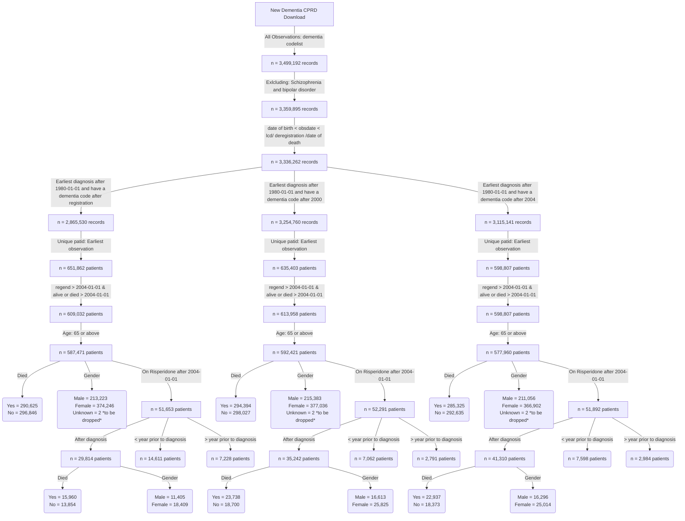

**This is the distribution of number of diagnosis per year for patients diagnosed after registration**


**This is the distribution of number of diagnosis per year for patients diagnosed after 2000**


**This is the distribution of number of prescriptions per year for patients diagnosed after 2004**


**BMJ codes vs ours**


```
BMJ codes	279
Our codes	631
Common codes	86
```
**Flow chart of the final cohorts**


**Dementia incident cohort**


```
                                             
                                             
                                              Overall       
  n                                           353255        
  diagnosedbeforeRegistration = 1 (%)          77403 (21.9) 
  died = 1 (%)                                174204 (49.3) 
  age_diagnosis (mean (SD))                    82.25 (7.10) 
  age_category (%)                                          
     65-74                                     53220 (15.1) 
     75-84                                    159585 (45.2) 
     85-94                                    128631 (36.4) 
     95+                                       11819 ( 3.3) 
  year_of_diagnosis (%)                                     
     2004                                      17502 ( 5.0) 
     2005                                      14865 ( 4.2) 
     2006                                      16620 ( 4.7) 
     2007                                      14520 ( 4.1) 
     2008                                      14931 ( 4.2) 
     2009                                      16317 ( 4.6) 
     2010                                      17437 ( 4.9) 
     2011                                      18395 ( 5.2) 
     2012                                      20029 ( 5.7) 
     2013                                      21675 ( 6.1) 
     2014                                      23469 ( 6.6) 
     2015                                      23301 ( 6.6) 
     2016                                      20765 ( 5.9) 
     2017                                      20374 ( 5.8) 
     2018                                      19268 ( 5.5) 
     2019                                      18785 ( 5.3) 
     2020                                      14879 ( 4.2) 
     2021                                      15410 ( 4.4) 
     2022                                      14326 ( 4.1) 
     2023                                      10387 ( 2.9) 
  gender_decode = M (%)                       122481 (34.7) 
  pre_diagnoses_af = 1 (%)                     46688 (13.2) 
  post_diagnoses_af = 1 (%)                    22901 ( 6.5) 
  af_ever = 1 (%)                              71047 (20.1) 
  pre_diagnoses_angina = 1 (%)                 38974 (11.0) 
  post_diagnoses_angina = 1 (%)                 4583 ( 1.3) 
  angina_ever = 1 (%)                          43776 (12.4) 
  pre_diagnoses_anxiety_disorders = 1 (%)      52839 (15.0) 
  post_diagnoses_anxiety_disorders = 1 (%)      8377 ( 2.4) 
  anxiety_disorders_ever = 1 (%)               61794 (17.5) 
  pre_diagnoses_falls = 1 (%)                  88512 (25.1) 
  post_diagnoses_falls = 1 (%)                 97633 (27.6) 
  falls_ever = 1 (%)                          188256 (53.3) 
  pre_diagnoses_fh_diabetes = 1 (%)            70720 (20.0) 
  post_diagnoses_fh_diabetes = 1 (%)            4579 ( 1.3) 
  fh_diabetes_ever = 1 (%)                     75477 (21.4) 
  heartfailure_ever = 1 (%)                    41583 (11.8) 
  pre_diagnoses_lowerlimbfracture = 1 (%)      43571 (12.3) 
  post_diagnoses_lowerlimbfracture = 1 (%)     26109 ( 7.4) 
  lowerlimbfracture_ever = 1 (%)               70334 (19.9) 
  pre_diagnoses_myocardialinfarction = 1 (%)   26861 ( 7.6) 
  post_diagnoses_myocardialinfarction = 1 (%)   5709 ( 1.6) 
  myocardialinfarction_ever = 1 (%)            32860 ( 9.3) 
  pre_diagnoses_qof_diabetes = 1 (%)           47756 (13.5) 
  post_diagnoses_qof_diabetes = 1 (%)          18426 ( 5.2) 
  qof_diabetes_ever = 1 (%)                    67059 (19.0) 
  pre_diagnoses_revasc = 1 (%)                 18445 ( 5.2) 
  post_diagnoses_revasc = 1 (%)                  832 ( 0.2) 
  revasc_ever = 1 (%)                          19332 ( 5.5) 
  pre_diagnoses_stroke = 1 (%)                 38087 (10.8) 
  post_diagnoses_stroke = 1 (%)                16028 ( 4.5) 
  stroke_ever = 1 (%)                          55527 (15.7) 
  pre_diagnoses_tia = 1 (%)                    29408 ( 8.3) 
  post_diagnoses_tia = 1 (%)                    9919 ( 2.8) 
  tia_ever = 1 (%)                             39813 (11.3) 
  alcohol_cat (%)                                           
     Excess                                    17897 ( 5.1) 
     Harmful                                    9010 ( 2.6) 
     None                                      33247 ( 9.4) 
     Unknown                                   98566 (27.9) 
     Within limits                            194535 (55.1) 
  smoking_cat (%)                                           
     Active smoker                             28397 ( 8.0) 
     Ex-smoker                                141985 (40.2) 
     Non-smoker                               114276 (32.3) 
     Unknown                                   68597 (19.4) 
  qrisk2_smoking_cat (%)                                    
     0                                        152478 (43.2) 
     1                                         88230 (25.0) 
     2                                         27182 ( 7.7) 
     3                                           942 ( 0.3) 
     4                                           693 ( 0.2) 
     Unknown                                   83730 (23.7) 
  qrisk2_smoking_cat_uncoded (%)                            
     Ex-smoker                                 88230 (25.0) 
     Heavy smoker                                693 ( 0.2) 
     Light smoker                              27182 ( 7.7) 
     Moderate smoker                             942 ( 0.3) 
     Non-smoker                               152478 (43.2) 
     Unknown                                   83730 (23.7) 
  gp_5cat_ethnicity (%)                                     
     Black                                      6004 ( 1.7) 
     Mixed                                      1063 ( 0.3) 
     Other                                      1687 ( 0.5) 
     South Asian                                6953 ( 2.0) 
     Unknown                                   91545 (25.9) 
     White                                    246003 (69.6) 
  gp_16cat_ethnicity (%)                                    
     African                                    1101 ( 0.3) 
     Bangladeshi                                 628 ( 0.2) 
     Caribbean                                  4368 ( 1.2) 
     Chinese                                     378 ( 0.1) 
     Indian                                     3507 ( 1.0) 
     Other                                      1324 ( 0.4) 
     Other Asian                                1372 ( 0.4) 
     Other Black                                 483 ( 0.1) 
     Other Mixed                                 287 ( 0.1) 
     Other White                                7423 ( 2.1) 
     Pakistani                                  1399 ( 0.4) 
     Unknown                                   91821 (26.0) 
     White and Asian                             133 ( 0.0) 
     White and Black African                     165 ( 0.0) 
     White and Black Caribbean                   487 ( 0.1) 
     White British                            234396 (66.4) 
     White Irish                                3983 ( 1.1) 
  gp_qrisk2_ethnicity (%)                                   
     Bangladeshi                                 628 ( 0.2) 
     Black African                              1091 ( 0.3) 
     Black Caribbean                            4345 ( 1.2) 
     Chinese                                     376 ( 0.1) 
     Indian                                     3504 ( 1.0) 
     Other                                      2945 ( 0.8) 
     Other Asian                                1364 ( 0.4) 
     Pakistani                                  1398 ( 0.4) 
     Unknown                                   91614 (25.9) 
     White                                    245990 (69.6) 
  pre_diagnoses_deep_vein_thrombosis = 1 (%)   14894 ( 4.2) 
  post_diagnoses_deep_vein_thrombosis = 1 (%)   6581 ( 1.9) 
  deep_vein_thrombosis_ever = 1 (%)            21662 ( 6.1) 
  pre_diagnoses_pulmonary_embolism = 1 (%)      7555 ( 2.1) 
  post_diagnoses_pulmonary_embolism = 1 (%)     3213 ( 0.9) 
  pulmonary_embolism_ever = 1 (%)              10883 ( 3.1) 
  VTE = 1 (%)                                  10883 ( 3.1)  

```


```
           strata   median    lower    upper
1 gender_decode=F 5.037645 5.010267 5.067762
2 gender_decode=M 4.350445 4.314853 4.386037
```


```
               strata   median    lower    upper
1 age_category=65-74 7.882272 7.800137 7.972621
2 age_category=75-84 5.505818 5.470226 5.538672
3 age_category=85-94 3.340178 3.318275 3.364819
4   age_category=95+ 1.711157 1.642710 1.757700

```

**Risperidone incident cohort**
```
                                                         Overall        
  n                                                        23959         
  diagnosedbeforeRegistration = 1 (%)                      10457 ( 43.6) 
  died = 1 (%)                                             13638 ( 56.9) 
  age_risperidone (mean (SD))                              82.89 (6.93)  
  age_category (%)                                                       
     65 - 74                                                5399 ( 22.5) 
     75 - 84                                               11459 ( 47.8) 
     85+                                                    7101 ( 29.6) 
  stroke_3_months_prior = 1 (%)                              123 (  0.5) 
  stroke_6_months_prior = 1 (%)                              181 (  0.8) 
  stroke_12_months_prior = 1 (%)                             289 (  1.2) 
  prescribed_BMJ_antipsyc_drug = 1 (%)                     20545 ( 85.8) 
  stroke_recency_cat (%)                                                 
      <= 1                                                   289 ( 10.1) 
      > 7                                                   2403 ( 84.3) 
     1 - 2                                                   113 (  4.0) 
     2 - 3                                                    41 (  1.4) 
     3 - 4                                                     3 (  0.1) 
  Stroke_prior_to_risperidone = 1 (%)                       2687 ( 11.2) 
  Stroke__within_year_after_1st_risperidone_presc = 1 (%)    325 (  1.4) 
  death_in_a_year_after_risperidone = 1 (%)                 5550 ( 23.2) 
  sex = 1 (%)                                               9065 ( 37.8) 
  dementia_duration_prior_risperidone (mean (SD))           2.10 (2.33)  
  Survival_time (mean (SD))                                 1.77 (1.90)  
  comorbidity_af = 1 (%)                                    4184 ( 17.5) 
  pre_index_date_af = 1 (%)                                 3743 ( 15.6) 
  post_index_date_af = 1 (%)                                1416 (  5.9) 
  comorbidity_angina = 1 (%)                                2821 ( 11.8) 
  pre_index_date_angina = 1 (%)                             2754 ( 11.5) 
  post_index_date_angina = 1 (%)                             265 (  1.1) 
  comorbidity_anxiety_disorders = 1 (%)                     4885 ( 20.4) 
  pre_index_date_anxiety_disorders = 1 (%)                  4679 ( 19.5) 
  post_index_date_anxiety_disorders = 1 (%)                  546 (  2.3) 
  comorbidity_falls = 1 (%)                                13329 ( 55.6) 
  pre_index_date_falls = 1 (%)                              9596 ( 40.1) 
  post_index_date_falls = 1 (%)                             7092 ( 29.6) 
  comorbidity_fh_diabetes = 1 (%)                           4745 ( 19.8) 
  pre_index_date_fh_diabetes = 1 (%)                        4673 ( 19.5) 
  post_index_date_fh_diabetes = 1 (%)                        103 (  0.4) 
  comorbidity_fh_premature_cvd = 1 (%)                      1814 (  7.6) 
  pre_index_date_fh_premature_cvd = 1 (%)                   1790 (  7.5) 
  post_index_date_fh_premature_cvd = 1 (%)                    35 (  0.1) 
  comorbidity_heartfailure = 1 (%)                          2116 (  8.8) 
  pre_index_date_heartfailure = 1 (%)                       1800 (  7.5) 
  post_index_date_heartfailure = 1 (%)                       698 (  2.9) 
  comorbidity_lowerlimbfracture = 1 (%)                     4962 ( 20.7) 
  pre_index_date_lowerlimbfracture = 1 (%)                  3726 ( 15.6) 
  post_index_date_lowerlimbfracture = 1 (%)                 1563 (  6.5) 
  comorbidity_myocardialinfarction = 1 (%)                  2023 (  8.4) 
  pre_index_date_myocardialinfarction = 1 (%)               1910 (  8.0) 
  post_index_date_myocardialinfarction = 1 (%)               208 (  0.9) 
  comorbidity_qof_diabetes = 1 (%)                          4307 ( 18.0) 
  pre_index_date_qof_diabetes = 1 (%)                       4055 ( 16.9) 
  post_index_date_qof_diabetes = 1 (%)                      1898 (  7.9) 
  comorbidity_revasc = 1 (%)                                1263 (  5.3) 
  pre_index_date_revasc = 1 (%)                             1257 (  5.2) 
  post_index_date_revasc = 1 (%)                              19 (  0.1) 
  comorbidity_stroke = 1 (%)                                3326 ( 13.9) 
  pre_index_date_stroke = 1 (%)                             2849 ( 11.9) 
  post_index_date_stroke = 1 (%)                             846 (  3.5) 
  stroke_cat = ischaemic (%)                                2838 ( 85.3) 
  comorbidity_tia = 1 (%)                                   2522 ( 10.5) 
  pre_index_date_tia = 1 (%)                                2159 (  9.0) 
  post_index_date_tia = 1 (%)                                553 (  2.3) 
  comorbidity_deep_vein_thrombosis = 1 (%)                  1552 (  6.5) 
  pre_index_date_deep_vein_thrombosis = 1 (%)               1174 (  4.9) 
  post_index_date_deep_vein_thrombosis = 1 (%)               448 (  1.9) 
  comorbidity_haem_cancer = 0 (%)                          23959 (100.0) 
  pre_index_date_haem_cancer = 0 (%)                       23959 (100.0) 
  post_index_date_haem_cancer = 0 (%)                      23959 (100.0) 
  comorbidity_pulmonary_embolism = 1 (%)                     712 (  3.0) 
  pre_index_date_pulmonary_embolism = 1 (%)                  541 (  2.3) 
  post_index_date_pulmonary_embolism = 1 (%)                 203 (  0.8) 
  comorbidity_solid_cancer = 0 (%)                         23959 (100.0) 
  pre_index_date_solid_cancer = 0 (%)                      23959 (100.0) 
  post_index_date_solid_cancer = 0 (%)                     23959 (100.0) 
  VTE = 1 (%)                                               2107 (  8.8) 
  BMI (%)                                                                
     Normal                                                 8721 ( 36.4) 
     Obesity                                                3074 ( 12.8) 
     Overweight                                             6731 ( 28.1) 
     Severely Obese                                          226 (  0.9) 
     Underweight                                            1093 (  4.6) 
     Unknown                                                4114 ( 17.2) 
  totalcholesterol (%)                                                   
     < 160 mg/dl                                            5288 ( 22.1) 
     > 280 mg/dl                                             843 (  3.5) 
     199 mg/dl                                              5957 ( 24.9) 
     200 - 239 mg/dl                                        5119 ( 21.4) 
     240 - 279 mg/dl                                        2287 (  9.5) 
     Unknown                                                4465 ( 18.6) 
  testvalue_dbp (mean (SD))                                76.37 (11.78) 
  testvalue_sbp (mean (SD))                               135.79 (20.34) 
  testvalue_totalcholesterol (mean (SD))                    4.99 (1.25)  
  gp_5cat_ethnicity (%)                                                  
     Black                                                   359 (  1.5) 
     Mixed                                                    78 (  0.3) 
     Other                                                   123 (  0.5) 
     South Asian                                             385 (  1.6) 
     Unknown                                                5730 ( 23.9) 
     White                                                 17284 ( 72.1) 
  gp_16cat_ethnicity (%)                                                 
     African                                                  62 (  0.3) 
     Bangladeshi                                              29 (  0.1) 
     Caribbean                                               254 (  1.1) 
     Chinese                                                  18 (  0.1) 
     Indian                                                  195 (  0.8) 
     Other                                                   107 (  0.4) 
     Other Asian                                              72 (  0.3) 
     Other Black                                              41 (  0.2) 
     Other Mixed                                              17 (  0.1) 
     Other White                                             545 (  2.3) 
     Pakistani                                                84 (  0.4) 
     Unknown                                                5750 ( 24.0) 
     White and Asian                                          14 (  0.1) 
     White and Black African                                   8 (  0.0) 
     White and Black Caribbean                                38 (  0.2) 
     White British                                         16473 ( 68.8) 
     White Irish                                             252 (  1.1) 
  gp_qrisk2_ethnicity (%)                                                
     Bangladeshi                                              29 (  0.1) 
     Black African                                            62 (  0.3) 
     Black Caribbean                                         254 (  1.1) 
     Chinese                                                  18 (  0.1) 
     Indian                                                  195 (  0.8) 
     Other                                                   225 (  0.9) 
     Other Asian                                              71 (  0.3) 
     Pakistani                                                84 (  0.4) 
     Unknown                                                5737 ( 23.9) 
     White                                                 17284 ( 72.1) 
  alcohol_cat (%)                                                        
     Excess                                                 1153 (  4.8) 
     Harmful                                                 655 (  2.7) 
     None                                                   1790 (  7.5) 
     Unknown                                                8600 ( 35.9) 
     Within limits                                         11761 ( 49.1) 
  smoking_cat (%)                                                        
     Active smoker                                          1657 (  6.9) 
     Ex-smoker                                              8759 ( 36.6) 
     Non-smoker                                             6662 ( 27.8) 
     Unknown                                                6881 ( 28.7) 
  qrisk2_smoking_cat (%)                                                 
     0                                                      8781 ( 36.7) 
     1                                                      5697 ( 23.8) 
     2                                                      1627 (  6.8) 
     3                                                        58 (  0.2) 
     4                                                        30 (  0.1) 
     Unknown                                                7766 ( 32.4) 
  qrisk2_smoking_cat_uncoded (%)                                         
     Ex-smoker                                              5697 ( 23.8) 
     Heavy smoker                                             30 (  0.1) 
     Light smoker                                           1627 (  6.8) 
     Moderate smoker                                          58 (  0.2) 
     Non-smoker                                             8781 ( 36.7) 
     Unknown                                                7766 ( 32.4) 
  drug_name (%)                                                          
     amisulpride                                             245 (  2.0) 
     aripiprazole                                            212 (  1.8) 
     benperidol                                                9 (  0.1) 
     chlorpromazine                                          124 (  1.0) 
     clozapine                                                 1 (  0.0) 
     flupentixol                                             171 (  1.4) 
     fluphenazine                                              7 (  0.1) 
     haloperidol                                            1726 ( 14.3) 
     levomepromazine                                        1448 ( 12.0) 
     olanzapine                                              859 (  7.1) 
     pericyazine                                              18 (  0.1) 
     perphenazine                                              3 (  0.0) 
     pimozide                                                133 (  1.1) 
     prochlorperazine                                       4949 ( 41.1) 
     promazine                                               337 (  2.8) 
     quetiapine                                             1555 ( 12.9) 
     sulpiride                                                45 (  0.4) 
     thioridazine                                             71 (  0.6) 
     trifluoperazine                                         109 (  0.9) 
     zuclopenthixol                                            9 (  0.1) 
  frailty (%)                                                            
     Mild                                                   1118 (  4.7) 
     Moderate                                               2745 ( 11.5) 
     Severe                                                 4196 ( 17.5) 
     Unknown                                               15900 ( 66.4) 
  year_diagnosis_cat (%)                                                 
     > 2020                                                  934 (  3.9) 
     2004 - 2008                                            4214 ( 17.6) 
     2009 - 2012                                            6330 ( 26.4) 
     2013 - 2016                                            7606 ( 31.7) 
     2017 - 2020                                            4875 ( 20.3) 
  prescribed_other_antipsyc_drug = 1 (%)                   12031 ( 50.2) 
  pre_indexdate_antipysch_prescr = 1 (%)                    7990 ( 66.4) 
  post_indexdate_antipysch_prescr = 1 (%)                   3973 ( 33.0) 
  same_indexdate_antipysch_prescr = 1 (%)                     68 (  0.6) 
  pre_indexdate_drug_name (%)                                            
     amisulpride                                             151 (  1.9) 
     aripiprazole                                             62 (  0.8) 
     benperidol                                                6 (  0.1) 
     chlorpromazine                                           97 (  1.2) 
     clozapine                                                 1 (  0.0) 
     flupentixol                                             159 (  2.0) 
     fluphenazine                                              7 (  0.1) 
     haloperidol                                             727 (  9.1) 
     levomepromazine                                          66 (  0.8) 
     olanzapine                                              477 (  6.0) 
     pericyazine                                              17 (  0.2) 
     perphenazine                                              3 (  0.0) 
     pimozide                                                 92 (  1.2) 
     prochlorperazine                                       4679 ( 58.6) 
     promazine                                               253 (  3.2) 
     quetiapine                                              991 ( 12.4) 
     sulpiride                                                34 (  0.4) 
     thioridazine                                             71 (  0.9) 
     trifluoperazine                                          92 (  1.2) 
     zuclopenthixol                                            5 (  0.1) 
  same_indexdate_drug_name (%)                                           
     amisulpride                                               2 (  2.9) 
     aripiprazole                                              6 (  8.8) 
     chlorpromazine                                            4 (  5.9) 
     flupentixol                                               2 (  2.9) 
     haloperidol                                              14 ( 20.6) 
     levomepromazine                                           1 (  1.5) 
     pimozide                                                  7 ( 10.3) 
     prochlorperazine                                          4 (  5.9) 
     promazine                                                10 ( 14.7) 
     quetiapine                                               16 ( 23.5) 
     trifluoperazine                                           2 (  2.9) 
  post_indexdate_drug_name (%)                                           
     amisulpride                                              89 (  2.2) 
     aripiprazole                                            139 (  3.5) 
     benperidol                                                2 (  0.1) 
     chlorpromazine                                           23 (  0.6) 
     flupentixol                                              10 (  0.3) 
     haloperidol                                            1110 ( 27.9) 
     levomepromazine                                        1245 ( 31.3) 
     olanzapine                                              372 (  9.4) 
     pericyazine                                               3 (  0.1) 
     pimozide                                                 33 (  0.8) 
     prochlorperazine                                        257 (  6.5) 
     promazine                                                87 (  2.2) 
     quetiapine                                              579 ( 14.6) 
     sulpiride                                                 8 (  0.2) 
     trifluoperazine                                          12 (  0.3) 
     zuclopenthixol                                            4 (  0.1) 
  care_home = 1 (%)                                         9947 ( 41.5) 
  care_home_before_indexdate = 1 (%)                        3206 ( 32.2) 
  care_home_at_indexdate = 1 (%)                             110 (  1.1) 
  care_home_90_days_after_indexdate = 1 (%)                 2186 ( 22.0) 
  TimeSinceFirstPrescription (mean (SD))                    0.47 (0.89)  
  Prescription_ever_cat (%)                                              
     >100                                                    435 (  1.8) 
     1                                                      4038 ( 16.9) 
     10                                                      619 (  2.6) 
     11 - 20                                                4126 ( 17.2) 
     2                                                      2095 (  8.7) 
     21 - 30                                                2212 (  9.2) 
     3                                                      1525 (  6.4) 
     31 - 40                                                1302 (  5.4) 
     4                                                      1262 (  5.3) 
     41 - 50                                                 788 (  3.3) 
     5                                                      1035 (  4.3) 
     51 - 100                                               1346 (  5.6) 
     6                                                       900 (  3.8) 
     7                                                       831 (  3.5) 
     8                                                       749 (  3.1) 
     9                                                       696 (  2.9) 
  Prescriptions_after_a_year_cat (%)                                     
     >100                                                    238 (  3.0) 
     1                                                       550 (  6.9) 
     10                                                      237 (  3.0) 
     11 - 20                                                1705 ( 21.3) 
     2                                                       493 (  6.2) 
     21 - 30                                                 957 ( 12.0) 
     3                                                       435 (  5.4) 
     31 - 40                                                 609 (  7.6) 
     4                                                       379 (  4.7) 
     41 - 50                                                 391 (  4.9) 
     5                                                       335 (  4.2) 
     51 - 100                                                579 (  7.2) 
     6                                                       306 (  3.8) 
     7                                                       300 (  3.8) 
     8                                                       242 (  3.0) 
     9                                                       242 (  3.0) 
  Prescriptions_within_a_year_cat (%)                                    
     >100                                                     10 (  0.0) 
     1                                                      4202 ( 17.5) 
     10                                                      767 (  3.2) 
     11 - 20                                                7623 ( 31.8) 
     2                                                      2168 (  9.0) 
     21 - 30                                                 673 (  2.8) 
     3                                                      1582 (  6.6) 
     31 - 40                                                 247 (  1.0) 
     4                                                      1320 (  5.5) 
     41 - 50                                                 219 (  0.9) 
     5                                                      1105 (  4.6) 
     51 - 100                                                422 (  1.8) 
     6                                                       999 (  4.2) 
     7                                                       970 (  4.0) 
     8                                                       860 (  3.6) 
     9                                                       792 (  3.3) 
  consultation_counts_Cat (%)                                            
     0 - 50                                                 8858 ( 37.5) 
     101 - 150                                              3996 ( 16.9) 
     151 - 200                                              1410 (  6.0) 
     201 - 250                                               525 (  2.2) 
     251 - 300                                               223 (  0.9) 
     301 - 350                                                86 (  0.4) 
     351 - 400                                                37 (  0.2) 
     401 - 450                                                23 (  0.1) 
     451 - 500                                                16 (  0.1) 
     501 - 800                                                20 (  0.1) 
     51 - 100                                               8440 ( 35.7) 
     801 - 1000                                                3 (  0.0) 
  pre_BMJ_indexdate_drug_name (%)                                        
     amisulpride                                             137 (  8.9) 
     aripiprazole                                             14 (  0.9) 
     benperidol                                                6 (  0.4) 
     chlorpromazine                                           97 (  6.3) 
     clozapine                                                 1 (  0.1) 
     flupentixol                                             100 (  6.5) 
     fluphenazine                                              6 (  0.4) 
     haloperidol                                             679 ( 44.0) 
     levomepromazine                                           5 (  0.3) 
     olanzapine                                               39 (  2.5) 
     pericyazine                                              17 (  1.1) 
     pimozide                                                  5 (  0.3) 
     prochlorperazine                                        272 ( 17.6) 
     promazine                                                40 (  2.6) 
     quetiapine                                               57 (  3.7) 
     sulpiride                                                14 (  0.9) 
     thioridazine                                             26 (  1.7) 
     trifluoperazine                                          26 (  1.7) 
     zuclopenthixol                                            1 (  0.1) 
  same_BMJ_indexdate_drug_name (%)                                       
     amisulpride                                              72 (  0.9) 
     aripiprazole                                            153 (  1.9) 
     benperidol                                                2 (  0.0) 
     chlorpromazine                                           24 (  0.3) 
     flupentixol                                              52 (  0.6) 
     fluphenazine                                              1 (  0.0) 
     haloperidol                                             923 ( 11.2) 
     levomepromazine                                        1025 ( 12.4) 
     olanzapine                                              620 (  7.5) 
     pericyazine                                               3 (  0.0) 
     perphenazine                                              3 (  0.0) 
     pimozide                                                104 (  1.3) 
     prochlorperazine                                       3761 ( 45.6) 
     promazine                                               234 (  2.8) 
     quetiapine                                             1150 ( 14.0) 
     sulpiride                                                20 (  0.2) 
     thioridazine                                             37 (  0.4) 
     trifluoperazine                                          54 (  0.7) 
     zuclopenthixol                                            3 (  0.0) 
  post_BMJ_indexdate_drug_name (%)                                       
     amisulpride                                              26 (  3.8) 
     aripiprazole                                             17 (  2.5) 
     chlorpromazine                                            3 (  0.4) 
     flupentixol                                               7 (  1.0) 
     haloperidol                                             117 ( 16.9) 
     levomepromazine                                          73 ( 10.5) 
     olanzapine                                               57 (  8.2) 
     pimozide                                                  7 (  1.0) 
     prochlorperazine                                        248 ( 35.8) 
     promazine                                                18 (  2.6) 
     quetiapine                                              106 ( 15.3) 
     sulpiride                                                 3 (  0.4) 
     trifluoperazine                                           8 (  1.2) 
     zuclopenthixol                                            3 (  0.4) 
  comorbidity_hypertension (%)                                           
     Elevated                                               2656 ( 11.1) 
     Normal                                                 3378 ( 14.1) 
     Stage 1                                               10539 ( 44.0) 
     Stage 2                                                6865 ( 28.7) 
     Stage 3 (severe)                                        155 (  0.6) 
     Unknown                                                 366 (  1.5) 
  pre_index_date_hypertension = 1 (%)                      19705 ( 83.5) 
  comorbidity_hearing_loss = 1 (%)                          6561 ( 27.4) 
  pre_index_date_hearing_loss = 1 (%)                       6163 ( 25.7) 
  post_index_date_hearing_loss = 1 (%)                       868 (  3.6) 
  pre_indexdate_BMJ_antipysch_prescr = 1 (%)                1553 (  7.6) 
  post_indexdate_BMJ_antipysch_prescr = 1 (%)               1392 (  6.8) 
  same_indexdate_BMJ_antipysch_prescr = 1 (%)              17600 ( 85.7) 
                               
```


```
           strata   median    lower    upper
1 gender_decode=F 2.483231 2.417522 2.562628
2 gender_decode=M 1.957563 1.905544 2.031485
```


```
                strata   median    lower    upper
1 age_category=65 - 74 3.586585 3.416838 3.712526
2 age_category=75 - 84 2.447639 2.373717 2.513347
3     age_category=85+ 1.464750 1.401780 1.527721

```


**COX model**
```
Call:
coxph(formula = Surv(Survival_time, post_index_date_stroke) ~ 
    age_diagnosis + pre_index_date_stroke + sex, data = CompleteData)

  n= 23959, number of events= 846 

                           coef exp(coef) se(coef)      z Pr(>|z|)    
age_diagnosis          0.013706  1.013801 0.005042  2.719  0.00656 ** 
pre_index_date_stroke1 1.903718  6.710798 0.069880 27.243  < 2e-16 ***
sex1                   0.174512  1.190665 0.072553  2.405  0.01616 *  
---
Signif. codes:  0 ‘***’ 0.001 ‘**’ 0.01 ‘*’ 0.05 ‘.’ 0.1 ‘ ’ 1

                       exp(coef) exp(-coef) lower .95 upper .95
age_diagnosis              1.014     0.9864     1.004     1.024
pre_index_date_stroke1     6.711     0.1490     5.852     7.696
sex1                       1.191     0.8399     1.033     1.373

Concordance= 0.726  (se = 0.011 )
Likelihood ratio test= 640.9  on 3 df,   p=<2e-16
Wald test            = 776.8  on 3 df,   p=<2e-16
Score (logrank) test = 1043  on 3 df,   p=<2e-16

```


**One year censoring**

```
Call:
coxph(formula = Surv(Survival_time, post_index_date_stroke) ~ 
    age_diagnosis + pre_index_date_stroke + sex, data = CensoringData_1year)

  n= 23940, number of events= 501 
   (19 observations deleted due to missingness)

                           coef exp(coef) se(coef)      z Pr(>|z|)    
age_diagnosis          0.010646  1.010703 0.006488  1.641   0.1008    
pre_index_date_stroke1 2.196622  8.994583 0.090048 24.394   <2e-16 ***
sex1                   0.199762  1.221113 0.092650  2.156   0.0311 *  
---
Signif. codes:  0 ‘***’ 0.001 ‘**’ 0.01 ‘*’ 0.05 ‘.’ 0.1 ‘ ’ 1

                       exp(coef) exp(-coef) lower .95 upper .95
age_diagnosis              1.011     0.9894    0.9979     1.024
pre_index_date_stroke1     8.995     0.1112    7.5393    10.731
sex1                       1.221     0.8189    1.0183     1.464

Concordance= 0.742  (se = 0.013 )
Likelihood ratio test= 546.2  on 3 df,   p=<2e-16
Wald test            = 619.1  on 3 df,   p=<2e-16
Score (logrank) test = 915.7  on 3 df,   p=<2e-16
```

**Excluding stroke 3 months prior**


```
Call:
coxph(formula = Surv(Survival_time, post_index_date_stroke) ~ 
    age_diagnosis + pre_index_date_stroke + sex, data = Excluding_3_monthsPriorStroke)

  n= 23836, number of events= 789 

                           coef exp(coef) se(coef)      z Pr(>|z|)    
age_diagnosis          0.017014  1.017160 0.005212  3.264   0.0011 ** 
pre_index_date_stroke1 1.769601  5.868512 0.073380 24.116   <2e-16 ***
sex1                   0.176362  1.192870 0.075323  2.341   0.0192 *  
---
Signif. codes:  0 ‘***’ 0.001 ‘**’ 0.01 ‘*’ 0.05 ‘.’ 0.1 ‘ ’ 1

                       exp(coef) exp(-coef) lower .95 upper .95
age_diagnosis              1.017     0.9831     1.007     1.028
pre_index_date_stroke1     5.869     0.1704     5.082     6.776
sex1                       1.193     0.8383     1.029     1.383

Concordance= 0.706  (se = 0.011 )
Likelihood ratio test= 499.9  on 3 df,   p=<2e-16
Wald test            = 615.9  on 3 df,   p=<2e-16
Score (logrank) test = 794.9  on 3 df,   p=<2e-16


```


**Excluding stroke 12 months prior**


```
Call:
coxph(formula = Surv(Survival_time, post_index_date_stroke) ~ 
    age_diagnosis + pre_index_date_stroke + sex, data = Excluding_12_monthsPriorStroke)

  n= 23670, number of events= 744 

                           coef exp(coef) se(coef)      z Pr(>|z|)    
age_diagnosis          0.019554  1.019747 0.005376  3.637 0.000276 ***
pre_index_date_stroke1 1.663083  5.275553 0.076970 21.607  < 2e-16 ***
sex1                   0.184390  1.202484 0.077672  2.374 0.017598 *  
---
Signif. codes:  0 ‘***’ 0.001 ‘**’ 0.01 ‘*’ 0.05 ‘.’ 0.1 ‘ ’ 1

                       exp(coef) exp(-coef) lower .95 upper .95
age_diagnosis              1.020     0.9806     1.009     1.031
pre_index_date_stroke1     5.276     0.1896     4.537     6.135
sex1                       1.202     0.8316     1.033     1.400

Concordance= 0.689  (se = 0.012 )
Likelihood ratio test= 401.8  on 3 df,   p=<2e-16
Wald test            = 501  on 3 df,   p=<2e-16
Score (logrank) test = 627.7  on 3 df,   p=<2e-16

```


**Matching**


```
A matchit object
 - method: 5:1 nearest neighbor matching with replacement
 - distance: Propensity score [caliper]
             - estimated with logistic regression
 - caliper: <distance> (0.002)
 - number of obs.: 10437 (original), 1279 (matched)
 - target estimand: ATT
 - covariates: sex, age_diagnosis, pre_index_date_angina, pre_index_date_heartfailure, BMI, Prescribed_other_antipsychotic_Prior, period_before_prescription, comorbidity_myocardialinfarction, pre_index_date_stroke, pre_index_date_tia, pre_index_date_falls, pre_index_date_lowerlimbfracture, pre_index_date_ihd, pre_index_date_pad, pre_index_date_af, pre_index_date_revasc, pre_index_date_qof_diabetes, pre_index_date_anxiety_disorders, pre_index_date_fh_diabetes, pre_index_date_fh_premature_cvd, pre_index_date_pulmonary_embolism, pre_index_date_deep_vein_thrombosis, pre_index_date_haem_cancer, pre_index_date_solid_cancer, pre_index_date_hearing_loss, VTE, gp_5cat_ethnicity, comorbidity_hypertension
> 
> summary(m.out2, un = FALSE)

Call:
matchit(formula = risperidone ~ +sex + age_diagnosis + pre_index_date_angina + 
    pre_index_date_heartfailure + BMI + Prescribed_other_antipsychotic_Prior + 
    period_before_prescription + comorbidity_myocardialinfarction + 
    pre_index_date_stroke + pre_index_date_tia + pre_index_date_falls + 
    pre_index_date_lowerlimbfracture + pre_index_date_ihd + pre_index_date_pad + 
    pre_index_date_af + pre_index_date_revasc + pre_index_date_qof_diabetes + 
    pre_index_date_anxiety_disorders + pre_index_date_fh_diabetes + 
    pre_index_date_fh_premature_cvd + pre_index_date_pulmonary_embolism + 
    pre_index_date_deep_vein_thrombosis + pre_index_date_haem_cancer + 
    pre_index_date_solid_cancer + pre_index_date_hearing_loss + 
    VTE + gp_5cat_ethnicity + comorbidity_hypertension, data = FullData, 
    method = "nearest", distance = "glm", link = "logit", replace = TRUE, 
    caliper = 0.05, ratio = 5)

Summary of Balance for Matched Data:
                                         Means Treated Means Control Std. Mean Diff. Var. Ratio eCDF Mean
distance                                        0.1173        0.1173          0.0003     1.0024    0.0002
sex                                             0.2885        0.2885          0.0000          .    0.0000
age_diagnosis                                  81.5641       83.0730         -0.2100     1.1123    0.0401
pre_index_date_angina                           0.0994        0.1021         -0.0094          .    0.0028
pre_index_date_heartfailure                     0.0801        0.0888         -0.0319          .    0.0087
BMIMissing                                      0.7917        0.8538         -0.1543          .    0.0622
BMINormal                                       0.1250        0.0865          0.1154          .    0.0385
BMIObesity                                      0.0288        0.0160          0.0796          .    0.0128
BMIOverweight                                   0.0417        0.0346          0.0367          .    0.0071
BMISeverely Obese                               0.0000        0.0000          0.0000          .    0.0000
BMIUnderweight                                  0.0128        0.0090          0.0356          .    0.0038
Prescribed_other_antipsychotic_Prior            0.1571        0.1179          0.1111          .    0.0391
period_before_prescription                      1.0337        1.2393         -0.1156     1.1144    0.0341
comorbidity_myocardialinfarction                0.0513        0.0372          0.0664          .    0.0141
pre_index_date_stroke                           0.0929        0.1053         -0.0423          .    0.0124
pre_index_date_tia                              0.0897        0.0973         -0.0256          .    0.0076
pre_index_date_falls                            0.1923        0.1424          0.1297          .    0.0499
pre_index_date_lowerlimbfracture                0.1250        0.1301         -0.0157          .    0.0051
pre_index_date_ihd                              0.1378        0.1441         -0.0178          .    0.0063
pre_index_date_pad                              0.0577        0.0904         -0.1273          .    0.0327
pre_index_date_af                               0.0962        0.0900          0.0215          .    0.0062
pre_index_date_revasc                           0.0160        0.0090          0.0584          .    0.0071
pre_index_date_qof_diabetes                     0.0769        0.0823         -0.0182          .    0.0053
pre_index_date_anxiety_disorders                0.0865        0.0532          0.1230          .    0.0333
pre_index_date_fh_diabetes                      0.0897        0.0635          0.0911          .    0.0263
pre_index_date_fh_premature_cvd                 0.0160        0.0096          0.0531          .    0.0064
pre_index_date_pulmonary_embolism               0.0000        0.0000          0.0000          .    0.0000
pre_index_date_deep_vein_thrombosis             0.0256        0.0131          0.0822          .    0.0125
pre_index_date_haem_cancer                      0.0032        0.0026          0.0118          .    0.0006
pre_index_date_solid_cancer                     0.0994        0.1054         -0.0200          .    0.0061
pre_index_date_hearing_loss                     0.1250        0.0923          0.1012          .    0.0327
VTE                                             0.0353        0.0247          0.0550          .    0.0106
gp_5cat_ethnicityBlack                          0.0000        0.0000          0.0000          .    0.0000
gp_5cat_ethnicityMixed                          0.0000        0.0000          0.0000          .    0.0000
gp_5cat_ethnicityOther                          0.0032        0.0051         -0.0251          .    0.0019
gp_5cat_ethnicitySouth Asian                    0.0032        0.0083         -0.0547          .    0.0051
gp_5cat_ethnicityUnknown                        0.8013        0.8484         -0.1189          .    0.0471
gp_5cat_ethnicityWhite                          0.1923        0.1381          0.1408          .    0.0542
comorbidity_hypertensionElevated                0.0897        0.0651          0.0895          .    0.0247
comorbidity_hypertensionNormal                  0.1859        0.1726          0.0342          .    0.0132
comorbidity_hypertensionStage 1                 0.2788        0.2016          0.1748          .    0.0772
comorbidity_hypertensionStage 2                 0.1699        0.1818         -0.0311          .    0.0120
comorbidity_hypertensionStage 3 (severe)        0.0000        0.0038         -0.0708          .    0.0038
comorbidity_hypertensionUnknown                 0.2756        0.3750         -0.2203          .    0.0994
                                         eCDF Max Std. Pair Dist.
distance                                   0.0112          0.0030
sex                                        0.0000          0.3917
age_diagnosis                              0.1085          0.9949
pre_index_date_angina                      0.0028          0.6039
pre_index_date_heartfailure                0.0087          0.5412
BMIMissing                                 0.0622          0.7331
BMINormal                                  0.0385          0.5732
BMIObesity                                 0.0128          0.2837
BMIOverweight                              0.0071          0.3994
BMISeverely Obese                          0.0000          0.0000
BMIUnderweight                             0.0038          0.2176
Prescribed_other_antipsychotic_Prior       0.0391          0.6074
period_before_prescription                 0.3654          0.2743
comorbidity_myocardialinfarction           0.0141          0.4171
pre_index_date_stroke                      0.0124          0.6075
pre_index_date_tia                         0.0076          0.5549
pre_index_date_falls                       0.0499          0.7468
pre_index_date_lowerlimbfracture           0.0051          0.6529
pre_index_date_ihd                         0.0063          0.6764
pre_index_date_pad                         0.0327          0.4688
pre_index_date_af                          0.0062          0.5611
pre_index_date_revasc                      0.0071          0.1777
pre_index_date_qof_diabetes                0.0053          0.4940
pre_index_date_anxiety_disorders           0.0333          0.5156
pre_index_date_fh_diabetes                 0.0263          0.4915
pre_index_date_fh_premature_cvd            0.0064          0.2293
pre_index_date_pulmonary_embolism          0.0000          0.0000
pre_index_date_deep_vein_thrombosis        0.0125          0.2731
pre_index_date_haem_cancer                 0.0006          0.1147
pre_index_date_solid_cancer                0.0061          0.6496
pre_index_date_hearing_loss                0.0327          0.6342
VTE                                        0.0106          0.3023
gp_5cat_ethnicityBlack                     0.0000          0.0000
gp_5cat_ethnicityMixed                     0.0000          0.0000
gp_5cat_ethnicityOther                     0.0019          0.0902
gp_5cat_ethnicitySouth Asian               0.0051          0.1328
gp_5cat_ethnicityUnknown                   0.0471          0.7280
gp_5cat_ethnicityWhite                     0.0542          0.7108
comorbidity_hypertensionElevated           0.0247          0.5473
comorbidity_hypertensionNormal             0.0132          0.7725
comorbidity_hypertensionStage 1            0.0772          0.8220
comorbidity_hypertensionStage 2            0.0120          0.7450
comorbidity_hypertensionStage 3 (severe)   0.0038          0.0765
comorbidity_hypertensionUnknown            0.0994          0.9162

Sample Sizes:
               Control Treated
All           10099.       338
Matched (ESS)   478.91     312
Matched         967.       312
Unmatched      9132.        26
Discarded         0.         0
```


```

                                             Stratified by risperidone
                                               0              1              p      test SMD   
  n                                            160934         32366                            
  sex = 1 (%)                                   65663 (40.8)  13190 ( 40.8)   0.876       0.001
  risperidone = 1 (%)                               0 ( 0.0)  32366 (100.0)  <0.001         NaN
  age_diagnosis (mean (SD))                     80.45 (7.00)  80.55 (7.14)    0.020       0.014
  pre_index_date_angina = 1 (%)                 18921 (11.8)   3809 ( 11.8)   0.961      <0.001
  pre_index_date_heartfailure = 1 (%)           12120 ( 7.5)   2466 (  7.6)   0.592       0.003
  BMI (%)                                                                     0.939       0.007
     Missing                                    79893 (49.6)  15983 ( 49.4)                    
     Normal                                     40249 (25.0)   8154 ( 25.2)                    
     Obesity                                     9181 ( 5.7)   1869 (  5.8)                    
     Overweight                                 23341 (14.5)   4716 ( 14.6)                    
     Severely Obese                               564 ( 0.4)    114 (  0.4)                    
     Underweight                                 7706 ( 4.8)   1530 (  4.7)                    
  Prescribed_other_antipsychotic_Prior = 1 (%)  38054 (23.6)   7328 ( 22.6)  <0.001       0.024
  period_before_prescription (mean (SD))         2.47 (2.02)   2.39 (2.35)   <0.001       0.035
  comorbidity_myocardialinfarction = 1 (%)      13539 ( 8.4)   2749 (  8.5)   0.641       0.003
  pre_index_date_stroke = 1 (%)                 18965 (11.8)   3870 ( 12.0)   0.385       0.005
  pre_index_date_tia = 1 (%)                    14928 ( 9.3)   2982 (  9.2)   0.731       0.002
  pre_index_date_falls = 1 (%)                  65985 (41.0)  13261 ( 41.0)   0.927       0.001
  pre_index_date_lowerlimbfracture = 1 (%)      24916 (15.5)   5019 ( 15.5)   0.917       0.001
  pre_index_date_ihd = 1 (%)                    26772 (16.6)   5407 ( 16.7)   0.763       0.002
  pre_index_date_pad = 1 (%)                    12065 ( 7.5)   2447 (  7.6)   0.701       0.002
  pre_index_date_af = 1 (%)                     26035 (16.2)   5327 ( 16.5)   0.214       0.008
  pre_index_date_revasc = 1 (%)                  8995 ( 5.6)   1825 (  5.6)   0.734       0.002
  pre_index_date_qof_diabetes = 1 (%)           27982 (17.4)   5660 ( 17.5)   0.670       0.003
  pre_index_date_anxiety_disorders = 1 (%)      32234 (20.0)   6367 ( 19.7)   0.144       0.009
  pre_index_date_fh_diabetes = 1 (%)            32634 (20.3)   6496 ( 20.1)   0.401       0.005
  pre_index_date_fh_premature_cvd = 1 (%)       12223 ( 7.6)   2444 (  7.6)   0.794       0.002
  pre_index_date_pulmonary_embolism = 1 (%)      4167 ( 2.6)    837 (  2.6)   0.989      <0.001
  pre_index_date_deep_vein_thrombosis = 1 (%)    8172 ( 5.1)   1639 (  5.1)   0.928       0.001
  pre_index_date_haem_cancer = 1 (%)             3109 ( 1.9)    609 (  1.9)   0.563       0.004
  pre_index_date_solid_cancer = 1 (%)           26152 (16.3)   5282 ( 16.3)   0.764       0.002
  pre_index_date_hearing_loss = 1 (%)           42296 (26.3)   8566 ( 26.5)   0.496       0.004
  VTE = 1 (%)                                   12358 ( 7.7)   2465 (  7.6)   0.706       0.002
  gp_5cat_ethnicity (%)                                                       0.753       0.010
     Black                                       2141 ( 1.3)    417 (  1.3)                    
     Mixed                                        460 ( 0.3)     84 (  0.3)                    
     Other                                        800 ( 0.5)    151 (  0.5)                    
     South Asian                                 2435 ( 1.5)    468 (  1.4)                    
     Unknown                                    36294 (22.6)   7352 ( 22.7)                    
     White                                     118804 (73.8)  23894 ( 73.8)                    
  comorbidity_hypertension (%)                                               <0.001       0.043
     Elevated                                   30989 (19.3)   6314 ( 19.5)                    
     Normal                                     60139 (37.4)  12259 ( 37.9)                    
     Stage 1                                    33302 (20.7)   6864 ( 21.2)                    
     Stage 2                                    11117 ( 6.9)   2311 (  7.1)                    
     Stage 3 (severe)                              46 ( 0.0)      7 (  0.0)                    
     Unknown                                    25341 (15.7)   4611 ( 14.2)                    
  Survival_time (mean (SD))                      1.65 (1.96)   1.66 (1.91)    0.154       0.009
```


```
Call:
coxph(formula = Surv(Survival_time, post_index_date_stroke) ~ 
    age_diagnosis + pre_index_date_stroke + sex, data = table)

  n= 193300, number of events= 2563 

                           coef exp(coef)  se(coef)      z Pr(>|z|)    
age_diagnosis          0.006827  1.006851  0.002911  2.345    0.019 *  
pre_index_date_stroke  2.345283 10.436222  0.039969 58.678   <2e-16 ***
sex                    0.044144  1.045133  0.040557  1.088    0.276    
---
Signif. codes:  0 ‘***’ 0.001 ‘**’ 0.01 ‘*’ 0.05 ‘.’ 0.1 ‘ ’ 1

                      exp(coef) exp(-coef) lower .95 upper .95
age_diagnosis             1.007    0.99320    1.0011     1.013
pre_index_date_stroke    10.436    0.09582    9.6499    11.287
sex                       1.045    0.95682    0.9653     1.132

Concordance= 0.751  (se = 0.005 )
Likelihood ratio test= 3136  on 3 df,   p=<2e-16
Wald test            = 3484  on 3 df,   p=<2e-16
Score (logrank) test = 5407  on 3 df,   p=<2e-16

> res.cox <- coxph(Surv(Survival_time, post_index_date_stroke) ~ age_diagnosis +  + sex, data = table)
> summary(res.cox)
Call:
coxph(formula = Surv(Survival_time, post_index_date_stroke) ~ 
    age_diagnosis + +sex, data = table)

  n= 193300, number of events= 2563 

                  coef exp(coef) se(coef)     z Pr(>|z|)    
age_diagnosis 0.008858  1.008897 0.002890 3.065  0.00218 ** 
sex           0.199664  1.220993 0.040275 4.958 7.14e-07 ***
---
Signif. codes:  0 ‘***’ 0.001 ‘**’ 0.01 ‘*’ 0.05 ‘.’ 0.1 ‘ ’ 1

              exp(coef) exp(-coef) lower .95 upper .95
age_diagnosis     1.009     0.9912     1.003     1.015
sex               1.221     0.8190     1.128     1.321

Concordance= 0.534  (se = 0.006 )
Likelihood ratio test= 29.74  on 2 df,   p=3e-07
Wald test            = 29.85  on 2 df,   p=3e-07
Score (logrank) test = 29.91  on 2 df,   p=3e-07

```


**Yearly matching results**

```
[1] "Processing data for year 2004"
[1] "working out pre- and post-obsdate date code occurrences for angina  for year:  2004"
[1] "working out pre- and post-obsdate date code occurrences for heartfailure  for year:  2004"
[1] "working out pre- and post-obsdate date code occurrences for myocardialinfarction  for year:  2004"
[1] "Processing data for year 2004"
[1] "working out pre- and post-obsdate date code occurrences for angina  for year:  2004"
[1] "working out pre- and post-obsdate date code occurrences for heartfailure  for year:  2004"
[1] "working out pre- and post-obsdate date code occurrences for myocardialinfarction  for year:  2004"
[1] "working out pre- and post-obsdate date code occurrences for stroke  for year:  2004"
[1] "working out pre- and post-obsdate date code occurrences for tia  for year:  2004"
[1] "working out pre- and post-obsdate date code occurrences for falls  for year:  2004"
[1] "working out pre- and post-obsdate date code occurrences for lowerlimbfracture  for year:  2004"
[1] "working out pre- and post-obsdate date code occurrences for ihd  for year:  2004"
[1] "working out pre- and post-obsdate date code occurrences for pad  for year:  2004"
[1] "working out pre- and post-obsdate date code occurrences for af  for year:  2004"
[1] "working out pre- and post-obsdate date code occurrences for revasc  for year:  2004"
[1] "working out pre- and post-obsdate date code occurrences for qof_diabetes  for year:  2004"
[1] "working out pre- and post-obsdate date code occurrences for anxiety_disorders  for year:  2004"
[1] "working out pre- and post-obsdate date code occurrences for fh_diabetes  for year:  2004"
[1] "working out pre- and post-obsdate date code occurrences for fh_premature_cvd  for year:  2004"
[1] "working out pre- and post-obsdate date code occurrences for pulmonary_embolism  for year:  2004"
[1] "working out pre- and post-obsdate date code occurrences for deep_vein_thrombosis  for year:  2004"
[1] "working out pre- and post-obsdate date code occurrences for haem_cancer  for year:  2004"
[1] "working out pre- and post-obsdate date code occurrences for solid_cancer  for year:  2004"
[1] "working out pre- and post-obsdate date code occurrences for hearing_loss  for year:  2004"

Call:
matchit(formula = risperidone ~ +sex + age_diagnosis + pre_index_date_angina + 
    pre_index_date_heartfailure + BMI + Prescribed_other_antipsychotic_Prior + 
    period_before_prescription + comorbidity_myocardialinfarction + 
    pre_index_date_stroke + pre_index_date_tia + pre_index_date_falls + 
    pre_index_date_lowerlimbfracture + pre_index_date_ihd + pre_index_date_pad + 
    pre_index_date_af + pre_index_date_revasc + pre_index_date_qof_diabetes + 
    pre_index_date_anxiety_disorders + pre_index_date_fh_diabetes + 
    pre_index_date_fh_premature_cvd + pre_index_date_pulmonary_embolism + 
    pre_index_date_deep_vein_thrombosis + pre_index_date_haem_cancer + 
    pre_index_date_solid_cancer + pre_index_date_hearing_loss + 
    VTE + gp_5cat_ethnicity + comorbidity_hypertension + Survival_time, 
    data = FullData, method = "nearest", distance = "glm", link = "logit", 
    replace = TRUE, caliper = 0.05, ratio = 5)

Summary of Balance for Matched Data:
                                         Means Treated Means Control Std. Mean Diff. Var. Ratio eCDF Mean eCDF Max
distance                                        0.1555        0.1555         -0.0002     0.9990    0.0002   0.0167
sex                                             0.3010        0.2929          0.0177          .    0.0081   0.0081
age_diagnosis                                  81.5819       82.2903         -0.0986     1.0572    0.0206   0.0599
pre_index_date_angina                           0.1003        0.0980          0.0079          .    0.0023   0.0023
pre_index_date_heartfailure                     0.0736        0.1002         -0.0983          .    0.0266   0.0266
BMIMissing                                      0.7793        0.8285         -0.1221          .    0.0492   0.0492
BMINormal                                       0.1338        0.1125          0.0639          .    0.0213   0.0213
BMIObesity                                      0.0301        0.0207          0.0582          .    0.0094   0.0094
BMIOverweight                                   0.0435        0.0323          0.0583          .    0.0112   0.0112
BMISeverely Obese                               0.0000        0.0000          0.0000          .    0.0000   0.0000
BMIUnderweight                                  0.0134        0.0060          0.0680          .    0.0074   0.0074
Prescribed_other_antipsychotic_Prior            0.1639        0.1572          0.0190          .    0.0067   0.0067
period_before_prescription                      1.0744        1.2304         -0.0877     1.2600    0.0423   0.3635
comorbidity_myocardialinfarction                0.0535        0.0455          0.0378          .    0.0080   0.0080
pre_index_date_stroke                           0.0936        0.1009         -0.0248          .    0.0072   0.0072
pre_index_date_tia                              0.0970        0.0967          0.0009          .    0.0003   0.0003
pre_index_date_falls                            0.1906        0.1502          0.1052          .    0.0405   0.0405
pre_index_date_lowerlimbfracture                0.1171        0.1547         -0.1152          .    0.0376   0.0376
pre_index_date_ihd                              0.1538        0.1483          0.0155          .    0.0055   0.0055
pre_index_date_pad                              0.0635        0.0733         -0.0380          .    0.0098   0.0098
pre_index_date_af                               0.0970        0.0824          0.0504          .    0.0145   0.0145
pre_index_date_revasc                           0.0167        0.0080          0.0720          .    0.0087   0.0087
pre_index_date_qof_diabetes                     0.0870        0.0726          0.0491          .    0.0144   0.0144
pre_index_date_anxiety_disorders                0.0903        0.0662          0.0890          .    0.0241   0.0241
pre_index_date_fh_diabetes                      0.0936        0.0791          0.0504          .    0.0145   0.0145
pre_index_date_fh_premature_cvd                 0.0167        0.0107          0.0499          .    0.0060   0.0060
pre_index_date_pulmonary_embolism               0.0000        0.0000          0.0000          .    0.0000   0.0000
pre_index_date_deep_vein_thrombosis             0.0234        0.0183          0.0337          .    0.0051   0.0051
pre_index_date_haem_cancer                      0.0033        0.0020          0.0246          .    0.0013   0.0013
pre_index_date_solid_cancer                     0.1070        0.0857          0.0699          .    0.0213   0.0213
pre_index_date_hearing_loss                     0.1237        0.1159          0.0242          .    0.0078   0.0078
VTE                                             0.0334        0.0280          0.0284          .    0.0055   0.0055
gp_5cat_ethnicityBlack                          0.0000        0.0000          0.0000          .    0.0000   0.0000
gp_5cat_ethnicityMixed                          0.0000        0.0000          0.0000          .    0.0000   0.0000
gp_5cat_ethnicityOther                          0.0033        0.0054         -0.0262          .    0.0020   0.0020
gp_5cat_ethnicitySouth Asian                    0.0033        0.0076         -0.0452          .    0.0042   0.0042
gp_5cat_ethnicityUnknown                        0.7926        0.8259         -0.0839          .    0.0333   0.0333
gp_5cat_ethnicityWhite                          0.2007        0.1611          0.1028          .    0.0395   0.0395
comorbidity_hypertensionElevated                0.0936        0.0696          0.0874          .    0.0241   0.0241
comorbidity_hypertensionNormal                  0.1773        0.1658          0.0297          .    0.0115   0.0115
comorbidity_hypertensionStage 1                 0.2943        0.2352          0.1337          .    0.0591   0.0591
comorbidity_hypertensionStage 2                 0.1706        0.1655          0.0132          .    0.0051   0.0051
comorbidity_hypertensionStage 3 (severe)        0.0000        0.0007         -0.0123          .    0.0007   0.0007
comorbidity_hypertensionUnknown                 0.2642        0.3633         -0.2197          .    0.0991   0.0991
Survival_time                                   2.4082        2.0667          0.1305     1.3614    0.0305   0.0823
                                         Std. Pair Dist.
distance                                          0.0031
sex                                               0.8684
age_diagnosis                                     1.0573
pre_index_date_angina                             0.6266
pre_index_date_heartfailure                       0.5314
BMIMissing                                        0.8301
BMINormal                                         0.7068
BMIObesity                                        0.3125
BMIOverweight                                     0.4399
BMISeverely Obese                                 0.0000
BMIUnderweight                                    0.2044
Prescribed_other_antipsychotic_Prior              0.6668
period_before_prescription                        0.3666
comorbidity_myocardialinfarction                  0.4809
pre_index_date_stroke                             0.5832
pre_index_date_tia                                0.6060
pre_index_date_falls                              0.8027
pre_index_date_lowerlimbfracture                  0.7471
pre_index_date_ihd                                0.7535
pre_index_date_pad                                0.4095
pre_index_date_af                                 0.5625
pre_index_date_revasc                             0.2083
pre_index_date_qof_diabetes                       0.4790
pre_index_date_anxiety_disorders                  0.5454
pre_index_date_fh_diabetes                        0.5968
pre_index_date_fh_premature_cvd                   0.2462
pre_index_date_pulmonary_embolism                 0.0000
pre_index_date_deep_vein_thrombosis               0.2908
pre_index_date_haem_cancer                        0.1123
pre_index_date_solid_cancer                       0.5929
pre_index_date_hearing_loss                       0.7338
VTE                                               0.3290
gp_5cat_ethnicityBlack                            0.0000
gp_5cat_ethnicityMixed                            0.0000
gp_5cat_ethnicityOther                            0.0497
gp_5cat_ethnicitySouth Asian                      0.1219
gp_5cat_ethnicityUnknown                          0.7749
gp_5cat_ethnicityWhite                            0.7710
comorbidity_hypertensionElevated                  0.5835
comorbidity_hypertensionNormal                    0.7661
comorbidity_hypertensionStage 1                   0.8691
comorbidity_hypertensionStage 2                   0.6699
comorbidity_hypertensionStage 3 (severe)          0.0140
comorbidity_hypertensionUnknown                   0.8941
Survival_time                                     0.9590

Sample Sizes:
              Control Treated
All           9842.       338
Matched (ESS)  317.68     299
Matched        880.       299
Unmatched     8962.        39
Discarded        0.         0

[1] "Processing data for year 2005"
[1] "working out pre- and post-obsdate date code occurrences for angina  for year:  2005"
[1] "working out pre- and post-obsdate date code occurrences for heartfailure  for year:  2005"
[1] "working out pre- and post-obsdate date code occurrences for myocardialinfarction  for year:  2005"
[1] "working out pre- and post-obsdate date code occurrences for stroke  for year:  2005"
[1] "working out pre- and post-obsdate date code occurrences for tia  for year:  2005"
[1] "working out pre- and post-obsdate date code occurrences for falls  for year:  2005"
[1] "working out pre- and post-obsdate date code occurrences for lowerlimbfracture  for year:  2005"
[1] "working out pre- and post-obsdate date code occurrences for ihd  for year:  2005"
[1] "working out pre- and post-obsdate date code occurrences for pad  for year:  2005"
[1] "working out pre- and post-obsdate date code occurrences for af  for year:  2005"
[1] "working out pre- and post-obsdate date code occurrences for revasc  for year:  2005"
[1] "working out pre- and post-obsdate date code occurrences for qof_diabetes  for year:  2005"
[1] "working out pre- and post-obsdate date code occurrences for anxiety_disorders  for year:  2005"
[1] "working out pre- and post-obsdate date code occurrences for fh_diabetes  for year:  2005"
[1] "working out pre- and post-obsdate date code occurrences for fh_premature_cvd  for year:  2005"
[1] "working out pre- and post-obsdate date code occurrences for pulmonary_embolism  for year:  2005"
[1] "working out pre- and post-obsdate date code occurrences for deep_vein_thrombosis  for year:  2005"
[1] "working out pre- and post-obsdate date code occurrences for haem_cancer  for year:  2005"
[1] "working out pre- and post-obsdate date code occurrences for solid_cancer  for year:  2005"
[1] "working out pre- and post-obsdate date code occurrences for hearing_loss  for year:  2005"

Call:
matchit(formula = risperidone ~ +sex + age_diagnosis + pre_index_date_angina + 
    pre_index_date_heartfailure + BMI + Prescribed_other_antipsychotic_Prior + 
    period_before_prescription + comorbidity_myocardialinfarction + 
    pre_index_date_stroke + pre_index_date_tia + pre_index_date_falls + 
    pre_index_date_lowerlimbfracture + pre_index_date_ihd + pre_index_date_pad + 
    pre_index_date_af + pre_index_date_revasc + pre_index_date_qof_diabetes + 
    pre_index_date_anxiety_disorders + pre_index_date_fh_diabetes + 
    pre_index_date_fh_premature_cvd + pre_index_date_pulmonary_embolism + 
    pre_index_date_deep_vein_thrombosis + pre_index_date_haem_cancer + 
    pre_index_date_solid_cancer + pre_index_date_hearing_loss + 
    VTE + gp_5cat_ethnicity + comorbidity_hypertension + Survival_time, 
    data = FullData, method = "nearest", distance = "glm", link = "logit", 
    replace = TRUE, caliper = 0.05, ratio = 5)

Summary of Balance for Matched Data:
                                         Means Treated Means Control Std. Mean Diff. Var. Ratio eCDF Mean eCDF Max
distance                                        0.0359        0.0359          0.0000     1.0024    0.0001   0.0072
sex                                             0.3140        0.3098          0.0092          .    0.0043   0.0043
age_diagnosis                                  81.9835       81.7186          0.0391     0.9338    0.0084   0.0412
pre_index_date_angina                           0.1350        0.1526         -0.0513          .    0.0176   0.0176
pre_index_date_heartfailure                     0.0799        0.0742          0.0209          .    0.0056   0.0056
BMIMissing                                      0.6777        0.6902         -0.0269          .    0.0125   0.0125
BMINormal                                       0.1791        0.1742          0.0126          .    0.0048   0.0048
BMIObesity                                      0.0248        0.0198          0.0320          .    0.0050   0.0050
BMIOverweight                                   0.0854        0.0862         -0.0030          .    0.0008   0.0008
BMISeverely Obese                               0.0055        0.0052          0.0037          .    0.0003   0.0003
BMIUnderweight                                  0.0275        0.0242          0.0203          .    0.0033   0.0033
Prescribed_other_antipsychotic_Prior            0.2507        0.2255          0.0583          .    0.0252   0.0252
period_before_prescription                      1.3608        1.5004         -0.0789     1.4626    0.0410   0.2824
comorbidity_myocardialinfarction                0.0606        0.0534          0.0301          .    0.0072   0.0072
pre_index_date_stroke                           0.0964        0.0869          0.0319          .    0.0095   0.0095
pre_index_date_tia                              0.1019        0.1143         -0.0411          .    0.0124   0.0124
pre_index_date_falls                            0.2700        0.2607          0.0208          .    0.0092   0.0092
pre_index_date_lowerlimbfracture                0.1515        0.1485          0.0084          .    0.0030   0.0030
pre_index_date_ihd                              0.1928        0.2006         -0.0195          .    0.0077   0.0077
pre_index_date_pad                              0.0744        0.0817         -0.0279          .    0.0073   0.0073
pre_index_date_af                               0.1074        0.0890          0.0598          .    0.0185   0.0185
pre_index_date_revasc                           0.0275        0.0412         -0.0799          .    0.0136   0.0136
pre_index_date_qof_diabetes                     0.0964        0.0992         -0.0094          .    0.0028   0.0028
pre_index_date_anxiety_disorders                0.1074        0.1092         -0.0057          .    0.0018   0.0018
pre_index_date_fh_diabetes                      0.1129        0.1146         -0.0052          .    0.0017   0.0017
pre_index_date_fh_premature_cvd                 0.0220        0.0215          0.0038          .    0.0006   0.0006
pre_index_date_pulmonary_embolism               0.0110        0.0094          0.0159          .    0.0017   0.0017
pre_index_date_deep_vein_thrombosis             0.0138        0.0132          0.0047          .    0.0006   0.0006
pre_index_date_haem_cancer                      0.0138        0.0105          0.0285          .    0.0033   0.0033
pre_index_date_solid_cancer                     0.1074        0.1050          0.0080          .    0.0025   0.0025
pre_index_date_hearing_loss                     0.1791        0.1579          0.0555          .    0.0212   0.0212
VTE                                             0.0275        0.0263          0.0073          .    0.0012   0.0012
gp_5cat_ethnicityBlack                          0.0000        0.0000          0.0000          .    0.0000   0.0000
gp_5cat_ethnicityMixed                          0.0000        0.0000          0.0000          .    0.0000   0.0000
gp_5cat_ethnicityOther                          0.0000        0.0000          0.0000          .    0.0000   0.0000
gp_5cat_ethnicitySouth Asian                    0.0055        0.0091         -0.0486          .    0.0036   0.0036
gp_5cat_ethnicityUnknown                        0.7603        0.7537          0.0155          .    0.0066   0.0066
gp_5cat_ethnicityWhite                          0.2342        0.2372         -0.0071          .    0.0030   0.0030
comorbidity_hypertensionElevated                0.1763        0.1725          0.0102          .    0.0039   0.0039
comorbidity_hypertensionNormal                  0.2121        0.2158         -0.0091          .    0.0037   0.0037
comorbidity_hypertensionStage 1                 0.3003        0.2748          0.0557          .    0.0255   0.0255
comorbidity_hypertensionStage 2                 0.1240        0.1160          0.0243          .    0.0080   0.0080
comorbidity_hypertensionStage 3 (severe)        0.0000        0.0050         -0.0950          .    0.0050   0.0050
comorbidity_hypertensionUnknown                 0.1873        0.2160         -0.0732          .    0.0287   0.0287
Survival_time                                   1.8175        1.7813          0.0165     0.8313    0.0183   0.1864
                                         Std. Pair Dist.
distance                                          0.0014
sex                                               0.9520
age_diagnosis                                     1.1244
pre_index_date_angina                             0.6748
pre_index_date_heartfailure                       0.5263
BMIMissing                                        0.9630
BMINormal                                         0.7468
BMIObesity                                        0.2821
BMIOverweight                                     0.5701
BMISeverely Obese                                 0.1350
BMIUnderweight                                    0.3189
Prescribed_other_antipsychotic_Prior              0.5963
period_before_prescription                        0.5300
comorbidity_myocardialinfarction                  0.4584
pre_index_date_stroke                             0.5516
pre_index_date_tia                                0.6330
pre_index_date_falls                              0.8654
pre_index_date_lowerlimbfracture                  0.6898
pre_index_date_ihd                                0.7385
pre_index_date_pad                                0.5459
pre_index_date_af                                 0.5700
pre_index_date_revasc                             0.3758
pre_index_date_qof_diabetes                       0.6131
pre_index_date_anxiety_disorders                  0.6134
pre_index_date_fh_diabetes                        0.6506
pre_index_date_fh_premature_cvd                   0.2837
pre_index_date_pulmonary_embolism                 0.1968
pre_index_date_deep_vein_thrombosis               0.2239
pre_index_date_haem_cancer                        0.2001
pre_index_date_solid_cancer                       0.6202
pre_index_date_hearing_loss                       0.7540
VTE                                               0.3077
gp_5cat_ethnicityBlack                            0.0000
gp_5cat_ethnicityMixed                            0.0000
gp_5cat_ethnicityOther                            0.0000
gp_5cat_ethnicitySouth Asian                      0.1951
gp_5cat_ethnicityUnknown                          0.8646
gp_5cat_ethnicityWhite                            0.8532
comorbidity_hypertensionElevated                  0.7382
comorbidity_hypertensionNormal                    0.8050
comorbidity_hypertensionStage 1                   0.9035
comorbidity_hypertensionStage 2                   0.6535
comorbidity_hypertensionStage 3 (severe)          0.0954
comorbidity_hypertensionUnknown                   0.7848
Survival_time                                     0.9827

Sample Sizes:
               Control Treated
All           19436.       366
Matched (ESS)  1369.17     363
Matched        1594.       363
Unmatched     17842.         3
Discarded         0.         0

[1] "Processing data for year 2006"
[1] "working out pre- and post-obsdate date code occurrences for angina  for year:  2006"
[1] "working out pre- and post-obsdate date code occurrences for heartfailure  for year:  2006"
[1] "working out pre- and post-obsdate date code occurrences for myocardialinfarction  for year:  2006"
[1] "working out pre- and post-obsdate date code occurrences for stroke  for year:  2006"
[1] "working out pre- and post-obsdate date code occurrences for tia  for year:  2006"
[1] "working out pre- and post-obsdate date code occurrences for falls  for year:  2006"
[1] "working out pre- and post-obsdate date code occurrences for lowerlimbfracture  for year:  2006"
[1] "working out pre- and post-obsdate date code occurrences for ihd  for year:  2006"
[1] "working out pre- and post-obsdate date code occurrences for pad  for year:  2006"
[1] "working out pre- and post-obsdate date code occurrences for af  for year:  2006"
[1] "working out pre- and post-obsdate date code occurrences for revasc  for year:  2006"
[1] "working out pre- and post-obsdate date code occurrences for qof_diabetes  for year:  2006"
[1] "working out pre- and post-obsdate date code occurrences for anxiety_disorders  for year:  2006"
[1] "working out pre- and post-obsdate date code occurrences for fh_diabetes  for year:  2006"
[1] "working out pre- and post-obsdate date code occurrences for fh_premature_cvd  for year:  2006"
[1] "working out pre- and post-obsdate date code occurrences for pulmonary_embolism  for year:  2006"
[1] "working out pre- and post-obsdate date code occurrences for deep_vein_thrombosis  for year:  2006"
[1] "working out pre- and post-obsdate date code occurrences for haem_cancer  for year:  2006"
[1] "working out pre- and post-obsdate date code occurrences for solid_cancer  for year:  2006"
[1] "working out pre- and post-obsdate date code occurrences for hearing_loss  for year:  2006"

Call:
matchit(formula = risperidone ~ +sex + age_diagnosis + pre_index_date_angina + 
    pre_index_date_heartfailure + BMI + Prescribed_other_antipsychotic_Prior + 
    period_before_prescription + comorbidity_myocardialinfarction + 
    pre_index_date_stroke + pre_index_date_tia + pre_index_date_falls + 
    pre_index_date_lowerlimbfracture + pre_index_date_ihd + pre_index_date_pad + 
    pre_index_date_af + pre_index_date_revasc + pre_index_date_qof_diabetes + 
    pre_index_date_anxiety_disorders + pre_index_date_fh_diabetes + 
    pre_index_date_fh_premature_cvd + pre_index_date_pulmonary_embolism + 
    pre_index_date_deep_vein_thrombosis + pre_index_date_haem_cancer + 
    pre_index_date_solid_cancer + pre_index_date_hearing_loss + 
    VTE + gp_5cat_ethnicity + comorbidity_hypertension + Survival_time, 
    data = FullData, method = "nearest", distance = "glm", link = "logit", 
    replace = TRUE, caliper = 0.05, ratio = 5)

Summary of Balance for Matched Data:
                                         Means Treated Means Control Std. Mean Diff. Var. Ratio eCDF Mean eCDF Max
distance                                        0.0412        0.0412          0.0001     1.0022    0.0001   0.0040
sex                                             0.3188        0.3272         -0.0180          .    0.0084   0.0084
age_diagnosis                                  81.7842       81.7989         -0.0021     1.1397    0.0091   0.0341
pre_index_date_angina                           0.1129        0.1195         -0.0208          .    0.0067   0.0067
pre_index_date_heartfailure                     0.0812        0.0718          0.0348          .    0.0094   0.0094
BMIMissing                                      0.6475        0.6691         -0.0453          .    0.0216   0.0216
BMINormal                                       0.1683        0.1545          0.0374          .    0.0139   0.0139
BMIObesity                                      0.0257        0.0253          0.0025          .    0.0004   0.0004
BMIOverweight                                   0.1069        0.1058          0.0036          .    0.0011   0.0011
BMISeverely Obese                               0.0020        0.0020          0.0000          .    0.0000   0.0000
BMIUnderweight                                  0.0495        0.0433          0.0289          .    0.0062   0.0062
Prescribed_other_antipsychotic_Prior            0.2139        0.2289         -0.0370          .    0.0150   0.0150
period_before_prescription                      1.4855        1.5787         -0.0535     1.7327    0.0356   0.2257
comorbidity_myocardialinfarction                0.0792        0.0843         -0.0189          .    0.0050   0.0050
pre_index_date_stroke                           0.1129        0.1091          0.0121          .    0.0038   0.0038
pre_index_date_tia                              0.1030        0.1079         -0.0162          .    0.0049   0.0049
pre_index_date_falls                            0.2970        0.3185         -0.0470          .    0.0215   0.0215
pre_index_date_lowerlimbfracture                0.1624        0.1728         -0.0282          .    0.0104   0.0104
pre_index_date_ihd                              0.1762        0.1900         -0.0357          .    0.0138   0.0138
pre_index_date_pad                              0.0634        0.0650         -0.0065          .    0.0016   0.0016
pre_index_date_af                               0.1030        0.0958          0.0233          .    0.0071   0.0071
pre_index_date_revasc                           0.0238        0.0194          0.0289          .    0.0044   0.0044
pre_index_date_qof_diabetes                     0.1188        0.1277         -0.0268          .    0.0089   0.0089
pre_index_date_anxiety_disorders                0.1050        0.0950          0.0326          .    0.0100   0.0100
pre_index_date_fh_diabetes                      0.0871        0.0721          0.0539          .    0.0150   0.0150
pre_index_date_fh_premature_cvd                 0.0376        0.0277          0.0526          .    0.0099   0.0099
pre_index_date_pulmonary_embolism               0.0139        0.0128          0.0094          .    0.0011   0.0011
pre_index_date_deep_vein_thrombosis             0.0317        0.0429         -0.0645          .    0.0112   0.0112
pre_index_date_haem_cancer                      0.0158        0.0176         -0.0136          .    0.0018   0.0018
pre_index_date_solid_cancer                     0.1149        0.1087          0.0194          .    0.0061   0.0061
pre_index_date_hearing_loss                     0.1842        0.1883         -0.0105          .    0.0041   0.0041
VTE                                             0.0436        0.0512         -0.0377          .    0.0076   0.0076
gp_5cat_ethnicityBlack                          0.0059        0.0048          0.0156          .    0.0012   0.0012
gp_5cat_ethnicityMixed                          0.0020        0.0020          0.0000          .    0.0000   0.0000
gp_5cat_ethnicityOther                          0.0020        0.0016          0.0090          .    0.0004   0.0004
gp_5cat_ethnicitySouth Asian                    0.0040        0.0044         -0.0064          .    0.0004   0.0004
gp_5cat_ethnicityUnknown                        0.5683        0.5353          0.0664          .    0.0330   0.0330
gp_5cat_ethnicityWhite                          0.4178        0.4520         -0.0691          .    0.0342   0.0342
comorbidity_hypertensionElevated                0.1703        0.1565          0.0369          .    0.0138   0.0138
comorbidity_hypertensionNormal                  0.2257        0.2081          0.0426          .    0.0177   0.0177
comorbidity_hypertensionStage 1                 0.3248        0.3255         -0.0017          .    0.0008   0.0008
comorbidity_hypertensionStage 2                 0.1228        0.1141          0.0268          .    0.0087   0.0087
comorbidity_hypertensionStage 3 (severe)        0.0020        0.0039         -0.0443          .    0.0019   0.0019
comorbidity_hypertensionUnknown                 0.1545        0.1918         -0.0999          .    0.0374   0.0374
Survival_time                                   2.0336        1.9882          0.0186     1.0886    0.0251   0.1472
                                         Std. Pair Dist.
distance                                          0.0010
sex                                               0.9450
age_diagnosis                                     1.0787
pre_index_date_angina                             0.6429
pre_index_date_heartfailure                       0.5219
BMIMissing                                        0.9430
BMINormal                                         0.7210
BMIObesity                                        0.3249
BMIOverweight                                     0.6274
BMISeverely Obese                                 0.0040
BMIUnderweight                                    0.4090
Prescribed_other_antipsychotic_Prior              0.5756
period_before_prescription                        0.5830
comorbidity_myocardialinfarction                  0.5758
pre_index_date_stroke                             0.6421
pre_index_date_tia                                0.6260
pre_index_date_falls                              0.9192
pre_index_date_lowerlimbfracture                  0.7429
pre_index_date_ihd                                0.7801
pre_index_date_pad                                0.4982
pre_index_date_af                                 0.5764
pre_index_date_revasc                             0.2767
pre_index_date_qof_diabetes                       0.6501
pre_index_date_anxiety_disorders                  0.5659
pre_index_date_fh_diabetes                        0.5341
pre_index_date_fh_premature_cvd                   0.3428
pre_index_date_pulmonary_embolism                 0.2253
pre_index_date_deep_vein_thrombosis               0.3932
pre_index_date_haem_cancer                        0.2542
pre_index_date_solid_cancer                       0.6233
pre_index_date_hearing_loss                       0.7810
VTE                                               0.4267
gp_5cat_ethnicityBlack                            0.1424
gp_5cat_ethnicityMixed                            0.0040
gp_5cat_ethnicityOther                            0.0821
gp_5cat_ethnicitySouth Asian                      0.1355
gp_5cat_ethnicityUnknown                          0.8998
gp_5cat_ethnicityWhite                            0.8941
comorbidity_hypertensionElevated                  0.7262
comorbidity_hypertensionNormal                    0.8186
comorbidity_hypertensionStage 1                   0.9571
comorbidity_hypertensionStage 2                   0.6302
comorbidity_hypertensionStage 3 (severe)          0.1276
comorbidity_hypertensionUnknown                   0.7175
Survival_time                                     0.9893

Sample Sizes:
               Control Treated
All           26755.       516
Matched (ESS)  1836.65     505
Matched        2179.       505
Unmatched     24576.        11
Discarded         0.         0

[1] "Processing data for year 2007"
[1] "working out pre- and post-obsdate date code occurrences for angina  for year:  2007"
[1] "working out pre- and post-obsdate date code occurrences for heartfailure  for year:  2007"
[1] "working out pre- and post-obsdate date code occurrences for myocardialinfarction  for year:  2007"
[1] "working out pre- and post-obsdate date code occurrences for stroke  for year:  2007"
[1] "working out pre- and post-obsdate date code occurrences for tia  for year:  2007"
[1] "working out pre- and post-obsdate date code occurrences for falls  for year:  2007"
[1] "working out pre- and post-obsdate date code occurrences for lowerlimbfracture  for year:  2007"
[1] "working out pre- and post-obsdate date code occurrences for ihd  for year:  2007"
[1] "working out pre- and post-obsdate date code occurrences for pad  for year:  2007"
[1] "working out pre- and post-obsdate date code occurrences for af  for year:  2007"
[1] "working out pre- and post-obsdate date code occurrences for revasc  for year:  2007"
[1] "working out pre- and post-obsdate date code occurrences for qof_diabetes  for year:  2007"
[1] "working out pre- and post-obsdate date code occurrences for anxiety_disorders  for year:  2007"
[1] "working out pre- and post-obsdate date code occurrences for fh_diabetes  for year:  2007"
[1] "working out pre- and post-obsdate date code occurrences for fh_premature_cvd  for year:  2007"
[1] "working out pre- and post-obsdate date code occurrences for pulmonary_embolism  for year:  2007"
[1] "working out pre- and post-obsdate date code occurrences for deep_vein_thrombosis  for year:  2007"
[1] "working out pre- and post-obsdate date code occurrences for haem_cancer  for year:  2007"
[1] "working out pre- and post-obsdate date code occurrences for solid_cancer  for year:  2007"
[1] "working out pre- and post-obsdate date code occurrences for hearing_loss  for year:  2007"

Call:
matchit(formula = risperidone ~ +sex + age_diagnosis + pre_index_date_angina + 
    pre_index_date_heartfailure + BMI + Prescribed_other_antipsychotic_Prior + 
    period_before_prescription + comorbidity_myocardialinfarction + 
    pre_index_date_stroke + pre_index_date_tia + pre_index_date_falls + 
    pre_index_date_lowerlimbfracture + pre_index_date_ihd + pre_index_date_pad + 
    pre_index_date_af + pre_index_date_revasc + pre_index_date_qof_diabetes + 
    pre_index_date_anxiety_disorders + pre_index_date_fh_diabetes + 
    pre_index_date_fh_premature_cvd + pre_index_date_pulmonary_embolism + 
    pre_index_date_deep_vein_thrombosis + pre_index_date_haem_cancer + 
    pre_index_date_solid_cancer + pre_index_date_hearing_loss + 
    VTE + gp_5cat_ethnicity + comorbidity_hypertension + Survival_time, 
    data = FullData, method = "nearest", distance = "glm", link = "logit", 
    replace = TRUE, caliper = 0.05, ratio = 5)

Summary of Balance for Matched Data:
                                         Means Treated Means Control Std. Mean Diff. Var. Ratio eCDF Mean eCDF Max
distance                                        0.0343        0.0343         -0.0001     1.0007    0.0001   0.0046
sex                                             0.3026        0.3007          0.0042          .    0.0019   0.0019
age_diagnosis                                  82.1496       81.9550          0.0275     1.0552    0.0078   0.0263
pre_index_date_angina                           0.1026        0.0994          0.0108          .    0.0032   0.0032
pre_index_date_heartfailure                     0.0852        0.0906         -0.0192          .    0.0054   0.0054
BMIMissing                                      0.6991        0.7002         -0.0023          .    0.0010   0.0010
BMINormal                                       0.1722        0.1607          0.0306          .    0.0115   0.0115
BMIObesity                                      0.0313        0.0337         -0.0141          .    0.0024   0.0024
BMIOverweight                                   0.0713        0.0744         -0.0123          .    0.0031   0.0031
BMISeverely Obese                               0.0035        0.0052         -0.0298          .    0.0017   0.0017
BMIUnderweight                                  0.0226        0.0257         -0.0213          .    0.0031   0.0031
Prescribed_other_antipsychotic_Prior            0.2104        0.2494         -0.0962          .    0.0390   0.0390
period_before_prescription                      1.7692        1.8050         -0.0180     1.7027    0.0383   0.2240
comorbidity_myocardialinfarction                0.0661        0.0664         -0.0014          .    0.0003   0.0003
pre_index_date_stroke                           0.1026        0.0980          0.0153          .    0.0046   0.0046
pre_index_date_tia                              0.0783        0.0795         -0.0048          .    0.0013   0.0013
pre_index_date_falls                            0.2609        0.2529          0.0182          .    0.0080   0.0080
pre_index_date_lowerlimbfracture                0.1565        0.1670         -0.0287          .    0.0105   0.0105
pre_index_date_ihd                              0.1426        0.1408          0.0053          .    0.0019   0.0019
pre_index_date_pad                              0.0835        0.0762          0.0264          .    0.0072   0.0072
pre_index_date_af                               0.1252        0.1334         -0.0248          .    0.0082   0.0082
pre_index_date_revasc                           0.0104        0.0094          0.0104          .    0.0010   0.0010
pre_index_date_qof_diabetes                     0.1009        0.0985          0.0078          .    0.0023   0.0023
pre_index_date_anxiety_disorders                0.1252        0.1472         -0.0649          .    0.0219   0.0219
pre_index_date_fh_diabetes                      0.1217        0.1176          0.0128          .    0.0042   0.0042
pre_index_date_fh_premature_cvd                 0.0243        0.0250         -0.0046          .    0.0007   0.0007
pre_index_date_pulmonary_embolism               0.0139        0.0153         -0.0120          .    0.0014   0.0014
pre_index_date_deep_vein_thrombosis             0.0330        0.0276          0.0309          .    0.0055   0.0055
pre_index_date_haem_cancer                      0.0174        0.0199         -0.0188          .    0.0026   0.0026
pre_index_date_solid_cancer                     0.1357        0.1412         -0.0164          .    0.0056   0.0056
pre_index_date_hearing_loss                     0.1913        0.2029         -0.0296          .    0.0116   0.0116
VTE                                             0.0470        0.0415          0.0257          .    0.0055   0.0055
gp_5cat_ethnicityBlack                          0.0157        0.0132          0.0198          .    0.0024   0.0024
gp_5cat_ethnicityMixed                          0.0017        0.0017          0.0000          .    0.0000   0.0000
gp_5cat_ethnicityOther                          0.0017        0.0028         -0.0253          .    0.0010   0.0010
gp_5cat_ethnicitySouth Asian                    0.0035        0.0042         -0.0119          .    0.0007   0.0007
gp_5cat_ethnicityUnknown                        0.4383        0.4295          0.0176          .    0.0087   0.0087
gp_5cat_ethnicityWhite                          0.5391        0.5486         -0.0189          .    0.0094   0.0094
comorbidity_hypertensionElevated                0.1513        0.1433          0.0225          .    0.0080   0.0080
comorbidity_hypertensionNormal                  0.2835        0.2647          0.0419          .    0.0188   0.0188
comorbidity_hypertensionStage 1                 0.2748        0.2553          0.0439          .    0.0195   0.0195
comorbidity_hypertensionStage 2                 0.0957        0.0856          0.0346          .    0.0101   0.0101
comorbidity_hypertensionStage 3 (severe)        0.0000        0.0000          0.0000          .    0.0000   0.0000
comorbidity_hypertensionUnknown                 0.1948        0.2511         -0.1384          .    0.0563   0.0563
Survival_time                                   2.1273        2.0206          0.0427     1.1025    0.0174   0.1563
                                         Std. Pair Dist.
distance                                          0.0009
sex                                               0.9009
age_diagnosis                                     1.1005
pre_index_date_angina                             0.6151
pre_index_date_heartfailure                       0.5601
BMIMissing                                        0.8418
BMINormal                                         0.7004
BMIObesity                                        0.3746
BMIOverweight                                     0.5054
BMISeverely Obese                                 0.1514
BMIUnderweight                                    0.3094
Prescribed_other_antipsychotic_Prior              0.4485
period_before_prescription                        0.6914
comorbidity_myocardialinfarction                  0.4906
pre_index_date_stroke                             0.5779
pre_index_date_tia                                0.5386
pre_index_date_falls                              0.8593
pre_index_date_lowerlimbfracture                  0.7163
pre_index_date_ihd                                0.7026
pre_index_date_pad                                0.5281
pre_index_date_af                                 0.6944
pre_index_date_revasc                             0.1930
pre_index_date_qof_diabetes                       0.6104
pre_index_date_anxiety_disorders                  0.6932
pre_index_date_fh_diabetes                        0.6408
pre_index_date_fh_premature_cvd                   0.3053
pre_index_date_pulmonary_embolism                 0.2435
pre_index_date_deep_vein_thrombosis               0.3271
pre_index_date_haem_cancer                        0.2603
pre_index_date_solid_cancer                       0.6878
pre_index_date_hearing_loss                       0.8193
VTE                                               0.3908
gp_5cat_ethnicityBlack                            0.2327
gp_5cat_ethnicityMixed                            0.0035
gp_5cat_ethnicityOther                            0.1113
gp_5cat_ethnicitySouth Asian                      0.1332
gp_5cat_ethnicityUnknown                          0.9475
gp_5cat_ethnicityWhite                            0.9482
comorbidity_hypertensionElevated                  0.7024
comorbidity_hypertensionNormal                    0.8734
comorbidity_hypertensionStage 1                   0.8581
comorbidity_hypertensionStage 2                   0.5632
comorbidity_hypertensionStage 3 (severe)          0.0000
comorbidity_hypertensionUnknown                   0.5378
Survival_time                                     1.0008

Sample Sizes:
               Control Treated
All           34713.       586
Matched (ESS)  2141.03     575
Matched        2523.       575
Unmatched     32190.        11
Discarded         0.         0

[1] "Processing data for year 2008"
[1] "working out pre- and post-obsdate date code occurrences for angina  for year:  2008"
[1] "working out pre- and post-obsdate date code occurrences for heartfailure  for year:  2008"
[1] "working out pre- and post-obsdate date code occurrences for myocardialinfarction  for year:  2008"
[1] "working out pre- and post-obsdate date code occurrences for stroke  for year:  2008"
[1] "working out pre- and post-obsdate date code occurrences for tia  for year:  2008"
[1] "working out pre- and post-obsdate date code occurrences for falls  for year:  2008"
[1] "working out pre- and post-obsdate date code occurrences for lowerlimbfracture  for year:  2008"
[1] "working out pre- and post-obsdate date code occurrences for ihd  for year:  2008"
[1] "working out pre- and post-obsdate date code occurrences for pad  for year:  2008"
[1] "working out pre- and post-obsdate date code occurrences for af  for year:  2008"
[1] "working out pre- and post-obsdate date code occurrences for revasc  for year:  2008"
[1] "working out pre- and post-obsdate date code occurrences for qof_diabetes  for year:  2008"
[1] "working out pre- and post-obsdate date code occurrences for anxiety_disorders  for year:  2008"
[1] "working out pre- and post-obsdate date code occurrences for fh_diabetes  for year:  2008"
[1] "working out pre- and post-obsdate date code occurrences for fh_premature_cvd  for year:  2008"
[1] "working out pre- and post-obsdate date code occurrences for pulmonary_embolism  for year:  2008"
[1] "working out pre- and post-obsdate date code occurrences for deep_vein_thrombosis  for year:  2008"
[1] "working out pre- and post-obsdate date code occurrences for haem_cancer  for year:  2008"
[1] "working out pre- and post-obsdate date code occurrences for solid_cancer  for year:  2008"
[1] "working out pre- and post-obsdate date code occurrences for hearing_loss  for year:  2008"

Call:
matchit(formula = risperidone ~ +sex + age_diagnosis + pre_index_date_angina + 
    pre_index_date_heartfailure + BMI + Prescribed_other_antipsychotic_Prior + 
    period_before_prescription + comorbidity_myocardialinfarction + 
    pre_index_date_stroke + pre_index_date_tia + pre_index_date_falls + 
    pre_index_date_lowerlimbfracture + pre_index_date_ihd + pre_index_date_pad + 
    pre_index_date_af + pre_index_date_revasc + pre_index_date_qof_diabetes + 
    pre_index_date_anxiety_disorders + pre_index_date_fh_diabetes + 
    pre_index_date_fh_premature_cvd + pre_index_date_pulmonary_embolism + 
    pre_index_date_deep_vein_thrombosis + pre_index_date_haem_cancer + 
    pre_index_date_solid_cancer + pre_index_date_hearing_loss + 
    VTE + gp_5cat_ethnicity + comorbidity_hypertension + Survival_time, 
    data = FullData, method = "nearest", distance = "glm", link = "logit", 
    replace = TRUE, caliper = 0.05, ratio = 5)

Summary of Balance for Matched Data:
                                         Means Treated Means Control Std. Mean Diff. Var. Ratio eCDF Mean eCDF Max
distance                                        0.0305        0.0305          0.0000     1.0020    0.0000   0.0051
sex                                             0.3597        0.3534          0.0131          .    0.0063   0.0063
age_diagnosis                                  81.3790       81.4327         -0.0075     1.0828    0.0093   0.0339
pre_index_date_angina                           0.1456        0.1554         -0.0273          .    0.0098   0.0098
pre_index_date_heartfailure                     0.0878        0.0844          0.0119          .    0.0034   0.0034
BMIMissing                                      0.5996        0.6092         -0.0197          .    0.0096   0.0096
BMINormal                                       0.2270        0.2131          0.0334          .    0.0139   0.0139
BMIObesity                                      0.0321        0.0355         -0.0197          .    0.0034   0.0034
BMIOverweight                                   0.1049        0.1041          0.0028          .    0.0009   0.0009
BMISeverely Obese                               0.0000        0.0000          0.0000          .    0.0000   0.0000
BMIUnderweight                                  0.0364        0.0381         -0.0093          .    0.0017   0.0017
Prescribed_other_antipsychotic_Prior            0.2099        0.2270         -0.0425          .    0.0171   0.0171
period_before_prescription                      1.8518        1.9523         -0.0531     1.5481    0.0337   0.2140
comorbidity_myocardialinfarction                0.1113        0.1161         -0.0148          .    0.0047   0.0047
pre_index_date_stroke                           0.1006        0.1106         -0.0327          .    0.0100   0.0100
pre_index_date_tia                              0.0985        0.1019         -0.0116          .    0.0034   0.0034
pre_index_date_falls                            0.2612        0.2709         -0.0221          .    0.0096   0.0096
pre_index_date_lowerlimbfracture                0.1370        0.1403         -0.0097          .    0.0033   0.0033
pre_index_date_ihd                              0.1842        0.1931         -0.0230          .    0.0090   0.0090
pre_index_date_pad                              0.0792        0.0797         -0.0016          .    0.0004   0.0004
pre_index_date_af                               0.1435        0.1486         -0.0148          .    0.0052   0.0052
pre_index_date_revasc                           0.0321        0.0313          0.0048          .    0.0009   0.0009
pre_index_date_qof_diabetes                     0.0835        0.0792          0.0157          .    0.0043   0.0043
pre_index_date_anxiety_disorders                0.1370        0.1392         -0.0062          .    0.0021   0.0021
pre_index_date_fh_diabetes                      0.1370        0.1439         -0.0199          .    0.0069   0.0069
pre_index_date_fh_premature_cvd                 0.0364        0.0390         -0.0139          .    0.0026   0.0026
pre_index_date_pulmonary_embolism               0.0171        0.0103          0.0535          .    0.0069   0.0069
pre_index_date_deep_vein_thrombosis             0.0343        0.0334          0.0045          .    0.0009   0.0009
pre_index_date_haem_cancer                      0.0171        0.0214         -0.0316          .    0.0043   0.0043
pre_index_date_solid_cancer                     0.1263        0.1108          0.0470          .    0.0156   0.0156
pre_index_date_hearing_loss                     0.1863        0.1889         -0.0066          .    0.0026   0.0026
VTE                                             0.0493        0.0445          0.0212          .    0.0047   0.0047
gp_5cat_ethnicityBlack                          0.0214        0.0250         -0.0250          .    0.0036   0.0036
gp_5cat_ethnicityMixed                          0.0043        0.0047         -0.0066          .    0.0004   0.0004
gp_5cat_ethnicityOther                          0.0043        0.0078         -0.0549          .    0.0035   0.0035
gp_5cat_ethnicitySouth Asian                    0.0043        0.0056         -0.0199          .    0.0013   0.0013
gp_5cat_ethnicityUnknown                        0.2934        0.2979         -0.0100          .    0.0045   0.0045
gp_5cat_ethnicityWhite                          0.6724        0.6591          0.0286          .    0.0133   0.0133
comorbidity_hypertensionElevated                0.1713        0.1683          0.0080          .    0.0030   0.0030
comorbidity_hypertensionNormal                  0.2505        0.2411          0.0219          .    0.0094   0.0094
comorbidity_hypertensionStage 1                 0.2848        0.2578          0.0603          .    0.0270   0.0270
comorbidity_hypertensionStage 2                 0.0899        0.0844          0.0197          .    0.0056   0.0056
comorbidity_hypertensionStage 3 (severe)        0.0021        0.0079         -0.0898          .    0.0058   0.0058
comorbidity_hypertensionUnknown                 0.2013        0.2405         -0.0945          .    0.0392   0.0392
Survival_time                                   2.2800        2.1846          0.0357     1.1327    0.0183   0.1421
                                         Std. Pair Dist.
distance                                          0.0006
sex                                               0.9763
age_diagnosis                                     1.0742
pre_index_date_angina                             0.7136
pre_index_date_heartfailure                       0.5538
BMIMissing                                        0.9572
BMINormal                                         0.8312
BMIObesity                                        0.3789
BMIOverweight                                     0.6330
BMISeverely Obese                                 0.0000
BMIUnderweight                                    0.3995
Prescribed_other_antipsychotic_Prior              0.5736
period_before_prescription                        0.7802
comorbidity_myocardialinfarction                  0.6127
pre_index_date_stroke                             0.6187
pre_index_date_tia                                0.6182
pre_index_date_falls                              0.8951
pre_index_date_lowerlimbfracture                  0.7164
pre_index_date_ihd                                0.7861
pre_index_date_pad                                0.5229
pre_index_date_af                                 0.7154
pre_index_date_revasc                             0.3428
pre_index_date_qof_diabetes                       0.5760
pre_index_date_anxiety_disorders                  0.6842
pre_index_date_fh_diabetes                        0.6944
pre_index_date_fh_premature_cvd                   0.3948
pre_index_date_pulmonary_embolism                 0.2129
pre_index_date_deep_vein_thrombosis               0.3471
pre_index_date_haem_cancer                        0.2917
pre_index_date_solid_cancer                       0.6167
pre_index_date_hearing_loss                       0.7590
VTE                                               0.4095
gp_5cat_ethnicityBlack                            0.3170
gp_5cat_ethnicityMixed                            0.1365
gp_5cat_ethnicityOther                            0.1911
gp_5cat_ethnicitySouth Asian                      0.1569
gp_5cat_ethnicityUnknown                          0.8458
gp_5cat_ethnicityWhite                            0.9027
comorbidity_hypertensionElevated                  0.7749
comorbidity_hypertensionNormal                    0.8211
comorbidity_hypertensionStage 1                   0.8711
comorbidity_hypertensionStage 2                   0.5834
comorbidity_hypertensionStage 3 (severe)          0.0409
comorbidity_hypertensionUnknown                   0.5224
Survival_time                                     0.9838

Sample Sizes:
               Control Treated
All           39403.       480
Matched (ESS)  1707.72     467
Matched        2061.       467
Unmatched     37342.        13
Discarded         0.         0

[1] "Processing data for year 2009"
[1] "working out pre- and post-obsdate date code occurrences for angina  for year:  2009"
[1] "working out pre- and post-obsdate date code occurrences for heartfailure  for year:  2009"
[1] "working out pre- and post-obsdate date code occurrences for myocardialinfarction  for year:  2009"
[1] "working out pre- and post-obsdate date code occurrences for stroke  for year:  2009"
[1] "working out pre- and post-obsdate date code occurrences for tia  for year:  2009"
[1] "working out pre- and post-obsdate date code occurrences for falls  for year:  2009"
[1] "working out pre- and post-obsdate date code occurrences for lowerlimbfracture  for year:  2009"
[1] "working out pre- and post-obsdate date code occurrences for ihd  for year:  2009"
[1] "working out pre- and post-obsdate date code occurrences for pad  for year:  2009"
[1] "working out pre- and post-obsdate date code occurrences for af  for year:  2009"
[1] "working out pre- and post-obsdate date code occurrences for revasc  for year:  2009"
[1] "working out pre- and post-obsdate date code occurrences for qof_diabetes  for year:  2009"
[1] "working out pre- and post-obsdate date code occurrences for anxiety_disorders  for year:  2009"
[1] "working out pre- and post-obsdate date code occurrences for fh_diabetes  for year:  2009"
[1] "working out pre- and post-obsdate date code occurrences for fh_premature_cvd  for year:  2009"
[1] "working out pre- and post-obsdate date code occurrences for pulmonary_embolism  for year:  2009"
[1] "working out pre- and post-obsdate date code occurrences for deep_vein_thrombosis  for year:  2009"
[1] "working out pre- and post-obsdate date code occurrences for haem_cancer  for year:  2009"
[1] "working out pre- and post-obsdate date code occurrences for solid_cancer  for year:  2009"
[1] "working out pre- and post-obsdate date code occurrences for hearing_loss  for year:  2009"

Call:
matchit(formula = risperidone ~ +sex + age_diagnosis + pre_index_date_angina + 
    pre_index_date_heartfailure + BMI + Prescribed_other_antipsychotic_Prior + 
    period_before_prescription + comorbidity_myocardialinfarction + 
    pre_index_date_stroke + pre_index_date_tia + pre_index_date_falls + 
    pre_index_date_lowerlimbfracture + pre_index_date_ihd + pre_index_date_pad + 
    pre_index_date_af + pre_index_date_revasc + pre_index_date_qof_diabetes + 
    pre_index_date_anxiety_disorders + pre_index_date_fh_diabetes + 
    pre_index_date_fh_premature_cvd + pre_index_date_pulmonary_embolism + 
    pre_index_date_deep_vein_thrombosis + pre_index_date_haem_cancer + 
    pre_index_date_solid_cancer + pre_index_date_hearing_loss + 
    VTE + gp_5cat_ethnicity + comorbidity_hypertension + Survival_time, 
    data = FullData, method = "nearest", distance = "glm", link = "logit", 
    replace = TRUE, caliper = 0.05, ratio = 5)

Summary of Balance for Matched Data:
                                         Means Treated Means Control Std. Mean Diff. Var. Ratio eCDF Mean eCDF Max
distance                                        0.0249        0.0249          0.0001     1.0017    0.0000   0.0064
sex                                             0.3604        0.3627         -0.0047          .    0.0022   0.0022
age_diagnosis                                  80.8481       80.7691          0.0118     0.9230    0.0083   0.0299
pre_index_date_angina                           0.1307        0.1244          0.0188          .    0.0063   0.0063
pre_index_date_heartfailure                     0.0583        0.0587         -0.0015          .    0.0004   0.0004
BMIMissing                                      0.6166        0.6431         -0.0544          .    0.0264   0.0264
BMINormal                                       0.1855        0.1759          0.0249          .    0.0097   0.0097
BMIObesity                                      0.0565        0.0461          0.0447          .    0.0104   0.0104
BMIOverweight                                   0.1042        0.0926          0.0383          .    0.0117   0.0117
BMISeverely Obese                               0.0000        0.0000          0.0000          .    0.0000   0.0000
BMIUnderweight                                  0.0371        0.0424         -0.0282          .    0.0053   0.0053
Prescribed_other_antipsychotic_Prior            0.2862        0.2809          0.0118          .    0.0053   0.0053
period_before_prescription                      2.0644        2.2639         -0.1001     1.1734    0.0230   0.1714
comorbidity_myocardialinfarction                0.0901        0.0906         -0.0019          .    0.0005   0.0005
pre_index_date_stroke                           0.1025        0.0923          0.0336          .    0.0102   0.0102
pre_index_date_tia                              0.0830        0.0823          0.0026          .    0.0007   0.0007
pre_index_date_falls                            0.3039        0.3019          0.0044          .    0.0020   0.0020
pre_index_date_lowerlimbfracture                0.1466        0.1559         -0.0259          .    0.0092   0.0092
pre_index_date_ihd                              0.1661        0.1580          0.0218          .    0.0081   0.0081
pre_index_date_pad                              0.0830        0.0757          0.0268          .    0.0074   0.0074
pre_index_date_af                               0.1325        0.1257          0.0201          .    0.0068   0.0068
pre_index_date_revasc                           0.0336        0.0314          0.0118          .    0.0021   0.0021
pre_index_date_qof_diabetes                     0.1360        0.1292          0.0197          .    0.0068   0.0068
pre_index_date_anxiety_disorders                0.1449        0.1384          0.0184          .    0.0064   0.0064
pre_index_date_fh_diabetes                      0.1307        0.1273          0.0103          .    0.0035   0.0035
pre_index_date_fh_premature_cvd                 0.0353        0.0367         -0.0077          .    0.0014   0.0014
pre_index_date_pulmonary_embolism               0.0071        0.0095         -0.0297          .    0.0025   0.0025
pre_index_date_deep_vein_thrombosis             0.0336        0.0314          0.0118          .    0.0021   0.0021
pre_index_date_haem_cancer                      0.0212        0.0264         -0.0361          .    0.0052   0.0052
pre_index_date_solid_cancer                     0.1484        0.1559         -0.0211          .    0.0075   0.0075
pre_index_date_hearing_loss                     0.2138        0.1905          0.0569          .    0.0232   0.0232
VTE                                             0.0442        0.0431          0.0052          .    0.0011   0.0011
gp_5cat_ethnicityBlack                          0.0088        0.0099         -0.0114          .    0.0011   0.0011
gp_5cat_ethnicityMixed                          0.0000        0.0000          0.0000          .    0.0000   0.0000
gp_5cat_ethnicityOther                          0.0018        0.0039         -0.0293          .    0.0021   0.0021
gp_5cat_ethnicitySouth Asian                    0.0071        0.0053          0.0212          .    0.0018   0.0018
gp_5cat_ethnicityUnknown                        0.3233        0.3214          0.0040          .    0.0019   0.0019
gp_5cat_ethnicityWhite                          0.6590        0.6595         -0.0010          .    0.0005   0.0005
comorbidity_hypertensionElevated                0.1802        0.1576          0.0590          .    0.0226   0.0226
comorbidity_hypertensionNormal                  0.2968        0.2678          0.0636          .    0.0290   0.0290
comorbidity_hypertensionStage 1                 0.2332        0.2290          0.0101          .    0.0042   0.0042
comorbidity_hypertensionStage 2                 0.0848        0.0929         -0.0293          .    0.0081   0.0081
comorbidity_hypertensionStage 3 (severe)        0.0000        0.0000          0.0000          .    0.0000   0.0000
comorbidity_hypertensionUnknown                 0.2049        0.2527         -0.1167          .    0.0477   0.0477
Survival_time                                   2.1566        2.0913          0.0265     1.0400    0.0223   0.1470
                                         Std. Pair Dist.
distance                                          0.0008
sex                                               0.9174
age_diagnosis                                     1.1358
pre_index_date_angina                             0.6506
pre_index_date_heartfailure                       0.4529
BMIMissing                                        0.8768
BMINormal                                         0.7331
BMIObesity                                        0.4255
BMIOverweight                                     0.5787
BMISeverely Obese                                 0.0000
BMIUnderweight                                    0.4103
Prescribed_other_antipsychotic_Prior              0.6576
period_before_prescription                        0.7217
comorbidity_myocardialinfarction                  0.5740
pre_index_date_stroke                             0.5973
pre_index_date_tia                                0.5853
pre_index_date_falls                              0.9293
pre_index_date_lowerlimbfracture                  0.7108
pre_index_date_ihd                                0.7207
pre_index_date_pad                                0.5179
pre_index_date_af                                 0.6543
pre_index_date_revasc                             0.3532
pre_index_date_qof_diabetes                       0.6586
pre_index_date_anxiety_disorders                  0.6961
pre_index_date_fh_diabetes                        0.6697
pre_index_date_fh_premature_cvd                   0.3794
pre_index_date_pulmonary_embolism                 0.2005
pre_index_date_deep_vein_thrombosis               0.3611
pre_index_date_haem_cancer                        0.3225
pre_index_date_solid_cancer                       0.7113
pre_index_date_hearing_loss                       0.7820
VTE                                               0.4261
gp_5cat_ethnicityBlack                            0.2024
gp_5cat_ethnicityMixed                            0.0000
gp_5cat_ethnicityOther                            0.0788
gp_5cat_ethnicitySouth Asian                      0.1493
gp_5cat_ethnicityUnknown                          0.9443
gp_5cat_ethnicityWhite                            0.9429
comorbidity_hypertensionElevated                  0.6801
comorbidity_hypertensionNormal                    0.8419
comorbidity_hypertensionStage 1                   0.8087
comorbidity_hypertensionStage 2                   0.5835
comorbidity_hypertensionStage 3 (severe)          0.0000
comorbidity_hypertensionUnknown                   0.4049
Survival_time                                     1.0477

Sample Sizes:
               Control Treated
All           43573.       571
Matched (ESS)  2272.08     566
Matched        2546.       566
Unmatched     41027.         5
Discarded         0.         0

[1] "Processing data for year 2010"
[1] "working out pre- and post-obsdate date code occurrences for angina  for year:  2010"
[1] "working out pre- and post-obsdate date code occurrences for heartfailure  for year:  2010"
[1] "working out pre- and post-obsdate date code occurrences for myocardialinfarction  for year:  2010"
[1] "working out pre- and post-obsdate date code occurrences for stroke  for year:  2010"
[1] "working out pre- and post-obsdate date code occurrences for tia  for year:  2010"
[1] "working out pre- and post-obsdate date code occurrences for falls  for year:  2010"
[1] "working out pre- and post-obsdate date code occurrences for lowerlimbfracture  for year:  2010"
[1] "working out pre- and post-obsdate date code occurrences for ihd  for year:  2010"
[1] "working out pre- and post-obsdate date code occurrences for pad  for year:  2010"
[1] "working out pre- and post-obsdate date code occurrences for af  for year:  2010"
[1] "working out pre- and post-obsdate date code occurrences for revasc  for year:  2010"
[1] "working out pre- and post-obsdate date code occurrences for qof_diabetes  for year:  2010"
[1] "working out pre- and post-obsdate date code occurrences for anxiety_disorders  for year:  2010"
[1] "working out pre- and post-obsdate date code occurrences for fh_diabetes  for year:  2010"
[1] "working out pre- and post-obsdate date code occurrences for fh_premature_cvd  for year:  2010"
[1] "working out pre- and post-obsdate date code occurrences for pulmonary_embolism  for year:  2010"
[1] "working out pre- and post-obsdate date code occurrences for deep_vein_thrombosis  for year:  2010"
[1] "working out pre- and post-obsdate date code occurrences for haem_cancer  for year:  2010"
[1] "working out pre- and post-obsdate date code occurrences for solid_cancer  for year:  2010"
[1] "working out pre- and post-obsdate date code occurrences for hearing_loss  for year:  2010"

Call:
matchit(formula = risperidone ~ +sex + age_diagnosis + pre_index_date_angina + 
    pre_index_date_heartfailure + BMI + Prescribed_other_antipsychotic_Prior + 
    period_before_prescription + comorbidity_myocardialinfarction + 
    pre_index_date_stroke + pre_index_date_tia + pre_index_date_falls + 
    pre_index_date_lowerlimbfracture + pre_index_date_ihd + pre_index_date_pad + 
    pre_index_date_af + pre_index_date_revasc + pre_index_date_qof_diabetes + 
    pre_index_date_anxiety_disorders + pre_index_date_fh_diabetes + 
    pre_index_date_fh_premature_cvd + pre_index_date_pulmonary_embolism + 
    pre_index_date_deep_vein_thrombosis + pre_index_date_haem_cancer + 
    pre_index_date_solid_cancer + pre_index_date_hearing_loss + 
    VTE + gp_5cat_ethnicity + comorbidity_hypertension + Survival_time, 
    data = FullData, method = "nearest", distance = "glm", link = "logit", 
    replace = TRUE, caliper = 0.05, ratio = 5)

Summary of Balance for Matched Data:
                                         Means Treated Means Control Std. Mean Diff. Var. Ratio eCDF Mean eCDF Max
distance                                        0.0423        0.0423         -0.0000     1.0004    0.0000   0.0027
sex                                             0.3599        0.3638         -0.0081          .    0.0039   0.0039
age_diagnosis                                  81.1406       80.9985          0.0204     0.9847    0.0046   0.0208
pre_index_date_angina                           0.1140        0.1141         -0.0003          .    0.0001   0.0001
pre_index_date_heartfailure                     0.0636        0.0670         -0.0140          .    0.0034   0.0034
BMIMissing                                      0.5632        0.5744         -0.0227          .    0.0113   0.0113
BMINormal                                       0.2517        0.2430          0.0200          .    0.0087   0.0087
BMIObesity                                      0.0266        0.0239          0.0166          .    0.0027   0.0027
BMIOverweight                                   0.1149        0.1098          0.0162          .    0.0051   0.0051
BMISeverely Obese                               0.0019        0.0015          0.0088          .    0.0004   0.0004
BMIUnderweight                                  0.0418        0.0474         -0.0280          .    0.0056   0.0056
Prescribed_other_antipsychotic_Prior            0.2545        0.2648         -0.0236          .    0.0103   0.0103
period_before_prescription                      2.0287        2.1543         -0.0591     1.3540    0.0283   0.1982
comorbidity_myocardialinfarction                0.0731        0.0680          0.0197          .    0.0051   0.0051
pre_index_date_stroke                           0.1064        0.1068         -0.0015          .    0.0005   0.0005
pre_index_date_tia                              0.1073        0.1035          0.0123          .    0.0038   0.0038
pre_index_date_falls                            0.3086        0.3035          0.0111          .    0.0051   0.0051
pre_index_date_lowerlimbfracture                0.1567        0.1500          0.0184          .    0.0067   0.0067
pre_index_date_ihd                              0.1548        0.1519          0.0081          .    0.0029   0.0029
pre_index_date_pad                              0.0788        0.0819         -0.0115          .    0.0031   0.0031
pre_index_date_af                               0.1491        0.1447          0.0123          .    0.0044   0.0044
pre_index_date_revasc                           0.0380        0.0376          0.0021          .    0.0004   0.0004
pre_index_date_qof_diabetes                     0.1387        0.1355          0.0090          .    0.0031   0.0031
pre_index_date_anxiety_disorders                0.1491        0.1444          0.0132          .    0.0047   0.0047
pre_index_date_fh_diabetes                      0.1225        0.1259         -0.0105          .    0.0034   0.0034
pre_index_date_fh_premature_cvd                 0.0437        0.0431          0.0028          .    0.0006   0.0006
pre_index_date_pulmonary_embolism               0.0218        0.0186          0.0222          .    0.0032   0.0032
pre_index_date_deep_vein_thrombosis             0.0351        0.0349          0.0016          .    0.0003   0.0003
pre_index_date_haem_cancer                      0.0152        0.0137          0.0125          .    0.0015   0.0015
pre_index_date_solid_cancer                     0.1377        0.1414         -0.0106          .    0.0037   0.0037
pre_index_date_hearing_loss                     0.2146        0.2189         -0.0104          .    0.0043   0.0043
VTE                                             0.0608        0.0626         -0.0075          .    0.0019   0.0019
gp_5cat_ethnicityBlack                          0.0171        0.0148          0.0177          .    0.0023   0.0023
gp_5cat_ethnicityMixed                          0.0047        0.0038          0.0127          .    0.0009   0.0009
gp_5cat_ethnicityOther                          0.0038        0.0049         -0.0176          .    0.0011   0.0011
gp_5cat_ethnicitySouth Asian                    0.0047        0.0065         -0.0250          .    0.0017   0.0017
gp_5cat_ethnicityUnknown                        0.2431        0.2446         -0.0036          .    0.0015   0.0015
gp_5cat_ethnicityWhite                          0.7265        0.7254          0.0024          .    0.0011   0.0011
comorbidity_hypertensionElevated                0.1605        0.1499          0.0291          .    0.0106   0.0106
comorbidity_hypertensionNormal                  0.3352        0.3197          0.0331          .    0.0156   0.0156
comorbidity_hypertensionStage 1                 0.2346        0.2306          0.0093          .    0.0039   0.0039
comorbidity_hypertensionStage 2                 0.0921        0.0794          0.0443          .    0.0127   0.0127
comorbidity_hypertensionStage 3 (severe)        0.0009        0.0009          0.0000          .    0.0000   0.0000
comorbidity_hypertensionUnknown                 0.1766        0.2195         -0.1099          .    0.0429   0.0429
Survival_time                                   1.9964        1.9520          0.0190     1.0753    0.0212   0.1518
                                         Std. Pair Dist.
distance                                          0.0007
sex                                               0.9689
age_diagnosis                                     1.1307
pre_index_date_angina                             0.6409
pre_index_date_heartfailure                       0.5144
BMIMissing                                        0.9331
BMINormal                                         0.8313
BMIObesity                                        0.3139
BMIOverweight                                     0.6330
BMISeverely Obese                                 0.0797
BMIUnderweight                                    0.4296
Prescribed_other_antipsychotic_Prior              0.6006
period_before_prescription                        0.6824
comorbidity_myocardialinfarction                  0.5143
pre_index_date_stroke                             0.6155
pre_index_date_tia                                0.5989
pre_index_date_falls                              0.9149
pre_index_date_lowerlimbfracture                  0.7126
pre_index_date_ihd                                0.7222
pre_index_date_pad                                0.5468
pre_index_date_af                                 0.7202
pre_index_date_revasc                             0.3896
pre_index_date_qof_diabetes                       0.6998
pre_index_date_anxiety_disorders                  0.7090
pre_index_date_fh_diabetes                        0.6604
pre_index_date_fh_premature_cvd                   0.4121
pre_index_date_pulmonary_embolism                 0.2756
pre_index_date_deep_vein_thrombosis               0.3748
pre_index_date_haem_cancer                        0.2332
pre_index_date_solid_cancer                       0.6908
pre_index_date_hearing_loss                       0.8154
VTE                                               0.4774
gp_5cat_ethnicityBlack                            0.2365
gp_5cat_ethnicityMixed                            0.1153
gp_5cat_ethnicityOther                            0.1410
gp_5cat_ethnicitySouth Asian                      0.1655
gp_5cat_ethnicityUnknown                          0.8383
gp_5cat_ethnicityWhite                            0.8840
comorbidity_hypertensionElevated                  0.6946
comorbidity_hypertensionNormal                    0.8671
comorbidity_hypertensionStage 1                   0.8033
comorbidity_hypertensionStage 2                   0.5510
comorbidity_hypertensionStage 3 (severe)          0.0019
comorbidity_hypertensionUnknown                   0.4770
Survival_time                                     0.9967

Sample Sizes:
               Control Treated
All           48651.      1067
Matched (ESS)  3828.19    1053
Matched        4522.      1053
Unmatched     44129.        14
Discarded         0.         0

[1] "Processing data for year 2011"
[1] "working out pre- and post-obsdate date code occurrences for angina  for year:  2011"
[1] "working out pre- and post-obsdate date code occurrences for heartfailure  for year:  2011"
[1] "working out pre- and post-obsdate date code occurrences for myocardialinfarction  for year:  2011"
[1] "working out pre- and post-obsdate date code occurrences for stroke  for year:  2011"
[1] "working out pre- and post-obsdate date code occurrences for tia  for year:  2011"
[1] "working out pre- and post-obsdate date code occurrences for falls  for year:  2011"
[1] "working out pre- and post-obsdate date code occurrences for lowerlimbfracture  for year:  2011"
[1] "working out pre- and post-obsdate date code occurrences for ihd  for year:  2011"
[1] "working out pre- and post-obsdate date code occurrences for pad  for year:  2011"
[1] "working out pre- and post-obsdate date code occurrences for af  for year:  2011"
[1] "working out pre- and post-obsdate date code occurrences for revasc  for year:  2011"
[1] "working out pre- and post-obsdate date code occurrences for qof_diabetes  for year:  2011"
[1] "working out pre- and post-obsdate date code occurrences for anxiety_disorders  for year:  2011"
[1] "working out pre- and post-obsdate date code occurrences for fh_diabetes  for year:  2011"
[1] "working out pre- and post-obsdate date code occurrences for fh_premature_cvd  for year:  2011"
[1] "working out pre- and post-obsdate date code occurrences for pulmonary_embolism  for year:  2011"
[1] "working out pre- and post-obsdate date code occurrences for deep_vein_thrombosis  for year:  2011"
[1] "working out pre- and post-obsdate date code occurrences for haem_cancer  for year:  2011"
[1] "working out pre- and post-obsdate date code occurrences for solid_cancer  for year:  2011"
[1] "working out pre- and post-obsdate date code occurrences for hearing_loss  for year:  2011"

Call:
matchit(formula = risperidone ~ +sex + age_diagnosis + pre_index_date_angina + 
    pre_index_date_heartfailure + BMI + Prescribed_other_antipsychotic_Prior + 
    period_before_prescription + comorbidity_myocardialinfarction + 
    pre_index_date_stroke + pre_index_date_tia + pre_index_date_falls + 
    pre_index_date_lowerlimbfracture + pre_index_date_ihd + pre_index_date_pad + 
    pre_index_date_af + pre_index_date_revasc + pre_index_date_qof_diabetes + 
    pre_index_date_anxiety_disorders + pre_index_date_fh_diabetes + 
    pre_index_date_fh_premature_cvd + pre_index_date_pulmonary_embolism + 
    pre_index_date_deep_vein_thrombosis + pre_index_date_haem_cancer + 
    pre_index_date_solid_cancer + pre_index_date_hearing_loss + 
    VTE + gp_5cat_ethnicity + comorbidity_hypertension + Survival_time, 
    data = FullData, method = "nearest", distance = "glm", link = "logit", 
    replace = TRUE, caliper = 0.05, ratio = 5)

Summary of Balance for Matched Data:
                                         Means Treated Means Control Std. Mean Diff. Var. Ratio eCDF Mean eCDF Max
distance                                        0.0506        0.0506          0.0001     1.0011    0.0000   0.0016
sex                                             0.3957        0.4003         -0.0095          .    0.0046   0.0046
age_diagnosis                                  80.4830       80.3311          0.0218     1.0060    0.0044   0.0203
pre_index_date_angina                           0.1141        0.1111          0.0094          .    0.0030   0.0030
pre_index_date_heartfailure                     0.0621        0.0563          0.0240          .    0.0058   0.0058
BMIMissing                                      0.5957        0.6035         -0.0159          .    0.0078   0.0078
BMINormal                                       0.1942        0.1900          0.0106          .    0.0042   0.0042
BMIObesity                                      0.0440        0.0417          0.0113          .    0.0023   0.0023
BMIOverweight                                   0.1227        0.1191          0.0110          .    0.0036   0.0036
BMISeverely Obese                               0.0036        0.0039         -0.0048          .    0.0003   0.0003
BMIUnderweight                                  0.0397        0.0417         -0.0104          .    0.0020   0.0020
Prescribed_other_antipsychotic_Prior            0.2289        0.2478         -0.0452          .    0.0189   0.0189
period_before_prescription                      2.2000        2.3331         -0.0596     1.2806    0.0266   0.1805
comorbidity_myocardialinfarction                0.0931        0.0902          0.0102          .    0.0030   0.0030
pre_index_date_stroke                           0.1184        0.1195         -0.0033          .    0.0011   0.0011
pre_index_date_tia                              0.0939        0.0917          0.0073          .    0.0021   0.0021
pre_index_date_falls                            0.3018        0.3053         -0.0076          .    0.0035   0.0035
pre_index_date_lowerlimbfracture                0.1495        0.1530         -0.0100          .    0.0036   0.0036
pre_index_date_ihd                              0.1639        0.1588          0.0136          .    0.0051   0.0051
pre_index_date_pad                              0.0751        0.0781         -0.0115          .    0.0031   0.0031
pre_index_date_af                               0.1458        0.1362          0.0272          .    0.0096   0.0096
pre_index_date_revasc                           0.0383        0.0365          0.0091          .    0.0017   0.0017
pre_index_date_qof_diabetes                     0.1466        0.1421          0.0126          .    0.0044   0.0044
pre_index_date_anxiety_disorders                0.1408        0.1427         -0.0054          .    0.0019   0.0019
pre_index_date_fh_diabetes                      0.1329        0.1311          0.0051          .    0.0017   0.0017
pre_index_date_fh_premature_cvd                 0.0354        0.0386         -0.0173          .    0.0032   0.0032
pre_index_date_pulmonary_embolism               0.0274        0.0293         -0.0113          .    0.0019   0.0019
pre_index_date_deep_vein_thrombosis             0.0426        0.0427         -0.0005          .    0.0001   0.0001
pre_index_date_haem_cancer                      0.0209        0.0168          0.0290          .    0.0041   0.0041
pre_index_date_solid_cancer                     0.1365        0.1348          0.0047          .    0.0016   0.0016
pre_index_date_hearing_loss                     0.2159        0.2094          0.0158          .    0.0065   0.0065
VTE                                             0.0736        0.0772         -0.0134          .    0.0036   0.0036
gp_5cat_ethnicityBlack                          0.0094        0.0111         -0.0181          .    0.0017   0.0017
gp_5cat_ethnicityMixed                          0.0014        0.0017         -0.0076          .    0.0003   0.0003
gp_5cat_ethnicityOther                          0.0022        0.0019          0.0062          .    0.0003   0.0003
gp_5cat_ethnicitySouth Asian                    0.0094        0.0074          0.0211          .    0.0020   0.0020
gp_5cat_ethnicityUnknown                        0.2339        0.2355         -0.0037          .    0.0015   0.0015
gp_5cat_ethnicityWhite                          0.7437        0.7424          0.0029          .    0.0013   0.0013
comorbidity_hypertensionElevated                0.1632        0.1516          0.0314          .    0.0116   0.0116
comorbidity_hypertensionNormal                  0.3011        0.2947          0.0139          .    0.0064   0.0064
comorbidity_hypertensionStage 1                 0.2390        0.2218          0.0404          .    0.0172   0.0172
comorbidity_hypertensionStage 2                 0.0859        0.0817          0.0150          .    0.0042   0.0042
comorbidity_hypertensionStage 3 (severe)        0.0007        0.0009         -0.0054          .    0.0001   0.0001
comorbidity_hypertensionUnknown                 0.2101        0.2492         -0.0949          .    0.0391   0.0391
Survival_time                                   2.1940        2.1644          0.0121     1.0585    0.0211   0.1321
                                         Std. Pair Dist.
distance                                          0.0006
sex                                               0.9399
age_diagnosis                                     1.1232
pre_index_date_angina                             0.6281
pre_index_date_heartfailure                       0.4610
BMIMissing                                        0.8897
BMINormal                                         0.7513
BMIObesity                                        0.4010
BMIOverweight                                     0.6382
BMISeverely Obese                                 0.1270
BMIUnderweight                                    0.3989
Prescribed_other_antipsychotic_Prior              0.5573
period_before_prescription                        0.7495
comorbidity_myocardialinfarction                  0.5673
pre_index_date_stroke                             0.6605
pre_index_date_tia                                0.5832
pre_index_date_falls                              0.8863
pre_index_date_lowerlimbfracture                  0.7114
pre_index_date_ihd                                0.7308
pre_index_date_pad                                0.5335
pre_index_date_af                                 0.6819
pre_index_date_revasc                             0.3785
pre_index_date_qof_diabetes                       0.7091
pre_index_date_anxiety_disorders                  0.6998
pre_index_date_fh_diabetes                        0.6605
pre_index_date_fh_premature_cvd                   0.3836
pre_index_date_pulmonary_embolism                 0.3243
pre_index_date_deep_vein_thrombosis               0.3894
pre_index_date_haem_cancer                        0.2516
pre_index_date_solid_cancer                       0.6756
pre_index_date_hearing_loss                       0.8198
VTE                                               0.5055
gp_5cat_ethnicityBlack                            0.2156
gp_5cat_ethnicityMixed                            0.0848
gp_5cat_ethnicityOther                            0.0882
gp_5cat_ethnicitySouth Asian                      0.1731
gp_5cat_ethnicityUnknown                          0.8553
gp_5cat_ethnicityWhite                            0.8753
comorbidity_hypertensionElevated                  0.6984
comorbidity_hypertensionNormal                    0.8143
comorbidity_hypertensionStage 1                   0.7903
comorbidity_hypertensionStage 2                   0.5364
comorbidity_hypertensionStage 3 (severe)          0.0600
comorbidity_hypertensionUnknown                   0.3834
Survival_time                                     1.0215

Sample Sizes:
              Control Treated
All             53292    1398
Matched (ESS)    4845    1385
Matched          5863    1385
Unmatched       47429      13
Discarded           0       0

[1] "Processing data for year 2012"
[1] "working out pre- and post-obsdate date code occurrences for angina  for year:  2012"
[1] "working out pre- and post-obsdate date code occurrences for heartfailure  for year:  2012"
[1] "working out pre- and post-obsdate date code occurrences for myocardialinfarction  for year:  2012"
[1] "working out pre- and post-obsdate date code occurrences for stroke  for year:  2012"
[1] "working out pre- and post-obsdate date code occurrences for tia  for year:  2012"
[1] "working out pre- and post-obsdate date code occurrences for falls  for year:  2012"
[1] "working out pre- and post-obsdate date code occurrences for lowerlimbfracture  for year:  2012"
[1] "working out pre- and post-obsdate date code occurrences for ihd  for year:  2012"
[1] "working out pre- and post-obsdate date code occurrences for pad  for year:  2012"
[1] "working out pre- and post-obsdate date code occurrences for af  for year:  2012"
[1] "working out pre- and post-obsdate date code occurrences for revasc  for year:  2012"
[1] "working out pre- and post-obsdate date code occurrences for qof_diabetes  for year:  2012"
[1] "working out pre- and post-obsdate date code occurrences for anxiety_disorders  for year:  2012"
[1] "working out pre- and post-obsdate date code occurrences for fh_diabetes  for year:  2012"
[1] "working out pre- and post-obsdate date code occurrences for fh_premature_cvd  for year:  2012"
[1] "working out pre- and post-obsdate date code occurrences for pulmonary_embolism  for year:  2012"
[1] "working out pre- and post-obsdate date code occurrences for deep_vein_thrombosis  for year:  2012"
[1] "working out pre- and post-obsdate date code occurrences for haem_cancer  for year:  2012"
[1] "working out pre- and post-obsdate date code occurrences for solid_cancer  for year:  2012"
[1] "working out pre- and post-obsdate date code occurrences for hearing_loss  for year:  2012"

Call:
matchit(formula = risperidone ~ +sex + age_diagnosis + pre_index_date_angina + 
    pre_index_date_heartfailure + BMI + Prescribed_other_antipsychotic_Prior + 
    period_before_prescription + comorbidity_myocardialinfarction + 
    pre_index_date_stroke + pre_index_date_tia + pre_index_date_falls + 
    pre_index_date_lowerlimbfracture + pre_index_date_ihd + pre_index_date_pad + 
    pre_index_date_af + pre_index_date_revasc + pre_index_date_qof_diabetes + 
    pre_index_date_anxiety_disorders + pre_index_date_fh_diabetes + 
    pre_index_date_fh_premature_cvd + pre_index_date_pulmonary_embolism + 
    pre_index_date_deep_vein_thrombosis + pre_index_date_haem_cancer + 
    pre_index_date_solid_cancer + pre_index_date_hearing_loss + 
    VTE + gp_5cat_ethnicity + comorbidity_hypertension + Survival_time, 
    data = FullData, method = "nearest", distance = "glm", link = "logit", 
    replace = TRUE, caliper = 0.05, ratio = 5)

Summary of Balance for Matched Data:
                                         Means Treated Means Control Std. Mean Diff. Var. Ratio eCDF Mean eCDF Max
distance                                        0.0512        0.0512         -0.0000     1.0003    0.0000   0.0019
sex                                             0.3925        0.3987         -0.0128          .    0.0063   0.0063
age_diagnosis                                  80.4370       80.1126          0.0474     0.9756    0.0081   0.0201
pre_index_date_angina                           0.1166        0.1134          0.0099          .    0.0032   0.0032
pre_index_date_heartfailure                     0.0608        0.0590          0.0075          .    0.0018   0.0018
BMIMissing                                      0.5831        0.5933         -0.0208          .    0.0103   0.0103
BMINormal                                       0.2056        0.1973          0.0206          .    0.0083   0.0083
BMIObesity                                      0.0382        0.0400         -0.0092          .    0.0018   0.0018
BMIOverweight                                   0.1292        0.1286          0.0017          .    0.0006   0.0006
BMISeverely Obese                               0.0019        0.0019          0.0000          .    0.0000   0.0000
BMIUnderweight                                  0.0420        0.0389          0.0157          .    0.0031   0.0031
Prescribed_other_antipsychotic_Prior            0.2013        0.2238         -0.0564          .    0.0226   0.0226
period_before_prescription                      2.3180        2.4252         -0.0487     1.3250    0.0256   0.1774
comorbidity_myocardialinfarction                0.0859        0.0873         -0.0049          .    0.0014   0.0014
pre_index_date_stroke                           0.1141        0.1155         -0.0043          .    0.0014   0.0014
pre_index_date_tia                              0.0928        0.0940         -0.0042          .    0.0012   0.0012
pre_index_date_falls                            0.2708        0.2712         -0.0008          .    0.0004   0.0004
pre_index_date_lowerlimbfracture                0.1448        0.1415          0.0093          .    0.0033   0.0033
pre_index_date_ihd                              0.1793        0.1787          0.0015          .    0.0006   0.0006
pre_index_date_pad                              0.0690        0.0667          0.0089          .    0.0023   0.0023
pre_index_date_af                               0.1386        0.1361          0.0072          .    0.0025   0.0025
pre_index_date_revasc                           0.0483        0.0463          0.0093          .    0.0020   0.0020
pre_index_date_qof_diabetes                     0.1348        0.1351         -0.0010          .    0.0003   0.0003
pre_index_date_anxiety_disorders                0.1618        0.1641         -0.0064          .    0.0024   0.0024
pre_index_date_fh_diabetes                      0.1348        0.1427         -0.0232          .    0.0079   0.0079
pre_index_date_fh_premature_cvd                 0.0395        0.0410         -0.0077          .    0.0015   0.0015
pre_index_date_pulmonary_embolism               0.0219        0.0226         -0.0043          .    0.0006   0.0006
pre_index_date_deep_vein_thrombosis             0.0395        0.0381          0.0071          .    0.0014   0.0014
pre_index_date_haem_cancer                      0.0113        0.0105          0.0071          .    0.0008   0.0008
pre_index_date_solid_cancer                     0.1354        0.1362         -0.0022          .    0.0007   0.0007
pre_index_date_hearing_loss                     0.2069        0.2076         -0.0017          .    0.0007   0.0007
VTE                                             0.0621        0.0613          0.0033          .    0.0008   0.0008
gp_5cat_ethnicityBlack                          0.0088        0.0075          0.0135          .    0.0013   0.0013
gp_5cat_ethnicityMixed                          0.0013        0.0023         -0.0284          .    0.0010   0.0010
gp_5cat_ethnicityOther                          0.0088        0.0095         -0.0076          .    0.0007   0.0007
gp_5cat_ethnicitySouth Asian                    0.0050        0.0051         -0.0018          .    0.0001   0.0001
gp_5cat_ethnicityUnknown                        0.2959        0.2979         -0.0043          .    0.0020   0.0020
gp_5cat_ethnicityWhite                          0.6803        0.6777          0.0055          .    0.0025   0.0025
comorbidity_hypertensionElevated                0.1781        0.1710          0.0184          .    0.0070   0.0070
comorbidity_hypertensionNormal                  0.3204        0.3088          0.0248          .    0.0115   0.0115
comorbidity_hypertensionStage 1                 0.2213        0.2127          0.0209          .    0.0087   0.0087
comorbidity_hypertensionStage 2                 0.0803        0.0736          0.0245          .    0.0066   0.0066
comorbidity_hypertensionStage 3 (severe)        0.0000        0.0000          0.0000          .    0.0000   0.0000
comorbidity_hypertensionUnknown                 0.2000        0.2339         -0.0841          .    0.0339   0.0339
Survival_time                                   2.1169        2.1206         -0.0015     1.0688    0.0228   0.1347
                                         Std. Pair Dist.
distance                                          0.0006
sex                                               0.9451
age_diagnosis                                     1.1329
pre_index_date_angina                             0.6150
pre_index_date_heartfailure                       0.4805
BMIMissing                                        0.8883
BMINormal                                         0.7720
BMIObesity                                        0.3926
BMIOverweight                                     0.6711
BMISeverely Obese                                 0.0038
BMIUnderweight                                    0.3785
Prescribed_other_antipsychotic_Prior              0.5153
period_before_prescription                        0.8234
comorbidity_myocardialinfarction                  0.5577
pre_index_date_stroke                             0.6444
pre_index_date_tia                                0.5890
pre_index_date_falls                              0.7960
pre_index_date_lowerlimbfracture                  0.6909
pre_index_date_ihd                                0.7531
pre_index_date_pad                                0.4916
pre_index_date_af                                 0.6950
pre_index_date_revasc                             0.4134
pre_index_date_qof_diabetes                       0.6661
pre_index_date_anxiety_disorders                  0.7358
pre_index_date_fh_diabetes                        0.6779
pre_index_date_fh_premature_cvd                   0.3931
pre_index_date_pulmonary_embolism                 0.2958
pre_index_date_deep_vein_thrombosis               0.3846
pre_index_date_haem_cancer                        0.2081
pre_index_date_solid_cancer                       0.6863
pre_index_date_hearing_loss                       0.8164
VTE                                               0.4775
gp_5cat_ethnicityBlack                            0.1734
gp_5cat_ethnicityMixed                            0.1000
gp_5cat_ethnicityOther                            0.1883
gp_5cat_ethnicitySouth Asian                      0.1413
gp_5cat_ethnicityUnknown                          0.9016
gp_5cat_ethnicityWhite                            0.9206
comorbidity_hypertensionElevated                  0.7309
comorbidity_hypertensionNormal                    0.8331
comorbidity_hypertensionStage 1                   0.7765
comorbidity_hypertensionStage 2                   0.5250
comorbidity_hypertensionStage 3 (severe)          0.0000
comorbidity_hypertensionUnknown                   0.3708
Survival_time                                     1.0307

Sample Sizes:
               Control Treated
All           58517.      1602
Matched (ESS)  5660.47    1595
Matched        6765.      1595
Unmatched     51752.         7
Discarded         0.         0

[1] "Processing data for year 2013"
[1] "working out pre- and post-obsdate date code occurrences for angina  for year:  2013"
[1] "working out pre- and post-obsdate date code occurrences for heartfailure  for year:  2013"
[1] "working out pre- and post-obsdate date code occurrences for myocardialinfarction  for year:  2013"
[1] "working out pre- and post-obsdate date code occurrences for stroke  for year:  2013"
[1] "working out pre- and post-obsdate date code occurrences for tia  for year:  2013"
[1] "working out pre- and post-obsdate date code occurrences for falls  for year:  2013"
[1] "working out pre- and post-obsdate date code occurrences for lowerlimbfracture  for year:  2013"
[1] "working out pre- and post-obsdate date code occurrences for ihd  for year:  2013"
[1] "working out pre- and post-obsdate date code occurrences for pad  for year:  2013"
[1] "working out pre- and post-obsdate date code occurrences for af  for year:  2013"
[1] "working out pre- and post-obsdate date code occurrences for revasc  for year:  2013"
[1] "working out pre- and post-obsdate date code occurrences for qof_diabetes  for year:  2013"
[1] "working out pre- and post-obsdate date code occurrences for anxiety_disorders  for year:  2013"
[1] "working out pre- and post-obsdate date code occurrences for fh_diabetes  for year:  2013"
[1] "working out pre- and post-obsdate date code occurrences for fh_premature_cvd  for year:  2013"
[1] "working out pre- and post-obsdate date code occurrences for pulmonary_embolism  for year:  2013"
[1] "working out pre- and post-obsdate date code occurrences for deep_vein_thrombosis  for year:  2013"
[1] "working out pre- and post-obsdate date code occurrences for haem_cancer  for year:  2013"
[1] "working out pre- and post-obsdate date code occurrences for solid_cancer  for year:  2013"
[1] "working out pre- and post-obsdate date code occurrences for hearing_loss  for year:  2013"

Call:
matchit(formula = risperidone ~ +sex + age_diagnosis + pre_index_date_angina + 
    pre_index_date_heartfailure + BMI + Prescribed_other_antipsychotic_Prior + 
    period_before_prescription + comorbidity_myocardialinfarction + 
    pre_index_date_stroke + pre_index_date_tia + pre_index_date_falls + 
    pre_index_date_lowerlimbfracture + pre_index_date_ihd + pre_index_date_pad + 
    pre_index_date_af + pre_index_date_revasc + pre_index_date_qof_diabetes + 
    pre_index_date_anxiety_disorders + pre_index_date_fh_diabetes + 
    pre_index_date_fh_premature_cvd + pre_index_date_pulmonary_embolism + 
    pre_index_date_deep_vein_thrombosis + pre_index_date_haem_cancer + 
    pre_index_date_solid_cancer + pre_index_date_hearing_loss + 
    VTE + gp_5cat_ethnicity + comorbidity_hypertension + Survival_time, 
    data = FullData, method = "nearest", distance = "glm", link = "logit", 
    replace = TRUE, caliper = 0.05, ratio = 5)

Summary of Balance for Matched Data:
                                         Means Treated Means Control Std. Mean Diff. Var. Ratio eCDF Mean eCDF Max
distance                                        0.0558        0.0558          0.0000     1.0005    0.0000   0.0016
sex                                             0.3814        0.3791          0.0047          .    0.0023   0.0023
age_diagnosis                                  80.7417       80.4912          0.0353     1.0383    0.0072   0.0274
pre_index_date_angina                           0.1136        0.1095          0.0128          .    0.0041   0.0041
pre_index_date_heartfailure                     0.0724        0.0687          0.0143          .    0.0037   0.0037
BMIMissing                                      0.5647        0.5645          0.0004          .    0.0002   0.0002
BMINormal                                       0.2187        0.2129          0.0141          .    0.0058   0.0058
BMIObesity                                      0.0433        0.0465         -0.0156          .    0.0032   0.0032
BMIOverweight                                   0.1273        0.1288         -0.0044          .    0.0015   0.0015
BMISeverely Obese                               0.0021        0.0027         -0.0138          .    0.0006   0.0006
BMIUnderweight                                  0.0438        0.0446         -0.0036          .    0.0007   0.0007
Prescribed_other_antipsychotic_Prior            0.1896        0.2094         -0.0505          .    0.0198   0.0198
period_before_prescription                      2.2830        2.3638         -0.0364     1.3015    0.0240   0.1822
comorbidity_myocardialinfarction                0.0909        0.0892          0.0057          .    0.0016   0.0016
pre_index_date_stroke                           0.1215        0.1199          0.0049          .    0.0016   0.0016
pre_index_date_tia                              0.0893        0.0873          0.0068          .    0.0019   0.0019
pre_index_date_falls                            0.3191        0.3216         -0.0055          .    0.0026   0.0026
pre_index_date_lowerlimbfracture                0.1426        0.1465         -0.0110          .    0.0038   0.0038
pre_index_date_ihd                              0.1680        0.1642          0.0103          .    0.0038   0.0038
pre_index_date_pad                              0.0750        0.0718          0.0121          .    0.0032   0.0032
pre_index_date_af                               0.1410        0.1379          0.0091          .    0.0032   0.0032
pre_index_date_revasc                           0.0465        0.0431          0.0160          .    0.0034   0.0034
pre_index_date_qof_diabetes                     0.1712        0.1728         -0.0042          .    0.0016   0.0016
pre_index_date_anxiety_disorders                0.1580        0.1652         -0.0198          .    0.0072   0.0072
pre_index_date_fh_diabetes                      0.1379        0.1379         -0.0000          .    0.0000   0.0000
pre_index_date_fh_premature_cvd                 0.0417        0.0463         -0.0228          .    0.0045   0.0045
pre_index_date_pulmonary_embolism               0.0164        0.0179         -0.0117          .    0.0015   0.0015
pre_index_date_deep_vein_thrombosis             0.0502        0.0520         -0.0082          .    0.0018   0.0018
pre_index_date_haem_cancer                      0.0153        0.0156         -0.0025          .    0.0003   0.0003
pre_index_date_solid_cancer                     0.1479        0.1435          0.0124          .    0.0044   0.0044
pre_index_date_hearing_loss                     0.2213        0.2203          0.0025          .    0.0010   0.0010
VTE                                             0.0660        0.0697         -0.0145          .    0.0036   0.0036
gp_5cat_ethnicityBlack                          0.0111        0.0091          0.0192          .    0.0020   0.0020
gp_5cat_ethnicityMixed                          0.0037        0.0042         -0.0087          .    0.0005   0.0005
gp_5cat_ethnicityOther                          0.0048        0.0050         -0.0035          .    0.0002   0.0002
gp_5cat_ethnicitySouth Asian                    0.0132        0.0139         -0.0065          .    0.0007   0.0007
gp_5cat_ethnicityUnknown                        0.3085        0.3194         -0.0235          .    0.0109   0.0109
gp_5cat_ethnicityWhite                          0.6587        0.6483          0.0219          .    0.0104   0.0104
comorbidity_hypertensionElevated                0.1886        0.1892         -0.0016          .    0.0006   0.0006
comorbidity_hypertensionNormal                  0.3349        0.3183          0.0352          .    0.0166   0.0166
comorbidity_hypertensionStage 1                 0.2039        0.1966          0.0181          .    0.0073   0.0073
comorbidity_hypertensionStage 2                 0.0771        0.0734          0.0139          .    0.0037   0.0037
comorbidity_hypertensionStage 3 (severe)        0.0000        0.0000          0.0000          .    0.0000   0.0000
comorbidity_hypertensionUnknown                 0.1955        0.2224         -0.0674          .    0.0269   0.0269
Survival_time                                   2.1754        2.1833         -0.0034     0.9674    0.0173   0.1528
                                         Std. Pair Dist.
distance                                          0.0007
sex                                               0.9634
age_diagnosis                                     1.1330
pre_index_date_angina                             0.6274
pre_index_date_heartfailure                       0.5055
BMIMissing                                        0.8585
BMINormal                                         0.7853
BMIObesity                                        0.4241
BMIOverweight                                     0.6759
BMISeverely Obese                                 0.1068
BMIUnderweight                                    0.4076
Prescribed_other_antipsychotic_Prior              0.5281
period_before_prescription                        0.7924
comorbidity_myocardialinfarction                  0.5759
pre_index_date_stroke                             0.6332
pre_index_date_tia                                0.5719
pre_index_date_falls                              0.8757
pre_index_date_lowerlimbfracture                  0.6951
pre_index_date_ihd                                0.7333
pre_index_date_pad                                0.5167
pre_index_date_af                                 0.6829
pre_index_date_revasc                             0.4049
pre_index_date_qof_diabetes                       0.7347
pre_index_date_anxiety_disorders                  0.7398
pre_index_date_fh_diabetes                        0.2240
pre_index_date_fh_premature_cvd                   0.4120
pre_index_date_pulmonary_embolism                 0.2562
pre_index_date_deep_vein_thrombosis               0.4469
pre_index_date_haem_cancer                        0.2501
pre_index_date_solid_cancer                       0.7012
pre_index_date_hearing_loss                       0.8308
VTE                                               0.5106
gp_5cat_ethnicityBlack                            0.1944
gp_5cat_ethnicityMixed                            0.1282
gp_5cat_ethnicityOther                            0.1426
gp_5cat_ethnicitySouth Asian                      0.2381
gp_5cat_ethnicityUnknown                          0.8798
gp_5cat_ethnicityWhite                            0.9112
comorbidity_hypertensionElevated                  0.7637
comorbidity_hypertensionNormal                    0.8512
comorbidity_hypertensionStage 1                   0.7719
comorbidity_hypertensionStage 2                   0.5205
comorbidity_hypertensionStage 3 (severe)          0.0000
comorbidity_hypertensionUnknown                   0.2851
Survival_time                                     1.0586

Sample Sizes:
               Control Treated
All           63620.      1902
Matched (ESS)  6367.82    1893
Matched        7828.      1893
Unmatched     55792.         9
Discarded         0.         0

[1] "Processing data for year 2014"
[1] "working out pre- and post-obsdate date code occurrences for angina  for year:  2014"
[1] "working out pre- and post-obsdate date code occurrences for heartfailure  for year:  2014"
[1] "working out pre- and post-obsdate date code occurrences for myocardialinfarction  for year:  2014"
[1] "working out pre- and post-obsdate date code occurrences for stroke  for year:  2014"
[1] "working out pre- and post-obsdate date code occurrences for tia  for year:  2014"
[1] "working out pre- and post-obsdate date code occurrences for falls  for year:  2014"
[1] "working out pre- and post-obsdate date code occurrences for lowerlimbfracture  for year:  2014"
[1] "working out pre- and post-obsdate date code occurrences for ihd  for year:  2014"
[1] "working out pre- and post-obsdate date code occurrences for pad  for year:  2014"
[1] "working out pre- and post-obsdate date code occurrences for af  for year:  2014"
[1] "working out pre- and post-obsdate date code occurrences for revasc  for year:  2014"
[1] "working out pre- and post-obsdate date code occurrences for qof_diabetes  for year:  2014"
[1] "working out pre- and post-obsdate date code occurrences for anxiety_disorders  for year:  2014"
[1] "working out pre- and post-obsdate date code occurrences for fh_diabetes  for year:  2014"
[1] "working out pre- and post-obsdate date code occurrences for fh_premature_cvd  for year:  2014"
[1] "working out pre- and post-obsdate date code occurrences for pulmonary_embolism  for year:  2014"
[1] "working out pre- and post-obsdate date code occurrences for deep_vein_thrombosis  for year:  2014"
[1] "working out pre- and post-obsdate date code occurrences for haem_cancer  for year:  2014"
[1] "working out pre- and post-obsdate date code occurrences for solid_cancer  for year:  2014"
[1] "working out pre- and post-obsdate date code occurrences for hearing_loss  for year:  2014"

Call:
matchit(formula = risperidone ~ +sex + age_diagnosis + pre_index_date_angina + 
    pre_index_date_heartfailure + BMI + Prescribed_other_antipsychotic_Prior + 
    period_before_prescription + comorbidity_myocardialinfarction + 
    pre_index_date_stroke + pre_index_date_tia + pre_index_date_falls + 
    pre_index_date_lowerlimbfracture + pre_index_date_ihd + pre_index_date_pad + 
    pre_index_date_af + pre_index_date_revasc + pre_index_date_qof_diabetes + 
    pre_index_date_anxiety_disorders + pre_index_date_fh_diabetes + 
    pre_index_date_fh_premature_cvd + pre_index_date_pulmonary_embolism + 
    pre_index_date_deep_vein_thrombosis + pre_index_date_haem_cancer + 
    pre_index_date_solid_cancer + pre_index_date_hearing_loss + 
    VTE + gp_5cat_ethnicity + comorbidity_hypertension + Survival_time, 
    data = FullData, method = "nearest", distance = "glm", link = "logit", 
    replace = TRUE, caliper = 0.05, ratio = 5)

Summary of Balance for Matched Data:
                                         Means Treated Means Control Std. Mean Diff. Var. Ratio eCDF Mean eCDF Max
distance                                        0.0577        0.0577          0.0000     1.0005    0.0000   0.0019
sex                                             0.3905        0.3992         -0.0177          .    0.0086   0.0086
age_diagnosis                                  80.3859       80.2396          0.0197     1.1294    0.0108   0.0344
pre_index_date_angina                           0.1150        0.1128          0.0069          .    0.0022   0.0022
pre_index_date_heartfailure                     0.0696        0.0682          0.0053          .    0.0013   0.0013
BMIMissing                                      0.5455        0.5542         -0.0177          .    0.0088   0.0088
BMINormal                                       0.2222        0.2203          0.0046          .    0.0019   0.0019
BMIObesity                                      0.0557        0.0559         -0.0012          .    0.0003   0.0003
BMIOverweight                                   0.1248        0.1197          0.0153          .    0.0050   0.0050
BMISeverely Obese                               0.0051        0.0041          0.0144          .    0.0010   0.0010
BMIUnderweight                                  0.0468        0.0457          0.0053          .    0.0011   0.0011
Prescribed_other_antipsychotic_Prior            0.1767        0.1928         -0.0422          .    0.0160   0.0160
period_before_prescription                      2.3329        2.4084         -0.0327     1.3807    0.0261   0.1739
comorbidity_myocardialinfarction                0.0928        0.0992         -0.0223          .    0.0065   0.0065
pre_index_date_stroke                           0.1201        0.1181          0.0063          .    0.0020   0.0020
pre_index_date_tia                              0.0881        0.0881         -0.0001          .    0.0000   0.0000
pre_index_date_falls                            0.3071        0.3050          0.0044          .    0.0020   0.0020
pre_index_date_lowerlimbfracture                0.1489        0.1474          0.0042          .    0.0015   0.0015
pre_index_date_ihd                              0.1730        0.1687          0.0115          .    0.0043   0.0043
pre_index_date_pad                              0.0654        0.0676         -0.0090          .    0.0022   0.0022
pre_index_date_af                               0.1507        0.1430          0.0215          .    0.0077   0.0077
pre_index_date_revasc                           0.0529        0.0504          0.0111          .    0.0025   0.0025
pre_index_date_qof_diabetes                     0.1609        0.1654         -0.0122          .    0.0045   0.0045
pre_index_date_anxiety_disorders                0.1679        0.1695         -0.0044          .    0.0016   0.0016
pre_index_date_fh_diabetes                      0.1368        0.1390         -0.0062          .    0.0021   0.0021
pre_index_date_fh_premature_cvd                 0.0450        0.0451         -0.0006          .    0.0001   0.0001
pre_index_date_pulmonary_embolism               0.0158        0.0147          0.0082          .    0.0010   0.0010
pre_index_date_deep_vein_thrombosis             0.0394        0.0392          0.0009          .    0.0002   0.0002
pre_index_date_haem_cancer                      0.0153        0.0145          0.0068          .    0.0008   0.0008
pre_index_date_solid_cancer                     0.1475        0.1491         -0.0044          .    0.0016   0.0016
pre_index_date_hearing_loss                     0.2115        0.2108          0.0018          .    0.0007   0.0007
VTE                                             0.0580        0.0570          0.0043          .    0.0010   0.0010
gp_5cat_ethnicityBlack                          0.0121        0.0132         -0.0102          .    0.0011   0.0011
gp_5cat_ethnicityMixed                          0.0037        0.0047         -0.0168          .    0.0010   0.0010
gp_5cat_ethnicityOther                          0.0032        0.0043         -0.0180          .    0.0010   0.0010
gp_5cat_ethnicitySouth Asian                    0.0121        0.0128         -0.0068          .    0.0007   0.0007
gp_5cat_ethnicityUnknown                        0.3186        0.3202         -0.0034          .    0.0016   0.0016
gp_5cat_ethnicityWhite                          0.6503        0.6448          0.0115          .    0.0055   0.0055
comorbidity_hypertensionElevated                0.1920        0.1901          0.0050          .    0.0019   0.0019
comorbidity_hypertensionNormal                  0.3483        0.3361          0.0257          .    0.0122   0.0122
comorbidity_hypertensionStage 1                 0.2240        0.2180          0.0145          .    0.0060   0.0060
comorbidity_hypertensionStage 2                 0.0710        0.0687          0.0087          .    0.0022   0.0022
comorbidity_hypertensionStage 3 (severe)        0.0000        0.0000          0.0000          .    0.0000   0.0000
comorbidity_hypertensionUnknown                 0.1647        0.1871         -0.0598          .    0.0224   0.0224
Survival_time                                   2.0172        2.0101          0.0033     0.9786    0.0192   0.1419
                                         Std. Pair Dist.
distance                                          0.0005
sex                                               0.9738
age_diagnosis                                     1.0958
pre_index_date_angina                             0.6383
pre_index_date_heartfailure                       0.5063
BMIMissing                                        0.8872
BMINormal                                         0.8021
BMIObesity                                        0.4606
BMIOverweight                                     0.6290
BMISeverely Obese                                 0.1303
BMIUnderweight                                    0.4163
Prescribed_other_antipsychotic_Prior              0.4942
period_before_prescription                        0.8125
comorbidity_myocardialinfarction                  0.5927
pre_index_date_stroke                             0.6531
pre_index_date_tia                                0.5675
pre_index_date_falls                              0.8579
pre_index_date_lowerlimbfracture                  0.7128
pre_index_date_ihd                                0.7435
pre_index_date_pad                                0.4885
pre_index_date_af                                 0.7117
pre_index_date_revasc                             0.4286
pre_index_date_qof_diabetes                       0.7385
pre_index_date_anxiety_disorders                  0.7602
pre_index_date_fh_diabetes                        0.6596
pre_index_date_fh_premature_cvd                   0.4081
pre_index_date_pulmonary_embolism                 0.2432
pre_index_date_deep_vein_thrombosis               0.3868
pre_index_date_haem_cancer                        0.2406
pre_index_date_solid_cancer                       0.7135
pre_index_date_hearing_loss                       0.8048
VTE                                               0.4586
gp_5cat_ethnicityBlack                            0.2320
gp_5cat_ethnicityMixed                            0.1357
gp_5cat_ethnicityOther                            0.1335
gp_5cat_ethnicitySouth Asian                      0.2251
gp_5cat_ethnicityUnknown                          0.8666
gp_5cat_ethnicityWhite                            0.9113
comorbidity_hypertensionElevated                  0.7560
comorbidity_hypertensionNormal                    0.8518
comorbidity_hypertensionStage 1                   0.7909
comorbidity_hypertensionStage 2                   0.5069
comorbidity_hypertensionStage 3 (severe)          0.0000
comorbidity_hypertensionUnknown                   0.3049
Survival_time                                     1.0490

Sample Sizes:
               Control Treated
All           69395.      2169
Matched (ESS)  7557.39    2156
Matched        9144.      2156
Unmatched     60251.        13
Discarded         0.         0

[1] "Processing data for year 2015"
[1] "working out pre- and post-obsdate date code occurrences for angina  for year:  2015"
[1] "working out pre- and post-obsdate date code occurrences for heartfailure  for year:  2015"
[1] "working out pre- and post-obsdate date code occurrences for myocardialinfarction  for year:  2015"
[1] "working out pre- and post-obsdate date code occurrences for stroke  for year:  2015"
[1] "working out pre- and post-obsdate date code occurrences for tia  for year:  2015"
[1] "working out pre- and post-obsdate date code occurrences for falls  for year:  2015"
[1] "working out pre- and post-obsdate date code occurrences for lowerlimbfracture  for year:  2015"
[1] "working out pre- and post-obsdate date code occurrences for ihd  for year:  2015"
[1] "working out pre- and post-obsdate date code occurrences for pad  for year:  2015"
[1] "working out pre- and post-obsdate date code occurrences for af  for year:  2015"
[1] "working out pre- and post-obsdate date code occurrences for revasc  for year:  2015"
[1] "working out pre- and post-obsdate date code occurrences for qof_diabetes  for year:  2015"
[1] "working out pre- and post-obsdate date code occurrences for anxiety_disorders  for year:  2015"
[1] "working out pre- and post-obsdate date code occurrences for fh_diabetes  for year:  2015"
[1] "working out pre- and post-obsdate date code occurrences for fh_premature_cvd  for year:  2015"
[1] "working out pre- and post-obsdate date code occurrences for pulmonary_embolism  for year:  2015"
[1] "working out pre- and post-obsdate date code occurrences for deep_vein_thrombosis  for year:  2015"
[1] "working out pre- and post-obsdate date code occurrences for haem_cancer  for year:  2015"
[1] "working out pre- and post-obsdate date code occurrences for solid_cancer  for year:  2015"
[1] "working out pre- and post-obsdate date code occurrences for hearing_loss  for year:  2015"

Call:
matchit(formula = risperidone ~ +sex + age_diagnosis + pre_index_date_angina + 
    pre_index_date_heartfailure + BMI + Prescribed_other_antipsychotic_Prior + 
    period_before_prescription + comorbidity_myocardialinfarction + 
    pre_index_date_stroke + pre_index_date_tia + pre_index_date_falls + 
    pre_index_date_lowerlimbfracture + pre_index_date_ihd + pre_index_date_pad + 
    pre_index_date_af + pre_index_date_revasc + pre_index_date_qof_diabetes + 
    pre_index_date_anxiety_disorders + pre_index_date_fh_diabetes + 
    pre_index_date_fh_premature_cvd + pre_index_date_pulmonary_embolism + 
    pre_index_date_deep_vein_thrombosis + pre_index_date_haem_cancer + 
    pre_index_date_solid_cancer + pre_index_date_hearing_loss + 
    VTE + gp_5cat_ethnicity + comorbidity_hypertension + Survival_time, 
    data = FullData, method = "nearest", distance = "glm", link = "logit", 
    replace = TRUE, caliper = 0.05, ratio = 5)

Summary of Balance for Matched Data:
                                         Means Treated Means Control Std. Mean Diff. Var. Ratio eCDF Mean eCDF Max
distance                                        0.0597        0.0597         -0.0000     1.0000    0.0000   0.0016
sex                                             0.4084        0.4006          0.0159          .    0.0078   0.0078
age_diagnosis                                  80.4860       80.3193          0.0234     1.0324    0.0049   0.0169
pre_index_date_angina                           0.1262        0.1324         -0.0186          .    0.0062   0.0062
pre_index_date_heartfailure                     0.0635        0.0628          0.0027          .    0.0006   0.0006
BMIMissing                                      0.5795        0.5904         -0.0221          .    0.0109   0.0109
BMINormal                                       0.2119        0.2079          0.0097          .    0.0040   0.0040
BMIObesity                                      0.0404        0.0412         -0.0041          .    0.0008   0.0008
BMIOverweight                                   0.1245        0.1177          0.0208          .    0.0069   0.0069
BMISeverely Obese                               0.0020        0.0017          0.0072          .    0.0003   0.0003
BMIUnderweight                                  0.0416        0.0411          0.0028          .    0.0006   0.0006
Prescribed_other_antipsychotic_Prior            0.1743        0.1938         -0.0514          .    0.0195   0.0195
period_before_prescription                      2.3741        2.4397         -0.0296     1.2916    0.0199   0.1536
comorbidity_myocardialinfarction                0.0837        0.0858         -0.0076          .    0.0021   0.0021
pre_index_date_stroke                           0.1185        0.1163          0.0067          .    0.0022   0.0022
pre_index_date_tia                              0.0849        0.0827          0.0081          .    0.0023   0.0023
pre_index_date_falls                            0.3453        0.3451          0.0005          .    0.0002   0.0002
pre_index_date_lowerlimbfracture                0.1520        0.1478          0.0119          .    0.0043   0.0043
pre_index_date_ihd                              0.1832        0.1850         -0.0048          .    0.0019   0.0019
pre_index_date_pad                              0.0776        0.0757          0.0073          .    0.0019   0.0019
pre_index_date_af                               0.1630        0.1571          0.0160          .    0.0059   0.0059
pre_index_date_revasc                           0.0505        0.0501          0.0021          .    0.0005   0.0005
pre_index_date_qof_diabetes                     0.1702        0.1615          0.0231          .    0.0087   0.0087
pre_index_date_anxiety_disorders                0.1848        0.1910         -0.0160          .    0.0062   0.0062
pre_index_date_fh_diabetes                      0.1383        0.1419         -0.0106          .    0.0036   0.0036
pre_index_date_fh_premature_cvd                 0.0485        0.0497         -0.0057          .    0.0012   0.0012
pre_index_date_pulmonary_embolism               0.0230        0.0234         -0.0022          .    0.0003   0.0003
pre_index_date_deep_vein_thrombosis             0.0526        0.0541         -0.0068          .    0.0015   0.0015
pre_index_date_haem_cancer                      0.0129        0.0139         -0.0086          .    0.0010   0.0010
pre_index_date_solid_cancer                     0.1573        0.1606         -0.0091          .    0.0033   0.0033
pre_index_date_hearing_loss                     0.2418        0.2396          0.0051          .    0.0022   0.0022
VTE                                             0.0740        0.0756         -0.0062          .    0.0016   0.0016
gp_5cat_ethnicityBlack                          0.0101        0.0108         -0.0065          .    0.0006   0.0006
gp_5cat_ethnicityMixed                          0.0016        0.0020         -0.0101          .    0.0004   0.0004
gp_5cat_ethnicityOther                          0.0036        0.0042         -0.0094          .    0.0006   0.0006
gp_5cat_ethnicitySouth Asian                    0.0142        0.0143         -0.0014          .    0.0002   0.0002
gp_5cat_ethnicityUnknown                        0.3118        0.3172         -0.0117          .    0.0054   0.0054
gp_5cat_ethnicityWhite                          0.6587        0.6515          0.0152          .    0.0072   0.0072
comorbidity_hypertensionElevated                0.1913        0.1793          0.0305          .    0.0120   0.0120
comorbidity_hypertensionNormal                  0.3461        0.3461          0.0002          .    0.0001   0.0001
comorbidity_hypertensionStage 1                 0.2192        0.2118          0.0178          .    0.0074   0.0074
comorbidity_hypertensionStage 2                 0.0728        0.0711          0.0065          .    0.0017   0.0017
comorbidity_hypertensionStage 3 (severe)        0.0000        0.0000          0.0000          .    0.0000   0.0000
comorbidity_hypertensionUnknown                 0.1706        0.1918         -0.0558          .    0.0211   0.0211
Survival_time                                   2.0538        2.0015          0.0240     0.9596    0.0184   0.1632
                                         Std. Pair Dist.
distance                                          0.0005
sex                                               0.9568
age_diagnosis                                     1.1134
pre_index_date_angina                             0.6740
pre_index_date_heartfailure                       0.4872
BMIMissing                                        0.8765
BMINormal                                         0.7970
BMIObesity                                        0.3894
BMIOverweight                                     0.6201
BMISeverely Obese                                 0.0834
BMIUnderweight                                    0.3965
Prescribed_other_antipsychotic_Prior              0.4672
period_before_prescription                        0.8801
comorbidity_myocardialinfarction                  0.5582
pre_index_date_stroke                             0.6462
pre_index_date_tia                                0.5555
pre_index_date_falls                              0.8755
pre_index_date_lowerlimbfracture                  0.7081
pre_index_date_ihd                                0.7729
pre_index_date_pad                                0.5251
pre_index_date_af                                 0.7126
pre_index_date_revasc                             0.4325
pre_index_date_qof_diabetes                       0.7311
pre_index_date_anxiety_disorders                  0.7652
pre_index_date_fh_diabetes                        0.6408
pre_index_date_fh_premature_cvd                   0.4233
pre_index_date_pulmonary_embolism                 0.3028
pre_index_date_deep_vein_thrombosis               0.4444
pre_index_date_haem_cancer                        0.2392
pre_index_date_solid_cancer                       0.7416
pre_index_date_hearing_loss                       0.8351
VTE                                               0.5222
gp_5cat_ethnicityBlack                            0.2068
gp_5cat_ethnicityMixed                            0.0912
gp_5cat_ethnicityOther                            0.1312
gp_5cat_ethnicitySouth Asian                      0.2358
gp_5cat_ethnicityUnknown                          0.8717
gp_5cat_ethnicityWhite                            0.9097
comorbidity_hypertensionElevated                  0.7472
comorbidity_hypertensionNormal                    0.8348
comorbidity_hypertensionStage 1                   0.7971
comorbidity_hypertensionStage 2                   0.5080
comorbidity_hypertensionStage 3 (severe)          0.0000
comorbidity_hypertensionUnknown                   0.2956
Survival_time                                     1.0769

Sample Sizes:
               Control Treated
All           77128.      2480
Matched (ESS)  8456.37    2473
Matched       10303.      2473
Unmatched     66825.         7
Discarded         0.         0

[1] "Processing data for year 2016"
[1] "working out pre- and post-obsdate date code occurrences for angina  for year:  2016"
[1] "working out pre- and post-obsdate date code occurrences for heartfailure  for year:  2016"
[1] "working out pre- and post-obsdate date code occurrences for myocardialinfarction  for year:  2016"
[1] "working out pre- and post-obsdate date code occurrences for stroke  for year:  2016"
[1] "working out pre- and post-obsdate date code occurrences for tia  for year:  2016"
[1] "working out pre- and post-obsdate date code occurrences for falls  for year:  2016"
[1] "working out pre- and post-obsdate date code occurrences for lowerlimbfracture  for year:  2016"
[1] "working out pre- and post-obsdate date code occurrences for ihd  for year:  2016"
[1] "working out pre- and post-obsdate date code occurrences for pad  for year:  2016"
[1] "working out pre- and post-obsdate date code occurrences for af  for year:  2016"
[1] "working out pre- and post-obsdate date code occurrences for revasc  for year:  2016"
[1] "working out pre- and post-obsdate date code occurrences for qof_diabetes  for year:  2016"
[1] "working out pre- and post-obsdate date code occurrences for anxiety_disorders  for year:  2016"
[1] "working out pre- and post-obsdate date code occurrences for fh_diabetes  for year:  2016"
[1] "working out pre- and post-obsdate date code occurrences for fh_premature_cvd  for year:  2016"
[1] "working out pre- and post-obsdate date code occurrences for pulmonary_embolism  for year:  2016"
[1] "working out pre- and post-obsdate date code occurrences for deep_vein_thrombosis  for year:  2016"
[1] "working out pre- and post-obsdate date code occurrences for haem_cancer  for year:  2016"
[1] "working out pre- and post-obsdate date code occurrences for solid_cancer  for year:  2016"
[1] "working out pre- and post-obsdate date code occurrences for hearing_loss  for year:  2016"

Call:
matchit(formula = risperidone ~ +sex + age_diagnosis + pre_index_date_angina + 
    pre_index_date_heartfailure + BMI + Prescribed_other_antipsychotic_Prior + 
    period_before_prescription + comorbidity_myocardialinfarction + 
    pre_index_date_stroke + pre_index_date_tia + pre_index_date_falls + 
    pre_index_date_lowerlimbfracture + pre_index_date_ihd + pre_index_date_pad + 
    pre_index_date_af + pre_index_date_revasc + pre_index_date_qof_diabetes + 
    pre_index_date_anxiety_disorders + pre_index_date_fh_diabetes + 
    pre_index_date_fh_premature_cvd + pre_index_date_pulmonary_embolism + 
    pre_index_date_deep_vein_thrombosis + pre_index_date_haem_cancer + 
    pre_index_date_solid_cancer + pre_index_date_hearing_loss + 
    VTE + gp_5cat_ethnicity + comorbidity_hypertension + Survival_time, 
    data = FullData, method = "nearest", distance = "glm", link = "logit", 
    replace = TRUE, caliper = 0.05, ratio = 5)

Summary of Balance for Matched Data:
                                         Means Treated Means Control Std. Mean Diff. Var. Ratio eCDF Mean eCDF Max
distance                                        0.0499        0.0499          0.0000     1.0004    0.0000   0.0015
sex                                             0.4233        0.4301         -0.0139          .    0.0069   0.0069
age_diagnosis                                  80.0671       79.9924          0.0102     1.0603    0.0056   0.0208
pre_index_date_angina                           0.1194        0.1213         -0.0060          .    0.0019   0.0019
pre_index_date_heartfailure                     0.0721        0.0741         -0.0078          .    0.0020   0.0020
BMIMissing                                      0.5252        0.5235          0.0034          .    0.0017   0.0017
BMINormal                                       0.2209        0.2233         -0.0058          .    0.0024   0.0024
BMIObesity                                      0.0597        0.0598         -0.0005          .    0.0001   0.0001
BMIOverweight                                   0.1519        0.1518          0.0003          .    0.0001   0.0001
BMISeverely Obese                               0.0023        0.0029         -0.0113          .    0.0005   0.0005
BMIUnderweight                                  0.0399        0.0387          0.0063          .    0.0012   0.0012
Prescribed_other_antipsychotic_Prior            0.1860        0.1974         -0.0291          .    0.0113   0.0113
period_before_prescription                      2.5009        2.5332         -0.0141     1.4002    0.0269   0.1693
comorbidity_myocardialinfarction                0.0853        0.0816          0.0133          .    0.0037   0.0037
pre_index_date_stroke                           0.1202        0.1179          0.0068          .    0.0022   0.0022
pre_index_date_tia                              0.1097        0.1108         -0.0036          .    0.0011   0.0011
pre_index_date_falls                            0.3818        0.3771          0.0097          .    0.0047   0.0047
pre_index_date_lowerlimbfracture                0.1477        0.1504         -0.0078          .    0.0028   0.0028
pre_index_date_ihd                              0.1686        0.1701         -0.0039          .    0.0015   0.0015
pre_index_date_pad                              0.0725        0.0729         -0.0015          .    0.0004   0.0004
pre_index_date_af                               0.1663        0.1668         -0.0015          .    0.0006   0.0006
pre_index_date_revasc                           0.0624        0.0643         -0.0077          .    0.0019   0.0019
pre_index_date_qof_diabetes                     0.1678        0.1688         -0.0027          .    0.0010   0.0010
pre_index_date_anxiety_disorders                0.2012        0.2025         -0.0032          .    0.0013   0.0013
pre_index_date_fh_diabetes                      0.1860        0.1859          0.0002          .    0.0001   0.0001
pre_index_date_fh_premature_cvd                 0.0729        0.0705          0.0093          .    0.0024   0.0024
pre_index_date_pulmonary_embolism               0.0233        0.0235         -0.0018          .    0.0003   0.0003
pre_index_date_deep_vein_thrombosis             0.0508        0.0510         -0.0011          .    0.0003   0.0003
pre_index_date_haem_cancer                      0.0155        0.0157         -0.0013          .    0.0002   0.0002
pre_index_date_solid_cancer                     0.1516        0.1530         -0.0042          .    0.0015   0.0015
pre_index_date_hearing_loss                     0.2612        0.2518          0.0214          .    0.0094   0.0094
VTE                                             0.0764        0.0759          0.0018          .    0.0005   0.0005
gp_5cat_ethnicityBlack                          0.0132        0.0143         -0.0095          .    0.0011   0.0011
gp_5cat_ethnicityMixed                          0.0019        0.0026         -0.0159          .    0.0007   0.0007
gp_5cat_ethnicityOther                          0.0054        0.0053          0.0021          .    0.0002   0.0002
gp_5cat_ethnicitySouth Asian                    0.0174        0.0178         -0.0024          .    0.0003   0.0003
gp_5cat_ethnicityUnknown                        0.2333        0.2253          0.0189          .    0.0080   0.0080
gp_5cat_ethnicityWhite                          0.7287        0.7348         -0.0137          .    0.0061   0.0061
comorbidity_hypertensionElevated                0.2101        0.2084          0.0040          .    0.0016   0.0016
comorbidity_hypertensionNormal                  0.3907        0.3881          0.0054          .    0.0026   0.0026
comorbidity_hypertensionStage 1                 0.2012        0.1926          0.0213          .    0.0085   0.0085
comorbidity_hypertensionStage 2                 0.0663        0.0643          0.0078          .    0.0019   0.0019
comorbidity_hypertensionStage 3 (severe)        0.0000        0.0000          0.0000          .    0.0000   0.0000
comorbidity_hypertensionUnknown                 0.1318        0.1465         -0.0433          .    0.0147   0.0147
Survival_time                                   1.9246        1.9249         -0.0002     0.9223    0.0196   0.1600
                                         Std. Pair Dist.
distance                                          0.0004
sex                                               0.9376
age_diagnosis                                     1.0658
pre_index_date_angina                             0.6645
pre_index_date_heartfailure                       0.5189
BMIMissing                                        0.9285
BMINormal                                         0.8147
BMIObesity                                        0.4630
BMIOverweight                                     0.7173
BMISeverely Obese                                 0.1083
BMIUnderweight                                    0.3865
Prescribed_other_antipsychotic_Prior              0.4832
period_before_prescription                        0.8645
comorbidity_myocardialinfarction                  0.5485
pre_index_date_stroke                             0.6351
pre_index_date_tia                                0.6292
pre_index_date_falls                              0.9096
pre_index_date_lowerlimbfracture                  0.7161
pre_index_date_ihd                                0.7697
pre_index_date_pad                                0.5227
pre_index_date_af                                 0.7491
pre_index_date_revasc                             0.4897
pre_index_date_qof_diabetes                       0.7375
pre_index_date_anxiety_disorders                  0.7765
pre_index_date_fh_diabetes                        0.7674
pre_index_date_fh_premature_cvd                   0.5130
pre_index_date_pulmonary_embolism                 0.3037
pre_index_date_deep_vein_thrombosis               0.4415
pre_index_date_haem_cancer                        0.2483
pre_index_date_solid_cancer                       0.7167
pre_index_date_hearing_loss                       0.8623
VTE                                               0.5328
gp_5cat_ethnicityBlack                            0.2362
gp_5cat_ethnicityMixed                            0.1044
gp_5cat_ethnicityOther                            0.1441
gp_5cat_ethnicitySouth Asian                      0.2652
gp_5cat_ethnicityUnknown                          0.8278
gp_5cat_ethnicityWhite                            0.8798
comorbidity_hypertensionElevated                  0.8022
comorbidity_hypertensionNormal                    0.9197
comorbidity_hypertensionStage 1                   0.7638
comorbidity_hypertensionStage 2                   0.4891
comorbidity_hypertensionStage 3 (severe)          0.0000
comorbidity_hypertensionUnknown                   0.3623
Survival_time                                     1.0911

Sample Sizes:
               Control Treated
All           80620.      2585
Matched (ESS)  9505.25    2580
Matched       11082.      2580
Unmatched     69538.         5
Discarded         0.         0

[1] "Processing data for year 2017"
[1] "working out pre- and post-obsdate date code occurrences for angina  for year:  2017"
[1] "working out pre- and post-obsdate date code occurrences for heartfailure  for year:  2017"
[1] "working out pre- and post-obsdate date code occurrences for myocardialinfarction  for year:  2017"
[1] "working out pre- and post-obsdate date code occurrences for stroke  for year:  2017"
[1] "working out pre- and post-obsdate date code occurrences for tia  for year:  2017"
[1] "working out pre- and post-obsdate date code occurrences for falls  for year:  2017"
[1] "working out pre- and post-obsdate date code occurrences for lowerlimbfracture  for year:  2017"
[1] "working out pre- and post-obsdate date code occurrences for ihd  for year:  2017"
[1] "working out pre- and post-obsdate date code occurrences for pad  for year:  2017"
[1] "working out pre- and post-obsdate date code occurrences for af  for year:  2017"
[1] "working out pre- and post-obsdate date code occurrences for revasc  for year:  2017"
[1] "working out pre- and post-obsdate date code occurrences for qof_diabetes  for year:  2017"
[1] "working out pre- and post-obsdate date code occurrences for anxiety_disorders  for year:  2017"
[1] "working out pre- and post-obsdate date code occurrences for fh_diabetes  for year:  2017"
[1] "working out pre- and post-obsdate date code occurrences for fh_premature_cvd  for year:  2017"
[1] "working out pre- and post-obsdate date code occurrences for pulmonary_embolism  for year:  2017"
[1] "working out pre- and post-obsdate date code occurrences for deep_vein_thrombosis  for year:  2017"
[1] "working out pre- and post-obsdate date code occurrences for haem_cancer  for year:  2017"
[1] "working out pre- and post-obsdate date code occurrences for solid_cancer  for year:  2017"
[1] "working out pre- and post-obsdate date code occurrences for hearing_loss  for year:  2017"

Call:
matchit(formula = risperidone ~ +sex + age_diagnosis + pre_index_date_angina + 
    pre_index_date_heartfailure + BMI + Prescribed_other_antipsychotic_Prior + 
    period_before_prescription + comorbidity_myocardialinfarction + 
    pre_index_date_stroke + pre_index_date_tia + pre_index_date_falls + 
    pre_index_date_lowerlimbfracture + pre_index_date_ihd + pre_index_date_pad + 
    pre_index_date_af + pre_index_date_revasc + pre_index_date_qof_diabetes + 
    pre_index_date_anxiety_disorders + pre_index_date_fh_diabetes + 
    pre_index_date_fh_premature_cvd + pre_index_date_pulmonary_embolism + 
    pre_index_date_deep_vein_thrombosis + pre_index_date_haem_cancer + 
    pre_index_date_solid_cancer + pre_index_date_hearing_loss + 
    VTE + gp_5cat_ethnicity + comorbidity_hypertension + Survival_time, 
    data = FullData, method = "nearest", distance = "glm", link = "logit", 
    replace = TRUE, caliper = 0.05, ratio = 5)

Summary of Balance for Matched Data:
                                         Means Treated Means Control Std. Mean Diff. Var. Ratio eCDF Mean eCDF Max
distance                                        0.0462        0.0462          0.0000     1.0004    0.0000   0.0010
sex                                             0.4242        0.4261         -0.0039          .    0.0019   0.0019
age_diagnosis                                  80.2929       80.2044          0.0125     0.9985    0.0040   0.0142
pre_index_date_angina                           0.1229        0.1216          0.0042          .    0.0014   0.0014
pre_index_date_heartfailure                     0.0710        0.0716         -0.0024          .    0.0006   0.0006
BMIMissing                                      0.4696        0.4733         -0.0073          .    0.0037   0.0037
BMINormal                                       0.2661        0.2603          0.0131          .    0.0058   0.0058
BMIObesity                                      0.0668        0.0655          0.0052          .    0.0013   0.0013
BMIOverweight                                   0.1512        0.1535         -0.0063          .    0.0023   0.0023
BMISeverely Obese                               0.0057        0.0057          0.0005          .    0.0000   0.0000
BMIUnderweight                                  0.0405        0.0417         -0.0062          .    0.0012   0.0012
Prescribed_other_antipsychotic_Prior            0.2203        0.2273         -0.0168          .    0.0069   0.0069
period_before_prescription                      2.6427        2.7003         -0.0238     1.3396    0.0244   0.1534
comorbidity_myocardialinfarction                0.0913        0.0861          0.0180          .    0.0052   0.0052
pre_index_date_stroke                           0.1165        0.1173         -0.0027          .    0.0009   0.0009
pre_index_date_tia                              0.0848        0.0868         -0.0071          .    0.0020   0.0020
pre_index_date_falls                            0.4261        0.4194          0.0137          .    0.0068   0.0068
pre_index_date_lowerlimbfracture                0.1543        0.1577         -0.0095          .    0.0034   0.0034
pre_index_date_ihd                              0.1733        0.1695          0.0101          .    0.0038   0.0038
pre_index_date_pad                              0.0764        0.0764         -0.0001          .    0.0000   0.0000
pre_index_date_af                               0.1615        0.1622         -0.0019          .    0.0007   0.0007
pre_index_date_revasc                           0.0596        0.0570          0.0106          .    0.0025   0.0025
pre_index_date_qof_diabetes                     0.1867        0.1854          0.0034          .    0.0013   0.0013
pre_index_date_anxiety_disorders                0.2054        0.2101         -0.0117          .    0.0047   0.0047
pre_index_date_fh_diabetes                      0.2173        0.2179         -0.0015          .    0.0006   0.0006
pre_index_date_fh_premature_cvd                 0.0825        0.0845         -0.0074          .    0.0020   0.0020
pre_index_date_pulmonary_embolism               0.0290        0.0273          0.0105          .    0.0018   0.0018
pre_index_date_deep_vein_thrombosis             0.0554        0.0545          0.0038          .    0.0009   0.0009
pre_index_date_haem_cancer                      0.0179        0.0198         -0.0138          .    0.0018   0.0018
pre_index_date_solid_cancer                     0.1615        0.1577          0.0104          .    0.0038   0.0038
pre_index_date_hearing_loss                     0.2749        0.2746          0.0007          .    0.0003   0.0003
VTE                                             0.0813        0.0798          0.0054          .    0.0015   0.0015
gp_5cat_ethnicityBlack                          0.0126        0.0137         -0.0096          .    0.0011   0.0011
gp_5cat_ethnicityMixed                          0.0042        0.0045         -0.0047          .    0.0003   0.0003
gp_5cat_ethnicityOther                          0.0065        0.0075         -0.0124          .    0.0010   0.0010
gp_5cat_ethnicitySouth Asian                    0.0122        0.0134         -0.0104          .    0.0011   0.0011
gp_5cat_ethnicityUnknown                        0.2108        0.2108         -0.0000          .    0.0000   0.0000
gp_5cat_ethnicityWhite                          0.7537        0.7502          0.0082          .    0.0035   0.0035
comorbidity_hypertensionElevated                0.2050        0.2034          0.0042          .    0.0017   0.0017
comorbidity_hypertensionNormal                  0.4170        0.4132          0.0076          .    0.0037   0.0037
comorbidity_hypertensionStage 1                 0.1974        0.1908          0.0165          .    0.0066   0.0066
comorbidity_hypertensionStage 2                 0.0599        0.0570          0.0122          .    0.0029   0.0029
comorbidity_hypertensionStage 3 (severe)        0.0000        0.0000          0.0000          .    0.0000   0.0000
comorbidity_hypertensionUnknown                 0.1207        0.1355         -0.0457          .    0.0149   0.0149
Survival_time                                   1.7819        1.7722          0.0055     0.8298    0.0231   0.1653
                                         Std. Pair Dist.
distance                                          0.0004
sex                                               0.9322
age_diagnosis                                     1.1013
pre_index_date_angina                             0.6577
pre_index_date_heartfailure                       0.4964
BMIMissing                                        0.9742
BMINormal                                         0.8688
BMIObesity                                        0.4938
BMIOverweight                                     0.7234
BMISeverely Obese                                 0.1501
BMIUnderweight                                    0.4008
Prescribed_other_antipsychotic_Prior              0.5464
period_before_prescription                        0.8293
comorbidity_myocardialinfarction                  0.5680
pre_index_date_stroke                             0.6266
pre_index_date_tia                                0.5567
pre_index_date_falls                              0.9581
pre_index_date_lowerlimbfracture                  0.7334
pre_index_date_ihd                                0.7535
pre_index_date_pad                                0.5294
pre_index_date_af                                 0.7277
pre_index_date_revasc                             0.4543
pre_index_date_qof_diabetes                       0.7770
pre_index_date_anxiety_disorders                  0.8021
pre_index_date_fh_diabetes                        0.8316
pre_index_date_fh_premature_cvd                   0.5631
pre_index_date_pulmonary_embolism                 0.3306
pre_index_date_deep_vein_thrombosis               0.4555
pre_index_date_haem_cancer                        0.2779
pre_index_date_solid_cancer                       0.7269
pre_index_date_hearing_loss                       0.8843
VTE                                               0.5496
gp_5cat_ethnicityBlack                            0.2306
gp_5cat_ethnicityMixed                            0.1325
gp_5cat_ethnicityOther                            0.1706
gp_5cat_ethnicitySouth Asian                      0.2306
gp_5cat_ethnicityUnknown                          0.8103
gp_5cat_ethnicityWhite                            0.8665
comorbidity_hypertensionElevated                  0.7909
comorbidity_hypertensionNormal                    0.9246
comorbidity_hypertensionStage 1                   0.7856
comorbidity_hypertensionStage 2                   0.4591
comorbidity_hypertensionStage 3 (severe)          0.0000
comorbidity_hypertensionUnknown                   0.3433
Survival_time                                     1.1312

Sample Sizes:
               Control Treated
All           81417.      2620
Matched (ESS) 10009.09    2619
Matched       11358.      2619
Unmatched     70059.         1
Discarded         0.         0

[1] "Processing data for year 2018"
[1] "working out pre- and post-obsdate date code occurrences for angina  for year:  2018"
[1] "working out pre- and post-obsdate date code occurrences for heartfailure  for year:  2018"
[1] "working out pre- and post-obsdate date code occurrences for myocardialinfarction  for year:  2018"
[1] "working out pre- and post-obsdate date code occurrences for stroke  for year:  2018"
[1] "working out pre- and post-obsdate date code occurrences for tia  for year:  2018"
[1] "working out pre- and post-obsdate date code occurrences for falls  for year:  2018"
[1] "working out pre- and post-obsdate date code occurrences for lowerlimbfracture  for year:  2018"
[1] "working out pre- and post-obsdate date code occurrences for ihd  for year:  2018"
[1] "working out pre- and post-obsdate date code occurrences for pad  for year:  2018"
[1] "working out pre- and post-obsdate date code occurrences for af  for year:  2018"
[1] "working out pre- and post-obsdate date code occurrences for revasc  for year:  2018"
[1] "working out pre- and post-obsdate date code occurrences for qof_diabetes  for year:  2018"
[1] "working out pre- and post-obsdate date code occurrences for anxiety_disorders  for year:  2018"
[1] "working out pre- and post-obsdate date code occurrences for fh_diabetes  for year:  2018"
[1] "working out pre- and post-obsdate date code occurrences for fh_premature_cvd  for year:  2018"
[1] "working out pre- and post-obsdate date code occurrences for pulmonary_embolism  for year:  2018"
[1] "working out pre- and post-obsdate date code occurrences for deep_vein_thrombosis  for year:  2018"
[1] "working out pre- and post-obsdate date code occurrences for haem_cancer  for year:  2018"
[1] "working out pre- and post-obsdate date code occurrences for solid_cancer  for year:  2018"
[1] "working out pre- and post-obsdate date code occurrences for hearing_loss  for year:  2018"

Call:
matchit(formula = risperidone ~ +sex + age_diagnosis + pre_index_date_angina + 
    pre_index_date_heartfailure + BMI + Prescribed_other_antipsychotic_Prior + 
    period_before_prescription + comorbidity_myocardialinfarction + 
    pre_index_date_stroke + pre_index_date_tia + pre_index_date_falls + 
    pre_index_date_lowerlimbfracture + pre_index_date_ihd + pre_index_date_pad + 
    pre_index_date_af + pre_index_date_revasc + pre_index_date_qof_diabetes + 
    pre_index_date_anxiety_disorders + pre_index_date_fh_diabetes + 
    pre_index_date_fh_premature_cvd + pre_index_date_pulmonary_embolism + 
    pre_index_date_deep_vein_thrombosis + pre_index_date_haem_cancer + 
    pre_index_date_solid_cancer + pre_index_date_hearing_loss + 
    VTE + gp_5cat_ethnicity + comorbidity_hypertension + Survival_time, 
    data = FullData, method = "nearest", distance = "glm", link = "logit", 
    replace = TRUE, caliper = 0.05, ratio = 5)

Summary of Balance for Matched Data:
                                         Means Treated Means Control Std. Mean Diff. Var. Ratio eCDF Mean eCDF Max
distance                                        0.0416        0.0416          0.0000     1.0005    0.0000   0.0011
sex                                             0.4213        0.4210          0.0005          .    0.0002   0.0002
age_diagnosis                                  80.5683       80.5711         -0.0004     1.0437    0.0040   0.0117
pre_index_date_angina                           0.1365        0.1379         -0.0040          .    0.0014   0.0014
pre_index_date_heartfailure                     0.0745        0.0756         -0.0040          .    0.0010   0.0010
BMIMissing                                      0.4720        0.4723         -0.0005          .    0.0002   0.0002
BMINormal                                       0.2706        0.2712         -0.0013          .    0.0006   0.0006
BMIObesity                                      0.0652        0.0643          0.0039          .    0.0010   0.0010
BMIOverweight                                   0.1486        0.1459          0.0077          .    0.0027   0.0027
BMISeverely Obese                               0.0028        0.0020          0.0152          .    0.0008   0.0008
BMIUnderweight                                  0.0407        0.0444         -0.0188          .    0.0037   0.0037
Prescribed_other_antipsychotic_Prior            0.2332        0.2325          0.0017          .    0.0007   0.0007
period_before_prescription                      2.6396        2.6810         -0.0173     1.3631    0.0234   0.1582
comorbidity_myocardialinfarction                0.0830        0.0830         -0.0003          .    0.0001   0.0001
pre_index_date_stroke                           0.1313        0.1275          0.0112          .    0.0038   0.0038
pre_index_date_tia                              0.0850        0.0885         -0.0127          .    0.0035   0.0035
pre_index_date_falls                            0.4599        0.4584          0.0031          .    0.0015   0.0015
pre_index_date_lowerlimbfracture                0.1526        0.1469          0.0159          .    0.0057   0.0057
pre_index_date_ihd                              0.1901        0.1927         -0.0066          .    0.0026   0.0026
pre_index_date_pad                              0.0826        0.0764          0.0226          .    0.0062   0.0062
pre_index_date_af                               0.1760        0.1733          0.0070          .    0.0027   0.0027
pre_index_date_revasc                           0.0725        0.0758         -0.0127          .    0.0033   0.0033
pre_index_date_qof_diabetes                     0.1909        0.1941         -0.0082          .    0.0032   0.0032
pre_index_date_anxiety_disorders                0.2167        0.2194         -0.0066          .    0.0027   0.0027
pre_index_date_fh_diabetes                      0.2288        0.2298         -0.0025          .    0.0010   0.0010
pre_index_date_fh_premature_cvd                 0.0866        0.0880         -0.0049          .    0.0014   0.0014
pre_index_date_pulmonary_embolism               0.0322        0.0337         -0.0087          .    0.0015   0.0015
pre_index_date_deep_vein_thrombosis             0.0556        0.0563         -0.0032          .    0.0007   0.0007
pre_index_date_haem_cancer                      0.0209        0.0226         -0.0113          .    0.0016   0.0016
pre_index_date_solid_cancer                     0.1728        0.1717          0.0029          .    0.0011   0.0011
pre_index_date_hearing_loss                     0.2920        0.2906          0.0030          .    0.0014   0.0014
VTE                                             0.0858        0.0887         -0.0104          .    0.0029   0.0029
gp_5cat_ethnicityBlack                          0.0133        0.0140         -0.0063          .    0.0007   0.0007
gp_5cat_ethnicityMixed                          0.0028        0.0025          0.0061          .    0.0003   0.0003
gp_5cat_ethnicityOther                          0.0032        0.0032          0.0000          .    0.0000   0.0000
gp_5cat_ethnicitySouth Asian                    0.0129        0.0135         -0.0050          .    0.0006   0.0006
gp_5cat_ethnicityUnknown                        0.2006        0.1893          0.0281          .    0.0112   0.0112
gp_5cat_ethnicityWhite                          0.7672        0.7775         -0.0243          .    0.0103   0.0103
comorbidity_hypertensionElevated                0.2147        0.2091          0.0135          .    0.0056   0.0056
comorbidity_hypertensionNormal                  0.4507        0.4448          0.0118          .    0.0059   0.0059
comorbidity_hypertensionStage 1                 0.1784        0.1820         -0.0095          .    0.0036   0.0036
comorbidity_hypertensionStage 2                 0.0608        0.0606          0.0010          .    0.0002   0.0002
comorbidity_hypertensionStage 3 (severe)        0.0004        0.0003          0.0040          .    0.0001   0.0001
comorbidity_hypertensionUnknown                 0.0950        0.1032         -0.0276          .    0.0081   0.0081
Survival_time                                   1.6692        1.6573          0.0074     0.8257    0.0284   0.1714
                                         Std. Pair Dist.
distance                                          0.0003
sex                                               0.9586
age_diagnosis                                     1.1060
pre_index_date_angina                             0.6895
pre_index_date_heartfailure                       0.5038
BMIMissing                                        0.9705
BMINormal                                         0.8796
BMIObesity                                        0.4877
BMIOverweight                                     0.6925
BMISeverely Obese                                 0.0883
BMIUnderweight                                    0.3996
Prescribed_other_antipsychotic_Prior              0.5789
period_before_prescription                        0.8299
comorbidity_myocardialinfarction                  0.5522
pre_index_date_stroke                             0.6723
pre_index_date_tia                                0.5633
pre_index_date_falls                              0.9580
pre_index_date_lowerlimbfracture                  0.7049
pre_index_date_ihd                                0.7830
pre_index_date_pad                                0.5218
pre_index_date_af                                 0.7540
pre_index_date_revasc                             0.5295
pre_index_date_qof_diabetes                       0.7824
pre_index_date_anxiety_disorders                  0.8206
pre_index_date_fh_diabetes                        0.8556
pre_index_date_fh_premature_cvd                   0.5709
pre_index_date_pulmonary_embolism                 0.3643
pre_index_date_deep_vein_thrombosis               0.4624
pre_index_date_haem_cancer                        0.3010
pre_index_date_solid_cancer                       0.7543
pre_index_date_hearing_loss                       0.9138
VTE                                               0.5724
gp_5cat_ethnicityBlack                            0.2305
gp_5cat_ethnicityMixed                            0.0974
gp_5cat_ethnicityOther                            0.0065
gp_5cat_ethnicitySouth Asian                      0.2211
gp_5cat_ethnicityUnknown                          0.7861
gp_5cat_ethnicityWhite                            0.8434
comorbidity_hypertensionElevated                  0.8100
comorbidity_hypertensionNormal                    0.9567
comorbidity_hypertensionStage 1                   0.7608
comorbidity_hypertensionStage 2                   0.4786
comorbidity_hypertensionStage 3 (severe)          0.0362
comorbidity_hypertensionUnknown                   0.4045
Survival_time                                     1.1454

Sample Sizes:
               Control Treated
All           82927.      2487
Matched (ESS)  9635.42    2483
Matched       10889.      2483
Unmatched     72038.         4
Discarded         0.         0

[1] "Processing data for year 2019"
[1] "working out pre- and post-obsdate date code occurrences for angina  for year:  2019"
[1] "working out pre- and post-obsdate date code occurrences for heartfailure  for year:  2019"
[1] "working out pre- and post-obsdate date code occurrences for myocardialinfarction  for year:  2019"
[1] "working out pre- and post-obsdate date code occurrences for stroke  for year:  2019"
[1] "working out pre- and post-obsdate date code occurrences for tia  for year:  2019"
[1] "working out pre- and post-obsdate date code occurrences for falls  for year:  2019"
[1] "working out pre- and post-obsdate date code occurrences for lowerlimbfracture  for year:  2019"
[1] "working out pre- and post-obsdate date code occurrences for ihd  for year:  2019"
[1] "working out pre- and post-obsdate date code occurrences for pad  for year:  2019"
[1] "working out pre- and post-obsdate date code occurrences for af  for year:  2019"
[1] "working out pre- and post-obsdate date code occurrences for revasc  for year:  2019"
[1] "working out pre- and post-obsdate date code occurrences for qof_diabetes  for year:  2019"
[1] "working out pre- and post-obsdate date code occurrences for anxiety_disorders  for year:  2019"
[1] "working out pre- and post-obsdate date code occurrences for fh_diabetes  for year:  2019"
[1] "working out pre- and post-obsdate date code occurrences for fh_premature_cvd  for year:  2019"
[1] "working out pre- and post-obsdate date code occurrences for pulmonary_embolism  for year:  2019"
[1] "working out pre- and post-obsdate date code occurrences for deep_vein_thrombosis  for year:  2019"
[1] "working out pre- and post-obsdate date code occurrences for haem_cancer  for year:  2019"
[1] "working out pre- and post-obsdate date code occurrences for solid_cancer  for year:  2019"
[1] "working out pre- and post-obsdate date code occurrences for hearing_loss  for year:  2019"

Call:
matchit(formula = risperidone ~ +sex + age_diagnosis + pre_index_date_angina + 
    pre_index_date_heartfailure + BMI + Prescribed_other_antipsychotic_Prior + 
    period_before_prescription + comorbidity_myocardialinfarction + 
    pre_index_date_stroke + pre_index_date_tia + pre_index_date_falls + 
    pre_index_date_lowerlimbfracture + pre_index_date_ihd + pre_index_date_pad + 
    pre_index_date_af + pre_index_date_revasc + pre_index_date_qof_diabetes + 
    pre_index_date_anxiety_disorders + pre_index_date_fh_diabetes + 
    pre_index_date_fh_premature_cvd + pre_index_date_pulmonary_embolism + 
    pre_index_date_deep_vein_thrombosis + pre_index_date_haem_cancer + 
    pre_index_date_solid_cancer + pre_index_date_hearing_loss + 
    VTE + gp_5cat_ethnicity + comorbidity_hypertension + Survival_time, 
    data = FullData, method = "nearest", distance = "glm", link = "logit", 
    replace = TRUE, caliper = 0.05, ratio = 5)

Summary of Balance for Matched Data:
                                         Means Treated Means Control Std. Mean Diff. Var. Ratio eCDF Mean eCDF Max
distance                                        0.0437        0.0437         -0.0000     1.0003    0.0000   0.0009
sex                                             0.4315        0.4388         -0.0148          .    0.0073   0.0073
age_diagnosis                                  80.3036       80.2062          0.0133     1.0540    0.0054   0.0145
pre_index_date_angina                           0.1173        0.1165          0.0028          .    0.0009   0.0009
pre_index_date_heartfailure                     0.0859        0.0845          0.0049          .    0.0014   0.0014
BMIMissing                                      0.4226        0.4263         -0.0075          .    0.0037   0.0037
BMINormal                                       0.2847        0.2850         -0.0008          .    0.0004   0.0004
BMIObesity                                      0.0730        0.0716          0.0053          .    0.0014   0.0014
BMIOverweight                                   0.1685        0.1676          0.0024          .    0.0009   0.0009
BMISeverely Obese                               0.0044        0.0055         -0.0158          .    0.0010   0.0010
BMIUnderweight                                  0.0468        0.0440          0.0134          .    0.0028   0.0028
Prescribed_other_antipsychotic_Prior            0.2399        0.2411         -0.0028          .    0.0012   0.0012
period_before_prescription                      2.5766        2.6260         -0.0205     1.3954    0.0253   0.1550
comorbidity_myocardialinfarction                0.0851        0.0880         -0.0103          .    0.0029   0.0029
pre_index_date_stroke                           0.1173        0.1157          0.0050          .    0.0016   0.0016
pre_index_date_tia                              0.0899        0.0901         -0.0006          .    0.0002   0.0002
pre_index_date_falls                            0.5020        0.5007          0.0026          .    0.0013   0.0013
pre_index_date_lowerlimbfracture                0.1633        0.1645         -0.0032          .    0.0012   0.0012
pre_index_date_ihd                              0.1589        0.1611         -0.0060          .    0.0022   0.0022
pre_index_date_pad                              0.0839        0.0864         -0.0090          .    0.0025   0.0025
pre_index_date_af                               0.1774        0.1750          0.0063          .    0.0024   0.0024
pre_index_date_revasc                           0.0665        0.0662          0.0014          .    0.0004   0.0004
pre_index_date_qof_diabetes                     0.2073        0.2089         -0.0040          .    0.0016   0.0016
pre_index_date_anxiety_disorders                0.2379        0.2375          0.0011          .    0.0005   0.0005
pre_index_date_fh_diabetes                      0.2601        0.2646         -0.0103          .    0.0045   0.0045
pre_index_date_fh_premature_cvd                 0.1069        0.1092         -0.0076          .    0.0023   0.0023
pre_index_date_pulmonary_embolism               0.0242        0.0241          0.0005          .    0.0001   0.0001
pre_index_date_deep_vein_thrombosis             0.0661        0.0663         -0.0006          .    0.0002   0.0002
pre_index_date_haem_cancer                      0.0218        0.0215          0.0022          .    0.0003   0.0003
pre_index_date_solid_cancer                     0.1851        0.1857         -0.0015          .    0.0006   0.0006
pre_index_date_hearing_loss                     0.3177        0.3269         -0.0197          .    0.0092   0.0092
VTE                                             0.0879        0.0894         -0.0051          .    0.0015   0.0015
gp_5cat_ethnicityBlack                          0.0149        0.0156         -0.0053          .    0.0006   0.0006
gp_5cat_ethnicityMixed                          0.0032        0.0034         -0.0028          .    0.0002   0.0002
gp_5cat_ethnicityOther                          0.0024        0.0028         -0.0082          .    0.0004   0.0004
gp_5cat_ethnicitySouth Asian                    0.0157        0.0169         -0.0091          .    0.0011   0.0011
gp_5cat_ethnicityUnknown                        0.1653        0.1639          0.0039          .    0.0014   0.0014
gp_5cat_ethnicityWhite                          0.7984        0.7975          0.0022          .    0.0009   0.0009
comorbidity_hypertensionElevated                0.2149        0.2190         -0.0098          .    0.0040   0.0040
comorbidity_hypertensionNormal                  0.4440        0.4330          0.0221          .    0.0110   0.0110
comorbidity_hypertensionStage 1                 0.1855        0.1843          0.0031          .    0.0012   0.0012
comorbidity_hypertensionStage 2                 0.0601        0.0590          0.0044          .    0.0010   0.0010
comorbidity_hypertensionStage 3 (severe)        0.0004        0.0003          0.0030          .    0.0001   0.0001
comorbidity_hypertensionUnknown                 0.0952        0.1044         -0.0314          .    0.0093   0.0093
Survival_time                                   1.5018        1.5060         -0.0029     0.8279    0.0331   0.1784
                                         Std. Pair Dist.
distance                                          0.0004
sex                                               0.9479
age_diagnosis                                     1.1144
pre_index_date_angina                             0.6421
pre_index_date_heartfailure                       0.5578
BMIMissing                                        0.9820
BMINormal                                         0.8915
BMIObesity                                        0.5082
BMIOverweight                                     0.7457
BMISeverely Obese                                 0.1498
BMIUnderweight                                    0.4125
Prescribed_other_antipsychotic_Prior              0.6108
period_before_prescription                        0.7782
comorbidity_myocardialinfarction                  0.5678
pre_index_date_stroke                             0.6315
pre_index_date_tia                                0.5554
pre_index_date_falls                              0.9779
pre_index_date_lowerlimbfracture                  0.7388
pre_index_date_ihd                                0.7187
pre_index_date_pad                                0.5621
pre_index_date_af                                 0.7578
pre_index_date_revasc                             0.4921
pre_index_date_qof_diabetes                       0.8215
pre_index_date_anxiety_disorders                  0.8247
pre_index_date_fh_diabetes                        0.8825
pre_index_date_fh_premature_cvd                   0.6343
pre_index_date_pulmonary_embolism                 0.3029
pre_index_date_deep_vein_thrombosis               0.5013
pre_index_date_haem_cancer                        0.2912
pre_index_date_solid_cancer                       0.7707
pre_index_date_hearing_loss                       0.9303
VTE                                               0.5743
gp_5cat_ethnicityBlack                            0.2444
gp_5cat_ethnicityMixed                            0.1171
gp_5cat_ethnicityOther                            0.1071
gp_5cat_ethnicitySouth Asian                      0.2511
gp_5cat_ethnicityUnknown                          0.7306
gp_5cat_ethnicityWhite                            0.7920
comorbidity_hypertensionElevated                  0.8244
comorbidity_hypertensionNormal                    0.9515
comorbidity_hypertensionStage 1                   0.7690
comorbidity_hypertensionStage 2                   0.4690
comorbidity_hypertensionStage 3 (severe)          0.0363
comorbidity_hypertensionUnknown                   0.4141
Survival_time                                     1.1435

Sample Sizes:
               Control Treated
All           83446.      2482
Matched (ESS)  9614.71    2480
Matched       10886.      2480
Unmatched     72560.         2
Discarded         0.         0

[1] "Processing data for year 2020"
[1] "working out pre- and post-obsdate date code occurrences for angina  for year:  2020"
[1] "working out pre- and post-obsdate date code occurrences for heartfailure  for year:  2020"
[1] "working out pre- and post-obsdate date code occurrences for myocardialinfarction  for year:  2020"
[1] "working out pre- and post-obsdate date code occurrences for stroke  for year:  2020"
[1] "working out pre- and post-obsdate date code occurrences for tia  for year:  2020"
[1] "working out pre- and post-obsdate date code occurrences for falls  for year:  2020"
[1] "working out pre- and post-obsdate date code occurrences for lowerlimbfracture  for year:  2020"
[1] "working out pre- and post-obsdate date code occurrences for ihd  for year:  2020"
[1] "working out pre- and post-obsdate date code occurrences for pad  for year:  2020"
[1] "working out pre- and post-obsdate date code occurrences for af  for year:  2020"
[1] "working out pre- and post-obsdate date code occurrences for revasc  for year:  2020"
[1] "working out pre- and post-obsdate date code occurrences for qof_diabetes  for year:  2020"
[1] "working out pre- and post-obsdate date code occurrences for anxiety_disorders  for year:  2020"
[1] "working out pre- and post-obsdate date code occurrences for fh_diabetes  for year:  2020"
[1] "working out pre- and post-obsdate date code occurrences for fh_premature_cvd  for year:  2020"
[1] "working out pre- and post-obsdate date code occurrences for pulmonary_embolism  for year:  2020"
[1] "working out pre- and post-obsdate date code occurrences for deep_vein_thrombosis  for year:  2020"
[1] "working out pre- and post-obsdate date code occurrences for haem_cancer  for year:  2020"
[1] "working out pre- and post-obsdate date code occurrences for solid_cancer  for year:  2020"
[1] "working out pre- and post-obsdate date code occurrences for hearing_loss  for year:  2020"

Call:
matchit(formula = risperidone ~ +sex + age_diagnosis + pre_index_date_angina + 
    pre_index_date_heartfailure + BMI + Prescribed_other_antipsychotic_Prior + 
    period_before_prescription + comorbidity_myocardialinfarction + 
    pre_index_date_stroke + pre_index_date_tia + pre_index_date_falls + 
    pre_index_date_lowerlimbfracture + pre_index_date_ihd + pre_index_date_pad + 
    pre_index_date_af + pre_index_date_revasc + pre_index_date_qof_diabetes + 
    pre_index_date_anxiety_disorders + pre_index_date_fh_diabetes + 
    pre_index_date_fh_premature_cvd + pre_index_date_pulmonary_embolism + 
    pre_index_date_deep_vein_thrombosis + pre_index_date_haem_cancer + 
    pre_index_date_solid_cancer + pre_index_date_hearing_loss + 
    VTE + gp_5cat_ethnicity + comorbidity_hypertension + Survival_time, 
    data = FullData, method = "nearest", distance = "glm", link = "logit", 
    replace = TRUE, caliper = 0.05, ratio = 5)

Summary of Balance for Matched Data:
                                         Means Treated Means Control Std. Mean Diff. Var. Ratio eCDF Mean eCDF Max
distance                                        0.0490        0.0490          0.0000     1.0004    0.0000   0.0009
sex                                             0.4342        0.4334          0.0016          .    0.0008   0.0008
age_diagnosis                                  80.2171       80.0935          0.0174     1.0118    0.0040   0.0095
pre_index_date_angina                           0.1156        0.1141          0.0047          .    0.0015   0.0015
pre_index_date_heartfailure                     0.0829        0.0819          0.0038          .    0.0010   0.0010
BMIMissing                                      0.4059        0.4112         -0.0107          .    0.0053   0.0053
BMINormal                                       0.2814        0.2781          0.0074          .    0.0033   0.0033
BMIObesity                                      0.0770        0.0739          0.0114          .    0.0030   0.0030
BMIOverweight                                   0.1784        0.1787         -0.0008          .    0.0003   0.0003
BMISeverely Obese                               0.0037        0.0035          0.0037          .    0.0002   0.0002
BMIUnderweight                                  0.0535        0.0546         -0.0046          .    0.0010   0.0010
Prescribed_other_antipsychotic_Prior            0.2312        0.2379         -0.0159          .    0.0067   0.0067
period_before_prescription                      2.4979        2.5357         -0.0155     1.4576    0.0271   0.1798
comorbidity_myocardialinfarction                0.0881        0.0875          0.0022          .    0.0006   0.0006
pre_index_date_stroke                           0.1182        0.1152          0.0092          .    0.0030   0.0030
pre_index_date_tia                              0.0903        0.0885          0.0065          .    0.0019   0.0019
pre_index_date_falls                            0.4914        0.4937         -0.0044          .    0.0022   0.0022
pre_index_date_lowerlimbfracture                0.1621        0.1565          0.0151          .    0.0056   0.0056
pre_index_date_ihd                              0.1658        0.1635          0.0063          .    0.0023   0.0023
pre_index_date_pad                              0.0740        0.0717          0.0085          .    0.0022   0.0022
pre_index_date_af                               0.1796        0.1780          0.0041          .    0.0016   0.0016
pre_index_date_revasc                           0.0699        0.0691          0.0032          .    0.0008   0.0008
pre_index_date_qof_diabetes                     0.1874        0.1810          0.0162          .    0.0063   0.0063
pre_index_date_anxiety_disorders                0.2428        0.2497         -0.0161          .    0.0069   0.0069
pre_index_date_fh_diabetes                      0.2762        0.2781         -0.0043          .    0.0019   0.0019
pre_index_date_fh_premature_cvd                 0.1149        0.1129          0.0063          .    0.0020   0.0020
pre_index_date_pulmonary_embolism               0.0338        0.0345         -0.0037          .    0.0007   0.0007
pre_index_date_deep_vein_thrombosis             0.0502        0.0488          0.0065          .    0.0014   0.0014
pre_index_date_haem_cancer                      0.0223        0.0224         -0.0005          .    0.0001   0.0001
pre_index_date_solid_cancer                     0.1844        0.1834          0.0025          .    0.0010   0.0010
pre_index_date_hearing_loss                     0.3230        0.3140          0.0193          .    0.0090   0.0090
VTE                                             0.0851        0.0843          0.0029          .    0.0008   0.0008
gp_5cat_ethnicityBlack                          0.0138        0.0152         -0.0121          .    0.0014   0.0014
gp_5cat_ethnicityMixed                          0.0022        0.0025         -0.0047          .    0.0002   0.0002
gp_5cat_ethnicityOther                          0.0052        0.0051          0.0008          .    0.0001   0.0001
gp_5cat_ethnicitySouth Asian                    0.0223        0.0229         -0.0040          .    0.0006   0.0006
gp_5cat_ethnicityUnknown                        0.1472        0.1501         -0.0081          .    0.0029   0.0029
gp_5cat_ethnicityWhite                          0.8093        0.8042          0.0129          .    0.0051   0.0051
comorbidity_hypertensionElevated                0.2242        0.2182          0.0143          .    0.0059   0.0059
comorbidity_hypertensionNormal                  0.4283        0.4279          0.0008          .    0.0004   0.0004
comorbidity_hypertensionStage 1                 0.2022        0.1990          0.0080          .    0.0032   0.0032
comorbidity_hypertensionStage 2                 0.0498        0.0501         -0.0014          .    0.0003   0.0003
comorbidity_hypertensionStage 3 (severe)        0.0000        0.0000          0.0000          .    0.0000   0.0000
comorbidity_hypertensionUnknown                 0.0955        0.1048         -0.0313          .    0.0092   0.0092
Survival_time                                   1.3736        1.3580          0.0132     0.7438    0.0394   0.1861
                                         Std. Pair Dist.
distance                                          0.0004
sex                                               0.9545
age_diagnosis                                     1.1045
pre_index_date_angina                             0.6484
pre_index_date_heartfailure                       0.5292
BMIMissing                                        0.9789
BMINormal                                         0.8983
BMIObesity                                        0.5176
BMIOverweight                                     0.7614
BMISeverely Obese                                 0.1163
BMIUnderweight                                    0.4576
Prescribed_other_antipsychotic_Prior              0.5673
period_before_prescription                        0.7454
comorbidity_myocardialinfarction                  0.5632
pre_index_date_stroke                             0.6445
pre_index_date_tia                                0.5660
pre_index_date_falls                              0.9345
pre_index_date_lowerlimbfracture                  0.7215
pre_index_date_ihd                                0.7462
pre_index_date_pad                                0.5142
pre_index_date_af                                 0.7407
pre_index_date_revasc                             0.5124
pre_index_date_qof_diabetes                       0.7513
pre_index_date_anxiety_disorders                  0.8513
pre_index_date_fh_diabetes                        0.9023
pre_index_date_fh_premature_cvd                   0.6355
pre_index_date_pulmonary_embolism                 0.3641
pre_index_date_deep_vein_thrombosis               0.4246
pre_index_date_haem_cancer                        0.2978
pre_index_date_solid_cancer                       0.7690
pre_index_date_hearing_loss                       0.9337
VTE                                               0.5469
gp_5cat_ethnicityBlack                            0.2400
gp_5cat_ethnicityMixed                            0.0995
gp_5cat_ethnicityOther                            0.1440
gp_5cat_ethnicitySouth Asian                      0.2942
gp_5cat_ethnicityUnknown                          0.7007
gp_5cat_ethnicityWhite                            0.7879
comorbidity_hypertensionElevated                  0.8255
comorbidity_hypertensionNormal                    0.9940
comorbidity_hypertensionStage 1                   0.7883
comorbidity_hypertensionStage 2                   0.4323
comorbidity_hypertensionStage 3 (severe)          0.0000
comorbidity_hypertensionUnknown                   0.4603
Survival_time                                     1.2270

Sample Sizes:
               Control Treated
All           83848.      2693
Matched (ESS) 10270.62    2690
Matched       11663.      2690
Unmatched     72185.         3
Discarded         0.         0

[1] "Processing data for year 2021"
[1] "working out pre- and post-obsdate date code occurrences for angina  for year:  2021"
[1] "working out pre- and post-obsdate date code occurrences for heartfailure  for year:  2021"
[1] "working out pre- and post-obsdate date code occurrences for myocardialinfarction  for year:  2021"
[1] "working out pre- and post-obsdate date code occurrences for stroke  for year:  2021"
[1] "working out pre- and post-obsdate date code occurrences for tia  for year:  2021"
[1] "working out pre- and post-obsdate date code occurrences for falls  for year:  2021"
[1] "working out pre- and post-obsdate date code occurrences for lowerlimbfracture  for year:  2021"
[1] "working out pre- and post-obsdate date code occurrences for ihd  for year:  2021"
[1] "working out pre- and post-obsdate date code occurrences for pad  for year:  2021"
[1] "working out pre- and post-obsdate date code occurrences for af  for year:  2021"
[1] "working out pre- and post-obsdate date code occurrences for revasc  for year:  2021"
[1] "working out pre- and post-obsdate date code occurrences for qof_diabetes  for year:  2021"
[1] "working out pre- and post-obsdate date code occurrences for anxiety_disorders  for year:  2021"
[1] "working out pre- and post-obsdate date code occurrences for fh_diabetes  for year:  2021"
[1] "working out pre- and post-obsdate date code occurrences for fh_premature_cvd  for year:  2021"
[1] "working out pre- and post-obsdate date code occurrences for pulmonary_embolism  for year:  2021"
[1] "working out pre- and post-obsdate date code occurrences for deep_vein_thrombosis  for year:  2021"
[1] "working out pre- and post-obsdate date code occurrences for haem_cancer  for year:  2021"
[1] "working out pre- and post-obsdate date code occurrences for solid_cancer  for year:  2021"
[1] "working out pre- and post-obsdate date code occurrences for hearing_loss  for year:  2021"

Call:
matchit(formula = risperidone ~ +sex + age_diagnosis + pre_index_date_angina + 
    pre_index_date_heartfailure + BMI + Prescribed_other_antipsychotic_Prior + 
    period_before_prescription + comorbidity_myocardialinfarction + 
    pre_index_date_stroke + pre_index_date_tia + pre_index_date_falls + 
    pre_index_date_lowerlimbfracture + pre_index_date_ihd + pre_index_date_pad + 
    pre_index_date_af + pre_index_date_revasc + pre_index_date_qof_diabetes + 
    pre_index_date_anxiety_disorders + pre_index_date_fh_diabetes + 
    pre_index_date_fh_premature_cvd + pre_index_date_pulmonary_embolism + 
    pre_index_date_deep_vein_thrombosis + pre_index_date_haem_cancer + 
    pre_index_date_solid_cancer + pre_index_date_hearing_loss + 
    VTE + gp_5cat_ethnicity + comorbidity_hypertension + Survival_time, 
    data = FullData, method = "nearest", distance = "glm", link = "logit", 
    replace = TRUE, caliper = 0.05, ratio = 5)

Summary of Balance for Matched Data:
                                         Means Treated Means Control Std. Mean Diff. Var. Ratio eCDF Mean eCDF Max
distance                                        0.0429        0.0429          0.0000     1.0003    0.0000   0.0012
sex                                             0.4277        0.4257          0.0040          .    0.0020   0.0020
age_diagnosis                                  80.6080       80.4643          0.0202     1.0556    0.0048   0.0165
pre_index_date_angina                           0.1177        0.1163          0.0043          .    0.0014   0.0014
pre_index_date_heartfailure                     0.0926        0.0916          0.0033          .    0.0010   0.0010
BMIMissing                                      0.4167        0.4162          0.0009          .    0.0004   0.0004
BMINormal                                       0.2870        0.2813          0.0126          .    0.0057   0.0057
BMIObesity                                      0.0666        0.0649          0.0067          .    0.0017   0.0017
BMIOverweight                                   0.1720        0.1783         -0.0168          .    0.0063   0.0063
BMISeverely Obese                               0.0057        0.0049          0.0117          .    0.0009   0.0009
BMIUnderweight                                  0.0520        0.0544         -0.0107          .    0.0024   0.0024
Prescribed_other_antipsychotic_Prior            0.2672        0.2628          0.0100          .    0.0044   0.0044
period_before_prescription                      2.4670        2.5453         -0.0310     1.4188    0.0301   0.1919
comorbidity_myocardialinfarction                0.0802        0.0769          0.0124          .    0.0034   0.0034
pre_index_date_stroke                           0.1186        0.1087          0.0306          .    0.0099   0.0099
pre_index_date_tia                              0.0922        0.0914          0.0027          .    0.0008   0.0008
pre_index_date_falls                            0.5194        0.5203         -0.0018          .    0.0009   0.0009
pre_index_date_lowerlimbfracture                0.1698        0.1715         -0.0046          .    0.0017   0.0017
pre_index_date_ihd                              0.1512        0.1454          0.0162          .    0.0058   0.0058
pre_index_date_pad                              0.0750        0.0729          0.0077          .    0.0020   0.0020
pre_index_date_af                               0.1799        0.1782          0.0044          .    0.0017   0.0017
pre_index_date_revasc                           0.0679        0.0686         -0.0027          .    0.0007   0.0007
pre_index_date_qof_diabetes                     0.2019        0.1989          0.0075          .    0.0030   0.0030
pre_index_date_anxiety_disorders                0.2280        0.2380         -0.0239          .    0.0100   0.0100
pre_index_date_fh_diabetes                      0.2804        0.2870         -0.0147          .    0.0066   0.0066
pre_index_date_fh_premature_cvd                 0.1071        0.1044          0.0088          .    0.0027   0.0027
pre_index_date_pulmonary_embolism               0.0317        0.0318         -0.0005          .    0.0001   0.0001
pre_index_date_deep_vein_thrombosis             0.0600        0.0601         -0.0007          .    0.0002   0.0002
pre_index_date_haem_cancer                      0.0238        0.0237          0.0006          .    0.0001   0.0001
pre_index_date_solid_cancer                     0.1865        0.1831          0.0087          .    0.0034   0.0034
pre_index_date_hearing_loss                     0.3175        0.3204         -0.0064          .    0.0030   0.0030
VTE                                             0.0908        0.0922         -0.0046          .    0.0013   0.0013
gp_5cat_ethnicityBlack                          0.0172        0.0168          0.0027          .    0.0004   0.0004
gp_5cat_ethnicityMixed                          0.0031        0.0032         -0.0016          .    0.0001   0.0001
gp_5cat_ethnicityOther                          0.0053        0.0056         -0.0036          .    0.0003   0.0003
gp_5cat_ethnicitySouth Asian                    0.0203        0.0218         -0.0106          .    0.0015   0.0015
gp_5cat_ethnicityUnknown                        0.0939        0.0941         -0.0006          .    0.0002   0.0002
gp_5cat_ethnicityWhite                          0.8602        0.8586          0.0048          .    0.0017   0.0017
comorbidity_hypertensionElevated                0.1918        0.1914          0.0009          .    0.0004   0.0004
comorbidity_hypertensionNormal                  0.3792        0.3705          0.0180          .    0.0087   0.0087
comorbidity_hypertensionStage 1                 0.2099        0.2116         -0.0043          .    0.0017   0.0017
comorbidity_hypertensionStage 2                 0.0763        0.0715          0.0179          .    0.0048   0.0048
comorbidity_hypertensionStage 3 (severe)        0.0004        0.0003          0.0084          .    0.0002   0.0002
comorbidity_hypertensionUnknown                 0.1424        0.1547         -0.0351          .    0.0123   0.0123
Survival_time                                   1.1097        1.0874          0.0260     0.6410    0.0558   0.2009
                                         Std. Pair Dist.
distance                                          0.0004
sex                                               0.9491
age_diagnosis                                     1.1083
pre_index_date_angina                             0.6531
pre_index_date_heartfailure                       0.5677
BMIMissing                                        0.9957
BMINormal                                         0.9037
BMIObesity                                        0.4964
BMIOverweight                                     0.7649
BMISeverely Obese                                 0.1404
BMIUnderweight                                    0.4602
Prescribed_other_antipsychotic_Prior              0.6415
period_before_prescription                        0.6220
comorbidity_myocardialinfarction                  0.5290
pre_index_date_stroke                             0.6174
pre_index_date_tia                                0.5726
pre_index_date_falls                              0.9670
pre_index_date_lowerlimbfracture                  0.7474
pre_index_date_ihd                                0.7028
pre_index_date_pad                                0.5189
pre_index_date_af                                 0.7545
pre_index_date_revasc                             0.4975
pre_index_date_qof_diabetes                       0.8017
pre_index_date_anxiety_disorders                  0.8462
pre_index_date_fh_diabetes                        0.9122
pre_index_date_fh_premature_cvd                   0.6143
pre_index_date_pulmonary_embolism                 0.3612
pre_index_date_deep_vein_thrombosis               0.4740
pre_index_date_haem_cancer                        0.3042
pre_index_date_solid_cancer                       0.7675
pre_index_date_hearing_loss                       0.9452
VTE                                               0.5825
gp_5cat_ethnicityBlack                            0.2596
gp_5cat_ethnicityMixed                            0.1131
gp_5cat_ethnicityOther                            0.1473
gp_5cat_ethnicitySouth Asian                      0.2889
gp_5cat_ethnicityUnknown                          0.5729
gp_5cat_ethnicityWhite                            0.6957
comorbidity_hypertensionElevated                  0.7757
comorbidity_hypertensionNormal                    0.9583
comorbidity_hypertensionStage 1                   0.8083
comorbidity_hypertensionStage 2                   0.5151
comorbidity_hypertensionStage 3 (severe)          0.0337
comorbidity_hypertensionUnknown                   0.6206
Survival_time                                     1.2611

Sample Sizes:
               Control Treated
All           78299.      2270
Matched (ESS)  8886.72    2268
Matched        9982.      2268
Unmatched     68317.         2
Discarded         0.         0

[1] "Processing data for year 2022"
[1] "working out pre- and post-obsdate date code occurrences for angina  for year:  2022"
[1] "working out pre- and post-obsdate date code occurrences for heartfailure  for year:  2022"
[1] "working out pre- and post-obsdate date code occurrences for myocardialinfarction  for year:  2022"
[1] "working out pre- and post-obsdate date code occurrences for stroke  for year:  2022"
[1] "working out pre- and post-obsdate date code occurrences for tia  for year:  2022"
[1] "working out pre- and post-obsdate date code occurrences for falls  for year:  2022"
[1] "working out pre- and post-obsdate date code occurrences for lowerlimbfracture  for year:  2022"
[1] "working out pre- and post-obsdate date code occurrences for ihd  for year:  2022"
[1] "working out pre- and post-obsdate date code occurrences for pad  for year:  2022"
[1] "working out pre- and post-obsdate date code occurrences for af  for year:  2022"
[1] "working out pre- and post-obsdate date code occurrences for revasc  for year:  2022"
[1] "working out pre- and post-obsdate date code occurrences for qof_diabetes  for year:  2022"
[1] "working out pre- and post-obsdate date code occurrences for anxiety_disorders  for year:  2022"
[1] "working out pre- and post-obsdate date code occurrences for fh_diabetes  for year:  2022"
[1] "working out pre- and post-obsdate date code occurrences for fh_premature_cvd  for year:  2022"
[1] "working out pre- and post-obsdate date code occurrences for pulmonary_embolism  for year:  2022"
[1] "working out pre- and post-obsdate date code occurrences for deep_vein_thrombosis  for year:  2022"
[1] "working out pre- and post-obsdate date code occurrences for haem_cancer  for year:  2022"
[1] "working out pre- and post-obsdate date code occurrences for solid_cancer  for year:  2022"
[1] "working out pre- and post-obsdate date code occurrences for hearing_loss  for year:  2022"

Call:
matchit(formula = risperidone ~ +sex + age_diagnosis + pre_index_date_angina + 
    pre_index_date_heartfailure + BMI + Prescribed_other_antipsychotic_Prior + 
    period_before_prescription + comorbidity_myocardialinfarction + 
    pre_index_date_stroke + pre_index_date_tia + pre_index_date_falls + 
    pre_index_date_lowerlimbfracture + pre_index_date_ihd + pre_index_date_pad + 
    pre_index_date_af + pre_index_date_revasc + pre_index_date_qof_diabetes + 
    pre_index_date_anxiety_disorders + pre_index_date_fh_diabetes + 
    pre_index_date_fh_premature_cvd + pre_index_date_pulmonary_embolism + 
    pre_index_date_deep_vein_thrombosis + pre_index_date_haem_cancer + 
    pre_index_date_solid_cancer + pre_index_date_hearing_loss + 
    VTE + gp_5cat_ethnicity + comorbidity_hypertension + Survival_time, 
    data = FullData, method = "nearest", distance = "glm", link = "logit", 
    replace = TRUE, caliper = 0.05, ratio = 5)

Summary of Balance for Matched Data:
                                         Means Treated Means Control Std. Mean Diff. Var. Ratio eCDF Mean eCDF Max
distance                                        0.0369        0.0369          0.0000     1.0006    0.0000   0.0012
sex                                             0.4389        0.4406         -0.0033          .    0.0016   0.0016
age_diagnosis                                  80.4231       80.2798          0.0205     1.0097    0.0035   0.0115
pre_index_date_angina                           0.1053        0.1020          0.0108          .    0.0033   0.0033
pre_index_date_heartfailure                     0.0947        0.0906          0.0141          .    0.0041   0.0041
BMIMissing                                      0.3788        0.3749          0.0081          .    0.0040   0.0040
BMINormal                                       0.3062        0.3138         -0.0164          .    0.0075   0.0075
BMIObesity                                      0.0716        0.0678          0.0149          .    0.0038   0.0038
BMIOverweight                                   0.1663        0.1631          0.0086          .    0.0032   0.0032
BMISeverely Obese                               0.0048        0.0045          0.0042          .    0.0003   0.0003
BMIUnderweight                                  0.0721        0.0759         -0.0145          .    0.0038   0.0038
Prescribed_other_antipsychotic_Prior            0.2841        0.2838          0.0006          .    0.0003   0.0003
period_before_prescription                      2.4608        2.5556         -0.0374     1.3159    0.0232   0.1782
comorbidity_myocardialinfarction                0.0769        0.0720          0.0184          .    0.0049   0.0049
pre_index_date_stroke                           0.1274        0.1244          0.0089          .    0.0030   0.0030
pre_index_date_tia                              0.1043        0.1063         -0.0065          .    0.0020   0.0020
pre_index_date_falls                            0.5462        0.5479         -0.0036          .    0.0018   0.0018
pre_index_date_lowerlimbfracture                0.1495        0.1444          0.0143          .    0.0051   0.0051
pre_index_date_ihd                              0.1495        0.1454          0.0115          .    0.0041   0.0041
pre_index_date_pad                              0.0793        0.0806         -0.0046          .    0.0013   0.0013
pre_index_date_af                               0.2077        0.2019          0.0143          .    0.0058   0.0058
pre_index_date_revasc                           0.0644        0.0624          0.0082          .    0.0020   0.0020
pre_index_date_qof_diabetes                     0.2135        0.2096          0.0094          .    0.0038   0.0038
pre_index_date_anxiety_disorders                0.2361        0.2460         -0.0233          .    0.0099   0.0099
pre_index_date_fh_diabetes                      0.2793        0.2775          0.0040          .    0.0018   0.0018
pre_index_date_fh_premature_cvd                 0.1216        0.1214          0.0006          .    0.0002   0.0002
pre_index_date_pulmonary_embolism               0.0394        0.0388          0.0032          .    0.0006   0.0006
pre_index_date_deep_vein_thrombosis             0.0644        0.0642          0.0008          .    0.0002   0.0002
pre_index_date_haem_cancer                      0.0298        0.0329         -0.0181          .    0.0031   0.0031
pre_index_date_solid_cancer                     0.1966        0.1946          0.0050          .    0.0020   0.0020
pre_index_date_hearing_loss                     0.2962        0.2840          0.0265          .    0.0121   0.0121
VTE                                             0.1005        0.1002          0.0008          .    0.0002   0.0002
gp_5cat_ethnicityBlack                          0.0135        0.0142         -0.0067          .    0.0008   0.0008
gp_5cat_ethnicityMixed                          0.0019        0.0022         -0.0066          .    0.0003   0.0003
gp_5cat_ethnicityOther                          0.0096        0.0086          0.0108          .    0.0011   0.0011
gp_5cat_ethnicitySouth Asian                    0.0236        0.0238         -0.0013          .    0.0002   0.0002
gp_5cat_ethnicityUnknown                        0.0548        0.0544          0.0017          .    0.0004   0.0004
gp_5cat_ethnicityWhite                          0.8966        0.8968         -0.0006          .    0.0002   0.0002
comorbidity_hypertensionElevated                0.1841        0.1845         -0.0010          .    0.0004   0.0004
comorbidity_hypertensionNormal                  0.4043        0.4028          0.0032          .    0.0015   0.0015
comorbidity_hypertensionStage 1                 0.2005        0.1943          0.0154          .    0.0062   0.0062
comorbidity_hypertensionStage 2                 0.0712        0.0735         -0.0092          .    0.0024   0.0024
comorbidity_hypertensionStage 3 (severe)        0.0000        0.0000          0.0000          .    0.0000   0.0000
comorbidity_hypertensionUnknown                 0.1399        0.1448         -0.0142          .    0.0049   0.0049
Survival_time                                   0.7290        0.7057          0.0470     0.4668    0.0767   0.2119
                                         Std. Pair Dist.
distance                                          0.0003
sex                                               0.9358
age_diagnosis                                     1.1115
pre_index_date_angina                             0.6107
pre_index_date_heartfailure                       0.5611
BMIMissing                                        0.9344
BMINormal                                         0.9085
BMIObesity                                        0.5012
BMIOverweight                                     0.7368
BMISeverely Obese                                 0.1323
BMIUnderweight                                    0.5220
Prescribed_other_antipsychotic_Prior              0.7245
period_before_prescription                        0.6412
comorbidity_myocardialinfarction                  0.5201
pre_index_date_stroke                             0.6589
pre_index_date_tia                                0.6194
pre_index_date_falls                              0.9589
pre_index_date_lowerlimbfracture                  0.6785
pre_index_date_ihd                                0.7044
pre_index_date_pad                                0.5510
pre_index_date_af                                 0.8077
pre_index_date_revasc                             0.4884
pre_index_date_qof_diabetes                       0.7963
pre_index_date_anxiety_disorders                  0.8457
pre_index_date_fh_diabetes                        0.8811
pre_index_date_fh_premature_cvd                   0.6577
pre_index_date_pulmonary_embolism                 0.3836
pre_index_date_deep_vein_thrombosis               0.4805
pre_index_date_haem_cancer                        0.3500
pre_index_date_solid_cancer                       0.7883
pre_index_date_hearing_loss                       0.8720
VTE                                               0.6010
gp_5cat_ethnicityBlack                            0.2323
gp_5cat_ethnicityMixed                            0.0945
gp_5cat_ethnicityOther                            0.1747
gp_5cat_ethnicitySouth Asian                      0.2921
gp_5cat_ethnicityUnknown                          0.4494
gp_5cat_ethnicityWhite                            0.5859
comorbidity_hypertensionElevated                  0.7678
comorbidity_hypertensionNormal                    0.9615
comorbidity_hypertensionStage 1                   0.7828
comorbidity_hypertensionStage 2                   0.5204
comorbidity_hypertensionStage 3 (severe)          0.0000
comorbidity_hypertensionUnknown                   0.6574
Survival_time                                     1.4100

Sample Sizes:
               Control Treated
All           81040.      2081
Matched (ESS)  8273.49    2080
Matched        9240.      2080
Unmatched     71800.         1
Discarded         0.         0

[1] "Processing data for year 2023"
[1] "working out pre- and post-obsdate date code occurrences for angina  for year:  2023"
[1] "working out pre- and post-obsdate date code occurrences for heartfailure  for year:  2023"
[1] "working out pre- and post-obsdate date code occurrences for myocardialinfarction  for year:  2023"
[1] "working out pre- and post-obsdate date code occurrences for stroke  for year:  2023"
[1] "working out pre- and post-obsdate date code occurrences for tia  for year:  2023"
[1] "working out pre- and post-obsdate date code occurrences for falls  for year:  2023"
[1] "working out pre- and post-obsdate date code occurrences for lowerlimbfracture  for year:  2023"
[1] "working out pre- and post-obsdate date code occurrences for ihd  for year:  2023"
[1] "working out pre- and post-obsdate date code occurrences for pad  for year:  2023"
[1] "working out pre- and post-obsdate date code occurrences for af  for year:  2023"
[1] "working out pre- and post-obsdate date code occurrences for revasc  for year:  2023"
[1] "working out pre- and post-obsdate date code occurrences for qof_diabetes  for year:  2023"
[1] "working out pre- and post-obsdate date code occurrences for anxiety_disorders  for year:  2023"
[1] "working out pre- and post-obsdate date code occurrences for fh_diabetes  for year:  2023"
[1] "working out pre- and post-obsdate date code occurrences for fh_premature_cvd  for year:  2023"
[1] "working out pre- and post-obsdate date code occurrences for pulmonary_embolism  for year:  2023"
[1] "working out pre- and post-obsdate date code occurrences for deep_vein_thrombosis  for year:  2023"
[1] "working out pre- and post-obsdate date code occurrences for haem_cancer  for year:  2023"
[1] "working out pre- and post-obsdate date code occurrences for solid_cancer  for year:  2023"
[1] "working out pre- and post-obsdate date code occurrences for hearing_loss  for year:  2023"

Call:
matchit(formula = risperidone ~ +sex + age_diagnosis + pre_index_date_angina + 
    pre_index_date_heartfailure + BMI + Prescribed_other_antipsychotic_Prior + 
    period_before_prescription + comorbidity_myocardialinfarction + 
    pre_index_date_stroke + pre_index_date_tia + pre_index_date_falls + 
    pre_index_date_lowerlimbfracture + pre_index_date_ihd + pre_index_date_pad + 
    pre_index_date_af + pre_index_date_revasc + pre_index_date_qof_diabetes + 
    pre_index_date_anxiety_disorders + pre_index_date_fh_diabetes + 
    pre_index_date_fh_premature_cvd + pre_index_date_pulmonary_embolism + 
    pre_index_date_deep_vein_thrombosis + pre_index_date_haem_cancer + 
    pre_index_date_solid_cancer + pre_index_date_hearing_loss + 
    VTE + gp_5cat_ethnicity + comorbidity_hypertension + Survival_time, 
    data = FullData, method = "nearest", distance = "glm", link = "logit", 
    replace = TRUE, caliper = 0.05, ratio = 5)

Summary of Balance for Matched Data:
                                         Means Treated Means Control Std. Mean Diff. Var. Ratio eCDF Mean eCDF Max
distance                                        0.0286        0.0286          0.0001     1.0008    0.0000   0.0015
sex                                             0.4259        0.4166          0.0189          .    0.0094   0.0094
age_diagnosis                                  80.6825       80.6984         -0.0022     1.0810    0.0063   0.0199
pre_index_date_angina                           0.0959        0.0943          0.0052          .    0.0015   0.0015
pre_index_date_heartfailure                     0.0855        0.0832          0.0082          .    0.0023   0.0023
BMIMissing                                      0.2669        0.2678         -0.0020          .    0.0009   0.0009
BMINormal                                       0.3731        0.3760         -0.0059          .    0.0029   0.0029
BMIObesity                                      0.0773        0.0775         -0.0004          .    0.0001   0.0001
BMIOverweight                                   0.1977        0.1953          0.0060          .    0.0024   0.0024
BMISeverely Obese                               0.0038        0.0047         -0.0141          .    0.0009   0.0009
BMIUnderweight                                  0.0812        0.0788          0.0085          .    0.0023   0.0023
Prescribed_other_antipsychotic_Prior            0.3115        0.3174         -0.0126          .    0.0058   0.0058
period_before_prescription                      2.6423        2.6149          0.0107     1.2860    0.0184   0.1176
comorbidity_myocardialinfarction                0.0833        0.0803          0.0109          .    0.0030   0.0030
pre_index_date_stroke                           0.1427        0.1453         -0.0075          .    0.0026   0.0026
pre_index_date_tia                              0.0861        0.0879         -0.0066          .    0.0019   0.0019
pre_index_date_falls                            0.5953        0.5912          0.0083          .    0.0041   0.0041
pre_index_date_lowerlimbfracture                0.1846        0.1800          0.0120          .    0.0046   0.0046
pre_index_date_ihd                              0.1443        0.1440          0.0009          .    0.0003   0.0003
pre_index_date_pad                              0.0714        0.0683          0.0118          .    0.0031   0.0031
pre_index_date_af                               0.1993        0.1966          0.0069          .    0.0028   0.0028
pre_index_date_revasc                           0.0670        0.0650          0.0078          .    0.0020   0.0020
pre_index_date_qof_diabetes                     0.2141        0.2130          0.0025          .    0.0010   0.0010
pre_index_date_anxiety_disorders                0.2484        0.2569         -0.0197          .    0.0085   0.0085
pre_index_date_fh_diabetes                      0.2870        0.2821          0.0108          .    0.0049   0.0049
pre_index_date_fh_premature_cvd                 0.1187        0.1160          0.0084          .    0.0027   0.0027
pre_index_date_pulmonary_embolism               0.0365        0.0375         -0.0052          .    0.0010   0.0010
pre_index_date_deep_vein_thrombosis             0.0572        0.0577         -0.0023          .    0.0005   0.0005
pre_index_date_haem_cancer                      0.0212        0.0217         -0.0030          .    0.0004   0.0004
pre_index_date_solid_cancer                     0.1988        0.1962          0.0066          .    0.0026   0.0026
pre_index_date_hearing_loss                     0.3339        0.3292          0.0099          .    0.0046   0.0046
VTE                                             0.0899        0.0925         -0.0091          .    0.0026   0.0026
gp_5cat_ethnicityBlack                          0.0174        0.0171          0.0025          .    0.0003   0.0003
gp_5cat_ethnicityMixed                          0.0022        0.0020          0.0047          .    0.0002   0.0002
gp_5cat_ethnicityOther                          0.0044        0.0038          0.0083          .    0.0005   0.0005
gp_5cat_ethnicitySouth Asian                    0.0218        0.0221         -0.0022          .    0.0003   0.0003
gp_5cat_ethnicityUnknown                        0.0550        0.0539          0.0049          .    0.0011   0.0011
gp_5cat_ethnicityWhite                          0.8992        0.9011         -0.0063          .    0.0019   0.0019
comorbidity_hypertensionElevated                0.2059        0.2160         -0.0250          .    0.0101   0.0101
comorbidity_hypertensionNormal                  0.4749        0.4744          0.0011          .    0.0005   0.0005
comorbidity_hypertensionStage 1                 0.1972        0.1934          0.0094          .    0.0037   0.0037
comorbidity_hypertensionStage 2                 0.0556        0.0558         -0.0013          .    0.0003   0.0003
comorbidity_hypertensionStage 3 (severe)        0.0000        0.0000          0.0000          .    0.0000   0.0000
comorbidity_hypertensionUnknown                 0.0664        0.0603          0.0245          .    0.0061   0.0061
Survival_time                                   0.3261        0.3265         -0.0017     0.4088    0.0625   0.1946
                                         Std. Pair Dist.
distance                                          0.0002
sex                                               0.9353
age_diagnosis                                     1.1140
pre_index_date_angina                             0.5723
pre_index_date_heartfailure                       0.5257
BMIMissing                                        0.8273
BMINormal                                         0.9196
BMIObesity                                        0.5201
BMIOverweight                                     0.7974
BMISeverely Obese                                 0.1379
BMIUnderweight                                    0.5332
Prescribed_other_antipsychotic_Prior              0.7518
period_before_prescription                        0.7692
comorbidity_myocardialinfarction                  0.5461
pre_index_date_stroke                             0.6992
pre_index_date_tia                                0.5662
pre_index_date_falls                              0.9743
pre_index_date_lowerlimbfracture                  0.7544
pre_index_date_ihd                                0.6949
pre_index_date_pad                                0.5055
pre_index_date_af                                 0.7949
pre_index_date_revasc                             0.5004
pre_index_date_qof_diabetes                       0.8056
pre_index_date_anxiety_disorders                  0.8641
pre_index_date_fh_diabetes                        0.8974
pre_index_date_fh_premature_cvd                   0.6378
pre_index_date_pulmonary_embolism                 0.3830
pre_index_date_deep_vein_thrombosis               0.4595
pre_index_date_haem_cancer                        0.2872
pre_index_date_solid_cancer                       0.8023
pre_index_date_hearing_loss                       0.9308
VTE                                               0.5777
gp_5cat_ethnicityBlack                            0.2557
gp_5cat_ethnicityMixed                            0.0888
gp_5cat_ethnicityOther                            0.1241
gp_5cat_ethnicitySouth Asian                      0.2814
gp_5cat_ethnicityUnknown                          0.4546
gp_5cat_ethnicityWhite                            0.5909
comorbidity_hypertensionElevated                  0.8264
comorbidity_hypertensionNormal                    0.9901
comorbidity_hypertensionStage 1                   0.7683
comorbidity_hypertensionStage 2                   0.4615
comorbidity_hypertensionStage 3 (severe)          0.0000
comorbidity_hypertensionUnknown                   0.4708
Survival_time                                     1.4121

Sample Sizes:
               Control Treated
All           81688.      1836
Matched (ESS)  7918.35    1836
Matched        8482.      1836
Unmatched     73206.         0
Discarded         0.         0


```
