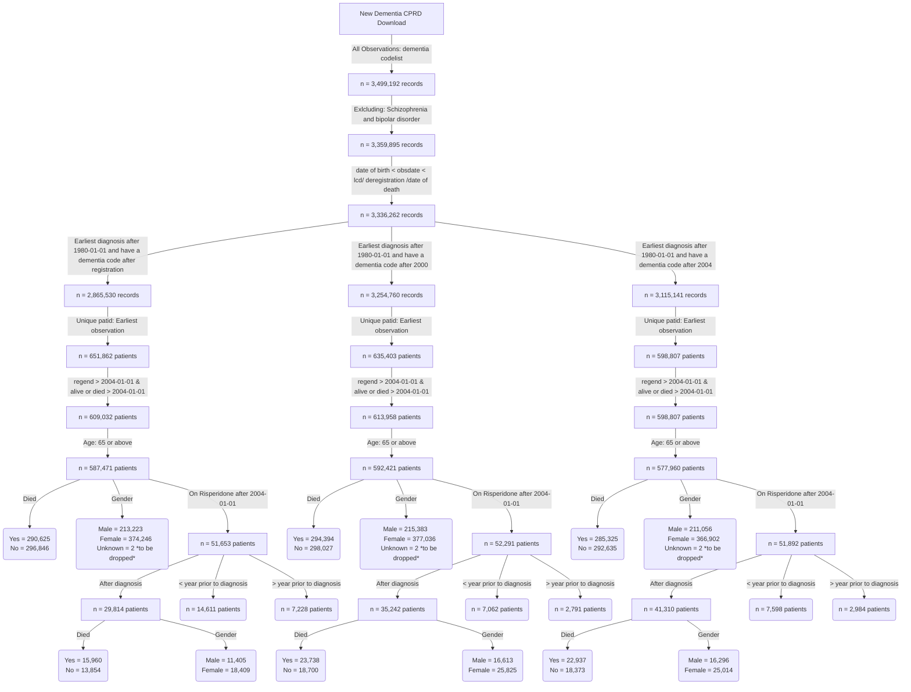

**This is the distribution of number of diagnosis per year for patients diagnosed after registration**


**This is the distribution of number of diagnosis per year for patients diagnosed after 2000**


**This is the distribution of number of prescriptions per year for patients diagnosed after 2004**


**BMJ codes vs ours**


```
BMJ codes	279
Our codes	631
Common codes	86
```
**Flow chart of the final cohorts**


**Dementia incident cohort**


```
                                             
                                             
                                              Overall       
  n                                           353255        
  diagnosedbeforeRegistration = 1 (%)          77403 (21.9) 
  died = 1 (%)                                174204 (49.3) 
  age_diagnosis (mean (SD))                    82.25 (7.10) 
  age_category (%)                                          
     65-74                                     53220 (15.1) 
     75-84                                    159585 (45.2) 
     85-94                                    128631 (36.4) 
     95+                                       11819 ( 3.3) 
  year_of_diagnosis (%)                                     
     2004                                      17502 ( 5.0) 
     2005                                      14865 ( 4.2) 
     2006                                      16620 ( 4.7) 
     2007                                      14520 ( 4.1) 
     2008                                      14931 ( 4.2) 
     2009                                      16317 ( 4.6) 
     2010                                      17437 ( 4.9) 
     2011                                      18395 ( 5.2) 
     2012                                      20029 ( 5.7) 
     2013                                      21675 ( 6.1) 
     2014                                      23469 ( 6.6) 
     2015                                      23301 ( 6.6) 
     2016                                      20765 ( 5.9) 
     2017                                      20374 ( 5.8) 
     2018                                      19268 ( 5.5) 
     2019                                      18785 ( 5.3) 
     2020                                      14879 ( 4.2) 
     2021                                      15410 ( 4.4) 
     2022                                      14326 ( 4.1) 
     2023                                      10387 ( 2.9) 
  gender_decode = M (%)                       122481 (34.7) 
  pre_diagnoses_af = 1 (%)                     46688 (13.2) 
  post_diagnoses_af = 1 (%)                    22901 ( 6.5) 
  af_ever = 1 (%)                              71047 (20.1) 
  pre_diagnoses_angina = 1 (%)                 38974 (11.0) 
  post_diagnoses_angina = 1 (%)                 4583 ( 1.3) 
  angina_ever = 1 (%)                          43776 (12.4) 
  pre_diagnoses_anxiety_disorders = 1 (%)      52839 (15.0) 
  post_diagnoses_anxiety_disorders = 1 (%)      8377 ( 2.4) 
  anxiety_disorders_ever = 1 (%)               61794 (17.5) 
  pre_diagnoses_falls = 1 (%)                  88512 (25.1) 
  post_diagnoses_falls = 1 (%)                 97633 (27.6) 
  falls_ever = 1 (%)                          188256 (53.3) 
  pre_diagnoses_fh_diabetes = 1 (%)            70720 (20.0) 
  post_diagnoses_fh_diabetes = 1 (%)            4579 ( 1.3) 
  fh_diabetes_ever = 1 (%)                     75477 (21.4) 
  heartfailure_ever = 1 (%)                    41583 (11.8) 
  pre_diagnoses_lowerlimbfracture = 1 (%)      43571 (12.3) 
  post_diagnoses_lowerlimbfracture = 1 (%)     26109 ( 7.4) 
  lowerlimbfracture_ever = 1 (%)               70334 (19.9) 
  pre_diagnoses_myocardialinfarction = 1 (%)   26861 ( 7.6) 
  post_diagnoses_myocardialinfarction = 1 (%)   5709 ( 1.6) 
  myocardialinfarction_ever = 1 (%)            32860 ( 9.3) 
  pre_diagnoses_qof_diabetes = 1 (%)           47756 (13.5) 
  post_diagnoses_qof_diabetes = 1 (%)          18426 ( 5.2) 
  qof_diabetes_ever = 1 (%)                    67059 (19.0) 
  pre_diagnoses_revasc = 1 (%)                 18445 ( 5.2) 
  post_diagnoses_revasc = 1 (%)                  832 ( 0.2) 
  revasc_ever = 1 (%)                          19332 ( 5.5) 
  pre_diagnoses_stroke = 1 (%)                 38087 (10.8) 
  post_diagnoses_stroke = 1 (%)                16028 ( 4.5) 
  stroke_ever = 1 (%)                          55527 (15.7) 
  pre_diagnoses_tia = 1 (%)                    29408 ( 8.3) 
  post_diagnoses_tia = 1 (%)                    9919 ( 2.8) 
  tia_ever = 1 (%)                             39813 (11.3) 
  alcohol_cat (%)                                           
     Excess                                    17897 ( 5.1) 
     Harmful                                    9010 ( 2.6) 
     None                                      33247 ( 9.4) 
     Unknown                                   98566 (27.9) 
     Within limits                            194535 (55.1) 
  smoking_cat (%)                                           
     Active smoker                             28397 ( 8.0) 
     Ex-smoker                                141985 (40.2) 
     Non-smoker                               114276 (32.3) 
     Unknown                                   68597 (19.4) 
  qrisk2_smoking_cat (%)                                    
     0                                        152478 (43.2) 
     1                                         88230 (25.0) 
     2                                         27182 ( 7.7) 
     3                                           942 ( 0.3) 
     4                                           693 ( 0.2) 
     Unknown                                   83730 (23.7) 
  qrisk2_smoking_cat_uncoded (%)                            
     Ex-smoker                                 88230 (25.0) 
     Heavy smoker                                693 ( 0.2) 
     Light smoker                              27182 ( 7.7) 
     Moderate smoker                             942 ( 0.3) 
     Non-smoker                               152478 (43.2) 
     Unknown                                   83730 (23.7) 
  gp_5cat_ethnicity (%)                                     
     Black                                      6004 ( 1.7) 
     Mixed                                      1063 ( 0.3) 
     Other                                      1687 ( 0.5) 
     South Asian                                6953 ( 2.0) 
     Unknown                                   91545 (25.9) 
     White                                    246003 (69.6) 
  gp_16cat_ethnicity (%)                                    
     African                                    1101 ( 0.3) 
     Bangladeshi                                 628 ( 0.2) 
     Caribbean                                  4368 ( 1.2) 
     Chinese                                     378 ( 0.1) 
     Indian                                     3507 ( 1.0) 
     Other                                      1324 ( 0.4) 
     Other Asian                                1372 ( 0.4) 
     Other Black                                 483 ( 0.1) 
     Other Mixed                                 287 ( 0.1) 
     Other White                                7423 ( 2.1) 
     Pakistani                                  1399 ( 0.4) 
     Unknown                                   91821 (26.0) 
     White and Asian                             133 ( 0.0) 
     White and Black African                     165 ( 0.0) 
     White and Black Caribbean                   487 ( 0.1) 
     White British                            234396 (66.4) 
     White Irish                                3983 ( 1.1) 
  gp_qrisk2_ethnicity (%)                                   
     Bangladeshi                                 628 ( 0.2) 
     Black African                              1091 ( 0.3) 
     Black Caribbean                            4345 ( 1.2) 
     Chinese                                     376 ( 0.1) 
     Indian                                     3504 ( 1.0) 
     Other                                      2945 ( 0.8) 
     Other Asian                                1364 ( 0.4) 
     Pakistani                                  1398 ( 0.4) 
     Unknown                                   91614 (25.9) 
     White                                    245990 (69.6) 
  pre_diagnoses_deep_vein_thrombosis = 1 (%)   14894 ( 4.2) 
  post_diagnoses_deep_vein_thrombosis = 1 (%)   6581 ( 1.9) 
  deep_vein_thrombosis_ever = 1 (%)            21662 ( 6.1) 
  pre_diagnoses_pulmonary_embolism = 1 (%)      7555 ( 2.1) 
  post_diagnoses_pulmonary_embolism = 1 (%)     3213 ( 0.9) 
  pulmonary_embolism_ever = 1 (%)              10883 ( 3.1) 
  VTE = 1 (%)                                  10883 ( 3.1)  

```


```
           strata   median    lower    upper
1 gender_decode=F 5.037645 5.010267 5.067762
2 gender_decode=M 4.350445 4.314853 4.386037
```


```
               strata   median    lower    upper
1 age_category=65-74 7.882272 7.800137 7.972621
2 age_category=75-84 5.505818 5.470226 5.538672
3 age_category=85-94 3.340178 3.318275 3.364819
4   age_category=95+ 1.711157 1.642710 1.757700

```

**Risperidone incident cohort**
```
                                                         Overall        
  n                                                        23959         
  diagnosedbeforeRegistration = 1 (%)                      10457 ( 43.6) 
  died = 1 (%)                                             13638 ( 56.9) 
  age_risperidone (mean (SD))                              82.89 (6.93)  
  age_category (%)                                                       
     65 - 74                                                5399 ( 22.5) 
     75 - 84                                               11459 ( 47.8) 
     85+                                                    7101 ( 29.6) 
  stroke_3_months_prior = 1 (%)                              123 (  0.5) 
  stroke_6_months_prior = 1 (%)                              181 (  0.8) 
  stroke_12_months_prior = 1 (%)                             289 (  1.2) 
  prescribed_BMJ_antipsyc_drug = 1 (%)                     20545 ( 85.8) 
  stroke_recency_cat (%)                                                 
      <= 1                                                   289 ( 10.1) 
      > 7                                                   2403 ( 84.3) 
     1 - 2                                                   113 (  4.0) 
     2 - 3                                                    41 (  1.4) 
     3 - 4                                                     3 (  0.1) 
  Stroke_prior_to_risperidone = 1 (%)                       2687 ( 11.2) 
  Stroke__within_year_after_1st_risperidone_presc = 1 (%)    325 (  1.4) 
  death_in_a_year_after_risperidone = 1 (%)                 5550 ( 23.2) 
  sex = 1 (%)                                               9065 ( 37.8) 
  dementia_duration_prior_risperidone (mean (SD))           2.10 (2.33)  
  Survival_time (mean (SD))                                 1.77 (1.90)  
  comorbidity_af = 1 (%)                                    4184 ( 17.5) 
  pre_index_date_af = 1 (%)                                 3743 ( 15.6) 
  post_index_date_af = 1 (%)                                1416 (  5.9) 
  comorbidity_angina = 1 (%)                                2821 ( 11.8) 
  pre_index_date_angina = 1 (%)                             2754 ( 11.5) 
  post_index_date_angina = 1 (%)                             265 (  1.1) 
  comorbidity_anxiety_disorders = 1 (%)                     4885 ( 20.4) 
  pre_index_date_anxiety_disorders = 1 (%)                  4679 ( 19.5) 
  post_index_date_anxiety_disorders = 1 (%)                  546 (  2.3) 
  comorbidity_falls = 1 (%)                                13329 ( 55.6) 
  pre_index_date_falls = 1 (%)                              9596 ( 40.1) 
  post_index_date_falls = 1 (%)                             7092 ( 29.6) 
  comorbidity_fh_diabetes = 1 (%)                           4745 ( 19.8) 
  pre_index_date_fh_diabetes = 1 (%)                        4673 ( 19.5) 
  post_index_date_fh_diabetes = 1 (%)                        103 (  0.4) 
  comorbidity_fh_premature_cvd = 1 (%)                      1814 (  7.6) 
  pre_index_date_fh_premature_cvd = 1 (%)                   1790 (  7.5) 
  post_index_date_fh_premature_cvd = 1 (%)                    35 (  0.1) 
  comorbidity_heartfailure = 1 (%)                          2116 (  8.8) 
  pre_index_date_heartfailure = 1 (%)                       1800 (  7.5) 
  post_index_date_heartfailure = 1 (%)                       698 (  2.9) 
  comorbidity_lowerlimbfracture = 1 (%)                     4962 ( 20.7) 
  pre_index_date_lowerlimbfracture = 1 (%)                  3726 ( 15.6) 
  post_index_date_lowerlimbfracture = 1 (%)                 1563 (  6.5) 
  comorbidity_myocardialinfarction = 1 (%)                  2023 (  8.4) 
  pre_index_date_myocardialinfarction = 1 (%)               1910 (  8.0) 
  post_index_date_myocardialinfarction = 1 (%)               208 (  0.9) 
  comorbidity_qof_diabetes = 1 (%)                          4307 ( 18.0) 
  pre_index_date_qof_diabetes = 1 (%)                       4055 ( 16.9) 
  post_index_date_qof_diabetes = 1 (%)                      1898 (  7.9) 
  comorbidity_revasc = 1 (%)                                1263 (  5.3) 
  pre_index_date_revasc = 1 (%)                             1257 (  5.2) 
  post_index_date_revasc = 1 (%)                              19 (  0.1) 
  comorbidity_stroke = 1 (%)                                3326 ( 13.9) 
  pre_index_date_stroke = 1 (%)                             2849 ( 11.9) 
  post_index_date_stroke = 1 (%)                             846 (  3.5) 
  stroke_cat = ischaemic (%)                                2838 ( 85.3) 
  comorbidity_tia = 1 (%)                                   2522 ( 10.5) 
  pre_index_date_tia = 1 (%)                                2159 (  9.0) 
  post_index_date_tia = 1 (%)                                553 (  2.3) 
  comorbidity_deep_vein_thrombosis = 1 (%)                  1552 (  6.5) 
  pre_index_date_deep_vein_thrombosis = 1 (%)               1174 (  4.9) 
  post_index_date_deep_vein_thrombosis = 1 (%)               448 (  1.9) 
  comorbidity_haem_cancer = 0 (%)                          23959 (100.0) 
  pre_index_date_haem_cancer = 0 (%)                       23959 (100.0) 
  post_index_date_haem_cancer = 0 (%)                      23959 (100.0) 
  comorbidity_pulmonary_embolism = 1 (%)                     712 (  3.0) 
  pre_index_date_pulmonary_embolism = 1 (%)                  541 (  2.3) 
  post_index_date_pulmonary_embolism = 1 (%)                 203 (  0.8) 
  comorbidity_solid_cancer = 0 (%)                         23959 (100.0) 
  pre_index_date_solid_cancer = 0 (%)                      23959 (100.0) 
  post_index_date_solid_cancer = 0 (%)                     23959 (100.0) 
  VTE = 1 (%)                                               2107 (  8.8) 
  BMI (%)                                                                
     Normal                                                 8721 ( 36.4) 
     Obesity                                                3074 ( 12.8) 
     Overweight                                             6731 ( 28.1) 
     Severely Obese                                          226 (  0.9) 
     Underweight                                            1093 (  4.6) 
     Unknown                                                4114 ( 17.2) 
  totalcholesterol (%)                                                   
     < 160 mg/dl                                            5288 ( 22.1) 
     > 280 mg/dl                                             843 (  3.5) 
     199 mg/dl                                              5957 ( 24.9) 
     200 - 239 mg/dl                                        5119 ( 21.4) 
     240 - 279 mg/dl                                        2287 (  9.5) 
     Unknown                                                4465 ( 18.6) 
  testvalue_dbp (mean (SD))                                76.37 (11.78) 
  testvalue_sbp (mean (SD))                               135.79 (20.34) 
  testvalue_totalcholesterol (mean (SD))                    4.99 (1.25)  
  gp_5cat_ethnicity (%)                                                  
     Black                                                   359 (  1.5) 
     Mixed                                                    78 (  0.3) 
     Other                                                   123 (  0.5) 
     South Asian                                             385 (  1.6) 
     Unknown                                                5730 ( 23.9) 
     White                                                 17284 ( 72.1) 
  gp_16cat_ethnicity (%)                                                 
     African                                                  62 (  0.3) 
     Bangladeshi                                              29 (  0.1) 
     Caribbean                                               254 (  1.1) 
     Chinese                                                  18 (  0.1) 
     Indian                                                  195 (  0.8) 
     Other                                                   107 (  0.4) 
     Other Asian                                              72 (  0.3) 
     Other Black                                              41 (  0.2) 
     Other Mixed                                              17 (  0.1) 
     Other White                                             545 (  2.3) 
     Pakistani                                                84 (  0.4) 
     Unknown                                                5750 ( 24.0) 
     White and Asian                                          14 (  0.1) 
     White and Black African                                   8 (  0.0) 
     White and Black Caribbean                                38 (  0.2) 
     White British                                         16473 ( 68.8) 
     White Irish                                             252 (  1.1) 
  gp_qrisk2_ethnicity (%)                                                
     Bangladeshi                                              29 (  0.1) 
     Black African                                            62 (  0.3) 
     Black Caribbean                                         254 (  1.1) 
     Chinese                                                  18 (  0.1) 
     Indian                                                  195 (  0.8) 
     Other                                                   225 (  0.9) 
     Other Asian                                              71 (  0.3) 
     Pakistani                                                84 (  0.4) 
     Unknown                                                5737 ( 23.9) 
     White                                                 17284 ( 72.1) 
  alcohol_cat (%)                                                        
     Excess                                                 1153 (  4.8) 
     Harmful                                                 655 (  2.7) 
     None                                                   1790 (  7.5) 
     Unknown                                                8600 ( 35.9) 
     Within limits                                         11761 ( 49.1) 
  smoking_cat (%)                                                        
     Active smoker                                          1657 (  6.9) 
     Ex-smoker                                              8759 ( 36.6) 
     Non-smoker                                             6662 ( 27.8) 
     Unknown                                                6881 ( 28.7) 
  qrisk2_smoking_cat (%)                                                 
     0                                                      8781 ( 36.7) 
     1                                                      5697 ( 23.8) 
     2                                                      1627 (  6.8) 
     3                                                        58 (  0.2) 
     4                                                        30 (  0.1) 
     Unknown                                                7766 ( 32.4) 
  qrisk2_smoking_cat_uncoded (%)                                         
     Ex-smoker                                              5697 ( 23.8) 
     Heavy smoker                                             30 (  0.1) 
     Light smoker                                           1627 (  6.8) 
     Moderate smoker                                          58 (  0.2) 
     Non-smoker                                             8781 ( 36.7) 
     Unknown                                                7766 ( 32.4) 
  drug_name (%)                                                          
     amisulpride                                             245 (  2.0) 
     aripiprazole                                            212 (  1.8) 
     benperidol                                                9 (  0.1) 
     chlorpromazine                                          124 (  1.0) 
     clozapine                                                 1 (  0.0) 
     flupentixol                                             171 (  1.4) 
     fluphenazine                                              7 (  0.1) 
     haloperidol                                            1726 ( 14.3) 
     levomepromazine                                        1448 ( 12.0) 
     olanzapine                                              859 (  7.1) 
     pericyazine                                              18 (  0.1) 
     perphenazine                                              3 (  0.0) 
     pimozide                                                133 (  1.1) 
     prochlorperazine                                       4949 ( 41.1) 
     promazine                                               337 (  2.8) 
     quetiapine                                             1555 ( 12.9) 
     sulpiride                                                45 (  0.4) 
     thioridazine                                             71 (  0.6) 
     trifluoperazine                                         109 (  0.9) 
     zuclopenthixol                                            9 (  0.1) 
  frailty (%)                                                            
     Mild                                                   1118 (  4.7) 
     Moderate                                               2745 ( 11.5) 
     Severe                                                 4196 ( 17.5) 
     Unknown                                               15900 ( 66.4) 
  year_diagnosis_cat (%)                                                 
     > 2020                                                  934 (  3.9) 
     2004 - 2008                                            4214 ( 17.6) 
     2009 - 2012                                            6330 ( 26.4) 
     2013 - 2016                                            7606 ( 31.7) 
     2017 - 2020                                            4875 ( 20.3) 
  prescribed_other_antipsyc_drug = 1 (%)                   12031 ( 50.2) 
  pre_indexdate_antipysch_prescr = 1 (%)                    7990 ( 66.4) 
  post_indexdate_antipysch_prescr = 1 (%)                   3973 ( 33.0) 
  same_indexdate_antipysch_prescr = 1 (%)                     68 (  0.6) 
  pre_indexdate_drug_name (%)                                            
     amisulpride                                             151 (  1.9) 
     aripiprazole                                             62 (  0.8) 
     benperidol                                                6 (  0.1) 
     chlorpromazine                                           97 (  1.2) 
     clozapine                                                 1 (  0.0) 
     flupentixol                                             159 (  2.0) 
     fluphenazine                                              7 (  0.1) 
     haloperidol                                             727 (  9.1) 
     levomepromazine                                          66 (  0.8) 
     olanzapine                                              477 (  6.0) 
     pericyazine                                              17 (  0.2) 
     perphenazine                                              3 (  0.0) 
     pimozide                                                 92 (  1.2) 
     prochlorperazine                                       4679 ( 58.6) 
     promazine                                               253 (  3.2) 
     quetiapine                                              991 ( 12.4) 
     sulpiride                                                34 (  0.4) 
     thioridazine                                             71 (  0.9) 
     trifluoperazine                                          92 (  1.2) 
     zuclopenthixol                                            5 (  0.1) 
  same_indexdate_drug_name (%)                                           
     amisulpride                                               2 (  2.9) 
     aripiprazole                                              6 (  8.8) 
     chlorpromazine                                            4 (  5.9) 
     flupentixol                                               2 (  2.9) 
     haloperidol                                              14 ( 20.6) 
     levomepromazine                                           1 (  1.5) 
     pimozide                                                  7 ( 10.3) 
     prochlorperazine                                          4 (  5.9) 
     promazine                                                10 ( 14.7) 
     quetiapine                                               16 ( 23.5) 
     trifluoperazine                                           2 (  2.9) 
  post_indexdate_drug_name (%)                                           
     amisulpride                                              89 (  2.2) 
     aripiprazole                                            139 (  3.5) 
     benperidol                                                2 (  0.1) 
     chlorpromazine                                           23 (  0.6) 
     flupentixol                                              10 (  0.3) 
     haloperidol                                            1110 ( 27.9) 
     levomepromazine                                        1245 ( 31.3) 
     olanzapine                                              372 (  9.4) 
     pericyazine                                               3 (  0.1) 
     pimozide                                                 33 (  0.8) 
     prochlorperazine                                        257 (  6.5) 
     promazine                                                87 (  2.2) 
     quetiapine                                              579 ( 14.6) 
     sulpiride                                                 8 (  0.2) 
     trifluoperazine                                          12 (  0.3) 
     zuclopenthixol                                            4 (  0.1) 
  care_home = 1 (%)                                         9947 ( 41.5) 
  care_home_before_indexdate = 1 (%)                        3206 ( 32.2) 
  care_home_at_indexdate = 1 (%)                             110 (  1.1) 
  care_home_90_days_after_indexdate = 1 (%)                 2186 ( 22.0) 
  TimeSinceFirstPrescription (mean (SD))                    0.47 (0.89)  
  Prescription_ever_cat (%)                                              
     >100                                                    435 (  1.8) 
     1                                                      4038 ( 16.9) 
     10                                                      619 (  2.6) 
     11 - 20                                                4126 ( 17.2) 
     2                                                      2095 (  8.7) 
     21 - 30                                                2212 (  9.2) 
     3                                                      1525 (  6.4) 
     31 - 40                                                1302 (  5.4) 
     4                                                      1262 (  5.3) 
     41 - 50                                                 788 (  3.3) 
     5                                                      1035 (  4.3) 
     51 - 100                                               1346 (  5.6) 
     6                                                       900 (  3.8) 
     7                                                       831 (  3.5) 
     8                                                       749 (  3.1) 
     9                                                       696 (  2.9) 
  Prescriptions_after_a_year_cat (%)                                     
     >100                                                    238 (  3.0) 
     1                                                       550 (  6.9) 
     10                                                      237 (  3.0) 
     11 - 20                                                1705 ( 21.3) 
     2                                                       493 (  6.2) 
     21 - 30                                                 957 ( 12.0) 
     3                                                       435 (  5.4) 
     31 - 40                                                 609 (  7.6) 
     4                                                       379 (  4.7) 
     41 - 50                                                 391 (  4.9) 
     5                                                       335 (  4.2) 
     51 - 100                                                579 (  7.2) 
     6                                                       306 (  3.8) 
     7                                                       300 (  3.8) 
     8                                                       242 (  3.0) 
     9                                                       242 (  3.0) 
  Prescriptions_within_a_year_cat (%)                                    
     >100                                                     10 (  0.0) 
     1                                                      4202 ( 17.5) 
     10                                                      767 (  3.2) 
     11 - 20                                                7623 ( 31.8) 
     2                                                      2168 (  9.0) 
     21 - 30                                                 673 (  2.8) 
     3                                                      1582 (  6.6) 
     31 - 40                                                 247 (  1.0) 
     4                                                      1320 (  5.5) 
     41 - 50                                                 219 (  0.9) 
     5                                                      1105 (  4.6) 
     51 - 100                                                422 (  1.8) 
     6                                                       999 (  4.2) 
     7                                                       970 (  4.0) 
     8                                                       860 (  3.6) 
     9                                                       792 (  3.3) 
  consultation_counts_Cat (%)                                            
     0 - 50                                                 8858 ( 37.5) 
     101 - 150                                              3996 ( 16.9) 
     151 - 200                                              1410 (  6.0) 
     201 - 250                                               525 (  2.2) 
     251 - 300                                               223 (  0.9) 
     301 - 350                                                86 (  0.4) 
     351 - 400                                                37 (  0.2) 
     401 - 450                                                23 (  0.1) 
     451 - 500                                                16 (  0.1) 
     501 - 800                                                20 (  0.1) 
     51 - 100                                               8440 ( 35.7) 
     801 - 1000                                                3 (  0.0) 
  pre_BMJ_indexdate_drug_name (%)                                        
     amisulpride                                             137 (  8.9) 
     aripiprazole                                             14 (  0.9) 
     benperidol                                                6 (  0.4) 
     chlorpromazine                                           97 (  6.3) 
     clozapine                                                 1 (  0.1) 
     flupentixol                                             100 (  6.5) 
     fluphenazine                                              6 (  0.4) 
     haloperidol                                             679 ( 44.0) 
     levomepromazine                                           5 (  0.3) 
     olanzapine                                               39 (  2.5) 
     pericyazine                                              17 (  1.1) 
     pimozide                                                  5 (  0.3) 
     prochlorperazine                                        272 ( 17.6) 
     promazine                                                40 (  2.6) 
     quetiapine                                               57 (  3.7) 
     sulpiride                                                14 (  0.9) 
     thioridazine                                             26 (  1.7) 
     trifluoperazine                                          26 (  1.7) 
     zuclopenthixol                                            1 (  0.1) 
  same_BMJ_indexdate_drug_name (%)                                       
     amisulpride                                              72 (  0.9) 
     aripiprazole                                            153 (  1.9) 
     benperidol                                                2 (  0.0) 
     chlorpromazine                                           24 (  0.3) 
     flupentixol                                              52 (  0.6) 
     fluphenazine                                              1 (  0.0) 
     haloperidol                                             923 ( 11.2) 
     levomepromazine                                        1025 ( 12.4) 
     olanzapine                                              620 (  7.5) 
     pericyazine                                               3 (  0.0) 
     perphenazine                                              3 (  0.0) 
     pimozide                                                104 (  1.3) 
     prochlorperazine                                       3761 ( 45.6) 
     promazine                                               234 (  2.8) 
     quetiapine                                             1150 ( 14.0) 
     sulpiride                                                20 (  0.2) 
     thioridazine                                             37 (  0.4) 
     trifluoperazine                                          54 (  0.7) 
     zuclopenthixol                                            3 (  0.0) 
  post_BMJ_indexdate_drug_name (%)                                       
     amisulpride                                              26 (  3.8) 
     aripiprazole                                             17 (  2.5) 
     chlorpromazine                                            3 (  0.4) 
     flupentixol                                               7 (  1.0) 
     haloperidol                                             117 ( 16.9) 
     levomepromazine                                          73 ( 10.5) 
     olanzapine                                               57 (  8.2) 
     pimozide                                                  7 (  1.0) 
     prochlorperazine                                        248 ( 35.8) 
     promazine                                                18 (  2.6) 
     quetiapine                                              106 ( 15.3) 
     sulpiride                                                 3 (  0.4) 
     trifluoperazine                                           8 (  1.2) 
     zuclopenthixol                                            3 (  0.4) 
  comorbidity_hypertension (%)                                           
     Elevated                                               2656 ( 11.1) 
     Normal                                                 3378 ( 14.1) 
     Stage 1                                               10539 ( 44.0) 
     Stage 2                                                6865 ( 28.7) 
     Stage 3 (severe)                                        155 (  0.6) 
     Unknown                                                 366 (  1.5) 
  pre_index_date_hypertension = 1 (%)                      19705 ( 83.5) 
  comorbidity_hearing_loss = 1 (%)                          6561 ( 27.4) 
  pre_index_date_hearing_loss = 1 (%)                       6163 ( 25.7) 
  post_index_date_hearing_loss = 1 (%)                       868 (  3.6) 
  pre_indexdate_BMJ_antipysch_prescr = 1 (%)                1553 (  7.6) 
  post_indexdate_BMJ_antipysch_prescr = 1 (%)               1392 (  6.8) 
  same_indexdate_BMJ_antipysch_prescr = 1 (%)              17600 ( 85.7) 
                               
```


```
           strata   median    lower    upper
1 gender_decode=F 2.483231 2.417522 2.562628
2 gender_decode=M 1.957563 1.905544 2.031485
```


```
                strata   median    lower    upper
1 age_category=65 - 74 3.586585 3.416838 3.712526
2 age_category=75 - 84 2.447639 2.373717 2.513347
3     age_category=85+ 1.464750 1.401780 1.527721

```


**COX model**
```
Call:
coxph(formula = Surv(Survival_time, post_index_date_stroke) ~ 
    age_diagnosis + pre_index_date_stroke + sex, data = CompleteData)

  n= 23959, number of events= 846 

                           coef exp(coef) se(coef)      z Pr(>|z|)    
age_diagnosis          0.013706  1.013801 0.005042  2.719  0.00656 ** 
pre_index_date_stroke1 1.903718  6.710798 0.069880 27.243  < 2e-16 ***
sex1                   0.174512  1.190665 0.072553  2.405  0.01616 *  
---
Signif. codes:  0 ‘***’ 0.001 ‘**’ 0.01 ‘*’ 0.05 ‘.’ 0.1 ‘ ’ 1

                       exp(coef) exp(-coef) lower .95 upper .95
age_diagnosis              1.014     0.9864     1.004     1.024
pre_index_date_stroke1     6.711     0.1490     5.852     7.696
sex1                       1.191     0.8399     1.033     1.373

Concordance= 0.726  (se = 0.011 )
Likelihood ratio test= 640.9  on 3 df,   p=<2e-16
Wald test            = 776.8  on 3 df,   p=<2e-16
Score (logrank) test = 1043  on 3 df,   p=<2e-16

```


**One year censoring**

```
Call:
coxph(formula = Surv(Survival_time, post_index_date_stroke) ~ 
    age_diagnosis + pre_index_date_stroke + sex, data = CensoringData_1year)

  n= 23940, number of events= 501 
   (19 observations deleted due to missingness)

                           coef exp(coef) se(coef)      z Pr(>|z|)    
age_diagnosis          0.010646  1.010703 0.006488  1.641   0.1008    
pre_index_date_stroke1 2.196622  8.994583 0.090048 24.394   <2e-16 ***
sex1                   0.199762  1.221113 0.092650  2.156   0.0311 *  
---
Signif. codes:  0 ‘***’ 0.001 ‘**’ 0.01 ‘*’ 0.05 ‘.’ 0.1 ‘ ’ 1

                       exp(coef) exp(-coef) lower .95 upper .95
age_diagnosis              1.011     0.9894    0.9979     1.024
pre_index_date_stroke1     8.995     0.1112    7.5393    10.731
sex1                       1.221     0.8189    1.0183     1.464

Concordance= 0.742  (se = 0.013 )
Likelihood ratio test= 546.2  on 3 df,   p=<2e-16
Wald test            = 619.1  on 3 df,   p=<2e-16
Score (logrank) test = 915.7  on 3 df,   p=<2e-16
```

**Excluding stroke 3 months prior**


```
Call:
coxph(formula = Surv(Survival_time, post_index_date_stroke) ~ 
    age_diagnosis + pre_index_date_stroke + sex, data = Excluding_3_monthsPriorStroke)

  n= 23836, number of events= 789 

                           coef exp(coef) se(coef)      z Pr(>|z|)    
age_diagnosis          0.017014  1.017160 0.005212  3.264   0.0011 ** 
pre_index_date_stroke1 1.769601  5.868512 0.073380 24.116   <2e-16 ***
sex1                   0.176362  1.192870 0.075323  2.341   0.0192 *  
---
Signif. codes:  0 ‘***’ 0.001 ‘**’ 0.01 ‘*’ 0.05 ‘.’ 0.1 ‘ ’ 1

                       exp(coef) exp(-coef) lower .95 upper .95
age_diagnosis              1.017     0.9831     1.007     1.028
pre_index_date_stroke1     5.869     0.1704     5.082     6.776
sex1                       1.193     0.8383     1.029     1.383

Concordance= 0.706  (se = 0.011 )
Likelihood ratio test= 499.9  on 3 df,   p=<2e-16
Wald test            = 615.9  on 3 df,   p=<2e-16
Score (logrank) test = 794.9  on 3 df,   p=<2e-16


```


**Excluding stroke 12 months prior**


```
Call:
coxph(formula = Surv(Survival_time, post_index_date_stroke) ~ 
    age_diagnosis + pre_index_date_stroke + sex, data = Excluding_12_monthsPriorStroke)

  n= 23670, number of events= 744 

                           coef exp(coef) se(coef)      z Pr(>|z|)    
age_diagnosis          0.019554  1.019747 0.005376  3.637 0.000276 ***
pre_index_date_stroke1 1.663083  5.275553 0.076970 21.607  < 2e-16 ***
sex1                   0.184390  1.202484 0.077672  2.374 0.017598 *  
---
Signif. codes:  0 ‘***’ 0.001 ‘**’ 0.01 ‘*’ 0.05 ‘.’ 0.1 ‘ ’ 1

                       exp(coef) exp(-coef) lower .95 upper .95
age_diagnosis              1.020     0.9806     1.009     1.031
pre_index_date_stroke1     5.276     0.1896     4.537     6.135
sex1                       1.202     0.8316     1.033     1.400

Concordance= 0.689  (se = 0.012 )
Likelihood ratio test= 401.8  on 3 df,   p=<2e-16
Wald test            = 501  on 3 df,   p=<2e-16
Score (logrank) test = 627.7  on 3 df,   p=<2e-16

```


**Matching**


```

                                             Stratified by risperidone
                                               0              1              p      test SMD   
  n                                            160934         32366                            
  sex = 1 (%)                                   65663 (40.8)  13190 ( 40.8)   0.876       0.001
  risperidone = 1 (%)                               0 ( 0.0)  32366 (100.0)  <0.001         NaN
  age_diagnosis (mean (SD))                     80.45 (7.00)  80.55 (7.14)    0.020       0.014
  pre_index_date_angina = 1 (%)                 18921 (11.8)   3809 ( 11.8)   0.961      <0.001
  pre_index_date_heartfailure = 1 (%)           12120 ( 7.5)   2466 (  7.6)   0.592       0.003
  BMI (%)                                                                     0.939       0.007
     Missing                                    79893 (49.6)  15983 ( 49.4)                    
     Normal                                     40249 (25.0)   8154 ( 25.2)                    
     Obesity                                     9181 ( 5.7)   1869 (  5.8)                    
     Overweight                                 23341 (14.5)   4716 ( 14.6)                    
     Severely Obese                               564 ( 0.4)    114 (  0.4)                    
     Underweight                                 7706 ( 4.8)   1530 (  4.7)                    
  Prescribed_other_antipsychotic_Prior = 1 (%)  38054 (23.6)   7328 ( 22.6)  <0.001       0.024
  period_before_prescription (mean (SD))         2.47 (2.02)   2.39 (2.35)   <0.001       0.035
  comorbidity_myocardialinfarction = 1 (%)      13539 ( 8.4)   2749 (  8.5)   0.641       0.003
  pre_index_date_stroke = 1 (%)                 18965 (11.8)   3870 ( 12.0)   0.385       0.005
  pre_index_date_tia = 1 (%)                    14928 ( 9.3)   2982 (  9.2)   0.731       0.002
  pre_index_date_falls = 1 (%)                  65985 (41.0)  13261 ( 41.0)   0.927       0.001
  pre_index_date_lowerlimbfracture = 1 (%)      24916 (15.5)   5019 ( 15.5)   0.917       0.001
  pre_index_date_ihd = 1 (%)                    26772 (16.6)   5407 ( 16.7)   0.763       0.002
  pre_index_date_pad = 1 (%)                    12065 ( 7.5)   2447 (  7.6)   0.701       0.002
  pre_index_date_af = 1 (%)                     26035 (16.2)   5327 ( 16.5)   0.214       0.008
  pre_index_date_revasc = 1 (%)                  8995 ( 5.6)   1825 (  5.6)   0.734       0.002
  pre_index_date_qof_diabetes = 1 (%)           27982 (17.4)   5660 ( 17.5)   0.670       0.003
  pre_index_date_anxiety_disorders = 1 (%)      32234 (20.0)   6367 ( 19.7)   0.144       0.009
  pre_index_date_fh_diabetes = 1 (%)            32634 (20.3)   6496 ( 20.1)   0.401       0.005
  pre_index_date_fh_premature_cvd = 1 (%)       12223 ( 7.6)   2444 (  7.6)   0.794       0.002
  pre_index_date_pulmonary_embolism = 1 (%)      4167 ( 2.6)    837 (  2.6)   0.989      <0.001
  pre_index_date_deep_vein_thrombosis = 1 (%)    8172 ( 5.1)   1639 (  5.1)   0.928       0.001
  pre_index_date_haem_cancer = 1 (%)             3109 ( 1.9)    609 (  1.9)   0.563       0.004
  pre_index_date_solid_cancer = 1 (%)           26152 (16.3)   5282 ( 16.3)   0.764       0.002
  pre_index_date_hearing_loss = 1 (%)           42296 (26.3)   8566 ( 26.5)   0.496       0.004
  VTE = 1 (%)                                   12358 ( 7.7)   2465 (  7.6)   0.706       0.002
  gp_5cat_ethnicity (%)                                                       0.753       0.010
     Black                                       2141 ( 1.3)    417 (  1.3)                    
     Mixed                                        460 ( 0.3)     84 (  0.3)                    
     Other                                        800 ( 0.5)    151 (  0.5)                    
     South Asian                                 2435 ( 1.5)    468 (  1.4)                    
     Unknown                                    36294 (22.6)   7352 ( 22.7)                    
     White                                     118804 (73.8)  23894 ( 73.8)                    
  comorbidity_hypertension (%)                                               <0.001       0.043
     Elevated                                   30989 (19.3)   6314 ( 19.5)                    
     Normal                                     60139 (37.4)  12259 ( 37.9)                    
     Stage 1                                    33302 (20.7)   6864 ( 21.2)                    
     Stage 2                                    11117 ( 6.9)   2311 (  7.1)                    
     Stage 3 (severe)                              46 ( 0.0)      7 (  0.0)                    
     Unknown                                    25341 (15.7)   4611 ( 14.2)                    
  Survival_time (mean (SD))                      1.65 (1.96)   1.66 (1.91)    0.154       0.009
```


```
         strata   median    lower    upper
1 risperidone=0 5.993155 5.952088 6.023272
2 risperidone=1 5.593429 5.508556 5.672827

```


```
1 risperidone=0 6.554415 6.431211 6.696783
2 risperidone=1 6.858316 6.543463 7.143053

```


```
         strata    median     lower     upper
1 risperidone=0 0.8898015 0.8761123 0.9034908
2 risperidone=1 0.7912389 0.7748118 0.8076660
```


**Yearly matching results**

```
 


```
