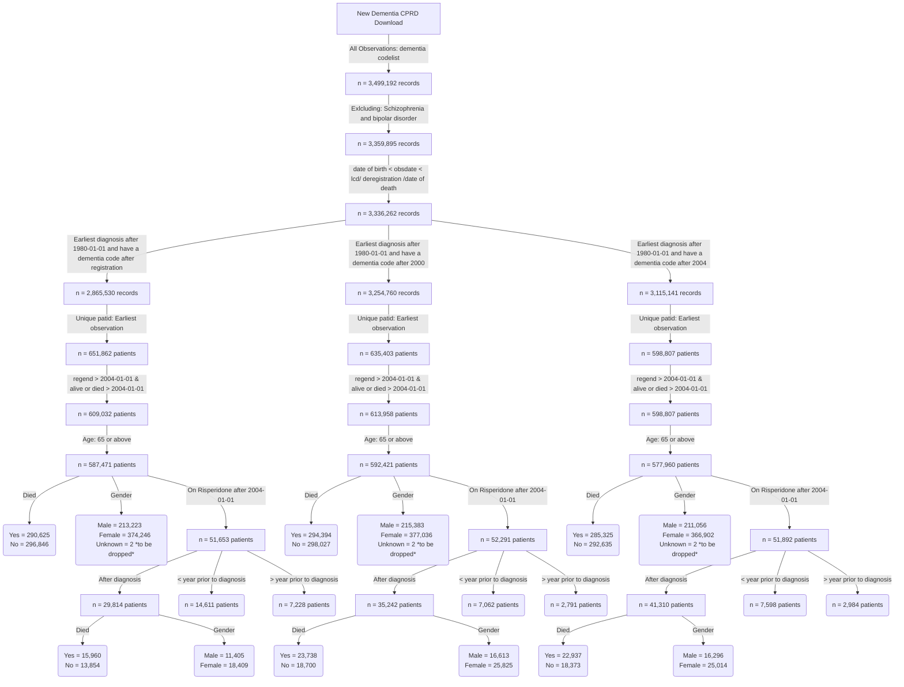

**This is the distribution of number of diagnosis per year for patients diagnosed after registration**


**This is the distribution of number of diagnosis per year for patients diagnosed after 2000**


**This is the distribution of number of prescriptions per year for patients diagnosed after 2004**


**Dementia incident cohort**


```
                                         
                                             Overall       
  n                                           445402        
  diagnosedbeforeRegistration = 1 (%)          93850 (21.1) 
  died = 1 (%)                                223233 (50.1) 
  age_diagnosis (mean (SD))                    82.35 (7.02) 
  age_category (%)                                          
     65-74                                     64286 (14.4) 
     75-84                                    202031 (45.4) 
     85-94                                    164413 (36.9) 
     95+                                       14672 ( 3.3) 
  year_of_diagnosis (%)                                     
     2004                                      20457 ( 4.6) 
     2005                                      17426 ( 3.9) 
     2006                                      19708 ( 4.4) 
     2007                                      17420 ( 3.9) 
     2008                                      18002 ( 4.0) 
     2009                                      19947 ( 4.5) 
     2010                                      21460 ( 4.8) 
     2011                                      22688 ( 5.1) 
     2012                                      25240 ( 5.7) 
     2013                                      27311 ( 6.1) 
     2014                                      29973 ( 6.7) 
     2015                                      29772 ( 6.7) 
     2016                                      26706 ( 6.0) 
     2017                                      26491 ( 5.9) 
     2018                                      25314 ( 5.7) 
     2019                                      24739 ( 5.6) 
     2020                                      19551 ( 4.4) 
     2021                                      20464 ( 4.6) 
     2022                                      19019 ( 4.3) 
     2023                                      13714 ( 3.1) 
  gender_decode = M (%)                       162452 (36.5) 
  pre_diagnoses_af = 1 (%)                     62311 (14.0) 
  post_diagnoses_af = 1 (%)                    28577 ( 6.4) 
  af_ever = 1 (%)                              92669 (20.8) 
  pre_diagnoses_angina = 1 (%)                 50121 (11.3) 
  post_diagnoses_angina = 1 (%)                 6097 ( 1.4) 
  angina_ever = 1 (%)                          56491 (12.7) 
  pre_diagnoses_anxiety_disorders = 1 (%)      67697 (15.2) 
  post_diagnoses_anxiety_disorders = 1 (%)     10557 ( 2.4) 
  anxiety_disorders_ever = 1 (%)               78971 (17.7) 
  pre_diagnoses_falls = 1 (%)                 112952 (25.4) 
  post_diagnoses_falls = 1 (%)                125068 (28.1) 
  falls_ever = 1 (%)                          240554 (54.0) 
  pre_diagnoses_fh_diabetes = 1 (%)            91142 (20.5) 
  post_diagnoses_fh_diabetes = 1 (%)            5686 ( 1.3) 
  fh_diabetes_ever = 1 (%)                     97034 (21.8) 
  heartfailure_ever = 1 (%)                    53890 (12.1) 
  pre_diagnoses_lowerlimbfracture = 1 (%)      54613 (12.3) 
  post_diagnoses_lowerlimbfracture = 1 (%)     32901 ( 7.4) 
  lowerlimbfracture_ever = 1 (%)               88302 (19.8) 
  pre_diagnoses_myocardialinfarction = 1 (%)   34855 ( 7.8) 
  post_diagnoses_myocardialinfarction = 1 (%)   6998 ( 1.6) 
  myocardialinfarction_ever = 1 (%)            42174 ( 9.5) 
  pre_diagnoses_qof_diabetes = 1 (%)           60800 (13.7) 
  post_diagnoses_qof_diabetes = 1 (%)          24664 ( 5.5) 
  qof_diabetes_ever = 1 (%)                    86493 (19.4) 
  pre_diagnoses_revasc = 1 (%)                 24092 ( 5.4) 
  post_diagnoses_revasc = 1 (%)                 1104 ( 0.2) 
  revasc_ever = 1 (%)                          25262 ( 5.7) 
  pre_diagnoses_stroke = 1 (%)                 48361 (10.9) 
  post_diagnoses_stroke = 1 (%)                20317 ( 4.6) 
  stroke_ever = 1 (%)                          70392 (15.8) 
  pre_diagnoses_tia = 1 (%)                    38227 ( 8.6) 
  post_diagnoses_tia = 1 (%)                   12287 ( 2.8) 
  tia_ever = 1 (%)                             51118 (11.5) 
  alcohol_cat (%)                                           
     Excess                                    23242 ( 5.2) 
     Harmful                                   11662 ( 2.6) 
     None                                      41685 ( 9.4) 
     Unknown                                  118203 (26.5) 
     Within limits                            250610 (56.3) 
  smoking_cat (%)                                           
     Active smoker                             35957 ( 8.1) 
     Ex-smoker                                185229 (41.6) 
     Non-smoker                               142210 (31.9) 
     Unknown                                   82006 (18.4) 
  qrisk2_smoking_cat (%)                                    
     0                                        191587 (43.0) 
     1                                        116595 (26.2) 
     2                                         34444 ( 7.7) 
     3                                          1163 ( 0.3) 
     4                                           877 ( 0.2) 
     Unknown                                  100736 (22.6) 
  qrisk2_smoking_cat_uncoded (%)                            
     Ex-smoker                                116595 (26.2) 
     Heavy smoker                                877 ( 0.2) 
     Light smoker                              34444 ( 7.7) 
     Moderate smoker                            1163 ( 0.3) 
     Non-smoker                               191587 (43.0) 
     Unknown                                  100736 (22.6) 
  gp_5cat_ethnicity (%)                                     
     Black                                      7623 ( 1.7) 
     Mixed                                      1302 ( 0.3) 
     Other                                      2023 ( 0.5) 
     South Asian                                8065 ( 1.8) 
     Unknown                                  112405 (25.2) 
     White                                    313984 (70.5) 
  gp_16cat_ethnicity (%)                                    
     African                                    1371 ( 0.3) 
     Bangladeshi                                 716 ( 0.2) 
     Caribbean                                  5582 ( 1.3) 
     Chinese                                     451 ( 0.1) 
     Indian                                     4053 ( 0.9) 
     Other                                      1590 ( 0.4) 
     Other Asian                                1585 ( 0.4) 
     Other Black                                 598 ( 0.1) 
     Other Mixed                                 341 ( 0.1) 
     Other White                                9380 ( 2.1) 
     Pakistani                                  1652 ( 0.4) 
     Unknown                                  112760 (25.3) 
     White and Asian                             165 ( 0.0) 
     White and Black African                     200 ( 0.0) 
     White and Black Caribbean                   612 ( 0.1) 
     White British                            299270 (67.2) 
     White Irish                                5076 ( 1.1) 
  gp_qrisk2_ethnicity (%)                                   
     Bangladeshi                                 716 ( 0.2) 
     Black African                              1358 ( 0.3) 
     Black Caribbean                            5554 ( 1.2) 
     Chinese                                     449 ( 0.1) 
     Indian                                     4049 ( 0.9) 
     Other                                      3587 ( 0.8) 
     Other Asian                                1575 ( 0.4) 
     Pakistani                                  1651 ( 0.4) 
     Unknown                                  112495 (25.3) 
     White                                    313968 (70.5) 
  pre_diagnoses_deep_vein_thrombosis = 1 (%)   20093 ( 4.5) 
  post_diagnoses_deep_vein_thrombosis = 1 (%)   8514 ( 1.9) 
  deep_vein_thrombosis_ever = 1 (%)            28828 ( 6.5) 
  pre_diagnoses_pulmonary_embolism = 1 (%)     10503 ( 2.4) 
  post_diagnoses_pulmonary_embolism = 1 (%)     4461 ( 1.0) 
  pulmonary_embolism_ever = 1 (%)              15125 ( 3.4) 
  pre_diagnoses_haem_cancer = 1 (%)             8129 ( 1.8) 
  post_diagnoses_haem_cancer = 1 (%)            3760 ( 0.8) 
  haem_cancer_ever = 1 (%)                     12014 ( 2.7) 
  pre_diagnoses_solid_cancer = 1 (%)           64258 (14.4) 
  post_diagnoses_solid_cancer = 1 (%)          20922 ( 4.7) 
  solid_cancer_ever = 1 (%)                    85902 (19.3) 

```


```
           strata   median    lower    upper
1 gender_decode=F 4.914442 4.892539 4.941821
2 gender_decode=M 4.180698 4.153320 4.210815
```


```
              strata   median    lower    upper
1 age_category=65-74 7.707050 7.619439 7.794661
2 age_category=75-84 5.333333 5.305955 5.363450
3 age_category=85-94 3.266256 3.244353 3.288159
4   age_category=95+ 1.667351 1.620808 1.724846

```

**Risperidone incident cohort**
```

                                                         
                                                          Overall        
  n                                                        29394         
  diagnosedbeforeRegistration = 1 (%)                      12616 (42.9)  
  died = 1 (%)                                             16893 (57.5)  
  age_diagnosis (mean (SD))                                80.46 (7.13)  
  age_category (%)                                                       
     65 - 74                                                6388 (21.7)  
     75 - 84                                               14185 (48.3)  
     85+                                                    8821 (30.0)  
  comorbidity_af = 1 (%)                                    5266 (17.9)  
  pre_index_date_af = 1 (%)                                 4704 (16.0)  
  post_index_date_af = 1 (%)                                1784 ( 6.1)  
  comorbidity_angina = 1 (%)                                3555 (12.1)  
  pre_index_date_angina = 1 (%)                             3470 (11.8)  
  post_index_date_angina = 1 (%)                             331 ( 1.1)  
  comorbidity_anxiety_disorders = 1 (%)                     6100 (20.8)  
  pre_index_date_anxiety_disorders = 1 (%)                  5856 (19.9)  
  post_index_date_anxiety_disorders = 1 (%)                  664 ( 2.3)  
  comorbidity_falls = 1 (%)                                16555 (56.3)  
  pre_index_date_falls = 1 (%)                             11978 (40.7)  
  post_index_date_falls = 1 (%)                             8683 (29.5)  
  comorbidity_fh_diabetes = 1 (%)                           5980 (20.3)  
  pre_index_date_fh_diabetes = 1 (%)                        5894 (20.1)  
  post_index_date_fh_diabetes = 1 (%)                        125 ( 0.4)  
  comorbidity_fh_premature_cvd = 1 (%)                      2295 ( 7.8)  
  pre_index_date_fh_premature_cvd = 1 (%)                   2264 ( 7.7)  
  post_index_date_fh_premature_cvd = 1 (%)                    45 ( 0.2)  
  comorbidity_heartfailure = 1 (%)                          2635 ( 9.0)  
  pre_index_date_heartfailure = 1 (%)                       2229 ( 7.6)  
  post_index_date_heartfailure = 1 (%)                       890 ( 3.0)  
  comorbidity_lowerlimbfracture = 1 (%)                     6137 (20.9)  
  pre_index_date_lowerlimbfracture = 1 (%)                  4644 (15.8)  
  post_index_date_lowerlimbfracture = 1 (%)                 1876 ( 6.4)  
  comorbidity_myocardialinfarction = 1 (%)                  2559 ( 8.7)  
  pre_index_date_myocardialinfarction = 1 (%)               2403 ( 8.2)  
  post_index_date_myocardialinfarction = 1 (%)               281 ( 1.0)  
  comorbidity_qof_diabetes = 1 (%)                          5405 (18.4)  
  pre_index_date_qof_diabetes = 1 (%)                       5103 (17.4)  
  post_index_date_qof_diabetes = 1 (%)                      2349 ( 8.0)  
  comorbidity_revasc = 1 (%)                                1595 ( 5.4)  
  pre_index_date_revasc = 1 (%)                             1587 ( 5.4)  
  post_index_date_revasc = 1 (%)                              24 ( 0.1)  
  comorbidity_stroke = 1 (%)                                4136 (14.1)  
  pre_index_date_stroke = 1 (%)                             3544 (12.1)  
  post_index_date_stroke = 1 (%)                            1042 ( 3.5)  
  stroke_cat = ischaemic (%)                                3535 (85.5)  
  comorbidity_tia = 1 (%)                                   3168 (10.8)  
  pre_index_date_tia = 1 (%)                                2731 ( 9.3)  
  post_index_date_tia = 1 (%)                                668 ( 2.3)  
  comorbidity_deep_vein_thrombosis = 1 (%)                  1957 ( 6.7)  
  pre_index_date_deep_vein_thrombosis = 1 (%)               1505 ( 5.1)  
  post_index_date_deep_vein_thrombosis = 1 (%)               539 ( 1.8)  
  comorbidity_haem_cancer = 1 (%)                            658 ( 2.2)  
  pre_index_date_haem_cancer = 1 (%)                         570 ( 1.9)  
  post_index_date_haem_cancer = 1 (%)                        182 ( 0.6)  
  comorbidity_pulmonary_embolism = 1 (%)                     966 ( 3.3)  
  pre_index_date_pulmonary_embolism = 1 (%)                  740 ( 2.5)  
  post_index_date_pulmonary_embolism = 1 (%)                 269 ( 0.9)  
  comorbidity_solid_cancer = 1 (%)                          5084 (17.3)  
  pre_index_date_solid_cancer = 1 (%)                       4655 (15.8)  
  post_index_date_solid_cancer = 1 (%)                      1045 ( 3.6)  
  VTE = 1 (%)                                               2702 ( 9.2)  
  BMI (%)                                                                
     Normal                                                 7274 (24.7)  
     Obesity                                                1736 ( 5.9)  
     Overweight                                             4238 (14.4)  
     Severely Obese                                           87 ( 0.3)  
     Underweight                                            1312 ( 4.5)  
     Unknown                                               14747 (50.2)  
  testvalue_dbp (mean (SD))                                66.30 (10.02) 
  testvalue_sbp (mean (SD))                               120.03 (16.15) 
  testvalue_totalcholesterol (mean (SD))                    4.45 (1.14)  
  gp_5cat_ethnicity (%)                                                  
     Black                                                   439 ( 1.5)  
     Mixed                                                    88 ( 0.3)  
     Other                                                   145 ( 0.5)  
     South Asian                                             448 ( 1.5)  
     Unknown                                                6940 (23.6)  
     White                                                 21334 (72.6)  
  gp_16cat_ethnicity (%)                                                 
     African                                                  74 ( 0.3)  
     Bangladeshi                                              32 ( 0.1)  
     Caribbean                                               317 ( 1.1)  
     Chinese                                                  21 ( 0.1)  
     Indian                                                  228 ( 0.8)  
     Other                                                   126 ( 0.4)  
     Other Asian                                              82 ( 0.3)  
     Other Black                                              47 ( 0.2)  
     Other Mixed                                              20 ( 0.1)  
     Other White                                             656 ( 2.2)  
     Pakistani                                               101 ( 0.3)  
     Unknown                                                6961 (23.7)  
     White and Asian                                          16 ( 0.1)  
     White and Black African                                  10 ( 0.0)  
     White and Black Caribbean                                40 ( 0.1)  
     White British                                         20350 (69.2)  
     White Irish                                             313 ( 1.1)  
  gp_qrisk2_ethnicity (%)                                                
     Bangladeshi                                              32 ( 0.1)  
     Black African                                            74 ( 0.3)  
     Black Caribbean                                         315 ( 1.1)  
     Chinese                                                  21 ( 0.1)  
     Indian                                                  228 ( 0.8)  
     Other                                                   261 ( 0.9)  
     Other Asian                                              81 ( 0.3)  
     Pakistani                                               101 ( 0.3)  
     Unknown                                                6947 (23.6)  
     White                                                 21334 (72.6)  
  alcohol_cat (%)                                                        
     Excess                                                 1451 ( 4.9)  
     Harmful                                                 803 ( 2.7)  
     None                                                   2176 ( 7.4)  
     Unknown                                               10218 (34.8)  
     Within limits                                         14746 (50.2)  
  smoking_cat (%)                                                        
     Active smoker                                          2015 ( 6.9)  
     Ex-smoker                                             11096 (37.7)  
     Non-smoker                                             8119 (27.6)  
     Unknown                                                8164 (27.8)  
  qrisk2_smoking_cat (%)                                                 
     0                                                     10798 (36.7)  
     1                                                      7286 (24.8)  
     2                                                      1982 ( 6.7)  
     3                                                        69 ( 0.2)  
     4                                                        38 ( 0.1)  
     Unknown                                                9221 (31.4)  
  qrisk2_smoking_cat_uncoded (%)                                         
     Ex-smoker                                              7286 (24.8)  
     Heavy smoker                                             38 ( 0.1)  
     Light smoker                                           1982 ( 6.7)  
     Moderate smoker                                          69 ( 0.2)  
     Non-smoker                                            10798 (36.7)  
     Unknown                                                9221 (31.4)  
  drug_name (%)                                                          
     amisulpride                                             298 ( 2.0)  
     aripiprazole                                            266 ( 1.8)  
     benperidol                                               11 ( 0.1)  
     chlorpromazine                                          146 ( 1.0)  
     clozapine                                                 1 ( 0.0)  
     flupentixol                                             207 ( 1.4)  
     fluphenazine                                             11 ( 0.1)  
     haloperidol                                            2079 (13.9)  
     levomepromazine                                        1868 (12.5)  
     olanzapine                                             1035 ( 6.9)  
     pericyazine                                              20 ( 0.1)  
     perphenazine                                              7 ( 0.0)  
     pimozide                                                164 ( 1.1)  
     prochlorperazine                                       6278 (42.1)  
     promazine                                               401 ( 2.7)  
     quetiapine                                             1837 (12.3)  
     sulpiride                                                53 ( 0.4)  
     thioridazine                                             95 ( 0.6)  
     trifluoperazine                                         133 ( 0.9)  
     zuclopenthixol                                           11 ( 0.1)  
  frailty (%)                                                            
     Mild                                                   1358 ( 4.6)  
     Moderate                                               3432 (11.7)  
     Severe                                                 5373 (18.3)  
     Unknown                                               19231 (65.4)  
  sex = 1 (%)                                              11460 (39.0)  
  dementia_duration_prior_risperidone (mean (SD))           2.08 (2.32)  
  Survival_time (mean (SD))                                 1.74 (1.88)  
  year_diagnosis_cat (%)                                                 
     > 2020                                                 1225 ( 4.2)  
     2004 - 2008                                            4964 (16.9)  
     2009 - 2012                                            7702 (26.2)  
     2013 - 2016                                            9311 (31.7)  
     2017 - 2020                                            6192 (21.1)  
  Stroke_prior_to_risperidone = 1 (%)                       3344 (11.4)  
  Stroke__within_year_after_1st_risperidone_presc = 1 (%)    400 ( 1.4)  
  death_in_a_year_after_risperidone = 1 (%)                 7057 (24.0)  
  age_risperidone (mean (SD))                              82.99 (6.88)  
  prescribed_other_antipsyc_drug = 1 (%)                   14921 (50.8)  
  pre_indexdate_antipysch_prescr = 1 (%)                    9949 (66.7)  
  post_indexdate_antipysch_prescr = 1 (%)                   4890 (32.8)  
  same_indexdate_antipysch_prescr = 1 (%)                     82 ( 0.5)  
  pre_indexdate_drug_name (%)                                            
     amisulpride                                             183 ( 1.8)  
     aripiprazole                                             75 ( 0.8)  
     benperidol                                                7 ( 0.1)  
     chlorpromazine                                          118 ( 1.2)  
     clozapine                                                 1 ( 0.0)  
     flupentixol                                             193 ( 1.9)  
     fluphenazine                                             11 ( 0.1)  
     haloperidol                                             889 ( 8.9)  
     levomepromazine                                          91 ( 0.9)  
     olanzapine                                              572 ( 5.7)  
     pericyazine                                              18 ( 0.2)  
     perphenazine                                              7 ( 0.1)  
     pimozide                                                118 ( 1.2)  
     prochlorperazine                                       5952 (59.8)  
     promazine                                               299 ( 3.0)  
     quetiapine                                             1161 (11.7)  
     sulpiride                                                40 ( 0.4)  
     thioridazine                                             94 ( 0.9)  
     trifluoperazine                                         115 ( 1.2)  
     zuclopenthixol                                            5 ( 0.1)  
  same_indexdate_drug_name (%)                                           
     amisulpride                                               2 ( 2.4)  
     aripiprazole                                              8 ( 9.8)  
     chlorpromazine                                            4 ( 4.9)  
     flupentixol                                               2 ( 2.4)  
     haloperidol                                              20 (24.4)  
     levomepromazine                                           1 ( 1.2)  
     olanzapine                                                2 ( 2.4)  
     pimozide                                                  8 ( 9.8)  
     prochlorperazine                                          5 ( 6.1)  
     promazine                                                12 (14.6)  
     quetiapine                                               16 (19.5)  
     trifluoperazine                                           2 ( 2.4)  
  post_indexdate_drug_name (%)                                           
     amisulpride                                             110 ( 2.2)  
     aripiprazole                                            175 ( 3.6)  
     benperidol                                                3 ( 0.1)  
     chlorpromazine                                           26 ( 0.5)  
     flupentixol                                              10 ( 0.2)  
     haloperidol                                            1371 (28.0)  
     levomepromazine                                        1560 (31.9)  
     olanzapine                                              454 ( 9.3)  
     pericyazine                                               4 ( 0.1)  
     pimozide                                                 35 ( 0.7)  
     prochlorperazine                                        310 ( 6.3)  
     promazine                                               107 ( 2.2)  
     quetiapine                                              696 (14.2)  
     sulpiride                                                10 ( 0.2)  
     trifluoperazine                                          13 ( 0.3)  
     zuclopenthixol                                            6 ( 0.1)  
  stroke_recency (mean (SD))                              160.76 (216.79)
  stroke_recency_cat (%)                                                 
      <= 1                                                   357 (10.1)  
      > 7                                                   2989 (84.3)  
     1 - 2                                                   145 ( 4.1)  
     2 - 3                                                    49 ( 1.4)  
     3 - 4                                                     4 ( 0.1)  
  care_home = 1 (%)                                        12226 (41.6)  
  care_home_before_indexdate = 1 (%)                        3939 (32.2)  
  care_home_at_indexdate = 1 (%)                             125 ( 1.0)  
  care_home_90_days_after_indexdate = 1 (%)                 2660 (21.8)  
  TimeSinceFirstPrescription (mean (SD))                    0.49 (0.92)  
  Prescription_ever_cat (%)                                              
     >100                                                    543 ( 1.8)  
     1                                                      5059 (17.2)  
     10                                                      765 ( 2.6)  
     11 - 20                                                5017 (17.1)  
     2                                                      2575 ( 8.8)  
     21 - 30                                                2712 ( 9.2)  
     3                                                      1876 ( 6.4)  
     31 - 40                                                1574 ( 5.4)  
     4                                                      1539 ( 5.2)  
     41 - 50                                                 985 ( 3.4)  
     5                                                      1265 ( 4.3)  
     51 - 100                                               1614 ( 5.5)  
     6                                                      1082 ( 3.7)  
     7                                                      1022 ( 3.5)  
     8                                                       912 ( 3.1)  
     9                                                       854 ( 2.9)  
  Prescriptions_after_a_year_cat (%)                                     
     >100                                                    295 ( 3.0)  
     1                                                       682 ( 7.0)  
     10                                                      286 ( 2.9)  
     11 - 20                                                2066 (21.3)  
     2                                                       594 ( 6.1)  
     21 - 30                                                1169 (12.0)  
     3                                                       514 ( 5.3)  
     31 - 40                                                 740 ( 7.6)  
     4                                                       440 ( 4.5)  
     41 - 50                                                 464 ( 4.8)  
     5                                                       407 ( 4.2)  
     51 - 100                                                695 ( 7.2)  
     6                                                       364 ( 3.7)  
     7                                                       362 ( 3.7)  
     8                                                       323 ( 3.3)  
     9                                                       306 ( 3.2)  
  Prescriptions_within_a_year_cat (%)                                    
     >100                                                     16 ( 0.1)  
     1                                                      5271 (17.9)  
     10                                                      940 ( 3.2)  
     11 - 20                                                9239 (31.4)  
     2                                                      2658 ( 9.0)  
     21 - 30                                                 840 ( 2.9)  
     3                                                      1945 ( 6.6)  
     31 - 40                                                 304 ( 1.0)  
     4                                                      1603 ( 5.5)  
     41 - 50                                                 293 ( 1.0)  
     5                                                      1352 ( 4.6)  
     51 - 100                                                513 ( 1.7)  
     6                                                      1200 ( 4.1)  
     7                                                      1188 ( 4.0)  
     8                                                      1050 ( 3.6)  
     9                                                       982 ( 3.3)  
  consultation_counts_Cat (%)                                            
     0 - 50                                                10390 (35.8)  
     101 - 150                                              5085 (17.5)  
     151 - 200                                              1931 ( 6.7)  
     201 - 250                                               731 ( 2.5)  
     251 - 300                                               301 ( 1.0)  
     301 - 350                                               123 ( 0.4)  
     351 - 400                                                50 ( 0.2)  
     401 - 450                                                34 ( 0.1)  
     451 - 500                                                28 ( 0.1)  
     501 - 800                                                30 ( 0.1)  
     51 - 100                                              10318 (35.5)  
     801 - 1000                                                3 ( 0.0)  
  stroke_3_months_prior = 1 (%)                              148 ( 0.5)  
  stroke_6_months_prior = 1 (%)                              222 ( 0.8)  
  stroke_12_months_prior = 1 (%)                             357 ( 1.2)  
  prescribed_BMJ_antipsyc_drug = 1 (%)                     25208 (85.8)  
  pre_indexdate_BMJ_antipysch_prescr = 1 (%)                1905 ( 7.6)  
  post_indexdate_BMJ_antipysch_prescr = 1 (%)               1684 ( 6.7)  
  same_indexdate_BMJ_antipysch_prescr = 1 (%)              21619 (85.8)  
  pre_BMJ_indexdate_drug_name (%)                                        
     amisulpride                                             168 ( 8.9)  
     aripiprazole                                             15 ( 0.8)  
     benperidol                                                7 ( 0.4)  
     chlorpromazine                                          117 ( 6.2)  
     clozapine                                                 1 ( 0.1)  
     flupentixol                                             121 ( 6.4)  
     fluphenazine                                             10 ( 0.5)  
     haloperidol                                             827 (43.7)  
     levomepromazine                                          10 ( 0.5)  
     olanzapine                                               48 ( 2.5)  
     pericyazine                                              18 ( 1.0)  
     perphenazine                                              2 ( 0.1)  
     pimozide                                                  5 ( 0.3)  
     prochlorperazine                                        359 (19.0)  
     promazine                                                41 ( 2.2)  
     quetiapine                                               66 ( 3.5)  
     sulpiride                                                15 ( 0.8)  
     thioridazine                                             29 ( 1.5)  
     trifluoperazine                                          33 ( 1.7)  
     zuclopenthixol                                            1 ( 0.1)  
  same_BMJ_indexdate_drug_name (%)                                       
     amisulpride                                              88 ( 0.9)  
     aripiprazole                                            187 ( 1.8)  
     benperidol                                                3 ( 0.0)  
     chlorpromazine                                           26 ( 0.3)  
     flupentixol                                              62 ( 0.6)  
     fluphenazine                                              1 ( 0.0)  
     haloperidol                                            1150 (11.2)  
     levomepromazine                                        1287 (12.6)  
     olanzapine                                              759 ( 7.4)  
     pericyazine                                               4 ( 0.0)  
     perphenazine                                              5 ( 0.0)  
     pimozide                                                128 ( 1.2)  
     prochlorperazine                                       4764 (46.5)  
     promazine                                               283 ( 2.8)  
     quetiapine                                             1344 (13.1)  
     sulpiride                                                25 ( 0.2)  
     thioridazine                                             55 ( 0.5)  
     trifluoperazine                                          67 ( 0.7)  
     zuclopenthixol                                            5 ( 0.0)  
  post_BMJ_indexdate_drug_name (%)                                       
     amisulpride                                              31 ( 3.7)  
     aripiprazole                                             28 ( 3.3)  
     chlorpromazine                                            4 ( 0.5)  
     flupentixol                                               8 ( 0.9)  
     haloperidol                                             138 (16.3)  
     levomepromazine                                          89 (10.5)  
     olanzapine                                               64 ( 7.6)  
     pimozide                                                  7 ( 0.8)  
     prochlorperazine                                        313 (37.0)  
     promazine                                                22 ( 2.6)  
     quetiapine                                              124 (14.7)  
     sulpiride                                                 4 ( 0.5)  
     trifluoperazine                                          10 ( 1.2)  
     zuclopenthixol                                            3 ( 0.4)  
  comorbidity_hypertension (%)                                           
     Elevated                                               5908 (20.1)  
     Normal                                                11404 (38.8)  
     Stage 1                                                6410 (21.8)  
     Stage 2                                                2065 ( 7.0)  
     Stage 3 (severe)                                          7 ( 0.0)  
     Unknown                                                3600 (12.2)  
  pre_index_date_hypertension = 1 (%)                      22921 (88.9)  
  post_index_date_hypertension = 1 (%)                      1419 ( 5.5)                                
```


**COX model**
```
summary(res.cox)
Call:
coxph(formula = Surv(Survival_time, post_index_date_stroke) ~ 
    age_diagnosis + pre_index_date_stroke + sex, data = FinalData)

  n= 29403, number of events= 1042 

                           coef exp(coef) se(coef)      z Pr(>|z|)    
age_diagnosis          0.014843  1.014954 0.004555  3.258  0.00112 ** 
pre_index_date_stroke1 1.875578  6.524590 0.063041 29.752  < 2e-16 ***
sex1                   0.149645  1.161422 0.065084  2.299  0.02149 *  
---
Signif. codes:  0 ‘***’ 0.001 ‘**’ 0.01 ‘*’ 0.05 ‘.’ 0.1 ‘ ’ 1

                       exp(coef) exp(-coef) lower .95 upper .95
age_diagnosis              1.015     0.9853     1.006     1.024
pre_index_date_stroke1     6.525     0.1533     5.766     7.383
sex1                       1.161     0.8610     1.022     1.319

Concordance= 0.723  (se = 0.01 )
Likelihood ratio test= 764.7  on 3 df,   p=<2e-16
Wald test            = 927.2  on 3 df,   p=<2e-16
Score (logrank) test = 1234  on 3 df,   p=<2e-16

```


**One year censoring**

```
Call:
coxph(formula = Surv(Survival_time, post_index_date_stroke) ~ 
    age_diagnosis + pre_index_date_stroke + sex, data = CensoringData_1year)

  n= 29374, number of events= 302 
   (20 observations deleted due to missingness)

                           coef exp(coef) se(coef)      z Pr(>|z|)    
age_diagnosis          0.041034  1.041888 0.008492  4.832 1.35e-06 ***
pre_index_date_stroke1 1.889690  6.617315 0.115851 16.311  < 2e-16 ***
sex1                   0.305904  1.357852 0.118622  2.579  0.00991 ** 
---
Signif. codes:  0 ‘***’ 0.001 ‘**’ 0.01 ‘*’ 0.05 ‘.’ 0.1 ‘ ’ 1

                       exp(coef) exp(-coef) lower .95 upper .95
age_diagnosis              1.042     0.9598     1.025     1.059
pre_index_date_stroke1     6.617     0.1511     5.273     8.304
sex1                       1.358     0.7365     1.076     1.713

Concordance= 0.741  (se = 0.016 )
Likelihood ratio test= 266.1  on 3 df,   p=<2e-16
Wald test            = 307.7  on 3 df,   p=<2e-16
Score (logrank) test = 409.1  on 3 df,   p=<2e-16
```

**Excluding stroke 3 months prior**


```
Call:
coxph(formula = Surv(Survival_time, post_index_date_stroke) ~ 
    age_diagnosis + pre_index_date_stroke + sex, data = Excluding_3_monthsPriorStroke)

  n= 29246, number of events= 975 

                           coef exp(coef) se(coef)      z Pr(>|z|)    
age_diagnosis          0.016788  1.016930 0.004703  3.569 0.000358 ***
pre_index_date_stroke1 1.747929  5.742694 0.066094 26.446  < 2e-16 ***
sex1                   0.149249  1.160962 0.067442  2.213 0.026897 *  
---
Signif. codes:  0 ‘***’ 0.001 ‘**’ 0.01 ‘*’ 0.05 ‘.’ 0.1 ‘ ’ 1

                       exp(coef) exp(-coef) lower .95 upper .95
age_diagnosis              1.017     0.9834     1.008     1.026
pre_index_date_stroke1     5.743     0.1741     5.045     6.537
sex1                       1.161     0.8614     1.017     1.325

Concordance= 0.704  (se = 0.01 )
Likelihood ratio test= 600.2  on 3 df,   p=<2e-16
Wald test            = 739.3  on 3 df,   p=<2e-16
Score (logrank) test = 948.3  on 3 df,   p=<2e-16


```


**Excluding stroke 12 months prior**


```
Call:
coxph(formula = Surv(Survival_time, post_index_date_stroke) ~ 
    age_diagnosis + pre_index_date_stroke + sex, data = Excluding_12_monthsPriorStroke)

  n= 29037, number of events= 918 

                           coef exp(coef) se(coef)      z Pr(>|z|)    
age_diagnosis          0.019197  1.019382 0.004857  3.952 7.75e-05 ***
pre_index_date_stroke1 1.635448  5.131757 0.069466 23.543  < 2e-16 ***
sex1                   0.173900  1.189936 0.069490  2.503   0.0123 *  
---
Signif. codes:  0 ‘***’ 0.001 ‘**’ 0.01 ‘*’ 0.05 ‘.’ 0.1 ‘ ’ 1

                       exp(coef) exp(-coef) lower .95 upper .95
age_diagnosis              1.019     0.9810     1.010     1.029
pre_index_date_stroke1     5.132     0.1949     4.479     5.880
sex1                       1.190     0.8404     1.038     1.364

Concordance= 0.684  (se = 0.011 )
Likelihood ratio test= 477.9  on 3 df,   p=<2e-16
Wald test            = 595.5  on 3 df,   p=<2e-16
Score (logrank) test = 740.7  on 3 df,   p=<2e-16


```


**Matching**


```
A matchit object
 - method: 5:1 nearest neighbor matching with replacement
 - distance: Propensity score [caliper]
             - estimated with logistic regression
 - caliper: <distance> (0.002)
 - number of obs.: 10437 (original), 1279 (matched)
 - target estimand: ATT
 - covariates: sex, age_diagnosis, pre_index_date_angina, pre_index_date_heartfailure, BMI, Prescribed_other_antipsychotic_Prior, period_before_prescription, comorbidity_myocardialinfarction, pre_index_date_stroke, pre_index_date_tia, pre_index_date_falls, pre_index_date_lowerlimbfracture, pre_index_date_ihd, pre_index_date_pad, pre_index_date_af, pre_index_date_revasc, pre_index_date_qof_diabetes, pre_index_date_anxiety_disorders, pre_index_date_fh_diabetes, pre_index_date_fh_premature_cvd, pre_index_date_pulmonary_embolism, pre_index_date_deep_vein_thrombosis, pre_index_date_haem_cancer, pre_index_date_solid_cancer, pre_index_date_hearing_loss, VTE, gp_5cat_ethnicity, comorbidity_hypertension
> 
> summary(m.out2, un = FALSE)

Call:
matchit(formula = risperidone ~ +sex + age_diagnosis + pre_index_date_angina + 
    pre_index_date_heartfailure + BMI + Prescribed_other_antipsychotic_Prior + 
    period_before_prescription + comorbidity_myocardialinfarction + 
    pre_index_date_stroke + pre_index_date_tia + pre_index_date_falls + 
    pre_index_date_lowerlimbfracture + pre_index_date_ihd + pre_index_date_pad + 
    pre_index_date_af + pre_index_date_revasc + pre_index_date_qof_diabetes + 
    pre_index_date_anxiety_disorders + pre_index_date_fh_diabetes + 
    pre_index_date_fh_premature_cvd + pre_index_date_pulmonary_embolism + 
    pre_index_date_deep_vein_thrombosis + pre_index_date_haem_cancer + 
    pre_index_date_solid_cancer + pre_index_date_hearing_loss + 
    VTE + gp_5cat_ethnicity + comorbidity_hypertension, data = FullData, 
    method = "nearest", distance = "glm", link = "logit", replace = TRUE, 
    caliper = 0.05, ratio = 5)

Summary of Balance for Matched Data:
                                         Means Treated Means Control Std. Mean Diff. Var. Ratio eCDF Mean
distance                                        0.1173        0.1173          0.0003     1.0024    0.0002
sex                                             0.2885        0.2885          0.0000          .    0.0000
age_diagnosis                                  81.5641       83.0730         -0.2100     1.1123    0.0401
pre_index_date_angina                           0.0994        0.1021         -0.0094          .    0.0028
pre_index_date_heartfailure                     0.0801        0.0888         -0.0319          .    0.0087
BMIMissing                                      0.7917        0.8538         -0.1543          .    0.0622
BMINormal                                       0.1250        0.0865          0.1154          .    0.0385
BMIObesity                                      0.0288        0.0160          0.0796          .    0.0128
BMIOverweight                                   0.0417        0.0346          0.0367          .    0.0071
BMISeverely Obese                               0.0000        0.0000          0.0000          .    0.0000
BMIUnderweight                                  0.0128        0.0090          0.0356          .    0.0038
Prescribed_other_antipsychotic_Prior            0.1571        0.1179          0.1111          .    0.0391
period_before_prescription                      1.0337        1.2393         -0.1156     1.1144    0.0341
comorbidity_myocardialinfarction                0.0513        0.0372          0.0664          .    0.0141
pre_index_date_stroke                           0.0929        0.1053         -0.0423          .    0.0124
pre_index_date_tia                              0.0897        0.0973         -0.0256          .    0.0076
pre_index_date_falls                            0.1923        0.1424          0.1297          .    0.0499
pre_index_date_lowerlimbfracture                0.1250        0.1301         -0.0157          .    0.0051
pre_index_date_ihd                              0.1378        0.1441         -0.0178          .    0.0063
pre_index_date_pad                              0.0577        0.0904         -0.1273          .    0.0327
pre_index_date_af                               0.0962        0.0900          0.0215          .    0.0062
pre_index_date_revasc                           0.0160        0.0090          0.0584          .    0.0071
pre_index_date_qof_diabetes                     0.0769        0.0823         -0.0182          .    0.0053
pre_index_date_anxiety_disorders                0.0865        0.0532          0.1230          .    0.0333
pre_index_date_fh_diabetes                      0.0897        0.0635          0.0911          .    0.0263
pre_index_date_fh_premature_cvd                 0.0160        0.0096          0.0531          .    0.0064
pre_index_date_pulmonary_embolism               0.0000        0.0000          0.0000          .    0.0000
pre_index_date_deep_vein_thrombosis             0.0256        0.0131          0.0822          .    0.0125
pre_index_date_haem_cancer                      0.0032        0.0026          0.0118          .    0.0006
pre_index_date_solid_cancer                     0.0994        0.1054         -0.0200          .    0.0061
pre_index_date_hearing_loss                     0.1250        0.0923          0.1012          .    0.0327
VTE                                             0.0353        0.0247          0.0550          .    0.0106
gp_5cat_ethnicityBlack                          0.0000        0.0000          0.0000          .    0.0000
gp_5cat_ethnicityMixed                          0.0000        0.0000          0.0000          .    0.0000
gp_5cat_ethnicityOther                          0.0032        0.0051         -0.0251          .    0.0019
gp_5cat_ethnicitySouth Asian                    0.0032        0.0083         -0.0547          .    0.0051
gp_5cat_ethnicityUnknown                        0.8013        0.8484         -0.1189          .    0.0471
gp_5cat_ethnicityWhite                          0.1923        0.1381          0.1408          .    0.0542
comorbidity_hypertensionElevated                0.0897        0.0651          0.0895          .    0.0247
comorbidity_hypertensionNormal                  0.1859        0.1726          0.0342          .    0.0132
comorbidity_hypertensionStage 1                 0.2788        0.2016          0.1748          .    0.0772
comorbidity_hypertensionStage 2                 0.1699        0.1818         -0.0311          .    0.0120
comorbidity_hypertensionStage 3 (severe)        0.0000        0.0038         -0.0708          .    0.0038
comorbidity_hypertensionUnknown                 0.2756        0.3750         -0.2203          .    0.0994
                                         eCDF Max Std. Pair Dist.
distance                                   0.0112          0.0030
sex                                        0.0000          0.3917
age_diagnosis                              0.1085          0.9949
pre_index_date_angina                      0.0028          0.6039
pre_index_date_heartfailure                0.0087          0.5412
BMIMissing                                 0.0622          0.7331
BMINormal                                  0.0385          0.5732
BMIObesity                                 0.0128          0.2837
BMIOverweight                              0.0071          0.3994
BMISeverely Obese                          0.0000          0.0000
BMIUnderweight                             0.0038          0.2176
Prescribed_other_antipsychotic_Prior       0.0391          0.6074
period_before_prescription                 0.3654          0.2743
comorbidity_myocardialinfarction           0.0141          0.4171
pre_index_date_stroke                      0.0124          0.6075
pre_index_date_tia                         0.0076          0.5549
pre_index_date_falls                       0.0499          0.7468
pre_index_date_lowerlimbfracture           0.0051          0.6529
pre_index_date_ihd                         0.0063          0.6764
pre_index_date_pad                         0.0327          0.4688
pre_index_date_af                          0.0062          0.5611
pre_index_date_revasc                      0.0071          0.1777
pre_index_date_qof_diabetes                0.0053          0.4940
pre_index_date_anxiety_disorders           0.0333          0.5156
pre_index_date_fh_diabetes                 0.0263          0.4915
pre_index_date_fh_premature_cvd            0.0064          0.2293
pre_index_date_pulmonary_embolism          0.0000          0.0000
pre_index_date_deep_vein_thrombosis        0.0125          0.2731
pre_index_date_haem_cancer                 0.0006          0.1147
pre_index_date_solid_cancer                0.0061          0.6496
pre_index_date_hearing_loss                0.0327          0.6342
VTE                                        0.0106          0.3023
gp_5cat_ethnicityBlack                     0.0000          0.0000
gp_5cat_ethnicityMixed                     0.0000          0.0000
gp_5cat_ethnicityOther                     0.0019          0.0902
gp_5cat_ethnicitySouth Asian               0.0051          0.1328
gp_5cat_ethnicityUnknown                   0.0471          0.7280
gp_5cat_ethnicityWhite                     0.0542          0.7108
comorbidity_hypertensionElevated           0.0247          0.5473
comorbidity_hypertensionNormal             0.0132          0.7725
comorbidity_hypertensionStage 1            0.0772          0.8220
comorbidity_hypertensionStage 2            0.0120          0.7450
comorbidity_hypertensionStage 3 (severe)   0.0038          0.0765
comorbidity_hypertensionUnknown            0.0994          0.9162

Sample Sizes:
               Control Treated
All           10099.       338
Matched (ESS)   478.91     312
Matched         967.       312
Unmatched      9132.        26
Discarded         0.         0
```


```

                                             Stratified by risperidone
                                               0              1              p      test SMD   
  n                                            160934         32366                            
  sex = 1 (%)                                   65663 (40.8)  13190 ( 40.8)   0.876       0.001
  risperidone = 1 (%)                               0 ( 0.0)  32366 (100.0)  <0.001         NaN
  age_diagnosis (mean (SD))                     80.45 (7.00)  80.55 (7.14)    0.020       0.014
  pre_index_date_angina = 1 (%)                 18921 (11.8)   3809 ( 11.8)   0.961      <0.001
  pre_index_date_heartfailure = 1 (%)           12120 ( 7.5)   2466 (  7.6)   0.592       0.003
  BMI (%)                                                                     0.939       0.007
     Missing                                    79893 (49.6)  15983 ( 49.4)                    
     Normal                                     40249 (25.0)   8154 ( 25.2)                    
     Obesity                                     9181 ( 5.7)   1869 (  5.8)                    
     Overweight                                 23341 (14.5)   4716 ( 14.6)                    
     Severely Obese                               564 ( 0.4)    114 (  0.4)                    
     Underweight                                 7706 ( 4.8)   1530 (  4.7)                    
  Prescribed_other_antipsychotic_Prior = 1 (%)  38054 (23.6)   7328 ( 22.6)  <0.001       0.024
  period_before_prescription (mean (SD))         2.47 (2.02)   2.39 (2.35)   <0.001       0.035
  comorbidity_myocardialinfarction = 1 (%)      13539 ( 8.4)   2749 (  8.5)   0.641       0.003
  pre_index_date_stroke = 1 (%)                 18965 (11.8)   3870 ( 12.0)   0.385       0.005
  pre_index_date_tia = 1 (%)                    14928 ( 9.3)   2982 (  9.2)   0.731       0.002
  pre_index_date_falls = 1 (%)                  65985 (41.0)  13261 ( 41.0)   0.927       0.001
  pre_index_date_lowerlimbfracture = 1 (%)      24916 (15.5)   5019 ( 15.5)   0.917       0.001
  pre_index_date_ihd = 1 (%)                    26772 (16.6)   5407 ( 16.7)   0.763       0.002
  pre_index_date_pad = 1 (%)                    12065 ( 7.5)   2447 (  7.6)   0.701       0.002
  pre_index_date_af = 1 (%)                     26035 (16.2)   5327 ( 16.5)   0.214       0.008
  pre_index_date_revasc = 1 (%)                  8995 ( 5.6)   1825 (  5.6)   0.734       0.002
  pre_index_date_qof_diabetes = 1 (%)           27982 (17.4)   5660 ( 17.5)   0.670       0.003
  pre_index_date_anxiety_disorders = 1 (%)      32234 (20.0)   6367 ( 19.7)   0.144       0.009
  pre_index_date_fh_diabetes = 1 (%)            32634 (20.3)   6496 ( 20.1)   0.401       0.005
  pre_index_date_fh_premature_cvd = 1 (%)       12223 ( 7.6)   2444 (  7.6)   0.794       0.002
  pre_index_date_pulmonary_embolism = 1 (%)      4167 ( 2.6)    837 (  2.6)   0.989      <0.001
  pre_index_date_deep_vein_thrombosis = 1 (%)    8172 ( 5.1)   1639 (  5.1)   0.928       0.001
  pre_index_date_haem_cancer = 1 (%)             3109 ( 1.9)    609 (  1.9)   0.563       0.004
  pre_index_date_solid_cancer = 1 (%)           26152 (16.3)   5282 ( 16.3)   0.764       0.002
  pre_index_date_hearing_loss = 1 (%)           42296 (26.3)   8566 ( 26.5)   0.496       0.004
  VTE = 1 (%)                                   12358 ( 7.7)   2465 (  7.6)   0.706       0.002
  gp_5cat_ethnicity (%)                                                       0.753       0.010
     Black                                       2141 ( 1.3)    417 (  1.3)                    
     Mixed                                        460 ( 0.3)     84 (  0.3)                    
     Other                                        800 ( 0.5)    151 (  0.5)                    
     South Asian                                 2435 ( 1.5)    468 (  1.4)                    
     Unknown                                    36294 (22.6)   7352 ( 22.7)                    
     White                                     118804 (73.8)  23894 ( 73.8)                    
  comorbidity_hypertension (%)                                               <0.001       0.043
     Elevated                                   30989 (19.3)   6314 ( 19.5)                    
     Normal                                     60139 (37.4)  12259 ( 37.9)                    
     Stage 1                                    33302 (20.7)   6864 ( 21.2)                    
     Stage 2                                    11117 ( 6.9)   2311 (  7.1)                    
     Stage 3 (severe)                              46 ( 0.0)      7 (  0.0)                    
     Unknown                                    25341 (15.7)   4611 ( 14.2)                    
  Survival_time (mean (SD))                      1.65 (1.96)   1.66 (1.91)    0.154       0.009
```


```
Call:
coxph(formula = Surv(Survival_time, post_index_date_stroke) ~ 
    age_diagnosis + pre_index_date_stroke + sex, data = table)

  n= 193300, number of events= 2563 

                           coef exp(coef)  se(coef)      z Pr(>|z|)    
age_diagnosis          0.006827  1.006851  0.002911  2.345    0.019 *  
pre_index_date_stroke  2.345283 10.436222  0.039969 58.678   <2e-16 ***
sex                    0.044144  1.045133  0.040557  1.088    0.276    
---
Signif. codes:  0 ‘***’ 0.001 ‘**’ 0.01 ‘*’ 0.05 ‘.’ 0.1 ‘ ’ 1

                      exp(coef) exp(-coef) lower .95 upper .95
age_diagnosis             1.007    0.99320    1.0011     1.013
pre_index_date_stroke    10.436    0.09582    9.6499    11.287
sex                       1.045    0.95682    0.9653     1.132

Concordance= 0.751  (se = 0.005 )
Likelihood ratio test= 3136  on 3 df,   p=<2e-16
Wald test            = 3484  on 3 df,   p=<2e-16
Score (logrank) test = 5407  on 3 df,   p=<2e-16

> res.cox <- coxph(Surv(Survival_time, post_index_date_stroke) ~ age_diagnosis +  + sex, data = table)
> summary(res.cox)
Call:
coxph(formula = Surv(Survival_time, post_index_date_stroke) ~ 
    age_diagnosis + +sex, data = table)

  n= 193300, number of events= 2563 

                  coef exp(coef) se(coef)     z Pr(>|z|)    
age_diagnosis 0.008858  1.008897 0.002890 3.065  0.00218 ** 
sex           0.199664  1.220993 0.040275 4.958 7.14e-07 ***
---
Signif. codes:  0 ‘***’ 0.001 ‘**’ 0.01 ‘*’ 0.05 ‘.’ 0.1 ‘ ’ 1

              exp(coef) exp(-coef) lower .95 upper .95
age_diagnosis     1.009     0.9912     1.003     1.015
sex               1.221     0.8190     1.128     1.321

Concordance= 0.534  (se = 0.006 )
Likelihood ratio test= 29.74  on 2 df,   p=3e-07
Wald test            = 29.85  on 2 df,   p=3e-07
Score (logrank) test = 29.91  on 2 df,   p=3e-07

```
