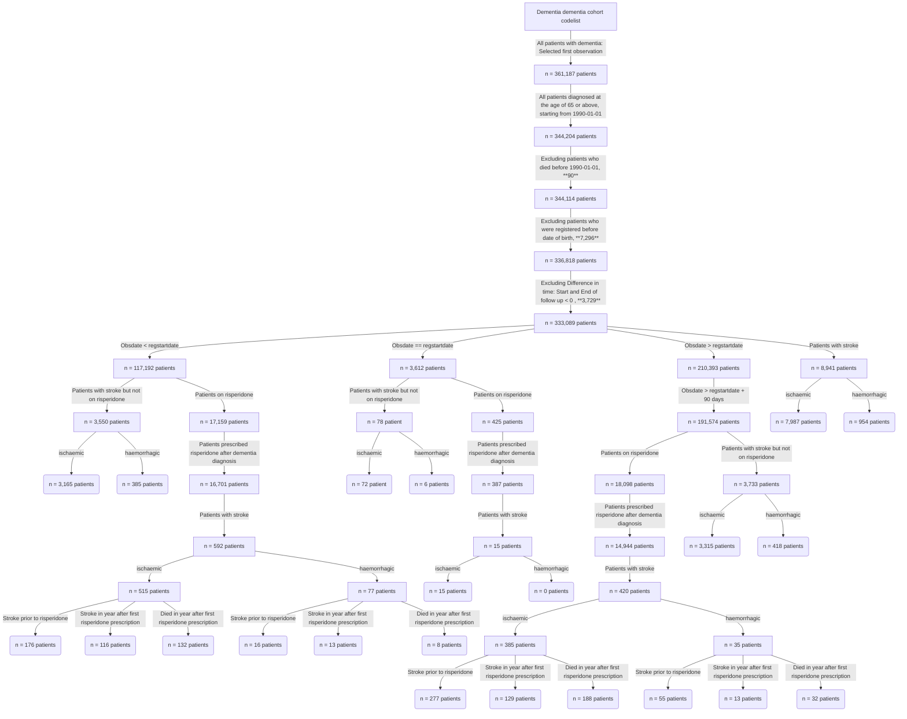
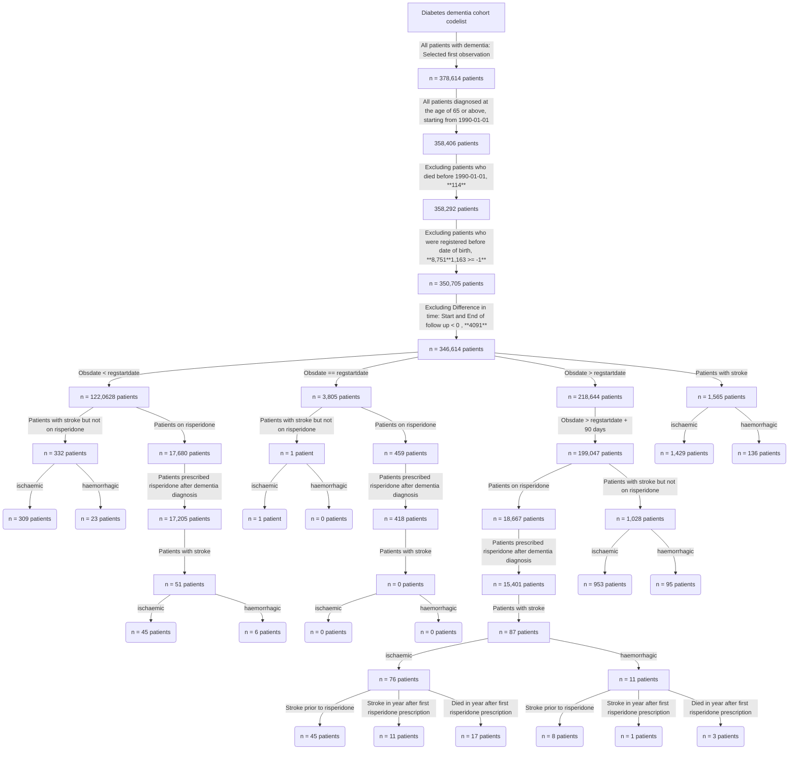

# Dementia dementia incident cohort

This repository will host the R scripts used to build the diabetes dementia incident cohort

Below we provide an overview of the methodology used to create the Dementia Dementia Incidence Cohort using data from the Clinical Practice Research Datalink (CPRD).

Originally, the CPRD dataset included a total of 361,187 patients diagnosed with dementia. To refine our cohort, we focused on individuals diagnosed after January 1, 1990, who were 65 years of age or older at the time of diagnosis. By applying this criterion, we were able to filter out 344,204 eligible patients from the dataset.

Exclusion criteria were applied to further narrow down the cohort: Individuals who died before January 10, 1990 (90 patients), individuals who were registered more than 12 months before their date of birth (7,296), and individuals with a negative difference between the start and end of the follow-up period (3,729 patients) were excluded. After all these steps, we have 333,089 patients diagnosed with dementia, 1565 suffered a stroke.

Within the remaining dataset, we specifically examined those patients who were diagnosed with dementia after registration. Of the 210,393 patients meeting these criteria, 191,574 were diagnosed three months after registration. Within this subgroup, 18,098 patients were prescribed the drug risperidone, with 14,944 receiving the prescription after being diagnosed with dementia.

Of these 14,944 patients, only 420 suffered a stroke, of which 385 were ischemic and 35 were hemorrhagic strokes. In contrast, of the 191,574 patients who were diagnosed with dementia after registration but not prescribed risperidone, 3,733 suffered a stroke, 3,315 of which were ischemic and 418 hemorrhagic strokes.
 

   
This flowchart below outlines the data processing steps and the number of instances under each step





# Diabetes Dementia Incident Cohort 

This repository will host the R scripts used to build the diabetes dementia incident cohort

Below we provide an overview of the methodology used to create the Diabetes Dementia Incidence Cohort using data from the Clinical Practice Research Datalink (CPRD).

Originally, the CPRD dataset included a total of 378,614 patients diagnosed with dementia. To refine our cohort, we focused on individuals diagnosed after January 1, 1990, who were 65 years of age or older at the time of diagnosis. By applying this criterion, we were able to filter out 358,406 eligible patients from the dataset.

Exclusion criteria were applied to further narrow down the cohort: Individuals who died before January 10, 1990 (114 patients), individuals who were registered more than 12 months before their date of birth (7588), and individuals with a negative difference between the start and end of the follow-up period (4,091 patients) were excluded. After all these steps, we have 346,614 patients diagnosed with dementia, 1565 suffered a stroke.


Within the remaining dataset, we specifically examined those patients who were diagnosed with dementia after registration. Of the 218 644 patients meeting these criteria, 199 047 were diagnosed three months after registration. Within this subgroup, 18,667 patients were prescribed the drug risperidone, with 15,401 receiving the prescription after being diagnosed with dementia.

Of these 15,401 patients, only 87 suffered a stroke, of which 76 were ischemic and 11 were hemorrhagic strokes. In contrast, of the 199,047 patients who were diagnosed with dementia after registration but not prescribed risperidone, 1,028 suffered a stroke, 953 of which were ischemic and 95 hemorrhagic strokes.
 

   
This flowchart below outlines the data processing steps and the number of instances under each step




The table below shows the descriptive statistics of study cohort

```latex
\begin{table}[!ht]
    \centering
    \begin{tabular}{|l|l|}
    \hline
        ​ & \textbf{Overall}​ \\ \hline
               \textbf{n}​ &      199047​ \\ \hline
        \textbf{Age of diagnosis (mean (SD))} &      82.25 (7.05)​ \\ \hline
        \textbf{Year of diagnosis category (\%)} & ​ \\ \hline
             1 (1990 - 1995)​ &      7787 (3.9)​ \\
             2​ (1996 - 2000) &      12954 (6.5)​ \\ 
             3​  (2001 - 2005)&      27539 (13.8)​ \\ 
             4​ (2006 - 2010)&      36404 (18.3)​ \\ 
             5​ (2011 - 2015) &      54028 (27.1)​ \\ 
             6​ (2016 - 2020) &      56572 (28.4)​ \\ 
             7​ (2021+) &      3763 (1.9)​ \\ \hline
        \textbf{Age category (\%)}​ & ​ \\ \hline
            65-74​ &     29586 (14.9)​ \\ 
            75-84​ &     90628 (45.5)​ \\ 
            85-94​ &     72325 (36.3)​ \\ 
            95+ ​ &     6508 (3.3)​ \\ \hline
        Sex = M (\%)​ &     71237 (35.8)​ \\ \hline
        Died (\%) &       90423(45)  \\ \hline
    \end{tabular}
\end{table}

```
The plot below shows the age distribution of the final cohort


This pie chart shows the number of patients who have died, indicated by the number 1, and 0 for those who are still alive.


Here we are showing the difference between the start of and end of follow-up distribution


The following graphs show the number of deaths per year for patients diagnosed 90 days after registration at the age of 65 years and above


This plot shows Survival analysis stratified by sex categories


This plot shows Survival analysis stratified by age categories.


# Patients on Risperidone
#### These are patients who started taking risperidone after being diagnosed with dementia
```latex
\begin{table}[!ht]
    \centering
    \begin{tabular}{|l|l|}
    \hline
        Risperidone cohort & ~ \\ \hline
        N & 15401 \\ \hline
        Stroke ever & 87 \\ \hline
        Stroke prior to risperidone & 53 \\ \hline
        Stroke in year after first risperidone prescription & 12 \\ \hline
        Died in year after first risperidone prescription & 20 \\ \hline
    \end{tabular}
\end{table}
```
The following graph shows the number of patients who have suffered a stroke while taking risperidone


The following graph shows the number of deceased patients who took risperidone


The gender distribution of patients on risperidone


The age distribution of patients who are on risperidone


