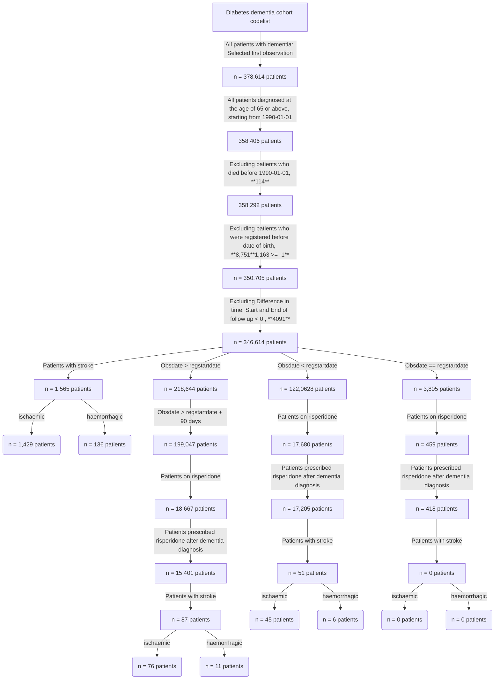

# Diabetes Dementia Incident Cohort 

This repository will host the R scripts used to build the diabetes dementia incident cohort

1. Data source: 358,406 patient records from the Clinical Practice Research Datalink (CPRD).
2. Inclusion criteria: Individuals diagnosed with dementia after age 65 after January 1, 1990, who have not taken risperidone before their diagnosis.
3. Of the 346,614 patients diagnosed with dementia, 1565 suffered a stroke.
 

   
This flowchart below outlines the data processing steps and the number of instances under each step



The table below shows the descriptive statistics of study cohort

```latex
\begin{table}[!ht]
    \centering
    \begin{tabular}{|l|l|}
    \hline
        ​ & \textbf{Overall}​ \\ \hline
               \textbf{n}​ &      199047​ \\ \hline
        \textbf{Age of diagnosis (mean (SD))} &      82.25 (7.05)​ \\ \hline
        \textbf{Year of diagnosis category (\%)} & ​ \\ \hline
             1 (1990 - 1995)​ &      7787 (3.9)​ \\
             2​ (1996 - 2000) &      12954 (6.5)​ \\ 
             3​  (2001 - 2005)&      27539 (13.8)​ \\ 
             4​ (2006 - 2010)&      36404 (18.3)​ \\ 
             5​ (2011 - 2015) &      54028 (27.1)​ \\ 
             6​ (2016 - 2020) &      56572 (28.4)​ \\ 
             7​ (2021+) &      3763 (1.9)​ \\ \hline
        \textbf{Age category (\%)}​ & ​ \\ \hline
            65-74​ &     29586 (14.9)​ \\ 
            75-84​ &     90628 (45.5)​ \\ 
            85-94​ &     72325 (36.3)​ \\ 
            95+ ​ &     6508 (3.3)​ \\ \hline
        Sex = M (\%)​ &     71237 (35.8)​ \\ \hline
        Died (\%) &       90423(45)  \\ \hline
    \end{tabular}
\end{table}

```
The plot below shows the age distribution of the final cohort


This pie chart shows the number of patients who have died, indicated by the number 1, and 0 for those who are still alive.


Here we are showing the difference between the start of and end of follow-up distribution


The following graphs show the number of deaths per year for patients diagnosed 90 days after registration at the age of 65 years and above


This plot shows Survival analysis stratified by sex categories


This plot shows Survival analysis stratified by age categories.


# Patients on Risperidone
#### These are patients who started taking risperidone after being diagnosed with dementia

The following graph shows the number of patients who have suffered a stroke while taking risperidone


The following graph shows the number of deceased patients who took risperidone


The gender distribution of patients on risperidone


The age distribution of patients who are on risperidone


